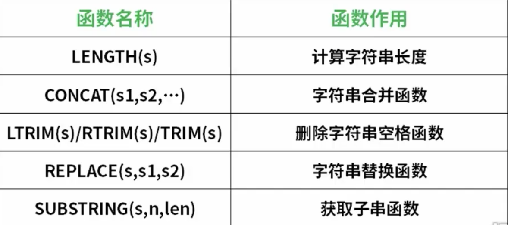

## 常用函数

### 1、常用字符串函数




### 2、常用日期时间函数


> EXTRACT（[year,month,day] from 字段）

* to_char函数 ：把时间戳转为字符串

	```mysql
	to_char(create_date, 'YYYY/MM/DD')
	to_char(create_date, ’HH12:MI:SS’)
	```

* to_date函数 ： 把字符串转化为实践

	```mysql
	to_date(’05 Jan 2015’,’DD Mon YYYY’)
	```

* to_timestamp函数 ： 把字符串转换成时间戳

	```mysql
	to_timestamp(’05 Jan 2015’, ’DD Mon YYYY’)
	```


### 3、常用数值函数


## 自定义函数

### 1、创建函数

```mysql
CREATE [OR REPLACE] FUNCTION function_name (type...)   
RETURNS return_datatype
LANGUAGE plpgsql AS 
$$  
  DECLARE  
    return_variable_value return_variable_type;  
  BEGIN  
    < function_body >  
    RETURN { variable_name | value }  
  END;
$$

或者

CREATE [OR REPLACE] FUNCTION function_name (type...)   
RETURNS return_datatype
AS '< function_body >;'
LANGUAGE plpgsql
RETURNS null on null input;#如果输入为null则返回null
```

* `[OR REPLACE]`：是可选的，它允许您修改/替换现有函数。
* `function_name`：指定函数的名称。
* `type`：是函数参数类型，多个使用,隔开。只有类型不需要参数变量
* `RETURNS`：它指定要从函数返回的数据类型。它可以是基础，复合或域类型，或者也可以引用表列的类型。
* `LANGUAGE plpgsql` ： 它指定实现该函数的语言的名称。
* `DECLARE` ： 声明函数处理逻辑中需要用到的变量，也可以是返回值
* `BEGIN`、`END`中包裹的就是函数的处理逻辑


`案例`

```mysql
create or replace function my_add(integer,integer)
returns integer as
$$
	begin
		return $1+$2;  # 参数使用$n来获取
	end;
$$	
language plpgsql;

select my_add(1,2);
```

```mysql
create or replace function concat_test(smallint,varchar)
returns varchar
as 'select $1||$2;'
language sql
returns null on null input;

select concat_test(x,str1_col) from test;
```


## 索引


### 1、索引分类

* **B-tree索引**

	适合处理那些能够顺序存储数据，比如按列进行某个规则查找，如果这一列数据特别分散，是非常适合该索引的

* Hash索引

	只能处理简单的等于比较，性能比较低，不常用

* GIST索引

	是一种索引架构，可以自定义索引策略，满足工作需要

* **GIN索引**

	是一种翻转索引，处理包含多个值的键，比如某一列是数组类型并创建索引，则适合GIN索引


### 2、索引创建/删除

> 默认创建索引类型为B-tree类型

```mysql
#创建
create index 索引名称 on 表名(字段名)
#删除
drop index 索引名称
```


## 视图

> 视图View是一种虚拟存在的表，视图并不存在数据库中实际存在，行和列数据来自于定义视图的查询中使用到的表，简单来讲，视图就是一条自定义SQL语句的结果集，是动态的生成的(因为数据在变化)。
>
> 既然视图就是一条SQL语句，那为什么不直接写SQL查询呢？当面对复杂关联查询时SQL语句会很复杂，视图堆复杂SQL语句进行封装，然后进行简单调用即可。代码层面干净整洁。

`特点`

* 简单化

	> 调用简单

* 安全化

	> 对外提供不需要提供敏感表数据相关信息，只需要提供视图即可

* 逻辑数据独立性

	> 如果操作逻辑发生修改，不需要修改业务代码，只需要修改视图逻辑即可

### 1、视图创建/删除

```mysql
# 创建
create view 视图名称 as <SQL语句 >
#eg : create view my_view as select n,z from test order by n desc
# 删除
drop view 视图
```

### 2、视图调用

```mysql
select * from my_view
```


## 约束

* 主键外键约束

	不允许字段重复，相比唯一约束，不允许字段为null，只能有一个主键约束

* 非空约束

	字段 字段类型  not null

* 唯一约束

	字段 字段类型 unique 

	> 不允许字段重复，但是可以为null，并且有多个唯一约束字段

* 默认值约束

	字段 字段类型 default 默认值

	> Eg ： create table demo(
	>
	> ​	。。。
	>
	> ​	salary numeric(9,2) default 0.0
	>
	> )
