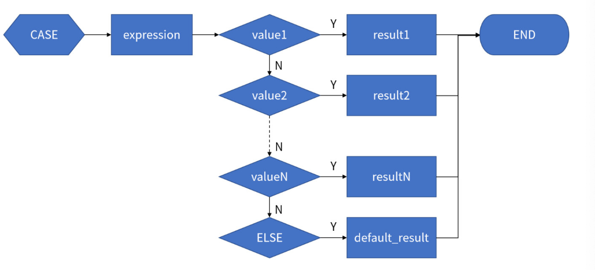
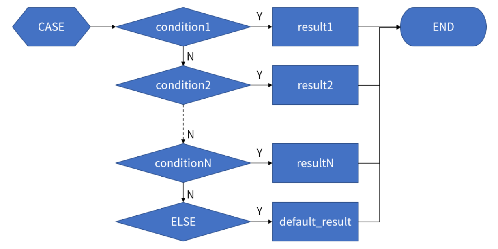
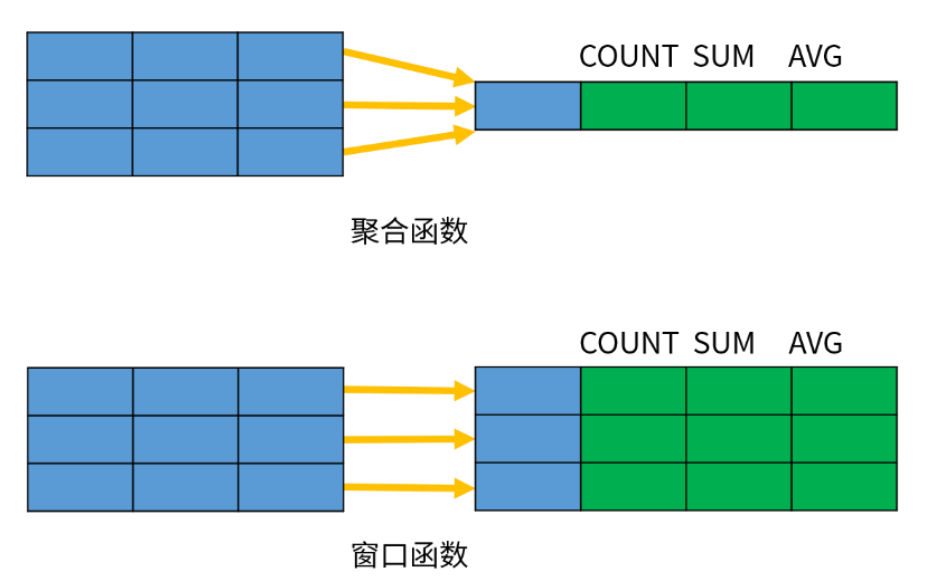
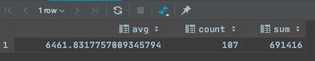
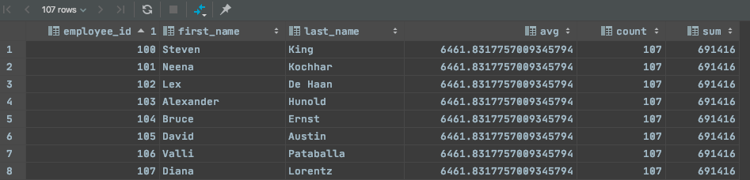
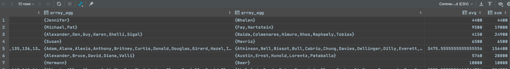
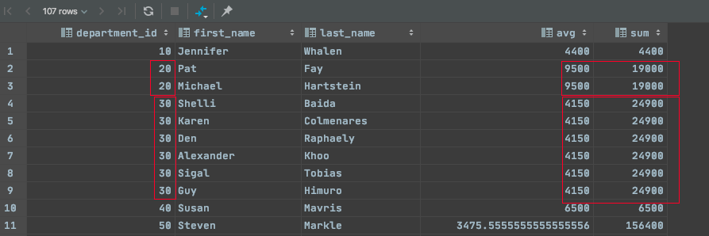
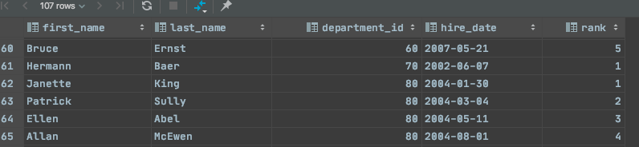

# CASE条件表达式

## 简单CASE条件表达式

### 语法

```bash
CASE expression
WHEN value1 THEN result1
WHEN value2 THEN result2
[...]
[ELSE default_result]
END;
```





> 类似于 Java中的 switch


`eg`

```sql
SELECT first_name,
last_name,
CASE department_id
WHEN 10 THEN 'Administration'
WHEN 20 THEN 'fsdfsd'
WHEN 30 THEN 'Purchasing'
ELSE 'Others' END AS department_name
FROM employees;
```


## 搜索CASE条件表达式


### 语法

```sql
CASE
WHEN condition1 THEN result1
WHEN condition2 THEN result2
...
[ELSE default_result]
END
```



> 类似于Java中的if .. elseif ..else


`eg`

```sql
SELECT e.first_name,
e.last_name,
e.salary,
CASE
WHEN e.salary < 5000 THEN '低'
WHEN e.salary < 15000 THEN '中'
ELSE '高'
END AS salary_level
FROM employees e;
```


# 集合运算

## union

> UNION 操作符用于将两个<font color=ff00aa>字段一样的</font>查询结果合并成一个结果集，返回出现在第一个查询或者出现在第二个查询中的数据

`语法`

```sql
SELECT column1, column2
FROM table1
UNION [DISTINCT | ALL]
SELECT col1, col2
FROM table2;
```

* DISTINCT 表示将合并后的结果集进行去重,默认为去重
* ALL 表示保留结果集中的重复记录


## INTERSECT

> INTERSECT 操作符用于返回两个查询结果中的共同部分，即同时出现在第一个查询结果和第二个查询结果中的数据

`语法`

```sql
SELECT column1, column2
FROM table1
INTERSECT [DISTINCT | ALL]
SELECT col1, col2
FROM table2;
```


## EXCEPT

> EXCEPT 操作符用于返回出现在第一个查询结果中，但不在第二个查询结果中的数据

`语法`

```sql
SELECT column1, column2
FROM table1
EXCEPT [DISTINCT | ALL]
SELECT col1, col2
FROM table2;
```


# CTE（WITH查询）

## 递归CTE

> cte可以不递归查询，其作用就是用来代替关联查询。着重介绍递归CTE，用来递归查询表中数据，非常高效有用


`语法`

```sql
WITH RECURSIVE cte_name AS(
cte_query_initial -- 初始化部分
UNION [ALL]
cte_query_iterative -- 递归部分
) SELECT * FROM cte_name;
```

• RECURSIVE 表示递归；
• cte_query_initial 是初始化查询，用于创建初始结果集；
• cte_query_iterative 是递归部分，可以引用 cte_name；
• 如果递归查询无法从上一次迭代中返回更多的数据，将会终止递归并返回结果。


`eg`

```sql
# 生成1-10数字
with recursive create_num(n) as (
    values (1) --定义初始值 n = 1
    union all  --合并结果集
    select n + 1 from create_num where n < 10
)select * from create_num
```

• 执行 CTE 中的初始化查询，生成一行数据（1）；
• 第一次执行递归查询，判断 n < 10 成立，生成一行数据 2（n+1）；
• 重复执行递归查询，生成更多的数据；直到 n = 10 终止；此时临时表 t 中包含 10 条数据；
• 执行主查询，返回所有的数据。

> 注意，如果没有指定终止条件，上面的查询将会进入死循环。


`eg`

```sql
-- 遍历组织树
with recursive org_tree(employee_id, employee_name, path) as (
    select employee_id, CONCAT(first_name, ',', last_name), CONCAT(first_name,',', last_name) AS path
    FROM employees
    WHERE manager_id IS NULL
    union all
    SELECT e.employee_id, CONCAT(e.first_name, ',', e.last_name),CONCAT(ep.path, '->', e.first_name, ',', e.last_name)
    FROM org_tree ep
    JOIN employees e ON ep.employee_id = e.manager_id
)select * from org_tree
```

• 第三行 ：获取跟组织并生成数据放入org_tree表
• 第七行 ：关联查询org_tree和employees获取到跟组织下级数据并生成放入org_tree表，这些数据再次递归org_tree方法再次生成数据放入org_tree表
• 第六行 ：所有跟组织数据均生成后与跟组织合并
• 第十行 ：执行 主查询，返回所有的数据。


# 窗口函数

> 除了聚合函数之外， SQL 还定义了许多专门用于数据分析的窗口函数（Window Function）。不过，窗口函数不是将一组数据汇总为单个结果， 而是针对每一行数据，基于和它相关的一组数据计算出一个结果。下图演示了聚合函数和窗口函数的区别：




`eg`

```sql
# 计算部门平均工资，总行数、总工资和
SELECT AVG(salary), COUNT(*), SUM(salary)
FROM employees;
```



```sql
SELECT employee_id,first_name, last_name, AVG(salary) OVER (), COUNT(*) OVER(), SUM(salary) OVER ()
FROM employees;
# 将over()修饰的聚合函数值赋值给每一行数据
```




## 窗口函数OVER()

> OVER包含三个参数：

### 分区选项（PARTITION BY）

PARTITION BY 选项用于定义分区，作用类似于 GROUP BY 的分组。如果指定了分区选项，窗口函数将会分别针对每个分区单独进行分析；如果省略分区选项，所有的数据作为一个整体进行分析。<font color=ff00aa>不指定分区就是上面的案例，将所有部门进行整体分析后赋值给每行数据，如果指定分区，则将分区中数据进行分析并赋值给分区中每行数据</font>

`eg`

```sql
# 统计每个部门员工平均工资、工资总和
select array_agg(distinct employee_id) , array_agg(distinct first_name) , array_agg(distinct last_name ), avg(salary) , sum(salary) from employees group by department_id;
```




```sql
# 统计每个部门员工平均工资、工资总和 并赋值给各部门每行
select department_id , first_name , last_name , avg(salary) OVER(PARTITION BY department_id), sum(salary) OVER(PARTITION BY department_id) from employees ；
```




## 排名顺序（ORDER BY）

```sql
SELECT first_name, last_name, department_id, hire_date,
RANK() OVER (PARTITION BY department_id ORDER BY hire_date)
FROM employees
ORDER BY department_id;
```




## 窗口选项（frame_clause）

> frame_clause 选项用于在当前分区内指定一个计算窗口。指定了窗口之后，分析函数不再基于分区进行计算，而是基于窗口内的数据进行计算。以下示例用于计算每个产品当当前月份的累计销量（示例数据）

```sql
SELECT product AS "产品", ym "年月", amount "销量",
SUM(amount) OVER (PARTITION BY product ORDER BY ym ROWS BETWEEN UNBOUNDED
PRECEDING AND CURRENT ROW)
FROM sales_monthly
ORDER BY product, ym;
产品|年月 |销量 |sum |
----|------|--------|---------|
桔子|201801|10154.00| 10154.00|
桔子|201802|10183.00| 20337.00|
桔子|201803|10245.00| 30582.00|
桔子|201804|10325.00| 40907.00|
桔子|201805|10465.00| 51372.00|
桔子|201806|10505.00| 61877.00|
```

> 其中， PARTITION BY 选项表示按照产品进行分区； ORDER BY 选项表示按照日期进行排序；窗口子句 ROWS BETWEEN UNBOUNDED PRECEDING AND CURRENT ROW 指定窗口从当前分区的第一行开始到当前行结束；因此 SUM 函数计算的是产品累计到当前月份为止的销量合计