# 常用函数

## 批量插入数据 generate_series

`语法`

| 函数                                        | 参数类型                              | 返回类型                                                     | 描述                                          |
| ------------------------------------------- | ------------------------------------- | ------------------------------------------------------------ | --------------------------------------------- |
| generate_series(start, stop)                | int 或 bigint                         | setof int 或 setof bigint(与参数类型相同)                    | 生成一个数值序列，从start 到 stop，步进为一   |
| generate_series(start, stop, step)          | int 或 bigint                         | setof int 或 setof bigint(与参数类型相同)                    | 生成一个数值序列，从start 到 stop，步进为step |
| generate_series(start, stop, step_interval) | timestamp or timestamp with time zone | timestamp 或 timestamp with time zone(same as argument type) | 生成一个数值序列，从start 到 stop，步进为step |


## 批量生成随机数

```sql
select random()  from generate_series(1,5);
```

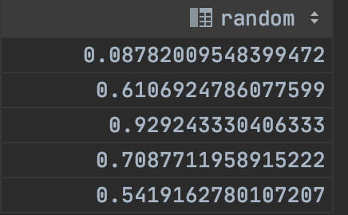

## 批量生成数字

```mysql
select generate_series(1,10) --生成《1 - 10》 的行数据
```

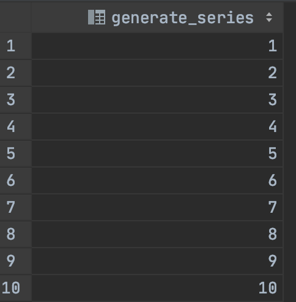


```sql
-- 生成1-10行数据且间隔为3
select generate_series(1,10,3)
```

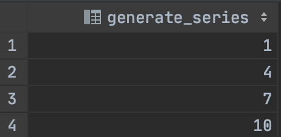


```sql
-- 生成1-10行数据且间隔为3且为倒叙
select generate_series(10,1, -3)
```

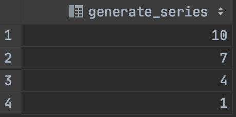


## 批量生成日期

```sql
-- 批量生成从今天开始七天的日期
select generate_series(now(), now() + '7 days', '1 day');
```

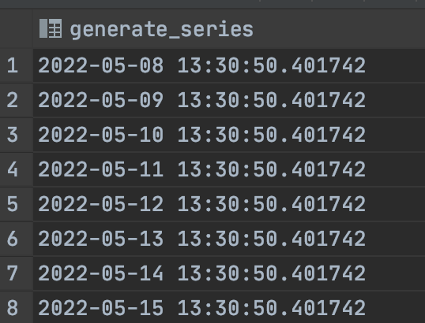

```sql
-- 批量生成指定范围内时间，且指定间隔时间
select generate_series(to_date('20130403','yyyymmdd'), to_date('20130404','yyyymmdd'), '3 hours');
```

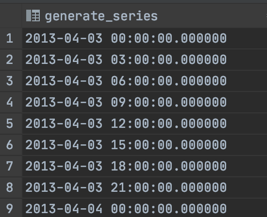


## 批量生成IP

```sql
-- 预制数据
create table tbl_david(id int, ip_start inet, ip_stop inet);
insert into tbl_david values (1, '192.168.1.6', '192.168.1.10');
insert into tbl_david values (2, '192.168.2.16', '192.168.2.20');  
insert into tbl_david values (3, '192.168.3.116', '192.168.3.120'); 
-- 生成IP
select id, generate_series(0, ip_stop-ip_start)+ip_start as ip_new from tbl_david
```


## 随机字符串

```sql
# 生成指定长度的字符串
create or replace function f_random_str(length INTEGER) 
returns character varying AS $$
DECLARE
    result varchar(50);
BEGIN
    SELECT array_to_string(ARRAY(SELECT chr((65 + round(random() * 25)) :: integer)
    FROM generate_series(1,length)), '') INTO result;
    
    return result;
END;
$$ LANGUAGE plpgsql;
```

```sql
md5(random()::text) 
```


## 随机中文

```sql
create or replace function gen_hanzi(int) returns text as $$    
declare    
  res text;    
begin    
  if $1 >=1 then    
    select string_agg(chr(19968+(random()*20901)::int), '') into res from generate_series(1,$1);    
    return res;    
  end if;    
  return null;    
end;    
$$ language plpgsql strict;
```


# DML

## 返回插入的数据

```sql
insert into users(id,name, email) VALUES
(50001,'haha','22015@qq.com')
returning id,name,email,password;
```


## 返回更新后的数据

```sql
returing 指定字段
```


## 跨表更新

`注意`

1. 不能使用关联（left|right join），必须使用自然连接方式进行跨表更新
2. 更新的表不能出现关联表中

`eg`

```sql
update employees e
set email = 'SKING.up'
from departments,
     jobs
where departments.department_id = e.department_id
  and jobs.job_id = e.job_id
  and e.employee_id = 100
  and job_title = 'President'
--更新表 employees并没有出现在 关联表中 即from后面的表           
```

```sql
update employees e
set email = 'SKING.up'
from employees
         inner join departments d on d.department_id = employees.department_id
         inner join jobs on employees.job_id = jobs.job_id
    and e.employee_id = 100
    and job_title = 'President'
-- from后不得出现关联表，只能自然连接 
```

## 跨表删除

```sql
delete
from employees e using departments d
where e.department_id = d.department_id
  and e.employee_id = 206
  and d.department_name = 'Higgins'

-- 等同于子查询

delete
from employees e
where e.employee_id = 206
  and e.department_id = (select department_id from departments where department_name = 'Higgins')
```


## 返回被删除的数据

```sql
delete
from employees e using departments d
where e.department_id = d.department_id
  and e.employee_id = 206
  and d.department_name = 'Accounting'
returning e.first_name,e.last_name
```

> 注意 ： 只能删除被删除表中数据


## <font color=ff00aa>合并数据</font>

`语法`

```sql
INSERT INTO table_name(column1, column2, ...)
{VALUES (value1, value2, ...) | SELECT ...}
ON CONFLICT conflict_target conflict_action;
```

* conflict_target 是判断数据是否已经存在的条件
* conflict_action 表示冲突时采取的操作：
	* DO NOTHING，如果数据已经存在，不做任何操作；
	* DO UPDATE SET，如果数据已经存在，更新该数据；可以使用 WHERE 子句进一步限
		制需要更新的数据

`eg`

```sql
-- 没有merge操作前
insert into users(id, name, email)
VALUES (50001, 'haha', '22015@qq.com')
returning id,name,email,password;

[23505] ERROR: duplicate key value violates unique constraint "users_pkey" 详细：Key (id)=(50001) already exists.
```

```sql
-- 有merge语法后 如果存在相同ID则不插入
insert into users(id, name, email)
VALUES (50001, 'haha', '22015@qq.com')
on CONFLICT (id)
    do NOTHING
returning id,name,email

-- 有merge语法后 如果存在相同ID则更新
insert into users(id, name, email)
VALUES (50001, 'haha', '22015@qq.com')
on CONFLICT (id)
do update set name = 'haha.update', email = 'haha.@qq.com'
returning id,name,email
```


# 事务和并发控制

## 事务

### ACID

> 数据库中的事务具有原子性（Atomicity）、一致性（Consistency）、隔离性（Isolation）以及持久性（Durability），也就是 ACID 属性


### 数据库持久化流程

> 数据库持久化流程大致为：数据库在进行持久化的时候并不是直接进行io操作，而是使用了缓存区提交读写效率，【事务、缓存区、事务日志文件】。并且在读取时先会判断内存中是否存在同样数据，如果存在则读取内存中数据

### 并发与隔离

> 事务隔离的来源，为了解决数据最终一致性，提出了事务的概念，每一个事务具有ACID属性。当事务存在并发时，由于持久化时暂存在内存中且数据对于多个事务共享，带来如下问题：


### 事务并发带来的问题

`场景1`

事务A读取了事务B内存中数据，事务B回滚。即事务A读取到了事务B的脏数据


`场景2`

事务A 读取了事务B内存中数据，事务B又修改数据后提交。即事务A读取到了事务B历史数据，不可重复读


`场景3`

事务A 读取数据前，事务B提交数据到内存中，事务A再次查询数据发现数据一变化。幻读


`场景4`

两个事务更新相同的数据，事务A提交到内存中为commit，事务B也提交到内存中且把事务A的数据覆盖然后提交，即事务A提交的数据丢失。更新丢失


### 解决并发事务带来的问题

> 为了解决并发问题， SQL 标准定义了 4 种不同的事务隔离级别（从低到高）

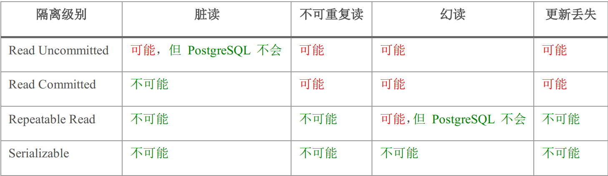

事务的隔离级别从低到高依次为：

* Read Uncommitted（读未提交） ：最低的隔离级别，实际上就是不隔离，任何事务都可以看到其他事务未提交的修改；该级别可能产生各种并发异常。不过， PostgreSQL 消除了 Read Uncommitted 级别时的脏读，因为它的实现等同于 Read Committed。
* Read Committed（读已提交） ：一个事务只能看到其他事务已经提交的数据，解决了脏读问题，但是存在不可重复读、幻读和第二类更新丢失问题。<font color = ff00aa>这是 PostgreSQL 的默认隔离级别。</font>
* Repeated Read（可重复读） ：一个事务对于同某个数据的读取结果不变，即使其他事务对该数据进行了修改并提交；不过如果其他事务删除了该记录，则无法再查询到数据（幻读）。 SQL 标准中的可重复读可能出现幻读，但是 PostgreSQL 在可重复读级别消除了幻读。
*  Serializable（可串行化） ：最高的隔离级别，事务串行化执行，没有并发。

> <font color = ff00aa>演示事务隔离级别解决各种并发问题，移步到 ：[演示事务隔离级别](../../MySQL/第六章-TCL语言.md) </font>


### 事务命令

```mysql
############### 客户端
#查看默认事务
show default_transaction_isolation
#查看当前事务
show transaction_isolation;

################ psql  -- docker
#查看事务
SELECT name,setting FROM pg_settings WHERE name='default_transaction_isolation';
select current_setting('default_transaction_isolation');

#修改全局事务
1.修改postgresql.conf文件中的default_transaction_isolation参数。
2.alter system set default_transaction_isolation to 'REPEATABLE READ';
2.select pg_reload_conf();
#修改会话事务
set session characteristics as transaction isolation level read uncommitted;
```

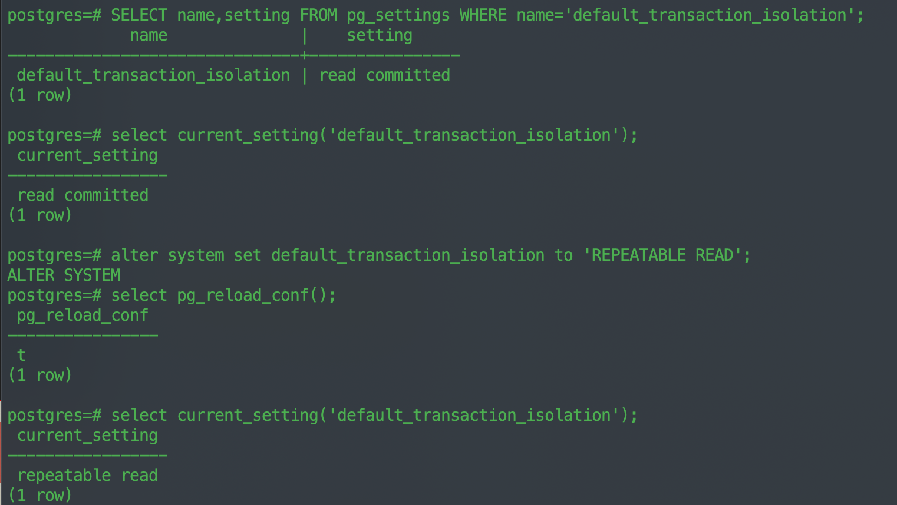


# 索引与优化

> 索引（Index）可以用于提高数据库的查询性能；但是索引也需要进行读写，同时还会占用更多的存储空间；因此了解并适当利用索引对于数据库的优化至关重要


## 索引引入

### 准备1000w数据表

```sql
CREATE TABLE test (
id integer,
name text
);
insert into test(id, name) select t,'王-'||t from generate_series(1,10000000) t;
```


### 演示1000w数据没有索引查询效率

```sql
select * from test where id = 100000
[2022-05-08 21:48:59] 1 row retrieved starting from 1 in 2 s 536 ms (execution: 2 s 521 ms, fetching: 15 ms)
```


### 演示1000w数据有索引查询效率

```sql
-- 创建索引
CREATE INDEX test_id_index ON test (id);
select * from test where id = 100000
[2022-05-08 21:50:10] 1 row retrieved starting from 1 in 19 ms (execution: 6 ms, fetching: 13 ms)
```


## 索引类型

> ostgreSQL 提高了多种索引类型：` B-树`、`哈希`、 `GiST`、` SP-GiST`、 `GIN` 以及 `BRIN` 索引。==每种索引基于不同的存储结构和算法，用于优化不同类型的查询==。默认情况下， PostgreSQL 创建`B-树索引`，因为它适合大部分情况下的查询

...略


## 索引形式

### 唯一索引

> 在创建索引时，可以使用 UNIQUE 关键字指定唯一索引。主键自动创建唯一索引

```sql
CREATE UNIQUE INDEX index_name
ON table_name (column_name [ASC | DESC] [NULLS FIRST | NULLS LAST]);
```

### 多列索引 | 复合索引

> PostgreSQL 支持基于多个字段的索引，也就是多列索引（复合索引）。默认情况下，一个多列索引最多可以使用 32 个字段。只有 B-树、 GIST、 GIN 和 BRIN 索引支持多列索引。

```sql
CREATE [UNIQUE] INDEX index_name ON table_name
[USING method]
(column1 [ASC | DESC] [NULLS FIRST | NULLS LAST], ...);
```

> 对于多列索引，应该将最常作为查询条件使用的字段放在左边，较少使用的字段放在右边。[<font color=ff00aa>注意最左前缀法则、以及索引失效</font>](../../MySQL/第十二章-SQL优化.md)

### 函数索引

> 函数索引，也叫表达式索引，是指基于某个函数或者表达式的值创建的索引。

`语法`

```sql
CREATE [UNIQUE] INDEX index_name
ON table_name (expression);
```


`演示大数据函数耗时操作`

```sql
-- 根据name查询
SELECT * FROM test WHERE name ='王-10000'
[2022-05-08 22:11:22] 1 row retrieved starting from 1 in 2 s 417 ms (execution: 2 s 403 ms, fetching: 14 ms)
```

```sql
-- 根据name查询并加入函数
SELECT * FROM test WHERE upper(name) ='王-10000'
[2022-05-08 22:11:01] 1 row retrieved starting from 1 in 9 s 742 ms (execution: 9 s 727 ms, fetching: 15 ms)
```

> :stuck_out_tongue: 可见大数据量函数处理也会耗时，如何处理？ 给函数添加索引。再次演示函数索引后查询效率


`演示函数加入索引`

```sql
-- 创建函数索引
CREATE unique INDEX upper_index
ON test (upper(name));
-- 演示
SELECT * FROM test WHERE upper(name) ='王-10000'
[2022-05-08 22:18:47] 1 row retrieved starting from 1 in 28 ms (execution: 13 ms, fetching: 15 ms)
```

### 部分索引

> 部分索引（partial index）是只针对==表中部分数据行==创建的索引，通过一个 WHERE 子句指定需要索引的行。例如，对于订单表 orders，绝大部的订单都处于完成状态；我们只需要针对未完成的订单进行查询跟踪，可以==创建一个针对于未完成数据==的`部分索引`：


### 覆盖索引

> PostgreSQL 中的索引都属于二级索引，==意味着索引和数据是分开存储的。因此通过索引查找数据即需要访问索引，又需要访问表，而表的访问是随机 I/O==。为了解决这个性能问题， PostgreSQL 支持 Index-Only Scan，只需要访问索引的数据就能获得需要的结果，而不需要再次访问表中的数据

```sql
CREATE TABLE t (a int, b int, c int);
CREATE UNIQUE INDEX idx_t_ab ON t USING btree (a, b) INCLUDE (c);
```

## 索引命令

```sql
--创建索引
CREATE INDEX index_name ON table_name
[USING method]
(column_name [ASC | DESC] [NULLS FIRST | NULLS LAST]);
```

• index_name 是索引的名称， table_name 是表的名称；
• method 表示索引的类型，例如 btree、 hash、 gist、 spgist、 gin 或者 brin。默认为 btree；
• column_name 是字段名， ASC 表示升序排序（默认值）， DESC 表示降序索引；
• NULLS FIRST 和 NULLS LAST 表示索引中空值的排列顺序，升序索引时默认为 NULLS LAST，降序索引时默认为 NULLS FIRST。

```sql
-- 查看索引
SELECT * FROM pg_indexes WHERE tablename = 'test';
```

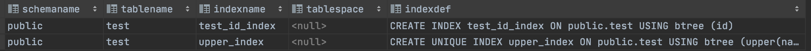

```sql
-- 修改索引
ALTER INDEX index_name RENAME TO new_name;
ALTER INDEX index_name SET TABLESPACE tablespace_name;
-- 删除索引
DROP INDEX index_name [ CASCADE | RESTRICT ];
-- eg删除test索引
DROP INDEX test_id_index, test_name_index;
```


# 视图

==视图（View）本质上是一个存储在数据库中的查询语句==。==视图本身不包含数据，也被称为虚拟表==。 我们在创建视图时给它指定了一个名称，然后可以像表一样对其进行查询。

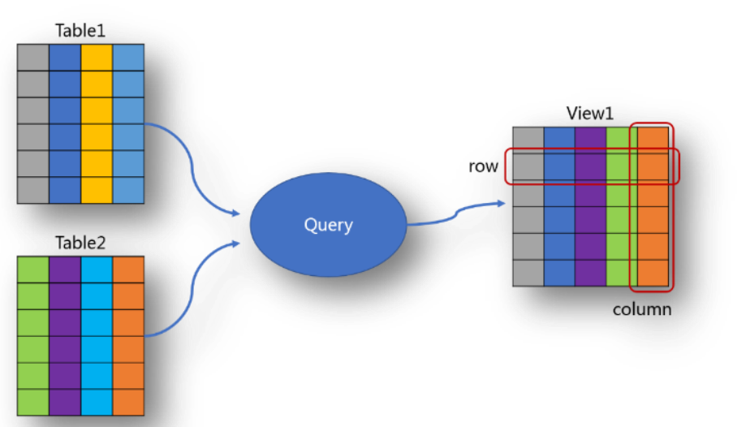

合理使用的视图可以给我们带来以下好处：

* 替代复杂查询，减少复杂性。将复杂的查询语句定义为视图，然后使用视图进行查询，可以隐藏具体的实现；
* 提供一致性接口，实现业务规则。在视图的定义中增加业务逻辑，对外提供统一的接口；当底层表结构发生变化时，只需要修改视图接口，而不需要修改外部应用，可以简化代码的维护并减少错误；
* 控制对于表的访问，提高安全性。通过视图为用户提供数据访问，而不是直接访问表；同时可以限制允许访问某些敏感信息，例如身份证号、工资等。


## 视图命令

```sql
-- 创建视图
CREATE VIEW view_name AS query;
```

`eg`

```sql
CREATE VIEW emp_details_view
AS SELECT
e.employee_id,
e.job_id,
e.manager_id,
e.department_id,
d.location_id,
e.first_name,
e.last_name,
e.salary,
e.commission_pct,
d.department_name,
j.job_title
FROM employees e
JOIN departments d ON (e.department_id = d.department_id)
JOIN jobs j ON (j.job_id = e.job_id);
```


```sql
-- 修改视图
CREATE OR REPLACE VIEW view_name
AS
query
-- 修改视图
ALTER VIEW emp_details_view RENAME TO emp_info_view;
-- 增加一个hire_date字段
```

`eg`

```sql
CREATE OR REPLACE VIEW emp_details_view
AS SELECT
e.employee_id,
e.job_id,
e.manager_id,
e.department_id,
d.location_id,
e.first_name,
e.last_name,
e.salary,
e.commission_pct,
d.department_name,
j.job_title,
e.hire_date
FROM employees e
JOIN departments d ON (e.department_id = d.department_id)
JOIN jobs j ON (j.job_id = e.job_id);
```


```sql
-- 删除视图
DROP VIEW [ IF EXISTS ] name [ CASCADE | RESTRICT ];
```


## 可更新视图


# 存储过程

存储过程是`过程`和`函数`的统称。

`好处`

* 减少应用和数据库之间的网络传输。所有的 SQL 语句都存储在数据库服务器中，应用程
	序只需要发送函数调用并获取除了结果，避免了发送多个 SQL 语句并等待结果。
* 提高应用的性能。因为自定义函数和存储过程进行了预编译并存储在数据库服务器中。
* 可重用性。存储过程和函数的功能可以被多个应用同时使用

`缺点`

* 导致软件开发缓慢。因为存储过程需要单独学习，而且很多开发人员并不具备这种技能。
* 不易进行版本管理和代码调试。
* 不同数据库管理系统之间无法移植，语法存在较大的差异。


# 触发器

触发器分为`事件触发器`和`数据触发器`,使用最多的是`数据触发器`。其中数据触发器又分为`行级（ row-level）触发器`和`语句级（ statement-level）触发器`。这两者的区别在于触发的时机和触发次数。eg:对于一个影响 20 行数据的 UPDATE 语句，行级触发器将会触发器 20 次，而语句级触发器只会触发 1 次。


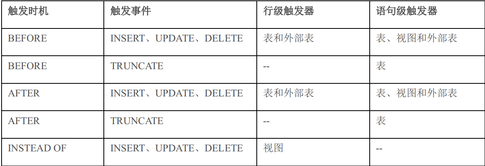


## 触发器命令

```sql
-- 创建触发器 分成两步 1.创建触发器函数 2.创建触发器，条件成立则执行触发器函数
CREATE [ OR REPLACE ] FUNCTION trigger_function ()
RETURNS trigger
AS $$
DECLARE
declarations
BEGIN
statements;
...
END; $$
LANGUAGE plpgsql;

--以上为创建触发器函数。触发器函数与普通函数的区别在于它没有参数，并且返回类型为 trigger；

CREATE TRIGGER trigger_name
{BEFORE | AFTER | INSTEAD OF} {event [OR ...]}
ON table_name
[FOR [EACH] {ROW | STATEMENT}]
[WHEN ( condition ) ]
EXECUTE FUNCTION trigger_function;
```

* event 可以是 INSERT、 UPDATE、 DELETE 或者 TRUNCATE， UPDATE 支持特定字段（ UPDATE OF col1, clo2）的更新操作；
* 触发器可以在事件之前（ BEFORE）或者之后（ AFTER）触发
* FOR EACHROW 表示行级触发器， FOR EACH STATEMENT 表示语句级触发器；
*  WHEN 用于指定一个额外的触发条件，满足条件才会真正支持触发器函数。


```sql
-- 修改触发器
ALTER TRIGGER name ON table_name RENAME TO new_name;
-- 禁用和启用触发器
ALTER TABLE table_name
{ENABLE | DISABLE} TRIGGER {trigger_name | ALL | USER};
```


```sql
-- 删除触发器
drop trigger trg_employees_change on employees;
```

