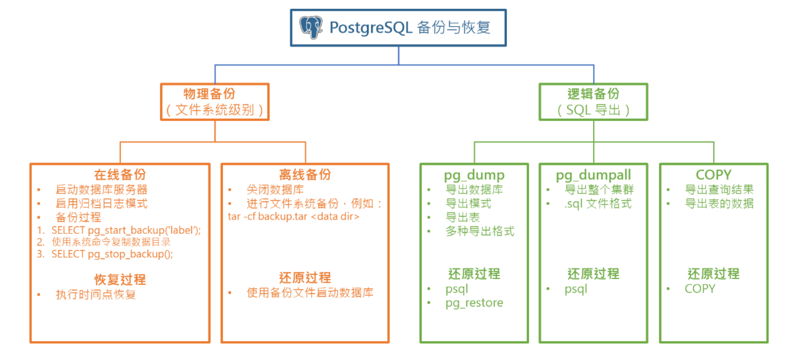

## 概念

### 物理备份和逻辑备份

* 物理备份

	直接复制数据库文件,速度快,占用空间大

* 逻辑备份

	将数据库中的结构和数据导出SQL文件,还原时通过SQL语句和命令重建数据并恢复数据,耗时,空间小

### 在线备份和离线备份

* 在线备份

	PostgreSQL 服务器处于启动状态时的备份，也称为热备份（Hot Backup）。由于逻辑备份需要连接到数据库进行操作，因此逻辑备份只能是在线备份。

* 离线备份

	服务器关闭时备份,离线备份只能是物理备份


### 全量备份和增量备份

* 全量备份

	备份所有的数据库文件,耗时,内容多,但是恢复快

* 增量备份

	备份上一次备份（任何类型）之后改变的文件。另外，差异备份（Differential Backup） 是针对上一次完全备份后发生变化的所有文件进行备份。


### 备份工具




## 逻辑备份与还原

pg_dump支持四种格式:

* plain ：纯文本形式的 SQL 脚本，使用psql还原
* custom ：自定义格式，使用 pg_restore 还原
* directory ：目录格式，使用 pg_restore还原
* tar ：打包格式，输出一个 tar 格式的归档，还原时使用 pg_restore 工具

### 备份单个数据库

`环境`

1. docker安装postgres
2. 创建数据库mydb
3. 创建若干表

`备份-操作`

1. 进入docker-postgres

	```dockerfile
	docker exec -it postgres /bin/bash
	```

2. 使用postgres用户备份mydb数据库

	```bash
	pg_dump -U postgres mydb > /tmp/mydb.sql
	```

3. 将备份文件传出容器

	```bash
	# 退出容器，进入宿主机
	[root@localhost /]# docker ps
	CONTAINER ID   IMAGE           COMMAND                  CREATED       STATUS       PORTS                                       NAMES
	8cb652cdef14   postgres:12.8   "docker-entrypoint.s…"   5 hours ago   Up 5 hours   0.0.0.0:5432->5432/tcp, :::5432->5432/tcp   pgsql
	[root@localhost /]# docker cp 8cb6:/tmp/mydb.sql /root/file/
	```

	

`还原-操作`

1. 物理机拷贝SQL文件到容器

	```bash
	docker cp mydb.sql 4c8e:/tmp/
	```

2. psql还原

	```bash
	psql -U postgres -f mydb.sql
	```

	> 这里会遇到很多问题：1. 覆盖导入，存在会报错  2. SQL文件中加入 “\c 目标数据库” 3. 禁用外键


### 数据传输

```bash
pg_dump -h host1 dbname | psql -h host2 dbname
```


### 备份整个集群

```bash
pg_dumpall -U postgres > /tmp/cluster.sql
```


```bash
root@8cb652cdef14:/# time pg_dumpall -U postgres > /tmp/all.sql
real    0m0.494s
user    0m0.078s
sys     0m0.036s
root@8cb652cdef14:/# 
```


### 备份整个数据库并压缩

```bash
time pg_dumpall -U postgres | gzip > /tmp/all.sql.gz
```


### 导出表数据

```bash
pg_dump -t 'emp*' -T employees testdb > testdb_table.sql
# 导出所有emp*的数据并排除employees表
```

