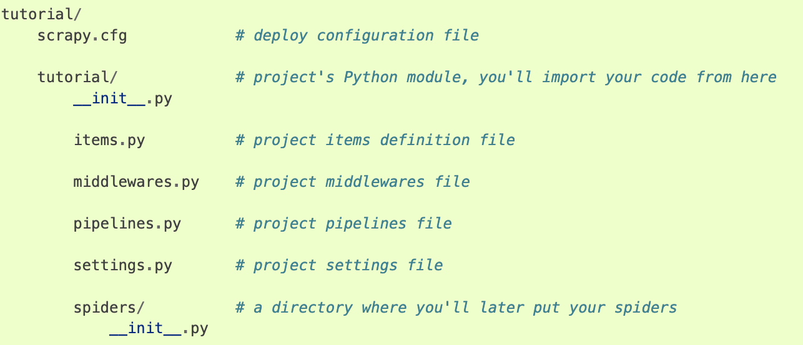
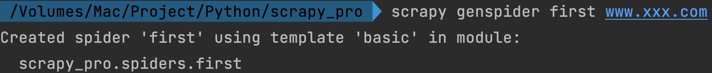
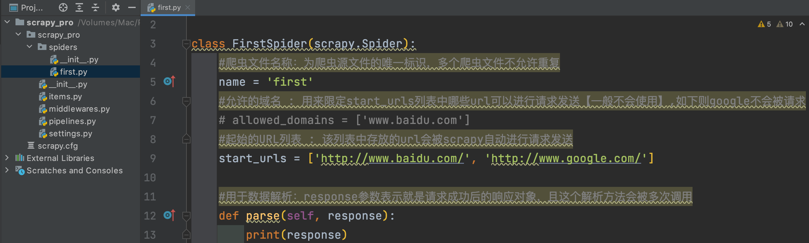
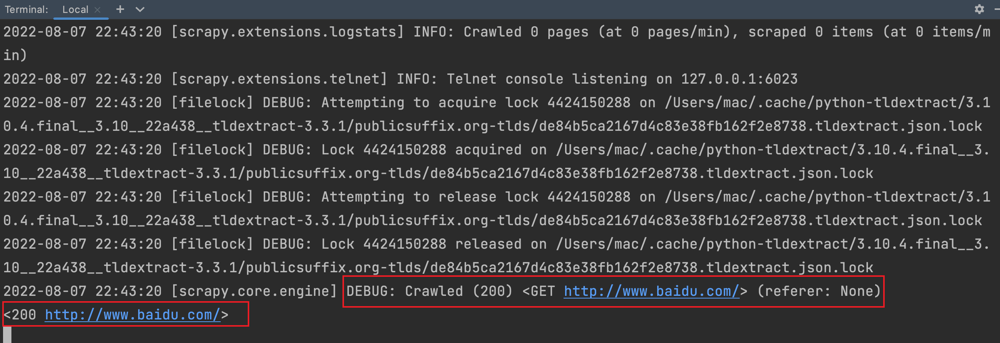
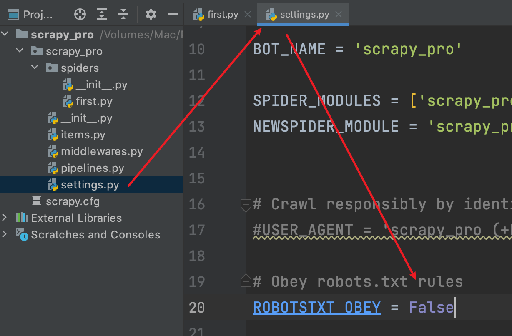

# Selenium模块

## 是什么

基于浏览器自动化操作的模块

> 使用参考 [入门指南 | Selenium](https://www.selenium.dev/zh-cn/documentation/webdriver/getting_started/)

```python
from selenium.webdriver.edge.options import Options as EdgeOptions
from time import sleep
from selenium import webdriver
from selenium.webdriver.chrome.service import Service

# 1. 加载浏览器驱动
service = Service(executable_path='./driver/msedgedriver')
options = EdgeOptions()
# 2. 启动浏览器
edge = webdriver.Edge(service=service, options=options)
# 3. 交互
edge.get(url="https://www.baidu.com/")
print(edge.title)
sleep(3)
# 4. 退出
edge.quit()
```

## 作用

* 便捷获取网站动态加载的数据内容
* 便捷实现模拟登陆

`没有selenium 我们如何获取网站动态数据？`

1. 根据页面源码内容定位我们想要的数据在哪个请求中
2. 获取请求返回数据并解析

`有了以后我们如何获取？`

1. 所见即所得，直接获取页面源码对应的请求，不必关心其动态加载的请求
2. 解析即可


## QQ空间模拟登录

> :japanese_goblin:【注意】selenium操作 iframe元素中内容需要特殊处理，详见 ：[与iFrames和frames一起工作 | Selenium](https://www.selenium.dev/zh-cn/documentation/webdriver/browser/frames/)

```python
from selenium.webdriver.edge.options import Options as EdgeOptions
from time import sleep
from selenium import webdriver
from selenium.webdriver.chrome.service import Service
from selenium.webdriver.common.by import By
from selenium.webdriver.common.keys import Keys

# 1. 加载浏览器驱动
service = Service(executable_path='./driver/msedgedriver')
options = EdgeOptions()
# 2. 启动浏览器
edge = webdriver.Edge(service=service, options=options)
# 3. 进入登录界面
edge.get(url="https://mail.qq.com/")
# 发现浏览器打开后只能定位到QQ邮箱登录界面然后无反应，是因为登录元素是包裹在iframe中，因此需要特殊处理
# 4. 获取iframe元素并切换
iframe = edge.find_element(By.CSS_SELECTOR, '#login_frame')
edge.switch_to.frame(iframe)

# 5. 输入用户名和密码
edge.find_element(By.ID, 'u').send_keys('2062611522')
edge.find_element(By.ID, 'p').send_keys('2062611522')

# 6. 登录
edge.find_element(By.XPATH, '//input[@id="login_button"]').click()
sleep(100)
# 4. 退出
edge.quit()
```


## 无头浏览器和反检测

> 爬取内容时并不希望弹出 浏览器显示操作，即希望进行无头浏览器爬取数据。
>
> 某些网站检测到selenium发起的请求则会反爬虫，如何反检测呢？

```python
from selenium.webdriver import EdgeOptions
from time import sleep
from selenium import webdriver
from selenium.webdriver.chrome.service import Service
from selenium.webdriver.common.by import By
from selenium.webdriver.common.keys import Keys

# 1. 加载浏览器驱动
service = Service(executable_path='./driver/msedgedriver')
options = EdgeOptions()
# 2. 设置无头和反检测
options.add_argument('--headless')
options.add_argument('--disable-gpu')

options.add_experimental_option('excludeSwitches', ['enable-automation'])

# 3. 启动浏览器
edge = webdriver.Edge(service=service, options=options)
# 4. 进入登录界面
edge.get(url="https://mail.qq.com/")
# 5. 交互
print(edge.title)
sleep(10)
# 6. 退出
edge.quit()
```


# Scrapy框架

## 是什么

SCRAPPY(/ˈSkreɪpaɪ/)是一个应用程序框架，用于抓取网站和提取结构化数据，这些数据可用于广泛的有用应用程序，如数据挖掘、信息处理或历史存档。简单来讲就是一个爬虫框架。


## 特性

* 支持CSS选择器和XPath表达式从HTML/XML源中获取数据，并使用正则表达式提取助手方法。
* 支持以多种格式（json、csv、xml）存储在多个后端（ftp、s3、本地文件系统）
* 提供便利的功能 : 
	* cookie和会话处理
	* HTTP功能，如压缩、身份验证、缓存
	* 用户代理欺骗
	* robots.txt
	* 爬行深度限制

## 环境搭建

> pip install scrapy --upgrade  [for mac 全局安装]
>
> 其他系统参考 [安装指南 — Scrapy 2.5.0 文档 (osgeo.cn)](https://www.osgeo.cn/scrapy/intro/install.html)


## 使用流程

### 项目搭建

> :japanese_goblin:Mac下如果提示 【 command not found: scrapy】执行 source ~/.bashrc

1、创建项目

```python
scrapy startproject tutorial
```

目录结构如下图



2、创建爬虫文件

```python
cd tutorial
scrapy genspider spiderName www.xxx.com
```





3、执行工程

```bash
scrapy crawl spiderName
```



> scrapy打印了太多的日志，如何屏蔽掉无关日志并保留错误和自己输出的日志？修改settings.py,添加如下内容：

```python
# 显示指定类型的日志信息
LOG_LEVEL = 'ERROR'
```


4、修改rebotstxt君子协议

> 很多网站都会设置rebotstxt协议，如果遵循此协议则scrapy爬取网站几乎无网站数据可爬取，因此建议关闭此配置




### 数据解析

```bash
scrapy genspider bbsnet http://www.bbsnet.com/
scrapy crawl bbsnet
```

