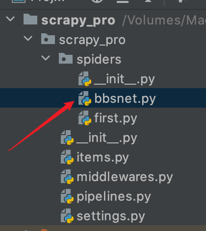
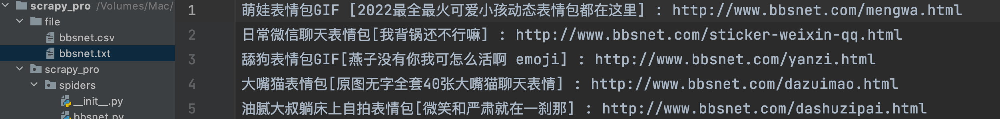
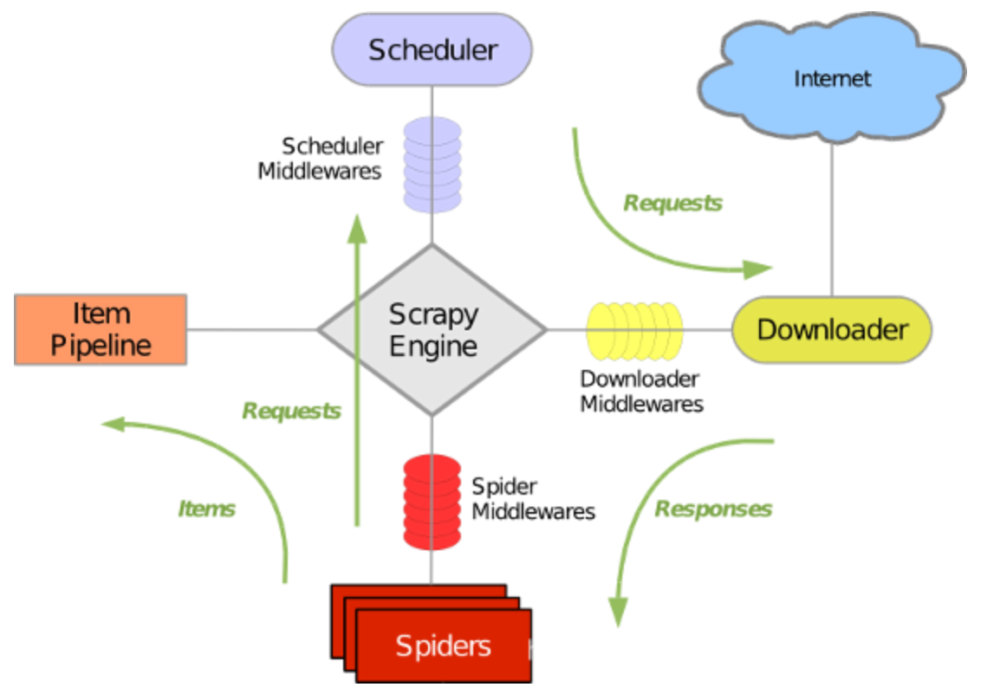
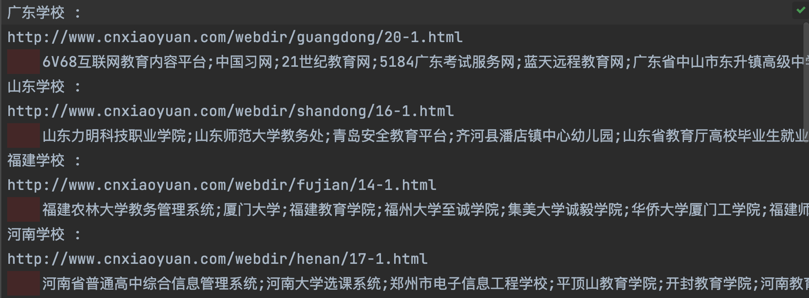

# Selenium模块

## 是什么

基于浏览器自动化操作的模块

> 使用参考 [入门指南 | Selenium](https://www.selenium.dev/zh-cn/documentation/webdriver/getting_started/)

```python
from selenium.webdriver.edge.options import Options as EdgeOptions
from time import sleep
from selenium import webdriver
from selenium.webdriver.chrome.service import Service

# 1. 加载浏览器驱动
service = Service(executable_path='./driver/msedgedriver')
options = EdgeOptions()
# 2. 启动浏览器
edge = webdriver.Edge(service=service, options=options)
# 3. 交互
edge.get(url="https://www.baidu.com/")
print(edge.title)
sleep(3)
# 4. 退出
edge.quit()
```

## 作用

* 便捷获取网站动态加载的数据内容
* 便捷实现模拟登陆

`没有selenium 我们如何获取网站动态数据？`

1. 根据页面源码内容定位我们想要的数据在哪个请求中
2. 获取请求返回数据并解析

`有了以后我们如何获取？`

1. 所见即所得，直接获取页面源码对应的请求，不必关心其动态加载的请求
2. 解析即可


## QQ空间模拟登录

> :japanese_goblin:【注意】selenium操作 iframe元素中内容需要特殊处理，详见 ：[与iFrames和frames一起工作 | Selenium](https://www.selenium.dev/zh-cn/documentation/webdriver/browser/frames/)

```python
from selenium.webdriver.edge.options import Options as EdgeOptions
from time import sleep
from selenium import webdriver
from selenium.webdriver.chrome.service import Service
from selenium.webdriver.common.by import By
from selenium.webdriver.common.keys import Keys

# 1. 加载浏览器驱动
service = Service(executable_path='./driver/msedgedriver')
options = EdgeOptions()
# 2. 启动浏览器
edge = webdriver.Edge(service=service, options=options)
# 3. 进入登录界面
edge.get(url="https://mail.qq.com/")
# 发现浏览器打开后只能定位到QQ邮箱登录界面然后无反应，是因为登录元素是包裹在iframe中，因此需要特殊处理
# 4. 获取iframe元素并切换
iframe = edge.find_element(By.CSS_SELECTOR, '#login_frame')
edge.switch_to.frame(iframe)

# 5. 输入用户名和密码
edge.find_element(By.ID, 'u').send_keys('2062611522')
edge.find_element(By.ID, 'p').send_keys('2062611522')

# 6. 登录
edge.find_element(By.XPATH, '//input[@id="login_button"]').click()
sleep(100)
# 4. 退出
edge.quit()
```


## 无头浏览器和反检测

> 爬取内容时并不希望弹出 浏览器显示操作，即希望进行无头浏览器爬取数据。
>
> 某些网站检测到selenium发起的请求则会反爬虫，如何反检测呢？

```python
from selenium.webdriver import EdgeOptions
from time import sleep
from selenium import webdriver
from selenium.webdriver.chrome.service import Service
from selenium.webdriver.common.by import By
from selenium.webdriver.common.keys import Keys

# 1. 加载浏览器驱动
service = Service(executable_path='./driver/msedgedriver')
options = EdgeOptions()
# 2. 设置无头和反检测
options.add_argument('--headless')
options.add_argument('--disable-gpu')

options.add_experimental_option('excludeSwitches', ['enable-automation'])

# 3. 启动浏览器
edge = webdriver.Edge(service=service, options=options)
# 4. 进入登录界面
edge.get(url="https://mail.qq.com/")
# 5. 交互
print(edge.title)
sleep(10)
# 6. 退出
edge.quit()
```


# Scrapy框架

## 是什么

SCRAPPY(/ˈSkreɪpaɪ/)是一个应用程序框架，用于抓取网站和提取结构化数据，这些数据可用于广泛的有用应用程序，如数据挖掘、信息处理或历史存档。简单来讲就是一个爬虫框架。


## 特性

* 支持CSS选择器和XPath表达式从HTML/XML源中获取数据，并使用正则表达式提取助手方法。
* 支持以多种格式（json、csv、xml）存储在多个后端（ftp、s3、本地文件系统）
* 提供便利的功能 : 
	* cookie和会话处理
	* HTTP功能，如压缩、身份验证、缓存
	* 用户代理欺骗
	* robots.txt
	* 爬行深度限制

## 环境搭建

> pip install scrapy --upgrade  [for mac 全局安装]
>
> 其他系统参考 [安装指南 — Scrapy 2.5.0 文档 (osgeo.cn)](https://www.osgeo.cn/scrapy/intro/install.html)


## 使用流程

### 项目搭建

> :japanese_goblin:Mac下如果提示 【 command not found: scrapy】执行 source ~/.bashrc

1、创建项目

```python
scrapy startproject tutorial
```

目录结构如下图


2、创建爬虫文件

```python
cd tutorial
scrapy genspider spiderName www.xxx.com
```


3、执行工程

```bash
scrapy crawl spiderName
```


> scrapy打印了太多的日志，如何屏蔽掉无关日志并保留错误和自己输出的日志？修改settings.py,添加如下内容：

```python
# 显示指定类型的日志信息
LOG_LEVEL = 'ERROR'
```


4、修改rebotstxt君子协议

> 很多网站都会设置rebotstxt协议，如果遵循此协议则scrapy爬取网站几乎无网站数据可爬取，因此建议关闭此配置


### 数据解析

```bash
scrapy genspider bbsnet http://www.bbsnet.com/
scrapy crawl bbsnet
```



```python
#获取斗图网首页所有标题
#-*- coding: UTF-8 -*-
import scrapy


class BbsnetSpider(scrapy.Spider):
    name = 'bbsnet'
    # allowed_domains = ['www.bbsnet.com']
    start_urls = ['http://www.bbsnet.com/']

    def parse(self, response):
        datas = []
        li_list = response.xpath('//*[@id="post_container"]/li')
        for li in li_list:
            # xpath返回的是列表，列表元素一定是Selector类型的对象.
            # 可以使用extract()获取Selector对象内容,如果是列表调用extract()则获取列表中所有Selector对象的内容
            title = li.xpath('./div[@class="article"]//a/text()').extract()[0]
            url = li.xpath('./div[@class="article"]//a/@href').extract()[0]
            dic = {
                'title': title,
                'url': url
            }
            datas.append(dic)
```


### 数据持久化

```python
# 只需要在上面的代码中奖数据返回即可
#-*- coding: UTF-8 -*-
import scrapy


class BbsnetSpider(scrapy.Spider):
    name = 'bbsnet'
    # allowed_domains = ['www.bbsnet.com']
    start_urls = ['http://www.bbsnet.com/']

    def parse(self, response):
        datas = []
        li_list = response.xpath('//*[@id="post_container"]/li')
        for li in li_list:
            # xpath返回的是列表，列表元素一定是Selector类型的对象.
            # 可以使用extract()获取Selector对象内容,如果是列表调用extract()则获取列表中所有Selector对象的内容
            title = li.xpath('./div[@class="article"]//a/text()').extract()[0]
            url = li.xpath('./div[@class="article"]//a/@href').extract()[0]
            dic = {
                'title': title,
                'url': url
            }
            datas.append(dic)
        #返回数据内容，scrapy引擎接收到后进行下一步处理    
        return datas
```


#### 1、基于终端指令持久化存储

`作用:`

可以将**parse方法的返回值**存储到本地的文本文件中

`支持格式如下：`

* json
* jsonlines
* jl
* csv
* xml
* marshal
* Pickle

```bash
scrapy crawl bbsnet -o ./file/bbsnet.csv
```

> 一般不太使用基于终端指令存储，主要是因为其支持格式局限、自定义持久化不够灵活，胜在简介高效

#### 2、基于管道持久化存储

`用到的类`

* 爬虫文件及parse数据解析方法
* items类
* piplines类

`流程`

1. 数据解析
2. Item类中定义数据相关属性
3. pipeline类中将接收到的item对象存储的数据进行持久化
4. 配置文件中开启管道

`案例：`

1. 基于上面**项目搭建**的项目或者再生成一个项目，创建爬虫文件

	```python
	scrapy genspider bbsnet-pipeline http://www.bbsnet.com/
	```

	```python
	import scrapy
	from scrapy_pro.items import ScrapyProItem
	
	class BbsnetPipelineSpider(scrapy.Spider):
	    name = 'bbsnet_pipeline'
	    # allowed_domains = ['www.bbsnet.com']
	    start_urls = ['http://www.bbsnet.com/']
	
	    def parse(self, response):
	        li_list = response.xpath('//*[@id="post_container"]/li')
	        for li in li_list:
	            # xpath返回的是列表，列表元素一定是Selector类型的对象.
	            # 可以使用extract()获取Selector对象内容,如果是列表调用extract()则获取列表中所有Selector对象的内容
	            title = li.xpath('./div[@class="article"]//a/text()').extract()[0]
	            url = li.xpath('./div[@class="article"]//a/@href').extract()[0]
	            item = ScrapyProItem()
	            item['title'] = title
	            item['url'] = url
	            # 将item提交给管道
	            yield item
	```

2. Item类中定义数据相关属性

	```python
	#-*- coding: UTF-8 -*-
	# Define here the models for your scraped items
	#
	# See documentation in:
	# https://docs.scrapy.org/en/latest/topics/items.html
	
	import scrapy
	
	
	class ScrapyProItem(scrapy.Item):
	    # define the fields for your item here like:
	    # name = scrapy.Field()
	    title = scrapy.Field()
	    url = scrapy.Field()
	```

	

3. pipeline类中持久化爬虫文件中的item对象

	```python
	#-*- coding: UTF-8 -*-
	from itemadapter import ItemAdapter
	
	class ScrapyProPipeline(object):
	    fp = None
	    #重写父类一个方法，该方法只在开始爬虫的时候调用一次
	    def open_spider(self, spider):
	        print('开始爬虫~~~~')
	        self.fp = open('./file/bbsnet.txt', 'w', encoding='utf-8')
	
	    #该方法接受爬虫文件提交过来的item对象，专门用来处理item类型对象，
	    #该方法每接收到一个item就会被调用一次
	    def process_item(self, item, spider):
	        title = item['title']
	        url = item['url']
	        self.fp.write(title + ' : ' + url + '\n')
	        # 这里的retrun 会将item传递给下一个执行的管道类
	        return item
	
	    def close_spider(self, spider):
	        print('结束爬虫~~~')
	        self.fp.close()
	```

4. settings类中开启管道持久化

	```python
	# 放开如下注释
	ITEM_PIPELINES = {
	   #  300表示优先级，数值越小优先级越高
	   'scrapy_pro.pipelines.ScrapyProPipeline': 300,
	}
	```

5. 开始爬虫

	```python
	scrapy crawl bbsnet_pipeline
	>开始爬虫~~~~
	>结束爬虫~~~
	```

	


#### 3、基于管道的动态持久化

```python
# settings.py
ITEM_PIPELINES = {
   #  300表示优先级，数值越小优先级越高
   # 可以定义多个管道类，自定义优先级。
   # 例如pipelines.py中定义多个管道类 : 持久化数据库、持久化本地文件等。通过在这里配置各个类对应的优先级数据来进行动态持久化
   'scrapy_pro.pipelines.ScrapyProPipelineToMySql': 100,
   'scrapy_pro.pipelines.ScrapyProPipelineToTxt': 200,
   'scrapy_pro.pipelines.ScrapyProPipelineToCsv': 300,
}
```


## Scrapy五大核心组件



● 引擎(Scrapy Engine)

用来处理整个系统的数据流处理，触发事务。

● 调度器(Scheduler)

用来接受引擎发过来的请求，压入队列中，并在引擎再次请求的时候返回。

● 下载器(Downloader)

用于下载网页内容，并将网页内容返回给蜘蛛。

● 蜘蛛(Spiders)

蜘蛛是主要干活的，用它来制订特定域名或网页的解析规则。编写用于分析response并提取item(即获取到的item)或额外跟进的URL的类。 每个spider负责处理一个特定(或一些)网站。

● 项目管道(Item Pipeline)

负责处理有蜘蛛从网页中抽取的项目，他的主要任务是清晰、验证和存储数据。当页面被蜘蛛解析后，将被发送到项目管道，并经过几个特定的次序处理数据。

● 下载器中间件(Downloader Middlewares)

位于Scrapy引擎和下载器之间的钩子框架，主要是处理Scrapy引擎与下载器之间的请求及响应。

● 蜘蛛中间件(Spider Middlewares)

介于Scrapy引擎和蜘蛛之间的钩子框架，主要工作是处理蜘蛛的响应输入和请求输出。

● 调度中间件(Scheduler Middlewares)

介于Scrapy引擎和调度之间的中间件，从Scrapy引擎发送到调度的请求和响应。


## 请求传参（深度爬取）

`使用场景`

如果爬取解析的数据不在同一页面（深度爬取）则要用到请求传参。

`案例`

> 获取《中国校园网》每个《分类目录》下的 学校名称
>
> 1. 爬取分类目录名称
> 2. 爬取每个分类下学校名称

1. 创建项目并定义爬虫文件

	```python
	from boss.items import BossItem
	import scrapy
	
	class BossReptileSpider(scrapy.Spider):
	    name = 'boss_reptile'
	    # allowed_domains = ['https://www.zhipin.com/web/geek/job\?query\=\&city\=101010100']
	    start_urls = ['http://www.cnxiaoyuan.com/']
	
	    def parse(self, response):
	        div_list = response.xpath('//*[@id="homecate"]/ul/li')
	        for div in div_list:
	            name = div.xpath('./a/text()').extract()
	            detail_url = 'http://www.cnxiaoyuan.com' + div.xpath('./a/@href').extract_first()
	            #定义item
	            item = BossItem()
	            item['classify'] = name
	            item['detail_url'] = detail_url
	
	            # 手动模拟详情页发送请求获取源码数据
	            # 请求传参 : meta = {} 可以将meta字典传递给请求对应的回调函数
	            print(name, detail_url)
	            yield scrapy.Request(detail_url, callback=self.parse_detail, meta={'item': item})
	
	
	    def parse_detail(self, response):
	        # 接受meta
	        item = response.meta['item']
	
	        son_school = []
	        span_list = response.xpath('//*[@id="mainbox-center"]/ul/li')
	        for span in span_list:
	            shcool_name = span.xpath('./div/h3/a/text()').extract()
	            son_school.append(shcool_name)
	
	        item['schools'] = son_school
	        # 将item返回给管道处理
	        yield item
	```

2. 定义item

	```python
	import scrapy
	
	class BossItem(scrapy.Item):
	    # define the fields for your item here like:
	    classify = scrapy.Field()
	    detail_url = scrapy.Field()
	    schools = scrapy.Field()
	```

3. pipeline持久化

	```python
	class BossPipeline:
	    fp = None
	
	    # 重写父类一个方法，该方法只在开始爬虫的时候调用一次
	    def open_spider(self, spider):
	        print('开始爬虫~~~~')
	        self.fp = open('./cnxiaoyuan.txt', 'w', encoding='utf-8')
	
	    # 该方法接受爬虫文件提交过来的item对象，专门用来处理item类型对象，
	    # 该方法每接收到一个item就会被调用一次
	    def process_item(self, item, spider):
	        classify = item['classify']
	        detail_url = item['detail_url']
	        schools = item['schools']
	
	        shcools_tmp = [''.join(i) for i in schools]
	        schools_str = ';'.join(shcools_tmp).strip("['").strip("']")
	
	        str = ''.join(classify) + ' :' + '\n' + ''.join(detail_url) + '\n' + '\t' + schools_str + '\n'
	        self.fp.write(str)
	        print('写入完成 : ', ''.join(classify))
	        # 这里的retrun 会将item传递给下一个执行的管道类
	        return item
	
	    def close_spider(self, spider):
	        print('结束爬虫~~~')
	        self.fp.close()
	```

4. 开启setting pipeline持久化

5. 开始爬取

	```bash
	scrapy crawl boss_reptile
	```

	


## 中间件 - 请求处理

> 针对所有请求和响应进行拦截处理。例如ua伪装，动态代理等

`相关类`

Middlewares 中 xxxDownloaderMiddleware(下载中间件)

> 开启下载中间件 ：放开settings.py
>
> ```python
> SPIDER_MIDDLEWARES = {
>    'boss.middlewares.BossSpiderMiddleware': 543,
> }
> ```

* process_request 拦截请求

* process_response 拦截响应

* process_exception 拦截异常

	

`案例 - ua伪装`

```python
    agent = [
        'Mozilla/4.0(compatible;MSIE7.0;WindowsNT5.1;AvantBrowser)',
        'Mozilla/4.0(compatible;MSIE7.0;WindowsNT5.1;360SE)',
        'Mozilla/4.0(compatible;MSIE7.0;WindowsNT5.1;Trident/4.0;SE2.XMetaSr1.0;SE2.XMetaSr1.0;.NETCLR2.0.50727;SE2.XMetaSr1.0)',
        'Mozilla/4.0(compatible;MSIE7.0;WindowsNT5.1;TheWorld)',
        'Mozilla/4.0(compatible;MSIE7.0;WindowsNT5.1;TencentTraveler4.0)',
        'Opera/9.80(Macintosh;IntelMacOSX10.6.8;U;en)Presto/2.8.131Version/11.11',
        'Mozilla/5.0(WindowsNT6.1;rv:2.0.1)Gecko/20100101Firefox/4.0.1',
        'Mozilla/5.0(compatible;MSIE9.0;WindowsNT6.1;Trident/5.0',
        'Mozilla/5.0 (Windows NT 6.1; WOW64) AppleWebKit/537.36 (KHTML, like Gecko) Chrome/39.0.2171.95 Safari/537.36 OPR/26.0.1656.60',
        'Mozilla/5.0 (Windows NT 6.1; WOW64) AppleWebKit/537.36 (KHTML, like Gecko) Chrome/30.0.1599.101 Safari/537.36',
        'Mozilla/4.0 (compatible; MSIE 6.0; Windows NT 5.1; SV1; QQDownload 732; .NET4.0C; .NET4.0E; LBBROWSER)',
        'Mozilla/5.0 (Windows NT 5.1) AppleWebKit/535.11 (KHTML, like Gecko) Chrome/17.0.963.84 Safari/535.11 SE 2.X MetaSr 1.0',
        'Mozilla/5.0 (Windows NT 6.1; WOW64) AppleWebKit/537.36 (KHTML, like Gecko) Chrome/38.0.2125.122 UBrowser/4.0.3214.0 Safari/537.36',
        'Mozilla/5.0 (X11; U; Linux x86_64; zh-CN; rv:1.9.2.10) Gecko/20100922 Ubuntu/10.10 (maverick) Firefox/3.6.10',
        'Mozilla/5.0 (Windows NT 6.1; WOW64) AppleWebKit/535.1 (KHTML, like Gecko) Chrome/14.0.835.163 Safari/535.1',
        "Mozilla/4.0 (compatible; MSIE 6.0; Windows NT 5.1; SV1; AcooBrowser; .NET CLR 1.1.4322; .NET CLR 2.0.50727)",
        "Mozilla/4.0 (compatible; MSIE 7.0; Windows NT 6.0; Acoo Browser; SLCC1; .NET CLR 2.0.50727; Media Center PC 5.0; .NET CLR 3.0.04506)",
        "Mozilla/4.0 (compatible; MSIE 7.0; AOL 9.5; AOLBuild 4337.35; Windows NT 5.1; .NET CLR 1.1.4322; .NET CLR 2.0.50727)",
        "Mozilla/5.0 (Windows; U; MSIE 9.0; Windows NT 9.0; en-US)",
        "Mozilla/5.0 (compatible; MSIE 9.0; Windows NT 6.1; Win64; x64; Trident/5.0; .NET CLR 3.5.30729; .NET CLR 3.0.30729; .NET CLR 2.0.50727; Media Center PC 6.0)",
        "Mozilla/5.0 (compatible; MSIE 8.0; Windows NT 6.0; Trident/4.0; WOW64; Trident/4.0; SLCC2; .NET CLR 2.0.50727; .NET CLR 3.5.30729; .NET CLR 3.0.30729; .NET CLR 1.0.3705; .NET CLR 1.1.4322)",
        "Mozilla/4.0 (compatible; MSIE 7.0b; Windows NT 5.2; .NET CLR 1.1.4322; .NET CLR 2.0.50727; InfoPath.2; .NET CLR 3.0.04506.30)",
        "Mozilla/5.0 (Windows; U; Windows NT 5.1; zh-CN) AppleWebKit/523.15 (KHTML, like Gecko, Safari/419.3) Arora/0.3 (Change: 287 c9dfb30)",
        "Mozilla/5.0 (X11; U; Linux; en-US) AppleWebKit/527+ (KHTML, like Gecko, Safari/419.3) Arora/0.6",
        "Mozilla/5.0 (Windows; U; Windows NT 5.1; en-US; rv:1.8.1.2pre) Gecko/20070215 K-Ninja/2.1.1",
        "Mozilla/5.0 (Windows; U; Windows NT 5.1; zh-CN; rv:1.9) Gecko/20080705 Firefox/3.0 Kapiko/3.0",
        "Mozilla/5.0 (X11; Linux i686; U;) Gecko/20070322 Kazehakase/0.4.5",
        "Mozilla/5.0 (X11; U; Linux i686; en-US; rv:1.9.0.8) Gecko Fedora/1.9.0.8-1.fc10 Kazehakase/0.5.6",
        "Mozilla/5.0 (Windows NT 6.1; WOW64) AppleWebKit/535.11 (KHTML, like Gecko) Chrome/17.0.963.56 Safari/535.11",
        "Mozilla/5.0 (Macintosh; Intel Mac OS X 10_7_3) AppleWebKit/535.20 (KHTML, like Gecko) Chrome/19.0.1036.7 Safari/535.20",
        "Opera/9.80 (Macintosh; Intel Mac OS X 10.6.8; U; fr) Presto/2.9.168 Version/11.52",
    ]
  
  # 拦截请求
  def process_request(self, request, spider):
    # UA伪装
    request.headers['User-Agent'] = random.choice(self.agent)
    return None
```


## Scrapy中使用Selenium


网站页面针对爬虫来讲，大致分为静态渲染和动态渲染。

* 静态渲染 ：比如jsp、Thymeleaf、静态html等都是直接给浏览器返还成型(结构+数据)后的html页面。
* 动态渲染 ：比如先流行的响应式页面，其特点就是动态加载数据动态操作dom动态渲染。

> 静态渲染针对于爬虫而言：直接使用request获取响应数据，利用xpath进行页面元素内容获取。
>
> 动态渲染针对于爬虫而言：需使用Selenium及类似模块进行浏览器模拟操作，然后利用xpath针对获取到的页面数据进行解析。**scrapy框架使用的就是request进行请求处理，这也就是为什么需要在scrapy中使用Selenium的原因**

开启下载中间件 ：放开settings.py

```python
DOWNLOADER_MIDDLEWARES = {
   'project.middlewares.ProjectDownloaderMiddleware': 543,
}
```


```python
# middlewares.py 修改xxxDownloaderMiddleware如下方法
from random import random
from time import sleep
from scrapy import signals
from scrapy.http import HtmlResponse
    # 针对给定列表中URL使用Selenium进行篡改
    def process_response(self, request, response, spider):
        # spider 即Spider对象，其包含了spiders包下创建类中所有变量。。
        # 因此将列表URL 和 Selenium都放到spider对象中，即爬虫文件。
        edge = spider.edge
        url_list = spider.url_list

        # 挑选指定相应对象进行篡改
        if request.url in url_list:
            edge.get(request.url)
            sleep(3)
            page_text = edge.page_source

            new_response = HtmlResponse(url=request.url, body=page_text, encoding='utf-8', request=request)

            return new_response
        else:
            return response
```

```python
from time import sleep
from selenium import webdriver
from selenium.webdriver.chrome.service import Service
from selenium.webdriver.common.by import By
from selenium.webdriver.common.keys import Keys
from selenium.webdriver.edge.options import Options as EdgeOptions
# 爬虫文件中添加如下内容
    # 定义白名单和Selenium
    def __init__(self):
        service = Service(executable_path='../../../driver/msedgedriver')
        options = EdgeOptions()
        # options.add_argument('--headless')
        # options.add_argument('--disable-gpu')
        # options.add_experimental_option('excludeSwitches', ['enable-automation'])
        self.edge = webdriver.Edge(service=service, options=options)
        self.url_list = self.start_urls
```


## 案例

> 使用 Scrapy+Selenium 无登录获取 哔哩哔哩 热门标题及URL
>
> 已上传 异步 ：

1. 项目创建

	```python
	下载对应浏览器驱动，见上「selenium模块」
	pip install selenium
	pip install scrapy
	scrapy startproject project
	```

2. 创建爬虫文件

	```python
	cd project
	scrapy genspider bilibili www.xxx.com
	```

	```python
	import scrapy
	from time import sleep
	from project.items import ProjectItem
	from selenium import webdriver
	from selenium.webdriver.chrome.service import Service
	from selenium.webdriver.common.by import By
	from selenium.webdriver.common.keys import Keys
	from selenium.webdriver.edge.options import Options as EdgeOptions
	
	class ChinanewsSpider(scrapy.Spider):
	    name = 'bilibili'
	    # allowed_domains = ['https://www.chinanews.com.cn/']
	    start_urls = ['https://www.bilibili.com/v/cinephile/cinecism']
	
	    # 定义白名单和Selenium
	    def __init__(self):
	        service = Service(executable_path='/Volumes/Mac/Project/Python/爬虫/Scrapy整合Selenium/project/driver/msedgedriver')
	        options = EdgeOptions()
	        # options.add_argument('--headless')
	        # options.add_argument('--disable-gpu')
	        # options.add_experimental_option('excludeSwitches', ['enable-automation'])
	        self.edge = webdriver.Edge(service=service, options=options)
	        self.url_list = self.start_urls
	
	    def parse(self, response):
	        # print(response)
	        li_list = response.xpath('//*[@id="app"]/div/div[2]/div[2]/div[2]/section/div/ul/li')
	        for li in li_list:
	            title = li.xpath('./a/@title').extract()
	            video_url = li.xpath('./a/@href').extract()
	            item = ProjectItem()
	            item['title'] = title
	            item['video_url'] = video_url
	            # 将item提交给管道
	            yield item
	```

	

3. 修改配置 settings.py

	```python
	# 修改rebotstxt君子协议
	ROBOTSTXT_OBEY = False
	# 显示指定类型的日志信息cd
	LOG_LEVEL = 'ERROR'
	# settings类中开启管道持久化
	ITEM_PIPELINES = {
	   'project.pipelines.ProjectPipeline': 300,
	}
	# 开启下载中间件
	DOWNLOADER_MIDDLEWARES = {
	   'project.middlewares.ProjectDownloaderMiddleware': 543,
	}
	```

4. 配置item

	```python
	class ProjectItem(scrapy.Item):
	    # define the fields for your item here like:
	    title = scrapy.Field()
	    video_url = scrapy.Field()
	
	```

5. 修改下载中间件

	> 使用 selenium 篡改动态接口响应体

	```python
	from time import sleep
	from scrapy.http import HtmlResponse
	from scrapy import signals
	import random
	class ProjectDownloaderMiddleware(object):
	    # Not all methods need to be defined. If a method is not defined,
	    # scrapy acts as if the downloader middleware does not modify the
	    # passed objects.
	    agent = [
	        'Mozilla/4.0(compatible;MSIE7.0;WindowsNT5.1;AvantBrowser)',
	        'Mozilla/4.0(compatible;MSIE7.0;WindowsNT5.1;360SE)',
	        'Mozilla/4.0(compatible;MSIE7.0;WindowsNT5.1;Trident/4.0;SE2.XMetaSr1.0;SE2.XMetaSr1.0;.NETCLR2.0.50727;SE2.XMetaSr1.0)',
	        'Mozilla/4.0(compatible;MSIE7.0;WindowsNT5.1;TheWorld)',
	        'Mozilla/4.0(compatible;MSIE7.0;WindowsNT5.1;TencentTraveler4.0)',
	        'Opera/9.80(Macintosh;IntelMacOSX10.6.8;U;en)Presto/2.8.131Version/11.11',
	        'Mozilla/5.0(WindowsNT6.1;rv:2.0.1)Gecko/20100101Firefox/4.0.1',
	        'Mozilla/5.0(compatible;MSIE9.0;WindowsNT6.1;Trident/5.0',
	        'Mozilla/5.0 (Windows NT 6.1; WOW64) AppleWebKit/537.36 (KHTML, like Gecko) Chrome/39.0.2171.95 Safari/537.36 OPR/26.0.1656.60',
	        'Mozilla/5.0 (Windows NT 6.1; WOW64) AppleWebKit/537.36 (KHTML, like Gecko) Chrome/30.0.1599.101 Safari/537.36',
	        'Mozilla/4.0 (compatible; MSIE 6.0; Windows NT 5.1; SV1; QQDownload 732; .NET4.0C; .NET4.0E; LBBROWSER)',
	        'Mozilla/5.0 (Windows NT 5.1) AppleWebKit/535.11 (KHTML, like Gecko) Chrome/17.0.963.84 Safari/535.11 SE 2.X MetaSr 1.0',
	        'Mozilla/5.0 (Windows NT 6.1; WOW64) AppleWebKit/537.36 (KHTML, like Gecko) Chrome/38.0.2125.122 UBrowser/4.0.3214.0 Safari/537.36',
	        'Mozilla/5.0 (X11; U; Linux x86_64; zh-CN; rv:1.9.2.10) Gecko/20100922 Ubuntu/10.10 (maverick) Firefox/3.6.10',
	        'Mozilla/5.0 (Windows NT 6.1; WOW64) AppleWebKit/535.1 (KHTML, like Gecko) Chrome/14.0.835.163 Safari/535.1',
	        "Mozilla/4.0 (compatible; MSIE 6.0; Windows NT 5.1; SV1; AcooBrowser; .NET CLR 1.1.4322; .NET CLR 2.0.50727)",
	        "Mozilla/4.0 (compatible; MSIE 7.0; Windows NT 6.0; Acoo Browser; SLCC1; .NET CLR 2.0.50727; Media Center PC 5.0; .NET CLR 3.0.04506)",
	        "Mozilla/4.0 (compatible; MSIE 7.0; AOL 9.5; AOLBuild 4337.35; Windows NT 5.1; .NET CLR 1.1.4322; .NET CLR 2.0.50727)",
	        "Mozilla/5.0 (Windows; U; MSIE 9.0; Windows NT 9.0; en-US)",
	        "Mozilla/5.0 (compatible; MSIE 9.0; Windows NT 6.1; Win64; x64; Trident/5.0; .NET CLR 3.5.30729; .NET CLR 3.0.30729; .NET CLR 2.0.50727; Media Center PC 6.0)",
	        "Mozilla/5.0 (compatible; MSIE 8.0; Windows NT 6.0; Trident/4.0; WOW64; Trident/4.0; SLCC2; .NET CLR 2.0.50727; .NET CLR 3.5.30729; .NET CLR 3.0.30729; .NET CLR 1.0.3705; .NET CLR 1.1.4322)",
	        "Mozilla/4.0 (compatible; MSIE 7.0b; Windows NT 5.2; .NET CLR 1.1.4322; .NET CLR 2.0.50727; InfoPath.2; .NET CLR 3.0.04506.30)",
	        "Mozilla/5.0 (Windows; U; Windows NT 5.1; zh-CN) AppleWebKit/523.15 (KHTML, like Gecko, Safari/419.3) Arora/0.3 (Change: 287 c9dfb30)",
	        "Mozilla/5.0 (X11; U; Linux; en-US) AppleWebKit/527+ (KHTML, like Gecko, Safari/419.3) Arora/0.6",
	        "Mozilla/5.0 (Windows; U; Windows NT 5.1; en-US; rv:1.8.1.2pre) Gecko/20070215 K-Ninja/2.1.1",
	        "Mozilla/5.0 (Windows; U; Windows NT 5.1; zh-CN; rv:1.9) Gecko/20080705 Firefox/3.0 Kapiko/3.0",
	        "Mozilla/5.0 (X11; Linux i686; U;) Gecko/20070322 Kazehakase/0.4.5",
	        "Mozilla/5.0 (X11; U; Linux i686; en-US; rv:1.9.0.8) Gecko Fedora/1.9.0.8-1.fc10 Kazehakase/0.5.6",
	        "Mozilla/5.0 (Windows NT 6.1; WOW64) AppleWebKit/535.11 (KHTML, like Gecko) Chrome/17.0.963.56 Safari/535.11",
	        "Mozilla/5.0 (Macintosh; Intel Mac OS X 10_7_3) AppleWebKit/535.20 (KHTML, like Gecko) Chrome/19.0.1036.7 Safari/535.20",
	        "Opera/9.80 (Macintosh; Intel Mac OS X 10.6.8; U; fr) Presto/2.9.168 Version/11.52",
	    ]
	    @classmethod
	    def from_crawler(cls, crawler):
	        # This method is used by Scrapy to create your spiders.
	        s = cls()
	        crawler.signals.connect(s.spider_opened, signal=signals.spider_opened)
	        return s
	
	    def process_request(self, request, spider):
	        # Called for each request that goes through the downloader
	        # middleware.
	
	        # Must either:
	        # - return None: continue processing this request
	        # - or return a Response object
	        # - or return a Request object
	        # - or raise IgnoreRequest: process_exception() methods of
	        #   installed downloader middleware will be called
	        # UA伪装
	        request.headers['User-Agent'] = random.choice(self.agent)
	        return None
	
	    # 针对给定列表中URL使用Selenium进行篡改
	    def process_response(self, request, response, spider):
	        # spider 即Spider对象，其包含了spiders包下创建类中所有变量。。
	        # 因此将列表URL 和 Selenium都放到spider对象中，即爬虫文件。
	        edge = spider.edge
	        url_list = spider.url_list
	        # 挑选指定相应对象进行篡改
	        if request.url in url_list:
	            edge.get(request.url)
	            sleep(6)
	            page_text = edge.page_source
	
	            new_response = HtmlResponse(url=request.url, body=page_text, encoding='utf-8', request=request)
	            return new_response
	        else:
	            return response
	
	    def process_exception(self, request, exception, spider):
	        # Called when a download handler or a process_request()
	        # (from other downloader middleware) raises an exception.
	
	        # Must either:
	        # - return None: continue processing this exception
	        # - return a Response object: stops process_exception() chain
	        # - return a Request object: stops process_exception() chain
	        pass
	
	    def spider_opened(self, spider):
	        spider.logger.info('Spider opened: %s' % spider.name)
	
	```

6. 修改管道

	```python
	class ProjectPipeline(object):
	    fp = None
	
	    # 重写父类一个方法，该方法只在开始爬虫的时候调用一次
	    def open_spider(self, spider):
	        print('开始爬虫~~~~')
	        self.fp = open('./bilibili.txt', 'w', encoding='utf-8')
	
	    # 该方法接受爬虫文件提交过来的item对象，专门用来处理item类型对象，
	    # 该方法每接收到一个item就会被调用一次
	    def process_item(self, item, spider):
	        title = item['title'][0]
	        video_url = item['video_url'][0]
	
	        self.fp.write(title + ' : ' + video_url + '\n')
	        print('写入完成 : ', title)
	        # 这里的retrun 会将item传递给下一个执行的管道类
	        return item
	
	    def close_spider(self, spider):
	        print('结束爬虫~~~')
	        self.fp.close()
	```

	
