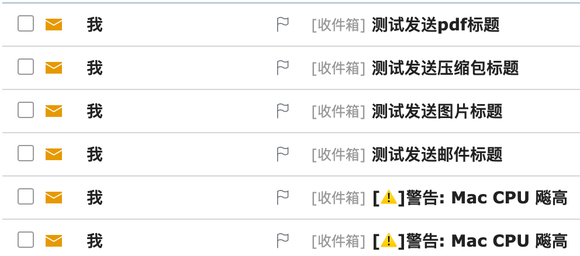

## 需求

实时检测当前系统CPU使用频率，如果超过指定阈值，则发送警示邮件。


## 实现

```python
--Config.py
# -*- coding: UTF-8 -*-
from enum import Enum
from getpass import getpass

class Config(Enum):
    # 刷新次数
    NUMBER_OF_REFRESH = 3
    # CPU阈值
    CPU_THRESHOLD = 40
    # 邮箱服务器地址
    EMAIL_SERVER_ADDRESS = 'smtp.163.com'
    # 邮箱服务器端口
    EMAIL_SERVER_PORT = 465
    # 发送邮箱 可以是列表['to_someone@qq.com']且直接使用
    EMAIL_FROM_ADDRESS = getpass('From Email: ')
    # 发送邮箱密码
    EMAIL_FROM_PASSWORD = getpass('From Email Password: ')
    # 目标邮箱
    EMAIL_TO_ADDRESS = getpass('To Email: ')


```

```python
--Cpu.py
# -*- coding: UTF-8 -*-

import psutil


class Cpu(object):

    def __init__(self):
        pass

    # 获取CPU平均使用率
    def get_cpu_svg(self):
        cpu_list = psutil.cpu_percent(interval=1, percpu=True)
        size = len(cpu_list)
        count = 0
        for num in cpu_list:
            count += num

        svg = count/size
        # print('CPU总占比 %s, 核心数 %s, 平均使用率为 %s' % (count, size, svg))
        return round(svg, 2)


    # 获取CPU核数
    def get_cpu_auditing(self):
        return psutil.cpu_count(logical=False)


if __name__ == '__main__':
    cpu = Cpu()
    print(cpu.get_cpu_svg())
```

```python
# -*- coding: UTF-8 -*-
# 选择pyEmail 而不是 smtplib
import pathlib
import ssl
import smtplib
from Config import Config
from email.mime.text import MIMEText
from email.mime.image import MIMEImage
from email.mime.multipart import MIMEMultipart
from email.mime.application import MIMEApplication


class Email(object):

    def __init__(self):
        # self.smtp = smtplib.SMTP(Config.EMAIL_SERVER_ADDRESS.value, Config.EMAIL_SERVER_PORT.value)
        # self.context = ssl.create_default_context()
        pass


    def send_email(self, subject, body):
        message = MIMEText(body, 'plain', 'utf-8')  # 内容, 格式, 编码
        message['From'] = "{}".format(Config.EMAIL_FROM_ADDRESS.value)
        message['To'] = ",".join(Config.EMAIL_TO_ADDRESS.value)
        message['Subject'] = subject

        try:
            server = smtplib.SMTP_SSL(Config.EMAIL_SERVER_ADDRESS.value, Config.EMAIL_SERVER_PORT.value)  # 启用SSL发信, 端口一般是465
            server.login(Config.EMAIL_FROM_ADDRESS.value, Config.EMAIL_FROM_PASSWORD.value)  # 登录验证
            server.sendmail(Config.EMAIL_FROM_ADDRESS.value, Config.EMAIL_TO_ADDRESS.value, message.as_string())  # 发送
            server.quit()
            print("mail has been send successfully.")
        except smtplib.SMTPException as e:
            print('error:', e)


    def send_email_with_app(self, subject, body, file_addr):
        message = MIMEMultipart()
        part_text = MIMEText(body)
        message.attach(part_text)

        imageApart = MIMEApplication(open(file_addr, 'rb').read(), file_addr.split('.')[-1])
        imageApart.add_header('Content-Disposition', 'attachment', filename=pathlib.Path(file_addr).name)
        message.attach(imageApart)

        message['Subject'] = subject
        message['From'] = "{}".format(Config.EMAIL_FROM_ADDRESS.value)
        message['To'] = ",".join(Config.EMAIL_TO_ADDRESS.value)

        try:
            smtp = smtplib.SMTP_SSL(Config.EMAIL_SERVER_ADDRESS.value, Config.EMAIL_SERVER_PORT.value)
            smtp.login(Config.EMAIL_FROM_ADDRESS.value, Config.EMAIL_FROM_PASSWORD.value)  # 登录验证
            smtp.sendmail(Config.EMAIL_FROM_ADDRESS.value, Config.EMAIL_TO_ADDRESS.value, message.as_string())  # 发送
            smtp.quit()
            print("mail has been send successfully.")
        except smtplib.SMTPException as e:
            print('error:', e)


if __name__ == '__main__':
    textEmail = Email()
    textEmail.send_email('测试发送邮件标题', '测试发送邮件内容')
    imgEmail = Email()
    imgEmail.send_email_with_app('测试发送图片标题', '测试发送图片内容', './file/img.jpg')
    imgEmail = Email()
    imgEmail.send_email_with_app('测试发送压缩包标题', '测试发送压缩包内容', './file/压缩.zip')
    imgEmail = Email()
    imgEmail.send_email_with_app('测试发送pdf标题', '测试发送pdf内容', './file/啊哈.pdf')
```

```python
--main.py
# -*- coding: UTF-8 -*-

import time
import schedule
from Cpu import Cpu
from Email import Email
from Config import Config


cpu = Cpu()
email = Email()

def watch_cpu():
    svg = cpu.get_cpu_svg()
    if svg > Config.CPU_THRESHOLD.value:
        print('CPU使用率已超过阈值 [%d%%], 目前使用率为 [%s%%]' % (Config.CPU_THRESHOLD.value, svg))
        # 发送邮件
        email.send_email('[⚠️]警告: Mac CPU 飚高', 'CPU使用率已超过阈值 [%d%%], 目前使用率为 [%s%%]' % (Config.CPU_THRESHOLD.value, svg))

schedule.every(Config.NUMBER_OF_REFRESH.value).seconds.do(watch_cpu)

while True:
    schedule.run_pending()
    time.sleep(1)
```



