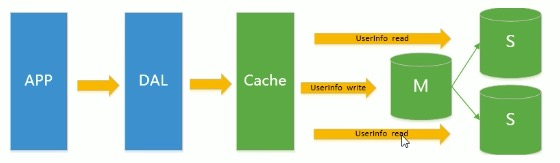

### 为什么使用nosql

上一代架构：
APP-->DAL-->(单实例)MysqlInstance  &emsp;&emsp;|<a href='#one'>MySQL单实例和多实例</a>|

瓶颈：
1. 数据量的总大小一个机器放不下
2. 数据的索引一个机器的内存放不下
3. 访问量(读写混合)一个实例不能承受

缓冲+MySQL+垂直拆分架构：
APP-->DAL-->Cache-->(多实例)MysqlInstance

1. 随着访问量的上升，几乎大部分使用MySQL架构的网站在数据库上都开始出现了性能问题
2. 将频繁访问的数据放入缓冲中，减缓数据库的io压力
3. 数据库的多实例技术能够更好地利用服务器性能以及扩展更高级的技术架构(卖家和买家两个库)或者主从读写分离

MySQL主从读写分离架构：

分表分库+水平拆分+MySQL集群架构：

### 能干什么
1. 缓存，毫无疑问这是Redis当今最为人熟知的使用场景。再提升服务器性能方面非常有效；

2. 排行榜，如果使用传统的关系型数据库来做这个事儿，非常的麻烦，而利用Redis的SortSet数据结构能够非常方便搞定；

3. 计算器/限速器，利用Redis中原子性的自增操作，我们可以统计类似用户点赞数、用户访问数等，这类操作如果用MySQL，频繁的读写会带来相当大的压力；限速器比较典型的使用场景是限制某个用户访问某个API的频率，常用的有抢购时，防止用户疯狂点击带来不必要的压力；

注：限速器也是对请求限流的一种实现方式。

4. 好友关系，利用集合的一些命令，比如求交集、并集、差集等。可以方便搞定一些共同好友、共同爱好之类的功能；

5. 简单消息队列，除了Redis自身的发布/订阅模式，我们也可以利用List来实现一个队列机制，比如：到货通知、邮件发送之类的需求，不需要高可靠，但是会带来非常大的DB压力，完全可以用List来完成异步解耦；

6. Session共享，默认Session是保存在服务器的文件中，即当前服务器，如果是集群服务，同一个用户过来可能落在不同机器上，这就会导致用户频繁登陆；采用Redis保存Session后，无论用户落在那台机器上都能够获取到对应的Session信息。

#### Redis不能做什么
Redis感觉能干的事情特别多，但它不是万能的，并且它是单线程任务执行，合适的地方用它事半功倍。如果滥用可能导致系统的不稳定、成本增高等问题。

比如，用Redis去保存用户的基本信息，虽然它能够支持持久化，但是它的持久化方案并不能保证数据绝对的落地，并且还可能带来Redis性能下降，因为持久化太过频繁会增大Redis服务的压力。

简单总结就是数据量太大、数据访问频率非常低的业务都不适合使用Redis。

### 特点
1. 易扩展
MySQL对表字段不停的扩展总会达到极限并且对于复杂的关系社交图并不能很好的描述而noSQL则不存在该问题
2. 大数据量高性能
3. 多样灵活的数据模型
4. 所有数据存储在内存中，高速读写
5. 提供丰富多样的数据类型：string、 hash、 set、 sorted set、bitmap、hyperloglog
6. 提供了 AOF 和 RDB 两种数据的持久化保存方式，保证了 Redis 重启后数据不丢失
7. Redis 的所有操作都是原子性的，还支持对几个操作合并后的原子性操作(在一个Redis事务中，Redis要么执行其中的所有命令，要么什么都不执行。因此，Redis事务能够保证原子性)，支持事务但是Redis事务不支持回滚，这需要程序自己去判断。可以使用reids的watch命令，进行乐观锁检查，失败后客户端重试

#### MySQL单实例和多实例
实例：MySQL数据库由后台线程及一个共享内存区组成，数据库实例才是真正用于操作数据库文件的程序集，是一个动态概念。

在MySQL中实例和数据库的关系通常是一一对应的，即一个实例对应一个数据库，但是现在越来越多的场景使用多实例，也就是一个数据库被多个数据库实例使用多情况。
多实例就是在一台服务器上同时开启多个不同的数据库服务端口（例如3306、3307），同时运行多个MYSQL服务进程，这些服务进程通过不同的socket监听不同的服务端口来提供服务。

这些MySQL实例共用一个Mysql数据库安装程序，使用不同的my.cnf配置文件启动，在提供服务时，多实例MySQL在逻辑上看，是各自独立的，他们根据配置文件的设定来获得服务器相应数量的资源。

MySQL多实例的优缺点

优点：

可以有效利用服务器资源，当单个服务器资源富裕时，可以充分利用资源提供更多的服务。

节约服务器资源，若公司资金不是充裕，又想数据库能独立提供服务，还想用主从复制等技术，那么只能选择多实例部署方式。

缺点：

存在资源互享抢占的问题，当某个数据库实例并发很高且SQL查询耗时，那整个实例会消耗大量的系统资源，包括CPU、磁盘IO等，导致同一个服务器的其它数据库实例可能响应慢，毕竟它不会像虚拟机一样做到完全隔离。

### Tips

Redis笔记只是记录了Redis基础到高级的使用。如果想要了解Redis主从复制内部机制(复制缓冲区、心跳机制、哨兵、集群等)可至https://www.bilibili.com/video/av76235738?p=92观看
