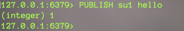
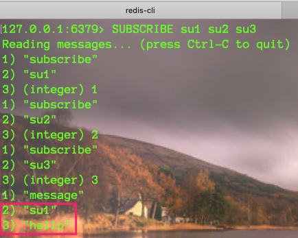

## 订阅与发布(不常用，一般使用mq)

`引言`

多个客户端连接Redis服务器，如何在客户端进行消息传递，即Redis客户端订阅频道，消息的发布者往频道上发布消息，所有订阅该频道的客户端都会收到此消息【哪些key已修改】。

## 操作

1. 客户端A订阅频道消息

	

	> 订阅后，将一直阻塞等待消息传递

2. 客户端B将消息发布到指定频道，A已订阅该频道，因此会收到消息

	

	

