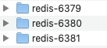
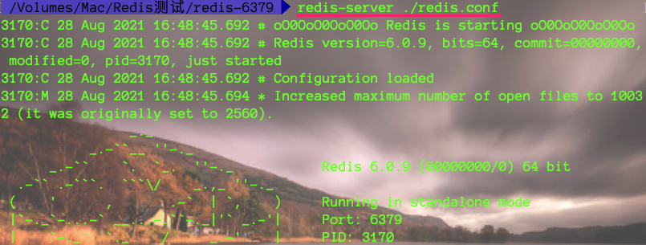
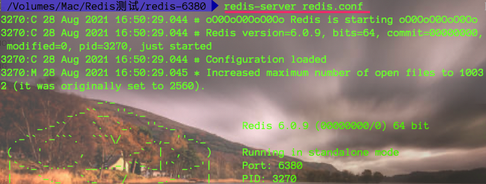
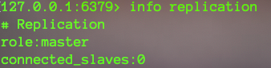
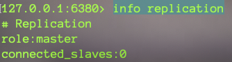
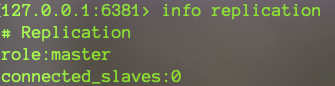
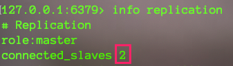

## 概念

提高服务器高可用

  


## 特性

* 主少从多
* 主写从读【从机写数据报错 】
* 读写分离
* 主从同步 【从机也可以有从机，当主机同步数据到从机时，则从机又同步到它的从机，相当于子主机】

## 作用

1. 读写分离

        master写、slave读，提高服务器的读写负载能力

2. 负载均衡

        基于主从结构，配合读写分离，有slave分担master负载，并根据需求的变化改变slave的数量，通过多个从节点分担数据读取负载，大大提高Redis服务器并发量和数据吞吐量

3. 故障恢复

        当master出现问题时，有slave提供服务，实现快速的故障恢复

4. 数据冗余

        实现数据热备份，时持久化之外的一种数据冗余方式

5. 高可用

        基于主从复制，构建哨兵模式与集群，实现Redis的高可用方案

  


## Tips


## 练习 一主一从

### 1、slave连接master


连接成功后会在6379服务器终端以及6380服务器终端有输出内容。如下：


### 2、数据同步

在6379主服务器中存入demo string类型数据。如下图

此时6380服务器中获取并且在两个服务器终端都会提示如下内容


## 练习 一主两从

### 1、环境搭建



> 修改对应配置文件中的端口号。
>
> * 6379 为master
> * 6380和6381为从

### 2、启动三个服务

* 启动6379




* 启动6380和6381




### 3、查看主从信息

```bash
info replication
# 默认都是master，拥有读写能力
```








### 4、搭建主从集群 一主两从

> 设置6380和6381设置为6379的从机。

```bash
slaveof masterIp masterPort #在6380和6381上执行命令
```




> 全量复制 ： 一旦主从关系确定，会自动把主机上已有的数据同步复制到从库
>
> 增量复制 ： master写数据会自动同步到从机
