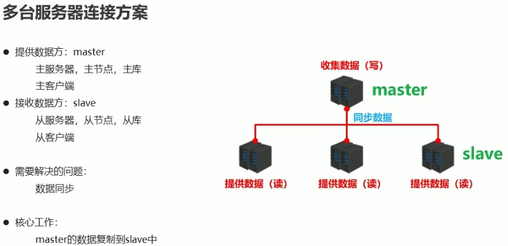
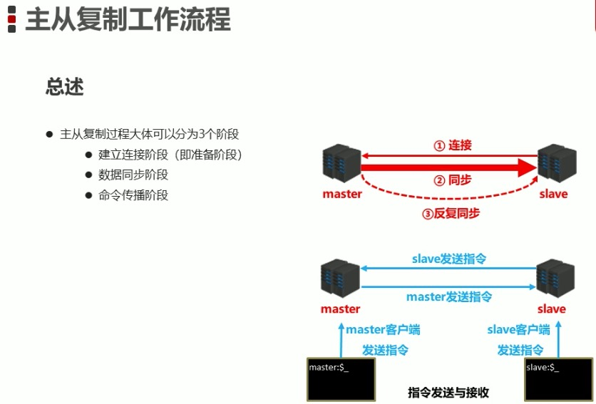
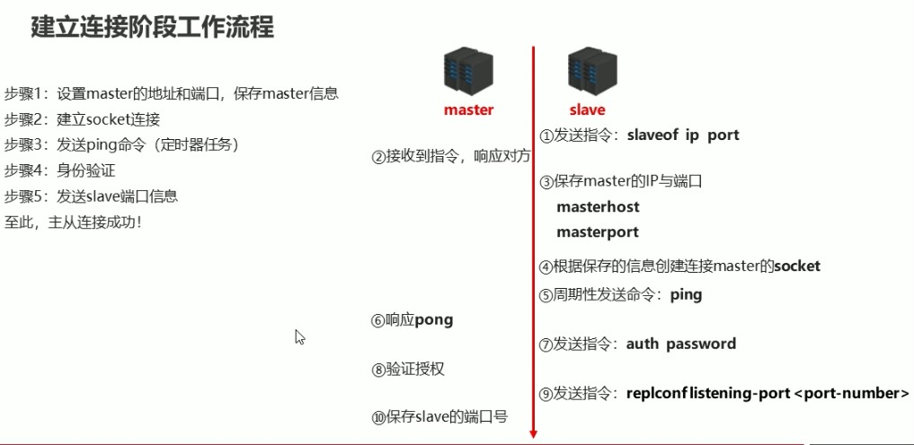
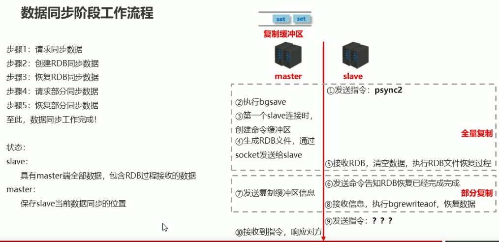
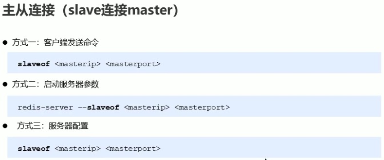
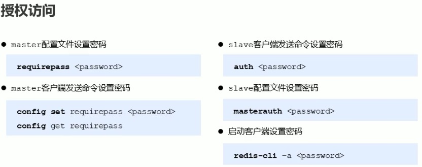
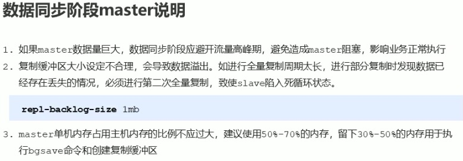
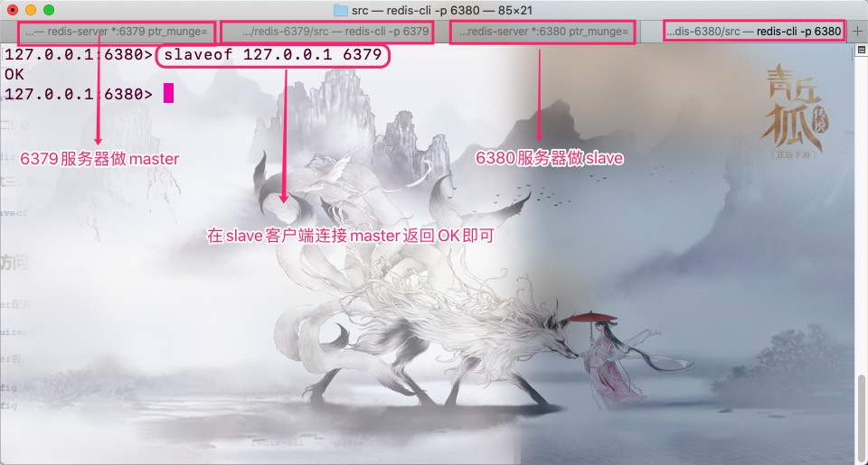
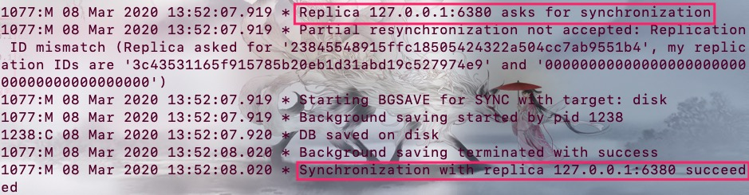
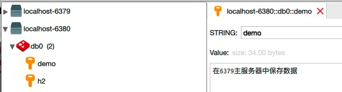

提高服务器高可用

  

## 作用

1. 读写分离

        master写、slave读，提高服务器的读写负载能力

2. 负载均衡

        基于主从结构，配合读写分离，有slave分担master负载，并根据需求的变化改变slave的数量，通过多个从节点分担数据读取负载，大大提高Redis服务器并发量和数据吞吐量

3. 故障恢复

        当master出现问题时，有slave提供服务，实现快速的故障恢复

4. 数据冗余

        实现数据热备份，时持久化之外的一种数据冗余方式

5. 高可用

        基于主从复制，构建哨兵模式与集群，实现Redis的高可用方案

  

## Tips

## 练习

### 1、slave连接master

连接成功后会在6379服务器终端以及6380服务器终端有输出内容。如下：

### 2、数据同步

在6379主服务器中存入demo string类型数据。如下图

此时6380服务器中获取并且在两个服务器终端都会提示如下内容

