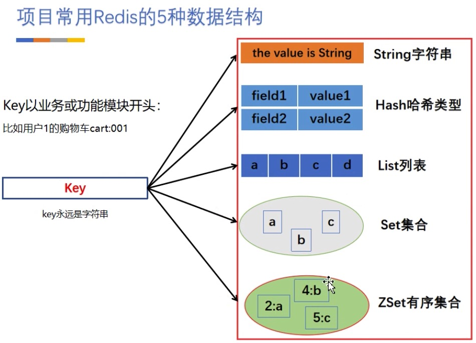
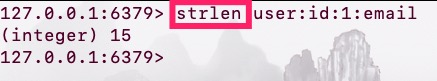
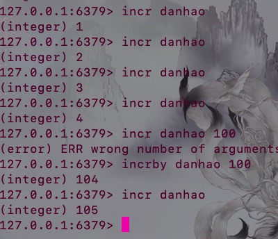
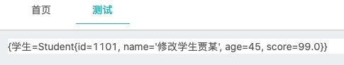
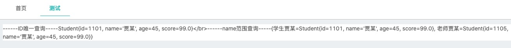
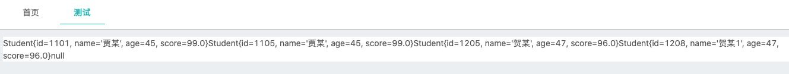

### 设计 Redis Key

#### 分段设计法
　　使用冒号把 key 中要表达的多种含义分开表示，步骤如下：

1. 把表名转化为 key 前缀
2. 主键名（或其他常用于搜索的字段）
3. 主键值
4. 要存储的字段。
eg. 用户表（user）

<table>
    <th>
        <tr>
            <td>id</td>
            <td>name</td>
            <td>email</td>
        </tr>
    </th>
    <tbody>
        <tr>
            <td>1</td>
            <td>zj</td>
            <td>1564899465@qq.com</td>
        </tr>
        <tr>
            <td>2</td>
            <td>ai</td>
            <td>1345849879@qq.com</td>
        </tr>
    </tbody>
</table>
这个简单的表可能经常会有这个的需求：>根据用户 id 查询用户邮箱地址，可以选择把邮箱地址这个数据存到 redis 中：

```bash
set user:id:1:email 156577812@qq.com;
set user:id:2:email 156577812@qq.com;
```

#### 一对多原则

使用到Redis时，找到对象的一对多关系，一就是key，多就是Redis中数据类型。假如购物车实现，在此案例中一对多关系便是用户ID是一，购物车中商品是多，因此设计时使用"业务:客户ID"作为key，使用hash或者list存放商品对象或商品ID又或者（使用hash  key存放ID，filed存放商品ID，value存放商品数量）



### <code><font color=#ff85c0>string</font></code>

#### 简介：

字符串和数字直接存取。结构化数据(数组和集合)需要先序列化，再set到value；相应的，get到value后需要反序列化。不管是简单和复杂的数据都可以直接转为string存储。因为是二进制安全的，所以你完全可以把一个图片文件的内容作为string来存储

* 获取字符串长度

* 往字符串append内容
    >Redis Append 命令 - 如果 key 已经存在并且是一个字符串， APPEND 命令将 value 追加到 key 原来的值的末尾
* 设置和获取字符串的某一段内容
    >Redis Getrange 命令 - 返回 key 中字符串值的子字符
* 设置及获取字符串的某一位（bit）

* 批量设置一系列字符串的内容
    >Redis Mset 命令 - 同时设置一个或多个 key-value 对。

更多命令详情包含其他数据类型：https://www.redis.net.cn/order/3545.html    

```
常用命令: set,get,decr,incr,mget 等。
```

#### 使用场景

1、缓存数据

    1. 商品信息，省市区信息，活动配置等一系列不常变化的冷数据缓存

    2. 非常热门数据的缓存，游戏排行，后台每秒更新一次数据

    3. 简单计数(incr|自增>生成单号|，incrby|指定num自增>|，incrbyfloat)

>>

2、 定时过期

    1. 一个人一天只能进行一次签到
```java
//一天只签到一次
redisUtilSelf.set("userId:2:signIn-time",true,86400);
if(redisUtilSelf.hasKey("userId:2:signIn-time")){
    result.setSuccess(true);
    result.setResult("ID为2的用户已经登录");
}else {
    result.setResult("签到成功");
}
```
>>

    2. 分布式锁

>分布式锁是控制分布式系统或不同系统之间共同访问共享资源的一种锁实现，如果不同的系统或同一个系统的不同主机之间共享了某个资源时，往往通过互斥来防止彼此干扰。分布锁设计目的？      可以保证在分布式部署的应用集群中，同一个方法在同一操作只能被一台机器上的一个线程执行。

    原理：利用Redis中setnx实现，设置时如果key存在则返回false，不存在返回true。假如抢票多个窗口对同一张票抢票(多个资源同一个key进行设值如果返回true则该窗口抢到票)

3、 存放session key，实现一个分布式session系统。Redis的key可以方便地设置过期时间，用于实现session key的自动过期。验证skey时先根据uid路由到对应的redis，如取不到skey，则表示skey已过期，需要重新登录；如取到skey且校验通过则升级此skey的过期时间即可。
    >随着业务的扩大，增加Tomcat节点构成Tomcat集群大势所趋，分布式带来了增加更大规模并发请求的优势，但是也随之到来了一个问题，每个Tomcat只存储来访问自己的请求产生的session，如果Tomcat-A已经为客户端C创建了会话session，那么Tomcat-B并不知道客户端已与集群中的Tomcat-A产生了会话，在访问时就会为C再创建一份session，如果是基于session的验证会话权限的接口(如用户登录认证后才可访问的数据接口)，将会导致在访问集群中不同节点的时候重复认证。session的不共享导致原来的会话管理机制在Tomcat集群中无法工作。

4、 GetSet， 设置新值，返回旧值。比如实现一个计数器，可以用GetSet获取计数并重置为0。
```java
StringBuilder mes=new StringBuilder();
//加法计数器计算后重置0
int numA=15;
int numB=20;
redisUtilSelf.set("result",numA+numB,60);
mes.append("第一次计算结果:").append(redisUtilSelf.getAndSet("result","0"));

int numC=78;
int numD=26;
mes.append("\n重置后结果：").append(redisUtilSelf.get("result"));
redisUtilSelf.set("result",numD+numC,60);
mes.append("\n第二次计算结果:").append(redisUtilSelf.getAndSet("result","0"));
result.setResult(mes.toString());
```
>>

5、 GetBit/SetBit/BitOp/BitCount， BitMap的玩法，比如统计今天的独立访问用户数时，每个注册用户都有一个offset(偏移量)，他今天进来的话就把他那个位设为1，用BitCount就可以得出今天的总人数。
>偏移量：中文占两个字节，非中文占一个字节，而每个字节占8 bit，即8位二进制数字。偏移量就是二进制数字从左往右偏移量是几就是第几位，偏移量0就是第0位。
```java
//每日活跃用户
redisUtilSelf.setBit("daily_active_users",15,true);//ID为15的用户登录
redisUtilSelf.setBit("daily_active_users",14,true);//ID为14的用户登录
redisUtilSelf.setBit("daily_active_users",11,true);//ID为11的用户登录
redisUtilSelf.setBit("daily_active_users",1,true);//ID为1的用户登录
```        
6、 Append/SetRange/GetRange/StrLen，对文本进行扩展、替换、截取和求长度，对特定数据格式非常有用。

#### 实现方式
String在redis内部存储默认就是一个字符串，被redisObject所引用，当遇到incr,decr等操作时会转成数值型进行计算，此时redisObject的encoding字段为int。


### <code><font color=#ff85c0>hash</font></code>

#### 简介
Hash存的是字符串和字符串值之间的映射。Hash将对象的各个属性存入Map里，<font color='orange'>可以只读取/更新对象的某些属性。</font>这样有些属性超长就让它一边呆着不动，另外不同的模块可以只更新自己关心的属性而不会互相并发导致覆盖冲突。

```
常用命令：hget,hset,hgetall 等。
```

#### 使用场景

1、 同一资源的不同属性

```java
//操作不同属性
Student student=new Student();
student.setId(1101);
student.setName("学生贾某");
student.setAge(45);
student.setScore(99);
redisUtilSelf.hset("student","学生",student,300);

//修改某一个属性：对象还是那个对象，只是一种name属性发生了变化
student.setName("修改学生贾某");
redisUtilSelf.hset("student","学生",student,300);
result.setResult(redisUtilSelf.hGetAll("student").toString());//Redis提供了接口(hgetall)可以直接取到全部的属性数据,但是如果内部Map的成员很多，那么涉及到遍历整个内部Map的操作，由于Redis单线程模型的缘故，这个遍历操作可能会比较耗时，而对其它客户端的请求完全不响应，这点需要格外注意。
```
>>

2、 存放结构化数据，比如用户信息。在Memcached或CKV中，对于用户信息比如用户的昵称、年龄、性别、积分等，我们需要先序列化后存储为一个字符串的值，这时候在需要修改其中某一项时，通常需要将所有值取出反序列化后，修改某一项的值，再序列化存储回去。这样不仅增大了开销，也不适用于一些可能并发操作的场合（比如两个并发的操作都需要修改积分）。而Redis的Hash结构可以使你像在数据库中Update一个属性一样只修改某一项属性值。如上：


3、 可用来建索引。比如User对象，除了id有时还要按name来查询，可以建一个Key为user:name:id的Hash，在插入User对象时set user:101{"id":101,"name":"calvin"}， 顺便往这个hash插入一条(hset user:name:id calvin 101)，这时calvin作为hash里的一个key，值为101。按name查询的时候，用hgetuser:name:id calvin 就能从名为calvin的key里取出id。假如需要使用多种索引来查找某条数据时可以使用，一个hash key搞定，避免使用多个string key存放索引值。
```java
//新建索引
Student student=new Student();
student.setId(1101);
student.setName("贾某");
student.setAge(45);
student.setScore(99);
//使用student:id作为key，存放不同id的student。通过item即ID筛选student
redisUtilSelf.hset("student:id",Integer.toString(student.getId()),student,300);
//使用student:id:活name，存放同名字下不同的student。通过hGetAll获取该名字下所有的student
redisUtilSelf.hset("student:id:"+student.getName(),"学生贾某",student,300);

//新增
Student student1=new Student();
student1.setId(1105);
student1.setName("贾某");
student1.setAge(45);
student1.setScore(99);
redisUtilSelf.hset("student:id",Integer.toHexString(student1.getId()),student1,300);
redisUtilSelf.hset("student:id:"+student1.getName(),"老师贾某",student1,300);

//新建索引：可以按照id和name查询信息
StringBuilder builder=new StringBuilder();
//按ID查询：唯一
builder.append("------ID唯一查询-----"+redisUtilSelf.hget("student:id","1101").toString());
//按name查询：多个
builder.append("------name范围查询-----"+redisUtilSelf.hGetAll("student:id:贾某").toString());
result.setResult(builder.toString());
```
>>
#### 实现方式

Redis Hash对应Value内部实际就是一个HashMap，这里会有2种不同实现，这个Hash的成员比较少时Redis为了节省内存会采用类似一维数组的方式来紧凑存储，而不会采用真正的HashMap结构，对应的value redisObject的encoding为zipmap,当成员数量增大时会自动转成真正的HashMap,此时encoding为ht。


### <code><font color=#ff85c0>list</font></code>

#### 简介

List是一个双向链表，支持双向的Pop/Push，江湖规矩一般从左端Push，右端Pop——LPush/RPop，而且还有Blocking的版本BLPop/BRPop，客户端可以阻塞在那直到有消息到来。还有RPopLPush/ BRPopLPush，弹出来返回给client的同时，把自己又推入另一个list，LLen获取列表的长度。还有按值进行的操作：LRem(按值删除元素)、LInsert(插在某个值的元素的前后)，复杂度是O(N)，N是List长度，因为List的值不唯一，所以要遍历全部元素，而Set只要O(log(N))。

1. 按下标进行的操作：下标从0开始，队列从左到右算，下标为负数时则从右到左。

2. LSet ，按下标设置元素值。

3. LIndex，按下标返回元素。

4. LRange，不同于POP直接弹走元素，只是返回列表内一段下标的元素，是分页的最爱。

5. LTrim，裁剪List，比如只保留最新的20条消息。复杂度也是O(N)，其中LSet的N是List长度，LIndex的N是下标的值，LRange的N是start的值+列出元素的个数，因为是链表而不是数组，所以按下标访问其实要遍历链表，除非下标正好是队头和队尾。LTrim的N是移除元素的个数。

```
常用命令：lpush,rpush,lpop,rpop,lrange等。
```

#### 应用场景

1、 用户排队
push，pop(也可以使用MySQL做，但是当单表数量过大时尤其是使用count导致查询异常缓慢)
```Java
Student student=new Student();
student.setId(1101);
student.setName("贾某");
student.setAge(45);
student.setScore(99);
Student student1=new Student();
student1.setId(1105);
student1.setName("贾某");
student1.setAge(45);
student1.setScore(99);
Student student2=new Student(1205,"贺某",47,96);
Student student3=new Student(1208,"贺某1",47,96);
Student student4=new Student(1215,"贺某2",47,96);


StringBuilder builder=new StringBuilder();
//使用ID从小到大表示排队顺序，实际项目中应该加时间字段。这里只是简单模拟
List<Student> studentList= Arrays.asList(student,student1, student2,student3,student4);
List<Student> studentList3=studentList.stream().sorted(Comparator.comparing(Student::getAge)).collect(Collectors.toList());//根据年龄自然顺序

//Redis实现排队以及查询
redisUtilSelf.lLeftPush("student:handle",studentList3.get(0).toString());
redisUtilSelf.lLeftPush("student:handle",studentList3.get(1).toString());
redisUtilSelf.lLeftPush("student:handle",studentList3.get(2).toString());
builder.append(redisUtilSelf.lRightPop("student:handle")).append(redisUtilSelf.lRightPop("student:handle"));
redisUtilSelf.lLeftPush("student:handle",studentList3.get(3).toString());
builder.append(redisUtilSelf.lRightPop("student:handle")).append(redisUtilSelf.lRightPop("student:handle")).append(redisUtilSelf.lRightPop("student:handle"));
result.setResult(builder.toString());
```
>>


2、 实现生产者和消费者模型
阻塞式访问 BRPOP 和 BLPOP 命令
```Java
//消息队列
//消息产生
Timer timer = new Timer();
timer.schedule(new TimerTask() {
    @Override
    public void run() {
        redisUtilSelf.lLeftPush("message:queue", String.valueOf(new Date()));
    }
},1000,5000);

//消息推送 超时两秒
while (true){
    int time=new Random().nextInt(5);
    Thread.sleep(time*1000);
    System.out.println(("睡眠" + time + "加超时两秒后获取消息" + redisUtilSelf.lBRightPop("message:queue", 2, TimeUnit.SECONDS)));
}
```
>>睡眠0加超时两秒后获取消息Wed Mar 04 21:41:07 CST 2020
睡眠4加超时两秒后获取消息Wed Mar 04 21:41:12 CST 2020
睡眠4加超时两秒后获取消息Wed Mar 04 21:41:17 CST 2020
睡眠1加超时两秒后获取消息null
睡眠2加超时两秒后获取消息Wed Mar 04 21:41:22 CST 2020
睡眠4加超时两秒后获取消息Wed Mar 04 21:41:27 CST 2020
睡眠0加超时两秒后获取消息null
睡眠0加超时两秒后获取消息null
睡眠1加超时两秒后获取消息Wed Mar 04 21:41:32 CST 2020
睡眠0加超时两秒后获取消息null
睡眠0加超时两秒后获取消息null
睡眠1加超时两秒后获取消息Wed Mar 04 21:41:37 CST 2020
睡眠3加超时两秒后获取消息Wed Mar 04 21:41:42 CST 2020
睡眠0加超时两秒后获取消息null
睡眠1加超时两秒后获取消息Wed Mar 04 21:41:47 CST 2020
睡眠4加超时两秒后获取消息Wed Mar 04 21:41:52 CST 2020
睡眠2加超时两秒后获取消息null

3、 各种列表，比如twitter的关注列表、粉丝列表等、每篇文章的评论等也可以用Redis的list结构来实现。

4、 消息队列，可以利用Lists的PUSH操作，将任务存在Lists中，然后工作线程再用POP操作将任务取出执行。这里的消息队列并没有ack机制，如果消费者把任务给Pop走了又没处理完就死机了怎么办？解决方法之一是加多一个sorted set，分发的时候同时发到list与sorted set，以分发时间为score，用户把任务做完了之后要用ZREM消掉sorted set里的job，并且定时从sorted set中取出超时没有完成的任务，重新放回list。另一个做法是为每个worker多加一个的list，弹出任务时改用RPopLPush，将job同时放到worker自己的list中，完成时用LREM消掉。如果集群管理(如zookeeper)发现worker已经挂掉，就将worker的list内容重新放回主list。

5、 利用LRANGE可以很方便的实现list内容分页的功能。

6、 取最新N个数据的操作：LPUSH用来插入一个内容ID，作为关键字存储在列表头部。LTRIM用来限制列表中的项目数最多为5000。如果用户需要的检索的数据量超越这个缓存容量，这时才需要把请求发送到数据库。


#### 实现方式
Redis list的实现为一个双向链表，即可以支持反向查找和遍历，更方便操作，不过带来了部分额外的内存开销，Redis内部的很多实现，包括发送缓冲队列等也都是用的这个数据结构。


### <code><font color=#ff85c0>set</font></code>

#### 简介
是一种无序的集合，集合中的元素没有先后顺序，不重复。将重复的元素放入Set会自动去重。

```
常用命令：sadd,spop,smembers,sunion等。
```

#### 应用场景

1、 去重列表

    1. 标签

    2. 用户标签

    3. 商家标签

</br>

春节活动一共有 abcde 5个任务，用户A已经完成a,b，用户B已经完成 c,d
2、 交集

    用户A，用户B 都完成的任务

3、 并集

    用户A，用户B 任一完成的任务

4、 差集

    用户A还没有完成的任务

5、 获取随机元素

    从礼品库 set 中随机获得一个礼品

6、 某些需要去重的列表，并且set提供了判断某个成员是否在一个set集合内的重要接口，这个也是list所不能提供的。

7、 可以存储一些集合性的数据，比如在微博应用中，可以将一个用户所有的关注人存在一个集合中，将其所有粉丝存在一个集合。Redis还为集合提供了求交集、并集、差集等操作，可以非常方便的实现如共同关注、共同喜好、二度好友等功能，对上面的所有集合操作，你还可以使用不同的命令选择将结果返回给客户端还是存集到一个新的集合中。又比如QQ有一个社交功能叫做“好友标签”，大家可以给你的好友贴标签，比如“大美女”、“土豪”、“欧巴”等等，这里也可以把每一个用户的标签都存储在一个集合之中。

8、 想要知道某些特定的注册用户或IP地址，他们到底有多少访问了某个页面，可以这样实现：SADD page:day1:<page_id> <user_id> 。想知道特定用户的数量，使用SCARD page:day1:<page_id>。 需要测试某个特定用户是否访问了这个页面？SISMEMBER page:day1:<page_id>
```Java
Fans f=new Fans(1101,"粉丝一号",new ArrayList<String>(){{
    this.add("12");
    this.add("13");
    this.add("14");
    this.add("15");
    this.add("19");
}});
Fans f1=new Fans(1105,"粉丝2号",new ArrayList<String>(){{
    this.add("12");
    this.add("16");
    this.add("14");
    this.add("17");
    this.add("19");
}});
for (String star : f.getStars()) {
    redisUtilSelf.sAdd("fans:"+f.getUid(),star);
}
for (String star : f1.getStars()) {
    redisUtilSelf.sAdd("fans:"+f1.getUid(),star);
}
result.setResult(redisUtilSelf.sIntersect("fans:"+f.getUid(),"fans:"+f1.getUid()).toString());
```
>>


#### 实现方式

set 的内部实现是一个 value永远为null的HashMap，实际就是通过计算hash的方式来快速排重的，这也是set能提供判断一个成员是否在集合内的原因。

### <code><font color=#ff85c0>Sorted Set</font></code>

#### 简介

有序集合，相比set，元素放入集合时还要提供该元素的分数，可根据分数自动排序。

```
常用命令：zadd,zrange,zrem,zcard等
```

#### 应用场景

1、 排行榜

    1. 用户消费排行

    2. 点赞排行等


5、 存放一个有序的并且不重复的集合列表，比如twitter 的public timeline可以以发表时间作为score来存储，这样获取时就是自动按时间排好序的。

6、 可以做带权重的队列，比如普通消息的score为1，重要消息的score为2，然后工作线程可以选择按score的倒序来获取工作任务。让重要的任务优先执行。

7、 排行榜相关：ZADD leaderboard <score> <username> 。 得到前100名高分用户很简单：ZREVRANGE leaderboard 0 99。用户的全球排名也相似，只需要执行：ZRANK leaderboard <username>。

8、 新闻按照用户投票和时间排序，ZADD时的score = points / time^alpha， 这样用户的投票会相应的把新闻挖出来，但时间会按照一定的指数将新闻埋下去。

9、 过期项目处理：使用unix时间作为关键字，用来保持列表能够按时间排序。对current_time和time_to_live进行检索，完成查找过期项目的艰巨任务。另一项后台任务使用ZRANGE...WITHSCORES进行查询，删除过期的条目。

```Java
//前台传来数据有商品对象(id,销量等等)
Shop shop=new Shop(110101,"三星note10",14);
Shop shop1=new Shop(110102,"三星note9",5425);
Shop shop2=new Shop(110103,"三星note8",2452);
Shop shop3=new Shop(110104,"三星note7",8570);
Shop shop4=new Shop(110105,"三星note6",2587);
Shop shop5=new Shop(110106,"三星note5",7852);
Shop shop6=new Shop(110107,"三星note4",4525);

//        按照商品销量进行排行(使用sort set来做。key为shop:Number。value为商品ID。权重为销量)
//        可以获得指定商品的排名
//        显示实时销售动态情况 不停获取即可

redisUtilSelf.zAdd("shop:num",Integer.toString(shop.getId()),shop.getNumber());
redisUtilSelf.zAdd("shop:num",Integer.toString(shop1.getId()),shop1.getNumber());
redisUtilSelf.zAdd("shop:num",Integer.toString(shop2.getId()),shop2.getNumber());
redisUtilSelf.zAdd("shop:num",Integer.toString(shop3.getId()),shop3.getNumber());
redisUtilSelf.zAdd("shop:num",Integer.toString(shop4.getId()),shop4.getNumber());
redisUtilSelf.zAdd("shop:num",Integer.toString(shop5.getId()),shop5.getNumber());
redisUtilSelf.zAdd("shop:num",Integer.toString(shop6.getId()),shop6.getNumber());

//销量排行
System.out.println(redisUtilSelf.zReverseRange("shop:num", 0, 4));

//提升排行
System.out.println("提升note10排名第一后显示----------");
redisUtilSelf.zIncrementScore("shop:num",Integer.toString(shop.getId()),10000);
System.out.println(redisUtilSelf.zReverseRange("shop:num", 0, 4));
```
>>[110104, 110106, 110102, 110107, 110105]
提升note10排名第一后显示----------
[110101, 110104, 110106, 110102, 110107]
#### 实现方式

Redis sorted set的内部使用HashMap和跳跃表(SkipList)来保证数据的存储和有序，HashMap里放的是成员到score的映射，而跳跃表里存放的是所有的成员，排序依据是HashMap里存的score,使用跳跃表的结构可以获得比较高的查找效率，并且在实现上比较简单。


</br>
### 注意事项

___

 1. *有时候我们的得分并不是由某一项业务值决定的，可能是由两项业务值来排序的，比如先看用户的实际得分，在看用户等级，那么我们在设计score的时候可以用小数点之前的值表示得分，小数点之后的值表示等级，如果有其他特殊要求，还可以考虑得分加上某个极大值来处理。*

2. *每个 key 都应该有合理的失效时间*

3. *string的过期时间在重新设值后会被覆盖*

4. *string类型的 set 操作可以覆盖类型*

5. *合理使用相应的数据结构 string用来不需要数据结构存放的数据。list双向列表用来排队。sort zet主要用来排序。*

6. *不要用list存大量数据并检索*

7. *合理规划 key 的数量*

8. *判断用户有没有参加应该用set，不应该每个用户一个key*


</br>
### 命令索引

----

#### 通用命令

<code><font color=#ff85c0>keys * [pattern]</font></code> ---  遍历当前reids所有的key O(n)

<code><font color=#ff85c0>dbsize </font></code> --- 计算key的总数 O(1)

<code><font color=#ff85c0>exists [key] </font></code>--- 判断key是否存在 O(1)

<code><font color=#ff85c0>del [key...]</font></code> --- 删除一个或多个指定的key O(1)

<code><font color=#ff85c0>expire key [seconds] </font></code>--- key在seconds秒后过期 O(1)

<code><font color=#ff85c0>ttl [key]</font></code> --- 查看key剩余的过期时间 O(1)

<code><font color=#ff85c0>persist [key] </font></code>--- 去掉key的过期时间 O(1)

<code><font color=#ff85c0>type [key] </font></code>--- 返回key的数据结构类型 O(1)

###String相关命令：

<code><font color=#ff85c0>get [key]</font></code> --- 获取key对应的value O(1)

<code><font color=#ff85c0>mget [key1 ke2 ...] </font></code>--- 批量获取key，原子操作 O(n)

<code><font color=#ff85c0>getset [key newValue] </font></code>--- 设置key新值为newValue并返回旧的value O(1)

<code><font color=#ff85c0>getrange [key start end]</font></code> --- 获取字符串指定下标所有的值 O(1)

<code><font color=#ff85c0>set [key value]</font></code> --- 设置key-value O(1)

<code><font color=#ff85c0>setrange [key index value] </font></code>--- 设置指定下标所有对应的值 O(1)

<code><font color=#ff85c0>mset [key1 value1 key2 value2 ...]</font></code> --- 批量设置key-value O(n)

<code><font color=#ff85c0>append [key value] </font></code>--- 将value追加到旧的value O(1)

<code><font color=#ff85c0>setnx [key value] </font></code>--- key不存在，才设置 O(1)

<code><font color=#ff85c0>set [key value xx] </font></code>--- key存在，才设置 O(1)

<code><font color=#ff85c0>setex [key value seconds] </font></code>--- 设置key，同时设置过期时间 O(1)

<code><font color=#ff85c0>incr [key]</font></code>--- key自增1，如果key不存在，自增后get(key)=1 O(1)

<code><font color=#ff85c0>decr [key] </font></code>--- key自减1，如果key不存在，自减后get(key)=-1 O(1)

<code><font color=#ff85c0>incrby [key k] </font></code>--- key自增k，如果key不存在，自增后get(key)=k O(1)

<code><font color=#ff85c0>incrbyfloat [key 3.5] </font></code>--- 增加key对应的float值3.5 如需减法，传负值即可 O(1)

<code><font color=#ff85c0>decrby [key k] </font></code>--- key自减k，如果key不存在，自减后get(key)=-k O(1)

<code><font color=#ff85c0>strlen [key] </font></code>--- 返回字符串的长度（注意中文占用字节数的问题）O(1)

###Hash相关命令：

<code><font color=#ff85c0>hget [key field]</font></code> --- 获取hash key对应的field的value O(1)

<code><font color=#ff85c0>hset [key field value]</font></code> --- 设置hash key对应的field的value O(1)

<code><font color=#ff85c0>hdel [key field]</font></code>--- 删除hash key对应的field的value O(1)

<code><font color=#ff85c0>hexists [key field]</font></code> --- 判断hash key 是否有field O(1)

<code><font color=#ff85c0>hlen [key]</font></code> --- 获取hash key field的数量，redis内部维护了这个值的计数，而不是每次遍历，效率高 O(1)

<code><font color=#ff85c0>hmget [key field1 field2 ...]</font></code> --- 批量获取hash key的一批field对应的值 O(n)

<code><font color=#ff85c0>hmset [key field1 field2 ...] </font></code>--- 批量设置hash key的一批field的value O(n)

<code><font color=#ff85c0>hincrby [key field count]</font></code> --- 设置hash key的field字段自增count O(1)

<code><font color=#ff85c0>hincrbyfloat [key field float] </font></code>--- hincrby的浮点数版 O(1)

<code><font color=#ff85c0>hgetall [key] </font></code>--- 返回hash key对应所有的field和value O(n)

<code><font color=#ff85c0>hvals [key] </font></code>--- 返回hash key对应所有field的value O(n)

<code><font color=#ff85c0>hkeys [key] </font></code>--- 返回hash key对应的所有field O(n)

<code><font color=#ff85c0>hsetnx [key field value]</font></code> --- 设置hash key对应的field的value 如过field存在，则失败 O(1)

###List相关命令：

<code><font color=#ff85c0>rpush [key value1 value2...valueN] </font></code>--- 从列表右端(后端)插入值 (1-N个) O(1~n)

<code><font color=#ff85c0>lpush [key value1 value2...valueN] </font></code>--- 从列表左侧(头部)插入值 (1-N个) O(1~n)

<code><font color=#ff85c0>linsert [key before|after value newValue]</font></code> --- 在list指定的值(前 | 后)插入newValue,需要遍历 O(n)

<code><font color=#ff85c0>lpop [key] </font></code>--- 从列表左侧弹出一个item O(1)

<code><font color=#ff85c0>rpop [key] </font></code>--- 从列表右侧弹出一个item O(1)

<code><font color=#ff85c0>lrem [key count value]</font></code> --- 根据count值，从列表中删除所有value相等的项 O(n)

(1) count > 0，从左到右，删除最多count个与value相等的项

(2) count < 0，从右到左，删除最多count个与value相等的项

(3) count = 0，删除list中所有与value相等的项

<code><font color=#ff85c0>ltrim [key start end]</font></code> --- 按照索引范围修剪列表 O(n)

<code><font color=#ff85c0>lrange [key start end] </font></code>--- 获取list指定索引范围的所有item，end为-1时，取到末尾 O(n)

<code><font color=#ff85c0>lindex [key index]</font></code> --- 获取list指定索引的item，index为-1，取最后一个item O(n)

<code><font color=#ff85c0>llen [key]</font></code> --- 获取list长度，内部优化值 O(1)

<code><font color=#ff85c0>lset [key index newValue] </font></code>--- 设置list指定索引值为newValue O(n)

<code><font color=#ff85c0>blpop [key timeout]</font></code></font></code></font></code> --- lpop阻塞版本，timeout是阻塞超时时间，timeout=0为永不阻塞 O(1)

<code><font color=#ff85c0>brpop [key timeout]</font></code></font></code> --- rpop阻塞版本，timeout是阻塞超时时间，timeout=0为永不阻塞 O(1)

###Set相关命令：

<code><font color=#ff85c0>sadd [key element] </font></code>--- 向集合key添加element(如果element存在，添加失败) O(1)

<code><font color=#ff85c0>srem [key element]</font></code></font></code></font></code></font></code></font></code></font></code></font></code></font></code></font></code></font></code> --- 将集合key中的element移除掉 O(1)

<code><font color=#ff85c0>scard [key]</font></code></font></code></font></code></font></code></font></code></font></code></font></code></font></code></font></code> --- 计算集合大小 O(1)

<code><font color=#ff85c0>sismember [key value] </font></code></font></code></font></code></font></code></font></code></font></code></font></code></font></code>--- 判断value是否在集合中

<code><font color=#ff85c0>srandmember [key count] </font></code></font></code></font></code></font></code></font></code></font></code></font></code>--- 从集合中随机挑count个元素，只是选取，不会提出

<code><font color=#ff85c0>spop [key]</font></code></font></code></font></code></font></code></font></code></font></code> --- 从集合中随机弹出一个元素

<code><font color=#ff85c0>smembers [key] </font></code></font></code></font></code></font></code></font></code>--- 获取集合所有元素，返回结果无序，如果集合大小心使用

<code><font color=#ff85c0>sdiff [key1 key2] </font></code></font></code></font></code></font></code>--- 取两个集合的差集

<code><font color=#ff85c0>sinter [key1 key2]</font></code></font></code></font></code> --- 取两个集合的交集

<code><font color=#ff85c0>sunion [key1 key2] </font></code></font></code>--- 取两个集合的并集

<code><font color=#ff85c0>sdiff | sinter | sunion + store destkey </font></code>--- 将差集、交集、并集结果保存到destkey中

###Zset相关命令：

<code><font color=#ff85c0>zadd [key score element(可以是多对)] </font></code></font></code></font></code></font></code></font></code></font></code></font></code></font></code></font></code></font></code>--- 向集合中添加score和element O(logN)

<code><font color=#ff85c0>zrem [key element(可以是多个)] </font></code></font></code></font></code></font></code></font></code></font></code></font></code></font></code></font></code>--- 删除集合中元素 O(1)

<code><font color=#ff85c0>zscore [key element]</font></code></font></code></font></code></font></code></font></code></font></code></font></code></font></code> --- 返回改元素的分数 O(1)

<code><font color=#ff85c0>zincrby [key increScore element] </font></code></font></code></font></code></font></code></font></code></font></code></font></code>--- 增加或减少元素分数 O(1)

<code><font color=#ff85c0>zcard [key] </font></code></font></code></font></code></font></code></font></code></font></code>--- 返回元素的总个数 O(1)

<code><font color=#ff85c0>zrank [key element] </font></code></font></code></font></code></font></code></font></code>--- 返回element在集合中的排名，从小到大排

<code><font color=#ff85c0>zrevrank [key element]</font></code></font></code></font></code></font></code> --- 返回element在集合中的排名，从大到小排

<code><font color=#ff85c0>zrange [key start end withscores]</font></code></font></code></font></code> --- 获取指定排名范围的的元素和它的分数，可以不带withscores，即不打印分数 O(log(n)+m)

<code><font color=#ff85c0>zrevrange [key start end withscores] </font></code></font></code>--- zrange的倒序版本

<code><font color=#ff85c0>zrangebyscore [key minScore maxScore withscores] </font></code>--- 返回指定分数范围的升序元素 O(log(n)+m)

<code><font color=#ff85c0>zrevrangebyscore [key minScore maxScore withscores] </font></code>--- zrangebyscore降序版本

<code><font color=#ff85c0>zcount [key minScore maxScore] </font></code></font></code></font></code></font></code></font></code></font></code></font></code></font></code></font></code>--- 返回有序集合指定分数范围的元素个数 O(log(n)+m)

<code><font color=#ff85c0>zremrangebyrank [key start end] </font></code></font></code></font></code></font></code></font></code></font></code></font></code></font></code>--- 删除指定排名内的升序元素 O(log(n)+m)

<code><font color=#ff85c0>zremrangebyscore [key minScore maxScore] </font></code></font></code></font></code></font></code></font></code></font></code></font></code>--- 删除指定分数内的升序元素 O(log(n)+m)

<code><font color=#ff85c0>zinterstore </font></code></font></code></font></code></font></code></font></code></font></code>--- 取两集合交集并存储

<code><font color=#ff85c0>zunionstore </font></code></font></code></font></code></font></code></font></code>--- 取两集合并集并存储

###Bitmap相关命令：

<code><font color=#ff85c0>setbit [key offset value] </font></code></font></code></font></code></font></code>--- 给位图指定索引设置值（0或1）注意offset偏移量设置，可能有较大耗时

<code><font color=#ff85c0>getbit [key offset] </font></code></font></code></font></code>--- 获取位图指定索引的值

<code><font color=#ff85c0>bitcount [key start end] </font></code></font></code>--- 获取位图指定范围内（start到end，单位为字节，如果不指定就是获取全部）值为1的个数

<code><font color=#ff85c0>bitop [op destkey key...] </font></code>--- 做多个bitmap的and、or、not、xor操作，并将结果保存在destkey中

<code><font color=#ff85c0>bitpos [key targetBit start end]</font></code> --- 计算位图指定范围（start到end，单位为字节，如果不指定就是获取全部）第一个偏移量对应的值等于targetBit（0或1）的位置
