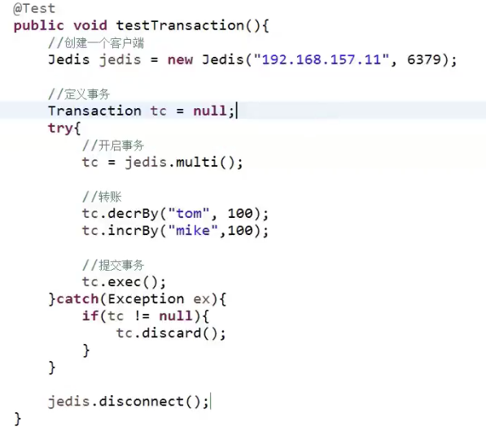

[toc]
##事务

解决多个客户端执行多条连续的指令被干扰、打断、插队。将一连串指令加入**事务queue**中最小执行单元。等待执行事务`exec`后开始执行，并不是真正的事务(没有回滚)。

### ACID

- Atomicity（原子性）：一个事务（transaction）中的所有操作，要么全部完成，要么全部不完成，不会结束在中间某个环节。事务在执行过程中发生错误，会被恢复（Rollback）到事务开始前的状态，就像这个事务从来没有执行过一样。

	> Redis并不能全部保证：
	>
	> 命令入队时就报错(即语法错误)，会放弃事务执行，保证原子性；
	>
	> 命令入队时没报错(语法没错，执行错误)，实际执行时报错，不保证原子性；
	>
	> EXEC 命令执行时实例故障，如果开启了 AOF 日志，可以保证原子性。

	> <font color=ff00aa>Redis具备一定的原子性，但是不支持回滚</font>

- Consistency（一致性）：在事务开始之前和事务结束以后，数据库的完整性没有被破坏。这表示写入的资料必须完全符合所有的预设规则，这包含资料的精确度、串联性以及后续数据库可以自发性地完成预定的工作。

	> Redis能够保证

- Isolation（隔离性）：数据库允许多个并发事务同时对其数据进行读写和修改的能力，隔离性可以防止多个事务并发执行时由于交叉执行而导致数据的不一致。事务隔离分为不同级别，包括读未提交（Read uncommitted）、读提交（read committed）、可重复读（repeatable read）和串行化（Serializable）。

	> Redis并不能够全部保证
	>
	> 并发操作在 EXEC 命令前执行，此时，**隔离性的保证要使用 WATCH 机制来实现，否则隔离性无法保证；**
	>
	> 并发操作在 EXEC 命令后执行，此时，隔离性可以保证。

- Durability（持久性）：事务处理结束后，对数据的修改就是永久的，即便系统故障也不会丢失。

	> **Redis无论采用RDB还是AOF都不能保证完全持久性，比如利用AOF实时持久化，还是很大程度能够保证持久性的**

### 事务执行流程

```bash
1. 开始事务。
2. 命令入队。
3. 执行事务。
```

开启事务

```bash
multi ：设定事务的开启位置，此指令执行后，后续的指令均加入到事务中。
```

执行事务

```bash
exec ：设定事务的结束位置，与multi成对出现、使用。
```

取消事务

```bash
discard ： 终止当前事务的定义，发生在multi之后，exec之前。即已经压入指令到队列，相当于清除队列中指令并且结束整个事务
```


### 案例





### Tips

1. 事务中指令出现语法错误则该事务取消。执行exec提示事务不存在。
2. <code><font color=FF00FF>如果语法不错，但是其中有一条指令执行出现错误，则整个事务都不会回滚。正确的执行错误的报错，并且在报错指令后的指令任然执行</font></code>。


### 情景引出

加入双十一高并发场景下，有多个线程同时走到了同一个账户减额这一步骤【如果账户余额验证、减额等一系列操作没有加锁】，账户本身就1000，结果三笔消费都消费1000，那么账户余额就是-2000。对于数据库和Java都有对应的锁机制解决线程安全问题。Redis中有没有呢？

有，有Redis悲观锁、Redis乐观锁


### 悲观锁

类似于jvm 中的Synchronized 和 Lock以及数据库中的行锁、表锁、读锁、写锁。操作共享数据时整个操作过程都上锁。导致性能较低


### 乐观锁

类似于jvm中的CAS算法原理【S(共享数据)、A(每个线程S副本)、B(每个线程S修改的值)】比较更新。数据库乐观锁使用版本号(和A一个效果)来进行对比。


> Redis事务就是使用乐观锁实现的。


### Redis事务冲突如何解决呢？

> Redis执行命令的任务线程不是单线程吗？线程安全，为什么key会发生改变呢？
>
> 假如多个客户端同时对相同的几个key事务操作。客户端A 优先客户端B执行，那么客户端B的事务就没有意义了。

<font color=ff00aa>在事务之前使用锁进行操作</font>

对key加锁

```java
watch key1【key2...】: 在执行exec前如果key发生了变化，终止事务执行。
```

>避免多人操作同一事件。多个采购员采购同一物品，如果第一个采购员采购完成则其余采购员的采购事务将不会执行。

取消监控

```bash
unwatch key1 【key2...】
```

案例

```java
import redis.clients.jedis.Jedis;
import redis.clients.jedis.Transaction;
 
public class TransactionExample {
    public static void main(String[] args) {
        // 创建 Redis 连接
        Jedis jedis = new Jedis("xxx.xxx.xxx.xxx", 6379);
        // 设置 Redis 密码
        jedis.auth("xxx");
        // 设置键值
        jedis.set("k", "v");
        // 开启监视 watch
        jedis.watch("k");
        // 开始事务
        Transaction tx = jedis.multi();
        // 命令入列
        tx.set("k", "v2");
        // 执行事务
        tx.exec();
        System.out.println(jedis.get("k"));
        jedis.close();
    }
}
```


### 分布式锁

设置公共锁

    setnx lock-key value
详情见第二节-string数据类型-分布式锁

### 分布式锁改良

假如子分布式锁中有一个客户上锁后，其所在的服务器挂掉了，锁资源一直未被释放，则会造成死锁情况。

解决方案

1、对锁设置超时

    expire lock-key second
    pexpire lock-key milliseconds
