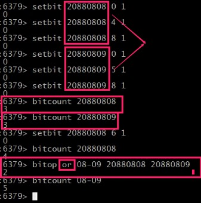
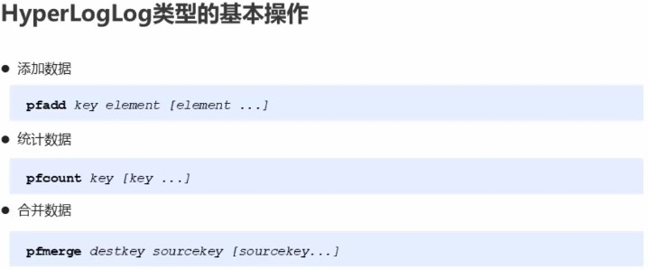

[toc]
### Bitmaps

对string数据类型二进制位操作

获取bit

    getbit

​    
设置bit

    setbit

>eg：
setbit bits 15 1.
setbit bits 2  1.
则key为bits的字符串中第二位和第十五为为1，其余都为0.可将偏移量作为ID，1|0作为数据的状态

指定key按位进行交、并、非、异或操作。将结果保存到destKey中

    bitop op destKey Key1 [key2...]

* and :交
* or  :并
* not :非
* xor :异或

统计指定key中1的数量

    bitcount key [start end]

    

### HyperLoLog

  

   

 ### Tips

 * 用于进行基数统计，不实际和，不保存数据，只是记录数量而不是具体数据

 * 核心是基数估算算法，最终数值粗存在一定误差

 * 误差范围：基数估计的结果是一个带有0.81%标准错误的近似值

 * pfadd命令不是一次性分配12k内存使用，会随着技术的增加内存逐渐增打

 ### GEO

 地理位置操作(告诉我两个地理位置坐标(经纬度)，则可以算出两个位置的水平距离高度忽略等)

  

