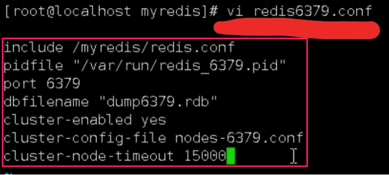
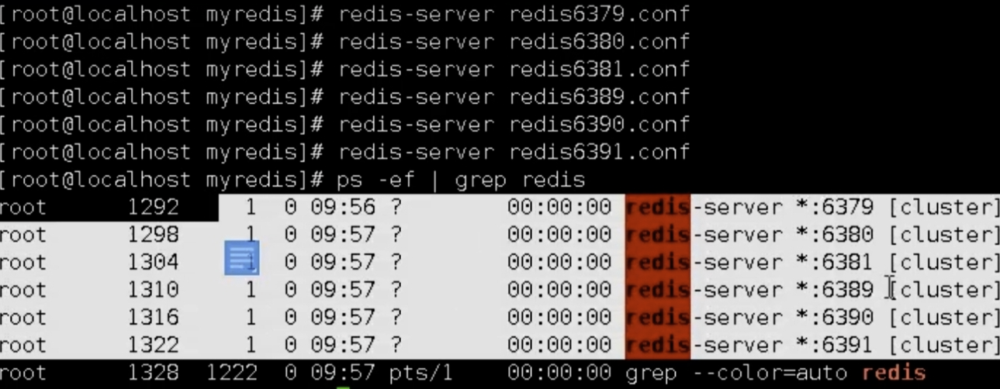
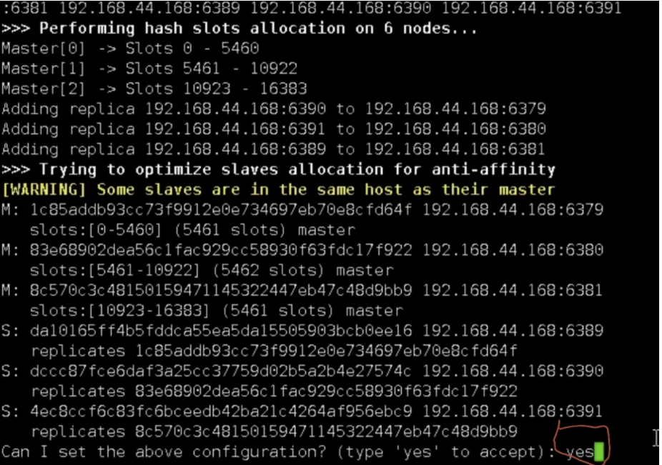
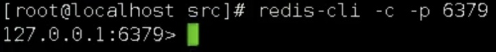
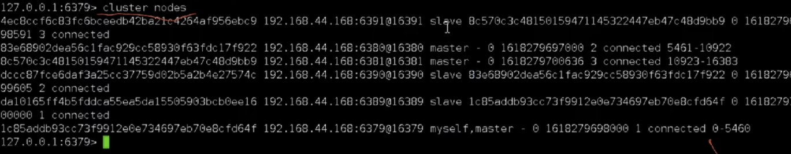
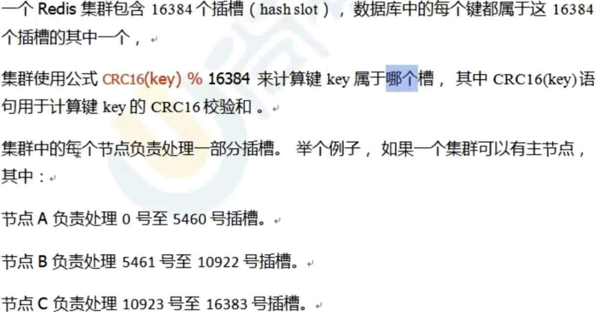
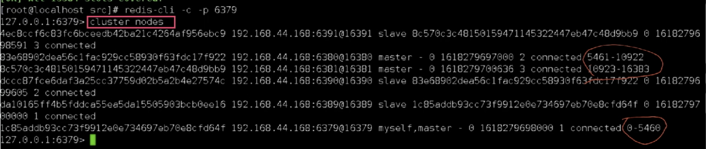
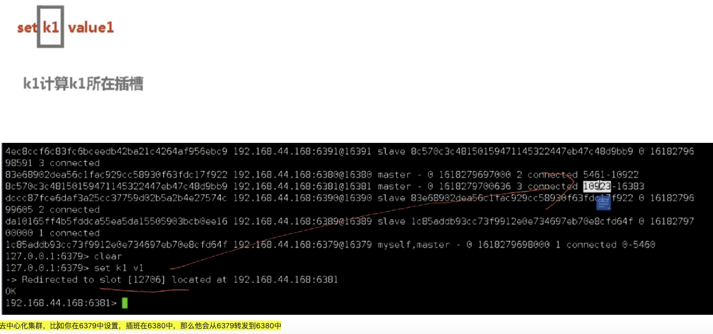
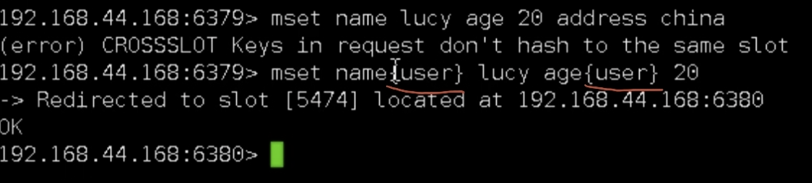

## 为什么需要集群

> 主从复制其实就是集群的一种，解决了系统的高可用问题，但是高并发没有解决。如何？使用集群横向扩展多个主从复制。


* 解决水平扩容问题，利用分片
* 解决高并发压力


## 三主三从集群搭建

> **即三个主从结构，其中每个主从结构都可以搭建哨兵机制，并且这里的主从泛指一主一从或者一主多从**

> Redis集群使用【无中心化】结构，即没有网关或者说是固定访问接口，你任意访问一个主机都可以获取到数据，其内部有转发机制，即如果一个key不存在A主机，则A主机会转发给B，以此类推，类似于责任链模式

1. 制作六个配置文件，即六个Redis并分配如下端口

	

2. 六个配置文件如下配置

	

	* cluster-enable yes ：打开集群模式
	* cluster-config-file nodes-6379.conf  : 设定节点配置文件
	* Cluster-node-timeout 15000  :  设定节点失联时间，超过该时间后，集群自动进行主从切换

3. 启动六个服务

	


4. 将六个服务合并为一个集群

	

	> 这里使用了一台电脑进行模拟，真实环境中是六个IP，并且不得使用127.0.0.1，使用真实IP地址。

	

5. 任意连接一个主机进行测试

	

6. 查看集群信息

	


## 集群插槽

上面我们讲过利用分片进行横向扩展。其中是如何实现的呢？就是利用插槽进行隔离存放数据。将key平均分布到各个节点上。





### 查看主节点插槽信息




### 节点set值过程




### 批量设置key

不支持批量设置key，因为插槽无法支持。但是可以使用按主插入。




### 故障恢复

* 主机停机后

	从机由与哨兵模式变为主机，当主机恢复后重启后变为从机。

* 主从都挂掉

	


## 集群代码测试

```java
void contextLoads() throws IOException {
  //任意一个主机即可，无中心化集群
  HostAndPort hostAndPort = new HostAndPort("192.168.31.5",6379 );
  JedisCluster jedisCluster = new JedisCluster(hostAndPort);

  //操作
  jedisCluster.set("test", "coco");

  String key = jedisCluster.get("test");
  System.out.println(key);

  jedisCluster.close();
}
```

