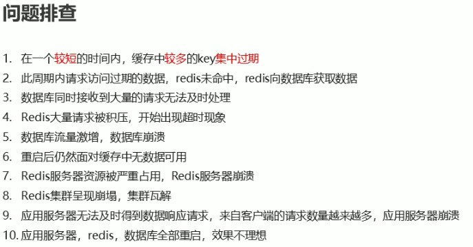
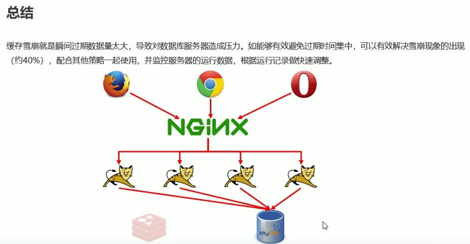

## 缓存预热

问题

    服务器开启后迅速宕机

  

  

## 缓存雪崩

### 造成原因

大量的key同时失效，导致DB承受了大量请求

### 解决办法

## 缓存击穿

### 造成原因

一个非常热点的key，如果迎来高并发时，恰巧这个key又失效了，那么这些高并发请求就之久走了DB，造成DB崩溃

### 解决办法

* 对于热key在高并发期间延长时间
* 对key分布式锁，高并发下也只能有一个请求走db，然后存入Redis

## 缓存穿透

### 造成原因

用户查一个数据，发现Redis中没有，也就是缓存没有命中 ，于是去DB中进行查询，当这个key进行大量查询时，数据库将承受很大的压力，导致DB崩溃。

### 解决办法

* 布隆过滤器

	是一种数据结构，对所有可能查询到参数以hash形式存储，在控制层进行校验，不符合则丢弃，从而避免了对底层存储系统的查询压力

* 缓存null

	对于查询结果为null的数据进行缓存，并设定短存活时间，例如30-60s，最高5分钟

* 实时监控

* key加密

