# 分布式锁

## 为什么需要分布式锁

在早之前单体应用之前。我们并不需要分布式锁，也没有见过分布式锁，因为单体应用中只有一个jvm(一个进程)，面对高并发时我们使用jvm锁就可以锁住所有并发，保证线程安全。

随着业务量暴增，架构由单体进阶为集群或者微服务。这种架构面对高并发或者线程安全使用jvm锁就不得行了，因为jvm锁只能锁住当前进程。分布式锁由此诞生。


## 原理

使用一个共享的内存存储数据，所有进程去访问该内存中数据判断资源是否有锁。保证数据安全。


## 同类产品

* Redis实现分布式锁

	利用Redis单进程和setnx命令，上锁：setnx为true则上锁成功，false则自旋，释放锁：上锁并操作完成后删除key即可

* 表锁

* zookeeper


## 流程

> 模拟商品库存减少

### 1、超卖问题

#### 超卖问题复现

```java
@RestController
public class LockController {

    private final String STOCK = "stock";

    @Autowired
    private RedisTemplate redisTemplate;

    @Autowired
    private StringRedisTemplate stringRedisTemplate;

    @GetMapping("/lock1")
    public void testLock() {
        BoundValueOperations<String, String> boundValueOperations = stringRedisTemplate.boundValueOps(STOCK);

        String num = boundValueOperations.get();
        if (Integer.valueOf(num)>0){
            Long decrement = boundValueOperations.decrement();
            System.out.println("扣减成功！ 剩余库存 ： "+ decrement);
        }else{
            System.out.println("扣减失败，库存不足！！");
        }
    }
}
```


#### 原因剖析

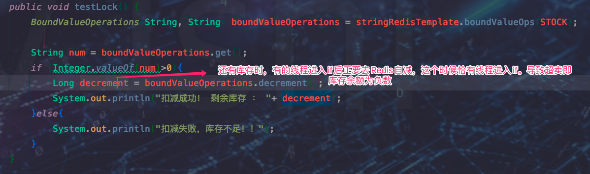

> 如果在 Long decrement = boundValueOperations.decrement(); 前加入更多的时间，超卖问题则更加严重

```java
@GetMapping("/lock1")
public void testLock() throws InterruptedException {
  BoundValueOperations<String, String> boundValueOperations = stringRedisTemplate.boundValueOps(STOCK);

  String num = boundValueOperations.get();
  if (Integer.valueOf(num)>0){
    Thread.sleep(500);
    Long decrement = boundValueOperations.decrement();
    System.out.println("扣减成功！ 剩余库存 ： "+ decrement);
  }else{
    System.out.println("扣减失败，库存不足！！");
  }
}
```


#### 问题解决 -- jvm锁

```java
@GetMapping("/lock1")
public void testLock() throws InterruptedException {
  BoundValueOperations<String, String> boundValueOperations = stringRedisTemplate.boundValueOps(STOCK);

  synchronized (this){
    String num = boundValueOperations.get();
    Thread.sleep(20);
    if (Integer.valueOf(num)>0){
      Long decrement = boundValueOperations.decrement();
      System.out.println("扣减成功！ 剩余库存 ： "+ decrement);
    }else{
      System.out.println("扣减失败，库存不足！！");
    }
  }
}
```


#### 问题引出-- jvm锁对集群无效

> 使用jvm锁后：
>
> 1. 虽然jdk1.6后对synchronized进行了优化，但是仍会影响性能。
>
> 2. jvm锁堆集群中应用无效

* springboot集群以及nginx负载均衡

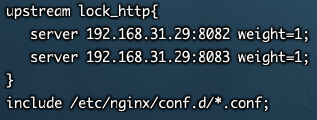


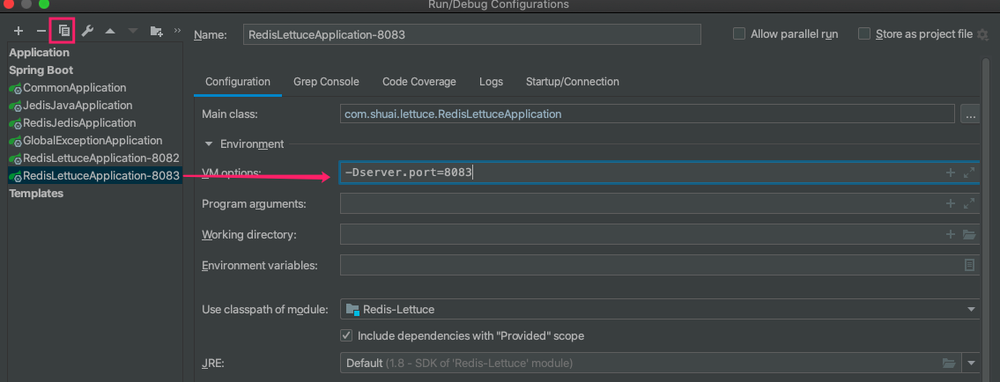


* 测试集群下高并发问题

	

	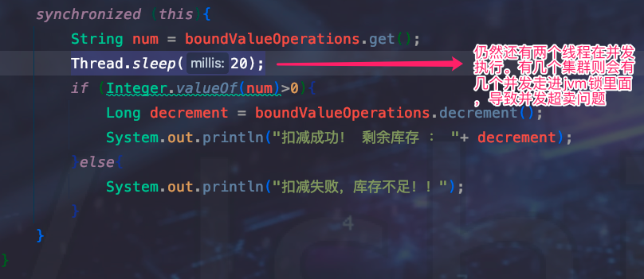 


#### 问题解决 -- 分布式锁

> 使用分布式锁，即setnx : 返回true 则获得锁，返回false则其他线程拥有锁

`流程`

1. 类似于网关，所有的请求所有的线程都去Redis中查看，Redis是单线程实现，不存在线程安全问题
2. 如果没有锁，则当前线程获得锁并执行操作，操作后释放锁。
3. 如果有锁则自旋不停去抢占锁

```java
// set stock 200
// del lock:key  
@GetMapping("/lock2")
public void testLock() throws InterruptedException {
  Boolean flag = true;

  while (flag){
    flag = !stringRedisTemplate.opsForValue().setIfAbsent(LOCK, "lock");
    // 抢到  flag = false   没抢到 true
    Thread.sleep(100);
  }

  BoundValueOperations<String, String> boundValueOperations = stringRedisTemplate.boundValueOps(STOCK);
  String num = boundValueOperations.get();
  Thread.sleep(20);
  if (Integer.valueOf(num)>0){
    Long decrement = boundValueOperations.decrement();
    System.out.println("扣减成功！ 剩余库存 ： "+ decrement);
  }else{
    System.out.println("扣减失败，库存不足！！");
  }
  stringRedisTemplate.delete(LOCK);

}
```


#### 问题引出 -- 死锁

> 如果在上锁 后 又没到释放锁 电脑宕机，或者程序崩溃，导致锁没释放，死锁（即 Redis中 lock:key 一直存在。如何处理？）


#### 问题**极大**的解决 -- try final

> <font color=ff00aa>添加try final后代码应对中小业务足够了，但是在成千上万的高并发下，还是会存在隐患的。</font>
>
> **并不能完全解决**，虽然会极大的避免了锁未释放情况，但是还是存在 在执行final的时候 服务器宕机导致final没有执行，锁未释放。

```java
@GetMapping("/lock2")
public void testLock() throws InterruptedException {
  Boolean flag = true;

  while (flag){
    flag = !stringRedisTemplate.opsForValue().setIfAbsent(LOCK, "lock");
    // 抢到  flag = false   没抢到 true
    Thread.sleep(100);
  }

  try {
    BoundValueOperations<String, String> boundValueOperations = stringRedisTemplate.boundValueOps(STOCK);
    String num = boundValueOperations.get();
    Thread.sleep(20);
    if (Integer.valueOf(num)>0){
      Long decrement = boundValueOperations.decrement();
      System.out.println("扣减成功！ 剩余库存 ： "+ decrement);
    }else{
      System.out.println("扣减失败，库存不足！！");
    }
  }finally {
    stringRedisTemplate.delete(LOCK);
  }

}
```


#### 问题解决 -- 上锁并设置ttl

```java
@GetMapping("/lock2")
public void testLock() throws InterruptedException {
  Boolean flag = true;

  while (flag){
    /*上锁10后自动释放锁*/
    flag = !stringRedisTemplate.opsForValue().setIfAbsent(LOCK, "lock",10, TimeUnit.SECONDS);
    // 抢到  flag = false   没抢到 true
    Thread.sleep(100);
  }

  try {
    BoundValueOperations<String, String> boundValueOperations = stringRedisTemplate.boundValueOps(STOCK);
    String num = boundValueOperations.get();
    Thread.sleep(20);
    if (Integer.valueOf(num)>0){
      Long decrement = boundValueOperations.decrement();
      System.out.println("扣减成功！ 剩余库存 ： "+ decrement);
    }else{
      System.out.println("扣减失败，库存不足！！");
    }
  }finally {
    stringRedisTemplate.delete(LOCK);
  }

}
```


#### 问题引出 -- 业务代码超时

> 设置10s后过期，假如业务代码卡顿用时15s，到10s后A线程释放锁，但是业务代码还在跑，B线程抢到锁并执行业务代码
>
> 1. 会有安全问题，多线程下会出现超卖现象
> 2. B线程在10s后抢到锁，执行代码，但是到了15s后A线程释放锁。此时的锁是B线程的锁，即释放了其他人的锁。

```java
@GetMapping("/lock2")
public void testLock() throws InterruptedException {
  Boolean flag = true;

  while (flag){
    /*上锁10后自动释放锁*/
    flag = !stringRedisTemplate.opsForValue().setIfAbsent(LOCK, "lock",10, TimeUnit.SECONDS);
    // 抢到  flag = false   没抢到 true
    Thread.sleep(100);
  }
  /*手动设置代码超时*/
  Thread.sleep(15000);
  try {
    BoundValueOperations<String, String> boundValueOperations = stringRedisTemplate.boundValueOps(STOCK);
    String num = boundValueOperations.get();
    Thread.sleep(20);
    if (Integer.valueOf(num)>0){
      Long decrement = boundValueOperations.decrement();
      System.out.println("扣减成功！ 剩余库存 ： "+ decrement);
    }else{
      System.out.println("扣减失败，库存不足！！");
    }
  }finally {
    stringRedisTemplate.delete(LOCK);
  }

}
```


#### 问题解决 -- 使用uuid表示锁

```java
if (boundValueOperations.get().equals(uuid)){
  stringRedisTemplate.delete(LOCK);
}
```


#### 问题引出 -- 释放锁时卡顿

```java
if (boundValueOperations.get().equals(uuid)){
  // 这里卡顿
  Thread.sleep(6000);
  stringRedisTemplate.delete(LOCK);
}
```

> 判断是自己的锁 ，并准备释放时，但是由于服务器卡顿或者其他原因导致这里并没有即使释放锁，并且过了15超时时间。其他线程上锁成功，这是时候删除锁是其他人的锁


#### 问题解决 --  事务

```java
//销量
private final String SALES_NUMBER = "sales";
//库存
private final String STOCK = "stock";
// 锁
private final String LOCK = "lock:key";

@Autowired
private StringRedisTemplate stringRedisTemplate;
@GetMapping("/lock4")
public void testLock() throws InterruptedException {
  String uuid = UUID.randomUUID().toString();
  Boolean flag = true;

  while (flag){
    flag = !stringRedisTemplate.opsForValue().setIfAbsent(LOCK,uuid,);
    // 抢到  flag = false   没抢到 true
    Thread.sleep(10);
  }

  try {
    SessionCallback<List> sessionCallback = new SessionCallback<List>() {
      @SneakyThrows
      @Override
      public List execute(RedisOperations operations) throws DataAccessException {
        //监控
        operations.watch(STOCK);
        //在事务前get  防止队列中get为null
        Object o = operations.opsForValue().get(STOCK);
        int num = Integer.parseInt(o.toString());

        operations.multi();
        Thread.sleep(200);
        if (num > 0) {
          operations.opsForValue().decrement(STOCK);
          operations.opsForValue().increment(SALES_NUMBER);
        } else {
          System.out.println("扣减失败，库存不足！！");
        }
        return operations.exec();
      }
    };
    stringRedisTemplate.execute(sessionCallback);

    String decrement = stringRedisTemplate.opsForValue().get(STOCK);
    String increment = stringRedisTemplate.opsForValue().get(SALES_NUMBER);
    System.out.println("扣减成功！ 剩余库存 ： " + decrement + "   销量 ：" + increment);
  }finally {
    stringRedisTemplate.delete(LOCK);
  }
```

> STOCK : 设置200。

* 1s 200个请求  --  **没问题**

	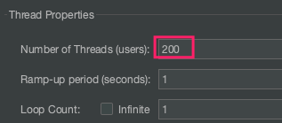

	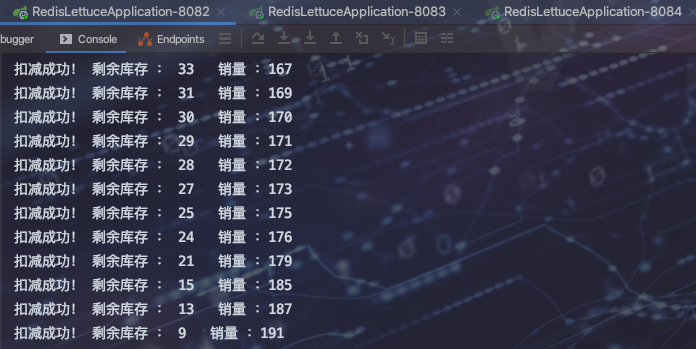

	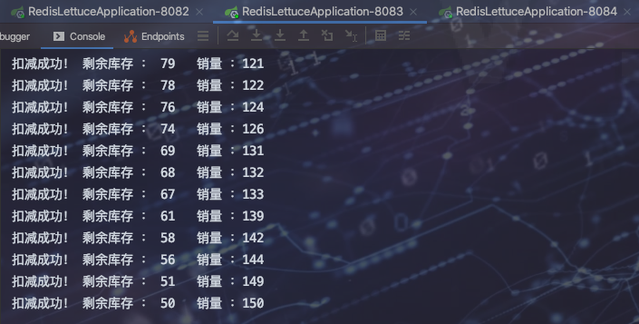

	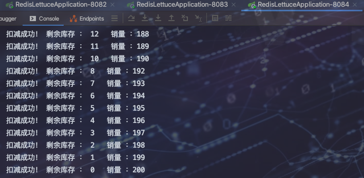

* 1s2000个请求   -- **没问题**

	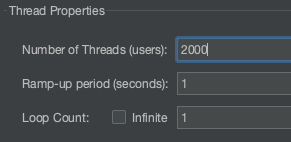

	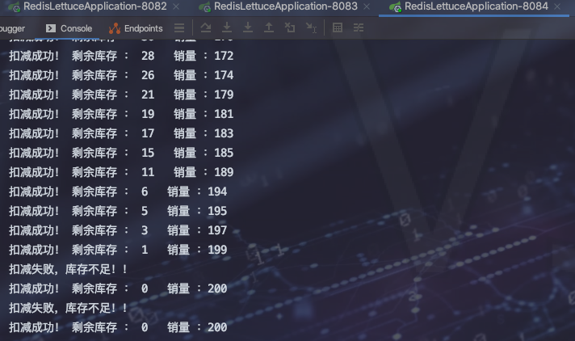

	

	

* 1s 100 个请求 -- **有问题**

	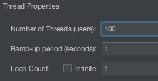

	

	> 100个请求并没有消费全。因为**事务冲突**问题，三个集群中发生事务冲突，而事务冲突发生后，之后的事务就没有意义了，导致后面的事务并没有执行。
	>
	> pork一个线程监听是否拥有锁以及锁是否过期，定期续命，看门狗和自动续命技术落地有redisson框架

	

#### 究极解决方案 -- redisson

```bash
<dependency>
  <groupId>org.redisson</groupId>
  <artifactId>redisson</artifactId>
  <version>3.10.5</version>
</dependency>
```

```java
@Configuration
public class RedisConfig {

    @Bean
    public RedisTemplate redisTemplateInit(RedisConnectionFactory redisConnectionFactory) {

        RedisTemplate<String, Object> template = new RedisTemplate();
        // 配置连接工厂
        template.setConnectionFactory(redisConnectionFactory);

        // 序列化配置
        Jackson2JsonRedisSerializer<Object> jackson2JsonRedisSerializer = new Jackson2JsonRedisSerializer(Object.class);
        ObjectMapper om = new ObjectMapper();
        om.setVisibility(PropertyAccessor.ALL, JsonAutoDetect.Visibility.ANY);
        om.enableDefaultTyping(ObjectMapper.DefaultTyping.NON_FINAL);
        jackson2JsonRedisSerializer.setObjectMapper(om);

        // String 的序列化
        StringRedisSerializer stringRedisSerializer = new StringRedisSerializer();
        // key 采用 String 的序列化方式
        template.setKeySerializer(stringRedisSerializer);
        // hash 的 key 也采用 String 的序列化方式
        template.setHashKeySerializer(stringRedisSerializer);
        // value 序列化方式采用 Jackson
        template.setValueSerializer(jackson2JsonRedisSerializer);
        // hash 的 value 序列化方式采用 Jackson
        template.setHashKeySerializer(jackson2JsonRedisSerializer);
        template.afterPropertiesSet();
        return template;
    }


    @Bean
    public RedissonClient redisson(){
        //单机模式
        Config config = new Config();
        config.useSingleServer().setAddress("redis://192.168.31.5:6379").setDatabase(0);
        return Redisson.create(config);
    }
}
```

```java
//销量
private final String SALES_NUMBER = "sales";
//库存
private final String STOCK = "stock";
// 锁
private final String LOCK = "lock:key";

@Autowired
private StringRedisTemplate stringRedisTemplate;

@Autowired
private RedissonClient redisson;

@GetMapping("/lock5")
public void testLock() {

  RLock redissonLock = redisson.getLock(LOCK);
  try {
    redissonLock.lock(10, TimeUnit.SECONDS);
    Integer num = Integer.valueOf(stringRedisTemplate.opsForValue().get(STOCK));
    if (num > 0){
      Long decrement =  stringRedisTemplate.opsForValue().decrement(STOCK);
      Long increment = stringRedisTemplate.opsForValue().increment(SALES_NUMBER);
      System.out.println("扣减成功！ 剩余库存 ： " + decrement + "   销量 ：" + increment);
    }else{
      System.out.println("扣减失败，库存不足！！");
    }
  }finally {
    redissonLock.unlock();
  }

}
```

> * 请求数 1000 、200 、 100 都没有问题
>
> * 业务代码手动设置15s超时则上锁时不得设置过期时间,可通过如下代码解决
>
> 	```java
> 	redissonLock.lock();
> 	Thread.sleep(15000);
> 	```

 

