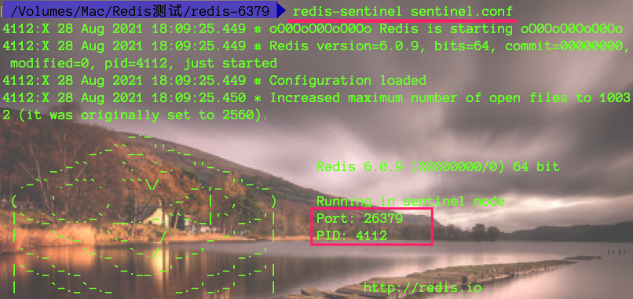
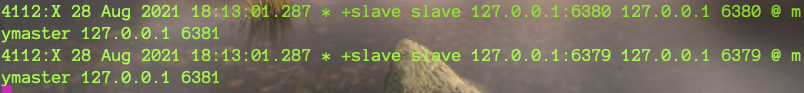
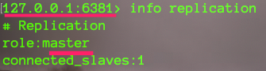
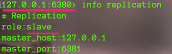

### 是什么

哨兵是一个分布是系统，用于对主从结构中的每台服务器进行监控，当出现故障时通过投票机制选择新的master并将所有slave连接到新的master

  

* 主机宕机

	从机原地待命，从主机宕机后，数据不能加入到Redis，但是并不影响从机的数据读取，如果没有哨兵机制，则使用如下命令

	```bash
	# 从机断开主从关系  假如主机：A 从机B/C  ，主机A宕机
	slaveof no one #从机B/C执行
	info replication
	# 重新设置主从关系
	# 手动设置B为主机，C为从机
	slaveof B主机地址  B端口  #在C从机上执行
	
	# 如果此时主机恢复后，那么A主机就变成孤家寡人了，也可以将主机A修改为B的从机
	```

	

* 从机宕机

	主机少一个从机，其他从机不变，**当从机修复好后重启后变为master，因此需要从新设置从属关系,并且设置从属关系后全量复制**

### 作用

1、 监控

    不断地检查master和slave是否正常运行
    master存活检测、master与slave运行情况监测

2、 通知

    当被监控的服务期出现问题时，向其他哨兵、客户端发送通知

3、 自动故障转移

    断开master与slave连接，选取一个slave作为master，将其他slave连接到新的master，并告知客户短信的master服务器地址


tips

    1. 哨兵也是一台Redis服务器，只是不提供数据服务
    2. 通常哨兵配置数量为单数


### 哨兵模式搭建

1. 创建redis_sentiel.conf文件，编辑里面内容

	> 最好使用独立服务器，保证高可用

	```bash
	sentinel monitor dc-redis127.0.0.1 6379 1
	# 表示监控主机的IP地址和端口，以及投票数【当主机宕机后，那个从机最先得到n（这里指定为1）票则成为主机】
	```

2. 启动哨兵服务

	```bash
	redis-sentinel redis_sentiel.conf
	```

	

3. 手动关闭主机测试哨兵机制

	

	或者

	```bash
	redis-cli -h 127.0.0.1 -p 6379 shutdown
	```

4. 哨兵服务器投票选举

	

	> 6381设为主，6380设为从

	

	
