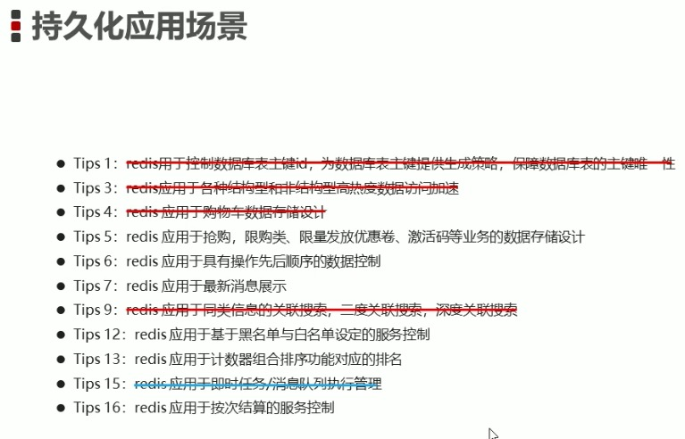

[toc]
### 什么是持久化

利用永久性存储介质将数据进行保存，在特定的时间将保存的数据进行恢复的工作机制成为持久化。

### 为什么进行持久化

防止数据的意外丢失，确保数据安全性

###方式

1、 数据快照(二进制数据)  RDB

Mac下data目录/usr/local/var/db/redis/dump.rdb

保存快照信息

    1、save (因为Redis是单线程任务执行，使用save时会造成Redis中数据依次保存，拉低性能，因此线上慎用)

    2、bgsave(相较于save命令此命令并不会立即执行保存操作(内部使用fork函数创建子线程去操作)，而是后台不抢占Redis资源式的进行保存信息)

    3、save second(监控时间范围) changes(监控key的变化量)   > >单位时间内key变化一定的量即使用bgsave进行保存
>>eg ：save 60 5 在60s内key数量有5个发生变化则进行保存

>>变化量：1.会对数据产生影响(get就不会)。2.真正产生了影响。3.不进行数据比对(同一个set了两次不算)

数据恢复  

    启动时默认恢复

<table>
    <th>
        <tr>
            <td>方式</td>
            <td>save指令</td>
            <td>bgsave指令</td>
            <td>save配置(内部使用bgsave)</td>
        </tr>
    </th>
    <tbody>
        <tr>
            <td>读写</td>
            <td>同步</td>
            <td>异步</td>
            <td>异步</td>
        </tr>
        <tr>
            <td>阻塞客户端指令</td>
            <td>是</td>
            <td>否</td>
            <td>否</td>
        </tr>
        <tr>
            <td>额外内存消耗</td>
            <td>否</td>
            <td>是</td>
            <td>是</td>
        </tr>
        <tr>
            <td>启动新进程</td>
            <td>否</td>
            <td>是</td>
            <td>是</td>
        </tr>
    </tbody>
</table>    

2、 操作过程(日志) AOF

    主流持久化方式，当有改变数据命令下发时，将操作命令存放到`AOF写命令刷新缓存区`最后放入到.aof文件中。

1. 三种策略
    1. always :每次写入操作均同步到aof文件中。性能低，零误差
    2. everysec :每秒将缓冲区中的指令同步到aof文件中，数据准确性高，性能高，建议使用
    3. no：由操作系统控制aof文件周期，整体过程不可控

2. AOF开启
    在配置文件中修改 appendonly yes（默认不开启）
3. AOF策略配置
    配置文件中修改 appendfsync always|everysec|no

4. AOF重写
    随着命令不断写入aof文件，该文件势必变得很大，因此Redis引入了AOF重写机制压缩文件体积。即将对同一个数据的若干个命令执行结果转化为最终结果数据对应的指令进行记录。

5. AOF重写规则
    1. 超时数据不再写入
    2. 忽略无效指令
    3. 多条命令合并成最终效果命令

6. 重写方式
    1. 手动重写  bgrewriteaof
    2. 自动重写
        * auto-aof-rewrite-min-size size
        * auto-aof-rewrite-percentage percentage

### 两种方式比对

RDB 二进制、存储效率高、但无法做到实时持久化、较大可能丢失数据、fork子进程丢失性能、版本可能不兼容。适用于数据备份、灾难恢复等场景

