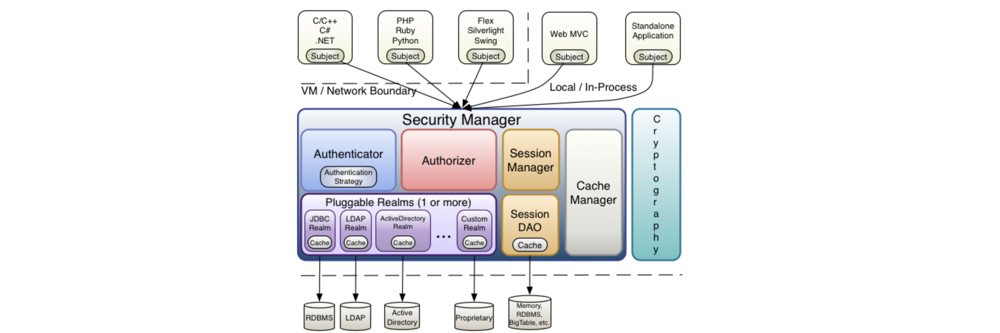

# 权限的管理

## 什么是权限管理

`基本上涉及到用户参与的系统都要进行权限管理`，权限管理属于系统安全的范畴，权限管理实现`对用户访问系统的控制`，按照安全规则或者[安全策略](http://baike.baidu.com/view/160028.htm)控制用户可以访问而且只能访问自己被授权的资源。

权限管理包括用户`身份认证`和`授权`两部分，简称`认证授权`。对于需要访问控制的资源用户首先经过身份认证，认证通过后用户具有该资源的访问权限方可访问。

## 什么是身份认证

`身份认证`，就是判断一个用户是否为合法用户的处理过程。最常用的简单身份认证方式是系统通过核对用户输入的用户名和口令，看其是否与系统中存储的该用户的用户名和口令一致，来判断用户身份是否正确。对于采用[指纹](http://baike.baidu.com/view/5628.htm)等系统，则出示指纹；对于硬件Key等刷卡系统，则需要刷卡。

## 什么是授权

`授权，即访问控制`，控制谁能访问哪些资源。主体进行身份认证后需要分配权限方可访问系统的资源，对于某些资源没有权限是无法访问的

----

# 什么是shiro

> **Apache Shiro™** is a powerful and easy-to-use Java security framework that performs authentication, authorization, cryptography, and session management. With Shiro’s easy-to-understand API, you can quickly and easily secure any application – from the smallest mobile applications to the largest web and enterprise applications.  
>
> Shiro 是一个功能强大且易于使用的Java安全框架，它执行身份验证、授权、加密和会话管理。使用Shiro易于理解的API，您可以快速轻松地保护任何应用程序—从最小的移动应用程序到最大的web和企业应用程序。

`Shiro是apache旗下一个开源框架，它将软件系统的安全认证相关的功能抽取出来，实现用户身份认证，权限授权、加密、会话管理等功能，组成了一个通用的安全认证框架。`

----

# shiro的核心架构

## Subject

`Subject即主体`，外部应用与subject进行交互，subject记录了当前操作用户，将用户的概念理解为当前操作的主体，可能是一个通过浏览器请求的用户，也可能是一个运行的程序。	Subject在shiro中是一个接口，接口中定义了很多认证授相关的方法，外部程序通过subject进行认证授，而subject是通过SecurityManager安全管理器进行认证授权

##  SecurityManager

`SecurityManager即安全管理器`，对全部的subject进行安全管理，它是shiro的核心，负责对所有的subject进行安全管理。通过SecurityManager可以完成subject的`认证`、`授权`等，实质上`SecurityManager`是通过`Authenticator`进行认证，通过`Authorizer`进行授权，通过`SessionManager`进行会话管理等。

`SecurityManager是一个接口，继承了Authenticator, Authorizer, SessionManager这三个接口。`

## Authenticator

`Authenticator即认证器`，对用户身份进行认证，Authenticator是一个接口，shiro提供ModularRealmAuthenticator实现类，通过ModularRealmAuthenticator基本上可以满足大多数需求，也可以自定义认证器。

## Authorizer

`Authorizer即授权器`，用户通过认证器认证通过，在访问功能时需要通过授权器判断用户是否有此功能的操作权限。

##   Realm

`Realm即领域`，相当于datasource数据源，securityManager进行安全认证需要通过Realm获取用户权限数据，比如：如果用户身份数据在数据库那么realm就需要从数据库获取用户身份信息。

- ​	注意：不要把realm理解成只是从数据源取数据，在realm中还有认证授权校验的相关的代码。

## SessionManager

`sessionManager即会话管理`，shiro框架定义了一套会话管理，它不依赖web容器的session，==所以shiro可以使用在非web应用上，也可以将分布式应用的会话集中在一点管理，此特性可使它实现单点登录==。

##  SessionDAO

`SessionDAO即会话dao`，是对session会话操作的一套接口，比如要将session存储到数据库，可以通过jdbc将会话存储到数据库。

##  CacheManager

`CacheManager即缓存管理`，将用户权限数据存储在缓存，这样可以提高性能。只是在第一次启动时将权限数据从数据库中全部读取到，然后存储在Cache中。

##  Cryptography

​	`Cryptography即密码管理`，shiro提供了一套加密/解密的组件，方便开发。比如提供常用的散列、加/解密等功能。