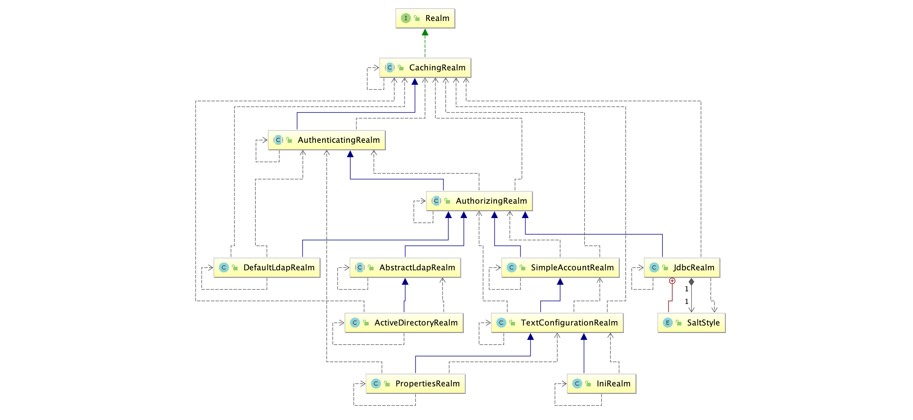

# shiro中的认证

##  认证

身份认证，就是判断一个用户是否为合法用户的处理过程。最常用的简单身份认证方式是系统通过核对用户输入的用户名和口令，看其是否与系统中存储的该用户的用户名和口令一致，来判断用户身份是否正确。

##  shiro中认证的关键对象

- **Subject：主体**

访问系统的用户，主体可以是用户、程序等，进行认证的都称为主体； 

- **Principal：身份信息**

是主体（subject）进行身份认证的标识，标识必须具有`唯一性`，如用户名、手机号、邮箱地址等，一个主体可以有多个身份，但是必须有一个主身份（Primary Principal）。

- **credential：凭证信息**

是只有主体自己知道的安全信息，如密码、证书等。

## 认证流程


## 认证的开发

##### 1. 创建项目并引入依赖

```xml
<dependency>
  <groupId>org.apache.shiro</groupId>
  <artifactId>shiro-core</artifactId>
  <version>1.5.3</version>
</dependency>
```

##### 2. 引入shiro配置文件并加入如下配置

```ini
[users]
admin=123
root=123
zhangshan=123456
```


> ini配置文件作用：用来书写我们系统中相关权限数据。这样做的目的是为了降低学习Shiro时还要配置数据库的时间成本。先可以直接写死到配置文件中。web项目中再从数据库中读取权限数据。

##### 3.开发认证代码

```java
/**
 * TODO:<p> 认证 <p/>
 *
 * @package: org.shuai
 * @Author mac
 * @Date 2020/11/21 11:34 下午
 * @Version V1.0
 **/
public class TestAuthenticator {
    public static void main(String[] args) {
        // 1. 创建安全管理对象
//        SecurityManager securityManager=new DefaultSecurityManager();
        DefaultSecurityManager defaultSecurityManager=new DefaultSecurityManager();
        // 2. 给安全管理器设置realm
        defaultSecurityManager.setRealm(new IniRealm("classpath:shiro.ini"));
        // 3. SecurityUtils 给全局安全工具类设置安全管理器
        SecurityUtils.setSecurityManager(defaultSecurityManager);
        // 4. 获取对象主体 subject
        Subject subject = SecurityUtils.getSubject();

        // 5. 获取身份信息（用户名）、凭证信息（密码）来封装成Token令牌
            // ini 配置文件中有 admin 123 账号信息，则认证通过，没有则不通过
        UsernamePasswordToken token=new UsernamePasswordToken("admin","123");

        try {
            // 6. 获取认证状态
            System.out.println("认证状态 ："+subject.isAuthenticated());
            subject.login(token);
            System.out.println("认证状态 ："+subject.isAuthenticated());
        } catch (UnknownAccountException e) {
            e.printStackTrace();
            System.out.println("用户名错误!!");
        }catch (IncorrectCredentialsException e){
            e.printStackTrace();
            System.out.println("密码错误!!!");
        }catch (Exception e){
            e.printStackTrace();
        }

    }
}
```

- DisabledAccountException（帐号被禁用）

- LockedAccountException（帐号被锁定）

- ExcessiveAttemptsException（登录失败次数过多）

- ExpiredCredentialsException（凭证过期）等

-----

##  自定义Realm

上边的程序使用的是Shiro自带的IniRealm，IniRealm从ini配置文件中读取用户的信息，大部分情况下需要从系统的数据库中读取用户信息，所以需要自定义realm。

##### 1.shiro提供的Realm



##### 2.根据认证源码认证使用的是SimpleAccountRealm


`SimpleAccountRealm的部分源码中有两个方法一个是 认证 一个是 授权`,

```java
public class SimpleAccountRealm extends AuthorizingRealm {
		//.......省略
    protected AuthenticationInfo doGetAuthenticationInfo(AuthenticationToken token) throws AuthenticationException {
        UsernamePasswordToken upToken = (UsernamePasswordToken) token;
        SimpleAccount account = getUser(upToken.getUsername());

        if (account != null) {

            if (account.isLocked()) {
                throw new LockedAccountException("Account [" + account + "] is locked.");
            }
            if (account.isCredentialsExpired()) {
                String msg = "The credentials for account [" + account + "] are expired";
                throw new ExpiredCredentialsException(msg);
            }

        }

        return account;
    }

    protected AuthorizationInfo doGetAuthorizationInfo(PrincipalCollection principals) {
        String username = getUsername(principals);
        USERS_LOCK.readLock().lock();
        try {
            return this.users.get(username);
        } finally {
            USERS_LOCK.readLock().unlock();
        }
    }
}
```

##### 3.自定义realm

```java
/**
 * 自定义realm
 */
public class CustomerRealm extends AuthorizingRealm {
    //授权方法
    @Override
    protected AuthorizationInfo doGetAuthorizationInfo(PrincipalCollection principals) {
        return null;
    }

    //认证方法
    @Override
    protected AuthenticationInfo doGetAuthenticationInfo(AuthenticationToken token) throws AuthenticationException {
        String principal = (String) token.getPrincipal();
        if("xiaochen".equals(principal)){
            return new SimpleAuthenticationInfo(principal,"123",this.getName());
        }
        return null;
    }
}
```

##### 4.使用自定义Realm认证

```java
public class TestAuthenticatorCusttomerRealm {
    public static void main(String[] args) {
        //创建securityManager
        DefaultSecurityManager defaultSecurityManager = new DefaultSecurityManager();
        //IniRealm realm = new IniRealm("classpath:shiro.ini");
        //设置为自定义realm获取认证数据
        defaultSecurityManager.setRealm(new CustomerRealm());
        //将安装工具类中设置默认安全管理器
        SecurityUtils.setSecurityManager(defaultSecurityManager);
        //获取主体对象
        Subject subject = SecurityUtils.getSubject();
        //创建token令牌
        UsernamePasswordToken token = new UsernamePasswordToken("xiaochen", "123");
        try {
            subject.login(token);//用户登录
            System.out.println("登录成功~~");
        } catch (UnknownAccountException e) {
            e.printStackTrace();
            System.out.println("用户名错误!!");
        }catch (IncorrectCredentialsException e){
            e.printStackTrace();
            System.out.println("密码错误!!!");
        }

    }
}
```

##  使用MD5和Salt

MD5主要功能

* 加密

	无论什么文件都会生成一个16进制32位字符串

* 签名

	无论什么文件只要内容相同则md5生成的结果始终一致。`可用于比较两个文件是否一样`

缺点：由于`签名特性`一些穷举网站将常见的密码生成md5。如果你的密码是常见密码并且别拿到了你密码的md5。那你就完了。

弥补：使用盐。即将用户输入的密码生成md5+一个随机生成的字符串生成md5，然后拼接在一起存储到数据库

又问：那密码比较的时候随机数我门又获取不到如何比对。

回答：存储密码的时候并将随机数存储到数据库。这样也不能做到百分之百安全，如果数据库被攻破，密码和随机数的md5都被获取到，则不够安全了。但是我们可以利用业务将密码和随机字符串拼接的方式（例如将随机字符串拼接在密码中间形成最后的密匙）。并且如果你的密码并不是常见的密码，穷举网站也没有任何办法。

> 实际应用是将盐和散列后的值存在数据库中，自动realm从数据库取出盐和加密后的值由shiro完成密码校验。

##### 1.自定义md5+salt的realm

```java
/**
 * 自定义md5+salt realm
 */
public class CustomerRealm extends AuthorizingRealm {
    //授权方法
    @Override
    protected AuthorizationInfo doGetAuthorizationInfo(PrincipalCollection principals) {
        return null;
    }

    //认证方法
    @Override
    protected AuthenticationInfo doGetAuthenticationInfo(AuthenticationToken token) throws AuthenticationException {
        String principal = (String) token.getPrincipal();
      //根据用户名查询数据库
        if("xiaochen".equals(principal)){
            String password = "3c88b338102c1a343bcb88cd3878758e";//123的md5
            String salt = "Q4F%";//随机salt
            return new SimpleAuthenticationInfo(principal,password, 
                                                ByteSource.Util.bytes(salt),this.getName());//这里存放salt后比较不需要设置，shiro或自动获取到salt进行比较
        }
        return null;
    }
```

##### 2.使用md5 + salt 认证

```java
public class TestAuthenticatorCusttomerRealm {
    public static void main(String[] args) {
        //创建securityManager
        DefaultSecurityManager defaultSecurityManager = new DefaultSecurityManager();
        //IniRealm realm = new IniRealm("classpath:shiro.ini");
        //设置为自定义realm获取认证数据
        CustomerRealm customerRealm = new CustomerRealm();
        //设置md5加密 改写默认equals (将用户数据密码与密文比较，这肯定永远比对失败啊)因此将默认CredentialsMatcher(凭证匹配器)修改为HashedCredentialsMatcher
        HashedCredentialsMatcher credentialsMatcher = new HashedCredentialsMatcher();
        credentialsMatcher.setHashAlgorithmName("MD5");
        credentialsMatcher.setHashIterations(1024);//设置散列次数
        customerRealm.setCredentialsMatcher(credentialsMatcher);
        defaultSecurityManager.setRealm(customerRealm);
        //将安装工具类中设置默认安全管理器
        SecurityUtils.setSecurityManager(defaultSecurityManager);
        //获取主体对象
        Subject subject = SecurityUtils.getSubject();
        //创建token令牌
        UsernamePasswordToken token = new UsernamePasswordToken("xiaochen", "123");//这里没有salt
        try {
            subject.login(token);//用户登录
            System.out.println("登录成功~~");
        } catch (UnknownAccountException e) {
            e.printStackTrace();
            System.out.println("用户名错误!!");
        }catch (IncorrectCredentialsException e){
            e.printStackTrace();
            System.out.println("密码错误!!!");
        }

    }
}
```

