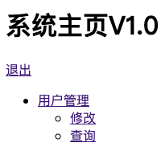
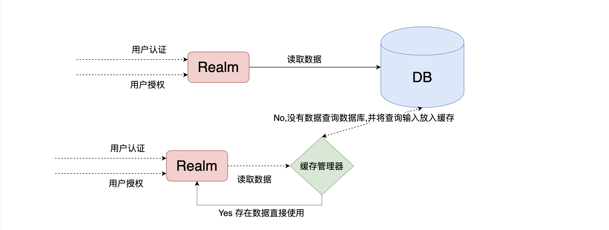

## 整合SpringBoot项目实战

###  整合思路


### 创建springboot项目


* 

* 创建webapp目录并新建jsp


* index.jsp

	```jsp
	<%@page contentType="text/html; UTF-8" pageEncoding="UTF-8" isELIgnored="false" %>
	<!DOCTYPE html>
	<html lang="en">
	<head>
	    <meta charset="UTF-8">
	    <title>Title</title>
	</head>
	<body>
	    <h1>系统主页V1.0</h1>
	
	    <ul>
	        <li><a href="">用户管理</a></li>
	        <li><a href="">角色管理</a></li>
	        <li><a href="">邮箱管理</a></li>
	        <li><a href="">等级管理</a></li>
	    </ul>
	</body>
	</html>
	```

* Login.jsp

	```jsp
	<%@page contentType="text/html; UTF-8" pageEncoding="UTF-8" isELIgnored="false" %>
	<!DOCTYPE html>
	<html lang="en">
	<head>
	    <meta charset="UTF-8">
	    <title>Title</title>
	</head>
	<body>
	    <h1>用户登录</h1>
	</body>
	</html>
	```

* Application.properties

	```properties
	# 应用名称
	spring.application.name=shiro
	# 应用服务 WEB 访问端口
	server.port=8080
	server.servlet.context-path=/shiro
	
	spring.mvc.view.prefix=/
	spring.mvc.view.suffix=.jsp
	```

* 引入jsp相关依赖

	```xml
	<!-- 引入jsp解析依赖 -->
	<dependency>
	    <groupId>org.apache.tomcat.embed</groupId>
	    <artifactId>tomcat-embed-jasper</artifactId>
	</dependency>
	<dependency>
	    <groupId>jstl</groupId>
	    <artifactId>jstl</artifactId>
	    <version>1.2</version>
	</dependency>
	```

* 效果图

	

> 项目基础环境已搭建。下面进行shiro整合

### 引入shiro依赖

```xml
<dependency>
  <groupId>org.apache.shiro</groupId>
  <artifactId>shiro-spring-boot-starter</artifactId>
  <version>1.5.3</version>
</dependency>
```

### 配置shiro环境

1. 创建配置类

	

2. 配置shiroFilterFactoryBean

	```java
	@Bean
	public ShiroFilterFactoryBean getShiroFilterFactoryBean(SecurityManager securityManager){
	  //创建shiro的filter 负责拦截所有的请求
	  ShiroFilterFactoryBean shiroFilterFactoryBean = new ShiroFilterFactoryBean();
	  //注入安全管理器
	  shiroFilterFactoryBean.setSecurityManager(securityManager);
	 	
	  return shiroFilterFactoryBean;
	}
	```

3. 配置WebSecurityManager

	```java
	@Bean
	public DefaultWebSecurityManager getSecurityManager(Realm realm){
	  DefaultWebSecurityManager defaultWebSecurityManager = new DefaultWebSecurityManager();
	  defaultWebSecurityManager.setRealm(realm);
	  return defaultWebSecurityManager;
	}
	```

	

4. 创建自定义realm

	```java
	public class CustomerRealm extends AuthorizingRealm {
	    //处理授权
	    @Override
	    protected AuthorizationInfo doGetAuthorizationInfo(PrincipalCollection principals) {
	        return null;
	    }
			//处理认证
	    @Override
	    protected AuthenticationInfo doGetAuthenticationInfo(AuthenticationToken token) throws 
	      																																		AuthenticationException {
	        return null;
	    }
	}
	```

	

5. 配置自定义realm

	```java
	//创建自定义realm
	@Bean
	public Realm getRealm(){
	  return new CustomerRealm();
	}
	```

	

6. 编写控制器跳转至index.html

	```java
	@Controller
	public class IndexController {
	    @RequestMapping("index")
	    public String index(){
	        System.out.println("跳转至主页");
	        return "index";
	    }
	}
	```

	

	

	

7. 启动springboot应用访问index

	

	> 认在配置好shiro环境后默认环境中没有对项目中任何资源进行权限控制,所有现在项目中所有资源都可以通过路径访问**

8. 加入权限控制

	* 修改ShiroFilterFactoryBean配置

		```java
		//注入安全管理器
		shiroFilterFactoryBean.setSecurityManager(securityManager);
		Map<String,String> map =  new LinkedHashMap<>();
		map.put("/**","authc");
		//配置认证和授权规则
		shiroFilterFactoryBean.setFilterChainDefinitionMap(map);
		```

		

		> **/\**** 代表拦截项目中一切资源  **authc** 代表shiro中的一个filter的别名,详细内容看文档的shirofilter列表

	* 配置系统受限资源

		```java
		public ShiroFilterFactoryBean getShiroFilterFactoryBean(DefaultWebSecurityManager defaultWebSecurityManager){
		    //创建shiro的filter
		    ShiroFilterFactoryBean shiroFilterFactoryBean = new ShiroFilterFactoryBean();
		    //注入安全管理器
		    shiroFilterFactoryBean.setSecurityManager(defaultWebSecurityManager);
		    //配置系统受限资源
		    //配置系统公共资源
		    Map<String,String> map=new HashMap<>();
				map.put("/index.jsp", "authc");//authc 请求这个资源需要认证和授权
		    map.put("/", "authc");//authc 请求这个资源需要认证和授权
		
		    //默认认证界面路径
		    shiroFilterFactoryBean.setLoginUrl("/login.jsp");
		
		    shiroFilterFactoryBean.setFilterChainDefinitionMap(map);
		    return shiroFilterFactoryBean;
		}
		```

		

9. 重启项目访问查看

	

### 常见过滤器

- 注意: **shiro提供和多个默认的过滤器，我们可以用这些过滤器来配置控制指定url的权限：**

| 配置缩写          | 对应的过滤器                   | 功能                                                         |
| ----------------- | ------------------------------ | ------------------------------------------------------------ |
| anon              | AnonymousFilter                | 指定url可以匿名访问，不需要做认证和授权，相当于公共资源      |
| authc             | FormAuthenticationFilter       | 指定url需要form表单登录，默认会从请求中获取`username`、`password`,`rememberMe`等参数并尝试登录，如果登录不了就会跳转到loginUrl配置的路径。我们也可以用这个过滤器做默认的登录逻辑，但是一般都是我们自己在控制器写登录逻辑的，自己写的话出错返回的信息都可以定制嘛。 |
| authcBasic        | BasicHttpAuthenticationFilter  | 指定url需要basic登录                                         |
| logout            | LogoutFilter                   | 登出过滤器，配置指定url就可以实现退出功能，非常方便          |
| noSessionCreation | NoSessionCreationFilter        | 禁止创建会话                                                 |
| perms             | PermissionsAuthorizationFilter | 需要指定权限才能访问                                         |
| port              | PortFilter                     | 需要指定端口才能访问                                         |
| rest              | HttpMethodPermissionFilter     | 将http请求方法转化成相应的动词来构造一个权限字符串，这个感觉意义不大，有兴趣自己看源码的注释 |
| roles             | RolesAuthorizationFilter       | 需要指定角色才能访问                                         |
| ssl               | SslFilter                      | 需要https请求才能访问                                        |
| user              | UserFilter                     | 需要已登录或“记住我”的用户才能访问                           |

### 认证实现

1. 在login.jsp中开发认证界面

	

	```html
	<form action="${pageContext.request.contextPath}/user/login" method="post">
	  用户名:<input type="text" name="username" > <br/>
	  密码  : <input type="text" name="password"> <br>
	  <input type="submit" value="登录">
	</form>
	```

	

2. 开发controller

	```java
	@Controller
	@RequestMapping("user")
	public class UserController {
	  /**
	    * 用来处理身份认证
	    * @param username
	    * @param password
	    * @return
	    */
	@RequestMapping("login")
	    public ModelAndView  login(String username, String password, HttpServletResponse response){
	        ModelAndView modelAndView=new ModelAndView();
	        //获取主体对象
	        Subject subject = SecurityUtils.getSubject();
	        try {
	            subject.login(new UsernamePasswordToken(username,password));
	            modelAndView.setViewName("/index");
	            return modelAndView;
	//            response.sendRedirect("/index");
	//            return  "redirect:/index.jsp";
	        } catch (UnknownAccountException e) {
	            e.printStackTrace();
	            System.out.println("用户名错误!");
	        }catch (IncorrectCredentialsException e){
	            e.printStackTrace();
	            System.out.println("密码错误!");
	        }
	        modelAndView.setViewName("/login");
	        return modelAndView;
	    }
	```

	> 在认证过程中使用subject.login进行认证

3. 开发realm中返回静态数据(未连接数据库)

	```java
	@Override
	    protected AuthenticationInfo doGetAuthenticationInfo(AuthenticationToken token) throws AuthenticationException {
	        System.out.println("==========================");
	        String principal = (String) token.getPrincipal();
	        //从数据库中获取 省份信息 principal 如果存在则比对密码如果失败则 return null
	        if("admin".equals(principal)){//先用明文以及假数据验证
	            return new SimpleAuthenticationInfo(principal,"123",this.getName());
	        }
	        return null;
	    }
	}
	```

	

4. 启动项目以realm中定义静态数据进行认证

	

	

	

	> 认证功能没有md5和随机盐的认证就实现啦

### 退出认证

1. 开发页面退出连接

	

2. 开发controller

	```java
	@Controller
	@RequestMapping("user")
	public class UserController {
	  /**
	    * 退出登录
	    *
	    */
	  @RequestMapping("logout")
	  public String logout(){
	    Subject subject = SecurityUtils.getSubject();
	    subject.logout();//退出用户
	    return "redirect:/login.jsp";
	  }
	}
	```

	

3. 修改退出连接访问退出路径

	```html
	<h1>系统主页V1.0</h1>
	<a href="${pageContext.request.contextPath}/user/logout">退出</a>
	<ul>
	    <li><a href="">用户管理</a></li>
	    <li><a href="">角色管理</a></li>
	    <li><a href="">邮箱管理</a></li>
	    <li><a href="">等级管理</a></li>
	</ul>
	```

4. 退出之后访问受限资源立即返回认证界面

	

5. 拦截请求使用通配符

	```java
	//        map.put("/index.jsp", "authc");//authc 请求这个资源需要认证和授权
	//        map.put("/", "authc");//authc 请求这个资源需要认证和授权
	        map.put("/user/login","anon");
	        map.put("/**", "authc");
	```

	

### MD5、Salt的认证实现

#### 开发数据库注册

0. 开发注册界面

	```html
	<h1>用户注册</h1>
	<form action="${pageContext.request.contextPath}/user/register" method="post">
	  用户名:<input type="text" name="username" > <br/>
	  密码  : <input type="text" name="password"> <br>
	  <input type="submit" value="立即注册">
	</form>
	```

	

	

1. 创建数据表结构

	```sql
	SET NAMES utf8mb4;
	SET FOREIGN_KEY_CHECKS = 0;
	-- ----------------------------
	-- Table structure for t_user
	-- ----------------------------
	DROP TABLE IF EXISTS `t_user`;
	CREATE TABLE `t_user` (
	  `id` int(6) NOT NULL AUTO_INCREMENT,
	  `username` varchar(40) DEFAULT NULL,
	  `password` varchar(40) DEFAULT NULL,
	  `salt` varchar(255) DEFAULT NULL,
	  PRIMARY KEY (`id`)
	) ENGINE=InnoDB AUTO_INCREMENT=2 DEFAULT CHARSET=utf8;
	
	SET FOREIGN_KEY_CHECKS = 1;
	```

3. 项目引入依赖

	```xml
	<!--mybatis相关依赖-->
	<dependency>
	  <groupId>org.mybatis.spring.boot</groupId>
	  <artifactId>mybatis-spring-boot-starter</artifactId>
	  <version>2.1.2</version>
	</dependency>
	
	<!--mysql-->
	<dependency>
	  <groupId>mysql</groupId>
	  <artifactId>mysql-connector-java</artifactId>
	  <version>5.1.38</version>
	</dependency>
	
	
	<!--druid-->
	<dependency>
	  <groupId>com.alibaba</groupId>
	  <artifactId>druid</artifactId>
	  <version>1.1.19</version>
	</dependency>
	```

4. 配置application.properties配置文件

	```xml
	server.port=8888
	server.servlet.context-path=/shiro
	spring.application.name=shiro
	
	spring.mvc.view.prefix=/
	spring.mvc.view.suffix=.jsp
	#MyBatis配置
	spring.datasource.type=com.alibaba.druid.pool.DruidDataSource
	spring.datasource.driver-class-name=com.mysql.jdbc.Driver
	spring.datasource.url=jdbc:mysql://localhost:3306/shiro?characterEncoding=UTF-8
	spring.datasource.username=root
	spring.datasource.password=root
	
	
	mybatis.type-aliases-package=com.baizhi.springboot_jsp_shiro.entity
	mybatis.mapper-locations=classpath:com/baizhi/mapper/*.xml
	
	```

5. 创建entity

	```java
	@Data
	@Accessors(chain = true)
	@AllArgsConstructor
	@NoArgsConstructor
	public class User {
	    private String  id;
	    private String username;
	    private String password;
	    private String salt;
	}
	```

6. 创建DAO接口

	```java
	@Mapper
	public interface UserDAO {
	    void save(User user);
	} 
	```

7. 开发mapper配置文件

	```java
	<?xml version="1.0" encoding="UTF-8"?>
	<!DOCTYPE mapper PUBLIC "-//mybatis.org//DTD Mapper 3.0//EN" "http://mybatis.org/dtd/mybatis-3-mapper.dtd">
	<mapper namespace="com.shuai.shiro.dao.UserDAO">
	    <insert id="save" parameterType="User" useGeneratedKeys="true" keyProperty="id">
	        insert into t_user values(#{id},#{username},#{password},#{salt})
	    </insert>
	</mapper>
	```

8. 开发service接口

	```java
	public interface UserService {
	    //注册用户方法
	    void register(User user);
	}
	```

9. 创建salt工具类

	```java
	public class SaltUtils {
	    /**
	     * 生成salt的静态方法
	     * @param n
	     * @return
	     */
	    public static String getSalt(int n){
	        char[] chars = "ABCDEFGHIJKLMNOPQRSTUVWXYZabcdefghijklmnopqrstuvwxyz01234567890!@#$%^&*()".toCharArray();
	        StringBuilder sb = new StringBuilder();
	        for (int i = 0; i < n; i++) {
	            char aChar = chars[new Random().nextInt(chars.length)];
	            sb.append(aChar);
	        }
	        return sb.toString();
	    }
	}
	```

10. 开发service实现类

	```java
	@Service
	@Transactional
	public class UserServiceImpl implements UserService {
	
	    @Autowired
	    private UserDAO userDAO;
	
	    @Override
	    public void register(User user) {
	        //处理业务调用dao
	        //1.生成随机盐
	        String salt = SaltUtils.getSalt(8);
	        //2.将随机盐保存到数据
	        user.setSalt(salt);
	        //3.明文密码进行md5 + salt + hash散列
	        Md5Hash md5Hash = new Md5Hash(user.getPassword(),salt,1024);
	        user.setPassword(md5Hash.toHex());
	        userDAO.save(user);
	    }
	}
	```

11. 开发Controller

	```java
	@Controller
	@RequestMapping("user")
	public class UserController {
	
	    @Autowired
	    private UserService userService;
	
	    /**
	     * 用户注册
	     */
	    @RequestMapping("register")
	    public String register(User user) {
	        try {
	            userService.register(user);
	            return "redirect:/login.jsp";
	        }catch (Exception e){
	            e.printStackTrace();
	            return "redirect:/register.jsp";
	        }
	    }
	}
	```

12. 启动项目进行注册

	

#### 开发数据库认证

1. 开发AO

	```JAVA
	@Mapper
	public interface UserDAO {
	
	    void save(User user);
			//根据身份信息认证的方法
	    User findByUserName(String username);
	}
	```

	

2. 开发mapper配置文件

	```html
	<select id="findByUserName" parameterType="String" resultType="User">
	  select id,username,password,salt from t_user
	  where username = #{username}
	</select>
	```

	

3. 开发Service接口

	```java
	public interface UserService {
	    //注册用户方法
	    void register(User user);
	    //根据用户名查询业务的方法
	    User findByUserName(String username);
	}
	```

	

4. 开发Service实现类

	```java
	@Service("userService")
	@Transactional
	public class UserServiceImpl implements UserService {
	    @Autowired
	    private UserDAO userDAO;
	    @Override
	    public User findByUserName(String username) {
	        return userDAO.findByUserName(username);
	    }
	}
	```

	

5. 开发在工厂中获取bean对象的工具类

	```java
	@Component
	public class ApplicationContextUtils implements ApplicationContextAware {
	
	    private static ApplicationContext context;
	
	    @Override
	    public void setApplicationContext(ApplicationContext applicationContext) throws BeansException {
	        this.context = applicationContext;
	    }
	
	
	    //根据bean名字获取工厂中指定bean 对象
	    public static Object getBean(String beanName){
	        return context.getBean(beanName);
	    }
	}
	```

	

6. 修改自定义realm

	```java
	 @Override
	    protected AuthenticationInfo doGetAuthenticationInfo(AuthenticationToken token) throws AuthenticationException {
	        System.out.println("==========================");
	
	        //根据身份信息
	        String principal = (String) token.getPrincipal();
	        //在工厂中获取service对象
	        UserService userService = (UserService) ApplicationContextUtils.getBean("userService");
					//根据身份信息查询
	        User user = userService.findByUserName(principal);
	
	        if(!ObjectUtils.isEmpty(user)){
	            //返回数据库信息
	            return new SimpleAuthenticationInfo(user.getUsername(),user.getPassword(), 
	                                               ByteSource.Util.bytes(user.getSalt()),this.getName());
	        }
	        return null;
	    }
	```

	

7. 修改ShiroConfig中realm使用凭证匹配器以及hash散列

	```java
	@Bean
	public Realm getRealm(){
	  CustomerRealm customerRealm = new CustomerRealm();
	  //设置hashed凭证匹配器
	  HashedCredentialsMatcher credentialsMatcher = new HashedCredentialsMatcher();
	  //设置md5加密
	  credentialsMatcher.setHashAlgorithmName("md5");
	  //设置散列次数
	  credentialsMatcher.setHashIterations(1024);
	  customerRealm.setCredentialsMatcher(credentialsMatcher);
	  return customerRealm;
	}
	```

	

	

### 基于角色 授权实现（页面控制）

0. 页面角色授权

	```html
	<%--引入shiro标签--%>
	<%@taglib prefix="shiro" uri="http://shiro.apache.org/tags" %>
	
	    <ul>
	        <li><a href="">用户管理</a></li>
	        <%--如果当前用户拥有admin角色则显示如下内容--%>
	        <shiro:hasRole name="admin">
	            <li><a href="">角色管理</a></li>
	            <li><a href="">邮箱管理</a></li>
	            <li><a href="">等级管理</a></li>
	        </shiro:hasRole>
	    </ul>
	```

	

1. 代码授权处理

	```java
	//处理授权
	@Override
	protected AuthorizationInfo doGetAuthorizationInfo(PrincipalCollection principals) {
	    //获取身份信息
	    String principal = (String) principals.getPrimaryPrincipal();
	    System.out.println("调用授权验证："+principal);
	     // 根据主身份信息获取角色和权限信息  ：先利用假数据判定是否是admin用户，如果是则给该用户添加admin角色。
	    if ("admin".equals(principal)){
	        SimpleAuthorizationInfo simpleAuthorizationInfo=new SimpleAuthorizationInfo();
	        simpleAuthorizationInfo.addRole("admin");
	        return simpleAuthorizationInfo;
	    }
	    return null;
	}
	```

2. 以admin账号登录。由于赋予了admin角色权限因此全部显示

	

3. 我们再以其他账号进行登录

	

### 基于 资源 授权实现（页面控制）

0. 页面资源授权

	```html
	<ul>
	    <%--一级菜单 基于角色权限控制 --%>
	    <shiro:hasAnyRoles name="user,admin">
	        <li><a href="">用户管理</a>
	            <ul>
	                <%--二级菜单 基于资源权限控制 --%>
	                <shiro:hasPermission name="user:add:*">
	                    <li><a href="">添加</a></li>
	                </shiro:hasPermission>
	                <shiro:hasPermission name="user:delete:*">
	                    <li><a href="">删除</a></li>
	                </shiro:hasPermission>
	                <shiro:hasPermission name="user:update:*">
	                    <li><a href="">修改</a></li>
	                </shiro:hasPermission>
	                <shiro:hasPermission name="user:find:*">
	                    <li><a href="">查询</a></li>
	                </shiro:hasPermission>
	            </ul>
	        </li>
	    </shiro:hasAnyRoles>
	    <%--如果当前用户拥有admin角色则显示如下内容--%>
	    <shiro:hasRole name="admin">
	        <li><a href="">角色管理</a></li>
	        <li><a href="">邮箱管理</a></li>
	        <li><a href="">等级管理</a></li>
	    </shiro:hasRole>
	</ul>
	```

1. 代码资源授权

	```java
	// 根据主身份信息获取角色和权限信息  ：先利用假数据判定是否是admin用户，如果是则给该用户添加admin角色。
	if ("admin".equals(principal)){
	    SimpleAuthorizationInfo simpleAuthorizationInfo=new SimpleAuthorizationInfo();
	    //角色授权
	    simpleAuthorizationInfo.addRole("admin");
	    //资源授权
	    simpleAuthorizationInfo.addStringPermission("user:find:*");
	    simpleAuthorizationInfo.addStringPermission("user:update:*");
	    simpleAuthorizationInfo.addStringPermission("user:add:*");
	    simpleAuthorizationInfo.addStringPermission("user:delete:*");
	
	    return simpleAuthorizationInfo;
	}else if("user".equals(principal)){
	    SimpleAuthorizationInfo simpleAuthorizationInfo=new SimpleAuthorizationInfo();
	    //角色授权
	    simpleAuthorizationInfo.addRole("user");
	    //资源授权
	    simpleAuthorizationInfo.addStringPermission("user:find:*");
	    simpleAuthorizationInfo.addStringPermission("user:update:*");
	
	    return simpleAuthorizationInfo;
	}
	```

2. 使用admin登录

	

3. 使用user登录

	

### 基于 角色 授权实现（代码控制）

0. 页面新增

	```html
	<a href="${pageContext.request.contextPath}/order/goShopping">购物</a>
	```

1. 后台新增controller以及角色控制

	```java
	@RestController
	@RequestMapping("order")
	public class OrderController {
	    @RequestMapping("goShopping")
	    public R goShopping(){
	        R r=new R();
	        //获取当前主体对象
	        Subject subject = SecurityUtils.getSubject();
	        //角色方式
	        if (subject.hasRole("admin")) {
	            return R.success("购物成功了");
	        }else{
	            return R.fail(ResultCode.ERROR,"你没资格购物");
	        }
	    }
	}
	```

2. 使用admin登录并点击购物

	

3. 使用user登录并点击购物

	

4. 使用注解

- @RequiresRoles               用来基于角色进行授权
- @RequiresPermissions    用来基于权限进行授权

```java
@RequiresRoles(value={"admin","user"})//用来判断角色  同时具有 admin user
@RequiresPermissions("user:update:01") //用来判断权限字符串
@RequestMapping("save")
public String save(){
  System.out.println("进入方法");
  return "redirect:/index.jsp";
}
```


### Shiro数据持久化

1. 授权数据持久化


```sql
SET NAMES utf8mb4;
SET FOREIGN_KEY_CHECKS = 0;

-- ----------------------------
-- Table structure for t_pers
-- ----------------------------
DROP TABLE IF EXISTS `t_pers`;
CREATE TABLE `t_pers` (
  `id` int(6) NOT NULL AUTO_INCREMENT,
  `name` varchar(80) DEFAULT NULL,
  `url` varchar(255) DEFAULT NULL,
  PRIMARY KEY (`id`)
) ENGINE=InnoDB DEFAULT CHARSET=utf8;

-- ----------------------------
-- Table structure for t_role
-- ----------------------------
DROP TABLE IF EXISTS `t_role`;
CREATE TABLE `t_role` (
  `id` int(6) NOT NULL AUTO_INCREMENT,
  `name` varchar(60) DEFAULT NULL,
  PRIMARY KEY (`id`)
) ENGINE=InnoDB DEFAULT CHARSET=utf8;

-- ----------------------------
-- Table structure for t_role_perms
-- ----------------------------
DROP TABLE IF EXISTS `t_role_perms`;
CREATE TABLE `t_role_perms` (
  `id` int(6) NOT NULL,
  `roleid` int(6) DEFAULT NULL,
  `permsid` int(6) DEFAULT NULL,
  PRIMARY KEY (`id`)
) ENGINE=InnoDB DEFAULT CHARSET=utf8;

-- ----------------------------
-- Table structure for t_user
-- ----------------------------
DROP TABLE IF EXISTS `t_user`;
CREATE TABLE `t_user` (
  `id` int(6) NOT NULL AUTO_INCREMENT,
  `username` varchar(40) DEFAULT NULL,
  `password` varchar(40) DEFAULT NULL,
  `salt` varchar(255) DEFAULT NULL,
  PRIMARY KEY (`id`)
) ENGINE=InnoDB AUTO_INCREMENT=2 DEFAULT CHARSET=utf8;

-- ----------------------------
-- Table structure for t_user_role
-- ----------------------------
DROP TABLE IF EXISTS `t_user_role`;
CREATE TABLE `t_user_role` (
  `id` int(6) NOT NULL,
  `userid` int(6) DEFAULT NULL,
  `roleid` int(6) DEFAULT NULL,
  PRIMARY KEY (`id`)
) ENGINE=InnoDB DEFAULT CHARSET=utf8;

SET FOREIGN_KEY_CHECKS = 1;

```

2. 创建dao方法

```java
 //根据用户名查询所有角色
User findRolesByUserName(String username);
//根据角色id查询权限集合
List<Perms> findPermsByRoleId(String id);
```

3. mapper实现

```xml
<resultMap id="userMap" type="User">
  <id column="uid" property="id"/>
  <result column="username" property="username"/>
  <!--角色信息-->
  <collection property="roles" javaType="list" ofType="Role">
    <id column="id" property="id"/>
    <result column="rname" property="name"/>
  </collection>
</resultMap>

<select id="findRolesByUserName" parameterType="String" resultMap="userMap">
  SELECT u.id uid,u.username,r.id,r.NAME rname
  FROM t_user u
  LEFT JOIN t_user_role ur
  ON u.id=ur.userid
  LEFT JOIN t_role r
  ON ur.roleid=r.id
  WHERE u.username=#{username}
</select>

<select id="findPermsByRoleId" parameterType="String" resultType="Perms">
  SELECT p.id,p.NAME,p.url,r.NAME
  FROM t_role r
  LEFT JOIN t_role_perms rp
  ON r.id=rp.roleid
  LEFT JOIN t_perms p ON rp.permsid=p.id
  WHERE r.id=#{id}
</select>
```

4. Service接口

```java
//根据用户名查询所有角色
User findRolesByUserName(String username);
//根据角色id查询权限集合
List<Perms> findPermsByRoleId(String id);
```

5. Service实现

```java
@Override
public List<Perms> findPermsByRoleId(String id) {
  return userDAO.findPermsByRoleId(id);
}

@Override
public User findRolesByUserName(String username) {
  return userDAO.findRolesByUserName(username);
}
```

6. 修改自定义realm

```java
public class CustomerRealm extends AuthorizingRealm {
    @Override
    protected AuthorizationInfo doGetAuthorizationInfo(PrincipalCollection principals) {
        //获取身份信息
        String primaryPrincipal = (String) principals.getPrimaryPrincipal();
        System.out.println("调用授权验证: "+primaryPrincipal);
        //根据主身份信息获取角色 和 权限信息
        UserService userService = (UserService) ApplicationContextUtils.getBean("userService");
        User user = userService.findRolesByUserName(primaryPrincipal);
        //授权角色信息
        if(!CollectionUtils.isEmpty(user.getRoles())){
            SimpleAuthorizationInfo simpleAuthorizationInfo = new SimpleAuthorizationInfo();
            user.getRoles().forEach(role->{
                simpleAuthorizationInfo.addRole(role.getName());
                //权限信息
                List<Perms> perms = userService.findPermsByRoleId(role.getId());
                if(!CollectionUtils.isEmpty(perms)){
                    perms.forEach(perm->{
                        simpleAuthorizationInfo.addStringPermission(perm.getName());
                    });
                }
            });
            return simpleAuthorizationInfo;
        }
        return null;
    }
}
```


7. 启动测试

---

### 使用CacheManager

#### 1.Cache 作用

- Cache 缓存: **计算机内存中一段数据**  
- 作用: **用来减轻DB的访问压力,从而提高系统的查询效率**
- 流程: 



#### 2.使用shiro中默认EhCache实现缓存

##### 1.引入依赖

```xml
<!--引入shiro和ehcache-->
<dependency>
  <groupId>org.apache.shiro</groupId>
  <artifactId>shiro-ehcache</artifactId>
  <version>1.5.3</version>
</dependency>
```

##### 2.开启缓存

```java
//3.创建自定义realm
    @Bean
    public Realm getRealm(){
        CustomerRealm customerRealm = new CustomerRealm();
        //修改凭证校验匹配器
        HashedCredentialsMatcher credentialsMatcher = new HashedCredentialsMatcher();
        //设置加密算法为md5
        credentialsMatcher.setHashAlgorithmName("MD5");
        //设置散列次数
        credentialsMatcher.setHashIterations(1024);
        customerRealm.setCredentialsMatcher(credentialsMatcher);

        //开启缓存管理器
        customerRealm.setCachingEnabled(true);
        customerRealm.setAuthorizationCachingEnabled(true);
        customerRealm.setAuthorizationCachingEnabled(true);
        customerRealm.setCacheManager(new EhCacheManager());
        return customerRealm;
    }
```


##### 3.启动刷新页面进行测试

- 注意:如果控制台没有任何sql展示说明缓存已经开启

#### 3.shiro中使用Redis作为缓存实现

##### 1.引入redis依赖

```xml
<!--redis整合springboot-->
<dependency>
  <groupId>org.springframework.boot</groupId>
  <artifactId>spring-boot-starter-data-redis</artifactId>
</dependency>
```

##### 2.配置redis连接

```properties
spring.redis.port=6379
spring.redis.host=localhost
spring.redis.database=0
```


##### 3.启动redis服务

```powershell
➜  bin ls
dump.rdb        redis-check-aof redis-cli       redis-server    redis.conf
redis-benchmark redis-check-rdb redis-sentinel  redis-trib.rb
➜  bin ./redis-server redis.conf
```


##### 4.开发RedisCacheManager

```java
public class RedisCacheManager implements CacheManager {
    @Override
    public <K, V> Cache<K, V> getCache(String cacheName) throws CacheException {
        System.out.println("缓存名称: "+cacheName);
        return new RedisCache<K,V>(cacheName);
    }
}
```

##### 5.开RedisCache实现

```java
public class RedisCache<K,V> implements Cache<K,V> {

    private String cacheName;

    public RedisCache() {
    }

    public RedisCache(String cacheName) {
        this.cacheName = cacheName;
    }

    @Override
    public V get(K k) throws CacheException {
        System.out.println("获取缓存:"+ k);
        return (V) getRedisTemplate().opsForHash().get(this.cacheName,k.toString());
    }

    @Override
    public V put(K k, V v) throws CacheException {
        System.out.println("设置缓存key: "+k+" value:"+v);
        getRedisTemplate().opsForHash().put(this.cacheName,k.toString(),v);
        return null;
    }

    @Override
    public V remove(K k) throws CacheException {
        return (V) getRedisTemplate().opsForHash().delete(this.cacheName,k.toString());
    }

    @Override
    public v remove(k k) throws CacheException {
        return (v) getRedisTemplate().opsForHash().delete(this.cacheName,k.toString());
    }

    @Override
    public void clear() throws CacheException {
        getRedisTemplate().delete(this.cacheName);
    }

    @Override
    public int size() {
        return getRedisTemplate().opsForHash().size(this.cacheName).intValue();
    }

    @Override
    public Set<k> keys() {
        return getRedisTemplate().opsForHash().keys(this.cacheName);
    }

    @Override
    public Collection<v> values() {
        return getRedisTemplate().opsForHash().values(this.cacheName);
    }

    private RedisTemplate getRedisTemplate(){
        RedisTemplate redisTemplate = (RedisTemplate) ApplicationContextUtils.getBean("redisTemplate");
        redisTemplate.setKeySerializer(new StringRedisSerializer());
        redisTemplate.setHashKeySerializer(new StringRedisSerializer());
        return redisTemplate;
    }


    //封装获取redisTemplate
    private RedisTemplate getRedisTemplate(){
        RedisTemplate redisTemplate = (RedisTemplate) ApplicationContextUtils.getBean("redisTemplate");
        redisTemplate.setKeySerializer(new StringRedisSerializer());
        redisTemplate.setHashKeySerializer(new StringRedisSerializer());
        return redisTemplate;
    }
}
```

##### 6.启动项目测试发现报错


- 错误解释: **由于shiro中提供的simpleByteSource实现没有实现序列化,所有在认证时出现错误信息**

- 解决方案: **需要自动salt实现序列化**

	- 自定义salt实现序列化

		```java
		//自定义salt实现  实现序列化接口
		public class MyByteSource extends SimpleByteSource implements Serializable {
		    public MyByteSource(String string) {
		        super(string);
		    }
		}
		```

	- 在realm中使用自定义salt

		```java
		 @Override
		protected AuthenticationInfo doGetAuthenticationInfo(AuthenticationToken token) throws AuthenticationException {
		  System.out.println("==========================");
		  //根据身份信息
		  String principal = (String) token.getPrincipal();
		  //在工厂中获取service对象
		  UserService userService = (UserService) ApplicationContextUtils.getBean("userService");
		  User user = userService.findByUserName(principal);
		  if(!ObjectUtils.isEmpty(user)){
		    return new SimpleAuthenticationInfo(user.getUsername(),user.getPassword(), 
		                                      new MyByteSource(user.getSalt()),this.getName());
		  }
		  return null;
		}
		```

		

##### 7.再次启动测试,发现可以成功放入redis缓存


----

#### 4. 加入验证码验证

##### 0.开发页面加入验证码

- 开发控制器

	```java
	@RequestMapping("getImage")
	public void getImage(HttpSession session, HttpServletResponse response) throws IOException {
	  //生成验证码
	  String code = VerifyCodeUtils.generateVerifyCode(4);
	  //验证码放入session
	  session.setAttribute("code",code);
	  //验证码存入图片
	  ServletOutputStream os = response.getOutputStream();
	  response.setContentType("image/png");
	  VerifyCodeUtils.outputImage(220,60,os,code);
	}
	```

- 放行验证码

	

- 开发页面

	

- 修改认证流程

	```java
	@RequestMapping("login")
	    public String login(String username, String password,String code,HttpSession session) {
	        //比较验证码
	        String codes = (String) session.getAttribute("code");
	        try {
	            if (codes.equalsIgnoreCase(code)){
	                //获取主体对象
	                Subject subject = SecurityUtils.getSubject();
	                    subject.login(new UsernamePasswordToken(username, password));
	                    return "redirect:/index.jsp";
	            }else{
	                throw new RuntimeException("验证码错误!");
	            }
	        } catch (UnknownAccountException e) {
	            e.printStackTrace();
	            System.out.println("用户名错误!");
	        } catch (IncorrectCredentialsException e) {
	            e.printStackTrace();
	            System.out.println("密码错误!");
	        }catch (Exception e){
	            e.printStackTrace();
	            System.out.println(e.getMessage());
	        }
	        return "redirect:/login.jsp";
	    }
	```

- 修改salt不能序列化的问题

	```java
	//自定义salt实现  实现序列化接口
	public class MyByteSource implements ByteSource,Serializable {
	
	    private  byte[] bytes;
	    private String cachedHex;
	    private String cachedBase64;
	
	    //加入无参数构造方法实现序列化和反序列化
	    public MyByteSource(){
	
	    }
	
	    public MyByteSource(byte[] bytes) {
	        this.bytes = bytes;
	    }
	
	    public MyByteSource(char[] chars) {
	        this.bytes = CodecSupport.toBytes(chars);
	    }
	
	    public MyByteSource(String string) {
	        this.bytes = CodecSupport.toBytes(string);
	    }
	
	    public MyByteSource(ByteSource source) {
	        this.bytes = source.getBytes();
	    }
	
	    public MyByteSource(File file) {
	        this.bytes = (new MyByteSource.BytesHelper()).getBytes(file);
	    }
	
	    public MyByteSource(InputStream stream) {
	        this.bytes = (new MyByteSource.BytesHelper()).getBytes(stream);
	    }
	
	    public static boolean isCompatible(Object o) {
	        return o instanceof byte[] || o instanceof char[] || o instanceof String || o instanceof ByteSource || o instanceof File || o instanceof InputStream;
	    }
	
	    public byte[] getBytes() {
	        return this.bytes;
	    }
	
	    public boolean isEmpty() {
	        return this.bytes == null || this.bytes.length == 0;
	    }
	
	    public String toHex() {
	        if (this.cachedHex == null) {
	            this.cachedHex = Hex.encodeToString(this.getBytes());
	        }
	
	        return this.cachedHex;
	    }
	
	    public String toBase64() {
	        if (this.cachedBase64 == null) {
	            this.cachedBase64 = Base64.encodeToString(this.getBytes());
	        }
	
	        return this.cachedBase64;
	    }
	
	    public String toString() {
	        return this.toBase64();
	    }
	
	    public int hashCode() {
	        return this.bytes != null && this.bytes.length != 0 ? Arrays.hashCode(this.bytes) : 0;
	    }
	
	    public boolean equals(Object o) {
	        if (o == this) {
	            return true;
	        } else if (o instanceof ByteSource) {
	            ByteSource bs = (ByteSource)o;
	            return Arrays.equals(this.getBytes(), bs.getBytes());
	        } else {
	            return false;
	        }
	    }
	
	    private static final class BytesHelper extends CodecSupport {
	        private BytesHelper() {
	        }
	
	        public byte[] getBytes(File file) {
	            return this.toBytes(file);
	        }
	
	        public byte[] getBytes(InputStream stream) {
	            return this.toBytes(stream);
	        }
	    }
	}
	```

	----

