## 文件服务器

之前单体应用是一台服务器一个浏览器。文件都存储在服务器中。

微服务中，如果将文件存储在微服务A中，那么微服务B要访问则访问不到了。

## 文件服务器解决方案

1. FastDFS 或者其他的文件服务器
2. 云存储OSS


## 云存储方式

1、 方式一

文件上传到浏览器，浏览器通过网络io流的方式上传到云存储服务器，然后根据他提供的网络地址来进行访问。

> 这种方式安全但是会给服务器造成很大的压力

2、方式二

在js中携带云存储的账号名和密码然后直接将文件上传到云存储服务器

> 不安全

3、方式三

将云存储服务器的用户名密码等信息存储在自己后台服务内，当前台给云存储上传文件时，先跟自己服务器要到上传Policy(策略) --> 自己服务器会根据云存储账号名密码生成一个防伪签名（包含一个访问令牌以及存储到云存储服务器地址和其他信息）返回给浏览器。然后浏览器拿着防伪签名和文件上传到云存储服务器上

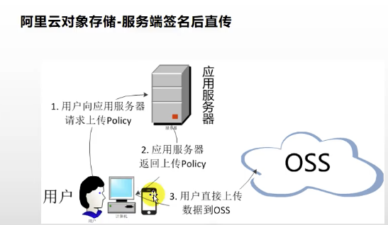


## 阿里云存储购买

1. 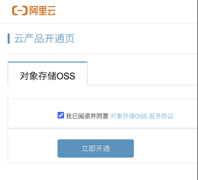

2. 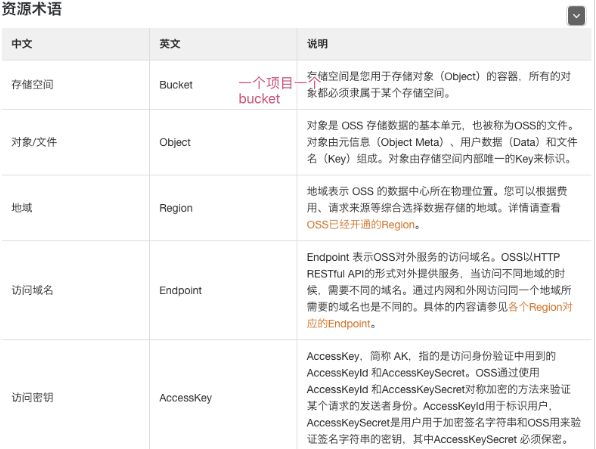

3. 创建一个Bucket

	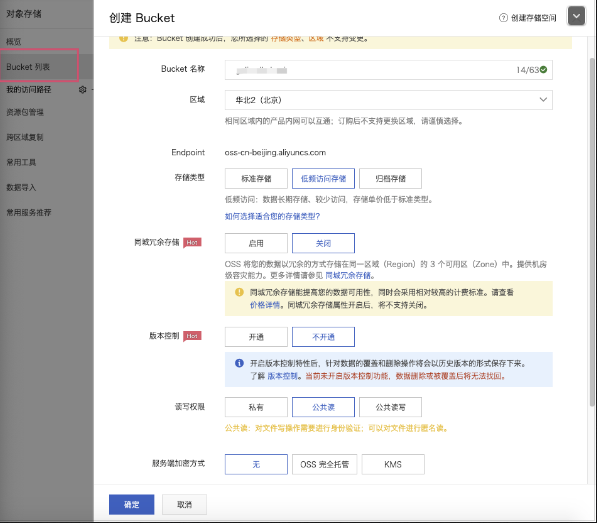

## 整合aliyun-SDK

1. 加入依赖

```xml
<!--阿里云存储服务-->
<dependency>
    <groupId>com.aliyun.oss</groupId>
    <artifactId>aliyun-sdk-oss</artifactId>
    <version>3.10.2</version>
</dependency>
```

2. 根据官网给出的案例进行测试

	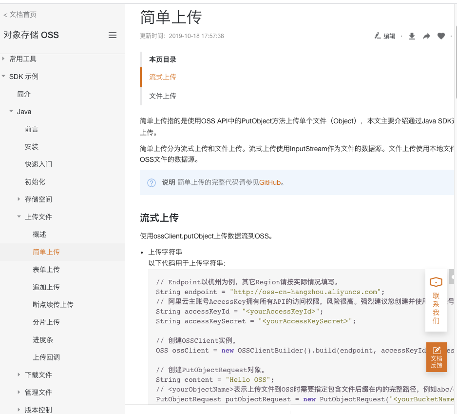

3. 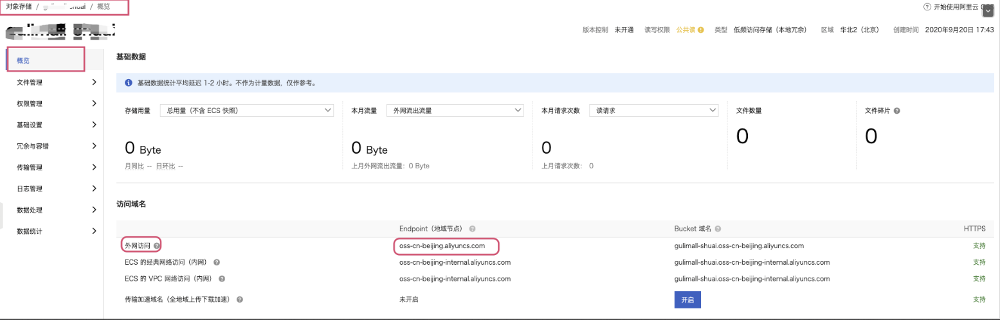

4. 修改代码中的

```java
// Endpoint以杭州为例，其它Region请按实际情况填写。 endpoint 为Bucket 的外网访问地址
String endpoint = "oss-cn-beijing.aliyuncs.com";
 // 阿里云主账号AccessKey拥有所有API的访问权限，风险很高。强烈建议您创建并使用RAM账号进行API访问或日常运维，请登录 https://ram.console.aliyun.com 创建RAM账号。
String accessKeyId = "LTAI4G6NvVQoR4E8rbYKVabCW";
String accessKeySecret = "O7sRW85fwf25tkuW5mf9QvbpE8EaRX1";
```


​	

5. 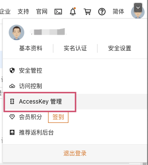

6. 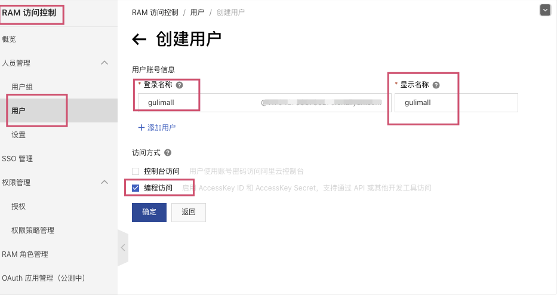

7. 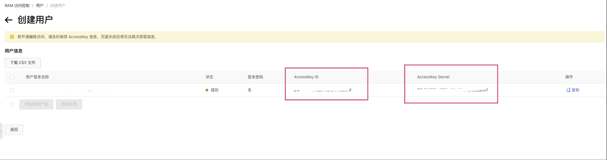

8. 分配权限

	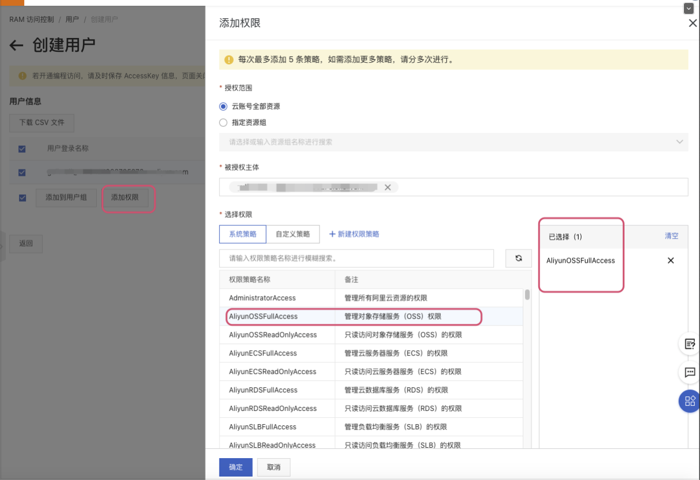

9. 最后的代码

```java
@Test
    public void testUpload() throws FileNotFoundException {
        // Endpoint以杭州为例，其它Region请按实际情况填写。 endpoint 为Bucket 的外网访问地址
        String endpoint = "oss-cn-beijing.aliyuncs.com";
         // 阿里云主账号AccessKey拥有所有API的访问权限，风险很高。强烈建议您创建并使用RAM账号进行API访问或日常运维，请登录 https://ram.console.aliyun.com 创建RAM账号。
        String accessKeyId = "LTAI4G6NvVQoR4ErbYKVabCW";
        String accessKeySecret = "O7sRW85fwf25tkuWmf9QvbpE8EaRX1";

        // 创建OSSClient实例。
//        OSS ossClient = new OSSClientBuilder().build(endpoint, accessKeyId, accessKeySecret);

        // 上传文件流。
        InputStream inputStream = new FileInputStream("/Users/mac/Documents/Image/f28c9030d05b430f20f3940f5fa3d2cb.jpg");
        ossClient.putObject("gulimall-shuai", "test1.jpg", inputStream);

        // 关闭OSSClient。
        ossClient.shutdown();

        System.out.println("上传完成");
    }
```

10. 测试

	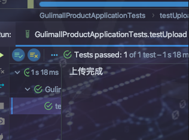

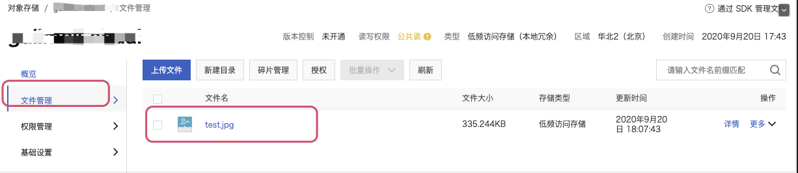


11. 外网访问

	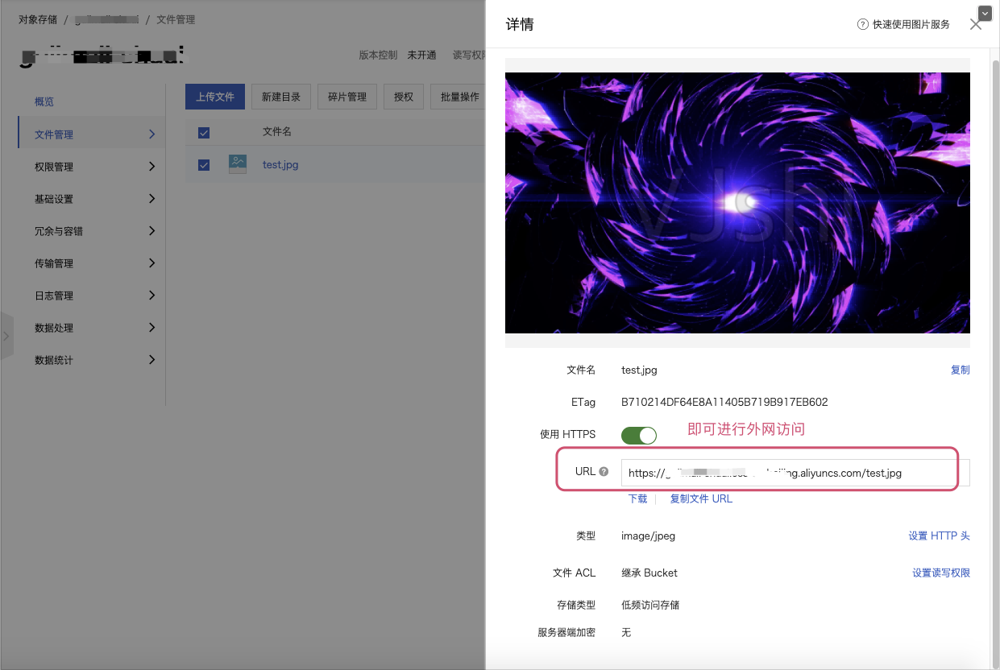


## Spring Cloud整合 Aliyun Spring Boot OSS

> 上面都是使用的阿里云提供的 OSS-SDK最原始的sdk 。需要配置好多东西。

1. 加入依赖

	```xml
	<dependencyManagement>
	    <dependencies>
	        <dependency>
	            <groupId>com.alibaba.cloud</groupId>
	            <artifactId>aliyun-spring-boot-dependencies</artifactId>
	            <version>1.0.0</version>
	            <type>pom</type>
	            <scope>import</scope>
	        </dependency>
	    </dependencies>
	</dependencyManagement>
	<dependency>
	     <groupId>com.alibaba.cloud</groupId>
	     <artifactId>aliyun-oss-spring-boot-starter</artifactId>
	</dependency>
	```


​	

2. 

```yaml
alibaba:
  cloud:
    access-key: LTAI4G6NvVQoR74ErbYKVabCW
    secret-key: O7sRW85fwf255tkuWmf9QvbpE8EaRX1
    oss:
      endpoint: oss-cn-beijing.aliyuncs.com
```

3. 

```java
@Autowired
    OSSClient ossClient;//注入阿里云存储 对象
    /*
     * TODO <p> 测试阿里云文件上传功能</p>
     * @author mac
     * @date 2020/9/20 5:49 下午
     * @param null
     * @return
     * @see #
     */
    @Test
    public void testUpload() throws FileNotFoundException {
//        // Endpoint以杭州为例，其它Region请按实际情况填写。 endpoint 为Bucket 的外网访问地址
//        String endpoint = "oss-cn-beijing.aliyuncs.com";
//         // 阿里云主账号AccessKey拥有所有API的访问权限，风险很高。强烈建议您创建并使用RAM账号进行API访问或日常运维，请登录 https://ram.console.aliyun.com 创建RAM账号。
//        String accessKeyId = "LTAI4G6NvVQoR4ErbYKVabCW";
//        String accessKeySecret = "O7sRW85fwf25tkuWmf9QvbpE8EaRX1";

        // 创建OSSClient实例。
//        OSS ossClient = new OSSClientBuilder().build(endpoint, accessKeyId, accessKeySecret);

        // 上传文件流。
        InputStream inputStream = new FileInputStream("/Users/mac/Documents/Image/f28c9030d05b430f20f3940f5fa3d2cb.jpg");
        ossClient.putObject("gulimall-shuai", "test1.jpg", inputStream);

        // 关闭OSSClient。
        ossClient.shutdown();

        System.out.println("上传完成");
    }
```

4. 

5. 

## 服务端签名后直传

上面任然经由自己的服务器获取到文件io流，然后传给云存储服务器。


下面实现   浏览器跟自己的服务器要到签名后，然后直接将文件上传到云存储服务器。


1. 创建微服务`gulimall-third-party` 用以整合所有的第三方服务模块

2. 引入依赖

	```xml
	<dependencies>
	    <dependency>
	        <groupId>com.shuai.gulimall</groupId>
	        <artifactId>gulimall-common</artifactId>
	        <version>0.0.1-SNAPSHOT</version>
	        <!--排除mybatis依赖-->
	        <exclusions>
	            <exclusion>
	                <groupId>com.baomidou</groupId>
	                <artifactId>mybatis-plus-boot-starter</artifactId>
	            </exclusion>
	        </exclusions>
	    </dependency>
	    <!--阿里云存储服务-->
	    <dependency>
	        <groupId>com.alibaba.cloud</groupId>
	        <artifactId>aliyun-oss-spring-boot-starter</artifactId>
	    </dependency>
	    <dependency>
	        <groupId>org.springframework.boot</groupId>
	        <artifactId>spring-boot-starter-web</artifactId>
	    </dependency>
	    <dependency>
	        <groupId>org.springframework.cloud</groupId>
	        <artifactId>spring-cloud-starter-openfeign</artifactId>
	    </dependency>
	
	    <dependency>
	        <groupId>org.springframework.boot</groupId>
	        <artifactId>spring-boot-starter-test</artifactId>
	        <scope>test</scope>
	        <exclusions>
	            <exclusion>
	                <groupId>org.junit.vintage</groupId>
	                <artifactId>junit-vintage-engine</artifactId>
	            </exclusion>
	        </exclusions>
	    </dependency>
	</dependencies>
	
	<dependencyManagement>
	    <dependencies>
	        <dependency>
	            <groupId>org.springframework.cloud</groupId>
	            <artifactId>spring-cloud-dependencies</artifactId>
	            <version>${spring-cloud.version}</version>
	            <type>pom</type>
	            <scope>import</scope>
	        </dependency>
	        <dependency>
	            <groupId>org.springframework.boot</groupId>
	            <artifactId>spring-boot-dependencies</artifactId>
	            <version>${spring-boot.version}</version>
	            <type>pom</type>
	            <scope>import</scope>
	        </dependency>
	        <dependency>
	            <groupId>com.alibaba.cloud</groupId>
	            <artifactId>aliyun-spring-boot-dependencies</artifactId>
	            <version>1.0.0</version>
	            <type>pom</type>
	            <scope>import</scope>
	        </dependency>
	    </dependencies>
	</dependencyManagement>
	```

3. 使用配置中心

	```properties
	# bootstrap.properties
	spring.application.name=service-provider-third-party
	spring.cloud.nacos.config.server-addr=127.0.0.1:8848
	# 指定命名空间
	spring.cloud.nacos.config.namespace=c80423e6-208c-4b9c-a9de-cd12fee0d501
	
	spring.cloud.nacos.config.ext-config[0].data-id=oss.yml
	spring.cloud.nacos.config.ext-config[0].group=Dev
	spring.cloud.nacos.config.ext-config[0].refresh=true
	```

4. 新建命名空间 `thirdParty`并加入oss配置信息

	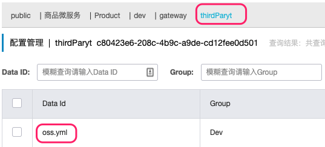

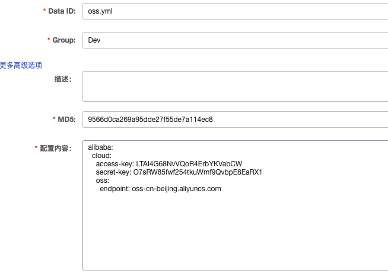

5. 新增配置文件 配置Nacos信息 服务注册到Nacos内

	```yaml
	#application.yml
	# DataSource Config
	spring:
	  cloud:
	    nacos:
	      discovery:
	        server-addr: 127.0.0.1:8848
	
	  application:
	    name: service-provider-third-party
	
	server:
	  port: 30000
	alibaba:
	  cloud:
	    access-key: LTAI4G6NvVQoR4ErbYKVabCW
	    secret-key: O7sRW85fwf25tkuWmf9QvbpE8EaRX1
	    oss:
	      endpoint: oss-cn-beijing.aliyuncs.com
	
	```

6. 开启Nacos注册发现功能

	```java
	@SpringBootApplication
	@EnableDiscoveryClient
	public class GulimallThirdPartyApplication {
	
	    public static void main(String[] args) {
	        SpringApplication.run(GulimallThirdPartyApplication.class, args);
	    }
	
	}
	```

7. 测试

	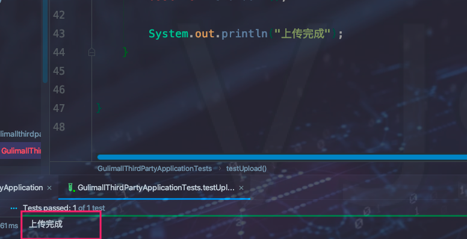

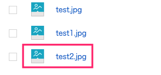

8. 签名后上传 - 根据官方给定教程来弄

	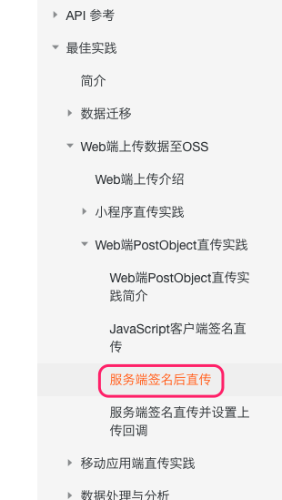

9. 新增OssController

	```java
	package com.shuai.gulimallthirdparty.controller;
	
	import com.aliyun.oss.OSS;
	import com.aliyun.oss.OSSClient;
	import com.aliyun.oss.OSSClientBuilder;
	import com.aliyun.oss.common.utils.BinaryUtil;
	import com.aliyun.oss.model.MatchMode;
	import com.aliyun.oss.model.PolicyConditions;
	import org.codehaus.jettison.json.JSONObject;
	import org.springframework.beans.factory.annotation.Autowired;
	import org.springframework.beans.factory.annotation.Value;
	import org.springframework.web.bind.annotation.RequestMapping;
	import org.springframework.web.bind.annotation.RestController;
	
	import java.nio.file.SimpleFileVisitor;
	import java.text.SimpleDateFormat;
	import java.util.Date;
	import java.util.LinkedHashMap;
	import java.util.Map;
	
	/**
	 * TODO:<p>  <p/>
	 *
	 * @Author mac
	 * @Date 2020/9/20 10:20 下午
	 * @Version V1.0
	 **/
	@RestController
	public class OssController {
	
	    @Autowired
	    OSS ossClient;
	
	    @Value("${alibaba.cloud.oss.endpoint}")
	    private String endpoint;
	
	    @Value("${alibaba.cloud.oss.bucket}")
	    private String bucket;
	
	    @Value("${alibaba.cloud.access-key}")
	    private String accessId;
	
	    @RequestMapping("oss/policy")
	public R policy(){
	        String host = "https://" + bucket + "." + endpoint; // host的格式为 bucketname.endpoint
	        // callbackUrl为 上传回调服务器的URL，请将下面的IP和Port配置为您自己的真实信息。
	//        String callbackUrl = "http://88.88.88.88:8888";
	
	        String format=new SimpleDateFormat("yyyy-MM-dd").format(new Date());
	
	        String dir = format+"/"; // 用户上传文件时指定的前缀。每次上传文件都生成一个目录存放文件
	
	        // 创建OSSClient实例。
	//        OSS ossClient = new OSSClientBuilder().build(endpoint, accessId, accessKey);
	        Map<String, String> respMap = null;
	        try {
	            long expireTime = 30;
	            long expireEndTime = System.currentTimeMillis() + expireTime * 1000;
	            Date expiration = new Date(expireEndTime);
	            // PostObject请求最大可支持的文件大小为5 GB，即CONTENT_LENGTH_RANGE为5*1024*1024*1024。
	            PolicyConditions policyConds = new PolicyConditions();
	            policyConds.addConditionItem(PolicyConditions.COND_CONTENT_LENGTH_RANGE, 0, 1048576000);
	            policyConds.addConditionItem(MatchMode.StartWith, PolicyConditions.COND_KEY, dir);
	
	            String postPolicy = ossClient.generatePostPolicy(expiration, policyConds);
	            byte[] binaryData = postPolicy.getBytes("utf-8");
	            String encodedPolicy = BinaryUtil.toBase64String(binaryData);
	            String postSignature = ossClient.calculatePostSignature(postPolicy);
	
	            respMap = new LinkedHashMap<String, String>();
	            respMap.put("accessid", accessId);
	            respMap.put("policy", encodedPolicy);
	            respMap.put("signature", postSignature);
	            respMap.put("dir", dir);
	            respMap.put("host", host);
	            respMap.put("expire", String.valueOf(expireEndTime / 1000));
	            // respMap.put("expire", formatISO8601Date(expiration));
	
	        } catch (Exception e) {
	            // Assert.fail(e.getMessage());
	            System.out.println(e.getMessage());
	        } finally {
	            ossClient.shutdown();
	        }
	        return R.ok().put("data",respMap);
	    }
	```

10. 测试

	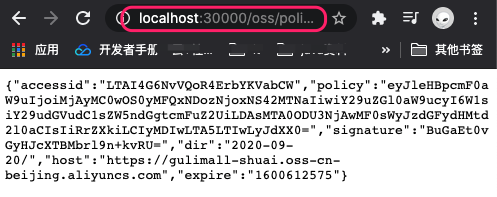

> Osscontroller返回的内容就是我们日后要发给云存储服务器的签名  然后带着签名以及文件上传到云存储

11. API网关模块中新增`第三方服务地址映射`

	```yaml
	#nacos注册
	spring:
	  cloud:
	    nacos:
	      discovery:
	        server-addr: 127.0.0.1:8848
	    gateway:
	      routes: # 使用官网提供的 5.9 Query Route Predicate Factory  路由规则
	      - id: query_route_baidu # 路由给百度
	        uri: https://www.baidu.com
	        predicates:
	        - Query=url, baidu  # URL中包含百度则路由给百度
	
	      - id: query_route_QQ # 路由给QQ
	        uri: https://www.qq.com
	        predicates:
	        - Query=url, qq
	
	      - id: product_router # 路由给商品微服务
	        uri: lb://service-provider-product
	        predicates:
	          - Path=/api/gulimallproduct/**   #路由规则
	        filters:
	          - RewritePath=/api/(?<segment>.*),/$\{segment}  # 路径重写
	
	      - id: third_party_route # 第三方服务
	        uri: lb://service-provider-third-party
	        predicates:
	          - Path=/api/thirdparty/**   #路由规则
	        filters:
	          - RewritePath=/api/thirdparty/(?<segment>.*),/$\{segment}  # 路径重写
	
	      - id: admin_router # 路由给renren-fast
	        uri: lb://renren-fast
	        predicates:
	          - Path=/api/**
	        filters:
	          - RewritePath=/api/(?<segment>.*),/renren-fast/$\{segment}
	
	## 前端项目都带上api
	## 错误路径http://localhost:8888/api/captcha.jpg   转成正确路径 http://localhost:8888/renren-fast/captcha.jpg  需要用到 网关中filters 重写路径
	## 上面会产生跨域问题
	
	
	
	  application:
	    name: service-provider-gateway
	
	server:
	  port: 8888
	
	```

	> 以后只需要从网关中获取Oss 签名

12. 重启网关项目测试

	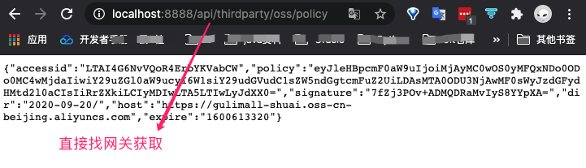

13. 前后台联调

* 前台代码在 https://snippets.cacher.io/snippet/fc3ba80688917720d005


当前台获取签名后拿着文件和签名上传数据到存储服务器时，存在跨域问题。在阿里云 存储设置界面开启跨域访问即可。


