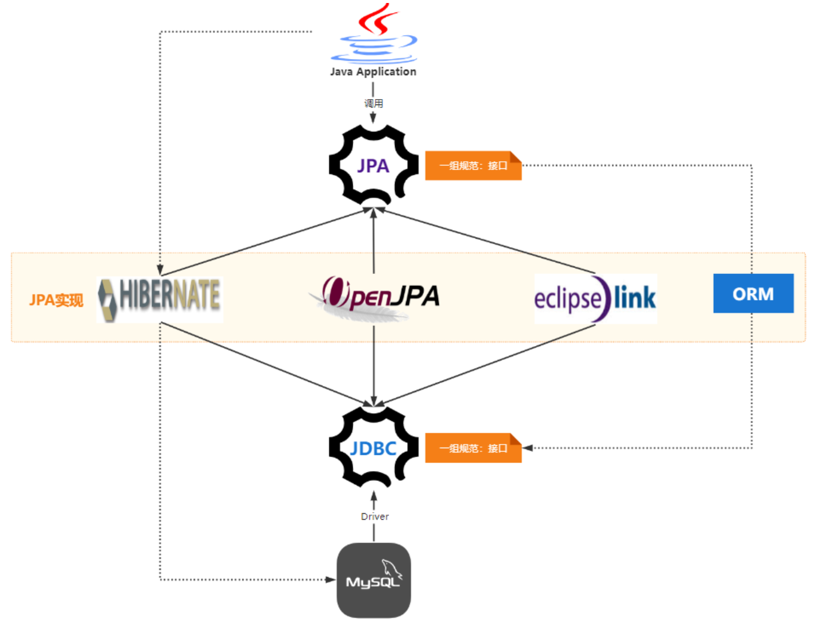
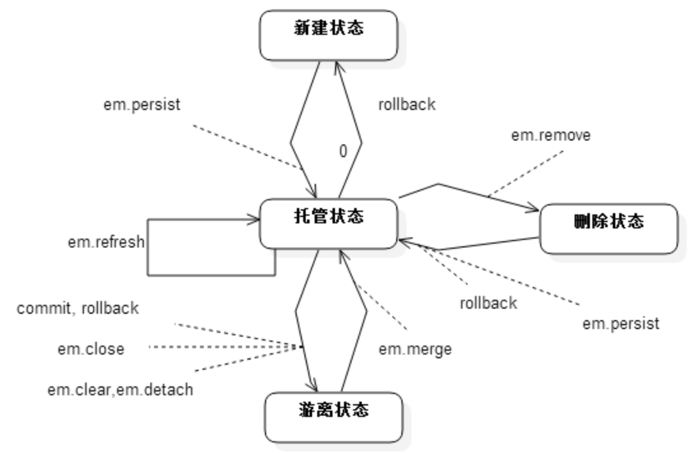
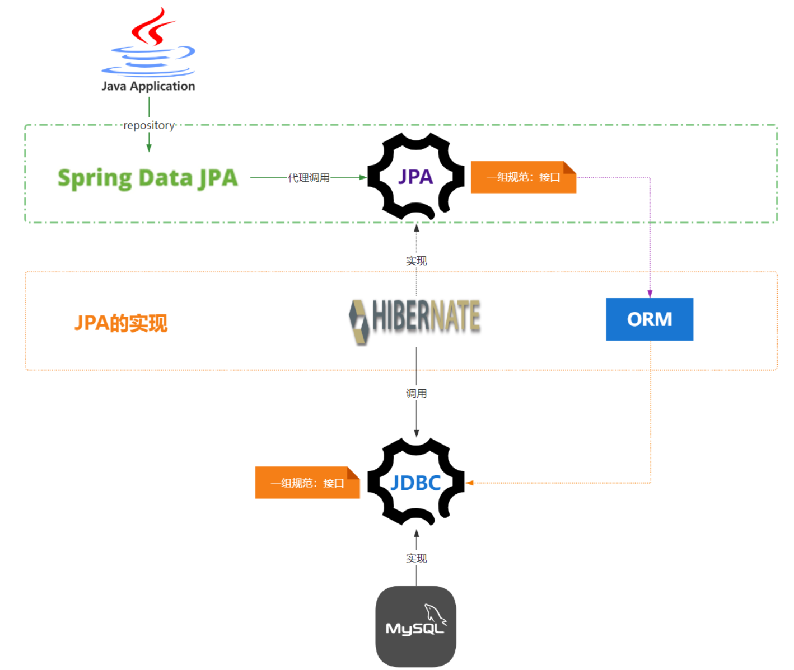
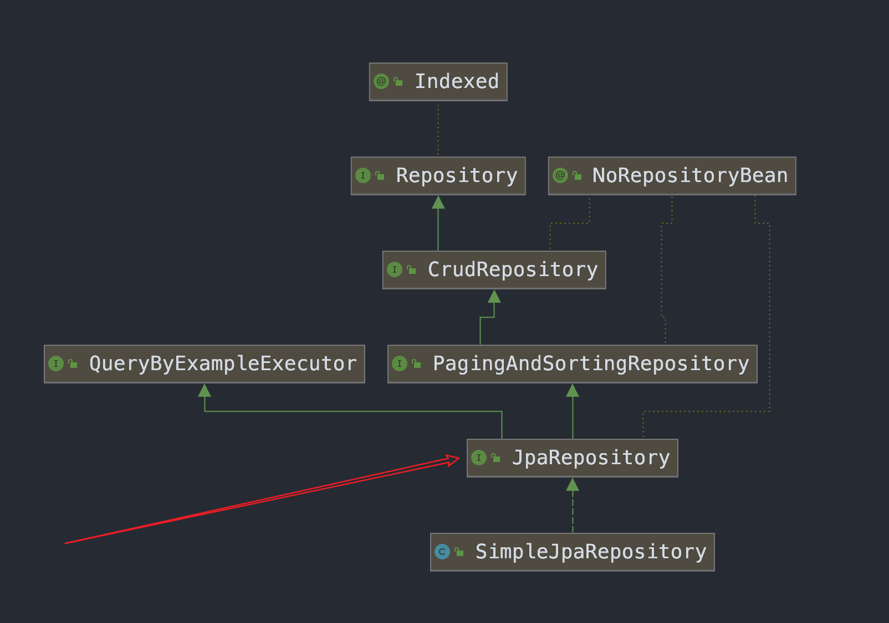

## 概念梳理

* JPA
	* JPA 是JDBC 的升级版且依赖于JDBC，JDBC是由各个关系型数据库实现的， JPA 是由ORM框架实现
	* 为了简化繁琐的JDBC，SUN推出了JPA希望基于JPA持久化可以随意切换数据库，从而实现天下归一
	* 该规范提供了
		* ORM映射元数据【xml】、【注解】，如@Entity 、 @Table 、@Id 与 @Column等注解
		* JPA 的API，用来操作实体对象，执行CRUD操作，如entityManager.merge(T t)
		* JPQL查询语言，如：from Student s where s.name = ?
* hibernate
	* Hibernate就是实现了JPA接口的ORM框架



* SpringDataJpa

	是spring提供的一套简化JPA开发的框架

### mybatis 和 hibernate 区别

* mybatis
	* 小巧、方便、高效、简单、直接、半自动ORM框架
	* mybatis就是jdbc封装，通常而已更加快速
	* 在业务比较复杂系统进行使用
* hibernate
	* 强大、方便、高效、（简单）复杂、绕弯子、全自动ORM框架
	* 根据ORM映射生成不同SQL
	* 在业务相对简单的系统进行使用，随着微服务的业务拆分、表拆分而流行。


### jpa对象的四种状态

* 临时状态：对象刚创建出来，没有与entityManager发生关系，没有被持久化，不处于entityManager中的对象

	```java
	Task t = new Task();
	t.setTaskName("task" + new Date().getTime());
	t.setCreateTime(new Date());
	//t为临时|瞬时状态
	```

* 持久状态 [ <font color=ff00aa>自动更新</font>]：∙与entityManager发生关系，已经被持久化，您可以把持久化状态当做实实在在的数据库记录。

	```java
	em.persist(t); //实体类t已经有id t.getId();
	t.setTaskName("kkk");  //jpa的自动更新 ：更新任务名称，这时，如果提交事务，则直接将kkk更新到数据库,
	```

* 删除状态：执行remove方法，事物提交之前

	```java
	em.clear();
	t.setTaskName("kkk"); //更新数据不会更新到数据库
	```

* 游离状态：游离状态就是提交到数据库后，事务commit后实体的状态，与em无关系，此时实体的属于游离态，或者是新建出来的对象设置ID为数据库已存在ID，也是游离态

	```java
	Task t = new Task();
	t.setId(111L);
	//游离态。或者对象commit事务后的对象也是游离态
	```

	




## Spring Data Jpa

`特性`

* 提供了CRUD常用方法，如分页、排序、简单增删改

	```sql
	@Query(value = "SELECT * FROM USERS WHERE LASTNAME = ?1",
	    countQuery = "SELECT count(*) FROM USERS WHERE LASTNAME = ?1",
	    nativeQuery = true)
	  Page<User> findByLastname(String lastname, Pageable pageable);
	```

* 支持原生SQL操作

	https://docs.spring.io/spring-data/jpa/docs/current/reference/html/#jpa.query-methods.at-query

* 可以按照约定的规则进行【方法命名】去写dao层接口

	https://docs.spring.io/spring-data/jpa/docs/current/reference/html/#repository-query-keywords

* 提供了强大的Query By Example查询、Specifications动态查询、支持Querydsl更加强大的动态查询

	https://docs.spring.io/spring-data/jpa/docs/current/reference/html/#query-by-example



> [代码 ： SpringBootLearn/SpringBoot-JPA )](https://gitee.com/gadeGG/ProjectCode/tree/master/SpringBootLearn/SpringBoot-JPA)
>
> [博客 ： spring-data-jpa-guide，Spring Data JPA实战](https://github.com/zhangzhenhuajack/spring-data-jpa-guide)

## 继承方法



* PagingAndSortingRepository 分页排序查询
* CrudRepository 常用curd、exist、count等方法
* QueryByExampleExecutor count, exists, findAll, findOne**

> <font color=ff00aa size = 4>切记勿使用批量save和delete</font> ： 因为delete是一条条删除，而save则先查一条再save一次。使用原生SQL【JdbcTemplate | em】进行批量操作

```java
String sql="insert into user (name,deptid) values (?,?)";
 
 List<Object[]> batchArgs=new ArrayList<Object[]>();
 batchArgs.add(new Object[]{"caoyc",6});
 batchArgs.add(new Object[]{"zhh",8});
 batchArgs.add(new Object[]{"cjx",8});
 jdbcTemplate.batchUpdate(sql, batchArgs);
```


## Query By Example查询（不建议）

### 限制

- 不支持嵌套或分组属性约束，例如 。`firstname = ?0 or (firstname = ?1 and lastname = ?2)`
- 仅支持字符串的开始/包含/结束/正则表达式等**丰富匹配**和其他属性类型的**精确匹配**。

> 官网 ： [弹簧数据 JPA - 参考文档 (spring.io)](https://docs.spring.io/spring-data/jpa/docs/current/reference/html/#query-by-example)


### 使用

#### 1、基础使用 : 根据传入实体非null字段精确查询

```java
    @Test
    public void one(){
        // [基础使用] : 精确查询name、email、phoneNumber字段
        // [注意] : 如果存在基本数据类型的字段，会有默认值，jpa会按照默认值进行检索，因此可以使用包装类型或者设置为忽略字段
        User user = User.builder()
                .name("testSave3")
                .email("testSave3@xkcoding.com")
                .phoneNumber("17300000003")
                .build();
        Example<User> userExample = Example.of(user);

        List<User> userList = userRepository.findAll(userExample);
        log.info("result : {} ", JSONUtil.toJsonPrettyStr(userList));
    }
```

```bash
from
        jpa_user user0_ 
    where
        user0_.name=? 
        and user0_.email=? 
        and user0_.phone_number=?
> binding parameter [1] as [VARCHAR] - [testSave3]
> binding parameter [2] as [VARCHAR] - [testSave3@xkcoding.com]
> binding parameter [3] as [VARCHAR] - [17300000003]
```

> [注意] : 如果存在基本数据类型的字段，会有默认值，jpa会按照默认值进行检索，因此可以使用包装类型或者设置为忽略字段


#### 2、全局匹配器

```java
 @Test
    public void two(){
        // [忽略非null字段]
        User user = User.builder()
                .name("testSave3")
                .email("testSave3@xkcoding.com")
                .phoneNumber("17300000003")
                .salt("0bec6610d41d42e3a34e5fb6e2dd404a")
                .build();

        ExampleMatcher matcher = ExampleMatcher.matching()
                .withIgnorePaths("salt")//忽略salt字段，不进行检索
                .withIncludeNullValues()//配置null值也需要检索
                .withStringMatcher(ExampleMatcher.StringMatcher.ENDING);

        Example<User> userExample = Example.of(user, matcher);

        List<User> userList = userRepository.findAll(userExample);
        log.info("result : {} ", JSONUtil.toJsonPrettyStr(userList));

    }
```

```java
    from
        jpa_user user0_ 
    where
        (
            user0_.update_name is null
        ) 
        and (
            user0_.email like ? escape ?
        ) 
        and (
            user0_.phone_number like ? escape ?
        ) 
        and (
            user0_.last_login_time is null
        ) 
        and (
            user0_.create_name is null
        ) 
        and (
            user0_.last_update_time is null
        ) 
        and (
            user0_.create_time is null
        ) 
        and (
            user0_.id is null
        ) 
        and (
            user0_.password is null
        ) 
        and (
            user0_.status is null
        ) 
        and (
            user0_.name like ? escape ?
        )
> binding parameter [1] as [VARCHAR] - [%testSave3@xkcoding.com]
> binding parameter [2] as [CHAR] - [\]
> binding parameter [3] as [VARCHAR] - [%17300000003]
> binding parameter [4] as [CHAR] - [\]
> binding parameter [5] as [VARCHAR] - [%testSave3]
> binding parameter [6] as [CHAR] - [\]
```

> * withIgnorePaths("salt")//忽略salt字段，不进行检索
> * withIncludeNullValues()//实体中null值也要检索
> * withStringMatcher(ExampleMatcher.StringMatcher.ENDING);//实体中有值的字符串字段都需要左模糊查询

`问题:`

如果匹配器仅此而已，感觉很鸡肋啊，我们预期是既可以全局配置[null值检索]也可以指定字段指定匹配器[不同的字段使用不同的匹配器]，那么他来了。


#### 3、属性指定匹配器

```java
@Test
    public void three(){
        // [指定属性指定匹配器]
        User user = User.builder()
                .name("testSave3")
                .email("testSave3@xkcoding.com")
                .phoneNumber("17300000003")
                .salt("0bec6610d41d42e3a34e5fb6e2dd404a")
                .build();

        ExampleMatcher matcher = ExampleMatcher.matching()
                .withMatcher("name", ExampleMatcher.GenericPropertyMatcher::startsWith)//同字段开始模糊匹配
                .withMatcher("name", ExampleMatcher.GenericPropertyMatcher::endsWith)//同字段尾部模糊匹配
                .withMatcher("email", match -> match.stringMatcher(ExampleMatcher.StringMatcher.DEFAULT))//默认：精准匹配
                .withMatcher("phoneNumber", match -> match.stringMatcher(ExampleMatcher.StringMatcher.CONTAINING))//模糊匹配
                .withMatcher("salt", match -> match.stringMatcher(ExampleMatcher.StringMatcher.ENDING));

        Example<User> userExample = Example.of(user, matcher);

        List<User> userList = userRepository.findAll(userExample);
        log.info("result : {} ", JSONUtil.toJsonPrettyStr(userList));

    }
```

> 还是很鸡肋！只支持字符串的精准、模糊匹配，其他类型只能精准匹配，以及分页，且不能分组。


## Specification

动态查询 不太好用

[弹簧数据 JPA - 参考文档 (spring.io)](https://docs.spring.io/spring-data/jpa/docs/current/reference/html/#specifications) | [Spring Data JPA Specification（规范）实现复杂查询](https://blog.csdn.net/wangmx1993328/article/details/89633003)


## Querydsl （建议）

Spring Data JPA 里面还帮我们做了 QuerydslJpaRepository 用来支持 Querydsl 的查询方法，当我们引入 Querydsl 的时候 Spring 就会自动帮我们把 SimpleJpaRepository 的实现切换到 QuerydslJpaRepository 的实现。

动态查询及面向对象查询 类似于 mybatisplus 的 `条件构造器`

[弹簧数据 JPA - 参考文档 (spring.io)](https://docs.spring.io/spring-data/jpa/docs/current/reference/html/#core.extensions.querydsl) | [JPA整合Querydsl](https://zhuanlan.zhihu.com/p/99055340)


## 审计

正常情况下，我们给实体对象添加createTime、updateTime、createUser、updateUser。而我们又不想每一个实体每次操作手动塞入这四个字段值，审计 为我们解决了这个问题。

> [代码 ： SpringBootLearn/SpringBoot-JPA )](https://gitee.com/gadeGG/ProjectCode/tree/master/SpringBootLearn/SpringBoot-JPA) | [Spring Data JPA开启审计功能，自动保存操作人操作时间](https://blog.csdn.net/lxh_worldpeace/article/details/105582259)


## 小技巧

### EntityManager 线程不安全 

```java 
@PersistenceContext //每个线程开启一个em
private EntityManager entityManager;
```


### 获取部分字段

> 一般情况下，我们是返回的字段和 DB 的查询结果的字段是一一对应的，但有的时候，需要返回一些指定的字段，不需要全部返回，或者返回一些复合型的字段，还得自己写逻辑

1. 定义接口

	```java
	public interface UserProjectionI {
	    Long getId();
	    String getName();
	    String getPassword();
	}
	```

2. 定义repostory

	```java
	@Repository
	public interface UserRepository extends JpaRepository<User, Long> {
	    Collection<UserProjectionI> findByEmail(String email);
	}
	```

3. 使用

	```java
	    @Test
	    public void partField() {
	        Collection<UserProjectionI> userProjections = userRepository.findByEmail("testSave9@xkcoding.com");
	        Iterator<UserProjectionI> iterator = userProjections.iterator();
	        while (iterator.hasNext()) {
	            UserProjectionI userProjectionI = iterator.next();
	            log.info(userProjectionI.getId() + ":" + userProjectionI.getName() + ":" + userProjectionI.getPassword());
	        }
	    }
	```

	

### 返回字段整合

1. 定义接口

	```java
	public interface UserProjectionI {
	    Long getId();
	    String getName();
	    String getPassword();
	
	    //字段整合
	    @Value("#{target.name + ' ' + target.password}")
	    String getFullInfo();
	}
	```

2. 或者定义dto类

	```java
	@Data
	public class UserProjection{
	    private Long id;
	    private String name;
	    private String password;
	    //注意构造方法
	    UserProjection(Long id, String name, String password) {
	        this.id = id;
	        this.name = name;
	        this.password = password;
	    }
	}
	```

3. 定义repostory

	```java
	@Repository
	public interface UserRepository extends JpaRepository<User, Long> {
	    Collection<UserProjectionI> findByEmail(String email);
	}
	```

4. 测试

	```java
	@Test
	    public void partField() {
	        Collection<UserProjectionI> userProjections = userRepository.findByEmail("testSave9@xkcoding.com");
	        Iterator<UserProjectionI> iterator = userProjections.iterator();
	        while (iterator.hasNext()) {
	            UserProjectionI userProjectionI = iterator.next();
	            log.info(userProjectionI.getFullInfo());
	        }
	    }
	```

	

> 详情见 ： [spring-data-jpa-guide/03.md](https://github.com/zhangzhenhuajack/spring-data-jpa-guide/blob/master/《SpringDataJpa实战》书/03.md)


### 支持动态 Projections，想通过泛化，根据不同的业务情况，返回不通的字段集合

1. 定义repostory

	```java
	@Repository
	public interface UserRepository extends JpaRepository<User, Long> {
	    Collection<T> findByName(String name, Class<T> type);
	}
	```

2. 测试

	```java
	 @Test
	    public void partFieldByProjection() {
	        // 获取指定字段
	        Collection<UserProjectionI> userProjections = userRepository.findByName("testSave9@xkcoding.com", UserProjection.class);
	        Iterator<UserProjectionI> iterator = userProjections.iterator();
	        while (iterator.hasNext()) {
	            UserProjectionI userProjectionI = iterator.next();
	            log.info(userProjectionI.getFullInfo());
	        }
	
	        //获取全部字段
	        Collection<User> userProjection = userRepository.findByName("testSave7", User.class);
	        Iterator<UserProjectionI> iterators = userProjection.iterator();
	        while (iterators.hasNext()) {
	            UserProjectionI userProjectionI = iterators.next();
	            log.info(userProjectionI.getFullInfo());
	        }
	    }
	```

	