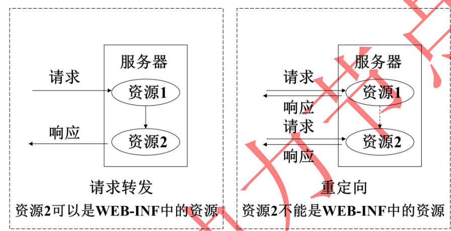

## 引言

总而言之，Spring的出现 改变了我们项目的架构、简化了我们开发。简化架构得益于AOP ，当然 **面向切面**编程 很好的补充了OOP的编程模式。

*   OOP  功能实现的指导思想。
*   AOP   项目结构更加灵活，热插拔原理。
*   链式编程  不用重复调用对象，懒人必备，这里有很多的框架：mapstruct、lombok
*   函数式编程   Java8 提供的新特性，简化代码，替代匿名内部类。

 Spring 官网中给定： Javaee一站式解决方案，必然少不了 web 开发，得 Spring 提供了 Spring-MVC


## Spring MVC

`它干了个什么事`

一句话，提供了web 支持，现在的项目只要是 企业级开发几乎都是BS架构了吧。是BS架构的项目中必然少不了MVC的支持。早些前学过 servlet 也是提供web支持的，servlet和Spring MVC的关系类似于jdbc和mybatis的关系。


## 概念介绍


### 中央调度器

在MVC架构中充当C ，是整个的流程控制中心，负责调度各个组件去处理具体的事务。降低了组件之间的耦合。很多种都有这种设计思想。类似于解决单点登录中 独立一个认证服务器，所有的登陆请求都到该服务器去认证。


### 处理器映射器

将不同的请求映射到不同的处理器。然后将处理结果返回给中央调度器


### 处理器适配器

中央调度器会根据不同的处理器自动为处理器选择适配器，以执行处理器  


### 处理器

也称后端控制器，即我们写的控制类。


### 视图解析器

处理器将处理后的数据返给中央中央调度器，中央调度器将数据发送给视图解析器，视图解析器  将页面和数据进行处理，处理后以页面的形式返给浏览器


## 执行流程


## 请求转发和重定向



*   对于请求转发的页面，可以是WEB-INF中页面；
*   而重定向的页面，是不能为WEB-INF中页面。因为重定向相当于用户再次发出一次请求，而用户是不能直接访问 WEB-INF 中资
    源的。  


### 1、请求转发

*   请求转发到页面

    ```java
    moduleandview.setViewName("forward:/WEB-INF/jsp/show.jsp")
    ```

*   请求转发到Controller

    ```java
    moduleandview.setViewName("forward:请求路径")
    ```

    

### 2、重定向

*   重定向到页面

    ```java
    moduleandview.setViewName("redirect:/WEB-INF/jsp/show.jsp")
    ```

*   重定向到Controller

    ```java
    moduleandview.setViewName("redirect:请求路径")
    ```

    


## 全局异常处理

参考：https://blog.csdn.net/qq_24598601/article/details/85018849

### 1、HandlerExceptionResolver

>   这种方式可以用来进行全局的异常控制。具体步骤是：

1.  编写自定义的异常类

    ```java
    /**
     * 描述：自定义异常类
     * @author lytao123
     *
     */
    public class CustomException extends Exception {
    	private static final long serialVersionUID = 1L;
    
    	public CustomException(String message) {
    		super(message);
    		this.message = message;
    	}
    
    	// 异常信息
    	private String message;
    
    	public String getMessage() {
    		return message;
    	}
    
    	public void setMessage(String message) {
    		this.message = message;
    	}
    }
    ```

2.  编写自定义的异常处理器 , 这里需要实现 HandlerExceptionResolver 接口

    ```java
    public class CustomExceptionResolver implements HandlerExceptionResolver {
    
    	@Override
    	public ModelAndView resolveException(HttpServletRequest request,
    			HttpServletResponse response, Object handler, Exception ex) {
    
    		ex.printStackTrace();
    
    		CustomException customException = null;
    		
    		//如果抛出的是系统自定义异常则直接转换
    		if(ex instanceof CustomException){
    			customException = (CustomException)ex;
    		}else{
    			//如果抛出的不是系统自定义异常则重新构造一个未知错误异常。
    			customException = new CustomException("未知错误，请与系统管理员联系！");
    		}
    		
    		ModelAndView modelAndView = new ModelAndView();
    		modelAndView.addObject("message", customException.getMessage());
    		modelAndView.setViewName("error");
    
    		return modelAndView;
    	}
    
    }
    ```

3.  配置自定义的异常处理器   在 springmvc.xml 中配置：

    ```xml
    <!-- 全局异常处理器 -->
    <bean id="handlerExceptionResolver" class="com.ssm.controller.exceptionresolver.CustomExceptionResolver"/>
    ```

4.  测试，在controller层抛出异常

    ```java
    private final static String SUCCESS = "success";  //返回结果
    private final static String ERROR = "error";  //返回结果
    
    
    //方式一  继承 HandlerExceptionResolver
    //测试捕获全局异常
    @RequestMapping(value="/testException",method=RequestMethod.GET)
    public ModelAndView testException() throws Exception {
    	ModelAndView modelAndView = new ModelAndView();
    	
    	if(!"".equals(SUCCESS)) {
    		//抛出异常
    		throw new CustomException("测试异常捕获方式一。");
    	}
    	
    	modelAndView.setViewName(SUCCESS);
    	
    	return modelAndView;
    }
    ```

    

### 2、@ExceptionHandler

>   这种方式的异常处理因为 改注解只能注解到方法上，所以进行异常处理的方法必须与出错的方法在同一个 Controller 里面，这就造成了这种方法不好运用在全局的异常控制上，如果想实现需要每个 Controller 都写一个方法，一般用来对 Controller 的特定异常控制

```java
/**
 * 方式二，@ExceptionHandler 可用来捕获单个Controller中的异常
 * @param e
 * @return
 */
//用于处理异常
@ExceptionHandler(value={MyException.class})
public /*@ResponseBody*/ String exception(Exception e) {
	System.out.println(e.getMessage());
	
	return ERROR;
//		return e.getMessage();
}

@RequestMapping("/testException2")
public ModelAndView testException2() throws Exception {
	ModelAndView modelAndView = new ModelAndView();
	
	if(!"".equals(SUCCESS)) {
		throw new MyException("测试错误，方式二");
	}
	
	modelAndView.setViewName(SUCCESS);
	return modelAndView;
}
```


### 3、@ControllerAdvice + @ExceptionHandler  推荐

>   见  MD-Book\谷粒商城\分布式基础篇\第八章-前端管理员系统-品牌管理.md   中 全局异常返回


## 类型转化器

>   前端数据与后端接受参数转换的功能。六种对应方法见 :  MD-Book\SpringBoot\番外\SpringBoot请求参数映射.md
>
>   如果出现 前端 日期等后端无法正确接受的情况，使用自定义 Converter 实现来达到转换的目的。以后出现这种情况再补充


## 参数校验

>   见 MD-Book\谷粒商城\分布式基础篇\第八章-前端管理员系统-品牌管理.md   中   前后端数据校验


## 文件上传


## 拦截器

*   拦截器是SpringMVC框架独有的。
*   拦截器**只会对控制器中的方法**进行拦截


## 过滤器

*   过滤器是Servlet规范的一部分，任何框架都可以使用过滤器技术。
*   过滤器配置了/*，可以拦截任何资源。