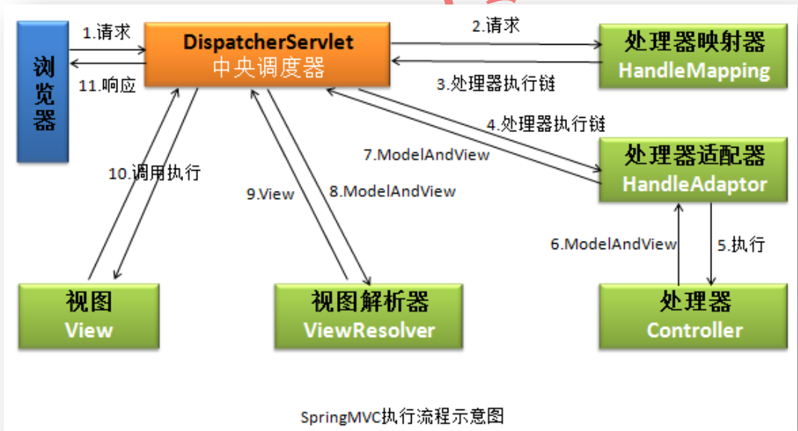

## 引言

总而言之，Spring的出现 改变了我们项目的架构、简化了我们开发。简化架构得益于AOP ，当然 **面向切面**编程 很好的补充了OOP的编程模式。

*   OOP  功能实现的指导思想。
*   AOP   项目结构更加灵活，热插拔原理。
*   链式编程  不用重复调用对象，懒人必备，这里有很多的框架：mapstruct、lombok
*   函数式编程   Java8 提供的新特性，简化代码，替代匿名内部类。

 Spring 官网中给定： Javaee一站式解决方案，必然少不了 web 开发，得 Spring 提供了 Spring-MVC

## Spring MVC

`它干了个什么事`

一句话，提供了web 支持，现在的项目只要是 企业级开发几乎都是BS架构了吧。是BS架构的项目中必然少不了MVC的支持。早些前学过 servlet 也是提供web支持的，servlet和Spring MVC的关系类似于jdbc和mybatis的关系。

## 概念介绍

### 中央调度器

在MVC架构中充当C ，是整个的流程控制中心，负责调度各个组件去处理具体的事务。降低了组件之间的耦合。很多种都有这种设计思想。类似于解决单点登录中 独立一个认证服务器，所有的登陆请求都到该服务器去认证。

### 处理器映射器

将不同的请求映射到不同的处理器。然后将处理结果返回给中央调度器

### 处理器适配器

中央调度器会根据不同的处理器自动为处理器选择适配器，以执行处理器  

### 处理器

也称后端控制器，即我们写的控制类。

### 视图解析器

处理器将处理后的数据返给中央中央调度器，中央调度器将数据发送给视图解析器，视图解析器  将页面和数据进行处理，处理后以页面的形式返给浏览器

## 执行流程

