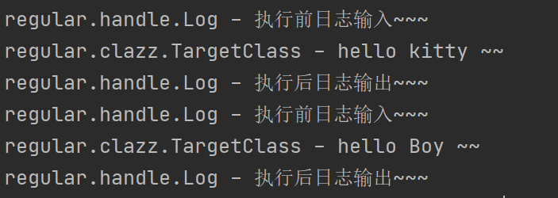

## 什么是AOP

AOP（Aspect Orient Programming），==面向切面编程==，是==面向对象编程 OOP== 的一种补充。面向对象编程是从静态角度考虑程序的结构，而面向切面编程是从动态角度考虑程序运行过程。
AOP 底层，就是采用动态代理模式实现的。采用了两种代理： `JDK 的动态代理`，与 `CGLIB的动态代理`。 如果动态代理为 JDK  则只能切入接口    ，如果为CGLIB   则 接口和普通类都可切入

两种代理具体可参考 ： MD-Book/解决方案/代理.md


## AOP作用

解耦，面向切面 编程


面向切面编程，就是将交叉业务逻辑封装成切面，利用 AOP 容器的功能将切面织入到主业务逻辑中。所谓交叉业务逻辑是指，通用的、与主业务逻辑无关的代码，如安全检查、事务、日志等。若不使用 AOP，则会出现代码纠缠，即交叉业务逻辑与主业务逻辑混合在一起。这样，会使主业务逻辑变的混杂不清。

例如，转账，在真正转账业务逻辑前后，需要权限控制、日志记录、加载事务、结束事务等交叉业务逻辑，而这些业务逻辑与主业务逻辑间并无直接关系。但，它们的代码量所占比重能达到总代码量的一半甚至还多。它们的存在，不仅产生了大量的“冗余”代码，还大大干扰了主业务逻辑---转账。


`演变:`

比如,项目中需要记录日志.

1. 在不使用日志框架前提下,最开始我们想到的是在每个需要记录日志的类中封装日志方法log()，需要时调用即可。 -- 代码冗余
2. 将日志方法封装工具类。-- 工具类多处调用冗余
3. AOP   -- 在不影响主业务代码前提下，进行方法增强和扩展


## AOP术语

```java
/**
 * TODO:<p> JDK -- 自定义动态代理处理类 <p/>
 *
 * @package: com.shuai.springaop.dynamicJDK.dynamicHandle
 * @Author mac
 * @Date 2021/2/21 3:17 下午
 * @Version V1.0
 **/
@Slf4j
public class DynamicHandle implements InvocationHandler {
    /* 目标对象 */
    private Object target;
    public DynamicHandle(Object target){
        this.target = target;
    }
    /*
     * TODO <p> 此方法主要替代代理类。因此要实现1.执行目标方法，2.方法增强 </p>
     * @date 2021/2/21 3:19 下午
     * @param proxy   : 为代理目标对象 ，传入什么实现类则执行什么实现类的目标方法
     * @param method : 为反射核心类
     * @param args  : 为代理对象方法参数
     * @return java.lang.Object ：为地阿里对象方法返回值
     */
    @Override
    public Object invoke(Object proxy, Method method, Object[] args) throws Throwable {
        // 1. 利用反射执行目标方法
        Object res = method.invoke(target, args); // 反射

        //2. 方法增强
        float price = (float) res;
        price = price + 25;
        log.error("代理平台进行加价后，价格为 {} ",price);

        return price;
    }
}
```

`切面（Aspect）:`

​	切面泛指交叉业务逻辑 , 即对目标对象增强或扩展的功能。上例中的事务处理、日志处理就可以理解为切面。常用的切面有==通知==与==顾问==。实际就是对主业务逻辑的一种增强。

`织入（Weaving）:`

​	织入是指将切面代码插入到目标对象的过程。上面 DynamicHandle类中的invoke()方法完成的工作，就可以称为织入。

`连接点（ JoinPoint）:`

​	连接点指可以被切面织入的方法。通常目标接口中的方法均为连接点。

`切入点（ Pointcut）:`

​	切入点指切面具体织入的方法。即目标接口或者类中要增强的方法。

`目标对象（ Target）:`

​	目 标 对 象 指 将 要 被 增 强 的 对 象 。 即 包 含 主 业 务 逻 辑 的 类 的 对 象 。 

`通知（ Advice）:`

​	通知是切面的一种实现，可以完成 ==简单织入功能==（织入功能就是在这里完成的）。上例中的 DynamicHandle 就可以理解为是一种通知。换个角度来说， ==通知定义了增强代码切入到目标代码的时间点，是目标方法执行之前执行，还是之后执行等。通知类型不同，切入时间不同。==

常用通知有：

*   前置通知 MethodBeforeAdvice     
*   后置通知 AfterReturningAdvice  
*   环绕通知 MethodInterceptor  
*   异常处理通知ThrowsAdvice  

`顾问（ Advisor）:`

​	顾问是切面的另一种实现，能够将通知以更为复杂的方式织入到目标对象中，是将通知包装为更复杂切面的装配器。


## 切面实现①   --  通知   --   xml配置  --单类所有方法

>   <font color=ff00aa> 核心 : </font> 利用 `动态代理` 将通知类   切入到    目标类中。 如果动态代理为 JDK  则只能切入接口    ，如果为CGLIB   则 接口和普通类都可切入  。  总之，通知能够做到在目标类中使用动态代理在合适的时机(目标方法)进行切入或者增强。

>   <font color=ff00aa>通知局限性 ：</font> 
>
>   *    jdk、cglib动态代理 可以对某一个方法进行特定增强。
>   *   通知 只能够对切入目标类中的   所有方法   进行全部增强 而不能是某一个具体的方法。即切入点操作粒度太大

### 切面实现①  -- 通知  --  JDK动态代理

1.  定义目标类  --  jdk动态代理为接口   |   cglib类和接口都可以

    即需要进行切入|增强的类

    ```java
    public interface TargetIService {
        void sayHello();
    }
    ```

    ```java
    @Service
    @Slf4j
    public class TargetServiceImpl implements TargetIService{
        @Override
        public void sayHello() {
            log.error("------ TargetServiceImpl1    say   hello");
        }
    }
    ```

    

2.  定义通知类

    即增强的功能，比如 ：日志、事务、校验

    *   前置通知 : 前置通知代码不能阻止目标方法执行
    *   后置通知
    *   环绕通知 ：在目标方法前 、后 均执行
    *   异常处理通知 ： 在目标方法执行过程中发生异常时执行的类

    ```java
    @Slf4j
    public class Log implements AfterReturningAdvice {
    
        @Override
        public void afterReturning(Object o, Method method, Object[] objects, Object o1) throws Throwable {
            log.error("-----------   后置通知   --- 进行日志输入内容  ");
        }
    }
    ```

    

3.  注册目标类

    即在xml中进行 IOC 依赖注入

    

4.  注册通知切面

    即在xml中进行 通知类 IOC 依赖注入


5.  注册代理工厂对象

    >   JDK动态代理  与   CGLIB动态代理    可以切换

    ```xml
    <beans xmlns="http://www.springframework.org/schema/beans"
           xmlns:context="http://www.springframework.org/schema/context"
           xmlns:xsi="http://www.w3.org/2001/XMLSchema-instance"
           xmlns:aop="http://www.springframework.org/schema/aop"
           xsi:schemaLocation="
            http://www.springframework.org/schema/beans
            http://www.springframework.org/schema/beans/spring-beans-4.1.xsd
            http://www.springframework.org/schema/context
            http://www.springframework.org/schema/context/spring-context-4.1.xsd"
    >
    
    
        <!--  测试 JDK 动态代理  目标类必须是接口  -->
    
        <!--  注入 目标接口  -->
        <bean id="targetInter" class="com.shuai.springaop.advice.TargetServiceImpl"/>
    
    
        <!-- 注入 通知类 -->
        <bean id="logAdvice" class="com.shuai.springaop.advice.Log"/>
    
    
        <!-- 配置代理工厂 -->
        <bean id="jdkProxy" class="org.springframework.aop.framework.ProxyFactoryBean">
            <property name="target" ref="targetInter"></property>
            <property name="interfaces" value="com.shuai.springaop.advice.TargetIService"/>
            <property name="interceptorNames" value="logAdvice"></property>
        </bean>
    
    
    </beans>
    ```
    
6.  测试

    ```java
    @RunWith(SpringRunner.class)
    @ContextConfiguration(locations = "classpath:advice.xml")
    public class Client {
        @Test
        public void adviceTest(){
            ApplicationContext applicationContext = new ClassPathXmlApplicationContext("advice.xml");
            /* 获取的必须是代理对象，否则通知无法进行切入 */
            TargetIService targetInter1 = (TargetIService)applicationContext.getBean("jdkProxy");
            targetInter1.sayHello();
        }
    }
    
    ```

7.  结果

    


### 切面实现①   --  一个切入点多个通知

1.  新增通知

    ```java
    @Slf4j
    public class Check implements MethodBeforeAdvice {
        @Override
        public void before(Method method, Object[] objects, Object o) throws Throwable {
            log.error("----------  前置通知   数据校验 {}",objects);
        }
    }
    
    ```

2.  xml注入通知类

    ```xml
    <bean id="checkAdvice" class="com.shuai.springaop.advice.Check"/>
    ```

3.  xml配置多个通知一个切入点

    ```xml
    <!-- 配置代理工厂 -->
    <bean id="jdkProxy" class="org.springframework.aop.framework.ProxyFactoryBean">
        <!-- 如果多个目标类  怎么办 ？ -->
        <property name="target" ref="targetInter"></property>
        <property name="interfaces" value="com.shuai.springaop.advice.TargetIService"/>
        <!-- 一个切入点一个通知 -->
        <!-- <property name="interceptorNames" value="advice"></property>-->
        <!-- 一个切入点多个通知 -->
        <property name="interceptorNames" >
            <list>
                <value>logAdvice</value>
                <value>checkAdvice</value>
            </list>
        </property>
    </bean>
    ```

4.  测试

    


### 切面实现①   --  通知  -- CGLIB代理


`切入点为类`

>   xml配置代理时不指定接口即可。

1.  新增 代理类

    ```java
    @Slf4j
    public class TargetClass1 {
        public void doSomeThing(){
            log.error("--------- Target1 主业务逻辑代码执行中 ~~~~~");
        }
    }
    ```

2.  新增通知

    ```java
    @Slf4j
    public class Log implements AfterReturningAdvice {
    
        @Override
        public void afterReturning(Object o, Method method, Object[] objects, Object o1) throws Throwable {
            log.error("-----------   后置通知   --- 进行日志输入内容  ");
        }
    }
    ```

3.  xml配置

    ```xml
    <beans xmlns="http://www.springframework.org/schema/beans"
           xmlns:context="http://www.springframework.org/schema/context"
           xmlns:xsi="http://www.w3.org/2001/XMLSchema-instance"
           xmlns:aop="http://www.springframework.org/schema/aop"
           xsi:schemaLocation="
            http://www.springframework.org/schema/beans
            http://www.springframework.org/schema/beans/spring-beans-4.1.xsd
            http://www.springframework.org/schema/context
            http://www.springframework.org/schema/context/spring-context-4.1.xsd"
    >
    
        <!--  测试 CGLIB 动态代理  切入点为类  -->
    
        <!-- 切入点 类  -->
        <bean id="targetClass" class="com.shuai.springaop.advice.TargetClass1"/>
    
        <!-- 通知 -->
        <bean id="logClass" class="com.shuai.springaop.advice.Log"/>
    
        <!-- 配置代理工厂 -->
        <bean id="proxy_cglib_class" class="org.springframework.aop.framework.ProxyFactoryBean">
            <property name="target" ref="targetClass"/>
            <property name="interceptorNames" value="logClass"/>
        </bean>
    
    </beans>
    ```

4.  测试

    ```java
    @RunWith(SpringRunner.class)
    @ContextConfiguration(locations = "classpath:advice-cglib-class.xml")
    public class ClientCglibClass {
        @Test
        public void cglibTest(){
            ApplicationContext applicationContext = new ClassPathXmlApplicationContext("advice-cglib-class.xml");
            TargetClass1 cglib_class = (TargetClass1) applicationContext.getBean("proxy_cglib_class");
    
            cglib_class.doSomeThing();
        }
    }
    ```

5.  测试

    


`切入点为接口`

1.  切入点 接口及其实现类省略

2.  通知类 省略

3.  xml配置

    ```xml
    <beans xmlns="http://www.springframework.org/schema/beans"
           xmlns:context="http://www.springframework.org/schema/context"
           xmlns:xsi="http://www.w3.org/2001/XMLSchema-instance"
           xmlns:aop="http://www.springframework.org/schema/aop"
           xsi:schemaLocation="
            http://www.springframework.org/schema/beans
            http://www.springframework.org/schema/beans/spring-beans-4.1.xsd
            http://www.springframework.org/schema/context
            http://www.springframework.org/schema/context/spring-context-4.1.xsd"
    >
    
        <!--  测试 CGLIB 动态代理  切入点为接口 -->
    
        <!-- 切入点 接口  -->
        <bean id="targetInterface" class="com.shuai.springaop.advice.TargetServiceImpl"/>
    
        <!-- 通知 -->
        <bean id="logClass" class="com.shuai.springaop.advice.Log"/>
        <bean id="checkClass" class="com.shuai.springaop.advice.Check"/>
    
        <!-- 配置代理工厂 -->
        <bean id="proxy_cglib_interface" class="org.springframework.aop.framework.ProxyFactoryBean">
            <property name="target" ref="targetInterface"/>
            <property name="interfaces" value="com.shuai.springaop.advice.TargetIService"/>
            <property name="interceptorNames">
                <list>
                    <value>logClass</value>
                    <value>checkClass</value>
                </list>
            </property>
            <!-- 指定是否对类进行代理 -->
            <property name="proxyTargetClass" value="true"/>
            <!-- 强制使用cglib -->
            <property name="optimize" value="true"/>
        </bean>
    
    </beans>
    ```

4.  测试

    ```java
    @RunWith(SpringRunner.class)
    @ContextConfiguration(locations = "classpath:advice-cglib-interface.xml")
    public class ClientCglibInterface {
        @Test
        public void cglibTest(){
            ApplicationContext applicationContext = new ClassPathXmlApplicationContext("advice-cglib-interface.xml");
            TargetIService targetIService = (TargetIService) applicationContext.getBean("proxy_cglib_interface");
    
            targetIService.sayHello();
        }
    }
    ```

5.  结果

    


### 切面实现①   --  通知  -- 局限性

*   通知 只能够对切入目标类中的   所有方法   进行全部增强 而不能是某一个具体的方法。即切入点操作粒度太大

```java
@RunWith(SpringRunner.class)
@ContextConfiguration(locations = "classpath:notice-cglib-interface.xml")
public class ClientCglibInterface {
    @Test
    public void cglibTest(){
        ApplicationContext applicationContext = new ClassPathXmlApplicationContext("notice-cglib-interface.xml");
        TargetIService targetIService = (TargetIService) applicationContext.getBean("proxy_cglib_interface");
		
        //切入点类中所有方法都 进行了 增强   即使我们不愿意
        targetIService.sayHello();
        targetIService.sayGoodBy();
    }
}
```


## 切面实现②  --  顾问  -- xml配置

>   通知 只能完成在某个时间点进行方法增强，并且是对一个类中所有方法进行增强，不管你愿不愿意。但是 jdk和cglib动态代理 可以实现对某一个方法进行增强。


*   顾问是对 通知 的封装 | 增强
*   根据不同的 顾问类型 在不同的时间点  将切面  切入到 具体的切入点   简单来说，就是相比通知 降低了切入点操作粒度


### 按照   名称 来匹配具体方法  切入 顾问   -- 简单方法名

>   实现类  ：  NameMatchMethodPointcutAdvisor
>
>   简单方法名 ：不包含包名、类名、接口名的那种

`局限性：`

​	相较于 通知 能够指定 ==类中特定方法== 进行切入 顾问   ， 即只能对单个类进行切入，不能批量进行切入。


1.  定义 切入点

    ```java
    @Slf4j
    public class TargetClass {
        public void hellKitty(){
            log.error("hello kitty ~~");
        }
    
        public void helloBoy(){
            log.error("hello Boy ~~");
        }
    }
    ```

2.  定义 顾问

    ```java
    @Slf4j
    public class Log implements MethodInterceptor {
    
        @Override
        public Object invoke(MethodInvocation methodInvocation) throws Throwable {
            log.error("执行前日志输入~~~");
            //执行目标方法
            Object proceed = methodInvocation.proceed();
    
            log.error("执行后日志输出~~~");
    
            return proceed;
        }
    }
    
    ```

3.  配置xml

    ```xml
    <beans xmlns="http://www.springframework.org/schema/beans"
           xmlns:context="http://www.springframework.org/schema/context"
           xmlns:xsi="http://www.w3.org/2001/XMLSchema-instance"
           xmlns:aop="http://www.springframework.org/schema/aop"
           xsi:schemaLocation="
            http://www.springframework.org/schema/beans
            http://www.springframework.org/schema/beans/spring-beans-4.1.xsd
            http://www.springframework.org/schema/context
            http://www.springframework.org/schema/context/spring-context-4.1.xsd"
    >
    
        <!--  测试 CGLIB 动态代理  切入点为类  -->
    
        <!-- 切入点 类  -->
        <bean id="targetClass" class="com.shuai.springaop.adviser.name.clazz.TargetClass"/>
    
        <!-- 通知 -->
        <bean id="logClass" class="com.shuai.springaop.adviser.name.handle.Log"/>
    
        <!-- 顾问 -->
        <bean id="adviser" class="org.springframework.aop.support.NameMatchMethodPointcutAdvisor">
            <!-- 通知 -->
            <property name="advice" ref="logClass"></property>
            <!-- 指定方法进行切入 -->
            <property name="mappedNames" value="hellKitty,helloBoy"></property>
        </bean>
    
        <!-- 配置代理工厂 -->
        <bean id="proxy_cglib_class" class="org.springframework.aop.framework.ProxyFactoryBean">
            <property name="target" ref="targetClass"/>
            <!-- 指定顾问 -->
            <property name="interceptorNames" value="adviser"/>
            <!-- 指定是否对类进行代理 -->
            <property name="proxyTargetClass" value="true"/>
            <!-- 强制使用cglib -->
            <property name="optimize" value="true"/>
        </bean>
    </beans>
    ```

4.  测试

    ```java
    @RunWith(SpringRunner.class)
    @ContextConfiguration(locations = "classpath:adviser-cglib-class.xml")
    public class AdviserClassClient {
        @Test
        public void AdviserTest(){
            ApplicationContext applicationContext = new ClassPathXmlApplicationContext("adviser-cglib-class.xml");
    
            TargetClass aClass = (TargetClass) applicationContext.getBean("proxy_cglib_class");
            aClass.hellKitty();
            aClass.helloBoy();
        }
    }
    ```

5.  结果

    

6.  只针对一个方法进行增强

    *   ```xml
        <!-- 指定方法进行切入 -->
        <!--        <property name="mappedNames" value="hellKitty,helloBoy"></property>-->
        <property name="mappedNames" value="hellKitty"></property>
        ```

    *   测试方法不变

    *   结果

        

    

#### 多种方式进行切入点方法的指定

1.  指定多个方法进行切入

    ```xml
    <!-- 指定多个方法进行切入  方式一 -->
    <property name="mappedNames" value="hellKitty,helloBoy"></property>
    <!-- 指定多个方法进行切入  方式二 -->
    <property name="mappedNames">
        <list>
            <value>hellKitty</value>
            <value>helloBoy</value>
        </list>
    </property>
    <!-- *匹配方法 -->
    <property name="mappedNames" value="hell*"/>
    ```

2.  指定单个方法进行切入

    ```xml
    <!-- 指定一个方法进行切入 -->
    <property name="mappedNames" value="hellKitty"></property>
    ```

    

### 按照   正则表达式   匹配具体方法   切入 顾问  -- 全限定方法名


>   实现类  ： RegexpMethodPointcutAdvisor  
>
>   全限定方法名 ： 包含包名、类名、接口名的那种

`正则运算符`


1.  切入点 保持一致

2.  顾问保持一致

3.  修改xml

    ```xml
    <beans xmlns="http://www.springframework.org/schema/beans"
           xmlns:context="http://www.springframework.org/schema/context"
           xmlns:xsi="http://www.w3.org/2001/XMLSchema-instance"
           xmlns:aop="http://www.springframework.org/schema/aop"
           xsi:schemaLocation="
            http://www.springframework.org/schema/beans
            http://www.springframework.org/schema/beans/spring-beans-4.1.xsd
            http://www.springframework.org/schema/context
            http://www.springframework.org/schema/context/spring-context-4.1.xsd"
    >
    
        <!--  测试 CGLIB 动态代理  切入点为类  -->
    
        <!-- 切入点 类  -->
        <bean id="targetClass" class="com.shuai.springaop.adviser.regular.clazz.TargetClass"/>
    
        <!-- 通知 -->
        <bean id="logClass" class="com.shuai.springaop.adviser.regular.handle.Log"/>
    
        <!-- 顾问 -->
        <bean id="adviser" class="org.springframework.aop.support.RegexpMethodPointcutAdvisor  ">
            <!-- 通知 -->
            <property name="advice" ref="logClass"></property>
            <!-- 指定方法进行切入 : 匹配方法名字符串中包含hello字符串的方法名 -->
            <property name="patterns" value=".*hell.*"></property>
            <!-- 指定方法进行切入 : 匹配方法名字符串中包含Kitty字符串的方法名 或者 包含Boy字符串的方法名-->
            <property name="patterns" value=".*Kitty.*|.*Boy.*"/>
            <!-- 指定方法进行切入 : 匹配方法名字符串中包含Kitty字符串的方法名 或者 包含Boy字符串的方法名-->
            <property name="patterns" >
                <list>
                    <value>.*Kitty.*</value>
                    <value>.*Boy.*</value>
                </list>
            </property>
        </bean>
    
        <!-- 配置代理工厂 -->
        <bean id="proxy_cglib_class" class="org.springframework.aop.framework.ProxyFactoryBean">
            <property name="target" ref="targetClass"/>
            <!-- 指定顾问 -->
            <property name="interceptorNames" value="adviser"/>
            <!-- 指定是否对类进行代理 -->
            <property name="proxyTargetClass" value="true"/>
            <!-- 强制使用cglib -->
            <property name="optimize" value="true"/>
        </bean>
    </beans>
    ```

4.  测试

    ```java
    @RunWith(SpringRunner.class)
    @ContextConfiguration(locations = "classpath:adviser-cglib-regular.xml")
    public class AdviserClassClient {
        @Test
        public void AdviserTest(){
            ApplicationContext applicationContext = new ClassPathXmlApplicationContext("adviser-cglib-regular.xml");
    
            TargetClass aClass = (TargetClass) applicationContext.getBean("proxy_cglib_class");
            aClass.hellKitty();
            aClass.helloBoy();
        }
    }
    ```

5.  结果

    


## 自动代理生成器

`引言:`

​	通过上面我们知道了：AOP 是通过 动态代理(JDK的反射|多态运行时加载给目标方法进行增强、CGLIB的ASM字节码框架创建目标类的子类来复写目标方法) 来实现，而CGLIB强于JDK动态代理是因为比 JDK动态代理多了 ==即可以代理类也可以代理接口==增强。并且动态代理对于静态代理的【代理类成倍增加、接口改变代理类修改】问题得到了解决。

​	AOP的实现由两种方式 通知和顾问。顾问是通知的加强版。加强的功能有 **指定方法** 增强。


`缺陷:`

​	可以说是 两者动态代理都存在的问题 ： **都是针对某一个类 [接口] 进行 [指定] 方法增强，并不能做到批量 类 [接口] 指定方法增强。**即对多个切入点进行多个或者单个 通知|顾问 切入


`解决:`

​	使用自动代理生成器，我们上面用到的 通知以及顾问 默认的代理类使用的是 <code>ProxyFactoryBean</code> ，为了解决上诉的问题，有提供了两个 自动代理生成器来替代 <code> ProxyFactoryBean </code>

*   默认 advisor 自动代理生成器  
*   Bean 名称自动代理生成器  


`原理:`

​	使用Bean后处理器，默认为所有的Bean进行方法增强，将  批量的类 | 接口  加入到 集合中，然后在Bean后处理器中进行筛选即可。


`优点:`

*   批量对 切入点 类 进行增强
*   多个 切入点 类 切入 多个通知及顾问


### 默认 advisor 自动代理生成器  

`实现方式`

​	DefaultAdvisorAutoProxyCreator 代理的生成方式是，将所有的目标对象与 Advisor 自动结合，生成代理对象。无需给生成器做任何的注入配置。**注意，只能与 Advisor 配合使用。  **


`缺点:`

*   会为每一个目标对象织入所有匹配的 Advisor，不具有选择性
*   只能与 Advisor 配合使用
*   切面只能是顾问 Advisor


`流程：`

1.  切入点 类

    ```java
    @Component
    @Scope("prototype")
    @Slf4j
    public class Medium {
        public void sellHouse(){
            log.error("中介小智 卖房中 ~~~");
        }
    }
    ```

    ```java
    @Component
    @Slf4j
    public class CarShop {
        public void sellCar(){
            log.error("小智 又去卖车了 ~~~");
        }
    }
    ```

    

2.  顾问

    ```java
    @Slf4j
    public class Check implements MethodBeforeAdvice {
    
        @Override
        public void before(Method method, Object[] objects, Object o) throws Throwable {
            log.error("卖房前 平台 进行用户真实性校验   校验通过 ~~");
        }
    }
    ```

    ```java
    @Slf4j
    public class Log implements AfterReturningAdvice {
        @Override
        public void afterReturning(Object o, Method method, Object[] objects, Object o1) throws Throwable {
            log.error("小智 卖房 卖车 成功获得500万 佣金");
        }
    }
    ```

3.  配置信息

    ```xml
    <beans xmlns="http://www.springframework.org/schema/beans"
           xmlns:context="http://www.springframework.org/schema/context"
           xmlns:xsi="http://www.w3.org/2001/XMLSchema-instance"
           xmlns:aop="http://www.springframework.org/schema/aop"
           xsi:schemaLocation="
            http://www.springframework.org/schema/beans
            http://www.springframework.org/schema/beans/spring-beans-4.1.xsd
            http://www.springframework.org/schema/context
            http://www.springframework.org/schema/context/spring-context-4.1.xsd"
    >
    
        <!--  测试 CGLIB 动态代理  切入点为类  -->
    
        <!-- 多个 切入点 类  -->
        <bean id="houseClass" class="com.shuai.springaop.autoProxy.clazz.Medium"/>
        <bean id="carClass" class="com.shuai.springaop.autoProxy.clazz.CarShop"/>
    
        <!-- 通知 -->
        <bean id="checkClass" class="com.shuai.springaop.autoProxy.notice.Check"/>
        <bean id="logClass" class="com.shuai.springaop.autoProxy.notice.Log"/>
    
        <!-- 顾问 1 -->
        <bean id="adviser" class="org.springframework.aop.support.NameMatchMethodPointcutAdvisor">
            <!-- 通知 -->
            <property name="advice" ref="checkClass"></property>
    
            <property name="mappedNames" value="sellHouse,sellCar"/>
        </bean>
        <!-- 顾问 2 -->
        <bean id="adviser2" class="org.springframework.aop.support.NameMatchMethodPointcutAdvisor">
            <!-- 通知 -->
            <property name="advice" ref="logClass"></property>
    
            <property name="mappedNames" value="sellHouse,sellCar"/>
        </bean>
    
    
        <!-- 配置自动默认代理工厂 -->
        <bean class="org.springframework.aop.framework.autoproxy.DefaultAdvisorAutoProxyCreator"/>
    
    </beans>
    ```

4.  测试

    ```java
    @RunWith(SpringRunner.class)
    //@ContextConfiguration(locations = "classpath:auto-proxy-adviser.xml")
    public class Client {
        @Test
        public void test(){
            ApplicationContext context = new ClassPathXmlApplicationContext("auto-proxy-adviser.xml");
            // 注意 ： 这里使用的是切入点类ID  切入点一
            Medium house = (Medium) context.getBean("houseClass");
            house.sellHouse();
    
            // 注意 ： 这里使用的是切入点类ID  切入点二
            CarShop car = (CarShop) context.getBean("carClass");
            car.sellCar();
    
        }
    }
    ```

5.  结果

    


### Bean 名称自动代理生成器

`实现方式:`

​	BeanNameAutoProxyCreator 的代理生成方式是，根据bean 的 id，来为符合相应名称的类生成相应代理对象，且**切面既可以是顾问 Advisor 又可以是通知 Advice  **


`优点:`

*   弥补了默认自动代理生成器 的缺点  切面 既可以是通知  也可以是 顾问
*   多个 切入类 切入多个 通知及其顾问


`流程:`

1.  新建配置文件

    ```xml
    <beans xmlns="http://www.springframework.org/schema/beans"
           xmlns:context="http://www.springframework.org/schema/context"
           xmlns:xsi="http://www.w3.org/2001/XMLSchema-instance"
           xmlns:aop="http://www.springframework.org/schema/aop"
           xsi:schemaLocation="
            http://www.springframework.org/schema/beans
            http://www.springframework.org/schema/beans/spring-beans-4.1.xsd
            http://www.springframework.org/schema/context
            http://www.springframework.org/schema/context/spring-context-4.1.xsd"
    >
    
        <!--  测试 CGLIB 动态代理  切入点为类  -->
    
        <!-- 多个 切入点 类  -->
        <bean id="houseClass" class="com.shuai.springaop.autoProxy.clazz.Medium"/>
        <bean id="carClass" class="com.shuai.springaop.autoProxy.clazz.CarShop"/>
    
        <!-- 通知 -->
        <bean id="checkClass" class="com.shuai.springaop.autoProxy.notice.Check"/>
        <bean id="logClass" class="com.shuai.springaop.autoProxy.notice.Log"/>
    
        <!-- 顾问 1 -->
        <bean id="adviser" class="org.springframework.aop.support.NameMatchMethodPointcutAdvisor">
            <!-- 通知 -->
            <property name="advice" ref="checkClass"></property>
    
            <property name="mappedNames" value="sellHouse,sellCar"/>
        </bean>
        <!-- 顾问 2 -->
        <bean id="adviser2" class="org.springframework.aop.support.NameMatchMethodPointcutAdvisor">
            <!-- 通知 -->
            <property name="advice" ref="logClass"></property>
    
            <property name="mappedNames" value="sellHouse,sellCar"/>
        </bean>
    
    
        <!-- 配置自动默认代理工厂 -->
        <bean class="org.springframework.aop.framework.autoproxy.BeanNameAutoProxyCreator">
            <property name="beanNames" value="houseClass,carClass"/>
            <property name="interceptorNames" value="adviser,adviser2"></property>
        </bean>
    
    </beans>
    ```

2.  测试

    ```java
    @RunWith(SpringRunner.class)
    //@ContextConfiguration(locations = "classpath:auto-proxy-adviser.xml")
    public class Client {
        @Test
        public void test(){
            ApplicationContext context = new ClassPathXmlApplicationContext("auto-proxy-notice.xml");
            // 注意 ： 这里使用的是切入点类ID  切入点一
            Medium house = (Medium) context.getBean("houseClass");
            house.sellHouse();
    
            // 注意 ： 这里使用的是切入点类ID  切入点二
            CarShop car = (CarShop) context.getBean("carClass");
            car.sellCar();
    
        }
    }
    ```

    


## AspectJ

`引言`

​	aop作为oop的补充 ，很好的实现了Spring的业务解耦，通知和顾问作为 aop 的两种实现，在上面的使用过程中隐约感觉到为什么这两种实现都依赖于 Spring Bean，即只能对 被Spring管理的Bean做切入。并且基于xml配置进行操作。现在流行了AOP框架 有 **Spring AOP** 和 **AspectJ** 


`Spring AOP 缺陷:`

*   切入类 必须是 Spring Bean
*   只能基于xml配置文件进行管理
*   指定切入点比较拘谨(先要配置切入类，再指定切入类中方法)


`AspectJ`

*   切入类可以使普通类也可以是Spring Bean
*   可以使用注解也可以使用配置文件进行配置
*   在指定切入点时更加灵活(可以匹配任意包下任意类下任意方法)
*   属于静态织入，它是通过修改代码来实现的，它的织入时机可以是：
    -   Compile-time weaving：编译期织入，如类 A 使用 AspectJ 添加了一个属性，类 B 引用了它，这个场景就需要编译期的时候就进行织入，否则没法编译类 B。
    -   Post-compile weaving：也就是已经生成了 .class 文件，或已经打成 jar 包了，这种情况我们需要增强处理的话，就要用到编译后织入。
    -   Load-time weaving：指的是在加载类的时候进行织入，要实现这个时期的织入，有几种常见的方法。1、自定义类加载器来干这个，这个应该是最容易想到的办法，在被织入类加载到 JVM 前去对它进行加载，这样就可以在加载的时候定义行为了。2、在 JVM 启动的时候指定 AspectJ 提供的 agent：`-javaagent:xxx/xxx/aspectjweaver.jar`。


`AspectJ缺陷`

*   谨慎 使用 防止将通知应用于一个 已配置的通知配置类


| Spring AOP                                   | AspectJ AOP                                                  |
| :------------------------------------------- | :----------------------------------------------------------- |
| 在Java中实现                                 | 使用Java编程语言的扩展实现                                   |
| 不需要单独的编译过程                         | 需要AspectJ编译器（ajc），设置LTW不需要                      |
| 使用运行时织入                               | 运行时织入不可用，支持编译时、编译后和加载时织入             |
| 功能不强，仅支持方法级编织                   | 功能更强大，可以编织字段、方法、构造函数、静态初始值设定项及最终类/方法等 |
| 在Spring容器管理的bean上实现                 | 可以在所有域对象上实现                                       |
| 支持方法执行切入点                           | 支持所有切入点                                               |
| 代理是由目标对象创建的，切面应用在这些代理上 | 在执行应用程序之前（在运行时），各方面直接在代码中进行织入   |
| 性能不如AspectJ                              | 性能更好                                                     |
| 简单，易于学习和应用                         | 相对于Spring AOP要复杂很多                                   |


### AspectJ通知类型

>   比 Spring AOP 通知类型多了一种，即 **最终通知(无论目标方法是否执行又或者程序是否有异常都会执行，类似于finally代码块)**


*   前置通知（JoinPoint  ）
*   后置通知（returning ）
*   环绕通知（ProceedingJoinPoint  ）
*   异常通知（throwing ）
*   最终通知  


### AspectJ 切入点表达式

`语法:`

```bash
# 着重于方法  其表达式都是用来限制方法的	[] 为可选，下面五个 限制项 使用  空格  隔开
execution ( [modifiers-pattern] 访问权限类型 ①
			ret-type-pattern 返回值类型 ②
    		[declaring-type-pattern] 全限定性类名 ③
    		name-pattern(param-pattern) 方法名(参数名) ④
   			[throws-pattern] 抛出异常类型 ⑤
		  )  
```
>   当然也可以使用 以下字符：


`举例:`

```bash
execution(public * *(..))      #指定 public 任意返回值 任意包下任意类 任意方法(任意参数) 任意异常      的方法进行切入
指定切入点为：任意公共方法。

execution(* set *(..))
指定切入点为：任何一个以“set”开始的方法。

execution(* com.xyz.service.*.*(..))
指定切入点为：定义在 service 包里的任意类的任意方法。

execution(* com.xyz.service..*.*(..))
指定切入点为：定义在 service 包或者子包里的任意类的任意方法。“..”出现在类名中时，后面必须跟“*”，表示包、子包下的所有类。

execution(* *.service.*.doSome())
指定只有一级包下的 serivce 子包下所有类中的 doSome()方法为切入点

execution(* *..service.*.doSome())
指定所有包下的 serivce 子包下所有类中的 doSome()方法为切入点

execution(* com.xyz.service.IAccountService.*(..))
指定切入点为： IAccountService 接口中的任意方法。

execution(* com.xyz.service.IAccountService+.*(..))
指定切入点为： IAccountService 若为接口，则为接口中的任意方法及其所有实现类中的任意方法；若为类，则为该类及其子类中的任意方法。

execution(* joke(String,int)))
指定切入点为：所有的 joke(String,int)方法，且 joke()方法的第一个参数是 String，第二个参数是 int。如果方法中的参数类型是 java.lang 包下的类，可以直接使用类名，否则必须使用全限定类名，如 joke( java.util.List, int)。

execution(* joke(String,*)))
指定切入点为：所有的 joke()方法，该方法第一个参数为 String，第二个参数可以是任意类型，如joke(String s1,String s2)和joke(String s1,double d2)都是，但joke(String s1,double d2,Strings3)不是。

execution(* joke(String,..)))
指定切入点为：所有的 joke()方法，该方法第 一个参数为 String，后面可以有任意个参数且参数类型不限，如 joke(String s1)、 joke(String s1,String s2)和 joke(String s1,double d2,String s3)都是。

execution(* joke(Object))
指定切入点为：所有的 joke()方法，方法拥有一个参数，且参数是 Object 类型。 joke(Objectob)是，但， joke(String s)与 joke(User u)均不是。
execution(* joke(Object+)))指定切入点为：所有的 joke()方法，方法拥有一个参数，且参数是 Object 类型或该类的子类。不仅 joke(Object ob)是， joke(String s)和 joke(User u)也是。
```


### AspectJ 使用 （xml）

>   <font color=ff00aa>目标：</font>
>
>   *   多个切面切入到多个目标类 (多个切面对应多个配置文件)

1.  目标类

    ```java
    public interface SayService {
        void sayByMouth();
        void sayByHand();
    }
    ```

    ```java
    @Slf4j
    public class SayHelloImpl implements SayService {
        @Override
        public void sayByMouth() {
            log.error("SayHelloImpl  ---   sayByMouth");
        }
    
        @Override
        public void sayByHand() {
            log.error("SayHelloImpl  ---   sayByHand");
        }
    }
    ```

    ```java
    @Slf4j
    public class SayHiImpl implements SayService {
        @Override
        public void sayByMouth() {
            log.error("SayHiImpl  ---   sayByMouth");
        }
    
        @Override
        public void sayByHand() {
            log.error("SayHiImpl  ---   sayByHand");
        }
    }
    ```

    ```java
    @Slf4j
    public class SayMyGodImpl implements SayService {
        @Override
        public void sayByMouth() {
            log.error("SayMyGodImpl  ---   sayByMouth");
        }
    
        @Override
        public void sayByHand() {
            log.error("SayMyGodImpl  ---   sayByHand");
        }
    }
    
    ```

2.  切面

    ```java
    @Slf4j
    public class Check {
    
        /*前置增强*/
        public void frontCheck(JoinPoint joinpoint){
            log.error("检查  -----   前置增强 {}",joinpoint.getTarget());
        }
        /*后置增强*/
        public void afterCheck(){
            log.error("检查  -----   后置增强");
        }
        /*环绕通知*/
        public void embrace(){
            log.error("检查  -----   环绕通知");
        }
        /*异常通知*/
        public void exception(){
            log.error("检查  -----   exception");
        }
        /*异常通知*/
        public void finall(){
            log.error("检查  -----   finall");
        }
    }
    ```

    ```java
    @Slf4j
    public class Log {
        /*前置增强*/
        public void frontLog(JoinPoint joinpoint){
            log.error("日志  -----   前置增强 {} ",joinpoint.getTarget());
        }
        /*后置增强*/
        public void afterLog(){
            log.error("日志  -----   后置增强");
        }
        /*环绕通知*/
        public void embrace(){
            log.error("日志  -----   环绕通知");
        }
        /*异常通知*/
        public void exception(){
            log.error("日志  -----   exception");
        }
        /*异常通知*/
        public void finall(){
            log.error("日志  -----   finall");
        }
    }
    ```

3.  配置文件

    ```xml
    <?xml version="1.0" encoding="UTF-8"?>
    <beans xmlns="http://www.springframework.org/schema/beans"
           xmlns:xsi="http://www.w3.org/2001/XMLSchema-instance"
           xmlns:aop="http://www.springframework.org/schema/aop"
           xmlns:p="http://www.springframework.org/schema/p"
           xmlns:context="http://www.springframework.org/schema/context"
           xsi:schemaLocation="http://www.springframework.org/schema/beans
            http://www.springframework.org/schema/beans/spring-beans.xsd
            http://www.springframework.org/schema/context
            http://www.springframework.org/schema/context/spring-context.xsd
            http://www.springframework.org/schema/aop
            http://www.springframework.org/schema/aop/spring-aop.xsd">
    
        <!--  测试 AspectJ AOP  -->
    
        <!-- 目标对象   -->
        <bean id="sayHello" class="com.shuai.springaop.aspectj.service.impl.SayHelloImpl"/>
        <bean id="sayHi" class="com.shuai.springaop.aspectj.service.impl.SayHiImpl"/>
        <bean id="sayMyGod" class="com.shuai.springaop.aspectj.service.impl.SayMyGodImpl"/>
    
        <!-- 切面 -->
        <bean id="logClass" class="com.shuai.springaop.aspectj.section.Log"/>
        <bean id="checkClass" class="com.shuai.springaop.aspectj.section.Check"/>
    
        <!-- 配置AOP -->
        <aop:config>
            <!-- 定义切入点  ：对目标方法进行拦截   ：对impl下所有类的sayByHand方法拦截-->
            <aop:pointcut id="anyClass-anyMethod" expression="execution(* com.shuai.springaop.aspectj.service.impl.*.sayByHand(..))"/>
            <!-- 配置切面 ref为切面类   1-->
            <aop:aspect ref="logClass">
                <!-- 前置通知 -->
                <aop:before method="frontLog(org.aspectj.lang.JoinPoint)" pointcut-ref="anyClass-anyMethod"></aop:before>
                <!-- 后置通知 -->
                <aop:after-returning method="afterLog" pointcut-ref="anyClass-anyMethod" returning="result"></aop:after-returning>
                <!-- 环绕通知 -->
                <aop:around method="embrace" pointcut-ref="anyClass-anyMethod"></aop:around>
                <!-- 异常通知 -->
                <aop:after-throwing method="exception" pointcut-ref="anyClass-anyMethod" throwing="e"></aop:after-throwing>
                <!-- 最终通知 -->
                <aop:after method="finall" pointcut-ref="anyClass-anyMethod"></aop:after>
            </aop:aspect>
        </aop:config>
    
    </beans>
    ```

    ```xml
    <?xml version="1.0" encoding="UTF-8"?>
    <beans xmlns="http://www.springframework.org/schema/beans"
           xmlns:xsi="http://www.w3.org/2001/XMLSchema-instance"
           xmlns:aop="http://www.springframework.org/schema/aop"
           xmlns:p="http://www.springframework.org/schema/p"
           xmlns:context="http://www.springframework.org/schema/context"
           xsi:schemaLocation="http://www.springframework.org/schema/beans
            http://www.springframework.org/schema/beans/spring-beans.xsd
            http://www.springframework.org/schema/context
            http://www.springframework.org/schema/context/spring-context.xsd
            http://www.springframework.org/schema/aop
            http://www.springframework.org/schema/aop/spring-aop.xsd">
    
        <!--  测试 AspectJ AOP  -->
    
        <!-- 目标对象   -->
        <bean id="sayHello" class="com.shuai.springaop.aspectj.service.impl.SayHelloImpl"/>
        <bean id="sayHi" class="com.shuai.springaop.aspectj.service.impl.SayHiImpl"/>
        <bean id="sayMyGod" class="com.shuai.springaop.aspectj.service.impl.SayMyGodImpl"/>
    
        <!-- 切面 -->
        <bean id="logClass" class="com.shuai.springaop.aspectj.section.Log"/>
        <bean id="checkClass" class="com.shuai.springaop.aspectj.section.Check"/>
    
    
        <!-- 配置AOP -->
        <aop:config>
            <!-- 定义切入点  ：对目标方法进行拦截   ：对impl下所有类的sayByHand方法拦截-->
            <aop:pointcut id="anyClass-anyMethod" expression="execution(* com.shuai.springaop.aspectj.service.impl.*.sayByHand(..))"/>
            <!-- 配置切面 2-->
            <aop:aspect ref="checkClass">
                <!-- 前置通知 -->
                <aop:before method="frontCheck(org.aspectj.lang.JoinPoint)" pointcut-ref="anyClass-anyMethod"></aop:before>
                <!-- 后置通知 -->
                <aop:after-returning method="afterCheck" pointcut-ref="anyClass-anyMethod"></aop:after-returning>
                <!-- 环绕通知 -->
                <aop:around method="embrace" pointcut-ref="anyClass-anyMethod"></aop:around>
                <!-- 异常通知 -->
                <aop:after-throwing method="exception" pointcut-ref="anyClass-anyMethod"></aop:after-throwing>
                <!-- 最终通知 -->
                <aop:after method="finall" pointcut-ref="anyClass-anyMethod"></aop:after>
            </aop:aspect>
        </aop:config>
    
    
    </beans>
    ```

4.  测试

    ```java
    @RunWith(SpringRunner.class)
    public class Client {
        @Test
        public void test(){
            ApplicationContext context = new ClassPathXmlApplicationContext("aspectj.xml");
            //目标类id    这里必须是接口
            SayService sayHello = (SayService) context.getBean("sayHello");
            sayHello.sayByHand();
            sayHello.sayByMouth();
    
            SayService sayHi = (SayService) context.getBean("sayHi");
            sayHi.sayByHand();
            sayHi.sayByMouth();
    
            SayService sayMyGod = (SayService) context.getBean("sayMyGod");
            sayMyGod.sayByHand();
            sayMyGod.sayByMouth();
    
            ApplicationContext context1 = new ClassPathXmlApplicationContext("aspectj2.xml");
            //目标类id    这里必须是接口
            SayService sayHello1 = (SayService) context1.getBean("sayHello");
            sayHello1.sayByHand();
            sayHello1.sayByMouth();
    
            SayService sayHi1 = (SayService) context1.getBean("sayHi");
            sayHi1.sayByHand();
            sayHi1.sayByMouth();
    
            SayService sayMyGod1 = (SayService) context1.getBean("sayMyGod");
            sayMyGod1.sayByHand();
            sayMyGod1.sayByMouth();
        }
    }
    ```

    


### AspectJ使用（注解）

>   <font color=ff00aa>目标：</font>
>
>   *   多个切面切入到多个目标类 (多个切面对应多个配置文件)
>   *   普通类切入切面


`流程:` 

1.  定义 目标类 

    *   接口及其实现类

        >   如上

    *   普通类

        >   不是spring bean 类，不交由spring管理，用来测试AspectJ是否能够给普通类进行切入 切面

        ```java
        @Slf4j
        public class Normal {
            public void Method(){
                log.error("我只是一个普通类的普通方法");
            }
        }
        ```

        

2.  定义 切面  

    `@Aspect`     定义类为 切面

    `@Before`

    `@AfterReturning`

    `@Around`

    `@AfterThrowing`

    `@After`

    ```java
    @Slf4j
    @Aspect   //切面   作用于 接口(非spring bean)
    public class Check {
    
        /*前置增强  --  此方法作用于 impl下所有类的sayByHand方法*/
        @Before("execution(* com.shuai.springaop.aspectjAnnotation.clazz.*.Method(..))")
        public void frontCheck(){
            log.error("检查  -----   前置增强 {}");
        }
        /*后置增强*/
        @AfterReturning("execution(* com.shuai.springaop.aspectjAnnotation.service.impl.*.sayByHand(..))")
        public void afterCheck(){
            log.error("检查  -----   后置增强");
        }
    //    /*环绕通知*/
    //    @Around("execution(* com.shuai.springaop.aspectjAnnotation.service.impl.*.sayByHand(..))")
    //    public void embrace(){
    //        log.error("检查  -----   环绕通知");
    //    }
        /*异常通知*/
        @AfterThrowing("execution(* com.shuai.springaop.aspectjAnnotation.service.impl.*.sayByHand(..))")
        public void exception(){
            log.error("检查  -----   exception");
        }
        /*异常通知*/
        @After("execution(* com.shuai.springaop.aspectjAnnotation.service.impl.*.sayByHand(..))")
        public void finall(){
            log.error("检查  -----   finall");
        }
    }
    ```

    ```java
    @Slf4j
    @Aspect    //切面   作用于 普通类(非spring bean)
    public class Log {
        /*前置增强  --  此方法作用于 impl下所有类的sayByHand方法*/
        @Before("execution(* com.shuai.springaop.aspectjAnnotation.clazz.*.Method(..))")
        public void frontLog(){
            log.error("日志  -----   前置增强 {}");
        }
        /*后置增强*/
        @AfterReturning("execution(* com.shuai.springaop.aspectjAnnotation.clazz.*.Method(..))")
        public void afterLog(){
            log.error("日志  -----   后置增强");
        }
    //    /*环绕通知*/
    //    @Around("execution(* com.shuai.springaop.aspectjAnnotation.clazz.*.Method(..))")
    //    public void embrace(){
    //        log.error("日志  -----   环绕通知");
    //    }
        /*异常通知*/
        @AfterThrowing("execution(* com.shuai.springaop.aspectjAnnotation.clazz.*.Method(..))")
        public void exception(){
            log.error("日志  -----   exception");
        }
        /*异常通知*/
        @After("execution(* com.shuai.springaop.aspectjAnnotation.clazz.*.Method(..))")
        public void finall(){
            log.error("日志  -----   finall");
        }
    }
    ```

    

3.  将目标对象和切面类 注入

    ```xml
    # 多个目标类对应一个切面
    <?xml version="1.0" encoding="UTF-8"?>
    <beans xmlns="http://www.springframework.org/schema/beans"
           xmlns:xsi="http://www.w3.org/2001/XMLSchema-instance"
           xmlns:aop="http://www.springframework.org/schema/aop"
           xmlns:p="http://www.springframework.org/schema/p"
           xmlns:context="http://www.springframework.org/schema/context"
           xsi:schemaLocation="http://www.springframework.org/schema/beans
            http://www.springframework.org/schema/beans/spring-beans.xsd
            http://www.springframework.org/schema/context
            http://www.springframework.org/schema/context/spring-context.xsd
            http://www.springframework.org/schema/aop
            http://www.springframework.org/schema/aop/spring-aop.xsd">
    
        <!--  测试 AspectJ AOP  注解  -->
        <!--  todo 多个目标类对应一个切面  -->
        <!-- 包扫描 -->
        <context:component-scan base-package="com.shuai.springaop.aspectjAnnotation"/>
    
        <!-- 配置自动代理 -->
        <aop:aspectj-autoproxy/>
        <!-- 目标对象   -->
        <bean id="sayHello" class="com.shuai.springaop.aspectjAnnotation.service.impl.SayHelloImpl"/>
        <bean id="sayHi" class="com.shuai.springaop.aspectjAnnotation.service.impl.SayHiImpl"/>
        <bean id="sayMyGod" class="com.shuai.springaop.aspectjAnnotation.service.impl.SayMyGodImpl"/>
    
    
        <!-- 切面 -->
        <bean id="checkClass" class="com.shuai.springaop.aspectjAnnotation.section.Check"/>
    
    </beans>
    ```

    ```xml
    <?xml version="1.0" encoding="UTF-8"?>
    <beans xmlns="http://www.springframework.org/schema/beans"
           xmlns:xsi="http://www.w3.org/2001/XMLSchema-instance"
           xmlns:aop="http://www.springframework.org/schema/aop"
           xmlns:p="http://www.springframework.org/schema/p"
           xmlns:context="http://www.springframework.org/schema/context"
           xsi:schemaLocation="http://www.springframework.org/schema/beans
            http://www.springframework.org/schema/beans/spring-beans.xsd
            http://www.springframework.org/schema/context
            http://www.springframework.org/schema/context/spring-context.xsd
            http://www.springframework.org/schema/aop
            http://www.springframework.org/schema/aop/spring-aop.xsd">
    
        <!--  测试 AspectJ AOP  注解  -->
        <!-- 包扫描 -->
        <!--  todo 多个切面对应一个目标方法  -->
        <context:component-scan base-package="com.shuai.springaop.aspectjAnnotation"/>
    
        <!-- 配置自动代理 -->
        <aop:aspectj-autoproxy/>
    
        <bean id="normal" class="com.shuai.springaop.aspectjAnnotation.clazz.Normal"/>
    
        <!-- 切面 -->
        <bean id="logClass" class="com.shuai.springaop.aspectjAnnotation.section.Log"/>
        <bean id="checkClass" class="com.shuai.springaop.aspectjAnnotation.section.Check"/>
    
    </beans>
    ```

4.  测试

    ```java
    @RunWith(SpringRunner.class)
    public class Client {
        @Test
        public void test(){
            //todo 多个目标类对应一个切面
            ApplicationContext context = new ClassPathXmlApplicationContext("aspectj2-annotation.xml");
            //目标类id    这里必须是接口
            SayService sayHello = (SayService) context.getBean("sayHello");
            sayHello.sayByHand();
            sayHello.sayByMouth();
    
    
            SayService sayHi = (SayService) context.getBean("sayHi");
            sayHi.sayByHand();
            sayHi.sayByMouth();
    
    
            SayService sayMyGod = (SayService) context.getBean("sayMyGod");
            sayMyGod.sayByHand();
            sayMyGod.sayByMouth();
    
    
            //todo 多个切面对应一个目标方法
            ApplicationContext context1 = new ClassPathXmlApplicationContext("aspectj-annotation.xml");
    
            //目标类id
            Normal normal = (Normal) context1.getBean("normal");
            normal.Method();
        }
    }
    ```

5.  结果

    

    