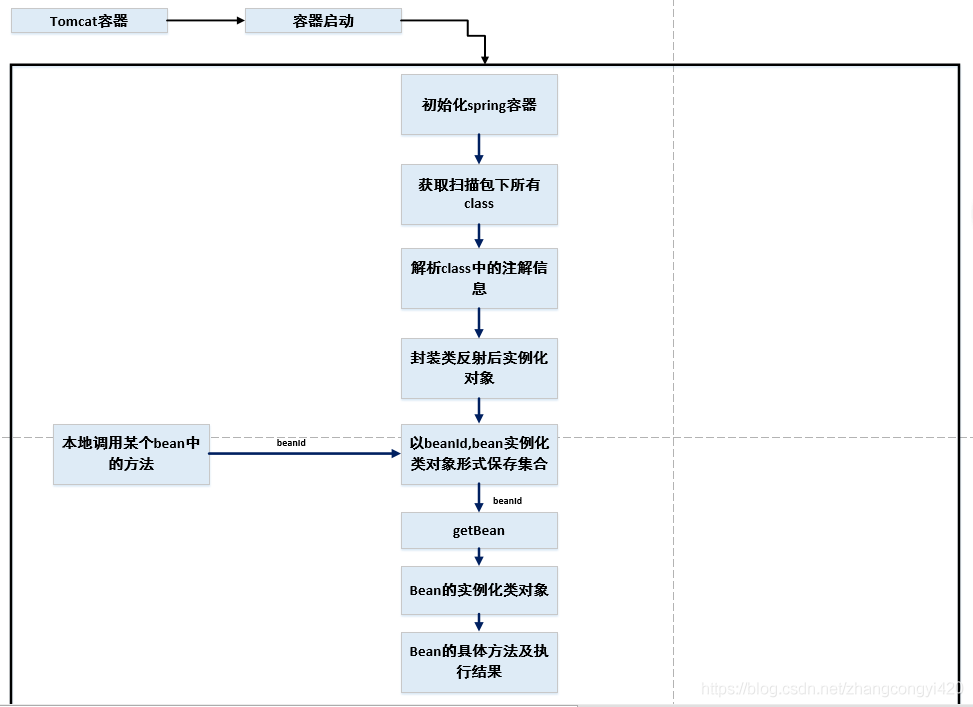
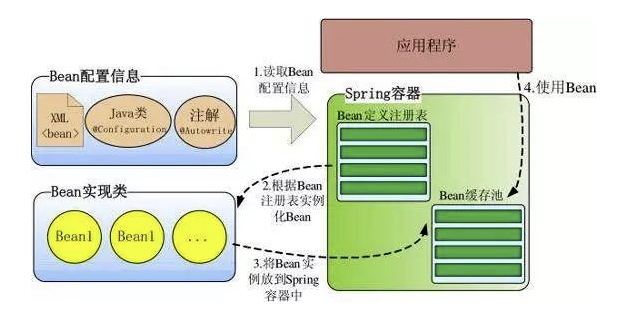

##  IOC能干什么

* 松耦合
	* 以前我们都是在类中实例其他依赖类从而获取其对象进行调用。有了IOC容器帮我们管理对象后，我们将和业务代码不相干的通用的服务类或者工具类交由IOC容器管理。实现`依赖倒置原则`和`松耦合`.

* 管理Bean
	* 将对象、文件以及项目的其他资源交由`IOC容器`管理，在你需要的时候想`IOC容器索要即可`


<font color=ff00aa>提出问题 ？</font>

1. 既然要管理Bean (对象)，IOC容器怎么进行数据初始化、实例化？
2. 我们程序中又该如何使用IOC容器中的Bean呢？
3. 对象之间的依赖关系如何处理？
4. 哪些类需要放到容器中？


<font color=ff00aa>回答问题 ：</font>

1. 数据初始化的操作需要用到`元数据`。下面会讲到。
2. 使用Spring 提供的两大`IOC容器接口`。下面会讲到。
3. 使用Spring提供的`依赖注入`。下面会讲到。
4. spring管理的一般都是逻辑类，是单例，是线程安全的。单例对象(**数据状态不会发生改变时用单例减轻CPU**)、通用类(非工具类)、多利对象注入单例对象注意Lookup否则引用的一直是一个对象

## 元数据

**元数据（Metadata）**又称中介数据、中继数据，为描述数据的数据（data about data），主要是描述数据属性（property）的信息。

`元数据`可以是：

1. 配置文件 xml 、properties、yaml
2. Java配置文件
3. 注解
4. 自动装配


## IOC容器接口

可以帮助我们更好地操控IOC容器。

1. `BeanFactory`：BeanFactory 提供了 Spring 容器的配置框架和基本功能。

	* `ClassPathResource`：指定类路径下的资源文件

	* `FileSystemResource`：指定项目根路径或本地磁盘路径下的资源文件。

2. `ApplicationContext`：BeanFactory 的子接口。它还扩展了其他一些接口，以支持更丰富的功能，如：国际化、访问资源、事件机制、更方便的支持 AOP、在 web 应用中指定应用层上下文等。

	* `ClassPathXmlApplicationContext`: 此类加载的是src下的spring配置文件

		```java
		BeanFactory beanFactory = new ClassPathXmlApplicationContext("classpath.xml");
		```

	* `FileSystemXmlApplicationContext`: 此类加载的是项目根目录即和src同级目录下的spring配置文件

		或者是本机磁盘上的spring配置文件

		```java
		BeanFactory beanFactory = new FileSystemXmlApplicationContext("fileSystemConfig.xml");
		```

	* `AnnotationConfigApplicationContext`:实现基于Java的配置类加载Spring的应用上下文.避免使用application.xml进行配置

	    ```java
	    @Configuration
	    @ComponentScan(basePackageClasses = {ServiceImpl.class, ServiceImpl2.class})
	    public class AnnotationScanConfig {
	    }
	    
	    @Test
	    public void test(){
	        AnnotationConfigApplicationContext ann = new AnnotationConfigApplicationContext(AnnotationScanConfig.class);
	        ServiceImpl serviceImpl = (ServiceImpl) ann.getBean("serviceImpl");
	        serviceImpl.sayHello("hellloooo");
	    }
	    ```
	
	    
	
	* `XmlWebApplicationContext`:在Web应用中使用Spring容器

> * ApplicationContext容器会在初始化容器时将bean所有对象一次性装配好，执行效率高，占内存
>
> * BeanFactory采用延时加载策略，即在getBean执行时才会初始化需要的对象
>
> > 实际开发中，更推荐使用 `ApplicationContext` 作为 IoC 容器，因为它的功能远多于 `FactoryBean`


## IOC容器工作流程

通过上面的学习我们大概了解到：

1. Spring IOC容器可以帮我们管理对象，我们需要时获取即可。
2. 我们可以通过`元数据`定义Bean 之间的依赖关系 使得A调用C不会出现空指针的情况。
3. 我们也可以通过`容器接口`来获取Bean，很好的解决了 “数据从哪来，又到哪去 ”

下面我们来继续探索 IOC又是如何工作的呢

1. 配置元数据 ：Bean装配

  > *   需要配置一些元数据来告诉 Spring，你希望容器如何工作，具体来说，就是如何去初始化、配置、管理 JavaBean 对象(这一过程也叫bean的装配)。而Spring是通过Resource接口来获取到用户自定义的配置文件或者注解

2. 实例化容器 

	> 定位资源文件并依据元数据实例化并装配Bean  把用户定义好的Bean表示成IoC容器内部的数据结构，而这个容器内部的数据结构就是BeanDefinition。IoC 容器根据 BeanDefinition 进行实例化、配置及组装 Bean。

3. 使用Bean


接下来，我们通过案例来对 ==四种元数据 方式==进行分别探讨


### 配置文件方式

0. 准备代码

	```java
	public class UserDao {
	    public List<User> getAllUsers(){
	        List list=new ArrayList<String>();
	        list.add("a");
	        list.add("b");
	        list.add("c");
	        return list;
	    }
	}
	```

	```java
	public class UserService{
	
	    private UserDao  userDao;
	
	    // 构造器注入
	    public UserService(UserDao userDao) {
	        this.userDao = userDao;
	    }
	
	    public List<User> userList(){
	        return userDao.getAllUsers();
	    }
	}
	```

1. 配置元数据--XML

	```xml
	<?xml version="1.0" encoding="UTF-8"?>
	<beans xmlns="http://www.springframework.org/schema/beans"
	       xmlns:xsi="http://www.w3.org/2001/XMLSchema-instance"
	       xsi:schemaLocation="http://www.springframework.org/schema/beans http://www.springframework.org/schema/beans/spring-beans.xsd">
	
	    <!--  UserService中依赖UserDao  因此IOC容器需要将UserDao注入到UserService   我们通过xml来进行配置来告诉IOC容器-->
	    <bean id="userService" class="com.shuai.springioc.service.UserService">
	        <constructor-arg ref="userDao"/>
	    </bean>
	    <bean id="userDao" class="com.shuai.springioc.dao.UserDao"/>
			 <import resource="resource2.xml" />
	</beans>
	```

	标签说明：

	- `<beans>` 是 Spring 配置文件的根节点。
	- `<bean>` 用来定义一个 JavaBean。`id` 属性是它的标识，在文件中必须唯一；`class` 属性是它关联的类。
	- `<alias>` 用来定义 Bean 的别名。
	- `<import>` 用来导入其他配置文件的 Bean 定义。这是为了加载多个配置文件，当然也可以把这些配置文件构造为一个数组（new String[] {“config1.xml”, config2.xml}）传给 `ApplicationContext` 实现类进行加载多个配置文件，那一个更适合由用户决定；这两种方式都是通过调用 Bean Definition Reader 读取 Bean 定义，内部实现没有任何区别。`<import>` 标签可以放在 `<beans>` 下的任何位置，没有顺序关系。

	> 组合 xml 配置文件 配置的 Bean 功能各不相同，都放在一个 xml 文件中，不便管理。 Java 设计模式讲究职责单一原则。配置其实也是如此，功能不同的 JavaBean 应该被组织在不同的 xml 文件中。然后使用 import 标签把它们统一导入。

	```XML
	<import resource="classpath:spring/applicationContext.xml"/>
	<import resource="/WEB-INF/spring/service.xml"/>
	```

2. 实例化容器 ：Bean装配

	```java
	ApplicationContext applicationContext = new ClassPathXmlApplicationContext("xml/xmlConfig.xml");
	```

3. 使用Bean

	```java
	UserService userService = (UserService) applicationContext.getBean("userService");
	System.out.println(userService.userList());
	```


> <font color=ff00aa>注意：</font>上面例子中存在：对象依赖。因此需要用到 `依赖注入-构造器注入`， 将UserDao注入到UserService  其中构造器注入只是注入的一中方式，下面会一一讲解。

### Java配置文件方式

0. 准备代码

	```java
	public class UserDao {
	    public List<User> getAllUsers(){
	        List list=new ArrayList<String>();
	        list.add("a");
	        list.add("b");
	        list.add("c");
	        return list;
	    }
	}
	```

	```java
	public class UserService{
	
	    private UserDao  userDao;
	
	    @Autowired
	    public UserService(UserDao userDao) {
	        this.userDao = userDao;
	    }
	
	    public List<User> userList(){
	        return userDao.getAllUsers();
	    }
	}
	```

1. 配置数据源--JAVA配置类

  ```java
  @Configuration  // 声明这是一个配置类，程序运行时初始化这个类，把 @Bean 注解的 bean 加载到 ioc 容器备用
  public class UserConfig {
      @Bean // 类似于<bean>  加载到 ioc 容器备用
      public UserDao studentDao() {
          return new UserDao();
      }
  
      @Bean // 类似于<bean>  加载到 ioc 容器备用  并将依赖类 UserDao传入
      public UserService userService(UserDao userDao) {
          return new UserService(userDao);
      }
  }
  
  
  @Configuration  
  public class CorsConfig implements WebMvcConfigurer {
  
      @Override
      public void addCorsMappings(CorsRegistry registry) {
          registry.addMapping("/**")
              .allowedOrigins("*")
              .allowCredentials(true)
              .allowedMethods("GET", "POST", "PUT", "DELETE", "OPTIONS")
              .maxAge(3600);
      }
  }
  
  
  @Configuration
  public class GulimallCorsConfiguration {
      @Bean
      public CorsWebFilter corsWebFilter(){
          UrlBasedCorsConfigurationSource source = new UrlBasedCorsConfigurationSource();
          CorsConfiguration corsConfiguration = new CorsConfiguration();
  
          //1. 配置跨域
          corsConfiguration.addAllowedHeader("*");
          corsConfiguration.addAllowedMethod("*");
          corsConfiguration.addAllowedOrigin("*");
          corsConfiguration.setAllowCredentials(true);
          source.registerCorsConfiguration("/**",corsConfiguration);
  
          return new CorsWebFilter(source);
      }
  }
  ```

2. 实例化容器

	```java
	AnnotationConfigApplicationContext applicationContext = new AnnotationConfigApplicationContext(UserConfig.class);
	```

	

3. 使用Bean

	```java
	UserService userService = (UserService) applicationContext.getBean("userService");
	        System.out.println(userService.userList());// 注意是 配置类中的方法名
	```


### 注解方式

`注解种类`

*   @Component

    定义Bean，该注解的 value 属性用于指定该 bean 的 id 值 

    *   @Repository 用于对 DAO 实现类进行注解
    *    @Service 用于对 Service 实现类进行注解
    *    @Controller 用于对 Controller 实现类进行注解

    >   之所以创建这三个功能与@Component 等效的注解，是为了以后对其进行功能上的扩展，使它们不再等效  

*   @Scope

    指定Bean作用域，默认singleton

*   @Value

    属性值注入，有setter方法也可以加到setter方法上，适用于属性为基本类型。

*   @Autowired 

    域属性上使用注解@Autowired ，该注解默认使用按==类型==自动装配 Bean 的方式。适用于属性为对象类型。

    @Autowired 还有一个属性 required，默认值为 true，表示当匹配失败后，会终止程序运行。若将其值设置为 false，则匹配失败，将被忽略，未匹配的属性值为 null。  

*   @Qualifier  

    和@Autowired类似，其为域属性按==名称==注入

*   @Resource  

    即可按==类型==注入属性值，也可按==名称==注入属性值

    >   此注解属于javax，导包
    >
    >   ```
    >   <dependency>
    >       <groupId>javax.annotation</groupId>
    >       <artifactId>jsr250-api</artifactId>
    >       <version>${annotation.version}</version>
    >   </dependency>
    >   ```

*   @PostConstruct

    Bean生命始

*   @PreDestroy

    Bean生命末


`流程`

1.  导包 Spring IOC依赖包和Spring Boot测试包

    ```xml
    <properties>
        <java.version>1.8</java.version>
        <project.build.sourceEncoding>UTF-8</project.build.sourceEncoding>
        <project.reporting.outputEncoding>UTF-8</project.reporting.outputEncoding>
        <!-- spring boot版本和spring版本保持一致，否则会有依赖冲突 -->
        <spring.version>4.2.1.RELEASE</spring.version>
        <spring-boot.version>2.3.0.RELEASE</spring-boot.version>
        <commons-logging.version>1.1.1</commons-logging.version>
        <log4j.version>1.2.16</log4j.version>
        <junit.version>4.12</junit.version>
        <lombok.version>1.18.8</lombok.version>
        <annotation.version>1.0</annotation.version>
    </properties>
    
    <modules>
        <module>Spring-IOC</module>
    </modules>
    
    <dependencyManagement>
        <dependencies>
            <!-- Spring IOC 依赖 -->
            <dependency>
                <groupId>org.springframework</groupId>
                <artifactId>spring-beans</artifactId>
                <version>${spring.version}</version>
            </dependency>
            <dependency>
                <groupId>org.springframework</groupId>
                <artifactId>spring-context</artifactId>
                <version>${spring.version}</version>
            </dependency>
            <dependency>
                <groupId>org.springframework</groupId>
                <artifactId>spring-core</artifactId>
                <version>${spring.version}</version>
            </dependency>
            <dependency>
                <groupId>org.springframework</groupId>
                <artifactId>spring-expression</artifactId>
                <version>${spring.version}</version>
            </dependency>
            <dependency>
                <groupId>org.springframework</groupId>
                <artifactId>spring-aop</artifactId>
                <version>${spring.version}</version>
            </dependency>
            <!--  @Resource依赖 -->
            <dependency>
                <groupId>javax.annotation</groupId>
                <artifactId>jsr250-api</artifactId>
                <version>${annotation.version}</version>
            </dependency>
            <!-- 日志 -->
            <dependency>
                <groupId>commons-logging</groupId>
                <artifactId>commons-logging</artifactId>
                <version>${commons-logging.version}</version>
            </dependency>
            <dependency>
                <groupId>log4j</groupId>
                <artifactId>log4j</artifactId>
                <version>${log4j.version}</version>
            </dependency>
            <!-- 测试 -->
            <dependency>
                <groupId>junit</groupId>
                <artifactId>junit</artifactId>
                <version>${junit.version}</version>
                <!--<scope>test</scope>-->
            </dependency>
            <!-- LOMBOK -->
            <dependency>
                <groupId>org.projectlombok</groupId>
                <artifactId>lombok</artifactId>
                <version>${lombok.version}</version>
            </dependency>
    
            <dependency>
                <groupId>org.springframework.boot</groupId>
                <artifactId>spring-boot-dependencies</artifactId>
                <version>${spring-boot.version}</version>
                <type>pom</type>
                <scope>import</scope>
            </dependency>
        </dependencies>
    </dependencyManagement>
    ```

2.  开启注解扫描器，用以在指定包中扫描注解

    *   在 xml中进行配置

        ```xml
        <!--  基于注解的DI  -->
        <context:component-scan base-package="com.shuai.springioc.annotation-DI"/>
        ```

    *   使用配置类进行扫描

        ```java
        @Configuration
        @ComponentScan(basePackageClasses = {ServiceImpl.class, ServiceImpl2.class})
        public class AnnotationScanConfig {
        }
        ## 如果为配置类进行扫描则在测试时候 @ContextConfiguration(classes=AnnotationScanConfig.class)
        ```

        

3.  定义Bean

    ```java
    @Scope("prototype")
    @Component("student")
    @Data
    @Log4j
    public class Student {
        @Value("张三")
        private String name;
        @Value("48")
        private Integer age;
        @Autowired(required = false) //按照School类型进行注入,School必须为Bean。required为false时，若School不是Bean则school属性为null
    //    @Qualifier("school")
    //    @Resource      //类型注入
    //    @Resource(name = "school")      //名称注入
        private School school;
    
        // todo Bean的生命始末
        @PostConstruct
        public void init(){
            System.out.println("bean初始化执行方法");
        }
    
        @PreDestroy
        public void destory(){
            System.out.println("销毁bean执行方法");
        }
    
        public void test(){
            System.out.println("测试方法 Student");
        }
    }
    ```

    ```java
    @Data
    @Component("school")
    public class School {
        @Value("华仁")
        private String name;
        @Value("fhds")
        private String address;
    }
    ```

4.  定义测试类 -- 在spring环境下进行测试

    ```java
    @RunWith(SpringRunner.class)//让测试运行于spring测试环境
    @ContextConfiguration(locations = "classpath:annotation.xml")//指定 Spring 配置文件所在的位置
    //@ContextConfiguration(classes=AnnotationScanConfig.class)  如果为配置类则使用
    @Slf4j
    public class TestCli {
        @Autowired
        private Student student;
    
        @Test
        public void testBean(){
            ApplicationContext applicationContext = new ClassPathXmlApplicationContext("application.xml");
            ServiceImpl iserver = (ServiceImpl)applicationContext.getBean("iserver");
            iserver.doSome();
        }
        @Test
        public void testAnnotation(){
            student.test();
            log.error(student.toString());
        }
    
    }
    ```

> 注：spring 中，先进行注解注入，然后才是 xml 注入，因此如果注入的目标相同，后者会覆盖前者。即xml配置文件级别高于注解

### 自动装配

0. 准备代码

	```java
	@Component  // 声明为spring 组件 让自动扫描发现
	public class UserDao {
	    public List<User> getAllUsers(){
	        List list=new ArrayList<String>();
	        list.add("a");
	        list.add("b");
	        list.add("c");
	        return list;
	    }
	}
	```

	```java
	@Component // 声明为spring 组件 让自动扫描发现
	public class UserService{
	
	    private UserDao  userDao;
	
	    @Autowired  构造器进行依赖注入
	    public UserService(UserDao userDao) {
	        this.userDao = userDao;
	    }
	
	    public List<User> userList(){
	        return userDao.getAllUsers();
	    }
	}
	```

1. 配置元数据

	```xml
	<?xml version="1.0" encoding="UTF-8"?>
	<beans xmlns="http://www.springframework.org/schema/beans"
	       xmlns:xsi="http://www.w3.org/2001/XMLSchema-instance"
	       xmlns:context="http://www.springframework.org/schema/context"
	       xsi:schemaLocation="http://www.springframework.org/schema/beans
	        http://www.springframework.org/schema/beans/spring-beans.xsd
	        http://www.springframework.org/schema/context
	        http://www.springframework.org/schema/context/spring-context-4.2.xsd">
	
	    <!-- base-package 指定扫描包 -->
	    <context:component-scan base-package="com.shuai.springioc.dao" />
	    <context:component-scan base-package="com.shuai.springioc.service" />
	
	</beans>
	```

2. 实例化容器

	```java
	AnnotationConfigApplicationContext applicationContext = new AnnotationConfigApplicationContext(UserConfig.class);
	```

	

3. 使用Bean

	```java
	UserService userService = (UserService) applicationContext.getBean("userService");
	        System.out.println(userService.userList());// 注意是 配置类中的方法名
	```


### IOC依赖注入

> 解决容器中Bean之间的依赖关系。

DI，是 Dependency Injection 的缩写，即依赖注入。依赖注入是 IoC 的最常见形式。依赖注入是手动或自动绑定的方式，无需依赖特定的容器或 API。

**容器全权负责组件的装配，它会把符合依赖关系的对象通过 JavaBean 属性或者构造函数传递给需要的对象**。

DI 是组件之间依赖关系由容器在运行期决定，形象的说，即由容器动态的将某个依赖关系注入到组件之中。依赖注入的目的并非为软件系统带来更多功能，而是为了提升组件重用的频率，并为系统搭建一个灵活、可扩展的平台。通过依赖注入机制，我们只需要通过简单的配置，而无需任何代码就可指定目标需要的资源，完成自身的业务逻辑，而不需要关心具体的资源来自何处，由谁实现。

理解 DI 的关键是：“谁依赖谁，为什么需要依赖，谁注入谁，注入了什么”，那我们来深入分析一下：

- **谁依赖于谁：**当然是应用程序依赖于 IoC 容器；
- **为什么需要依赖：**应用程序需要 IoC 容器来提供对象需要的外部资源；
- **谁注入谁：**很明显是 IoC 容器注入应用程序某个对象，应用程序依赖的对象；
- **注入了什么**：就是注入某个对象所需要的外部资源（包括对象、资源、常量数据）。


> 这里的应用程序指的是：
>
> 	1. 我们项目构建从IOC容器中获取的bean 
> 	2. IOC容器中的Bean


<font color=ff00aa>解疑</font>

1. 

	

	`Ioc容器`如何知道哪些是它管理的对象呢？这就需要`配置文件`，从示意图可以看出，当web容器启动的时候，`spring的全局bean的管理器会去xml配置文件中扫描的包下面获取到所有的类`，并根据你使用的注解，进行对应的封装，封装到`全局的bean容器`中进行管理，一旦容器初始化完毕，beanID以及bean实例化的类对象信息就全部存在了，现在我们需要在某个service里面调用另一个bean的某个方法的时候，我们只需要依赖注入进来另一个bean的Id即可，调用的时候，spring会去初始化完成的bean容器中获取即可，如果存在就把依赖的bean的类的实例化对象返回给你，你就可以调用依赖的bean的相关方法或属性等；


* 依赖查找： Dependency Lookup， DL，容器提供回调接口和上下文环境给组件，程序代码则需要提供具体的查找方式。比较典型的是依赖于 JNDI 系统的查找。

* 依赖注入： Dependency Injection， DI，程序代码不做定位查询，这些工作由容器自行完成。


IoC 依赖注入 API

-   根据 Bean 名称注入
-   根据 Bean 类型注入
-   注入容器内建 Bean 对象
-   注入非 Bean 对象
-   注入类型
    -   实时注入
    -   延迟注入


## Bean

spring的三个主要的部分，beans、context、core：

 在这三个主要部分中的核心是什么呢？那就非beans莫属了。spring的核心就是把我们平时使用的对象配置文件化，而配置文件中的对象就是被解析为beans来供开发人员来使用的。要说一个spring是一个舞台剧，那么beans就是一个个演员，没有演员怎么来的舞台剧？bean在spring中的重要性可想而知。而context的作用就是封装一下beans。如果没有context的话，我们每次使用spring的编程模式就一定要使用编程式使用spring的ioc容器了，而有了context只有，使用spring的ioc容器变得简单了许多，可以使用声明式的方式了。那么core的作用是什么呢？其实core就是一个工具类，如果我们想要将其改名为utils其实都是可以的。

### Bean 概述

一个 Spring 容器管理一个或多个 bean。这些 bean 根据你配置的元数据（比如 xml 形式）来创建。

Spring IoC 容器本身，并不能识别你配置的元数据。为此，要将这些配置信息转为 Spring 能识别的格式——BeanDefinition 对象。

#### 命名 Bean

指定 id 和 name 属性不是必须的。Spring 中，并非一定要指定 id 和 name 属性。实际上，Spring 会自动为其分配一个特殊名。如果你需要引用声明的 bean，这时你才需要一个标识。官方推荐驼峰命名法来命名。

#### 支持别名

可能存在这样的场景，不同系统中对于同一 bean 的命名方式不一样。 为了适配，Spring 支持 `<alias>` 为 bean 添加别名的功能。

```
<alias name="subsystemA-dataSource" alias="subsystemB-dataSource"/>
<alias name="subsystemA-dataSource" alias="myApp-dataSource" />
```

#### 实例化 Bean

**构造器方式**

```
<bean id="exampleBean" class="examples.ExampleBean"/>
```

### 依赖

依赖注入有两种主要方式：

-   构造器注入
-   Setter 注入

构造器注入有可能出现循环注入的错误。如：

```
class A {
	public A(B b){}
}
class B {
	public B(A a){}
}
```


### Bean作用域


| 作用域      | 描述                                                         |
| ----------- | ------------------------------------------------------------ |
| singleton   | 在spring IoC容器仅存在一个Bean实例，Bean以单例方式存在，bean作用域范围的默认值。 |
| prototype   | 每次从容器中调用Bean时，都返回一个新的实例，即每次调用getBean()时，相当于执行newXxxBean()。 |
| request     | 每次HTTP请求都会创建一个新的Bean，该作用域仅适用于web的Spring WebApplicationContext环境。 |
| session     | 同一个HTTP Session共享一个Bean，不同Session使用不同的Bean。该作用域仅适用于web的Spring WebApplicationContext环境。 |
| application | 限定一个Bean的作用域为`ServletContext`的生命周期。该作用域仅适用于web的Spring WebApplicationContext环境。 |


### Bean后处理器

>   Bean 后处理器是一种特殊的 Bean，**容器中所有的 Bean** 在初始化时，均会自动执行该类的两个方法。  

Spring后处理器，是Spring定义的**功能接口Interface**，包括两种：

-   **BeanPostProcessor**  对容器中的**Bean**进行后处理，对Bean进行额外的加强
-   **BeanFactoryPostProcessor**  对**Spring容器本身**进行后处理，增强容器的功能


`案例`

1.  处理器类

    ```java
    /* Bean后处理器 */
    public class MyBeanPostProcessor implements BeanPostProcessor {
        @Override
        public Object postProcessBeforeInitialization(Object bean, String beanName) throws BeansException {
            System.out.println("postProcessBeforeInitialization - -"+bean+"- - "+beanName);
            return bean;
        }
    
        @Override
        public Object postProcessAfterInitialization(Object bean, String beanName) throws BeansException {
            System.out.println("postProcessAfterInitialization - -"+bean+"- - "+beanName);
            return bean;
        }
    }
    ```

2.  xml中指定bean

    ```xml
    <bean class="com.shuai.springioc.processor.MyBeanPostProcessor"></bean>
    ```


`用途:`

​	可以为容器中的  所有Bean  进行方法增强。比如 三层架构中所有的 dao层 进行日志、sql查询语句输出。比如 自动代理生成器  为指定的Bean(通过beanName参数进行过滤)进行代理、方法增强等等


### Bean生命始末

>   可以为 **每个Bean** 定制初始化后的生命行为，也可以为 **每个Bean** 定制销毁前的生命行为。  


## 应用场景

*   Spring项目的基石，几乎所有的都要用到 IOC
*   系统服务都可以使用 ioc注入到容器，例如redis、MongoDB工具类 注入到容器当作系统服务使用(默认单例)
*   三层架构中services、dao、controller都是用了IOC


## 总结

1.  在spring出现之前，项目整体臃肿庞大，项目作为一个整体没有主次以及层级。对象的依赖以及管理繁琐。

2.  spring出现就是解决两个事 ①：将项目分层 ==系统服务==、==业务代码==  -- 解耦  ②：对象的创建和依赖管理交由Spring容器管理

3.  其中容器管理是由IOC来完成的，IOC分为对象装配（xml、配置类、注解等）、使用 （两大容器接口 beanfactory和ApplicationContext）

4.  bean的作用域以及生命始末和bean后处理器，控制反转和依赖注入

    

    


>   IOC 使用最优解：注解自动装配【包扫描】