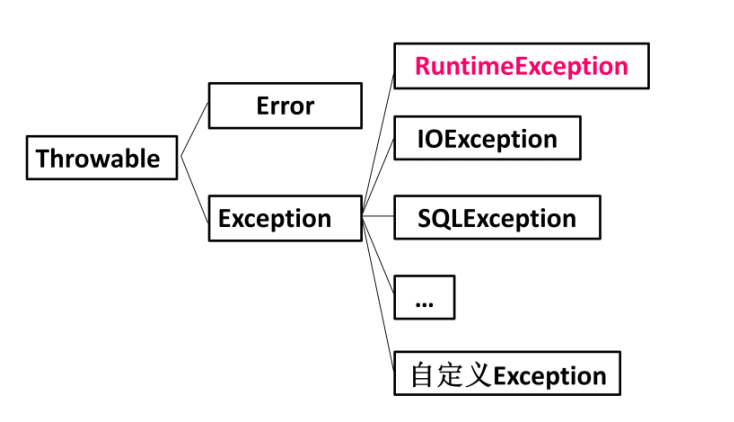
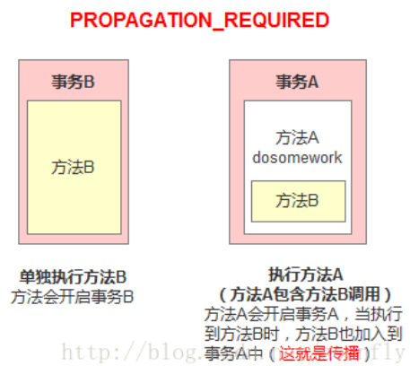
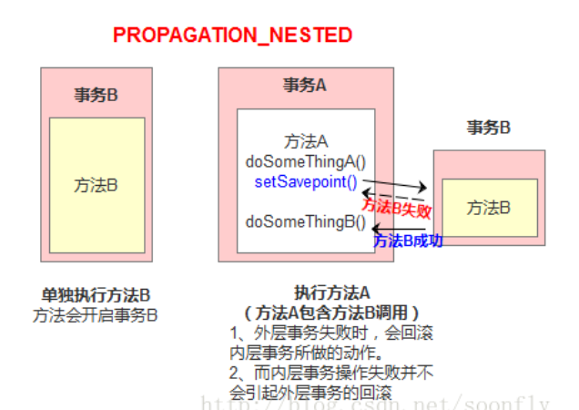
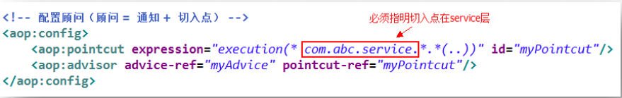

## 简介

数据源、数据库连接池、JPA、jdbc、jdbcTemplate、Hibernate、Mybatis、Mybatis-Plus、SpringBoot-JPA  参考 ：https://github.com/YunaiV/SpringBoot-Labs#spring-boot-%E4%B8%93%E6%A0%8F


## JdbcTemplate、Mybatis、SpringBoot JPA、Mybatis-Plus对比

spring boot JdbcTemplate，使用参考 ： https://www.iocoder.cn/Spring-Boot/JdbcTemplate/?github

`mybatis流程`

1.  定义实体类
2.  定义server层
3.  定义dao层
4.  定义映射xml文件【用来关联dao层方法以及关联对应的SQL语句】

`优点`

*   可以完全独立spring【注解开发用到aop】
*   只要SQL支持，他可以指定很复杂的SQL操作
*   xml中定义SQL 直观明了

`缺点`

*   最简单的查询任然需要定义xml文件【虽然有逆向工程】
*   每个与数据库操作都需要手撸SQL语句不够面向对象

`线程安全问题`

*   纯mybatis数据操作【就是sqlSession 连接  操作  释放 那一套】 是线程不安全的
*   但是spring 整合 mybatis后的 **mybatis-spring.jar**中的**SqlSessionTemplate** 是线程安全的 【以后再深究】

`事务问题`

*   默认开启事务，即关闭了自动提交

`jdbcTemplate流程`

1.  定义实体类
2.  定义server层
3.  定义dao层【其实现类继承 jdbcTemplate提供的 JdbcDaoSupport父类，可以使用其中的jdbcTemplate属性进行sql操作，任然需要写SQL语句】

`线程安全问题`

*   是线程安全的  【以后深究，先记着】

`事务问题`

*   默认是不开启事务的，执行后自动提交持久化

`mybatis和jdbcTemplate比较`

*   都差不多，都需要写SQL，jdbcTemplate封装了xml文件
*   jdbcTemplate 属于spring 生态，高度利用了spring IOC
*   jdbcTemplate 操作太原始，


## JdbcTemplate使用流程

>   JDBC 模板对象是多例的。

1.  导入包

    ```xml
    <properties>
        <java.version>1.8</java.version>
        <project.build.sourceEncoding>UTF-8</project.build.sourceEncoding>
        <project.reporting.outputEncoding>UTF-8</project.reporting.outputEncoding>
        <spring.version>4.2.1.RELEASE</spring.version>
        <cglib.version>3.3.0</cglib.version>
        <aspecgj.version>1.9.4</aspecgj.version>
        <c3p0.version>0.9.5.2</c3p0.version>
        <jdbc.version>8.0.21</jdbc.version>
    </properties>
    
    <dependencyManagement>
        <dependencies>
            <!-- Spring IOC 依赖 -->
            <dependency>
                <groupId>org.springframework</groupId>
                <artifactId>spring-beans</artifactId>
                <version>${spring.version}</version>
            </dependency>
            <dependency>
                <groupId>org.springframework</groupId>
                <artifactId>spring-context</artifactId>
                <version>${spring.version}</version>
            </dependency>
            <dependency>
                <groupId>org.springframework</groupId>
                <artifactId>spring-core</artifactId>
                <version>${spring.version}</version>
            </dependency>
            <dependency>
                <groupId>org.springframework</groupId>
                <artifactId>spring-expression</artifactId>
                <version>${spring.version}</version>
            </dependency>
            <dependency>
                <groupId>org.springframework</groupId>
                <artifactId>spring-aop</artifactId>
                <version>${spring.version}</version>
            </dependency>
            <!--  @Resource依赖 -->
            <dependency>
                <groupId>javax.annotation</groupId>
                <artifactId>jsr250-api</artifactId>
                <version>${annotation.version}</version>
            </dependency>
            <!-- 日志 -->
            <dependency>
                <groupId>commons-logging</groupId>
                <artifactId>commons-logging</artifactId>
                <version>${commons-logging.version}</version>
            </dependency>
            <dependency>
                <groupId>log4j</groupId>
                <artifactId>log4j</artifactId>
                <version>${log4j.version}</version>
            </dependency>
            <!-- 测试 -->
            <dependency>
                <groupId>junit</groupId>
                <artifactId>junit</artifactId>
                <version>${junit.version}</version>
                <!--<scope>test</scope>-->
            </dependency>
            <!-- LOMBOK -->
            <dependency>
                <groupId>org.projectlombok</groupId>
                <artifactId>lombok</artifactId>
                <version>${lombok.version}</version>
            </dependency>
            <!-- 动态代理cglib -->
            <dependency>
                <groupId>cglib</groupId>
                <artifactId>cglib</artifactId>
                <version>${cglib.version}</version>
            </dependency>
    
            <!-- AspecgJ -->
            <dependency>
                <groupId>org.aspectj</groupId>
                <artifactId>aspectjweaver</artifactId>
                <version>${aspecgj.version}</version>
            </dependency>
            <dependency>
                <groupId>org.springframework</groupId>
                <artifactId>spring-aspects</artifactId>
                <version>${spring.version}</version>
            </dependency>
    
            <!-- 数据源 -->
            <dependency>
                <groupId>com.mchange</groupId>
                <artifactId>c3p0</artifactId>
                <version>${c3p0.version}</version>
            </dependency>
    
            <!-- template -->
            <dependency>
                <groupId>org.springframework</groupId>
                <artifactId>spring-jdbc</artifactId>
                <version>${spring.version}</version>
            </dependency>
            <!-- spring 事务 -->
            <dependency>
                <groupId>org.springframework</groupId>
                <artifactId>spring-tx</artifactId>
                <version>${spring.version}</version>
            </dependency>
    
            <!-- jdbc  -->
            <dependency>
                <groupId>mysql</groupId>
                <artifactId>mysql-connector-java</artifactId>
                <version>${jdbc.version}</version>
            </dependency>
        </dependencies>
    </dependencyManagement>
    ```

2.  实体类

    ```java
    @Data
    @AllArgsConstructor
    @NoArgsConstructor
    @RequiredArgsConstructor
    public class User {
        private int id;
        @NotNull
        private String name;
        @NotNull
        private Integer age;
    }
    ```

3.  创表

    ```sql
    CREATE TABLE `dao_user` (
      `id` int(36) NOT NULL AUTO_INCREMENT,
      `name` varchar(255) DEFAULT NULL,
      `age` int(4) DEFAULT NULL,
      PRIMARY KEY (`id`)
    ) ENGINE=InnoDB AUTO_INCREMENT=4 DEFAULT CHARSET=utf8mb4 COLLATE=utf8mb4_0900_ai_ci;
    ```

4.  servcie 层 

    ```java
    public interface IUserServer {
        void insert(User user);
        void delete(User user);
        void update(User user);
        List<Map<String, Object>> list();
    }
    public class UserServerImpl implements IUserServer {
    
        @Autowired
        private IUserDao iUserDao;
    
        @Override
        public void insert(User user) {
            iUserDao.insert(user);
        }
    
        @Override
        public void delete(User user) {
            iUserDao.delete(user);
        }
    
        @Override
        public void update(User user) {
            iUserDao.update(user);
        }
    
        @Override
        public List<Map<String, Object>> list() {
            return iUserDao.list();
        }
    }
    ```

5.  dao 层 : 使用模板对象查询 省掉了xml文件

    ```java
    public interface IUserDao {
        void insert(User user);
        void delete(User user);
        void update(User user);
        List<Map<String, Object>> list();
    }
    public class UserDaoImpl extends JdbcDaoSupport implements IUserDao {
        @Override
        public void insert(User user) {
            String sql = "insert into dao_user(name,age) values(?,?)";
            this.getJdbcTemplate().update(sql,user.getName(),user.getAge());
        }
    
        @Override
        public void delete(User user) {
            String sql = "delete from dao_user where id =?";
            this.getJdbcTemplate().update(sql,user.getId());
        }
    
        @Override
        public void update(User user) {
        }
    
        @Override
        public List<Map<String, Object>> list() {
            String sql = "select * from dao_user";
            List<Map<String, Object>> maps = this.getJdbcTemplate().queryForList(sql);
            return maps;
        }
    }
    ```

6.  数据库配置信息  及  配置文件

    ```properties
    # src/main/resources/dao/jdbc.properties
    jdbc.driver=com.mysql.cj.jdbc.Driver
    jdbc.url=jdbc:mysql://127.0.0.1:3306/spring-dao?useSSL=false&useUnicode=true&characterEncoding=UTF-8&allowPublicKeyRetrieval=true&serverTimezone=UTC
    jdbc.user=root
    jdbc.password=1314
    ```

    ```xml
    <beans xmlns="http://www.springframework.org/schema/beans"
           xmlns:context="http://www.springframework.org/schema/context"
           xmlns:xsi="http://www.w3.org/2001/XMLSchema-instance"
           xmlns:aop="http://www.springframework.org/schema/aop"
           xsi:schemaLocation="
            http://www.springframework.org/schema/beans
            http://www.springframework.org/schema/beans/spring-beans-4.1.xsd
            http://www.springframework.org/schema/context
            http://www.springframework.org/schema/context/spring-context-4.1.xsd"
    >
    
    
            <!--  注册属性文件 -->
            <context:property-placeholder location="classpath:/dao/jdbc.properties"/>
    
            <!-- 使用值：配置c3p0 -->
            <bean id="c3p0DataSource" class="com.mchange.v2.c3p0.ComboPooledDataSource">
                <property name="driverClass" value="${jdbc.driver}"/>
                <property name="jdbcUrl" value="${jdbc.url}"/>
                <property name="user" value="${jdbc.user}"/>
                <property name="password" value="${jdbc.password}"/>
            </bean>
    
            <!-- 配置jdbc模板 -->
            <bean id="myjdbcTemplate" class="org.springframework.jdbc.core.JdbcTemplate">
                <property name="dataSource" ref="c3p0DataSource"/>
            </bean>
    
    
            <bean id="userServerImpl" class="com.shuai.springdao.jdbctemplate.service.impl.UserServerImpl"></bean>
    
    
            <!-- 配置dao类 ：继承JdbcTemplate 使用其提供的方法 -->
            <bean id="userDaoImpl" class="com.shuai.springdao.jdbctemplate.dao.impl.UserDaoImpl">
                <property name="jdbcTemplate" ref="myjdbcTemplate"></property>
                <property name="dataSource" ref="c3p0DataSource"/>
            </bean>
    
    </beans>
    ```

7.  测试

    ```java
    @Slf4j
    @RunWith(SpringRunner.class)
    @ContextConfiguration(locations = "classpath:dao/spring-dao.xml")
    public class Client {
        @Autowired
        UserServerImpl userServer;
    
        @Test
        public void test(){
            ApplicationContext context = new ClassPathXmlApplicationContext("dao/spring-dao.xml");
    
    
             //检测数据源配置是否成功
            DataSource ds = (DataSource) context.getBean("c3p0DataSource");
            System.out.println(ds);
            //检测JdbcTemplate配置是否成功
            JdbcTemplate jt = (JdbcTemplate) context.getBean("myjdbcTemplate");
            System.out.println(jt);
    
            //测试服务类运行
    //        IUserDao userServer = (IUserDao) context.getBean("userDaoImpl");
    //        System.out.println(userServer.list());
            log.error(userServer.list().toString());
    
        }
    }
    
    ```

    


## 事务

`介绍`

​	事务偏向安全管理级别，用来确保一个**工作单元全部执行**。比如我们去银行取钱  可以拆分为 1. 你账户余额扣除1000元，2. 然后ATM机吐出1000元。

只有这两个步骤全部执行，则你取钱成功，只要任意一个失败则回滚到你取钱前的状态。更形象的比喻为 转账。


`特性`

-   原子性（Atomicity）：事务是一个原子操作，由一系列动作组成。事务的原子性确保动作要么全部完成，要么完全不起作用。
-   一致性（Consistency）：一旦事务完成（不管成功还是失败），系统必须确保它所建模的业务处于一致的状态，而不会是部分完成部分失败。在现实中的数据不应该被破坏。
-   隔离性（Isolation）：可能有许多事务会同时处理相同的数据，因此每个事务都应该与其他事务隔离开来，防止数据损坏【一般出现在处理并发的时候】。
-   持久性（Durability）：一旦事务完成，无论发生什么系统错误，它的结果都不应该受到影响，这样就能从任何系统崩溃中恢复过来。通常情况下，事务的结果被写到持久化存储器中。


`事务管理器接口 PlatformTransactionManager `

​	其主要用于完成事务的提交、回滚，及获取事务的状态信息。

**两个常用的实现类：**

*   DataSourceTransactionManager：使用 JDBC 或 iBatis 进行持久化数据时使用。
*    HibernateTransactionManager：使用 Hibernate 进行持久化数据时使用。  

**回滚方式：**

*   发生运行时异常时回滚
*   发生受查异常时提交。 不过，对于受查异常，程序员也可以手工设置其回滚方式。  

**异常与错误[Error]**



*   Throwable 类是 Java 语言中所有错误或异常的超类。  
*   Error 是程序在运行过程中出现的无法处理的错误，比如 OutOfMemoryError、ThreadDeath、 NoSuchMethodError 等。当这些错误发生时，程序是无法处理（捕获或抛出）的， JVM 一般会终止线程。  
*   Exception 是编译或者运行时出现的一类错误，需要程序员去处理
*   Exception 分为 运行时异常    和     受查异常也叫编译异常
*   运行时异常， 是 RuntimeException 类或其子类 ， 即只有在运行时才出现的异常。  
*   受查异常，也叫编译时异常，即在代码编写时要求必须捕获或抛出的异常，若不处理，则无法通过编译。如 SQLException， ClassNotFoundException， IOException 等都属于受查异常。  
*   程序员在定义异常时，只要未明确声明定义的为 RuntimeException 的子类，那么定义的就是受查异常。  


`事务定义接口 TransactionDefinition`

​	事务定义接口 TransactionDefinition 中定义了事务描述相关的三类常量： 事务隔离级别、事务传播行为、事务默认超时时限， 及一种控制并发执行的事务对数据操作的规则。  

​	

**事务隔离级别** 【针对 特性：隔离性即并发处理事务】

​	在标准SQL（SQL 92）中定义了四种事务的隔离级别。这些常量均是以 ISOLATION_开头。即形如 ISOLATION_XXX。

*   DEFAULT： 采用 DB 默认的事务隔离级别。 MySql 的默认为 REPEATABLE_READ； Oracle默认为 READ_COMMITTED。
*   READ_UNCOMMITTED： 读未提交。 未解决任何并发问题。引起的问题包括：脏读，不可重复读和幻读。
*   READ_COMMITTED： 读已提交。解决脏读，存在不可重复读与幻读。引发的问题包括：不可重复读和幻读
*   REPEATABLE_READ： 可重复读。解决脏读、不可重复读，存在幻读。引发的问题包括：幻读
*   SERIALIZABLE： 串行化。不存在并发问题。  这种隔离级别下，可以避免脏读、不可重复读和幻读等问题，但是由于事务一个一个执行，所以性能就比较低。

>   其中隔离级别最宽松的是读未提交，最严格的是可串行化，当事务隔离级别较低时会引起一些数据问题（后文会讲解），当事务隔离级别设置为可串行化的时候，也就意味着事务的执行就类似于串行了，这个时候性能就会受到影响，所以在实际的业务中，是根据自己的需求来设置合理的事务的隔离级别，在性能和数据安全的两者之间找一个平衡点


**并发事务带来的问题**

>   事务隔离级别就是用来解决  事务 的隔离性  。即多个事务并发的问题

*   脏读

    脏读其实就是读到了其他事务回滚前的未提交的脏数据。简单来讲，两个事务 A，B同时操作某一个数据，A操作后提交保存至数据库，这个时候B读到了A修改后的值，但是A发生事务回滚，修改的值又恢复原样。

*   不可重复读

    不可重复读就是在一个事务多次相同的读取可能会读出不同的数据。

*   幻读

    其他事务在一个尚未提交的当前事务的读取的行的范围中插入新行或删除现有行，会对当前事务的对数据的读取产生幻象。

    >   脏读是读取到了提交后的数据，并且改数据之后发生回滚。即读取到了不存在的数据
    >
    >   幻读是读取到了不是最新的数据


**事务传播行为**

​	指的就是当一个事务方法被另一个事务方法调用时，这个事务方法应该如何进行。 例如：methodA事务方法调用methodB事务方法时，methodB是继续在调用者methodA的事务中运行呢，还是为自己开启一个新事务运行，这就是由methodB的事务传播行为决定的。定义了7个事务传播行为

*   REQUIRED： 指定的方法必须在事务内执行。若当前存在事务，就加入到当前事务中；

    

    ```java
    @Transactional(propagation = Propagation.REQUIRED)
    public void methodA() {
     methodB();
    // do something
    }
     
    @Transactional(propagation = Propagation.REQUIRED)
    public void methodB() {
        // do something
    }
    ```

    >   单独调用methodB方法时，因为当前上下文不存在事务，所以会开启一个新的事务。 
    >   调用methodA方法时，因为当前上下文不存在事务，所以会开启一个新的事务。当执行到methodB时，methodB发现当前上下文有事务，因此就加入到当前事务中来。

*   SUPPORTS： 指定的方法支持当前事务，但若当前没有事务，也可以以非事务方式执行。

    ```java
    @Transactional(propagation = Propagation.REQUIRED)
    public void methodA() {
     methodB();
    // do something
    }
     
    // 事务属性为SUPPORTS
    @Transactional(propagation = Propagation.SUPPORTS)
    public void methodB() {
        // do something
    }
    ```

    >   单纯的调用methodB时，methodB方法是非事务的执行的。当调用methdA时,methodB则加入了methodA的事务中,事务地执行。

*   MANDATORY： 指定的方法必须在当前事务内执行，若当前没有事务，则直接抛出异常。

    ```java
    @Transactional(propagation = Propagation.REQUIRED)
    public void methodA() {
     methodB();
    // do something
    }
     
    // 事务属性为MANDATORY
    @Transactional(propagation = Propagation.MANDATORY)
    public void methodB() {
        // do something
    }
    ```

    >   当单独调用methodB时，因为当前没有一个活动的事务，则会抛出异常throw new IllegalTransactionStateException(“Transaction propagation ‘mandatory’ but no existing transaction found”);当调用methodA时，methodB则加入到methodA的事务中，事务地执行。

*   REQUIRES_NEW： 总是新建一个事务，若当前存在事务，就将当前事务挂起，直到新事务执行完毕。需要使用 JtaTransactionManager作为事务管理器。 

    

    ```java
    @Transactional(propagation = Propagation.REQUIRED)
    public void methodA() {
    doSomeThingA();
    methodB();
    doSomeThingB();
    // do something else
    }
     
     
    // 事务属性为REQUIRES_NEW
    @Transactional(propagation = Propagation.REQUIRES_NEW)
    public void methodB() {
        // do something
    }
    ```

    **当调用方法A时，相当于如下代码**

    ```java
    main(){
        TransactionManager tm = null;
        try{
            //获得一个JTA事务管理器
            tm = getTransactionManager();
            tm.begin();//开启一个新的事务
            Transaction ts1 = tm.getTransaction();
            doSomeThing();
            tm.suspend();//挂起当前事务
            try{
                tm.begin();//重新开启第二个事务
                Transaction ts2 = tm.getTransaction();
                methodB();
                ts2.commit();//提交第二个事务
            } Catch(RunTimeException ex) {
                ts2.rollback();//回滚第二个事务
            } finally {
                //释放资源
            }
            //methodB执行完后，恢复第一个事务
            tm.resume(ts1);
            doSomeThingB();
            ts1.commit();//提交第一个事务
        } catch(RunTimeException ex) {
            ts1.rollback();//回滚第一个事务
        } finally {
            //释放资源
        }
    }
    ```

    >   在这里，我把ts1称为外层事务，ts2称为内层事务。从上面的代码可以看出，ts2与ts1是两个独立的事务，互不相干。Ts2是否成功并不依赖于 ts1。如果methodA方法在调用methodB方法后的doSomeThingB方法失败了，而methodB方法所做的结果依然被提交。而除了 methodB之外的其它代码导致的结果却被回滚了

*   NOT_SUPPORTED： 总是非事务地执行，并挂起任何存在的事务。使用PROPAGATION_NOT_SUPPORTED,也需要使用JtaTransactionManager作为事务管理器。 

    

    

*   NEVER： 指定的方法不能在事务环境下执行，若当前存在事务，就直接抛出异常。  即如果在一个事务方法中调用指定NEVER事务类型的方法则会报错

*   NESTED： 指定的方法必须在事务内执行。若当前存在事务，则在嵌套事务内执行；若当前没有事务，则创建一个新事务。  

    in


**事务默认超时时限**

​	常量 TIMEOUT_DEFAULT 定义了事务底层默认的超时时限，及不支持事务超时时限设置的 none 值。注意，事务的超时时限起作用的条件比较多，且超时的时间计算点较复杂。所以，该值一般就使用默认值即可  


## 事务操作流程 - xml方式

>   银行中的A用户购买了B的股票

1.  创表

    ```sql
    CREATE TABLE `account` (
      `id` int(11) NOT NULL AUTO_INCREMENT,
      `name` varchar(255) DEFAULT NULL,
      `balance` varchar(255) DEFAULT NULL,
      PRIMARY KEY (`id`)
    ) ENGINE=InnoDB DEFAULT CHARSET=utf8mb4 COLLATE=utf8mb4_0900_ai_ci;
    ```

    ```sql
    CREATE TABLE `stock` (
      `id` int(11) NOT NULL AUTO_INCREMENT,
      `name` varchar(255) DEFAULT NULL,
      `count` int(11) DEFAULT NULL,
      PRIMARY KEY (`id`)
    ) ENGINE=InnoDB DEFAULT CHARSET=utf8mb4 COLLATE=utf8mb4_0900_ai_ci;
    ```

2.  实体类

    ```java
    @Data
    @AllArgsConstructor
    @NoArgsConstructor
    @RequiredArgsConstructor
    public class Account {
        private int id;
        @NotNull
        private String name;
        @NotNull
        private int balance;
    }
    ```

    ```java
    @Data
    @AllArgsConstructor
    @NoArgsConstructor
    @RequiredArgsConstructor
    public class Stock {
        private int id;
        @NotNull
        private String name;
        @NotNull
        private int count;
    }
    ```

    ```java
    public class StockException extends Exception{
        public StockException(String message) {
            super(message);
        }
        public StockException(){
            super();
        }
    }
    ```

3.  dao 层

    ```java
    public interface IStockDao {
        void insertStock(Stock stock);
        Stock selectStock(String name);
        void updateStock(Stock stock);
    }
    ```

    ```java
    public interface IAccountDao {
        void insertAccount(Account account);
        Account selectAccount(String name);
        void updateAccount(Account account);
    }
    ```

    ```java
    public class StockDaoImpl extends JdbcDaoSupport implements IStockDao {
        @Override
        public void insertStock(Stock stock) {
            String sql = "insert into stock(name,count) values(?,?)";
            this.getJdbcTemplate().update(sql,stock.getName(),stock.getCount());
        }
    
        @Override
        public Stock selectStock(String name) {
            String sql = "select * from stock where name =?";
            Stock stock = this.getJdbcTemplate().queryForObject(sql, Stock.class,name);
            return stock;
        }
    
        @Override
        public void updateStock(Stock stock) {
            String sql = "update stock set count=? where name =?";
            this.getJdbcTemplate().update(sql,stock.getCount(),stock.getName());
        }
    }
    ```

    ```java
    public class AccountDaoImpl extends JdbcDaoSupport implements IAccountDao {
        @Override
        public void insertAccount(Account account) {
            String sql = "insert into account(name,balance) values(?,?)";
            this.getJdbcTemplate().update(sql,account.getName(),account.getBalance());
        }
    
        @Override
        public Account selectAccount(String name) {
            String sql = "select * from account where name =?";
            Account account = this.getJdbcTemplate().queryForObject(sql, Account.class,name);
            return account;
        }
    
        @Override
        public void updateAccount(Account account) {
            String sql = "update account set balance=? where name =?";
            this.getJdbcTemplate().update(sql,account.getBalance(),account.getName());
        }
    }
    ```

4.  service 层 【定义接口】

    ```java
    /*
     * @Author No1.shuai
     * @Description //TODO 定义一个事务 buyStock【操作多个数据的集合】  事务建议放在server层，方便业务控制，否则放在dao层会配置很多的事务传播行为
     *                银行中的A用户购买了B的股票
     * @Date 14:22 14:22
     **/
    public interface IStockProcessService {
        void openAccout(Account account);
        void openStock(Stock stock);
        void buyStock(String aname,String sname,int money,int count) throws StockException;
        Account findAccount(String name);
        Stock findStock(String name);
    }
    ```

    ```java
    public class StockProcessServiceImpl implements IStockProcessService {
        private IAccountDao accountDao;
        private IStockDao stockDao;
    
        public void setAccountDao(IAccountDao accountDao) {
            this.accountDao = accountDao;
        }
    
        public void setStockDao(IStockDao stockDao) {
            this.stockDao = stockDao;
        }
    
        @Override
        public void openAccout(Account account) {
            accountDao.insertAccount(account);
        }
    
        @Override
        public void openStock(Stock stock) {
            stockDao.insertStock(stock);
        }
    
        @Override
        public void buyStock(String aname, String sname, int money, int count) throws StockException {
            accountDao.updateAccount(new Account(aname,money));
            /* 测试事务 */
            if (true){
                throw new StockException("自定义异常抛出！！");
            }
    
            stockDao.updateStock(new Stock(sname,count));
        }
    
        @Override
        public Account findAccount(String name) {
            return accountDao.selectAccount(name);
        }
    
        @Override
        public Stock findStock(String name) {
            return stockDao.selectStock(name);
        }
    }
    ```

5.  定义配置文件

    ```xml
    <beans xmlns="http://www.springframework.org/schema/beans"
           xmlns:xsi="http://www.w3.org/2001/XMLSchema-instance"
           xmlns:context="http://www.springframework.org/schema/context"
           xmlns:aop="http://www.springframework.org/schema/aop"
           xmlns:tx="http://www.springframework.org/schema/tx"
           xsi:schemaLocation="
                http://www.springframework.org/schema/beans
                http://www.springframework.org/schema/beans/spring-beans.xsd
                http://www.springframework.org/schema/context
                http://www.springframework.org/schema/context/spring-context.xsd
                http://www.springframework.org/schema/tx
                http://www.springframework.org/schema/tx/spring-tx.xsd
                http://www.springframework.org/schema/aop
                http://www.springframework.org/schema/aop/spring-aop.xsd">
    
            <!--  注册属性文件 -->
            <context:property-placeholder location="classpath:/dao/jdbc.properties"/>
    
            <!-- 使用值：配置c3p0 -->
            <bean id="c3p0DataSource" class="com.mchange.v2.c3p0.ComboPooledDataSource">
                <property name="driverClass" value="${jdbc.driver}"/>
                <property name="jdbcUrl" value="${jdbc.url}"/>
                <property name="user" value="${jdbc.user}"/>
                <property name="password" value="${jdbc.password}"/>
            </bean>
    
            <!-- 配置jdbc模板 -->
            <bean id="myjdbcTemplate" class="org.springframework.jdbc.core.JdbcTemplate">
                <property name="dataSource" ref="c3p0DataSource"/>
            </bean>
    
    
            <!-- 配置 dao -->
            <bean id="accountDao" class="com.shuai.springdao.affair.dao.impl.AccountDaoImpl">
                <property name="dataSource" ref="c3p0DataSource"/>
            </bean>
            <bean id="stockDao" class="com.shuai.springdao.affair.dao.impl.StockDaoImpl">
                <property name="dataSource" ref="c3p0DataSource"/>
            </bean>
    
    
            <!-- 配置 service -->
            <bean id="stockProcessServiceImpl" class="com.shuai.springdao.affair.service.impl.StockProcessServiceImpl">
                <property name="accountDao" ref="accountDao"/>
                <property name="stockDao" ref="stockDao"/>
            </bean>
    
            <!-- 配置 事务管理器 -->
            <!--事务管理工厂
            TransactionProxyFactoryBean，该类需要初始化如下一些属性：
            （1） transactionManager：事务管理器
            （2） target：目标对象，即 Service 实现类对象
            （3） transactionAttributes：事务属性设置
            对于 XML 配置代理方式实现事务管理时， 受查异常的回滚方式，
            程序员可以通过以下 方式进行设置：通过“-异常”方式，可使发生指定的异常时事务回滚；通过“+异常”方式， 可使发生指定的异常时事务提交。-->
            <bean id="myTransactionManager" class="org.springframework.jdbc.datasource.DataSourceTransactionManager">
                <property name="dataSource" ref="c3p0DataSource"/>
            </bean>
    
            <!-- 给目标对象 添加切面 【事务代理】 -->
            <bean id="myServiceProxy" class="org.springframework.transaction.interceptor.TransactionProxyFactoryBean">
                <property name="transactionManager" ref="myTransactionManager"/>
                <property name="target" ref="stockProcessServiceImpl"/>
                <property name="transactionAttributes">
                    <props>
                        <prop key="open*">PROPAGATION_REQUIRED</prop>
                        <prop key="find*">PROPAGATION_SUPPORTS,readOnly</prop>
                        <prop key="buyStock">PROPAGATION_REQUIRED,-StockException</prop>
                    </props>
                </property>
            </bean>
    
    </beans>
    ```

6.  测试

    ```java
    
    @Slf4j
    @RunWith(SpringRunner.class)
    @ContextConfiguration("classpath:dao/affair.xml")
    public class Client {
    
        private IStockProcessService iStockProcessService;
    
        @Before
        public void init(){
            ApplicationContext context = new ClassPathXmlApplicationContext("dao/affair.xml");
            iStockProcessService = (IStockProcessService) context.getBean("myServiceProxy");
        }
        @Test
        public void noAffair(){
            iStockProcessService.openAccout(new Account("account1",11));
            iStockProcessService.openStock(new Stock("stock1",11));
        }
        /*
         * @Author No1.shuai
         * @Description //TODO 事务 测试
         * @Date 15:57 15:57
         **/
        @Test
        public void yesAffair(){
            Account account = new Account("account1",10);
            Stock stock= new Stock("stock1",12);
            try {
                iStockProcessService.buyStock(account.getName(),stock.getName(),account.getBalance(),stock.getCount());
            } catch (StockException e) {
                log.error(e.getLocalizedMessage());
            }
        }
    }
    ```


## 事务操作流程 - 注解方式

>   配置文件方式始终存在一个问题，即一个目标类就需要一个  事务代理

通过@Transactional 注解方式，也可将事务织入到相应方法中。而使用注解方式，只需在配置文件中加入一个 tx 标签，以告诉 spring 使用注解来完成事务的织入。该标签只需指定一个属性，事务管理器。

```java
 <!--  开启事务注解 并指定事务管理器 -->
<tx:annotation-driven transaction-manager="myTransactionManager"/>
```

@Transactional 的所有可选属性如下所示：

*   propagation： 用于设置事务传播属性。该属性类型为 Propagation 枚举，默认值为Propagation.REQUIRED。
*   isolation： 用于设置事务的隔离级别。该属性类型为 Isolation 枚举 ，默认值为Isolation.DEFAULT。
*   readOnly： 用于设置该方法对数据库的操作是否是只读的。该属性为 boolean，默认值为 false。
*   timeout： 用于设置本操作与数据库连接的超时时限。单位为秒，类型为 int，默认值为-1，即没有时限。
*   rollbackFor： 指定需要回滚的异常类。类型为 Class[]，默认值为空数组。当然，若只有一个异常类时，可以不使用数组。
*   rollbackForClassName： 指定需要回滚的异常类类名。类型为 String[]，默认值为空数组。当然，若只有一个异常类时，可以不使用数组。
*   noRollbackFor： 指定不需要回滚的异常类。类型为 Class[]，默认值为空数组。当然，若只有一个异常类时，可以不使用数组。
*   noRollbackForClassName： 指定不需要回滚的异常类类名。类型为 String[]，默认值为空数组。当然，若只有一个异常类时，可以不使用数组。
    需要注意的是， @Transactional 若用在方法上，只能用于 public 方法上。对于其他非 public方法，如果加上了注解@Transactional，虽然 Spring 不会报错，但不会将指定事务织入到该方法中。因为 Spring 会忽略掉所有非 public 方法上的@Transaction 注解。若@Transaction 注解在类上，则表示该类上所有的方法均将在执行时织入事务  


1.  表 、实体类 、dao层接口不变 

2.  dao层实现类  【实现类直接使用 JdbcTemplate去操作数据库，不需要继承JdbcDaoSupport然后在获取其属性JdbcTemplate】

    ```java
    @Repository
    public class AccountDaoImpl implements IAccountDao {
        @Resource
        private JdbcTemplate jdbcTemplate;
    
        @Override
        public void insertAccount(Account account) {
            String sql = "insert into account(name,balance) values(?,?)";
    //        this.getJdbcTemplate().update(sql,account.getName(),account.getBalance());
            jdbcTemplate.update(sql,account.getName(),account.getBalance());
        }
    
        @Override
        public Account selectAccount(String name) {
            String sql = "select * from account where name =?";
    //        Account account = this.getJdbcTemplate().queryForObject(sql, Account.class,name);
            Account account = jdbcTemplate.queryForObject(sql, Account.class,name);
            return account;
        }
    
        @Override
        public void updateAccount(Account account) {
            String sql = "update account set balance=? where name =?";
    //        this.getJdbcTemplate().update(sql,account.getBalance(),account.getName());
            jdbcTemplate.update(sql,account.getBalance(),account.getName());
        }
    }
    ```

    ```java
    @Repository
    public class StockDaoImpl implements IStockDao {
        @Resource
        private JdbcTemplate jdbcTemplate;
    
        @Override
        public void insertStock(Stock stock) {
            String sql = "insert into stock(name,count) values(?,?)";
    //        this.getJdbcTemplate().update(sql,stock.getName(),stock.getCount());
            jdbcTemplate.update(sql,stock.getName(),stock.getCount());
        }
    
        @Override
        public Stock selectStock(String name) {
            String sql = "select * from stock where name =?";
    //        Stock stock = this.getJdbcTemplate().queryForObject(sql, Stock.class,name);
            Stock stock = jdbcTemplate.queryForObject(sql, Stock.class,name);
            return stock;
        }
    
        @Override
        public void updateStock(Stock stock) {
            String sql = "update stock set count=? where name =?";
    //        this.getJdbcTemplate().update(sql,stock.getCount(),stock.getName());
            jdbcTemplate.update(sql,stock.getCount(),stock.getName());
        }
    }
    ```

3.  service层接口不变

4.  service层实现类修改，全部注解 【事务注解、DI注解】

    ```java
    @Service
    public class StockProcessServiceImpl implements IStockProcessService {
    
        @Autowired
        private IAccountDao accountDao;
        @Autowired
        private IStockDao stockDao;
    
        public void setAccountDao(IAccountDao accountDao) {
            this.accountDao = accountDao;
        }
    
        public void setStockDao(IStockDao stockDao) {
            this.stockDao = stockDao;
        }
    
        @Override
        @Transactional(propagation = Propagation.REQUIRED)
        public void openAccout(Account account) {
            accountDao.insertAccount(account);
        }
    
        @Override
        @Transactional(propagation = Propagation.REQUIRED)
        public void openStock(Stock stock) {
            stockDao.insertStock(stock);
        }
    
        @Override
        @Transactional(propagation = Propagation.REQUIRED,rollbackFor = StockException.class)
        public void buyStock(String aname, String sname, int money, int count) throws StockException {
            accountDao.updateAccount(new Account(aname,money));
            /* 测试事务 */
            if (true){
                throw new StockException("自定义异常抛出！！");
            }
    
            stockDao.updateStock(new Stock(sname,count));
        }
    
        @Override
        @Transactional(propagation = Propagation.SUPPORTS,readOnly = true)
        public Account findAccount(String name) {
            return accountDao.selectAccount(name);
        }
    
        @Override
        public Stock findStock(String name) {
            return stockDao.selectStock(name);
        }
    }
    ```

5.  配置文件 修改了【jdbc模板注入  DI 自动装配  cglib动态代理   事务注解管理器】

    ```java
    <beans xmlns="http://www.springframework.org/schema/beans"
           xmlns:xsi="http://www.w3.org/2001/XMLSchema-instance"
           xmlns:context="http://www.springframework.org/schema/context"
           xmlns:aop="http://www.springframework.org/schema/aop"
           xmlns:tx="http://www.springframework.org/schema/tx"
           xsi:schemaLocation="
                http://www.springframework.org/schema/beans
                http://www.springframework.org/schema/beans/spring-beans.xsd
                http://www.springframework.org/schema/context
                http://www.springframework.org/schema/context/spring-context.xsd
                http://www.springframework.org/schema/tx
                http://www.springframework.org/schema/tx/spring-tx.xsd
                http://www.springframework.org/schema/aop
                http://www.springframework.org/schema/aop/spring-aop.xsd">
    
            <!--  注册属性文件 -->
            <context:property-placeholder location="classpath:/dao/jdbc.properties"/>
    
            <!-- 使用值：配置c3p0 -->
            <bean id="c3p0DataSource" class="com.mchange.v2.c3p0.ComboPooledDataSource">
                <property name="driverClass" value="${jdbc.driver}"/>
                <property name="jdbcUrl" value="${jdbc.url}"/>
                <property name="user" value="${jdbc.user}"/>
                <property name="password" value="${jdbc.password}"/>
            </bean>
    
            <!-- 配置jdbc模板 -->
            <bean id="myjdbcTemplate" class="org.springframework.jdbc.core.JdbcTemplate">
                <property name="dataSource" ref="c3p0DataSource"/>
            </bean>
    
            <!--  基于注解的DI  -->
            <context:component-scan base-package="com.shuai.springdao.affairAnnotation"/>
    
            <!-- 配置 事务管理器 -->
            <!--事务管理工厂
            TransactionProxyFactoryBean，该类需要初始化如下一些属性：
            （1） transactionManager：事务管理器
            （2） target：目标对象，即 Service 实现类对象
            （3） transactionAttributes：事务属性设置
            对于 XML 配置代理方式实现事务管理时， 受查异常的回滚方式，
            程序员可以通过以下 方式进行设置：通过“-异常”方式，可使发生指定的异常时事务回滚；通过“+异常”方式， 可使发生指定的异常时事务提交。-->
            <bean id="myTransactionManager" class="org.springframework.jdbc.datasource.DataSourceTransactionManager">
                <property name="dataSource" ref="c3p0DataSource"/>
            </bean>
    
            <!-- 使用cglib代理 -->
            <aop:aspectj-autoproxy proxy-target-class="true"/>
    
            <!--  开启事务注解 并指定事务管理器 -->
            <tx:annotation-driven transaction-manager="myTransactionManager"/>
    
            <!-- 给目标对象 添加切面 【事务代理】 -->
    <!--        <bean id="myServiceProxy" class="org.springframework.transaction.interceptor.TransactionProxyFactoryBean">-->
    <!--            <property name="transactionManager" ref="myTransactionManager"/>-->
    <!--            <property name="target" ref="stockProcessServiceImpl"/>-->
    <!--            <property name="transactionAttributes">-->
    <!--                <props>-->
    <!--                    <prop key="open*">PROPAGATION_REQUIRED</prop>-->
    <!--                    <prop key="find*">PROPAGATION_SUPPORTS,readOnly</prop>-->
    <!--                    <prop key="buyStock">PROPAGATION_REQUIRED,-StockException</prop>-->
    <!--                </props>-->
    <!--            </property>-->
    <!--        </bean>-->
    
    </beans>
    ```

6.  测试

    ```java
    @Slf4j
    @RunWith(SpringRunner.class)
    @ContextConfiguration("classpath:dao/affair-accotation.xml")
    public class Client {
    
        //默认jdk动态代理使用接口
    //    @Autowired
    //    private IStockProcessService stockProcessService;
        //cglib动态代理使用实现类
        @Autowired
        private StockProcessServiceImpl stockProcessService;
    
        @Test
        public void noAffair(){
            stockProcessService.openAccout(new Account("account1",11));
            stockProcessService.openStock(new Stock("stock1",11));
        }
        /*
         * @Author No1.shuai
         * @Description //TODO 事务 测试
         * @Date 16:07 16:07
         **/
        @Test
        public void yesAffair(){
            Account account = new Account("account1",10);
            Stock stock= new Stock("stock1",12);
    
            try {
                stockProcessService.buyStock(account.getName(),stock.getName(),account.getBalance(),stock.getCount());
            } catch (StockException e) {
                e.printStackTrace();
            }
    
        }
    }
    ```


## 事务操作流程 - AspectJ-xml

>   得益于 AspectJ 的 切入点表达式，操作粒度更细化、功能更加强大

1.  在上面代码基础上操作

2.  修改配置文件

    *    注释掉下面的配置 ：使用aspecgj 配置

        ```xml
        <!--  开启事务注解 并指定事务管理器 -->
        <tx:annotation-driven transaction-manager="myTransactionManager"/>
        ```

    *   将事务作为通知切入

        

    *   配置顾问

        

    