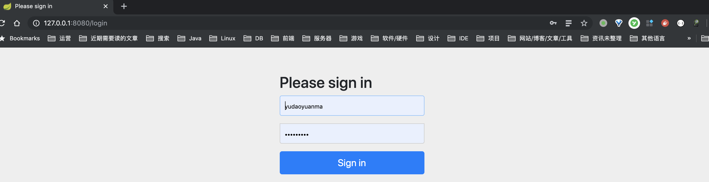
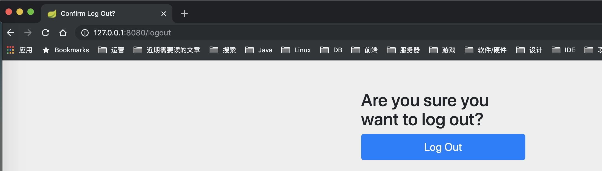
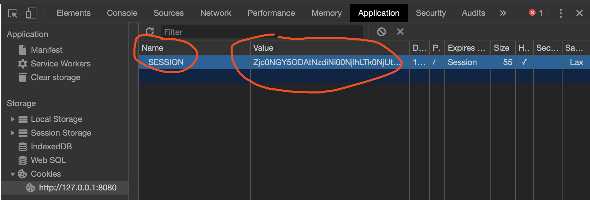
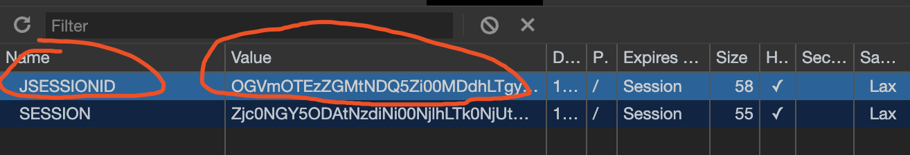
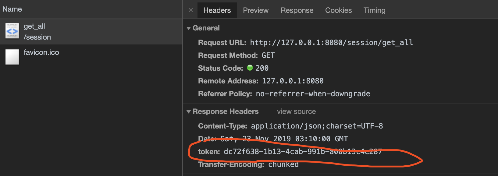

摘要: 原创出处 http://www.iocoder.cn/Spring-Boot/Distributed-Session/ 「芋道源码」欢迎转载，保留摘要，谢谢！

- [1. 概述](http://www.iocoder.cn/Spring-Boot/Distributed-Session/)
- [2. Spring Session](http://www.iocoder.cn/Spring-Boot/Distributed-Session/)
- [3. 快速入门 Spring Session + Redis](http://www.iocoder.cn/Spring-Boot/Distributed-Session/)
- [4. 快速入门 Spring Session + MongoDB](http://www.iocoder.cn/Spring-Boot/Distributed-Session/)
- [5. 整合 Spring Security](http://www.iocoder.cn/Spring-Boot/Distributed-Session/)
- [6. 整合 Shiro](http://www.iocoder.cn/Spring-Boot/Distributed-Session/)
- [7. 自定义 sessionid](http://www.iocoder.cn/Spring-Boot/Distributed-Session/)
- [666. 彩蛋](http://www.iocoder.cn/Spring-Boot/Distributed-Session/)

------

------

> 本文在提供完整代码示例，可见 https://github.com/YunaiV/SpringBoot-Labs 的 [lab-26](https://github.com/YunaiV/SpringBoot-Labs/tree/master/lab-26) 目录。
>
> 原创不易，给点个 [Star](https://github.com/YunaiV/SpringBoot-Labs/stargazers) 嘿，一起冲鸭！

# 1. 概述

艿艿信奉的话很多，其中很重要的一条：**在考虑高性能之前，一定要做高可用**。很多时候，我们常常陷入追求一个功能或者系统的高性能，却忽略了高可用。

为什么在这篇文章的开头提到这个段呢？对于任何系统，无论多小的访问量，一定要做系统的高可用。那么在我们部署生产环境下的 Tomcat 等 Web 容器的时候，**一定是需要部署多个节点**。此时，Session 的**一致性**就成为一个问题。为什么呢？

> Session 的一致性，简单来理解，就是相同 sessionid 在多个 Web 容器下，Session 的数据要一致。

我们先以用户使用浏览器，Web 服务器为**单台** TomcatA 举例子。

- 浏览器在第一次访问 Web 服务器 TomcatA 时，TomcatA 会发现请求的 Cookie 中**不**存在 sessionid ，所以创建一个 sessionid 为 X 的 Session ，同时将该 sessionid 写回给浏览器的 Cookie 中。
- 浏览器在下一次访问 Web 服务器 TomcatA 时，TomcatA 会发现请求的 Cookie 中**已**存在 sessionid 为 X ，则直接获得 X 对应的 Session 。

> 友情提示，Tomcat 产生的 sessionid 为 jsessionid 。
>
> 如果胖友对 Cookie 和 Session 的概念不是很清晰，建议可以先看下 [《彻底理解 Cookie、Session、Token》](http://www.iocoder.cn/Fight/Thoroughly-understand-cookies,-sessions,-tokens/?self) 文章。

我们再以用户使用浏览器，Web 服务器为**两台** TomcatA、TomcatB 举例子。

- 接上述例子，浏览器已经访问 TomcatA ，获得 sessionid 为 X 。同时，在多台 Tomcat 的情况下，我们需要采用 Nginx 做负载均衡。
- 浏览器又发起一次请求访问 Web 服务器，Nginx 负载均衡转发请求到 TomcatB 上。TomcatB 会发现请求的 Cookie 中**已**存在 sessionid 为 X ，则直接获得 X 对应的 Session 。结果呢，找不到 X 对应的 Session ，只好创建一个 sessionid 为 X 的 Session 。
- 此时，`虽然说浏览器的 sessionid 是 X ，但是对应到两个 Tomcat 中两个 Session `。那么，如果在 TomcatA 上做的 Session 修改，TomcatB 的 Session 还是原样，这样就会出现 **Session 不一致**的问题。

既然会出现 Session 不一致的问题，我们就要想办法让它们一致。一般来说，有三种方案。

**第一种，Session 黏连**。

使用 Nginx 实现会话黏连，将相同 sessionid 的浏览器所发起的请求，转发到同一台服务器。这样，就不会存在多个 Web 服务器创建多个 Session 的情况，也就不会发生 Session 不一致的问题。

不过，这种方式目前基本不被采用。因为，如果一台服务器重启，那么会导致转发到这个服务器上的 Session 全部丢失。

具体怎么实现这种方式，可以看看 [《Nginx 第三方模块 —— nginx-sticky-module 的使用（基于cookie的会话保持）》](https://blog.csdn.net/bigtree_3721/article/details/78007853) 文章。

**第二种，Session 复制**。

Web 服务器之间，进行 Session 复制同步。仅仅适用于实现 Session 复制的 Web 容器，例如说 Tomcat 、Weblogic 等等。

不过，这种方式目前基本也不被采用。试想一下，如果我们有 5 台 Web 服务器，所有的 Session 都要同步到每一个节点上，一个是效率低，一个是浪费内存。

具体怎么实现这种方式，可以看看 [《Session 共享 —— Tomcat 集群 Session 复制》](session 共享-tomcat集群session复制) 文章。

**第三种，Session 外部化存储**。

不同于上述的两种方案，Session 外部化存储，考虑不再采用 Web 容器的内存中存储 Session ，而是将 Session 存储外部化，持久化到 MySQL、Redis、MongoDB 等等数据库中。这样，Tomcat 就可以无状态化，专注提供 Web 服务或者 API 接口，未来拓展扩容也变得更加容易。

而实现 Session 外部化存储也有两种方式：

① 基于 Tomcat、Jetty 等 Web 容器**自带的拓展**，使用读取外部存储器的 Session 管理器。例如说：

- [《Redisson Tomcat会话管理器（Tomcat Session Manager）》](https://github.com/redisson/redisson/wiki/14.-第三方框架整合#146-spring-session会话管理器) ，实现将 Tomcat 使用 Redis 存储 Session 。
- [《Jetty 集群配置 Session 存储到 MySQL、MongoDB》](https://blog.csdn.net/xiao__gui/article/details/43271509) ，实现 Jetty 使用 MySQL、MongoDB 存储 Session 。

② 基于应用层封装 [HttpServletRequest](https://github.com/javaee/servlet-spec/blob/master/src/main/java/javax/servlet/http/HttpServletRequest.java) 请求对象，包装成自己的 RequestWrapper 对象，从而让实现调用 [`HttpServletRequest#getSession()`](https://github.com/javaee/servlet-spec/blob/master/src/main/java/javax/servlet/http/HttpServletRequest.java#L542-L581) 方法时，获得读写外部存储器的 SessionWrapper 对象。例如说，稍后我们会看到的本文的主角 [Spring Session](https://spring.io/projects/spring-session) 。

- Spring Session 提供了 [SessionRepositoryFilter](https://github.com/spring-projects/spring-session/blob/master/spring-session-core/src/main/java/org/springframework/session/web/http/SessionRepositoryFilter.java) 过滤器，它会过滤请求时，将请求 HttpServletRequest 对象包装成 [SessionRepositoryRequestWrapper](https://github.com/spring-projects/spring-session/blob/master/spring-session-core/src/main/java/org/springframework/session/web/http/SessionRepositoryFilter.java#L192-L418) 对象。代码如下：

	```
	// SessionRepositoryFilter.java
	
	protected void doFilterInternal(HttpServletRequest request, HttpServletResponse response, FilterChain filterChain) throws ServletException, IOException {
	    // sessionRepository 是访问外部数据源的操作类，例如说访问 Redis、MySQL 等等
	    request.setAttribute(SESSION_REPOSITORY_ATTR, this.sessionRepository);
	    
	
	    // 将请求和响应进行包装成 SessionRepositoryRequestWrapper 和 SessionRepositoryResponseWrapper 对象
	    SessionRepositoryFilter<S>.SessionRepositoryRequestWrapper wrappedRequest = new SessionRepositoryFilter.SessionRepositoryRequestWrapper(request, response, this.servletContext);
	    SessionRepositoryFilter.SessionRepositoryResponseWrapper wrappedResponse = new SessionRepositoryFilter.SessionRepositoryResponseWrapper(wrappedRequest, response);
	
	    // 继续执行下一个过滤器
	    try {
	        filterChain.doFilter(wrappedRequest, wrappedResponse);
	    } finally {
	        // 请求结束，提交 Session 到外部数据源
	        wrappedRequest.commitSession();
	    }
	
	}
	```

	

- 调用 [`SessionRepositoryRequestWrapper#getSession()`](https://github.com/spring-projects/spring-session/blob/master/spring-session-core/src/main/java/org/springframework/session/web/http/SessionRepositoryFilter.java#L325-L328) 方法时，返回的是自己封装的 [HttpSessionWrapper](https://github.com/spring-projects/spring-session/blob/master/spring-session-core/src/main/java/org/springframework/session/web/http/SessionRepositoryFilter.java#L375-L390) 对象。代码如下：

	```
	// SessionRepositoryFilter#SessionRepositoryRequestWrapper.java
	
		@Override
		public HttpSessionWrapper getSession() {
			return getSession(true);
		}
	```

	

- 后续，我们调用 HttpSessionWrapper 的方法，例如说 `HttpSessionWrapper#setAttribute(String name, Object value)` 方法，访问的就是外部数据源，而不是内存中。

当然 ① 和 ② 两种方案思路是类似且一致的，只是说拓展的提供者和位置不同。😈 相比来说，② 会比 ① 更加通用一些。

# 2. Spring Session

可能很多胖友都不太了解 [Spring Session](https://spring.io/projects/spring-session) ，毕竟在 2015 年才诞生。而这个时候，每个公司或者架构师，已经有了自己的 Session 共享解决方案，这个我们在 [「666. 彩蛋」](http://www.iocoder.cn/Spring-Boot/Distributed-Session/?self#) 中细聊，毕竟咱不能抢主角 Spring Session 的戏份。

我们看看 https://spring.io/projects/spring-session 官方文档对 Spring Session 的介绍。

> Spring Session provides an API and implementations for managing a user’s session information.
>
> Spring Session 提供了用于管理用户会话信息的 API 和实现。

**Features**

> Spring Session makes it trivial to support clustered sessions without being tied to an application container specific solution. It also provides transparent integration with:
>
> - `HttpSession` - allows replacing the HttpSession in an application container (i.e. Tomcat) neutral way, with support for providing session IDs in headers to work with RESTful APIs
> - `WebSocket` - provides the ability to keep the HttpSession alive when receiving WebSocket messages
> - `WebSession` - allows replacing the Spring WebFlux’s WebSession in an application container neutral way
>
> Spring Session 使支持集群会话变得非常简单，无需绑定到特定于应用程序容器的解决方案。它还提供了透明的集成:
>
> - `HttpSession` - 允许以中立通用的方式替换应用程序容器(即 Tomcat)中的 HttpSession ，并支持在请求头(Header)中提供 sessionid ，方便提供 RESTful API 。
> - `WebSocket` - 提供在接收 WebSocket 消息时保持 HttpSession 活跃的能力。😈 不然，HttpSession 就过期失效了。
> - `WebSession` - 允许以与应用程序容器无关的方式替换 Spring WebFlux 的 WebSession 。

**Modules**

> Spring Session consists of the following modules:
>
> - Spring Session Core - provides core Spring Session functionalities and APIs
> - Spring Session Data Redis - provides SessionRepository and ReactiveSessionRepository implementation backed by Redis and configuration support
> - Spring Session JDBC - provides SessionRepository implementation backed by a relational database and configuration support
> - Spring Session Hazelcast - provides SessionRepository implementation backed by Hazelcast and configuration support

- 可以使用 Redis、JDBC（访问 MySQL、Oracle 等数据库）、Hazelcast 作为 Session 存储的数据源。
- 同时 Spring Session 也另外提供了 [Spring Session MongoDB](https://spring.io/projects/spring-session-data-mongodb) ，实现使用 MongoDB 作为 Session 存储的数据源。

# 3. 快速入门 Spring Session + Redis

> 示例代码对应仓库：[lab-26-distributed-session-01](https://github.com/YunaiV/SpringBoot-Labs/tree/master/lab-26/lab-26-distributed-session-01) 。

「Talk is cheap. Show me the code.」让我们一起来一起入门 Spring Session 的门。本小节，我们会使用 Redis 作为 Spring Session 的存储器，这也是生产环境下，主流的选择。

不过这个示例会比较简单，瓜子和板凳就不用准备了，直接打开 IDEA ，一起跟着做即可。

## 3.1 引入依赖

在 [`pom.xml`](https://github.com/YunaiV/SpringBoot-Labs/blob/master/lab-26/lab-26-distributed-session-01/pom.xml) 文件中，引入相关依赖。


```
<?xml version="1.0" encoding="UTF-8"?>
<project xmlns="http://maven.apache.org/POM/4.0.0"
         xmlns:xsi="http://www.w3.org/2001/XMLSchema-instance"
         xsi:schemaLocation="http://maven.apache.org/POM/4.0.0 http://maven.apache.org/xsd/maven-4.0.0.xsd">
    <parent>
        <groupId>org.springframework.boot</groupId>
        <artifactId>spring-boot-starter-parent</artifactId>
        <version>2.1.10.RELEASE</version>
        <relativePath/> <!-- lookup parent from repository -->
    </parent>
    <modelVersion>4.0.0</modelVersion>

    <artifactId>lab-26-distributed-session-01</artifactId>

    <dependencies>
        <!-- 实现对 Spring MVC 的自动化配置 -->
        <dependency>
            <groupId>org.springframework.boot</groupId>
            <artifactId>spring-boot-starter-web</artifactId>
        </dependency>

        <!-- 实现对 Spring Session 使用 Redis 作为数据源的自动化配置 -->
        <dependency>
            <groupId>org.springframework.session</groupId>
            <artifactId>spring-session-data-redis</artifactId>
        </dependency>

        <!-- 实现对 Spring Data Redis 的自动化配置 -->
        <dependency>
            <groupId>org.springframework.boot</groupId>
            <artifactId>spring-boot-starter-data-redis</artifactId>
            <exclusions>
                <!-- 去掉对 Lettuce 的依赖，因为 Spring Boot 优先使用 Lettuce 作为 Redis 客户端 -->
                <exclusion>
                    <groupId>io.lettuce</groupId>
                    <artifactId>lettuce-core</artifactId>
                </exclusion>
            </exclusions>
        </dependency>
        <!-- 引入 Jedis 的依赖，这样 Spring Boot 实现对 Jedis 的自动化配置 -->
        <dependency>
            <groupId>redis.clients</groupId>
            <artifactId>jedis</artifactId>
        </dependency>

    </dependencies>

</project>
```


- 具体每个依赖的作用，胖友自己认真看下艿艿添加的所有注释噢。
- 在使用 Spring Data Redis 时，艿艿推荐使用 Jedis 作为 Redis 操作的客户端，所以这里做了依赖的修改。本文关于 Spring Data Redis 的内容，就不做赘述了，胖友可以去看看 [《芋道 Spring Boot Redis 入门》](http://www.iocoder.cn/Spring-Boot/Redis/?self) 文章。当然，现在不看，也不会对本文阅读产生影响。

## 3.2 应用配置文件

在 [`resources`](https://github.com/YunaiV/SpringBoot-Labs/tree/master/lab-26/lab-26-distributed-session-01/src/main/resources) 目录下，创建 [`application.yaml`](https://github.com/YunaiV/SpringBoot-Labs/blob/master/lab-26/lab-26-distributed-session-01/src/main/resources/application.yaml) 配置文件。配置如下：


```
spring:
  # 对应 RedisProperties 类
  redis:
    host: 127.0.0.1
    port: 6379
    password: # Redis 服务器密码，默认为空。生产中，一定要设置 Redis 密码！
    database: 0 # Redis 数据库号，默认为 0 。
    timeout: 0 # Redis 连接超时时间，单位：毫秒。
    # 对应 RedisProperties.Jedis 内部类
    jedis:
      pool:
        max-active: 8 # 连接池最大连接数，默认为 8 。使用负数表示没有限制。
        max-idle: 8 # 默认连接数最大空闲的连接数，默认为 8 。使用负数表示没有限制。
        min-idle: 0 # 默认连接池最小空闲的连接数，默认为 0 。允许设置 0 和 正数。
        max-wait: -1 # 连接池最大阻塞等待时间，单位：毫秒。默认为 -1 ，表示不限制。
```


具体每个参数的作用，胖友自己认真看下艿艿添加的所有注释噢。

## 3.3 SessionConfiguration

在 [`cn.iocoder.springboot.lab26.distributedsession.config`](https://github.com/YunaiV/SpringBoot-Labs/tree/master/lab-26/lab-26-distributed-session-01/src/main/java/cn/iocoder/springboot/lab26/distributedsession/config) 包路径下，创建 [SessionConfiguration](https://github.com/YunaiV/SpringBoot-Labs/blob/master/lab-26/lab-26-distributed-session-01/src/main/java/cn/iocoder/springboot/lab26/distributedsession/config/SessionConfiguration.java) 类，自定义 Spring Session Redis 的配置。代码如下：


```
// SessionConfiguration.java

@Configuration
@EnableRedisHttpSession // 自动化配置 Spring Session 使用 Redis 作为数据源
public class SessionConfiguration {

    /**
     * 创建 {@link RedisOperationsSessionRepository} 使用的 RedisSerializer Bean 。
     *
     * 具体可以看看 {@link RedisHttpSessionConfiguration#setDefaultRedisSerializer(RedisSerializer)} 方法，
     * 它会引入名字为 "springSessionDefaultRedisSerializer" 的 Bean 。
     *
     * @return RedisSerializer Bean
     */
    @Bean(name = "springSessionDefaultRedisSerializer")
    public RedisSerializer springSessionDefaultRedisSerializer() {
        return RedisSerializer.json();
    }

}
```


- 在类上，添加 [`@EnableRedisHttpSession`](https://github.com/spring-projects/spring-session/blob/master/spring-session-data-redis/src/main/java/org/springframework/session/data/redis/config/annotation/web/http/EnableRedisHttpSession.java) 注解，开启自动化配置 Spring Session 使用 Redis 作为数据源。该注解有如下属性：

	- `maxInactiveIntervalInSeconds` 属性，Session 不活跃后的过期时间，默认为 1800 秒。

	- `redisNamespace` 属性，在 Redis 的 key 的统一前缀，默认为 `"spring:session"` 。

	- ```
		redisFlushMode
		```

		 

		属性，Redis 会话刷新模式(

		RedisFlushMode

		)。目前有两种，默认为

		 

		```
		RedisFlushMode.ON_SAVE
		```

		 

		。

		- `RedisFlushMode.ON_SAVE` ，在请求执行完成时，统一写入 Redis 存储。
		- `RedisFlushMode.IMMEDIATE` ，在每次修改 Session 时，立即写入 Redis 存储。

	- `cleanupCron` 属性，清理 Redis Session 会话过期的任务执行 CRON 表达式，默认为 `"0 * * * * *"` 每分钟执行一次。虽然说，Redis 自带了 key 的过期，但是惰性删除策略，实际过期的 Session 还在 Redis 中占用内存。所以，Spring Session 通过定时任务，删除 Redis 中过期的 Session ，尽快释放 Redis 的内存。不了解 Redis 的删除过期 key 的策略的胖友，可以看看 [《Redis 中删除过期 Key 的三种策略》](https://blog.csdn.net/a_bang/article/details/52986935/) 文章。

- 在 `#springSessionDefaultRedisSerializer()` 方法，定义了一个 Bean 名字为 `"springSessionDefaultRedisSerializer"` 的 RedisSerializer Bean ，采用 JSON 序列化方式。因为默认情况下，采用 [Java 自带的序列化方式](https://juejin.im/post/5ce3cdc8e51d45777b1a3cdf) ，可读性很差，所以进行替换。

## 3.4 Application

创建 [`Application.java`](https://github.com/YunaiV/SpringBoot-Labs/blob/master/lab-26/lab-26-distributed-session-01/src/main/java/cn/iocoder/springboot/lab26/distributedsession/Application.java) 类，配置 `@SpringBootApplication` 注解即可。代码如下：


```
// Application.java

@SpringBootApplication
public class Application {

    public static void main(String[] args) {
        SpringApplication.run(Application.class, args);
    }

}
```


这里，我们先不要启动项目，等到我们添加好相应的测试类。

## 3.5 简单测试

在本小节，我们会创建两个接口，用于测试。

- `session/get_all` 接口，返回 Session 中的内容。
- `session/set` 接口，设置 key-value 键值对到 Session 中。

在 [`cn.iocoder.springboot.lab26.distributedsession.controller`](https://github.com/YunaiV/SpringBoot-Labs/tree/master/lab-26/lab-26-distributed-session-01/src/main/java/cn/iocoder/springboot/lab26/distributedsession/controller) 包路径下，创建 [SessionController](https://github.com/YunaiV/SpringBoot-Labs/blob/master/lab-26/lab-26-distributed-session-01/src/main/java/cn/iocoder/springboot/lab26/distributedsession/controller/SessionController.java) 类，提上述的两个接口。代码如下：


```
// SessionController.java

@RestController
@RequestMapping("/session")
public class SessionController {

    @GetMapping("/set") // 其实 PostMapping 更合适，单纯为了方便
    public void set(HttpSession session,
                    @RequestParam("key") String key,
                    @RequestParam("value") String value) {
        session.setAttribute(key, value);
    }

    @GetMapping("/get_all")
    public Map<String, Object> getAll(HttpSession session) {
        Map<String, Object> result = new HashMap<>();
        // 遍历
        for (Enumeration<String> enumeration = session.getAttributeNames();
             enumeration.hasMoreElements();) {
            String key = enumeration.nextElement();
            Object value = session.getAttribute(key);
            result.put(key, value);
        }
        // 返回
        return result;
    }

}
```


- 代码比较简单，胖友自己 10 秒钟看懂。看不懂的，去角落自闭下。😜

下面，开始开始我们的测试。

① 在浏览器中，访问 `"http://127.0.0.1:8080/session/get"` 接口，返回目前的 Session 的内容。响应结果如下：


```
{}
```


- 空空的，这也符合期望。

终端执行 `redis-cli` 命令，连接到 Redis 中，查看是否创建了一个 Session 。过程如下：


```
# 假设，我们已经在 redis-cli 中

127.0.0.1:6379> scan 0
1) "0"
2) 1) "spring:session:sessions:expires:bea153af-3b36-451e-bbc9-2637bcdc5b37"
   2) "spring:session:expirations:1574493180000"
   3) "spring:session:sessions:bea153af-3b36-451e-bbc9-2637bcdc5b37"
```


- 每一个 Session 对应 Redis 三个 key-value 键值对。
	- 开头：以 `spring:session` 开头，可以通过 `@EnableRedisHttpSession` 注解的 `redisNamespace` 属性配置。
	- 结尾：以对应 Session 的 sessionid 结尾。
	- 中间：中间分别是 `"session"`、`"expirations"`、`sessions:expires` 。**一般情况下，我们只需要关注中间为 `"session"` 的 key-value 键值对即可，它负责真正存储 Session 数据。**对于中间为 `"sessions:expires"` 和 `"expirations"` 的两个来说，主要为了实现主动删除 Redis 过期的 Session 会话，解决 Redis 惰性删除的“问题”。具体的实现原理，本文就不赘述，感兴趣的胖友，可以看看 [《从 Spring-Session 源码看 Session 机制的实现细节》](http://www.iocoder.cn/Spring-Session/laoxu/spring-session-4/?self) 文章。

> 艿艿：这里表述有个错误，相信大家可以理解，先不修改了。
>
> 每一个 Session 对应 Redis 二个 key-value 键值对。而 `"spring:session:expirations:{时间戳}"` ，是为了获得每分钟需要过期的 sessionid 集合，即 {时间戳} 是每分钟的时间戳。

我们查看下 `"spring:session:sessions:bea153af-3b36-451e-bbc9-2637bcdc5b37"` 的内容。它是一个 Redis **hash** 数据结构。结果如下：


```
127.0.0.1:6379> HGETALL spring:session:sessions:bea153af-3b36-451e-bbc9-2637bcdc5b37
1) "lastAccessedTime" # 最后访问时间
2) "1574491333155"
3) "maxInactiveInterval" # Session 允许最大不活跃时长，单位：秒。
4) "1800"
5) "creationTime" # 创建时间
6) "1574491333107"

127.0.0.1:6379> ttl spring:session:sessions:bea153af-3b36-451e-bbc9-2637bcdc5b37
(integer) 1089 # 虽然说，Spring Session Redis 实现了主动删除，但是并不妨碍这里也使用 Redis 自动过期策略。
```


- 比较简单，注意看下艿艿添加的注释噢。

② 在浏览器中，访问 `"http://127.0.0.1:8080/session/set?key=who&value=yudaoyuanma"` 和 `"http://127.0.0.1:8080/session/set?key=author&value=nainai"` 接口，设置两个 key-value 键值对。

我们再查看下 `"spring:session:sessions:bea153af-3b36-451e-bbc9-2637bcdc5b37"` 的内容。结果如下：


```
127.0.0.1:6379> HGETALL spring:session:sessions:bea153af-3b36-451e-bbc9-2637bcdc5b37
 1) "lastAccessedTime"
 2) "1574492555921"
 3) "maxInactiveInterval"
 4) "1800"
 5) "creationTime"
 6) "1574491333107"
 7) "sessionAttr:who" # key 为 who
 8) "\"yudaoyuanma\""
 9) "sessionAttr:author" # key 为 author
10) "\"nainai\""
```


- 我们调用 `HttpSession#setAttribute(String name, Object value)` 方法，设置的每一个 key-value 键值对，对应到 Redis hash 数据结构中的一个 **key** 。考虑到毕竟 key 冲突，使用 `"sessionAttr:"` 开头。

至此，我们已经完成了 Spring Session Redis 的简单入门。因为考虑到让示例的入门更加简单，我们并没有搭建多个 Spring Boot 节点。想要尝试的胖友，可以自己弄下，嘿嘿。

# 4. 快速入门 Spring Session + MongoDB

> 示例代码对应仓库：[lab-26-distributed-session-02](https://github.com/YunaiV/SpringBoot-Labs/tree/master/lab-26/lab-26-distributed-session-02) 。

万分好奇，Spring Session 会把 Session 如何存储在 MongoDB 中，所以就有了本小节的入门。虽然说，MongoDB 提供了非常好的读写性能，但是相比 Redis 来说，还是略有的差距。感兴趣的，可以看看它们的性能基准测试：

- [《性能测试 —— MongoDB 基准测试》](http://www.iocoder.cn/Performance-Testing/MongoDB-benchmark/self)
- [《性能测试 —— Redis 基准测试》](http://www.iocoder.cn/Performance-Testing/Redis-benchmark/self)

能够想到使用 MongoDB 作为 Session 的存储，可能是项目中使用了 MongoDB ，而没有使用 Redis 。恰好，我们又有分布式 Session 的诉求，那么使用 MongoDB 作为 Session 的存储，可以减少 Redis 节点的维护。毕竟，没多引入一个组件，就多一份维护成本。

下面，让们来尝鲜尝新，有点点小激动 🐔。

> 友情提示：如果胖友没有安装 MongoDB 数据库，可以参考 [《芋道 MongoDB 极简入门》](http://www.iocoder.cn/MongoDB/install/?self) 文章。

## 4.1 引入依赖

在 [`pom.xml`](https://github.com/YunaiV/SpringBoot-Labs/blob/master/lab-26/lab-26-distributed-session-02/pom.xml) 文件中，引入相关依赖。


```
<?xml version="1.0" encoding="UTF-8"?>
<project xmlns="http://maven.apache.org/POM/4.0.0"
         xmlns:xsi="http://www.w3.org/2001/XMLSchema-instance"
         xsi:schemaLocation="http://maven.apache.org/POM/4.0.0 http://maven.apache.org/xsd/maven-4.0.0.xsd">
    <parent>
        <groupId>org.springframework.boot</groupId>
        <artifactId>spring-boot-starter-parent</artifactId>
        <version>2.1.10.RELEASE</version>
        <relativePath/> <!-- lookup parent from repository -->
    </parent>
    <modelVersion>4.0.0</modelVersion>

    <artifactId>lab-26-distributed-session-02</artifactId>

    <dependencies>
        <!-- 实现对 Spring MVC 的自动化配置 -->
        <dependency>
            <groupId>org.springframework.boot</groupId>
            <artifactId>spring-boot-starter-web</artifactId>
        </dependency>

        <!-- 实现对 Spring Session 使用 MongoDB 作为数据源的自动化配置 -->
        <dependency>
            <groupId>org.springframework.session</groupId>
            <artifactId>spring-session-data-mongodb</artifactId>
        </dependency>

        <!-- 自动化配置 Spring Data Mongodb -->
        <dependency>
            <groupId>org.springframework.boot</groupId>
            <artifactId>spring-boot-starter-data-mongodb</artifactId>
        </dependency>

    </dependencies>

</project>
```


- 具体每个依赖的作用，胖友自己认真看下艿艿添加的所有注释噢。
- Spring Data MongoDB 的入门，艿艿也写了一篇，胖友可以去看看 [《芋道 Spring Boot MongoDB 入门》](http://www.iocoder.cn/Spring-Boot/MongoDB/?self) 文章。当然，现在不看，也不会对本文阅读产生影响。

## 4.2 应用配置文件

在 [`resources`](https://github.com/YunaiV/SpringBoot-Labs/tree/master/lab-26/lab-26-distributed-session-02/src/main/resources) 目录下，创建 [`application.yaml`](https://github.com/YunaiV/SpringBoot-Labs/blob/master/lab-26/lab-26-distributed-session-02/src/main/resources/application.yaml) 配置文件。配置如下：


```
spring:
  data:
    # MongoDB 配置项，对应 MongoProperties 类
    mongodb:
      host: 127.0.0.1
      port: 27017
      database: yourdatabase
      username: test01
      password: password01
      # 上述属性，也可以只配置 uri

logging:
  level:
    org:
      springframework:
        data:
          mongodb:
            core: DEBUG # 打印 mongodb 操作的具体语句。生产环境下，不建议开启。
```


具体每个参数的作用，胖友自己认真看下艿艿添加的所有注释噢。

## 4.3 SessionConfiguration

在 [`cn.iocoder.springboot.lab26.distributedsession.config`](https://github.com/YunaiV/SpringBoot-Labs/tree/master/lab-26/lab-26-distributed-session-02/src/main/java/cn/iocoder/springboot/lab26/distributedsession/config) 包路径下，创建 [SessionConfiguration](https://github.com/YunaiV/SpringBoot-Labs/blob/master/lab-26/lab-26-distributed-session-02/src/main/java/cn/iocoder/springboot/lab26/distributedsession/config/SessionConfiguration.java) 类，开启 Spring Session MongoDB 的配置。代码如下：


```
@Configuration
@EnableMongoHttpSession // 自动化配置 Spring Session 使用 MongoDB 作为数据源
public class SessionConfiguration {

    @Bean
    public AbstractMongoSessionConverter mongoSessionConverter() {
        return new JacksonMongoSessionConverter();
    }

}
```


- 在类上，添加 [

	```
	@EnableMongoHttpSession
	```

	]https://github.com/spring-projects/spring-session-data-mongodb/blob/master/src/main/java/org/springframework/session/data/mongo/config/annotation/web/http/EnableMongoHttpSession.java) 注解，开启自动化配置 Spring Session 使用 MongoDB 作为数据源。该注解有如下属性：

	- `maxInactiveIntervalInSeconds` 属性，Session 不活跃后的过期时间，默认为 1800 秒。
	- `collectionName` 属性，在 MongoDB 中，存储 Session 的集合名，默认为 `"sessions"` 。

- 在 `#mongoSessionConverter()` 方法，创建了 JacksonMongoSessionConverter Bean 对象，采用 JSON 序列化。因为默认情况下，采用使用 JdkMongoSessionConverter 是 [Java 自带的序列化方式](https://juejin.im/post/5ce3cdc8e51d45777b1a3cdf) ，可读性很差，所以进行替换。

目前，Spring Session MongoDB 基于 **MongoDB 自动过期删除过期数据**的机制，实现 Session 的自动过期。因为 MongoDB 的自动过期机制，并不是像 Redis 是惰性删除，所以无需实现定时任务，主动删除来释放内存。不了解 MongoDB 该机制的胖友，可以看看 [《MongoDB 自动删除过期数据 —— TTL 索引》](https://blog.csdn.net/jianlong727/article/details/54631124) 文章。

## 4.4 Application

创建 [`Application.java`](https://github.com/YunaiV/SpringBoot-Labs/blob/master/lab-26/lab-26-distributed-session-02/src/main/java/cn/iocoder/springboot/lab26/distributedsession/Application.java) 类，配置 `@SpringBootApplication` 注解即可。代码如下：


```
// Application.java

@SpringBootApplication
public class Application {

    public static void main(String[] args) {
        SpringApplication.run(Application.class, args);
    }

}
```


这里，我们先不要启动项目，等到我们添加好相应的测试类。

## 4.5 简单测试

在本小节，我们会创建两个接口，用于测试。

- `session/get_all` 接口，返回 Session 中的内容。
- `session/set` 接口，设置 key-value 键值对到 Session 中。

在 [`cn.iocoder.springboot.lab26.distributedsession.controller`](https://github.com/YunaiV/SpringBoot-Labs/tree/master/lab-26/lab-26-distributed-session-02/src/main/java/cn/iocoder/springboot/lab26/distributedsession/controller) 包路径下，创建 [SessionController](https://github.com/YunaiV/SpringBoot-Labs/blob/master/lab-26/lab-26-distributed-session-02/src/main/java/cn/iocoder/springboot/lab26/distributedsession/controller/SessionController.java) 类，提上述的两个接口。代码如下：


```
// SessionController.java

@RestController
@RequestMapping("/session")
public class SessionController {

    @GetMapping("/set") // 其实 PostMapping 更合适，单纯为了方便
    public void set(HttpSession session,
                    @RequestParam("key") String key,
                    @RequestParam("value") String value) {
        session.setAttribute(key, value);
    }

    @GetMapping("/get_all")
    public Map<String, Object> getAll(HttpSession session) {
        Map<String, Object> result = new HashMap<>();
        // 遍历
        for (Enumeration<String> enumeration = session.getAttributeNames();
             enumeration.hasMoreElements();) {
            String key = enumeration.nextElement();
            Object value = session.getAttribute(key);
            result.put(key, value);
        }
        // 返回
        return result;
    }

}
```


- 代码比较简单，胖友自己 10 秒钟看懂。看不懂的，去角落自闭下。😜

下面，开始开始我们的测试。

① 在浏览器中，访问 `"http://127.0.0.1:8080/session/get"` 接口，返回目前的 Session 的内容。响应结果如下：


```
{}
```


- 空空的，这也符合期望。

使用 [MongoDB](https://studio3t.com/) 查询 MongoDB 的数据。因为此时我们还没有 `sessions` 集合插入数据，所以 `sessions` 集合并未自动创建，因此数据为空。

② 在浏览器中，访问 `"http://127.0.0.1:8080/session/set?key=who&value=yudaoyuanma"` 和 `"http://127.0.0.1:8080/session/set?key=author&value=nainai"` 接口，设置两个 key-value 键值对。

我们再查看下 `sessions` 集合的内容。结果如下：


```
{ 
    "_id" : "5a6e9b28-7740-422e-8d1c-50a4b2781d7a", 
    "@class" : "org.springframework.session.data.mongo.MongoSession", 
    "createdMillis" : NumberLong(1574501001259), 
    "accessedMillis" : NumberLong(1574501010539), 
    "intervalSeconds" : NumberInt(1800), 
    "expireAt" : ISODate("2019-11-23T17:53:30.539+0800"), 
    "attrs" : {
        "@class" : "java.util.HashMap", 
        "author" : "nainai", 
        "who" : "yudaoyuanma"
    }, 
    "principal" : null
}
```


- 每个 Session 对应一条 `sessions` 集合的记录。对应到实体类是 [MongoSession](https://github.com/spring-projects/spring-session-data-mongodb/blob/master/src/main/java/org/springframework/session/data/mongo/MongoSession.java) 。代码如下：

	```
	// MongoSession.java
	public class MongoSession implements Session {
	
	    private String id;
	    private long createdMillis;
	    private long accessedMillis;
	    private long intervalSeconds;
	    private Date expireAt;
	    private Map<String, Object> attrs;
	    
	    // ... 省略方法
	    
	}
	```

	

- `_id` 字段，sessionid 。

- `@class` 字段，记录对应的实体类，就是我们提到的 MongoSession 。

- `createdMillis` 字段，Session 创建时间戳。

- `accessedMillis` 字段，Session 最后访问时间戳。

- `intervalSeconds` 字段，Session 允许最大不活跃时长，单位：秒。

- `expireAt` 字段，Session 过期时间。在该字段上，我们创建了 `expireAt` 所以， 用于实现过期 Session 记录的自动删除。索引信息如下：

	```
	{ 
	    "v" : 2, 
	    "name" : "expireAt", 
	    "ns" : "yourdatabase.sessions", 
	    "expireAfterSeconds" : 0
	}
	```

	

- `attrs` 字段，Session 的 attribute 属性们。

- `principal` 字段，用户主体，和用户身份认证相关。

至此，我们已经完成了 Spring Session MongoDB 的简单入门。如果胖友是充满好奇的小胖子，可以自己去尝试下 [Spring Session JDBC](https://www.baeldung.com/spring-session-jdbc) 。

# 5. 整合 Spring Security

> 示例代码对应仓库：[lab-26-distributed-session-springsecurity](https://github.com/YunaiV/SpringBoot-Labs/tree/master/lab-26/lab-26-distributed-session-springsecurity) 。

考虑到很多胖友，使用 [Spring Security](https://www.oschina.net/p/spring+security) 作为安全框架，所以我们来一起整合下 Spring Session + Spring Security 。整个过程，会和 [「2. 快速入门 Spring Session + Redis」](http://www.iocoder.cn/Spring-Boot/Distributed-Session/?self#) 小节，比较接近。

## 5.1 引入依赖

在 [`pom.xml`](https://github.com/YunaiV/SpringBoot-Labs/blob/master/lab-26/lab-26-distributed-session-springsecurity/pom.xml) 文件中，引入相关依赖。


```
<?xml version="1.0" encoding="UTF-8"?>
<project xmlns="http://maven.apache.org/POM/4.0.0"
         xmlns:xsi="http://www.w3.org/2001/XMLSchema-instance"
         xsi:schemaLocation="http://maven.apache.org/POM/4.0.0 http://maven.apache.org/xsd/maven-4.0.0.xsd">
    <parent>
        <groupId>org.springframework.boot</groupId>
        <artifactId>spring-boot-starter-parent</artifactId>
        <version>2.1.10.RELEASE</version>
        <relativePath/> <!-- lookup parent from repository -->
    </parent>
    <modelVersion>4.0.0</modelVersion>

    <artifactId>lab-26-distributed-session-springsecurity</artifactId>

    <dependencies>
        <!-- 实现对 Spring MVC 的自动化配置 -->
        <dependency>
            <groupId>org.springframework.boot</groupId>
            <artifactId>spring-boot-starter-web</artifactId>
        </dependency>

        <!-- 实现对 Spring Session 使用 Redis 作为数据源的自动化配置 -->
        <dependency>
            <groupId>org.springframework.session</groupId>
            <artifactId>spring-session-data-redis</artifactId>
        </dependency>

        <!-- 实现对 Spring Data Redis 的自动化配置 -->
        <dependency>
            <groupId>org.springframework.boot</groupId>
            <artifactId>spring-boot-starter-data-redis</artifactId>
            <exclusions>
                <!-- 去掉对 Lettuce 的依赖，因为 Spring Boot 优先使用 Lettuce 作为 Redis 客户端 -->
                <exclusion>
                    <groupId>io.lettuce</groupId>
                    <artifactId>lettuce-core</artifactId>
                </exclusion>
            </exclusions>
        </dependency>
        <!-- 引入 Jedis 的依赖，这样 Spring Boot 实现对 Jedis 的自动化配置 -->
        <dependency>
            <groupId>redis.clients</groupId>
            <artifactId>jedis</artifactId>
        </dependency>

        <!-- 实现对 Spring Security 的自动化配置 -->
        <dependency>
            <groupId>org.springframework.boot</groupId>
            <artifactId>spring-boot-starter-security</artifactId>
        </dependency>
        
    </dependencies>

</project>
```


- 相比 [「3.1 引入依赖」](http://www.iocoder.cn/Spring-Boot/Distributed-Session/?self#) 来说，额外引入了 `spring-boot-starter-security` 依赖，实现对 Spring Security 的自动化配置。

## 5.2 应用配置文件

在 [`resources`](https://github.com/YunaiV/SpringBoot-Labs/tree/master/lab-26/lab-26-distributed-session-springsecurity/src/main/resources) 目录下，创建 [`application.yaml`](https://github.com/YunaiV/SpringBoot-Labs/blob/master/lab-26/lab-26-distributed-session-springsecurity/src/main/resources/application.yaml) 配置文件。配置如下：


```
spring:
  # 对应 RedisProperties 类
  redis:
    host: 127.0.0.1
    port: 6379
    password: # Redis 服务器密码，默认为空。生产中，一定要设置 Redis 密码！
    database: 0 # Redis 数据库号，默认为 0 。
    timeout: 0 # Redis 连接超时时间，单位：毫秒。
    # 对应 RedisProperties.Jedis 内部类
    jedis:
      pool:
        max-active: 8 # 连接池最大连接数，默认为 8 。使用负数表示没有限制。
        max-idle: 8 # 默认连接数最大空闲的连接数，默认为 8 。使用负数表示没有限制。
        min-idle: 0 # 默认连接池最小空闲的连接数，默认为 0 。允许设置 0 和 正数。
        max-wait: -1 # 连接池最大阻塞等待时间，单位：毫秒。默认为 -1 ，表示不限制。
  # 对应 SecurityProperties 类
  security:
    user: # 配置内存中，可登录的用户名和密码
      name: yudaoyuanma
      password: nicai
```


- 相比 [「3.2 应用配置文件」](http://www.iocoder.cn/Spring-Boot/Distributed-Session/?self#) 来说，增加了 `spring.security` 配置项，用于配置 Spring Security 内存中，可登录的用户名和密码。

## 5.3 SessionConfiguration

在 [`cn.iocoder.springboot.lab26.distributedsession.config`](https://github.com/YunaiV/SpringBoot-Labs/tree/master/lab-26/lab-26-distributed-session-springsecurity/src/main/java/cn/iocoder/springboot/lab26/distributedsession/config) 包路径下，创建 [SessionConfiguration](https://github.com/YunaiV/SpringBoot-Labs/blob/master/lab-26/lab-26-distributed-session-springsecurity/src/main/java/cn/iocoder/springboot/lab26/distributedsession/config/SessionConfiguration.java) 类，自动化配置 Spring Session 使用 Redis 作为数据源。代码如下：


```
// SessionConfiguration.java

@Configuration
@EnableRedisHttpSession // 自动化配置 Spring Session 使用 Redis 作为数据源
public class SessionConfiguration {

}
```


- 相比

	 

	「3.3 SessionConfiguration」

	 

	来说，去掉了自定义的

	 

	JSON

	 

	RedisSerializer Bean 的配置。原因是，HttpSession 的 attributes 属性，是

	 

	```
	Map<String, Object>
	```

	 

	类型。

	- 在序列化 Session 到 Redis 中时，不存在问题。
	- 在反序列化 Redis 的 key-value 键值对成 Session 时，如果 attributes 的 value 存在 POJO 对象的时候，因为不知道该 value 是什么 POJO 对象，导致无法反序列化错误。

关于这个问题，胖友可以自己测试下，感受会更加明显。目前，艿艿暂时找不到特别合适的解决方案，所以就换回 Java 序列化方式。**也因此，在使用 Spring Session 时，先老实使用 Java 序列化方式吧**。

## 5.4 Application

创建 [`Application.java`](https://github.com/YunaiV/SpringBoot-Labs/blob/master/lab-26/lab-26-distributed-session-springsecurity/src/main/java/cn/iocoder/springboot/lab26/distributedsession/Application.java) 类，配置 `@SpringBootApplication` 注解即可。代码如下：


```
// Application.java

@SpringBootApplication
public class Application {

    public static void main(String[] args) {
        SpringApplication.run(Application.class, args);
    }

}
```


- 和 [「3.4 Application」](http://www.iocoder.cn/Spring-Boot/Distributed-Session/?self#) 一致。

这里，我们先不要启动项目，等到我们添加好相应的测试类。

## 5.5 简单测试

本小节，我们来测试下登录的流程，并观察整个流程中的 Session 变化。下面，我们开始测试。

① 在浏览器中，访问 `"http://127.0.0.1:8080/"` 地址，因为 使用了 Spring Security ，所以会被自动拦截重定向到 `"http://127.0.0.1:8080/login"` 登录地址。界面如下：

- Spring Security 内置该登录界面。

终端执行 `redis-cli` 命令，连接到 Redis 中，查看是否创建了一个 Session 。过程如下：


```
# 确实创建了一个 sessionid 为 f65a475e-8550-49a4-b71d-0320c8cf887f 的 Session 。
127.0.0.1:6379> scan 0
1) "0"
2) 1) "spring:session:sessions:f65a475e-8550-49a4-b71d-0320c8cf887f"
   2) "spring:session:sessions:expires:f65a475e-8550-49a4-b71d-0320c8cf887f"
   3) "spring:session:expirations:1574437980000"
   
# 查看 spring:session:sessions:f65a475e-8550-49a4-b71d-0320c8cf887f 存储的 value 。
# 因为使用 Java 序列化方式，所以 hash 中的每个 key 对应的 value ，都无法直接读懂。不过大概啥意思，我们应该是明白的。
127.0.0.1:6379> HGETALL spring:session:sessions:f65a475e-8550-49a4-b71d-0320c8cf887f
 1) "lastAccessedTime"
 2) "\xac\xed\x00\x05sr\x00\x0ejava.lang.Long;\x8b\xe4\x90\xcc\x8f#\xdf\x02\x00\x01J\x00\x05valuexr\x00\x10java.lang.Number\x86\xac\x95\x1d\x0b\x94\xe0\x8b\x02\x00\x00xp\x00\x00\x01n\x93\xb5\x80\xf6"
 3) "creationTime"
 4) "\xac\xed\x00\x05sr\x00\x0ejava.lang.Long;\x8b\xe4\x90\xcc\x8f#\xdf\x02\x00\x01J\x00\x05valuexr\x00\x10java.lang.Number\x86\xac\x95\x1d\x0b\x94\xe0\x8b\x02\x00\x00xp\x00\x00\x01n\x93\xb5\x80x"
 5) "sessionAttr:SPRING_SECURITY_SAVED_REQUEST"
 6) "\xac\xed\x00\x05sr\x00Aorg.springframework.security.web.savedrequest.DefaultSavedRequest\x1e@HD\xf96d\x94\x02\x00\x0eI\x00\nserverPortL\x00\x0bcontextPatht\x00\x12Ljava/lang/String;L\x00\acookiest\x00\x15Ljava/util/ArrayList;L\x00\aheaderst\x00\x0fLjava/util/Map;L\x00\alocalesq\x00~\x00\x02L\x00\x06methodq\x00~\x00\x01L\x00\nparametersq\x00~\x00\x03L\x00\bpathInfoq\x00~\x00\x01L\x00\x0bqueryStringq\x00~\x00\x01L\x00\nrequestURIq\x00~\x00\x01L\x00\nrequestURLq\x00~\x00\x01L\x00\x06schemeq\x00~\x00\x01L\x00\nserverNameq\x00~\x00\x01L\x00\x0bservletPathq\x00~\x00\x01xp\x00\x00\x1f\x90t\x00\x00sr\x00\x13java.util.ArrayListx\x81\xd2\x1d\x99\xc7a\x9d\x03\x00\x01I\x00\x04sizexp\x00\x00\x00\x01w\x04\x00\x00\x00\x01sr\x009org.springframework.security.web.savedrequest.SavedCookie\x03@+\x82\x9f\xc0\xb4f\x02\x00\bI\x00\x06maxAgeZ\x00\x06secureI\x00\aversionL\x00\acommentq\x00~\x00\x01L\x00\x06domainq\x00~\x00\x01L\x00\x04nameq\x00~\x00\x01L\x00\x04pathq\x00~\x00\x01L\x00\x05valueq\x00~\x00\x01xp\xff\xff\xff\xff\x00\x00\x00\x00\x00ppt\x00\aSESSIONpt\x000MDZhYjJiYTUtYzA2Ny00YmNhLWFiNWItODUyYmRmM2QwMGE1xsr\x00\x11java.util.TreeMap\x0c\xc1\xf6>-%j\xe6\x03\x00\x01L\x00\ncomparatort\x00\x16Ljava/util/Comparator;xpsr\x00*java.lang.String$CaseInsensitiveComparatorw\x03\\}\\P\xe5\xce\x02\x00\x00xpw\x04\x00\x00\x00\x0bt\x00\x06acceptsq\x00~\x00\x06\x00\x00\x00\x01w\x04\x00\x00\x00\x01t\x00vtext/html,application/xhtml+xml,application/xml;q=0.9,image/webp,image/apng,*/*;q=0.8,application/signed-exchange;v=b3xt\x00\x0faccept-encodingsq\x00~\x00\x06\x00\x00\x00\x01w\x04\x00\x00\x00\x01t\x00\x11gzip, deflate, brxt\x00\x0faccept-languagesq\x00~\x00\x06\x00\x00\x00\x01w\x04\x00\x00\x00\x01t\x00#zh-CN,zh;q=0.9,en-US;q=0.8,en;q=0.7xt\x00\nconnectionsq\x00~\x00\x06\x00\x00\x00\x01w\x04\x00\x00\x00\x01t\x00\nkeep-alivext\x00\x06cookiesq\x00~\x00\x06\x00\x00\x00\x01w\x04\x00\x00\x00\x01t\x008SESSION=MDZhYjJiYTUtYzA2Ny00YmNhLWFiNWItODUyYmRmM2QwMGE1xt\x00\x04hostsq\x00~\x00\x06\x00\x00\x00\x01w\x04\x00\x00\x00\x01t\x00\x0e127.0.0.1:8080xt\x00\x0esec-fetch-modesq\x00~\x00\x06\x00\x00\x00\x01w\x04\x00\x00\x00\x01t\x00\bnavigatext\x00\x0esec-fetch-sitesq\x00~\x00\x06\x00\x00\x00\x01w\x04\x00\x00\x00\x01t\x00\x04nonext\x00\x0esec-fetch-usersq\x00~\x00\x06\x00\x00\x00\x01w\x04\x00\x00\x00\x01t\x00\x02?1xt\x00\x19upgrade-insecure-requestssq\x00~\x00\x06\x00\x00\x00\x01w\x04\x00\x00\x00\x01t\x00\x011xt\x00\nuser-agentsq\x00~\x00\x06\x00\x00\x00\x01w\x04\x00\x00\x00\x01t\x00xMozilla/5.0 (Macintosh; Intel Mac OS X 10_14_6) AppleWebKit/537.36 (KHTML, like Gecko) Chrome/78.0.3904.97 Safari/537.36xxsq\x00~\x00\x06\x00\x00\x00\x04w\x04\x00\x00\x00\x04sr\x00\x10java.util.Locale~\xf8\x11`\x9c0\xf9\xec\x03\x00\x06I\x00\bhashcodeL\x00\acountryq\x00~\x00\x01L\x00\nextensionsq\x00~\x00\x01L\x00\blanguageq\x00~\x00\x01L\x00\x06scriptq\x00~\x00\x01L\x00\avariantq\x00~\x00\x01xp\xff\xff\xff\xfft\x00\x02CNq\x00~\x00\x05t\x00\x02zhq\x00~\x00\x05q\x00~\x00\x05xsq\x00~\x003\xff\xff\xff\xffq\x00~\x00\x05q\x00~\x00\x05q\x00~\x006q\x00~\x00\x05q\x00~\x00\x05xsq\x00~\x003\xff\xff\xff\xfft\x00\x02USq\x00~\x00\x05t\x00\x02enq\x00~\x00\x05q\x00~\x00\x05xsq\x00~\x003\xff\xff\xff\xffq\x00~\x00\x05q\x00~\x00\x05q\x00~\x00:q\x00~\x00\x05q\x00~\x00\x05xxt\x00\x03GETsq\x00~\x00\x0cpw\x04\x00\x00\x00\x00xppt\x00\x01/t\x00\x16http://127.0.0.1:8080/t\x00\x04httpt\x00\t127.0.0.1t\x00\x01/"
 7) "maxInactiveInterval"
 8) "\xac\xed\x00\x05sr\x00\x11java.lang.Integer\x12\xe2\xa0\xa4\xf7\x81\x878\x02\x00\x01I\x00\x05valuexr\x00\x10java.lang.Number\x86\xac\x95\x1d\x0b\x94\xe0\x8b\x02\x00\x00xp\x00\x00\a\b"
 9) "sessionAttr:org.springframework.security.web.csrf.HttpSessionCsrfTokenRepository.CSRF_TOKEN"
10) "\xac\xed\x00\x05sr\x006org.springframework.security.web.csrf.DefaultCsrfTokenZ\xef\xb7\xc8/\xa2\xfb\xd5\x02\x00\x03L\x00\nheaderNamet\x00\x12Ljava/lang/String;L\x00\rparameterNameq\x00~\x00\x01L\x00\x05tokenq\x00~\x00\x01xpt\x00\x0cX-CSRF-TOKENt\x00\x05_csrft\x00$582ef040-9a9f-43be-9708-e5b94394e338"
```


- 看下艿艿添加的注释哟。

② 在浏览器中，输入账号密码，并点击「Sign in」按钮，进行登录。登录成功后，跳转回 `"http://127.0.0.1:8080/"` 地址。因为我们未提供该地址的 Controller 的接口，所以是 404 界面。不过，这并不影响我们的测试。

在 Redis 的终端中，查看此时该 Session 的变化。过程如下：


```
# 相比来说，多了一条 "spring:session:index:org.springframework.session.FindByIndexNameSessionRepository.PRINCIPAL_NAME_INDEX_NAME:yudaoyuanma"
# 它代表的，就是我们刚登录的用户名，注意结尾是 "yudaoyuanma" 。

# 并且，比较神奇的是，原 sessionid="f65a475e-8550-49a4-b71d-0320c8cf887f" 的 Session 被删除。
# 同时，一个新的 sessionid="127c5c93-1e57-4984-9780-5530a4bf9d0b" 的 Session 被创建
# 原因可见 https://www.jianshu.com/p/057fcf061b94 文章的「Spring Security 固定 Session 的保护」。
127.0.0.1:6379> scan 0
1) "0"
2) 1) "spring:session:sessions:expires:127c5c93-1e57-4984-9780-5530a4bf9d0b"
   2) "spring:session:expirations:1574438340000"
   3) "spring:session:index:org.springframework.session.FindByIndexNameSessionRepository.PRINCIPAL_NAME_INDEX_NAME:yudaoyuanma"
   4) "spring:session:sessions:127c5c93-1e57-4984-9780-5530a4bf9d0b"
  
# 该 key 是 Redis Set 数据结构，存储了该用户名对应的所有 sessionid 集合。
# 所以，通过该 key ，我们可以获取到指定用户名，登录的所有 sessionid 集合
# 具体怎么操作，我们在 「5.6 FindByIndexNameSessionRepository」小节来看。
127.0.0.1:6379> SMEMBERS spring:session:index:org.springframework.session.FindByIndexNameSessionRepository.PRINCIPAL_NAME_INDEX_NAME:yudaoyuanma
1) "\xac\xed\x00\x05t\x00$127c5c93-1e57-4984-9780-5530a4bf9d0b"
```


- 看下艿艿添加的注释哟。
- Spring Security 对 Session 的保护，真的是牛逼，学习到新知识了。

③ 在浏览器中，访问 `"http://127.0.0.1:8080/logout"` 地址，因为使用了 Spring Security ，所以内置了该登出（退出）界面。界面如下：

点击「Log Out」按钮，完成用户的登出操作。完成后，自动重定向到 `"http://127.0.0.1:8080/login"` 登录地址。

在 Redis 的终端中，查看此时该 Session 的变化。过程如下：


```
# 用户退出后，"spring:session:index:org.springframework.session.FindByIndexNameSessionRepository.PRINCIPAL_NAME_INDEX_NAME:yudaoyuanma" 被删除
# 因为，该用户已经退出。

# 用户退出后，新的 sessionid="1288372b-1ed3-417f-86ed-10c113a10783" 的 Session 被创建。

# 神奇的是，老的 sessionid="127c5c93-1e57-4984-9780-5530a4bf9d0b" 的 Session 并未被删除，这是为什么呢？
# Spring Session 在失效删除 Session 时，会保留该 sessionid 300 秒。对应源码为 RedisSessionExpirationPolicy#onExpirationUpdated(...) 方法的最后一行。
# 具体原因，是为了实现 Session 过期的通知。
# 详细的，可以看 《从 Spring-Session 源码看 Session 机制的实现细节》 http://www.iocoder.cn/Spring-Session/laoxu/spring-session-4/?self
127.0.0.1:6379> scan 0
1) "0"
2) 1) "spring:session:expirations:1574439000000"
   2) "spring:session:expirations:1574437140000"
   3) "spring:session:expirations:1574438340000"
   4) "spring:session:sessions:expires:1288372b-1ed3-417f-86ed-10c113a10783"
   5) "spring:session:sessions:1288372b-1ed3-417f-86ed-10c113a10783"
   6) "spring:session:expirations:1574438940000"
   7) "spring:session:sessions:127c5c93-1e57-4984-9780-5530a4bf9d0b"
```


- 看下艿艿添加的注释哟。

至此，我们已经完成 Spring Session + Spring Security 的整合。整个过程，胖友最好自己操作一遍，也要看看 Redis 里的 Session 变化噢。

## 5.6 FindByIndexNameSessionRepository

Spring Session 定义了 [`org.springframework.session.FindByIndexNameSessionRepository`](https://github.com/spring-projects/spring-session/blob/master/spring-session-core/src/main/java/org/springframework/session/FindByIndexNameSessionRepository.java) 接口，定义了根据用户名，查询登录的所有 Session 信息。代码如下：


```
// FindByIndexNameSessionRepository.java

public interface FindByIndexNameSessionRepository<S extends Session>
		extends SessionRepository<S> {

	String PRINCIPAL_NAME_INDEX_NAME = FindByIndexNameSessionRepository.class.getName()
			.concat(".PRINCIPAL_NAME_INDEX_NAME");

	Map<String, S> findByIndexNameAndIndexValue(String indexName, String indexValue);

	default Map<String, S> findByPrincipalName(String principalName) {
		return findByIndexNameAndIndexValue(PRINCIPAL_NAME_INDEX_NAME, principalName);
	}

}
```


- `#findByPrincipalName(principalName)` 方法，根据用户名，查询登录的所有 Session 信息。因为用户可以多点登录，所以一个用户名会对应多个 Session 信息。而返回的 Map 对象，其 key 为 sessionid 。

- ```
	#findByPrincipalName(String principalName)
	```

	 

	方法的内部，会调用

	 

	```
	#findByIndexNameAndIndexValue(indexName, indexValue)
	```

	 

	方法，查询指定

	 

	```
	indexName
	```

	 

	的 value 等于

	 

	```
	indexValue
	```

	 

	的所有 Session 信息。这里，传入的是

	 

	```
	indexName
	```

	 

	为

	 

	```
	PRINCIPAL_NAME_INDEX_NAME
	```

	 

	，

	```
	indexValue
	```

	 

	为用户名。是不是有点懵逼？让我们回过头看看

	 

	```
	"spring:session:index:org.springframework.session.FindByIndexNameSessionRepository.PRINCIPAL_NAME_INDEX_NAME:yudaoyuanma"
	```

	 

	这个 Redis key 。分解如下：

	- 第一部分，`"spring:session:index"` 为 index 固定前缀。
	- 第二部分，`"org.springframework.session.FindByIndexNameSessionRepository.PRINCIPAL_NAME_INDEX_NAME"` 为 `indexName` 。
	- 第三部分，`"yudaoyuanma"` 为 `indexValue` 用户名。
	- 这样，在 `#findByIndexNameAndIndexValue(indexName, indexValue)` 方法的内部实现，会将三个部分拼接在一起，成为 `"spring:session:index:org.springframework.session.FindByIndexNameSessionRepository.PRINCIPAL_NAME_INDEX_NAME:yudaoyuanma"` 字符串，最终去 Redis 查询。也就是说，`"spring:session:index"` 的目的，是实现**索引**。在这里，就是**索引**用户登录的多个 sessionid ，从而最终查询到所有 Session 信息。

在 [`cn.iocoder.springboot.lab26.distributedsession.controller`](https://github.com/YunaiV/SpringBoot-Labs/tree/master/lab-26/lab-26-distributed-session-springsecurity/src/main/java/cn/iocoder/springboot/lab26/distributedsession/controller) 包路径下，创建 [SessionController](https://github.com/YunaiV/SpringBoot-Labs/blob/master/lab-26/lab-26-distributed-session-springsecurity/src/main/java/cn/iocoder/springboot/lab26/distributedsession/controller/SessionController.java) 类，添加查询根据用户名查询所有 Session 信息的 API 接口。代码如下：


```
// SessionController.java

@RestController
@RequestMapping("/session")
public class SessionController {

    @Autowired
    private FindByIndexNameSessionRepository sessionRepository;

    @GetMapping("/list")
    public Map<String, ? extends Session> list(@RequestParam("username") String username) {
        return sessionRepository.findByPrincipalName(username);
    }

}
```


- 代码比较简单，胖友自己瞅瞅哈~

首先，在两个浏览器中，登录用户名为 `"yudaoyuanma"` 的用户。
然后，浏览器访问 `"http://127.0.0.1:8080/session/list?username=yudaoyuanma"` 接口，查询用户名为 `"yudaoyuanma"` 的所有 Session 信息。响应结果如下：


```
{
   "f8ef73b0-a911-4921-9df9-056b4e18ce09":{
      "lastAccessedTime":"2019-11-22T17:37:36.331Z",
      "expired":false,
      "maxInactiveInterval":"PT30M",
      "new":false,
      "creationTime":"2019-11-22T17:09:01.157Z",
      "attributeNames":[
         "SPRING_SECURITY_CONTEXT"
      ],
      "id":"f8ef73b0-a911-4921-9df9-056b4e18ce09"
   },
   "ea037f98-112a-43c2-a337-d0d3d5a74a16":{
      "lastAccessedTime":"2019-11-22T17:37:27.631Z",
      "expired":false,
      "maxInactiveInterval":"PT30M",
      "new":false,
      "creationTime":"2019-11-22T17:37:21.915Z",
      "attributeNames":[
         "SPRING_SECURITY_CONTEXT"
      ],
      "id":"ea037f98-112a-43c2-a337-d0d3d5a74a16"
   }
}
```


- 可以看到我们在两个浏览器上，登录的两个 Session 。

# 6. 整合 Shiro

暂时偷懒下，这里仅仅是立个 Flag 。至于什么时候完成，😈 艿艿也不确定，嘿嘿。

🙂 如果有对写这个小节感兴趣的胖友，可以写完给艿艿投稿哟。

# 7. 自定义 sessionid

在 Spring Session 中，我们可以通过自定义 [HttpSessionIdResolver](https://github.com/spring-projects/spring-session/blob/master/spring-session-core/src/main/java/org/springframework/session/web/http/HttpSessionIdResolver.java) Bean ，设置 sessionid 请求和响应时所在的地方。目前有两种实现，也就是说提供两种策略：

- [CookieHttpSessionIdResolver](https://github.com/spring-projects/spring-session/blob/master/spring-session-core/src/main/java/org/springframework/session/web/http/CookieHttpSessionIdResolver.java) ，sessionid 存放在 **Cookie** 之中。
- [HeaderHttpSessionIdResolver](https://github.com/spring-projects/spring-session/blob/master/spring-session-core/src/main/java/org/springframework/session/web/http/HeaderHttpSessionIdResolver.java) ，sessionid 存放在 **Header** 之中。

## 7.1 CookieHttpSessionIdResolver

我们来看看浏览器中，sessionid 在 Cookie 中，是长什么样的？如下图所示：

我们会看到，默认情况下，Spring Session 产生的 sessionid 的 KEY 为 `"SESSION"` 。这是因为 sessionid 在返回给前端时，使用 [DefaultCookieSerializer](https://github.com/spring-projects/spring-session/blob/master/spring-session-core/src/main/java/org/springframework/session/web/http/DefaultCookieSerializer.java) 写回 Cookie 给浏览器，在未自定义 sessionid 的 Cookie 名字的情况下，使用 `"SESSION"` 。

比较神奇的是，sessionid 的 VALUE 竟然看起来是一串加密的字符串？！😈 在 DefaultCookieSerializer 写回 Cookie 给前端时，会将 sessionid 先 BASE64 编码一下，然后再写回 Cookie 给浏览器。

那么，如果我们想自定义 sessionid 在 Cookie 中，使用别的 KEY 呢，例如说 `"JSESSIONID"` 。我们可以通过自定义 CookieHttpSessionIdResolver Bean 来实现。代码如下：


```
// SessionConfiguration.java

@Bean
public CookieHttpSessionIdResolver sessionIdResolver() {
    // 创建 CookieHttpSessionIdResolver 对象
    CookieHttpSessionIdResolver sessionIdResolver = new CookieHttpSessionIdResolver();

    // 创建 DefaultCookieSerializer 对象
    DefaultCookieSerializer cookieSerializer = new DefaultCookieSerializer();
    sessionIdResolver.setCookieSerializer(cookieSerializer); // 设置到 sessionIdResolver 中
    cookieSerializer.setCookieName("JSESSIONID");

    return sessionIdResolver;
}
```


- 我们可以看到，DefaultCookieSerializer 是 CookieHttpSessionIdResolver 的一个属性，通过它来完成在 Cookie 中的 sessionid 的读取和写入。

刷新浏览器，我们再来看看 sessionid 在 Cookie 中，变成什么样了？如下图所示：

当然，DefaultCookieSerializer 还提供了 Cookie 很多其它的配置选项，胖友可以点击 [传送门](https://github.com/spring-projects/spring-session/blob/master/spring-session-core/src/main/java/org/springframework/session/web/http/DefaultCookieSerializer.java) 查看，例如说：`cookieMaxAge` 存活时长，`domainName` 所属域。

## 7.2 HeaderHttpSessionIdResolver

当我们希望 session 存放在 **Header** 之中时，我们可以通过自定义 CookieHttpSessionIdResolver Bean 来实现。代码如下：


```
// SessionConfiguration.java

@Bean
public HeaderHttpSessionIdResolver sessionIdResolver() {
//        return HeaderHttpSessionIdResolver.xAuthToken();
//        return HeaderHttpSessionIdResolver.authenticationInfo();
    return new HeaderHttpSessionIdResolver("token");
}
```


- 创建 HeaderHttpSessionIdResolver 对象，传入 `headerName` 请求头名。例如说，这里艿艿传入了 `"token"` 。

随便请求一个 API 接口，我们来看看响应的 Header 中，是不是有 `"token"` 的返回。如下图所示：

- 在红圈处，我们可以看到确实响应的 Header 中有 `"token"` 的返回。

后续，前端在请求后端 API 接口时，也需要在请求的 Header 为 `"token"` 上，带上该 sessionid 值。

# 666. 彩蛋

实际项目中，相信大多数胖友基本没有使用过 Spring Session 。艿艿自己也去问了一些老友，大概 10 来个，只有一个在很久以前的项目中使用过。

那么，如果我们抛开 Spring Session ，而单纯谈论 Session ，是否大家项目中有在使用 Session 呢？艿艿又去问了这圈老友，估计要被我烦死了，哈哈哈哈，貌似使用 Session 的人也并不多。

又去知乎上搜了和 Session 相关的讨论，发现了 [《Session 正在被淘汰吗？》](https://www.zhihu.com/question/315397046) 文章，发现确实大家的观点比较接近，Session 慢慢不再被项目中采用。这是为什么呢？艿艿也来谈谈自己的观点。

在过去，客户端一般来说主要就是浏览器，而现在客户端可以是 PC 浏览器、Mobile 浏览器、微信小程序、iOS 又或者 Android 客户端。而 sessionid 的机制，是将当前客户端和服务端的 Session 会话进行绑定。现在，用户会使用多个客户端，这个是目的非常常见的情况。那么，一个用户在多个客户端，会有多个 sessionid ，和服务端的多个 Session 会话进行绑定。

我们以购物车的场景举例子，毕竟大家都爱买买买。用户在 PC 浏览器上，添加商品到购物车中，我们选择将该信息存储到 Session 中。那么，如果此时用户在微信小程序中打开购物车，是看不到这个商品的。因为，该用户的 PC 浏览器和微信小程序对应两个不同的 Session 。

显然，这个现象在这个年代，是无法被接受的，测试小姐姐跳起来就给你一个 BUG 。不过，如果胖友对很久以前的电商的购物车功能有印象的话，这个现象非常常见。

这个时候，我们的选择，一般是将添加商品到购物车的信息缓存到 Redis 中。这样，用户在多个客户端就能查看到这个商品了。

现在，基本绝大多数会话信息，都是希望做到用户级别的共享，那么 Session 的定位就非常尴尬，慢慢的都被拆分到 Redis 缓存中。所以，也就慢慢出现了 [《Session 正在被淘汰吗？》](https://www.zhihu.com/question/315397046) 的声音。

同时，因为 sessionid 可以和服务端的 Session 会话进行绑定，所以用户在登录之后，sessionid 我们就可以作为用户的身份标识。而现在，OAuth2 和 JWT 慢慢普及开来，大家越来越倾向使用这两者取代 sessionid 。

艿艿的话，倾向功能强大的 OAuth2 。为什么呢？现在都是长会话，用户登录后，保持 30 天有效。

- 那么 OAuth2 相比 sessionid 来说，每次请求带的是 accessToken 访问令牌，过期时间是 2 小时，万一泄露也最多是 2 小时。而 sessionid 泄露是“永久”，因为可以不断活跃，刷新会话的过期时间。😈 当然，机智的胖友可能会问，OAuth2 万一泄露的是 refreshToken 刷新令牌呢？那可能有点危险，不过因为 refreshToken 并不会每次请求都带着，所以泄露的几率会大大降低。
- 那么 OAuth2 相比 JWT 来说，因为 JWT 是无状态的 Token ，所以无法实现服务端级的严谨的 Token 过期策略。例如说，用户登出 Token 失效，又或者用户修改密码 Token 失效。因此，虽然说 OAuth2 需要引入借助外部存储器来存储状态，但是带来的好处不言而喻。同时，OAuth2 提供了四种认证方式，也为未来的业务拓展提供了更多的可能性。

不过呢，也不能说 Session 还是有很多使用场景的。

- 对于管理后台来说，一般只有 PC 端，基本不太存在多 Session 共享的烦恼。
- 也可以只使用 sessionid 作为身份标识，而会话信息存储到 Redis 当中。这样，sessionid 就有点像是一个单纯的 Token 。

😈 关于这块的观点，欢迎一起讨论。

> 艿艿：还有两点可以补充下，这里就简单说下。
>
> 前后端分离后，一些临时状态交给前端处理即可。例如说，登录后的回调地址，无需在放在 Session 之中了。
>
> 微服务拆分之后，如果在 Session 存储会话信息，就显得太重，因为一些信息并不是所有服务都需要，所以需要经过一定拆分，存储到 Redis 当中。

另外，可能有同学会想问 Spring Session 是否能够和 Spring Security OAuth2 做集成呢？目前看下来，是暂时不支持，可以看看 Spring Session 下的 https://github.com/spring-projects/spring-session/issues/149 讨论。