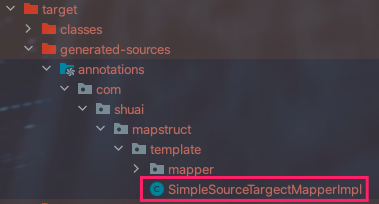

## 引言

神坑啊~~~

`问题:`

> 在一个大型项目中由于一个实体类需要在很多中场景应运，因此催生了各种POJO，例如 VO、PO、DAO等等。
>
> 并且我们会很频繁的去进行类型转。换例如：我们在获取到数据是为DAO 发送到前台时就需要转化为VO

`解决方案`

* 一般我们最容易想到的就是给VO 属性 依次赋值  
	* 对象有很多个属性时就很扯
* spring等框架提供的BeanUtils.copyProperties操作
	* 如果将用户实体实体类和角色实体类中字段共同  映射  为一个VO 就处理不了了
	* 如果转换类中属性不一致也处理不了
* Mapstruct
	* 解决了BeanUtils缺陷，功能更加的强大。


## 使用 -- 实体类属性一致

> Mapstruct 插件和lombok 插件有冲突 ，使用曲线救国 jar 依赖

1. idea 安装插件‘Mapstruct Support’

2. 添加依赖

	```xml
	<dependency>
	  <groupId>org.mapstruct</groupId>
	  <artifactId>mapstruct-processor</artifactId>
	  <version>1.3.0.Final</version>
	</dependency>
	<!-- 解决springboot 项目使用 lombok 插件后，添加 mapstruct  插件，maven 编译时 mapstruct 插件不起作用 -->
	<dependency>
	  <groupId>org.mapstruct</groupId>
	  <artifactId>mapstruct-jdk8</artifactId>
	  <version>1.3.0.Final</version>
	</dependency>
	```

	```xml
	<plugin>
	  <groupId>org.apache.maven.plugins</groupId>
	  <artifactId>maven-compiler-plugin</artifactId>
	  <version>3.8.1</version>
	  <configuration>
	    <source>1.8</source>
	    <target>1.8</target>
	    <encoding>UTF-8</encoding>
	    <annotationProcessorPaths>
	      <path>
	        <groupId>org.mapstruct</groupId>
	        <artifactId>mapstruct-processor</artifactId>
	        <version>1.3.0.Final</version>
	      </path>
	      <path>
	        <groupId>org.projectlombok</groupId>
	        <artifactId>lombok</artifactId>
	        <version>1.18.8</version>
	      </path>
	    </annotationProcessorPaths>
	  </configuration>
	</plugin>
	```

	

3. 实体类

	```java
	@Data
	public class SimpleSource {
	    private String name;
	    private String description;
	}
	
	@Data
	public class SimpleTarget {
	    private String name;
	    private String description;
	}
	```

4. 接口编写

	```java
	@Mapper
	public interface SimpleSourceTargectMapper {
	    SimpleSourceTargectMapper INSTANCES = Mappers.getMapper(SimpleSourceTargectMapper.class);
	    SimpleTarget sourceToTarget(SimpleSource source);
	    SimpleSource targetToSource(SimpleTarget target);
	}
	```

	

5. 测试

	```java
	public class Client {
	    @Test
	    public void test(){
	        SimpleSource source = new SimpleSource();
	        source.setName("source");
	        source.setDescription("source -- desc");
	        SimpleTarget simpleTarget = SimpleSourceTargectMapper.INSTANCES.sourceToTarget(source);
	        System.out.println(simpleTarget.toString());
	    }
	}
	```




> MapStruct 将接口进行实现，然后在实现类中进行对象属性赋值
>
> ```java
> @Override
> public SimpleTarget sourceToTarget(SimpleSource source) {
>   if ( source == null ) {
>     return null;
>   }
>   SimpleTarget simpleTarget = new SimpleTarget();
>   simpleTarget.setName( source.getName() );
>   simpleTarget.setDescription( source.getDescription() );
>   return simpleTarget;
> }
>  @Override
> public SimpleSource targetToSource(SimpleTarget target) {
>   if ( target == null ) {
>     return null;
>   }
>   SimpleSource simpleSource = new SimpleSource();
>   simpleSource.setName( target.getName() );
>   simpleSource.setDescription( target.getDescription() );
>   return simpleSource;
> }
> ```

## 使用 -- 实体类属性不一致

> 用户实体类  与   角色实体类  封装为一个 VO   并且摘取部分字段

1. 实体类

	```java
	@AllArgsConstructor
	@RequiredArgsConstructor
	@Data
	public class User {
	    @NonNull
	    private Long id;
	    @NonNull
	    private String username;
	    @NonNull
	    private String password;
	    @NonNull
	    private String phoneNum;
	    @NonNull
	    private String email;
	    private Role role;
	}
	```

	```java
	@AllArgsConstructor
	@Data
	public class Role {
	    private Long id;
	    private String roleName;
	    private String description;
	}
	```

	```java
	@Data
	public class UserRoleVo {
	    /**
	     * 用户id
	     */
	    private Long userId;
	    /**
	     * 用户名
	     */
	    private String name;
	    /**
	     * 角色名
	     */
	    private String roleName;
	}
	```

	

2. 映射接口

	```java
	@Mapper
	public interface UserRoleMapper {
	
	    /**
	     * 获取该类自动生成的实现类的实例
	     * 接口中的属性都是 public static final 的 方法都是public abstract的
	     */
	    UserRoleMapper INSTANCES = Mappers.getMapper(UserRoleMapper.class);
	
	    /**
	     * 这个方法就是用于实现对象属性复制的方法
	     *
	     * @Mapping 用来定义属性复制规则 source 指定源对象属性 target指定目标对象属性
	     *
	     * @param user 这个参数就是源对象，也就是需要被复制的对象
	     * @return 返回的是目标对象，就是最终的结果对象
	     */
	    @Mappings({
	            @Mapping(source = "id", target = "userId"),
	            @Mapping(source = "username", target = "name"),
	            @Mapping(source = "role.roleName", target = "roleName")
	    })
	    UserRoleVo toUserRoleDto(User user);
	  
	   /**
	     * 多个参数中的值绑定
	     * @param user 源1
	     * @param role 源2
	     * @return 从源1、2中提取出的结果
	     */
	    @Mappings({
	            @Mapping(source = "user.id", target = "userId"), // 把user中的id绑定到目标对象的userId属性中
	            @Mapping(source = "user.username", target = "name"), // 把user中的username绑定到目标对象的name属性中
	            @Mapping(source = "role.roleName", target = "roleName") // 把role对象的roleName属性值绑定到目标对象的roleName中
	    })
	    UserRoleVo toUserRoleDto(User user, Role role);
	  
	    	/*
	     * TODO <p> 为了下面的集合转换铺垫</p>
	     * @param brandList       
	     * @return java.util.List<BrandRespVo>
	     */
	    UserRoleVo entity2vo(User user);
	  
	      /*
	     * TODO <p> 集合转换 之前必须使用实体类进行转换</p>
	     * @param brandList       
	     * @return java.util.List<BrandRespVo>
	     */
	    List<UserRoleVo> entity2vo(List<User> users);
	}
	```

	> 映射 接口完全可以使用抽象类来替换  public abstract class UserRoleMapper

3. 测试

	```java
	public class UserRoleClient {
	    User user = null;
	
	    /**
	     * 模拟从数据库中查出user对象
	     */
	    @Before
	    public void before() {
	        Role role  = new Role(2L, "administrator", "超级管理员");
	        user  = new User(1L, "zhangsan", "12345", "17677778888", "123@qq.com", role);
	    }
	
	    /**
	     * 模拟通过MapStruct把user对象转换成UserRoleDto对象
	     */
	    @Test
	    public void testOneObj() {
	        UserRoleVo userRoleDto = UserRoleMapper.INSTANCES.toUserRoleDto(user);
	        System.out.println(userRoleDto);
	    }
	
	    /**
	     * 模拟通过MapStruct把user和role对象转换成UserRoleDto对象
	     */
	    @Test
	    public void testTwoObj() {
	        Role role = new Role(5466L, "role", "反倒是放假");
	        User user1 =new User(1000L, "user1", "1314","125165564", "2062544526@qq.com");
	        UserRoleVo userRoleDto = UserRoleMapper.INSTANCES.toUserRoleDto(user1,role);
	        System.out.println(userRoleDto);
	    }
	}
	```

	


## 坑

1. 需要插件

2. 和lombok冲突

3. 生成实现类后，修改 映射文件必须 mvn clear

4. 转化的类 最好加上有参无参注解  否则使用@Mappings 注解的时候莫名报错，提示 price 和 skuDefaultImg 找不到是否为 null

	```bash
	@AllArgsConstructor
	@NoArgsConstructor
	
	@Mappings({
	    @Mapping(source = "price" , target = "skuPrice"),
	    @Mapping(source = "skuDefaultImg" , target = "skuImg")
	})
	```

5. 每个微服务建议都添加如下，不然不知道啥时候lombok脑子就抽了不好用了。

	```xml
	<plugin>
	  <groupId>org.apache.maven.plugins</groupId>
	  <artifactId>maven-compiler-plugin</artifactId>
	  <version>3.8.1</version>
	  <configuration>
	    <source>1.8</source>
	    <target>1.8</target>
	    <encoding>UTF-8</encoding>
	    <annotationProcessorPaths>
	      <path>
	        <groupId>org.projectlombok</groupId>
	        <artifactId>lombok</artifactId>
	        <version>1.18.18</version>
	      </path>
	    </annotationProcessorPaths>
	  </configuration>
	</plugin>
	```
	
6. <font color=ff00aa>所有的坑 大概率是因为 之前1.3.0版本埋得坑，故而使用了曲线救国 jar包，导致能用但是坑很多。。</font>

    ```java
    ###################################### 此种引入方式会有很多坑。###################################
    ## todo 1  ： 引入曲线救国包    
    <dependency>
      <groupId>org.mapstruct</groupId>
      <artifactId>mapstruct-processor</artifactId>
      <version>1.3.0.Final</version>
    </dependency>
    <!-- 解决springboot 项目使用 lombok 插件后，添加 mapstruct  插件，maven 编译时 mapstruct 插件不起作用 -->
    <dependency>
      <groupId>org.mapstruct</groupId>
      <artifactId>mapstruct-jdk8</artifactId>
      <version>1.3.0.Final</version>
    </dependency>
    ## todo 2   ：  编译时加入包    
    <annotationProcessorPaths>
          <path>
            <groupId>org.mapstruct</groupId>
            <artifactId>mapstruct-processor</artifactId>
            <version>1.3.0.Final</version>
          </path>
          <path>
            <groupId>org.projectlombok</groupId>
            <artifactId>lombok</artifactId>
            <version>1.18.8</version>
        </path>
    </annotationProcessorPaths>         
    
    ########################################### 正确做法   ############################################
    ## todo 1  ：直接引入1.4.1版本
    <!-- https://mvnrepository.com/artifact/org.mapstruct/mapstruct -->
    <dependency>
        <groupId>org.mapstruct</groupId>
        <artifactId>mapstruct</artifactId>
        <version>1.4.1.Final</version>
    </dependency>    
    ## todo 2   ：  去掉上诉步骤一和步骤二    
    ```

    