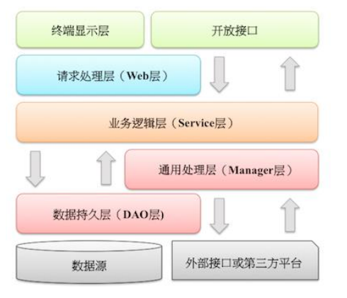
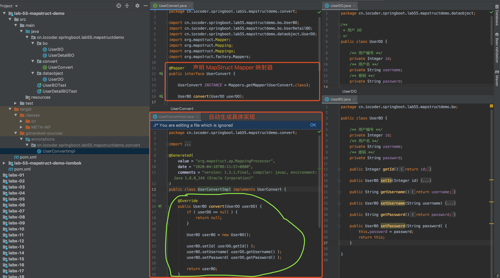
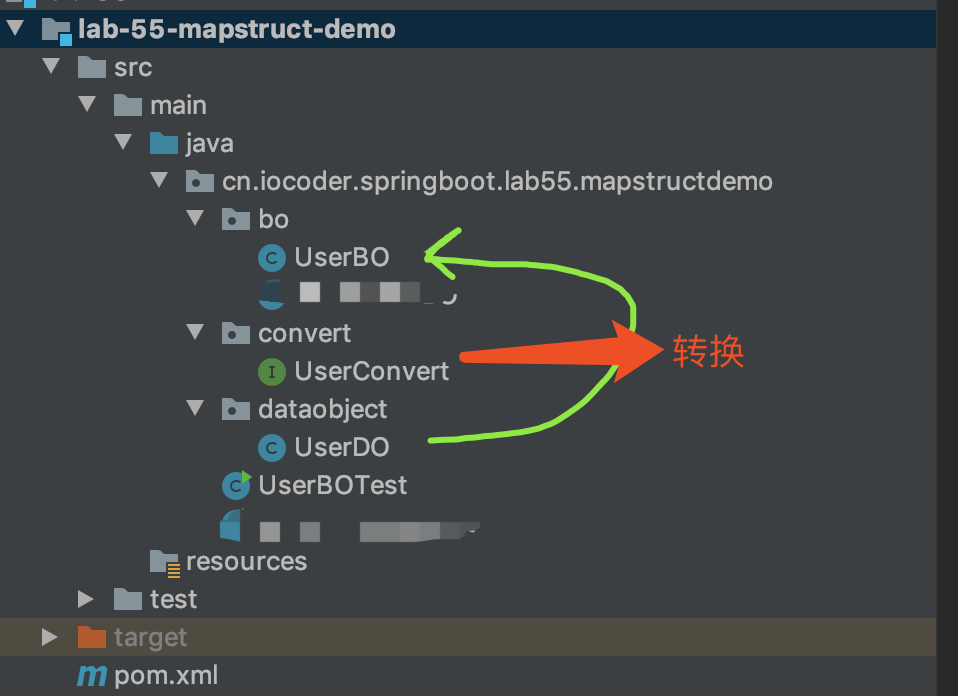
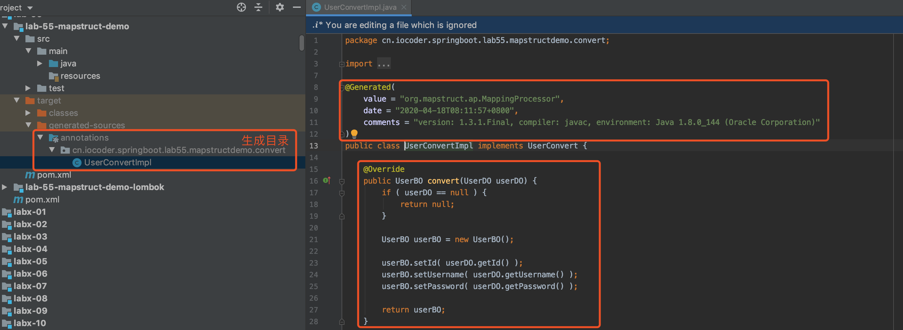
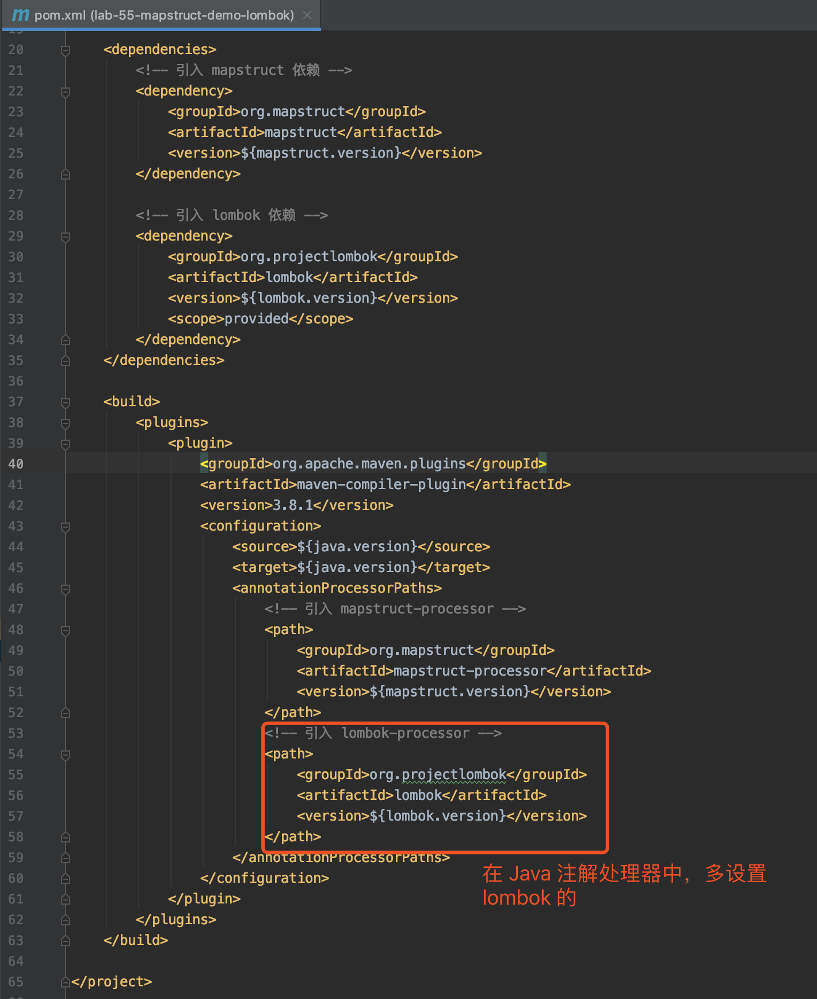
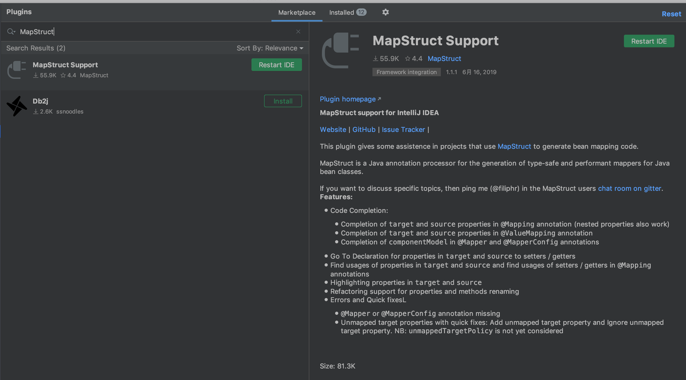
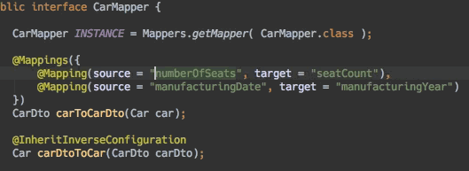
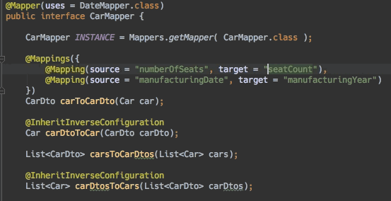
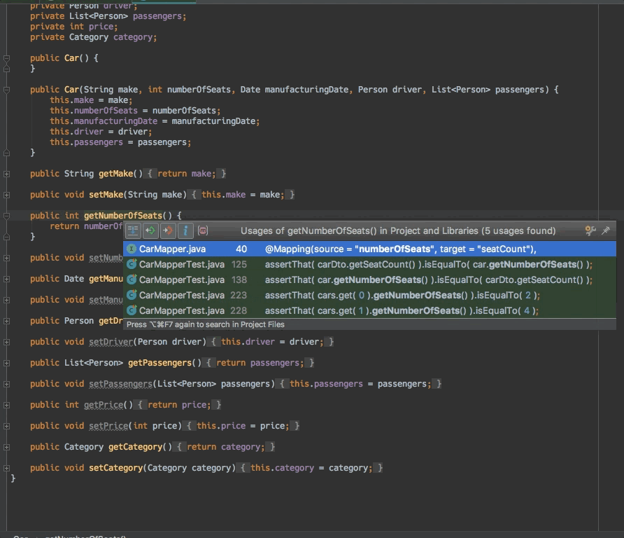

摘要: 原创出处 http://www.iocoder.cn/Spring-Boot/MapStruct/ 「芋道源码」欢迎转载，保留摘要，谢谢！

- [1. 概述](http://www.iocoder.cn/Spring-Boot/MapStruct/)
- [2. 快速入门](http://www.iocoder.cn/Spring-Boot/MapStruct/)
- [3. 集成 Lombok](http://www.iocoder.cn/Spring-Boot/MapStruct/)
- [4. @Mapping](http://www.iocoder.cn/Spring-Boot/MapStruct/)
- [5. IDEA MapStruct 插件](http://www.iocoder.cn/Spring-Boot/MapStruct/)
- [666. 彩蛋](http://www.iocoder.cn/Spring-Boot/MapStruct/)

------

------

> 本文在提供完整代码示例，可见 https://github.com/YunaiV/SpringBoot-Labs 的 [lab-55](https://github.com/YunaiV/SpringBoot-Labs/tree/master/lab-55) 目录。
>
> 原创不易，给点个 [Star](https://github.com/YunaiV/SpringBoot-Labs/stargazers) 嘿，一起冲鸭！

# 1. 概述

> 友情提示：MapStruct 和 Spring Boot 没有直接关系，单纯放在这个系列。

为了让应用的代码更易维护，我们往往会将项目进行分层。在[《阿里巴巴 Java 开发手册》](https://github.com/alibaba/p3c/blob/master/阿里巴巴Java开发手册（华山版）.pdf)中，推荐分层如下图：



分层之后，每一层都有自己的领域模型，即不同类型的 Bean：

- **DO**（Data Object）：与数据库表结构一一对应，通过DAO层向上传输数据源对象。
- **DTO**（Data Transfer Object）：数据传输对象，Service或Manager向外传输的对象。
- **BO**（Business Object）：业务对象。由Service层输出的封装业务逻辑的对象。
- 等等…

那么，进行就需要这些**对象的转换**。例如说：

```
// 从数据库中查询用户
UserDO userDO = userMapper.selectBy(id);

// 对象转换
UserBO userBO = new UserBO();
userBO.setId(userDO.getId());
userBO.setUsername(userDO.getUsername());
// ... 还有其它属性
```

显然，**手动**进行对象的转换，虽然**执行性能**很高，但是**开发效率**非常低下，且可能会存在漏写的情况。因此，我们会选择借助框架或是工具来实现对象的转换，例如说：

> 友情提示：如果胖友对如下工具的性能对比感兴趣，可以阅读 [Performance of Java Mapping Frameworks](https://www.baeldung.com/java-performance-mapping-frameworks) 文章。

- Spring BeanUtils
- Apache BeanUtils
- Dozer
- Orika
- MapStruct
- ModelMapper
- JMapper

艿艿个人比较喜欢 [MapStruct](https://mapstruct.org/)，原因是它基于 [JSR 269 的 Java 注解处理器](https://jcp.org/en/jsr/detail?id=269)，**自动生成**对象的代码，使用便捷，性能优秀。例如说：

- 通过创建一个 MapStruct **Mapper** 接口，并定义一个转换接口方法，后续交给 MapStruct 自动生成对象转换的代码即可。

如下是 MapStruct 的简介，胖友可以简单了解下：

> MapStruct 是用于生成类型安全的 Bean 映射类的 Java 注解处理器。
>
> 你所要做的就是定义一个映射器接口，声明任何需要映射的方法。在编译过程中，MapStruct 将生成该接口的实现。此实现使用**纯 Java 的方法调用源对象和目标对象之间进行映射，并非 Java 反射机制**。
>
> 与手工编写映射代码相比，MapStruct 通过生成冗长且容易出错的代码来节省时间。在配置方法的约定之后，MapStruct 使用了合理的默认值，但在配置或实现特殊行为时将不再适用。
>
> 与动态映射框架相比，MapStruct 具有以下优点：
>
> - 使用纯 Java 方法代替 Java 反射机制快速执行。
> - 编译时类型安全：只能映射彼此的对象和属性，不能映射一个 Order 实体到一个 Customer DTO 中等等。
> - 如果无法映射实体或属性，则在编译时清除错误报告。

# 2. 快速入门

> 示例代码对应仓库：[`lab-55-mapstruct-demo`](https://github.com/YunaiV/SpringBoot-Labs/blob/master/lab-55/lab-55-mapstruct-demo/) 。

本小节，我们来快速入门 MapStruct。新建 [lab-55-mapstruct-demo](https://github.com/YunaiV/SpringBoot-Labs/blob/master/lab-55/lab-55-mapstruct-demo/) 项目，作为示例项目，最终如下图所示：



## 2.1 引入依赖

创建 [`pom.xml`](https://github.com/YunaiV/SpringBoot-Labs/blob/master/lab-55/lab-55-mapstruct-demo/pom.xml) 文件，引入 MapStruct 相关依赖。

```java
<?xml version="1.0" encoding="UTF-8"?>
<project xmlns="http://maven.apache.org/POM/4.0.0"
         xmlns:xsi="http://www.w3.org/2001/XMLSchema-instance"
         xsi:schemaLocation="http://maven.apache.org/POM/4.0.0 http://maven.apache.org/xsd/maven-4.0.0.xsd">
    <parent>
        <artifactId>lab-55</artifactId>
        <groupId>cn.iocoder.springboot.labs</groupId>
        <version>1.0-SNAPSHOT</version>
    </parent>
    <modelVersion>4.0.0</modelVersion>

    <artifactId>lab-55-mapstruct-demo</artifactId>

    <properties>
        <java.version>1.8</java.version>
        <mapstruct.version>1.3.1.Final</mapstruct.version>
    </properties>

    <dependencies>
        <dependency>
            <groupId>org.mapstruct</groupId>
            <artifactId>mapstruct</artifactId>
            <version>${mapstruct.version}</version>
        </dependency>
    </dependencies>

    <build>
        <plugins>
            <plugin>
                <groupId>org.apache.maven.plugins</groupId>
                <artifactId>maven-compiler-plugin</artifactId>
                <version>3.8.1</version>
                <configuration>
                    <source>${java.version}</source>
                    <target>${java.version}</target>
                    <annotationProcessorPaths>
                        <path>
                            <groupId>org.mapstruct</groupId>
                            <artifactId>mapstruct-processor</artifactId>
                            <version>${mapstruct.version}</version>
                        </path>
                    </annotationProcessorPaths>
                </configuration>
            </plugin>
        </plugins>
    </build>

</project>
```

注意，一定要在 `maven-compiler-plugin` 插件中，声明 `mapstruct-processor` 为 JSR 269 的 Java 注解处理器。

## 2.2 UserDO

创建 [UserDO](https://github.com/YunaiV/SpringBoot-Labs/blob/master/lab-55/lab-55-mapstruct-demo/src/main/java/cn/iocoder/springboot/lab55/mapstructdemo/dataobject/UserDO.java) 类，用户 DO。代码如下：

```java
public class UserDO {

    /** 用户编号 **/
    private Integer id;
    /** 用户名 **/
    private String username;
    /** 密码 **/
    private String password;

    // ... 省略 setter/getter 方法
}
```

## 2.3 UserBO

创建 [UserBO](https://github.com/YunaiV/SpringBoot-Labs/blob/master/lab-55/lab-55-mapstruct-demo/src/main/java/cn/iocoder/springboot/lab55/mapstructdemo/bo/UserBO.java) 类，用户 BO。代码如下：

```java
public class UserBO {

    /** 用户编号 **/
    private Integer id;
    /** 用户名 **/
    private String username;
    /** 密码 **/
    private String password;

    // ... 省略 setter/getter 方法
}
```

## 2.4 UserConvert

创建 [UserConvert](https://github.com/YunaiV/SpringBoot-Labs/blob/master/lab-55/lab-55-mapstruct-demo/src/main/java/cn/iocoder/springboot/lab55/mapstructdemo/convert/UserConvert.java) 接口，作为 User 相关 Bean 的转换器。代码如下：

```java
@Mapper // <1>
public interface UserConvert {

    UserConvert INSTANCE = Mappers.getMapper(UserConvert.class); // <2>

    UserBO convert(UserDO userDO);

}
```

`<1>` 处，添加 [`@Mapper`](https://github.com/mapstruct/mapstruct/blob/master/core/src/main/java/org/mapstruct/Mapper.java) 注解，声明它是一个 MapStruct Mapper 映射器。

`<2>` 处，通过调用 [Mappers](https://github.com/mapstruct/mapstruct/blob/master/core/src/main/java/org/mapstruct/factory/Mappers.java) 的 `#getMapper(Class<T> clazz)` 方法，获得 MapStruct 帮我们**自动生成的 UserConvert 实现类**的对象。

`<3>` 处，定义 `#convert(UserDO userDO)` 方法，声明 UserDO 转换成 UserBO。后续，在我们每次编译该项目时，在如下目录可以看到自动生成的 UserConvert 实现类，可以用于 Debug 调试噢：



## 2.5 UserBOTest

创建 [UserBOTest](https://github.com/YunaiV/SpringBoot-Labs/blob/master/lab-55/lab-55-mapstruct-demo/src/main/java/cn/iocoder/springboot/lab55/mapstructdemo/UserBOTest.java) 类，进行简单测试。代码如下：

```java
public class UserBOTest {

    public static void main(String[] args) {
        // 创建 UserDO 对象
        UserDO userDO = new UserDO()
                .setId(1).setUsername("yudaoyuanma").setPassword("buzhidao");
        // <X> 进行转换
        UserBO userBO = UserConvert.INSTANCE.convert(userDO);
        System.out.println(userBO.getId());
        System.out.println(userBO.getUsername());
        System.out.println(userBO.getPassword());
    }

}
```

核心代码在 `<X>` 处，通过 UserConvert 将 UserDO 对象转换成 UserBO 对象。

运行 `#main(String[] args)` 方法，打印如下，符合预期：

```
1
yudaoyuanma
buzhidao
```

😈 至此，我们已经完成了 MapStruct 的快速入门。

# 3. 集成 Lombok

> 示例代码对应仓库：[`lab-55-mapstruct-demo-lombok`](https://github.com/YunaiV/SpringBoot-Labs/blob/master/lab-55/lab-55-mapstruct-demo-lombok/) 。

在[《芋道 Spring Boot 消除冗余代码 Lombok 入门》](http://www.iocoder.cn/Spring-Boot/Lombok/?self)文章中，我们学习了可以通过 Lombok 帮我们自动生成相对“冗余”代码，例如说 setter、getter 等等方法。

恰好，MapStruct 自动生成的对象转换的代码，也是依赖 setter、getter 方法的，因此两者在一起使用时，需要进行相应的配置。如下图所示：



下面，我们从[「2. 快速入门」](http://www.iocoder.cn/Spring-Boot/MapStruct/?self#)小节的 [`lab-55-mapstruct-demo`](https://github.com/YunaiV/SpringBoot-Labs/blob/master/lab-55/lab-55-mapstruct-demo/) 项目，复制出 [`lab-55-mapstruct-demo-lombok`](https://github.com/YunaiV/SpringBoot-Labs/blob/master/lab-55/lab-55-mapstruct-demo-lombok/) 来集成 Lombok 作为示例。

## 3.1 引入依赖

修改 [`pom.xml`](https://github.com/YunaiV/SpringBoot-Labs/blob/master/lab-55/lab-55-mapstruct-demo-lombok/pom.xml) 文件，额外引入 Lombok 相关依赖。

```xml
<?xml version="1.0" encoding="UTF-8"?>
<project xmlns="http://maven.apache.org/POM/4.0.0"
         xmlns:xsi="http://www.w3.org/2001/XMLSchema-instance"
         xsi:schemaLocation="http://maven.apache.org/POM/4.0.0 http://maven.apache.org/xsd/maven-4.0.0.xsd">
    <parent>
        <artifactId>lab-55</artifactId>
        <groupId>cn.iocoder.springboot.labs</groupId>
        <version>1.0-SNAPSHOT</version>
    </parent>
    <modelVersion>4.0.0</modelVersion>

    <artifactId>lab-55-mapstruct-demo-lombok</artifactId>

    <properties>
        <java.version>1.8</java.version>
        <mapstruct.version>1.3.1.Final</mapstruct.version>
        <lombok.version>1.18.12</lombok.version>
    </properties>

    <dependencies>
        <!-- 引入 mapstruct 依赖 -->
        <dependency>
            <groupId>org.mapstruct</groupId>
            <artifactId>mapstruct</artifactId>
            <version>${mapstruct.version}</version>
        </dependency>

        <!-- 引入 lombok 依赖 -->
        <dependency>
            <groupId>org.projectlombok</groupId>
            <artifactId>lombok</artifactId>
            <version>${lombok.version}</version>
            <scope>provided</scope>
        </dependency>
    </dependencies>

    <build>
        <plugins>
            <plugin>
                <groupId>org.apache.maven.plugins</groupId>
                <artifactId>maven-compiler-plugin</artifactId>
                <version>3.8.1</version>
                <configuration>
                    <source>${java.version}</source>
                    <target>${java.version}</target>
                    <annotationProcessorPaths>
                        <!-- 引入 mapstruct-processor -->
                        <path>
                            <groupId>org.mapstruct</groupId>
                            <artifactId>mapstruct-processor</artifactId>
                            <version>${mapstruct.version}</version>
                        </path>
                        <!-- 引入 lombok-processor -->
                        <path>
                            <groupId>org.projectlombok</groupId>
                            <artifactId>lombok</artifactId>
                            <version>${lombok.version}</version>
                        </path>
                    </annotationProcessorPaths>
                </configuration>
            </plugin>
        </plugins>
    </build>

</project>
```

## 3.2 UserDO

修改 [UserDO](https://github.com/YunaiV/SpringBoot-Labs/blob/master/lab-55/lab-55-mapstruct-demo-lombok/src/main/java/cn/iocoder/springboot/lab55/mapstructdemo/dataobject/UserDO.java) 类，使用 Lombok `@Data` 注解替代 setter、getter 方法。代码如下：

```java
@Data // 新增
@Accessors(chain = true)
public class UserDO {

    /** 用户编号 **/
    private Integer id;
    /** 用户名 **/
    private String username;
    /** 密码 **/
    private String password;

    // ... 删除 setter、getter 方法
}
```

## 3.3 UserBO

修改 [UserBO](https://github.com/YunaiV/SpringBoot-Labs/blob/master/lab-55/lab-55-mapstruct-demo-lombok/src/main/java/cn/iocoder/springboot/lab55/mapstructdemo/bo/UserBO.java) 类，使用 Lombok `@Data` 注解替代 setter、getter 方法。代码如下：

```java
@Data // 新增
@Accessors(chain = true)
public class UserDO {

    /** 用户编号 **/
    private Integer id;
    /** 用户名 **/
    private String username;
    /** 密码 **/
    private String password;

    // ... 删除 setter、getter 方法
}
```

## 3.4 UserBOTest

运行 [UserBOTest](https://github.com/YunaiV/SpringBoot-Labs/blob/master/lab-55/lab-55-mapstruct-demo-lombok/src/main/java/cn/iocoder/springboot/lab55/mapstructdemo/UserBOTest.java) 类的 运行 `#main(String[] args)` 方法，打印如下，符合预期：

```
1
yudaoyuanma
buzhidao
```

😈 至此，我们已经完成了 MapStruct 和 Lombok 的集成。

# 4. @Mapping

在对象转换时，我们可能会存在属性不是完全映射的情况，例如说**属性名**不同。此时，我们可以使用 MapStruct 提供的 [`@Mapping`](https://github.com/mapstruct/mapstruct/blob/master/core/src/main/java/org/mapstruct/Mapping.java) 注解，配置相应的映射关系。示例如下图：


下面，我们直接在 [「2. 快速入门」](http://www.iocoder.cn/Spring-Boot/MapStruct/?self#)小节的 [`lab-55-mapstruct-demo`](https://github.com/YunaiV/SpringBoot-Labs/blob/master/lab-55/lab-55-mapstruct-demo/) 项目，增加 `@Mapping` 注解的示例。

## 4.1 UserDetailBO

> 示例代码对应仓库：[`lab-55-mapstruct-demo`](https://github.com/YunaiV/SpringBoot-Labs/blob/master/lab-55/lab-55-mapstruct-demo/) 。

创建 [UserDetailBO](https://github.com/YunaiV/SpringBoot-Labs/blob/master/lab-55/lab-55-mapstruct-demo/src/main/java/cn/iocoder/springboot/lab55/mapstructdemo/bo/UserDetailBO.java) 类，用户明细 BO。代码如下：

```java
public class UserDetailBO {

    private Integer userId;

    // ... 省略 setter/getter 方法
}
```

## 4.2 UserConvert

修改 [UserConvert](https://github.com/YunaiV/SpringBoot-Labs/blob/master/lab-55/lab-55-mapstruct-demo/src/main/java/cn/iocoder/springboot/lab55/mapstructdemo/convert/UserConvert.java) 类，增加 `@Mapping` 注解的使用示例。代码如下：

```java
// UserConvert.java

@Mappings({
        @Mapping(source = "id", target = "userId")
})
UserDetailBO convertDetail(UserDO userDO);
```

- 其中，设置注解的 `source` 属性为 UserDO 的 `id` 属性，注解的 `target` 属性为 UserDetailBO 的 `userId` 属性。

`@Mapping` 注解还支持多个对象转换为一个对象。示例如下图：


## 4.3 UserDetailBOTest

创建 [UserDetailBOTest](https://github.com/YunaiV/SpringBoot-Labs/blob/master/lab-55/lab-55-mapstruct-demo/src/main/java/cn/iocoder/springboot/lab55/mapstructdemo/UserDetailBOTest.java) 类，进行简单测试。代码如下：

```java
public class UserDetailBOTest {

    public static void main(String[] args) {
        // 创建 UserDO 对象
        UserDO userDO = new UserDO()
                .setId(1).setUsername("yudaoyuanma").setPassword("buzhidao");
        // 进行转换
        UserDetailBO userDetailBO = UserConvert.INSTANCE.convertDetail(userDO);
        System.out.println(userDetailBO.getUserId());
    }

}
```

核心代码在 `<X>` 处，通过 UserConvert 将 UserDO 对象转换成 UserDetailBO 对象。

运行 `#main(String[] args)` 方法，打印如下，符合预期：

```
1
```

至此，我们已经完成 MapStruct 的 `@Mapping` 注解的学习。`@Mapping` 注解还有其它属性可以设置，提供非常强大的功能，胖友可以后续自己研究下。例如说 `qualifiedByName` 属性，可以自定义转换方法，如下图所示：


# 5. IDEA MapStruct 插件

MapStruct 提供了 [IDEA MapStruct Support](https://plugins.jetbrains.com/plugin/10036-mapstruct-support/) 插件，让我们在 IDEA 中，可以更愉快的使用 MapStruct，牛逼啊！



提供的具体功能，可以看下官方文档[《MapStruct support for IntelliJ IDEA》](https://mapstruct.org/news/2017-09-19-announcing-mapstruct-idea/)，例如说：

- Completion for Properties and Enum Constants：
- Go To Declaration from annotation：
- Find Usages：

# 666. 彩蛋

基本上，我们已经学习完了 MapStruct 的常用功能。如果想要更加深入，可以查看[《MapStruct 官方文档》](https://mapstruct.org/documentation/stable/reference/html/)，真的是**贼强大**哈。

另外，艿艿在 https://github.com/YunaiV/onemall 开源项目中，大量使用 MapStruct 来实现对象转换。具体的，胖友可以搜 **Convert** 结尾的类即可。