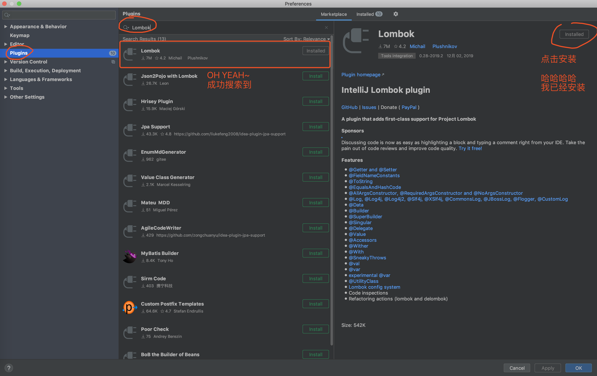
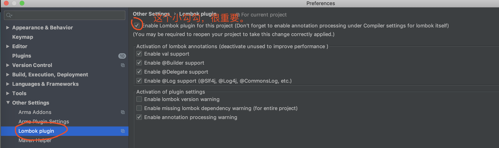
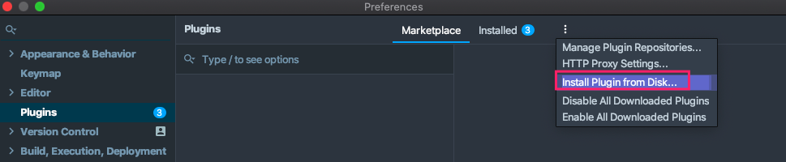
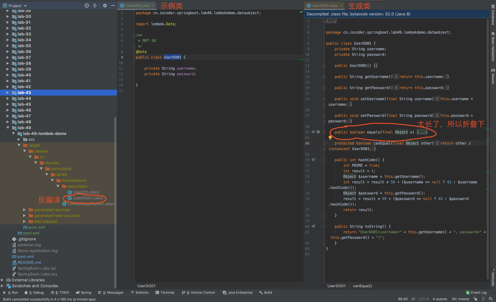
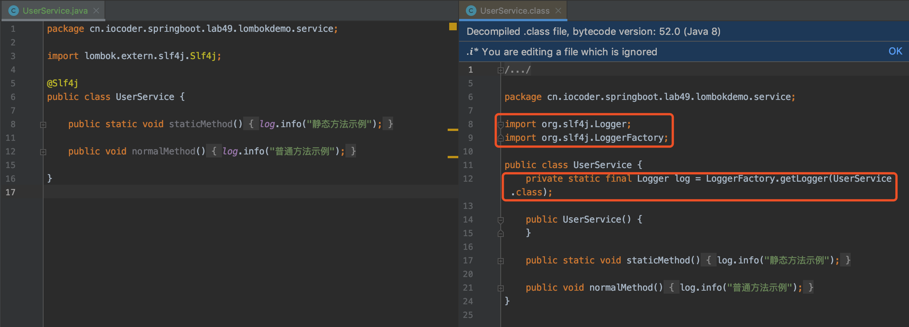
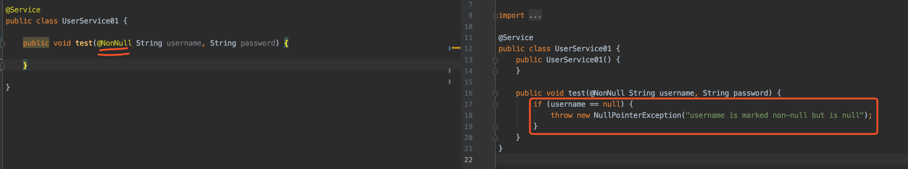
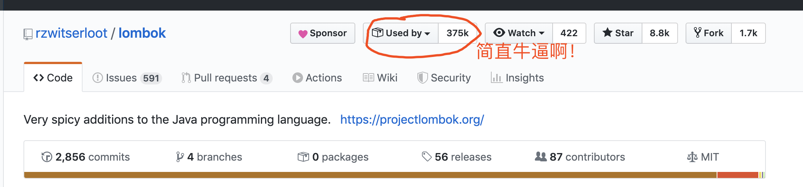

摘要: 原创出处 http://www.iocoder.cn/Spring-Boot/Lombok/ 「芋道源码」欢迎转载，保留摘要，谢谢！

- [1. 概述](http://www.iocoder.cn/Spring-Boot/Lombok/)
- [2. 实现原理](http://www.iocoder.cn/Spring-Boot/Lombok/)
- [3. 安装 Lombok](http://www.iocoder.cn/Spring-Boot/Lombok/)
- [4. 搭建示例项目](http://www.iocoder.cn/Spring-Boot/Lombok/)
- [5. Lombok 注解一览](http://www.iocoder.cn/Spring-Boot/Lombok/)
- [6. @Data 注解](http://www.iocoder.cn/Spring-Boot/Lombok/)
- [7. @Slf4j 注解](http://www.iocoder.cn/Spring-Boot/Lombok/)
- [8. @NonNull 注解](http://www.iocoder.cn/Spring-Boot/Lombok/)
- [666. 彩蛋](http://www.iocoder.cn/Spring-Boot/Lombok/)

------

------

> 本文在提供完整代码示例，可见 https://github.com/YunaiV/SpringBoot-Labs 的 [lab-49](https://github.com/YunaiV/SpringBoot-Labs/tree/master/lab-49) 目录。
>
> 原创不易，给点个 [Star](https://github.com/YunaiV/SpringBoot-Labs/stargazers) 嘿，一起冲鸭！

# 1. 概述

[Lombok](https://github.com/rzwitserloot/lombok) 是一个 Java 工具，通过使用其定义的注解，自动生成常见的冗余代码，提升开发效率。

举个例子，在 Java [POJO](https://baike.baidu.com/item/POJO) 类上，添加 `@Setter` 和 `@Getter` 注解，自动生成 set、get 方法的代码。示例如下：

```
// 我们编写的 UserDO.java 代码
@Setter
@Getter
public class UserDO {

    private String username;
    private String password;

}

// 实际生成的代码（通过 UserDO.class 反编译）
public class UserDO {
    private String username;
    private String password;

    public UserDO() {
    }

    public void setUsername(final String username) {
        this.username = username;
    }

    public void setPassword(final String password) {
        this.password = password;
    }

    public String getUsername() {
        return this.username;
    }

    public String getPassword() {
        return this.password;
    }
}
```

- 是不是灰常方便，嘿嘿~

# 2. 实现原理

Lombok 的实现原理，基于 [JSR269(Pluggable Annotation Processing API)](https://jcp.org/en/jsr/detail?id=269) 规范，自定义编译器注解处理器，用于在 Javac 编译阶段时，扫描使用到 Lombok 定义的注解的类，进行自定义的代码生成。

想要进一步深入了解的胖友，可以阅读如下文章：

- [《注解处理器是干嘛的》](http://www.iocoder.cn/Fight/What-does-the-annotation-handler-do/?self)
- [《JSR269 插件化注解API》](https://blog.whatakitty.com/JSR269插件化注解API.html)

# 3. 安装 Lombok

在 IDEA 中，已经提供了 [IntelliJ Lombok plugin](https://plugins.jetbrains.com/plugin/6317-lombok) 插件，方便我们使用 Lombok。安装方式很简单，只需要在 IDEA Plugins 功能中，搜索 Lombok 关键字即可。如下图所示：

安装完成，需要重启 IDEA 来让该插件生效。生效完成后，我们可以在 IDEA 的设置中，找到 IDEA Lombok 功能。如下图所示：

> 如果idea中网络访问慢的话，可以去下载插件zip版本和idea保持一致，然后选择 install from disks 安装



# 4. 搭建示例项目

可能会胖友好奇，为什么我们要把 Lombok 写在专栏呢？！确实，Lombok 不仅仅适用于 Spring Boot 项目。写在这里的原因，主要是想写一篇关于 Lombok 的文章，又不知道放在哪里才好，索性就放在这里了。

> 这就艿艿无处安放的青春，转眼之间就到 30 岁了~

另外，艿艿在 [Spring Initializr](https://start.spring.io/)工具中，竟然看到 Lombok 依赖的选择，这是不是意味着 Spring 也推荐我们使用它呢？如下图所示：[Spring Initializr](http://www.iocoder.cn/images/Spring-Boot/2019-02-04/03.png)

在 Maven 项目的 `pom` 文件，我们只需要引入 [`lombok`](https://mvnrepository.com/artifact/org.projectlombok/lombok) 依赖，就可以使用 Lombok 啦。代码如下：

```xml
<!-- 引入 Lombok 依赖 -->
<dependency>
    <groupId>org.projectlombok</groupId>
    <artifactId>lombok</artifactId>
    <optional>true</optional>
</dependency>
```

具体的示例项目搭建，就是一个普通的项目，就不重复赘述啦。本文所有示例的代码，都会放在 [lab-49-lombok-demo](https://github.com/YunaiV/SpringBoot-Labs/blob/master/lab-49/lab-49-lombok-demo/) 项目中。

# 5. Lombok 注解一览

Lombok 的注解非常多，我们逐个来看看。

[`@Getter`](https://github.com/rzwitserloot/lombok/blob/master/src/core/lombok/Getter.java) 注解，添加在**类**或**属性**上，生成对应的 get 方法。

[`@Setter`](https://github.com/rzwitserloot/lombok/blob/master/src/core/lombok/Setting.java) 注解，添加在**类**或**属性**上，生成对应的 set 方法。

[`@ToString`](https://github.com/rzwitserloot/lombok/blob/master/src/core/lombok/ToString.java) 注解，添加在**类**上，生成 toString 方法。

[`@EqualsAndHashCode`](https://github.com/rzwitserloot/lombok/blob/master/src/core/lombok/EqualsAndHashCode.java) 注解，添加在**类**上，生成 equals 和 hashCode 方法。

`@AllArgsConstructor`、`@RequiredArgsConstructor`、`@NoArgsConstructor` 注解，添加在**类**上，为类自动生成对应参数的构造方法。

`@RequiredArgsConstructor` 搭配 ` @NonNull` 以及 final 来使用，如下代码：

```java
@RequiredArgsConstructor
public class User {
    private final String gender;
    @NonNull
    private String username;
    private String password;
}

// 编译后：
public class User {
    private final String gender;
    @NonNull
    private String username;
    private String password;

    public User(String gender, @NonNull String username) {
        if (username == null) {
            throw new NullPointerException("username is marked @NonNull but is null");
        } else {
            this.gender = gender;
            this.username = username;
        }
    }
}

```

[`@Data`](https://github.com/rzwitserloot/lombok/blob/master/src/core/lombok/Data.java) 注解，添加在**类**上，是 5 个 Lombok 注解的组合。

- 为所有属性，添加 `@Getter`、`@ToString`、`@EqualsAndHashCode` 注解的效果
- 为非 `final` 修饰的属性，添加 `@Setter` 注解的效果
- 为 `final` 修改的属性，添加 `@RequiredArgsConstructor` 注解的效果

`@Value` 注解，添加在**类**上，和 `@Data` 注解类似，区别在于它会把所有属性默认定义为 `private final` 修饰，所以不会生成 set 方法。

[`@CommonsLog`](https://github.com/rzwitserloot/lombok/blob/master/src/core/lombok/extern/apachecommons/CommonsLog.java)、[`@Flogger`](https://github.com/rzwitserloot/lombok/blob/master/src/core/lombok/extern/flogger/Flogger.java)、[`@Log`](https://github.com/rzwitserloot/lombok/blob/master/src/core/lombok/extern/java/Log.java)、[`@JBossLog`](https://github.com/rzwitserloot/lombok/blob/master/src/core/lombok/extern/jbosslog/JBossLog.java)、[@Log4j](https://github.com/rzwitserloot/lombok/blob/master/src/core/lombok/extern/log4j/Log4j.java)、[@Log4j2](https://github.com/rzwitserloot/lombok/blob/master/src/core/lombok/extern/log4j/Log4j2.java)、[@Slf4j](https://github.com/rzwitserloot/lombok/blob/master/src/core/lombok/Slf4j.java)、[@Slf4jX](https://github.com/rzwitserloot/lombok/blob/master/src/core/lombok/Slf4jX.java) 注解，添加在**类**上，自动为类添加对应的日志支持。

`@NonNull` 注解，添加在**方法参数**、**类属性**上，用于自动生成 `null` 参数检查。若确实是 `null` 时，抛出 NullPointerException 异常。

`@Cleanup` 注解，添加在方法中的**局部变量**上，在作用域结束时会自动调用 `#close()` 方法，来释放资源。例如说，使用在 Java IO 流操作的时候。

`@Builder` 注解，添加在**类**上，给该类加个构造者模式 Builder 内部类。

`@Synchronized` 注解，添加在**方法**上，添加同步锁。

`@SneakyThrows` 注解，添加在**方法**上，给该方法添加 `try catch` 代码块。

`@Accessors` 注解，添加在**方法**或**属性**上，并设置 `chain = true`，实现链式编程。

下面，我们在 Spring Boot 示例项目中，使用下 `@Data` 和 `@Slf4j`、`@NonNull` 这三个 Lombok 常用注解。

# 6. @Data 注解

[`@Data`](https://github.com/rzwitserloot/lombok/blob/master/src/core/lombok/Data.java) 注解，添加在**类**上，是 5 个 Lombok 注解的组合。

- 为所有属性，添加 `@Getter`、`@ToString`、`@EqualsAndHashCode` 注解的效果
- 为非 `final` 修饰的属性，添加 `@Setter` 注解的效果
- 为 `final` 修改的属性，添加 `@RequiredArgsConstructor` 注解的效果

创建示例类 [UserDO01](https://github.com/YunaiV/SpringBoot-Labs/blob/master/lab-49/lab-49-lombok-demo/src/main/java/cn/iocoder/springboot/lab49/lombokdemo/dataobject/UserDO01.java)，演示 `@Data` 注解的使用。如下图所示：

> 友情提示：生成的 class 类，需要手动编译下项目，才能看到对应的类，之后进行反编译。

不过要注意，如果使用 `@Data` 注解的类，继承成了其它父类的属性，最好额外添加 `@ToString(callSuper = true)` 和 `@EqualsAndHashCode(callSuper = true)` 注解。

- 因为默认情况下，`@Data` 注解不会处理父类的属性。所以需要我们通过 `callSuper = true` 属性，声明需要调用父类对应的方法。
- 这个情况非常常见，例如说在实体类中，我们可能会声明一个抽象父类 AbstractEntity，而该类里有一个 `id` 编号属性。

# 7. @Slf4j 注解

[`@Slf4j`](https://github.com/rzwitserloot/lombok/blob/master/src/core/lombok/Slf4j.java) 注解，添加在**类**上，给该类创建 yLogger **静态**属性。

日志的使用可以观看[ Spring Boot日志框架介绍 ]()

创建示例类 [UserService](https://github.com/YunaiV/SpringBoot-Labs/blob/master/lab-49/lab-49-lombok-demo/src/main/java/cn/iocoder/springboot/lab49/lombokdemo/service/UserService.java)，演示 `@Slf4` 注解的使用。如下图所示：

Lombok 还提供了 [`@CommonsLog`](https://github.com/rzwitserloot/lombok/blob/master/src/core/lombok/extern/apachecommons/CommonsLog.java)、[`@Flogger`](https://github.com/rzwitserloot/lombok/blob/master/src/core/lombok/extern/flogger/Flogger.java)、[`@Log`](https://github.com/rzwitserloot/lombok/blob/master/src/core/lombok/extern/java/Log.java)、[`@JBossLog`](https://github.com/rzwitserloot/lombok/blob/master/src/core/lombok/extern/jbosslog/JBossLog.java)、[@Log4j](https://github.com/rzwitserloot/lombok/blob/master/src/core/lombok/extern/log4j/Log4j.java)、[@Log4j2](https://github.com/rzwitserloot/lombok/blob/master/src/core/lombok/extern/log4j/Log4j2.java)、[@Slf4jX](https://github.com/rzwitserloot/lombok/blob/master/src/core/lombok/Slf4jX.java) 注解，支持持不同的 Logger 组件。因为 Spring Boot 使用 Slf4j 日志门面框架，所以绝大多数情况下，我们都是使用 `@Slf4j` 注解。

> 友情提示：对如何在 Spring Boot 是使用日志组件感兴趣的胖友，可以阅读[《芋道 Spring Boot 日志集成 Logging 入门》](http://www.iocoder.cn/Spring-Boot/Logging/?self)文章。

# 8. @NonNull 注解

[`@NonNull`](https://github.com/rzwitserloot/lombok/blob/master/src/core/lombok/NonNull.java) 注解，添加在**方法参数**、**类属性**上，用于自动生成 `null` 参数检查。若确实是 `null` 时，抛出 NullPointerException 异常。

创建示例类 [UserService01](https://github.com/YunaiV/SpringBoot-Labs/blob/master/lab-49/lab-49-lombok-demo/src/main/java/cn/iocoder/springboot/lab49/lombokdemo/service/UserService01.java)，演示 `@NonNull` 注解的使用。如下图所示：

# 666. 彩蛋

至此，我们已经完成了 Lombok 的学习。如果胖友在项目中还没使用，可以考虑下哟。嘿嘿，看了下 Lombok 竟然在 Github 上，被 37W+ 开源项目所使用。如下图所示：

更多 Lombok 的使用示例，胖友可以继续阅读如下两篇文章：

- [《Lombok 安装及Spring Boot 集成 Lombok》](http://www.iocoder.cn/Fight/Lombok-installation-and-Spring-Boot-integration-with-Lombok/?self)
- [《Lombok 官方文档 —— 功能列表》](https://projectlombok.org/features/all)

