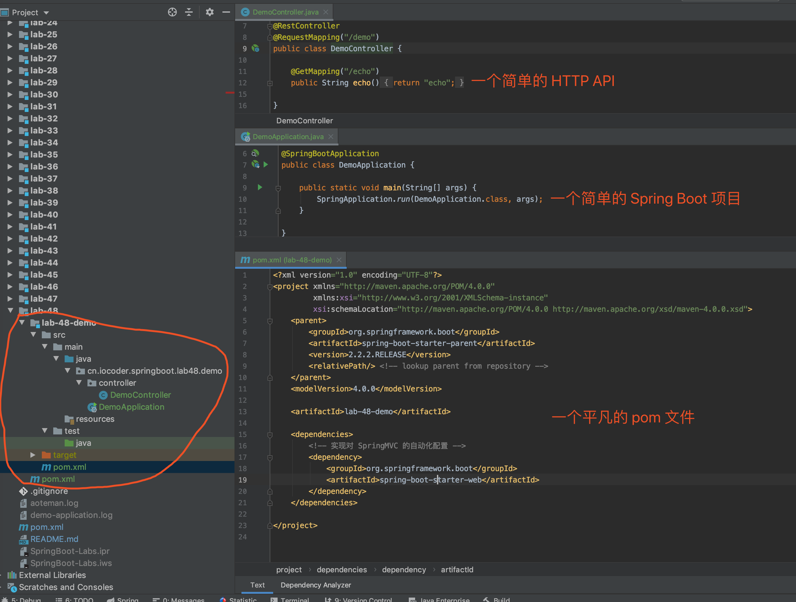

摘要: 原创出处 http://www.iocoder.cn/Spring-Boot/hot-swap/ 「芋道源码」欢迎转载，保留摘要，谢谢！

- [1. 概述](http://www.iocoder.cn/Spring-Boot/hot-swap/)
- [2. spring-boot-devtools](http://www.iocoder.cn/Spring-Boot/hot-swap/)
- [3. IDEA 热部署](http://www.iocoder.cn/Spring-Boot/hot-swap/)
- [4. Jrebel](http://www.iocoder.cn/Spring-Boot/hot-swap/)
- [666. 彩蛋](http://www.iocoder.cn/Spring-Boot/hot-swap/)

------

------

> 本文在提供完整代码示例，可见 https://github.com/YunaiV/SpringBoot-Labs 的 [lab-48-hot-swap](https://github.com/YunaiV/SpringBoot-Labs/tree/master/lab-48-hot-swap) 目录。
>
> 原创不易，给点个 [Star](https://github.com/YunaiV/SpringBoot-Labs/stargazers) 嘿，一起冲鸭！

# 1. 概述

在日常开发中，我们需要经常修改 Java 代码，手动重启项目，查看修改后的效果。如果在项目小时，重启速度比较快，等待的时间是较短的。但是随着项目逐渐变大，重启的速度变慢，等待时间 1-2 min 是比较常见的。

这样就导致我们开发效率降低，影响我们的下班时间，哈哈哈~那么是否有方式能够实现，在我们修改完 Java 代码之后，能够不重启项目呢？

答案是有的，通过**热部署**的方式。并且实现的方式还是非常多，艿艿在本文就会为胖友一一展示。

> 旁白君：严格来说，应该叫 HotSwap 的方式，翻译成中文会有热部署、热更新、热替换、热加载等等多种。这里，我们就采用大家可能说的比较多的翻译，**热部署**。

为了演示方便，胖友可以参考 [lab-48-demo](https://github.com/YunaiV/SpringBoot-Labs/tree/master/lab-48-hot-swap/lab-48-demo) 项目，搭建一个简单的 Spring Boot 项目，提供了一个简单的 HTTP API。如下图所示：

> 友情提示：不要直接通过克隆 https://github.com/YunaiV/SpringBoot-Labs 来使用该项目，实在太大了！

并且，我们下面我们所有的演示，都是在宇宙无敌 Java 开发工具 [IDEA](https://www.jetbrains.com/) 中进行。

# 2. spring-boot-devtools

[`spring-boot-devtools`](https://github.com/spring-projects/spring-boot/tree/master/spring-boot-project/spring-boot-devtools) 是 Spring Boot 提供的开发者工具，它会监控当前应用所在的 classpath 下的文件发生变化，进行**自动重启**。

注意，`spring-boot-devtools` 并**没有**采用热部署的方式，而是一种较快的重启方式。其官方文档解释如下：

> FROM [《Spring Boot 2.X 中文文档 —— 开发者工具》](https://docshome.gitbooks.io/springboot/content/pages/using-spring-boot.html#using-boot-devtools-restart)
>
> Spring Boot 通过使用两个类加载器来提供了重启技术。
>
> - 不改变的类（例如，第三方 jar）被加载到 **base** 类加载器中。
> - 经常处于开发状态的类被加载到 **restart** 类加载器中。
>
> 当应用重启时，**restart** 类加载器将被丢弃，并重新创建一个新的。这种方式意味着应用重启比**冷启动**要快得多，因为省去 **base** 类加载器的处理步骤，并且可以直接使用。
>
> 如果您觉得重启还不够快，或者遇到类加载问题，您可以考虑如 ZeroTurnaround 的 [JRebel](https://zeroturnaround.com/software/jrebel/) 等工具。他们是通过在加载类时重写类来加快重新加载。

在项目中，我们需要在 `pom.xml` 中，引入 `spring-boot-devtools` 依赖如下：

```xml
<dependency>
    <groupId>org.springframework.boot</groupId>
    <artifactId>spring-boot-devtools</artifactId>
    <optional>true</optional> <!-- 可选 -->
</dependency>
```

## 2.1 演示

下面，我们来演示下 `spring-boot-devtools` 的使用。

① Run 或者 Debug 运行 Spring Boot 应用。

使用浏览器，访问 http://127.0.0.1:8080/demo/echo 接口，返回结果为 `"echo"`。

② 修改 DemoController 的 `#echo()` 方法，设置返回值为 `"none"`。

**【关键】** 我们现在仅仅需要修改了 Java 代码，需要重新编译下代码。点击 IDEA 的菜单 `Build` -> `Build Project`，**手动**进行编译。如下图所示：

> 友情提示：如果胖友嫌弃鼠标操作太慢，可以使用 `Build Project` 的快捷键：
>
> - Mac：Command + F9
> - Windows：Ctrl + F9

此时，IDEA 控制台会看到 Spring Boot 重新启动的日志如下：

```
2020-02-09 09:22:52.082  INFO 36495 --- [      Thread-10] o.s.s.concurrent.ThreadPoolTaskExecutor  : Shutting down ExecutorService 'applicationTaskExecutor'

  .   ____          _            __ _ _
 /\\ / ___'_ __ _ _(_)_ __  __ _ \ \ \ \
( ( )\___ | '_ | '_| | '_ \/ _` | \ \ \ \
 \\/  ___)| |_)| | | | | || (_| |  ) ) ) )
  '  |____| .__|_| |_|_| |_\__, | / / / /
 =========|_|==============|___/=/_/_/_/
 :: Spring Boot ::        (v2.2.4.RELEASE)

2020-02-09 09:22:52.195  INFO 36495 --- [  restartedMain] cn.iocoder.demo03.Demo03Application      : Starting Demo03Application on MacBook-Pro-8 with PID 36495 (/Users/yunai/Downloads/demo03/target/classes started by yunai in /Users/yunai/Downloads/demo03)
2020-02-09 09:22:52.195  INFO 36495 --- [  restartedMain] cn.iocoder.demo03.Demo03Application      : No active profile set, falling back to default profiles: default
2020-02-09 09:22:52.335  INFO 36495 --- [  restartedMain] o.s.b.w.embedded.tomcat.TomcatWebServer  : Tomcat initialized with port(s): 8080 (http)
2020-02-09 09:22:52.336  INFO 36495 --- [  restartedMain] o.apache.catalina.core.StandardService   : Starting service [Tomcat]
2020-02-09 09:22:52.336  INFO 36495 --- [  restartedMain] org.apache.catalina.core.StandardEngine  : Starting Servlet engine: [Apache Tomcat/9.0.30]
2020-02-09 09:22:52.342  INFO 36495 --- [  restartedMain] o.a.c.c.C.[Tomcat].[localhost].[/]       : Initializing Spring embedded WebApplicationContext
2020-02-09 09:22:52.342  INFO 36495 --- [  restartedMain] o.s.web.context.ContextLoader            : Root WebApplicationContext: initialization completed in 145 ms
2020-02-09 09:22:52.382  INFO 36495 --- [  restartedMain] o.s.s.concurrent.ThreadPoolTaskExecutor  : Initializing ExecutorService 'applicationTaskExecutor'
2020-02-09 09:22:52.409  INFO 36495 --- [  restartedMain] o.s.b.d.a.OptionalLiveReloadServer       : LiveReload server is running on port 35729
2020-02-09 09:22:52.418  INFO 36495 --- [  restartedMain] o.s.b.w.embedded.tomcat.TomcatWebServer  : Tomcat started on port(s): 8080 (http) with context path ''
2020-02-09 09:22:52.419  INFO 36495 --- [  restartedMain] cn.iocoder.demo03.Demo03Application      : Started Demo03Application in 0.244 seconds (JVM running for 169.162)
2020-02-09 09:22:52.420  INFO 36495 --- [  restartedMain] .ConditionEvaluationDeltaLoggingListener : Condition evaluation unchanged
```

- 😈 所以 `spring-boot-devtools` 真的不是热部署，而是更快的重启方式。

使用浏览器，再次访问 `http://127.0.0.1:8080/demo/echo` 接口，返回结果为 `"none"`，成功！

> 咳咳咳，下面我们来讲解下**自动编译**。艿艿自己尝试了，亲测**失败**。例如说 [《IDEA 配置 Spring Boot 热更新，无需手动按 ctrl+F9》](https://blog.csdn.net/com3294/article/details/79104513) 文章。看了下评论，貌似其它人也存在失败的情况。
>
> 反正这里也写下步骤，胖友可以自己尝试一波~万一成功了，请一定留言，我好找找具体原因。

③ 可能有胖友会觉得**手动** `Build Project` 有点麻烦，IDEA 还提供的**自动编译**的选项。设置方式，点击 IDEA 的菜单 `IntelliJ IDEA` -> `Preference...`，然后选择 `Compiler` 选项卡，将 `Build project automatically` 勾选上。如下图所示：

> 友情提示：注意，`Build project automatically` 后面的一行提示，自动编译仅在项目**不处于运行**，或者处于 **Debug 运行中**时，才会自动生效。

所以一定要 **Debug** 运行 Spring Boot 项目。具体的效果，胖友自己重复 ① ② 两个步骤，自己尝试下。

另外，网上我们会看到教程，建议将 `compiler.automake.allow.when.app.running` 勾选上。

- 原因是，自动编译在 **Running 运行中**默认是不生效的，通过勾选上 `compiler.automake.allow.when.app.running`，允许在 **Running 运行中**也生效。
- 个人建议的话，不要勾选。如果 **Running 运行中**修改了代码，也会导致热部署，不太合适。如果真要热部署，使用 **Debug 运行项目**更合理。

## 2.2 结论

因为 `spring-boot-devtools` 提供的本质是**重启**的方式，所以还是会存在我们在文章开头所提到的问题。不过不要慌，实际上 IDEA 自带了热部署的方式，毕竟是宇宙第一 Java 开发工具，吹爆就完事了。

# 3. IDEA 热部署

> 友情提示：如果胖友看了[「2. spring-boot-devtools」](http://www.iocoder.cn/Spring-Boot/hot-swap/?self#)小节，并进行了相关操作，请全部复原，特别是去掉 `spring-boot-devtools` 依赖。

IDEA 提供了 [HotSwap](https://www.jetbrains.com/help/idea/debugger-hotswap.html) 插件，可以实现真正的热部署。如下图所示：

## 3.1 演示

下面，我们来演示下 HotSwap 插件的使用。

① Run 或者 Debug 运行 Spring Boot 应用。

使用浏览器，访问 http://127.0.0.1:8080/demo/echo 接口，返回结果为 `"echo"`。

② 修改 DemoController 的 `#echo()` 方法，设置返回值为 `"none"`。

**【关键】** 我们现在仅仅需要修改了 Java 代码，需要重新编译下代码。点击 IDEA 的菜单 `Build` -> `Build Project`，**手动**进行编译。如下图所示：

> 友情提示：如果胖友嫌弃鼠标操作太慢，可以使用 `Build Project` 的快捷键：
>
> - Mac：Command + F9
> - Windows：Ctrl + F9

此时，我们在 IDEA 中可以看修改的类被重载的提示。如下图所示：

使用浏览器，再次访问 `http://127.0.0.1:8080/demo/echo` 接口，返回结果为 `"none"`，成功！

③ 尝试将 `Build project automatically` 勾选上，希望实现自动编译，再搭配上 HotSwap 插件的热部署，岂不是更香？！

结果**失败**，和[「2.1 演示」](http://www.iocoder.cn/Spring-Boot/hot-swap/?self#)出现一样的问题，略微蛋疼。

这里我们来换一种方式，也能实现自动编译。操作步骤如下图：

- 要注意，需要**焦点**从 IDEA 离开。例如说，在我们修改完接口的代码之后，可能会切换到浏览器或者 Postman 对该接口进行测试，此时 IDEA 就会自动更新代码和资源，进行热部署。

现在，我们来 修改 DemoController 的 `#echo()` 方法，设置返回值为 `"todo"`。

切换到浏览器再赶紧切换到 IDEA 中，以达到 IDEA **失去焦点**的效果。我们在 IDEA 中可以看修改的类被重载的提示。如下图所示：

使用浏览器，再次访问 `http://127.0.0.1:8080/demo/echo` 接口，返回结果为 `"todo"`，成功！

## 3.2 结论

艿艿个人的喜好的话，使用 IDEA 热部署为主，通过快捷键来**手动**编译。毕竟，我是一个“**主动**”的人，默默开一波车，哈哈哈。

当然，不是说**自动**编译有什么不好，只是每个人的选择。具体的，胖友可以都试试，寻找一个自己喜欢的方式。

# 4. Jrebel

[Jrebel](https://www.jrebel.com/) 是比较有名的一款 Java 热部署插件。

因为 IDEA 自带的 HotSwap 插件已经能够满足我们的热部署的诉求，所以本文也不多哔哔啥了。真的感兴趣的胖友，可以看看[《IDEA JRebel 插件热部署（史上最全）》](http://www.iocoder.cn/Fight/IDEA-JRebel-plug-in-hot-deployment/?self)文章。不过，必要性不大，嘿嘿。

# 666. 彩蛋

至此，我们已经完成了 Spring Boot 热部署的入门。咳咳咳，相信胖友们通过使用热部署，一定能提高开发效率，写更多的代码，出更多的 BUG，加更多的班。

没毛病，奥利给，干就完事了！