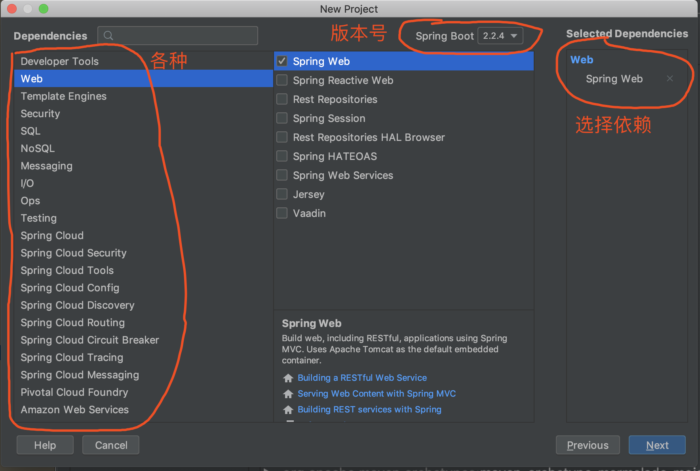

摘要: 原创出处 http://www.iocoder.cn/Spring-Boot/quick-start/ 「芋道源码」欢迎转载，保留摘要，谢谢！

- [1. 概述](http://www.iocoder.cn/Spring-Boot/quick-start/)
- [2. 快速入门](http://www.iocoder.cn/Spring-Boot/quick-start/)
- [3. Spring Initializr](http://www.iocoder.cn/Spring-Boot/quick-start/)
- [4. IDEA x Spring Initializr](http://www.iocoder.cn/Spring-Boot/quick-start/)
- [666. 彩蛋](http://www.iocoder.cn/Spring-Boot/quick-start/)

------

------

> 本文在提供完整代码示例，可见 https://github.com/YunaiV/SpringBoot-Labs
>
> 原创不易，给点个 [Star](https://github.com/YunaiV/SpringBoot-Labs/stargazers) 嘿，一起冲鸭！

# 1. 概述

我们先来简单了解下 [Spring Boot](https://spring.io/projects/spring-boot/) 是什么？其官方介绍自己如下：

> FROM [《Spring 中文文档 —— Spring Boot 简介》](https://docshome.gitbooks.io/springboot/content/pages/getting-started.html#getting-started-introducing-spring-boot)
>
> **使用 Spring Boot 可以很容易地创建出能直接运行的独立的、生产级别的基于 Spring 的应用。** 我们对 Spring 平台和第三方类库有自己的考虑，因此您可以从最基本的开始。**大多数 Spring Boot 应用只需要很少的 Spring 配置。**
>
> 您可以使用 Spring Boot 来创建一个可以使用 `java -jar` 命令来运行或者基于传统的 war 包部署的应用程序。我们还提供了一个用于运行 spring scripts 的命令行工具。
>
> 我们的主要目标是：
>
> - 为所有 Spring Boot 开发提供一个更快、更全面的入门体验。
> - 坚持自我虽好，但当需求出现偏离，您需要能迅速摆脱出来。
> - 提供大量非功能性特性相关项目（例如：内嵌服务器、安全、指标、健康检查、外部配置)。
> - 绝对没有代码生成，也不要求 XML 配置。

是不是看着有点懵逼？重点先理解是**加粗**的两句话。简单来说，通过使用 Spring Boot，我们无需再进行大量的 Spring 配置，只需要少量甚至零配置。

可能这么说还是有点抽象，我们直接来动手，奥利给，干就完事了！

# 2. 快速入门

本小节，我们搭建 Spring Boot 示例项目，并在其中使用 SpringMVC 来提供一个简单的 HTTP API。

在开始搭建示例项目之前，胖友需要先做好如下准备：

- JDK8+

	> 友情提示：Spring Boot 2.X 版本，需要最低的 Java 版本是 8。

- Maven

	> 本文希望胖友对 Maven 构建工具有过一定的了解。如果没有的话，可以看看[《Maven最全教程，看了必懂》](http://www.iocoder.cn/Fight/Maven-most-complete-tutorial-read-must-understand/?self)文章。

- [IDEA](https://www.jetbrains.com/)

	> 宇宙最强 Java 开发者工具，没有之一。

## 2.1 创建 Maven 项目

① 打开 IDEA，点击菜单 `File` -> `New` -> `Project...` 来创建项目。如下图所示：

② 选择 `Maven` 类型，点击「Next」按钮，进入下一步。输入 Maven 的 `GroupId`、`ArtifactId`，如下图所示：

③ 点击「Next」按钮，继续进入下一步。如下图所示：

④ 点击「Finish」按钮，完成 Maven 项目的创建。此时项目如下图所示：

最终，我们的示例项目会如下图所示：

下面，我们逐步来看看。

## 2.2 引入依赖

在 `pom.xml` 文件中，引入相关依赖。

```xml
<?xml version="1.0" encoding="UTF-8"?>
<project xmlns="http://maven.apache.org/POM/4.0.0"
         xmlns:xsi="http://www.w3.org/2001/XMLSchema-instance"
         xsi:schemaLocation="http://maven.apache.org/POM/4.0.0 http://maven.apache.org/xsd/maven-4.0.0.xsd">
    <modelVersion>4.0.0</modelVersion>

    <groupId>cn.iocoder</groupId>
    <artifactId>demo01</artifactId>
    <version>1.0-SNAPSHOT</version>

    <!-- 从 Spring Boot 继承默认配置 -->
    <parent>
        <groupId>org.springframework.boot</groupId>
        <artifactId>spring-boot-starter-parent</artifactId>
        <version>2.2.2.RELEASE</version>
        <relativePath/> <!-- lookup parent from repository -->
    </parent>

    <dependencies>
        <!-- 实现对 SpringMVC 的自动化配置 -->
        <dependency>
            <groupId>org.springframework.boot</groupId>
            <artifactId>spring-boot-starter-web</artifactId>
        </dependency>
    </dependencies>

</project>
```

- 引入 [`spring-boot-starter-parent`](https://mvnrepository.com/artifact/org.springframework.boot/spring-boot-starter-parent) 作为父 POM，从而继承其默认配置。

	> 友情提示：考虑到一般公司项目中都已经有自己的父 POM，可以参考[文档](https://docshome.gitbooks.io/springboot/content/pages/using-spring-boot.html#using-boot-maven-without-a-parent)修改。

- 引入 [`spring-boot-starter-web`](https://mvnrepository.com/artifact/org.springframework.boot/spring-boot-starter-web) 依赖，实现对 SpringMVC 的自动化配置。同时该依赖会自动帮我们引入 SpringMVC 等相关依赖。

## 2.3 配置文件

在 Spring Boot 项目中，约定通过 `application.yaml` 配置文件，进行 Spring Boot 自动配置的 Bean 的自定义。

在 `resource` 目录下，创建 `application.yaml` 配置文件。内容如下：

```
server:
  port: 8080 # 内嵌的 Tomcat 端口号。默认值为 8080。
```

- 通过 `server.port` 配置项，设置稍后启动的内嵌 Tomcat 端口为 8080 端口。

> 友情提示：关于配置文件，后续胖友可以阅读[《芋道 Spring Boot 配置文件入门》](http://www.iocoder.cn/Spring-Boot/config-file/?self)文章。

## 2.4 DemoController

创建 DemoController 类，提供一个简单的 HTTP API。代码如下：

```java
@RestController
@RequestMapping("/demo")
public class DemoController {

    @GetMapping("/echo")
    public String echo() {
        return "echo";
    }

}
```

- 标准的 SpringMVC 使用示例，没有什么特别哈。

## 2.5 Application

创建 Application 类，提供 Spring Boot 应用的启动类。代码如下：

```java
@SpringBootApplication
public class Application {

    public static void main(String[] args) {
        SpringApplication.run(Application.class, args);
    }

}
```

- 在类上，添加 [`@SpringBootApplication`](https://docshome.gitbooks.io/springboot/content/pages/using-spring-boot.html#using-boot-using-springbootapplication-annotation) 注解，声明是一个 Spring Boot 应用。通过该注解，可以带来 Spring Boot 自动配置等等功能。
- 在 `#main(String[] args)` 方法中，我们通过 [`SpringApplication#run(Class primarySource, String... args)`](https://github.com/spring-projects/spring-boot/blob/master/spring-boot-project/spring-boot/src/main/java/org/springframework/boot/SpringApplication.java#L1218-L1227) 方法，启动 Spring Boot 应用。

## 2.6 简单测试

① 执行 `Application#main(String[] args)` 方法，启动示例项目。

这里我们会发现，我们无需在部署 Web 项目到外部的 Tomcat 中，而是直接通过 `Application#main(String[] args)` 方法，就可以直接启动，非常方便。完全符合 Spring Boot 文档对自己的介绍：

> 使用 Spring Boot 可以很容易地创建出**能直接运行的独立的**、生产级别的基于 Spring 的应用。

② 此时，我们可以看到 IDEA 控制台输出 Spring Boot 启动日志如下：

```java
// Spring Boot 自带 Banner
  .   ____          _            __ _ _
 /\\ / ___'_ __ _ _(_)_ __  __ _ \ \ \ \
( ( )\___ | '_ | '_| | '_ \/ _` | \ \ \ \
 \\/  ___)| |_)| | | | | || (_| |  ) ) ) )
  '  |____| .__|_| |_|_| |_\__, | / / / /
 =========|_|==============|___/=/_/_/_/
 :: Spring Boot ::        (v2.2.2.RELEASE)

// 启动 Java 进程使用的 PID 进程号
2020-02-08 15:38:25.724  INFO 10645 --- [           main] cn.iocoder.demo01.Application            : Starting Application on MacBook-Pro-8 with PID 10645 (/Users/yunai/Java/demo01/target/classes started by yunai in /Users/yunai/Java/demo01)
// Spring Boot Profile 机制，暂时可以忽略
2020-02-08 15:38:25.727  INFO 10645 --- [           main] cn.iocoder.demo01.Application            : No active profile set, falling back to default profiles: default
// 内嵌 Tomcat 启动
2020-02-08 15:38:26.503  INFO 10645 --- [           main] o.s.b.w.embedded.tomcat.TomcatWebServer  : Tomcat initialized with port(s): 8080 (http)
2020-02-08 15:38:26.510  INFO 10645 --- [           main] o.apache.catalina.core.StandardService   : Starting service [Tomcat]
2020-02-08 15:38:26.510  INFO 10645 --- [           main] org.apache.catalina.core.StandardEngine  : Starting Servlet engine: [Apache Tomcat/9.0.29]
2020-02-08 15:38:26.561  INFO 10645 --- [           main] o.a.c.c.C.[Tomcat].[localhost].[/]       : Initializing Spring embedded WebApplicationContext
2020-02-08 15:38:26.561  INFO 10645 --- [           main] o.s.web.context.ContextLoader            : Root WebApplicationContext: initialization completed in 799 ms
2020-02-08 15:38:26.693  INFO 10645 --- [           main] o.s.s.concurrent.ThreadPoolTaskExecutor  : Initializing ExecutorService 'applicationTaskExecutor'
2020-02-08 15:38:26.839  INFO 10645 --- [           main] o.s.b.w.embedded.tomcat.TomcatWebServer  : Tomcat started on port(s): 8080 (http) with context path ''
2020-02-08 15:38:26.842  INFO 10645 --- [           main] cn.iocoder.demo01.Application            : Started Application in 1.396 seconds (JVM running for 1.955)
// SpringMVC DispatcherServlet 初始化
2020-02-08 15:38:44.992  INFO 10645 --- [nio-8080-exec-1] o.a.c.c.C.[Tomcat].[localhost].[/]       : Initializing Spring DispatcherServlet 'dispatcherServlet'
2020-02-08 15:38:44.992  INFO 10645 --- [nio-8080-exec-1] o.s.web.servlet.DispatcherServlet        : Initializing Servlet 'dispatcherServlet'
2020-02-08 15:38:44.996  INFO 10645 --- [nio-8080-exec-1] o.s.web.servlet.DispatcherServlet        : Completed initialization in 4 ms
// ... 暂时可以忽略
2020-02-08 15:39:37.113  INFO 10645 --- [extShutdownHook] o.s.s.concurrent.ThreadPoolTaskExecutor  : Shutting down ExecutorService 'applicationTaskExecutor'
```

- 注意，以 `//` 开头的每一行，是艿艿添加的注释哟，胖友仔细看看。

有木有发现，Logger 日志组件，Spring Boot 都已经帮我们自动配置好啦。是不是很舒服~

③ 使用浏览器，访问 http://127.0.0.1:8080/demo/echo 接口，返回结果为 `"echo"`。

这说明，SpringMVC 框架，也被 Spring Boot 自动配置完成。同时，使用的是内嵌的 Tomcat 服务器。

------

至此，我们已经进行了 Spring Boot 的快速入门。后续，胖友可以阅读[《芋道 Spring Boot SpringMVC 入门》](http://www.iocoder.cn/Spring-Boot/SpringMVC/?self)文章，进一步的学习。

另外，Spring Boot 自动配置是个很神器，胖友一定一定一定要去阅读[《芋道 Spring Boot 自动配置原理》](http://www.iocoder.cn/Spring-Boot/autoconfigure/?self)。知其然，知其所以然。千万不要只停留在入门或者使用的层级上，而是要不断死磕。

# 3. Spring Initializr

我们可以通过使用 [Spring Initializr](https://start.spring.io/) 工具，快速生成一个 Spring Boot 项目。如下图所示：

下面，我们就来使用 Spring Initializr 来搭建一个示例。

## 3.1 生成项目

① 使用浏览器，打开 https://start.spring.io/ 地址，配置如下图所示：

② 点击「Explore」按钮，浏览生成的项目。如下图所示：

还是蛮酷炫的，可以在线直接浏览即将生成的项目。

③ 关闭弹窗，然后点击「Generate」按钮，生成项目，会以 `.zip` 压缩包的方式进行下载。

## 3.2 导入 IDEA

① 解压 `.zip` 压缩包，用于稍后导入 IDEA 中。

② 打开 IDEA，点击菜单 `File` -> `Project from Existing Sources...` 来导入项目。如下图所示：[导入项目](http://www.iocoder.cn/images/Spring-Boot/2019-01-01/14.png)

③ 然后 `Maven` 类型，然后不断点击「Next」按钮，最终完成项目的导入。此时项目如下图所示：[项目结构](http://www.iocoder.cn/images/Spring-Boot/2019-01-01/15.png)

> 友情提示：如果胖友选择的 Spring Boot 版本比较新，可能需要耐心等待下，IDEA 需要等待 Maven 下载相关依赖。

- `resource/static` 目录，放静态资源。例如说，js、css、图片等等。
- `resource/templates` 目录，放页面模板。例如说，[thymeleaf](https://github.com/thymeleaf/thymeleaf)、[freemarker](https://github.com/apache/freemarker) 等等。

下面，我们逐步来看看。

## 3.3 引入依赖

在 `pom.xml` 文件中，引入相关依赖。

```xml
<?xml version="1.0" encoding="UTF-8"?>
<project xmlns="http://maven.apache.org/POM/4.0.0" xmlns:xsi="http://www.w3.org/2001/XMLSchema-instance"
	xsi:schemaLocation="http://maven.apache.org/POM/4.0.0 https://maven.apache.org/xsd/maven-4.0.0.xsd">
	<modelVersion>4.0.0</modelVersion>
	<parent>
		<groupId>org.springframework.boot</groupId>
		<artifactId>spring-boot-starter-parent</artifactId>
		<version>2.2.4.RELEASE</version>
		<relativePath/> <!-- lookup parent from repository -->
	</parent>
	<groupId>cn.iocoder</groupId>
	<artifactId>demo02</artifactId>
	<version>0.0.1-SNAPSHOT</version>
	<name>demo02</name>
	<description>Demo project for Spring Boot</description>

	<properties>
		<java.version>1.8</java.version>
	</properties>

	<dependencies>
		<dependency>
			<groupId>org.springframework.boot</groupId>
			<artifactId>spring-boot-starter-web</artifactId>
		</dependency>

		<dependency>
			<groupId>org.springframework.boot</groupId>
			<artifactId>spring-boot-starter-test</artifactId>
			<scope>test</scope>
			<exclusions>
				<exclusion>
					<groupId>org.junit.vintage</groupId>
					<artifactId>junit-vintage-engine</artifactId>
				</exclusion>
			</exclusions>
		</dependency>
	</dependencies>

	<build>
		<plugins>
			<plugin>
				<groupId>org.springframework.boot</groupId>
				<artifactId>spring-boot-maven-plugin</artifactId>
			</plugin>
		</plugins>
	</build>

</project>
```

我们只说差异的地方哈：

- 设置 `<java.version>` 属性为 `1.8`，表示使用 JDK8。

- 引入 [`spring-boot-starter-test`](https://mvnrepository.com/artifact/org.springframework.boot/spring-boot-starter-test) 依赖，实现对 Test 的自动化配置。

	> 友情提示：对在 Spring Boot 进行单元测试感兴趣的胖友，可以后续阅读[《芋道 Spring Boot 单元测试 Test 入门》](http://www.iocoder.cn/Spring-Boot/Unit-Test/?self)文章。

- 引入 [`spring-boot-maven-plugin`](https://mvnrepository.com/artifact/org.springframework.boot/spring-boot-maven-plugin) 插件，用于将 Spring Boot 项目打包成 `jar` 或者 `war` 包。

	> 友情提示：对构建 Spring Boot 项目感兴趣的胖友，可以后续阅读[《芋道 Spring Boot 持续交付 Jenkins 入门》](http://www.iocoder.cn/Spring-Boot/Jenkins/?self)文章。

## 3.4 配置文件

配置文件 `application.properties` 内容为空。

注意，Spring Boot 支持 YAML、PROPERTIES、JSON 等等格式的配置格式。

## 3.5 Demo02Application

Demo02Application 类，提供 Spring Boot 应用的启动类。代码如下：

```java
@SpringBootApplication
public class Demo02Application {

	public static void main(String[] args) {
		SpringApplication.run(Demo02Application.class, args);
	}

}
```

还是老样子，通过执行 `#main(String[] args)` 方法，启动 Spring Boot 应用。这里，艿艿就不演示了，胖友自己去倒腾哈。

## 3.6 Demo02ApplicationTests

Demo02ApplicationTests 类，单元测试类。代码如下：

```java
@SpringBootTest
class Demo02ApplicationTests {

	@Test
	void contextLoads() {
	}

}
```

- 在类上，添加 `@SpringBootTest` 注解，声明这是一个 Spring Boot 环境下的单元测试类。

运行 `#contextLoads()` 方法，执行一次单元测试。

# 4. IDEA x Spring Initializr

IDEA 内置了 [Spring Boot](https://www.jetbrains.com/help/idea/spring-boot.html) 插件，提供了对 Spring Initializr 集成。

> Spring Boot / Spring Initializr project wizard.

下面，我们来使用该插件，创建一个 Spring Boot 项目。

① 打开 IDEA，点击菜单 `File` -> `New` -> `Project...` 来创建项目。如下图所示：

② 选择 `Spring Initializr` 类型，点击「Next」按钮，进入下一步。输入 Maven 的 `GroupId`、`ArtifactId`，如下图所示：

③ 点击「Next」按钮，选择需要的依赖，这里暂时我们只需要 Web 依赖。如下图所示：

④ 点击「Next」按钮，之后点击「Finish」按钮，完成 Maven 项目的创建。此时项目如下图所示：

和[「3. Spring Initializr」](http://www.iocoder.cn/Spring-Boot/quick-start/?github#)是一致的，就不哔哔重复解释了。

# 666. 彩蛋

至此，我们已经完成了 Spring Boot 的快速入门，是不是非常好用。艿艿是 2011 年开始使用 Spring 框架的，从最早的 XML 配置，再到后面配合 Java 注解，之后又出了 JavaConfig 配置，一点一点感受 Spring 在开发友好的诚意。

更多 Spring Boot 的内容，欢迎胖友到 https://github.com/YunaiV/SpringBoot-Labs 中阅读艿艿写的《Spring Boot 专栏》。如果可以的话，记得给这个仓库点个 [Star](https://github.com/YunaiV/SpringBoot-Labs/stargazers)