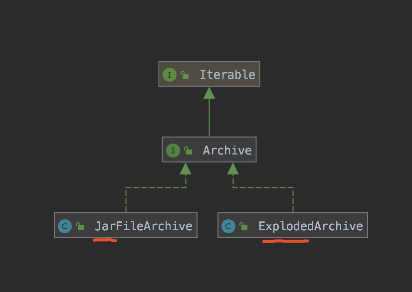
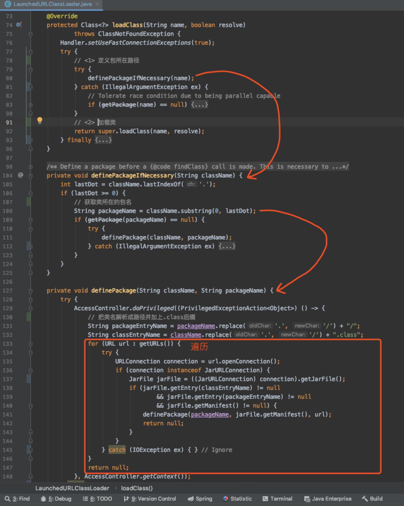

摘要: 原创出处 http://www.iocoder.cn/Spring-Boot/jar/ 「芋道源码」欢迎转载，保留摘要，谢谢！

- [1. 概述](http://www.iocoder.cn/Spring-Boot/jar/)
- [2. MANIFEST.MF](http://www.iocoder.cn/Spring-Boot/jar/)
- [3. JarLauncher](http://www.iocoder.cn/Spring-Boot/jar/)
- [4. LaunchedURLClassLoader](http://www.iocoder.cn/Spring-Boot/jar/)
- [666. 彩蛋](http://www.iocoder.cn/Spring-Boot/jar/)

------

------

# 1. 概述

Spring Boot 提供了 Maven 插件 [`spring-boot-maven-plugin`](https://docs.spring.io/spring-boot/docs/current/reference/html/build-tool-plugins.html#build-tool-plugins-maven-plugin)，可以方便的将 Spring Boot 项目打成 `jar` 包或者 `war` 包。

考虑到部署的便利性，我们绝大多数 99.99% 的场景下，我们会选择打成 `jar` 包。这样，我们就无需在部署项目的服务器上，配置相应的 Tomcat、Jetty 等 Servlet 容器。

那么，`jar` 包是如何运行，并启动 Spring Boot 项目的呢？这个就是本文的目的，一起弄懂 Spring Boot `jar` 包的**运行原理**。

下面，我们来打开一个 Spring Boot `jar` 包，看看其里面的结构。如下图所示，一共分成四部分：


- ① `META-INF` 目录：通过 `MANIFEST.MF` 文件提供 `jar` 包的**元数据**，声明了 `jar` 的启动类。

- ② `org` 目录：为 Spring Boot 提供的 [`spring-boot-loader`](https://github.com/spring-projects/spring-boot/blob/master/spring-boot-project/spring-boot-tools/spring-boot-loader/) 项目，它是 `java -jar` 启动 Spring Boot 项目的秘密所在，也是稍后我们将深入了解的部分。

	> Spring Boot Loader provides the secret sauce that allows you to build a single jar file that can be launched using `java -jar`. Generally you will not need to use `spring-boot-loader` directly, but instead work with the [Gradle](https://github.com/spring-projects/spring-boot/blob/master/spring-boot-project/spring-boot-tools/spring-boot-gradle-plugin) or [Maven](https://github.com/spring-projects/spring-boot/blob/master/spring-boot-project/spring-boot-tools/spring-boot-maven-plugin) plugin.

- ③ `BOOT-INF/lib` 目录：我们 Spring Boot 项目中引入的**依赖**的 `jar` 包们。`spring-boot-loader` 项目很大的一个作用，就是**解决 `jar` 包里嵌套 `jar` 的情况**，如何加载到其中的类。

- ④ `BOOT-INF/classes` 目录：我们在 Spring Boot 项目中 Java 类所编译的 `.class`、配置文件等等。

先简单剧透下，`spring-boot-loader` 项目需要解决两个问题：

- 第一，如何引导执行我们创建的 Spring Boot 应用的启动类，例如上述图中的 Application 类。
- 第二，如何加载 `BOOT-INF/class` 目录下的类，以及 `BOOT-INF/lib` 目录下内嵌的 `jar` 包中的类。

下面，尾随艿艿，一起来抽丝剥茧！

# 2. MANIFEST.MF

我们来查看 `META-INF/MANIFEST.MF` 文件，里面的内容如下：

```mf
Manifest-Version: 1.0
Implementation-Title: lab-39-demo
Implementation-Version: 2.2.2.RELEASE
Start-Class: cn.iocoder.springboot.lab39.skywalkingdemo.Application
Spring-Boot-Classes: BOOT-INF/classes/
Spring-Boot-Lib: BOOT-INF/lib/
Build-Jdk-Spec: 1.8
Spring-Boot-Version: 2.2.2.RELEASE
Created-By: Maven Archiver 3.4.0
Main-Class: org.springframework.boot.loader.JarLauncher
```

它实际是一个 **Properties** 配置文件，每一行都是一个配置项目。重点来看看两个配置项：

- `Main-Class` 配置项：Java 规定的 `jar` 包的启动类，这里设置为 `spring-boot-loader` 项目的 [JarLauncher](https://github.com/spring-projects/spring-boot/blob/master/spring-boot-project/spring-boot-tools/spring-boot-loader/src/main/java/org/springframework/boot/loader/JarLauncher.java) 类，进行 Spring Boot 应用的启动。
- `Start-Class` 配置项：Spring Boot 规定的**主**启动类，这里设置为我们定义的 Application 类。

> 小知识补充：为什么会有 `Main-Class`/`Start-Class` 配置项呢？因为我们是通过 Spring Boot 提供的 Maven 插件 [`spring-boot-maven-plugin`](https://github.com/spring-projects/spring-boot/blob/master/spring-boot-project/spring-boot-tools/spring-boot-maven-plugin/) 进行打包，该插件将该配置项写入到 `MANIFEST.MF` 中，从而能让 `spring-boot-loader` 能够引导启动 Spring Boot 应用。

可能胖友会有疑惑，`Start-Class` 对应的 Application 类自带了 `#main(String[] args)` 方法，为什么我们不能直接运行会如何呢？我们来简单尝试一下哈，控制台执行如下：

```
$ java -classpath lab-39-demo-2.2.2.RELEASE.jar cn.iocoder.springboot.lab39.skywalkingdemo.Application
错误: 找不到或无法加载主类 cn.iocoder.springboot.lab39.skywalkingdemo.Application
```

直接找不到 Application 类，因为它在 `BOOT-INF/classes` 目录下，不符合 Java 默认的 `jar` 包的加载规则。因此，需要通过 JarLauncher 启动加载。

当然实际还有一个更重要的原因，Java 规定可执行器的 `jar` 包禁止嵌套其它 `jar` 包。但是我们可以看到 `BOOT-INF/lib` 目录下，实际有 Spring Boot 应用依赖的所有 `jar` 包。因此，`spring-boot-loader` 项目自定义实现了 ClassLoader 实现类 [LaunchedURLClassLoader](https://github.com/spring-projects/spring-boot/blob/master/spring-boot-project/spring-boot-tools/spring-boot-loader/src/main/java/org/springframework/boot/loader/LaunchedURLClassLoader.java)，支持加载 `BOOT-INF/classes` 目录下的 `.class` 文件，以及 `BOOT-INF/lib` 目录下的 `jar` 包。

# 3. JarLauncher

[JarLauncher](https://github.com/spring-projects/spring-boot/blob/master/spring-boot-project/spring-boot-tools/spring-boot-loader/src/main/java/org/springframework/boot/loader/JarLauncher.java) 类是针对 Spring Boot `jar` 包的启动类，整体类图如下所示：


> 友情提示：[WarLauncher](https://github.com/spring-projects/spring-boot/blob/master/spring-boot-project/spring-boot-tools/spring-boot-loader/src/main/java/org/springframework/boot/loader/WarLauncher.java) 类，是针对 Spring Boot `war` 包的启动类，后续胖友可以自己瞅瞅，差别并不大哈~

JarLauncher 的源码比较简单，如下图所示：

```java
public class JarLauncher extends ExecutableArchiveLauncher {

	static final String BOOT_INF_CLASSES = "BOOT-INF/classes/";

	static final String BOOT_INF_LIB = "BOOT-INF/lib/";

	public JarLauncher() {
	}

	protected JarLauncher(Archive archive) {
		super(archive);
	}

	@Override
	protected boolean isNestedArchive(Archive.Entry entry) {
		if (entry.isDirectory()) {
			return entry.getName().equals(BOOT_INF_CLASSES);
		}
		return entry.getName().startsWith(BOOT_INF_LIB);
	}

	public static void main(String[] args) throws Exception {
		new JarLauncher().launch(args);
	}

}
```

通过 `#main(String[] args)` 方法，创建 JarLauncher 对象，并调用其 `#launch(String[] args)` 方法进行启动。整体的启动逻辑，其实是由父类 [Launcher](https://github.com/spring-projects/spring-boot/blob/master/spring-boot-project/spring-boot-tools/spring-boot-loader/src/main/java/org/springframework/boot/loader/Launcher.java) 所提供，如下图所示：


父类 Launcher 的 `#launch(String[] args)` 方法，代码如下：

```java
// Launcher.java

protected void launch(String[] args) throws Exception {
	// <1> 注册 URL 协议的处理器
	JarFile.registerUrlProtocolHandler();
	// <2> 创建类加载器
	ClassLoader classLoader = createClassLoader(getClassPathArchives());
	// <3> 执行启动类的 main 方法
	launch(args, getMainClass(), classLoader);
}
```

- `<1>` 处，调用 JarFile 的 `#registerUrlProtocolHandler()` 方法，注册 Spring Boot 自定义的 [URLStreamHandler](https://github.com/openjdk-mirror/jdk7u-jdk/blob/master/src/share/classes/java/net/URLStreamHandler.java) 实现类，用于 `jar` 包的加载读取。
- `<2>` 处，调用自身的 `#createClassLoader(List<Archive> archives)` 方法，创建自定义的 [ClassLoader](https://github.com/openjdk-mirror/jdk7u-jdk/blob/master/src/share/classes/java/lang/ClassLoader.java) 实现类，用于从 `jar` 包中加载类。
- `<3>` 处，执行我们声明的 Spring Boot 启动类，进行 Spring Boot 应用的启动。

简单来说，就是整一个可以读取 `jar` 包中类的加载器，保证 `BOOT-INF/lib` 目录下的类和 `BOOT-classes` 内嵌的 `jar` 中的类能够被正常加载到，之后执行 Spring Boot 应用的启动。

下面，我们逐行代码来看看噢。即将代码多多，保持淡定，嘿嘿~

## 3.1 registerUrlProtocolHandler

> 友情提示：对应 `JarFile.registerUrlProtocolHandler();` 代码段，不要迷路。

[JarFile](https://github.com/spring-projects/spring-boot/blob/master/spring-boot-project/spring-boot-tools/spring-boot-loader/src/main/java/org/springframework/boot/loader/jar/JarFile.java) 是 [`java.util.jar.JarFile`](https://github.com/openjdk-mirror/jdk7u-jdk/blob/master/src/share/classes/java/util/jar/JarFile.java) 的子类，如下所示：

```java
public class JarFile extends java.util.jar.JarFile {

    // ... 省略其它代码

}
```

JarFile 主要增强支持对内嵌的 `jar` 包的获取。如下图所示：


OK，介绍完之后，让我们回到 JarFile 的 `#registerUrlProtocolHandler()` 方法，注册 Spring Boot 自定义的 URL 协议的处理器。代码如下：

```java
// JarFile.java

private static final String PROTOCOL_HANDLER = "java.protocol.handler.pkgs";

private static final String HANDLERS_PACKAGE = "org.springframework.boot.loader";

/**
 * Register a {@literal 'java.protocol.handler.pkgs'} property so that a
 * {@link URLStreamHandler} will be located to deal with jar URLs.
 */
public static void registerUrlProtocolHandler() {
    // 获得 URLStreamHandler 的路径
	String handlers = System.getProperty(PROTOCOL_HANDLER, "");
	// 将 Spring Boot 自定义的 HANDLERS_PACKAGE(org.springframework.boot.loader) 补充上去
	System.setProperty(PROTOCOL_HANDLER, ("".equals(handlers) ? HANDLERS_PACKAGE
			: handlers + "|" + HANDLERS_PACKAGE));
	// 重置已缓存的 URLStreamHandler 处理器们
	resetCachedUrlHandlers();
}

/**
 * Reset any cached handlers just in case a jar protocol has already been used.
 * We reset the handler by trying to set a null {@link URLStreamHandlerFactory} which
 * should have no effect other than clearing the handlers cache.
 *
 * 重置 URL 中的 URLStreamHandler 的缓存，防止 `jar://` 协议对应的 URLStreamHandler 已经创建
 * 我们通过设置 URLStreamHandlerFactory 为 null 的方式，清空 URL 中的该缓存。
 */
private static void resetCachedUrlHandlers() {
	try {
		URL.setURLStreamHandlerFactory(null);
	} catch (Error ex) {
		// Ignore
	}
}
```

- 胖友先跟着注释，自己阅读下如上的代码~

目的很明确，通过将 `org.springframework.boot.loader` 包设置到 `"java.protocol.handler.pkgs"` 环境变量，从而使用到自定义的 URLStreamHandler 实现类 [Handler](https://github.com/spring-projects/spring-boot/blob/master/spring-boot-project/spring-boot-tools/spring-boot-loader/src/main/java/org/springframework/boot/loader/jar/Handler.java)，处理 `jar:` 协议的 URL。

> 友情提示：这里我们暂时不深入 Handler 的源码，避免直接走的太深，丢失了主干。后续胖友可结合[《Java URL 协议扩展实现》](https://www.iteye.com/blog/mercyblitz-735529)文章，进行 Handler 的实现理解。
>
> 另外，[HandlerTests](https://github.com/spring-projects/spring-boot/blob/master/spring-boot-project/spring-boot-tools/spring-boot-loader/src/test/java/org/springframework/boot/loader/jar/HandlerTests.java) 提供的单元测试，也是非常有帮助的~

## 3.2 createClassLoader

> 友情提示：对应 `ClassLoader classLoader = createClassLoader(getClassPathArchives())` 代码段，不要迷路。

### 3.2.1 getClassPathArchives

首先，我们先来看看 `#getClassPathArchives()` 方法，它是由 ExecutableArchiveLauncher 所实现，代码如下：

```java
// ExecutableArchiveLauncher.java

private final Archive archive;

@Override
protected List<Archive> getClassPathArchives() throws Exception {
	// <1> 获得所有 Archive
	List<Archive> archives = new ArrayList<>(
			this.archive.getNestedArchives(this::isNestedArchive));
	// <2> 后续处理
	postProcessClassPathArchives(archives);
	return archives;
}

protected abstract boolean isNestedArchive(Archive.Entry entry);

protected void postProcessClassPathArchives(List<Archive> archives) throws Exception {
}
```

> 友情提示：这里我们会看到一个 [Archive](https://github.com/spring-projects/spring-boot/blob/master/spring-boot-project/spring-boot-tools/spring-boot-loader/src/main/java/org/springframework/boot/loader/archive/Archive.java) 对象，先可以暂时理解成一个一个的**档案**，稍后会清晰认识的~

`<1>` 处，`this::isNestedArchive` 代码段，创建了 [EntryFilter](https://github.com/spring-projects/spring-boot/blob/master/spring-boot-project/spring-boot-tools/spring-boot-loader/src/main/java/org/springframework/boot/loader/archive/Archive.java#L130-L143) 匿名实现类，用于过滤 `jar` 包不需要的目录。

```java
// Archive.java

/**
 * Represents a single entry in the archive.
 */
interface Entry {

	/**
	 * Returns {@code true} if the entry represents a directory.
	 * @return if the entry is a directory
	 */
	boolean isDirectory();

	/**
	 * Returns the name of the entry.
	 * @return the name of the entry
	 */
	String getName();

}

/**
 * Strategy interface to filter {@link Entry Entries}.
 */
interface EntryFilter {

	/**
	 * Apply the jar entry filter.
	 * @param entry the entry to filter
	 * @return {@code true} if the filter matches
	 */
	boolean matches(Entry entry);

}
```

这里在它的内部，调用了 `#isNestedArchive(Archive.Entry entry)` 方法，它是由 JarLauncher 所实现，代码如下：

```java
// JarLauncher.java

static final String BOOT_INF_CLASSES = "BOOT-INF/classes/";

static final String BOOT_INF_LIB = "BOOT-INF/lib/";

@Override
protected boolean isNestedArchive(Archive.Entry entry) {
    // 如果是目录的情况，只要 BOOT-INF/classes/ 目录
	if (entry.isDirectory()) {
		return entry.getName().equals(BOOT_INF_CLASSES);
	}
	// 如果是文件的情况，只要 BOOT-INF/lib/ 目录下的 `jar` 包
	return entry.getName().startsWith(BOOT_INF_LIB);
}
```

- 目的就是过滤获得，`BOOT-INF/classes/` 目录下的类，以及 `BOOT-INF/lib/` 的内嵌 `jar` 包。

`<1>` 处，`this.archive.getNestedArchives` 代码段，调用 Archive 的 `#getNestedArchives(EntryFilter filter)` 方法，获得 `archive` 内嵌的 Archive 集合。代码如下：

```java
// Archive.java

/**
 * Returns nested {@link Archive}s for entries that match the specified filter.
 * @param filter the filter used to limit entries
 * @return nested archives
 * @throws IOException if nested archives cannot be read
 */
List<Archive> getNestedArchives(EntryFilter filter) throws IOException;
```

[Archive](https://github.com/spring-projects/spring-boot/blob/master/spring-boot-project/spring-boot-tools/spring-boot-loader/src/main/java/org/springframework/boot/loader/archive/Archive.java) 接口，是 `spring-boot-loader` 项目定义的**档案**抽象，其子类如下图所示：



- ExplodedArchive 是针对**目录**的 Archive 实现类。
- JarFileArchive 是针对 **`jar` 包**的 Archive 实现类。

> 友情提示：这块可能有一丢丢复杂，胖友吃耐心哈~

那么，我们在 ExecutableArchiveLauncher 的 `archive` 属性是怎么来的呢？答案在 ExecutableArchiveLauncher 的构造方法中，代码如下：

```java
// ExecutableArchiveLauncher.java

public abstract class ExecutableArchiveLauncher extends Launcher {

	private final Archive archive;

	public ExecutableArchiveLauncher() {
		try {
			this.archive = createArchive();
		} catch (Exception ex) {
			throw new IllegalStateException(ex);
		}
	}

	protected ExecutableArchiveLauncher(Archive archive) {
		this.archive = archive;
	}

	// ... 省略其它
}

// Launcher.java
public abstract class Launcher {

	protected final Archive createArchive() throws Exception {
	    // 获得 jar 所在的绝对路径
		ProtectionDomain protectionDomain = getClass().getProtectionDomain();
		CodeSource codeSource = protectionDomain.getCodeSource();
		URI location = (codeSource != null) ? codeSource.getLocation().toURI() : null;
		String path = (location != null) ? location.getSchemeSpecificPart() : null;
		if (path == null) {
			throw new IllegalStateException("Unable to determine code source archive");
		}
		File root = new File(path);
		if (!root.exists()) {
			throw new IllegalStateException(
					"Unable to determine code source archive from " + root);
		}
		// 如果是目录，则使用 ExplodedArchive 进行展开
        // 如果不是目录，则使用 JarFileArchive
		return (root.isDirectory() ? new ExplodedArchive(root)
				: new JarFileArchive(root));
	}

}
```

根据根路径**是否为目录**的情况，创建 ExplodedArchive 或 JarFileArchive 对象。那么问题就来了，这里的 `root` 是什么呢？艿艿一波骚操作，终于输出了答案，如下图所示：


`root` 路径为 `jar` 包的绝对地址，也就是说创建 JarFileArchive 对象。原因是，Launcher 所在包为 `org` 下，它的根目录当然是 `jar` 包的绝对路径哈！

😈 现在是不是对 Archive 稍微有点感觉落？继续附加如下代码，打印 JarFileArchive 的 `#getNestedArchives(EntryFilter filter)` 方法的执行结果。

```java
// ========== 附加代码：
// 创建 Archive 对象
Archive archive = new JarFileArchive(root);
// 创建 EntryFilter 对象
Archive.EntryFilter filter = new Archive.EntryFilter() {

    static final String BOOT_INF_CLASSES = "BOOT-INF/classes/";

    static final String BOOT_INF_LIB = "BOOT-INF/lib/";

    @Override
    public boolean matches(Archive.Entry entry) {
        // 如果是目录的情况，只要 BOOT-INF/classes/ 目录
        if (entry.isDirectory()) {
            return entry.getName().equals(BOOT_INF_CLASSES);
        }
        // 如果是文件的情况，只要 BOOT-INF/lib/ 目录下的 `jar` 包
        return entry.getName().startsWith(BOOT_INF_LIB);
    }

};
// 执行读取
for (Archive item : archive.getNestedArchives(filter)) {
    System.out.println(item.getUrl());
}

// ========== 执行结果：
jar:file:/Users/yunai/Java/SpringBoot-Labs/lab-39/lab-39-demo/target/lab-39-demo-2.2.2.RELEASE.jar!/BOOT-INF/classes!/
jar:file:/Users/yunai/Java/SpringBoot-Labs/lab-39/lab-39-demo/target/lab-39-demo-2.2.2.RELEASE.jar!/BOOT-INF/lib/spring-boot-starter-web-2.2.2.RELEASE.jar!/
jar:file:/Users/yunai/Java/SpringBoot-Labs/lab-39/lab-39-demo/target/lab-39-demo-2.2.2.RELEASE.jar!/BOOT-INF/lib/spring-boot-starter-2.2.2.RELEASE.jar!/
jar:file:/Users/yunai/Java/SpringBoot-Labs/lab-39/lab-39-demo/target/lab-39-demo-2.2.2.RELEASE.jar!/BOOT-INF/lib/spring-boot-2.2.2.RELEASE.jar!/
... 省略其他 jar 包
```

从执行结果可以看出，`BOOT-INF/classes/` 目录被归类为**一个** Archive 对象，而 `BOOT-INF/lib/` 目录下的**每个**内嵌 `jar` 包都对应**一个** Archive 对象。

来来来，回过头来看看 JarFileArchive 的 `#getNestedArchives(EntryFilter filter)` 方法的源码，如下图所示：


现在是不是明白了噢！良心如我，哈哈哈！

> 友情提示：上述的测试代码，可以访问 [lab-39-demo](https://github.com/YunaiV/SpringBoot-Labs/tree/master/lab-39/lab-39-demo) 项目查看。

### 3.2.2 createClassLoader

然后，我再来看看 `#createClassLoader(List<Archive> archives)` 方法，它是由 ExecutableArchiveLauncher 所实现，代码如下：

```java
// ExecutableArchiveLauncher.java

protected ClassLoader createClassLoader(List<Archive> archives) throws Exception {
	// 获得所有 Archive 的 URL 地址
    List<URL> urls = new ArrayList<>(archives.size());
	for (Archive archive : archives) {
		urls.add(archive.getUrl());
	}
	// 创建加载这些 URL 的 ClassLoader
	return createClassLoader(urls.toArray(new URL[0]));
}

protected ClassLoader createClassLoader(URL[] urls) throws Exception {
	return new LaunchedURLClassLoader(urls, getClass().getClassLoader());
}
```

基于获得的 Archive 数组，创建自定义 ClassLoader 实现类 [LaunchedURLClassLoader](https://github.com/spring-projects/spring-boot/blob/master/spring-boot-project/spring-boot-tools/spring-boot-loader/src/main/java/org/springframework/boot/loader/LaunchedURLClassLoader.java)，通过它来加载 `BOOT-INF/classes` 目录下的类，以及 `BOOT-INF/lib` 目录下的 `jar` 包中的类。

进一步的解析，我们在[「5. LaunchedURLClassLoader」](http://www.iocoder.cn/Spring-Boot/jar/?self#)小节中，进行分享哈！

## 3.3 launch

> 友情提示：对应 `launch(args, getMainClass(), classLoader)` 代码段，不要迷路。

### 3.3.1 getMainClass

首先，我们先来看看`#getMainClass()` 方法，它是由 ExecutableArchiveLauncher 所实现，代码如下：

```java
// ExecutableArchiveLauncher.java

@Override
protected String getMainClass() throws Exception {
    // 获得启动的类的全名
	Manifest manifest = this.archive.getManifest();
	String mainClass = null;
	if (manifest != null) {
		mainClass = manifest.getMainAttributes().getValue("Start-Class");
	}
	if (mainClass == null) {
		throw new IllegalStateException(
				"No 'Start-Class' manifest entry specified in " + this);
	}
	return mainClass;
}
```

从 `jar` 包的 `MANIFEST.MF` 文件的 `Start-Class` 配置项，，获得我们设置的 Spring Boot 的**主**启动类。

### 3.3.2 createMainMethodRunner

然后，我们再来看看 `#launch()` 方法，它是由 Launcher 所实现，代码如下：

```java
protected void launch(String[] args, String mainClass, ClassLoader classLoader)
		throws Exception {
    // <1> 设置 LaunchedURLClassLoader 作为类加载器
	Thread.currentThread().setContextClassLoader(classLoader);
	// <2> 创建 MainMethodRunner 对象，并执行 run 方法，启动 Spring Boot 应用
	createMainMethodRunner(mainClass, args, classLoader).run();
}
```

该方法负责最终的 Spring Boot 应用真正的**启动**。

- `<1>` 处：设置[「3.2.2 createClassLoader」](http://www.iocoder.cn/Spring-Boot/jar/?self#)创建的 LaunchedURLClassLoader 作为类加载器，从而保证能够从 `jar` 加载到相应的类。
- `<2>` 处，调用 `#createMainMethodRunner(String mainClass, String[] args, ClassLoader classLoader)` 方法，创建 [MainMethodRunner](https://github.com/spring-projects/spring-boot/blob/master/spring-boot-project/spring-boot-tools/spring-boot-loader/src/main/java/org/springframework/boot/loader/MainMethodRunner.java) 对象，并执行其 `#run()` 方法来启动 Spring Boot 应用。

下面，我们来看看 **MainMethodRunner** 类，负责 Spring Boot 应用的启动。代码如下：

```java
public class MainMethodRunner {

	private final String mainClassName;

	private final String[] args;

	/**
	 * Create a new {@link MainMethodRunner} instance.
	 * @param mainClass the main class
	 * @param args incoming arguments
	 */
	public MainMethodRunner(String mainClass, String[] args) {
		this.mainClassName = mainClass;
		this.args = (args != null) ? args.clone() : null;
	}

	public void run() throws Exception {
	    // <1> 加载 Spring Boot
		Class<?> mainClass = Thread.currentThread().getContextClassLoader().loadClass(this.mainClassName);
		// <2> 反射调用 main 方法
		Method mainMethod = mainClass.getDeclaredMethod("main", String[].class);
		mainMethod.invoke(null, new Object[] { this.args });
	}

}
```

- `<1>` 处：通过 LaunchedURLClassLoader 类加载器，加载到我们设置的 Spring Boot 的主启动类。
- `<2>` 处：通过**反射**调用主启动类的 `#main(String[] args)` 方法，启动 Spring Boot 应用。这里也告诉了我们答案，为什么我们通过编写一个带有 `#main(String[] args)` 方法的类，就能够启动 Spring Boot 应用。

# 4. LaunchedURLClassLoader

[LaunchedURLClassLoader](https://github.com/DarLiner/spring-boot/blob/master/spring-boot-project/spring-boot-tools/spring-boot-loader/src/main/java/org/springframework/boot/loader/LaunchedURLClassLoader.java) 是 `spring-boot-loader` 项目自定义的**类加载器**，实现对 `jar` 包中 `META-INF/classes` 目录下的**类**和 `META-INF/lib` 内嵌的 `jar` 包中的**类**的**加载**。

> FROM [《维基百科 —— Java 类加载器》](https://zh.wikipedia.org/wiki/Java类加载器)
>
> Java 类加载器是 Java 运行时环境的一个部件，负责动态加载 Java 类到 Java 虚拟机的内存空间中。类通常是按需加载，即第一次使用该类时才加载。
>
> 由于有了类加载器，Java 运行时系统不需要知道文件与文件系统。对学习类加载器而言，掌握 Java 的委派概念是很重要的。每个 Java 类必须由某个类加载器装入到内存。

在[「3.2.2 createClassLoader」](http://www.iocoder.cn/Spring-Boot/jar/?self#)小节中，我们可以看到 LaunchedURLClassLoader 的创建代码如下：

```java
// ExecutableArchiveLauncher.java

protected ClassLoader createClassLoader(List<Archive> archives) throws Exception {
    // 获得所有 Archive 的 URL 地址
    List<URL> urls = new ArrayList<>(archives.size());
    for (Archive archive : archives) {
        urls.add(archive.getUrl());
    }
    // 创建加载这些 URL 的 ClassLoader
    return createClassLoader(urls.toArray(new URL[0]));
}

protected ClassLoader createClassLoader(URL[] urls) throws Exception {
	return new LaunchedURLClassLoader(urls, getClass().getClassLoader());
}

// LaunchedURLClassLoader.java

public class LaunchedURLClassLoader extends URLClassLoader {

	public LaunchedURLClassLoader(URL[] urls, ClassLoader parent) {
		super(urls, parent);
	}
	
}
```

- 第一个参数 `urls`，使用的是 Archive 集合对应的 URL 地址们，从而告诉 LaunchedURLClassLoader 读取 `jar` 的**地址**。
- 第二个参数 `parent`，设置 LaunchedURLClassLoader 的**父**加载器。这里后续胖友可以理解下，类加载器的**双亲委派模型**，这里就拓展开了。

LaunchedURLClassLoader 的实现代码并不多，我们主要来看看它是如何从 `jar` 包中加载类的。核心如下图所示：



- `<1>` 处，在通过**父类**的 `#getPackage(String name)` 方法获取不到指定类所在的包时，**会通过遍历 `urls` 数组，从 `jar` 包中加载类所在的包**。当找到包时，会调用 `#definePackage(String name, Manifest man, URL url)` 方法，设置包所在的 **Archive** 对应的 `url`。
- `<2>` 处，调用**父类**的 `#loadClass(String name, boolean resolve)` 方法，加载对应的类。

如此，我们就实现了通过 LaunchedURLClassLoader 加载 `jar` 包中内嵌的类。

# 666. 彩蛋

总体来说，Spring Boot `jar` 启动的原理是非常清晰的，整体如下图所示：


**红色**部分，解决 `jar` 包中的**类加载**问题：

- 通过 [Archive](https://github.com/spring-projects/spring-boot/blob/master/spring-boot-project/spring-boot-tools/spring-boot-loader/src/main/java/org/springframework/boot/loader/archive/Archive.java)，实现 `jar` 包的**遍历**，将 `META-INF/classes` 目录和 `META-INF/lib` 的每一个内嵌的 `jar` 解析成一个 Archive 对象。
- 通过 [Handler](https://github.com/spring-projects/spring-boot/blob/master/spring-boot-project/spring-boot-tools/spring-boot-loader/src/main/java/org/springframework/boot/loader/jar/Handler.java)，处理 `jar:` 协议的 URL 的资源**读取**，也就是读取了每个 Archive 里的内容。
- 通过 [LaunchedURLClassLoader](https://github.com/spring-projects/spring-boot/blob/master/spring-boot-project/spring-boot-tools/spring-boot-loader/src/main/java/org/springframework/boot/loader/LaunchedURLClassLoader.java)，实现 `META-INF/classes` 目录下的类和 `META-INF/classes` 目录下内嵌的 `jar` 包中的类的加载。具体的 URL 来源，是通过 Archive 提供；具体 URL 的读取，是通过 Handler 提供。

**橘色**部分，解决 Spring Boot 应用的**启动**问题：

- 通过 [MainMethodRunner](https://github.com/spring-projects/spring-boot/blob/master/spring-boot-project/spring-boot-tools/spring-boot-loader/src/main/java/org/springframework/boot/loader/MainMethodRunner.java) ，实现 Spring Boot 应用的启动类的执行。

当然，上述的一切都是通过 [Launcher](https://github.com/spring-projects/spring-boot/blob/master/spring-boot-project/spring-boot-tools/spring-boot-loader/src/main/java/org/springframework/boot/loader/Launcher.java) 来完成引导和启动，通过 `MANIFEST.MF` 进行具体配置。

😈 生活如此美好，本文就此结束！

------

另外，本文有两个部分，胖友可以自己再去撸一撸，玩一玩：

- [WarLauncher](https://github.com/spring-projects/spring-boot/blob/master/spring-boot-project/spring-boot-tools/spring-boot-loader/src/main/java/org/springframework/boot/loader/WarLauncher.java) 类：实现 Spring Boot `war` 包的启动。
- [`org.springframework.boot.loader.jar`](https://github.com/spring-projects/spring-boot/blob/master/spring-boot-project/spring-boot-tools/spring-boot-loader/src/main/java/org/springframework/boot/loader/jar/) 包：具体读取 `jar` 的逻辑。