# 第一种方式：项目创建都使用Spring Initializr创建

## 第一步：新建空SpringBoot项目

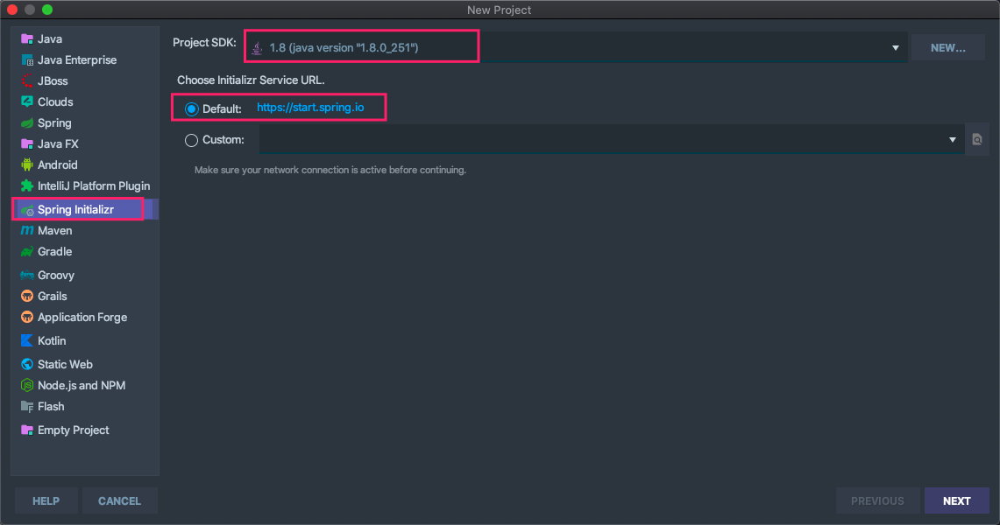

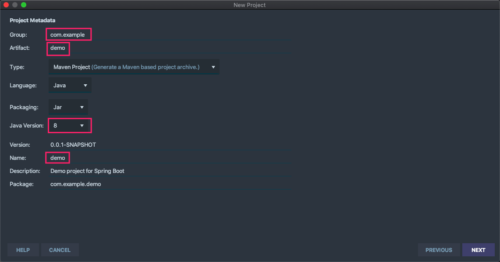

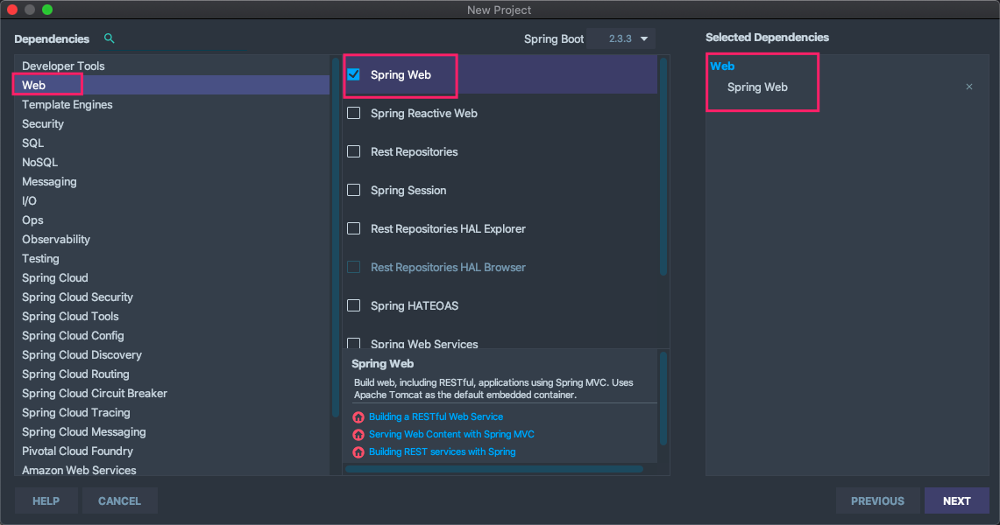

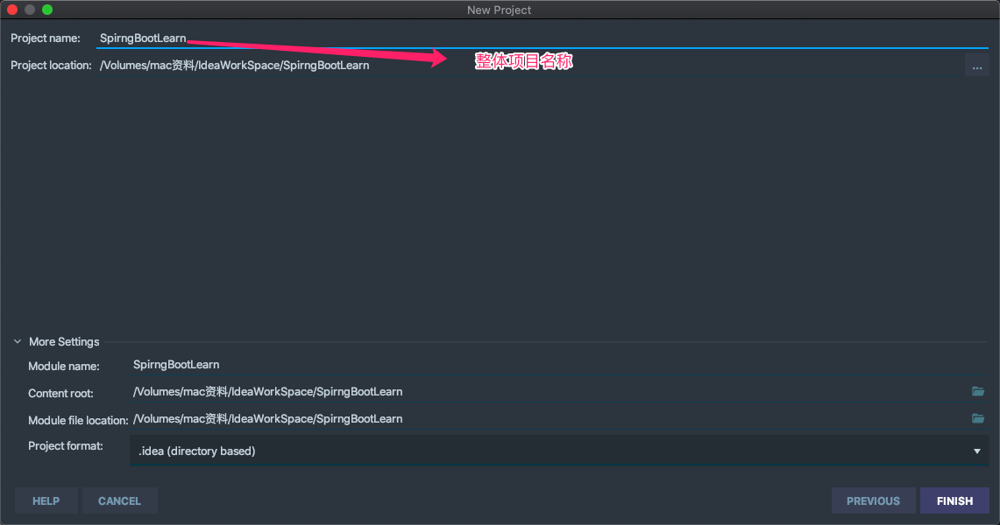


## 第二步：删除src目录使其成为空项目

## 第三步：删除pom文件中的依赖以及build标签

## 第四步：在pom文件中新增打包方式pom

* 最终结果如下：

	```xml
	<?xml version="1.0" encoding="UTF-8"?>
	<project xmlns="http://maven.apache.org/POM/4.0.0" xmlns:xsi="http://www.w3.org/2001/XMLSchema-instance"
	         xsi:schemaLocation="http://maven.apache.org/POM/4.0.0 https://maven.apache.org/xsd/maven-4.0.0.xsd">
	    <modelVersion>4.0.0</modelVersion>
	    <parent>
	        <groupId>org.springframework.boot</groupId>
	        <artifactId>spring-boot-starter-parent</artifactId>
	        <version>2.3.3.RELEASE</version>
	        <relativePath/> <!-- lookup parent from repository -->
	    </parent>
	    <groupId>com.shuai</groupId>
	    <artifactId>springbootlearn</artifactId>
	    <version>0.0.1-SNAPSHOT</version>
	    <name>springbootlearn</name>
	    <description>Demo project for Spring Boot</description>
	
	    <properties>
	        <java.version>1.8</java.version>
	    </properties>
	
	    <!--打包方式 作为父项目之根本-->
	    <packaging>pom</packaging>
	
	</project>
	```

## 第五步：新增子模块==SpringBoot-RestFul==

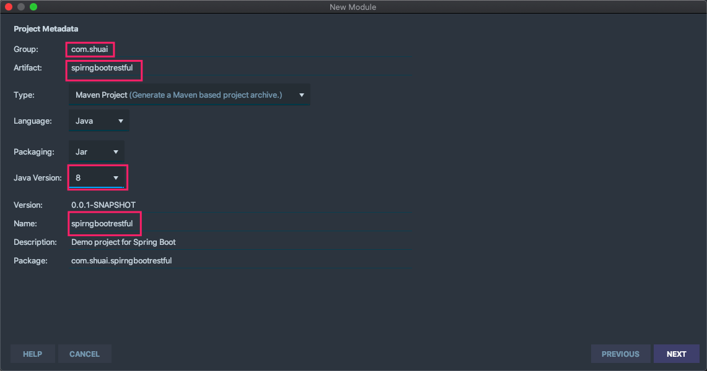

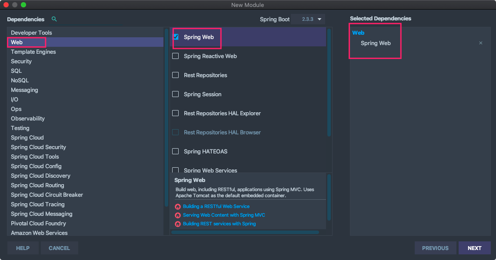

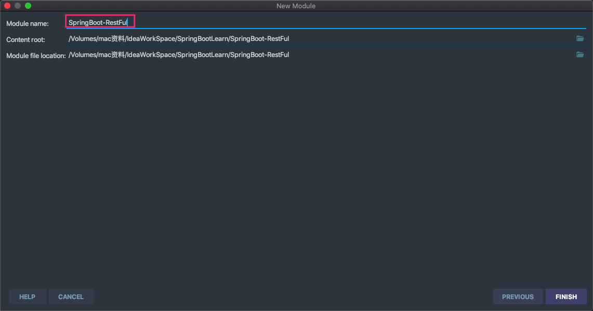

## 第六步：修改子模块中Parent标签为父项目进行关联

* 最终结果如下

	```xml
	<?xml version="1.0" encoding="UTF-8"?>
	<project xmlns="http://maven.apache.org/POM/4.0.0" xmlns:xsi="http://www.w3.org/2001/XMLSchema-instance"
	         xsi:schemaLocation="http://maven.apache.org/POM/4.0.0 https://maven.apache.org/xsd/maven-4.0.0.xsd">
	    <modelVersion>4.0.0</modelVersion>
	    <!--删除该标签-->
	<!--    <parent>-->
	<!--        <groupId>org.springframework.boot</groupId>-->
	<!--        <artifactId>spring-boot-starter-parent</artifactId>-->
	<!--        <version>2.3.3.RELEASE</version>-->
	<!--        <relativePath/> &lt;!&ndash; lookup parent from repository &ndash;&gt;-->
	<!--    </parent>-->
	    <parent>
	        <groupId>com.shuai</groupId>
	        <artifactId>springbootlearn</artifactId>
	        <version>0.0.1-SNAPSHOT</version>
	    </parent>
	    <groupId>com.shuai</groupId>
	    <artifactId>springbootrestful</artifactId>
	    <version>0.0.1-SNAPSHOT</version>
	    <name>springbootrestful</name>
	    <description>Demo project for Spring Boot</description>
	
	    <properties>
	        <java.version>1.8</java.version>
	    </properties>
	
	    <dependencies>
	        <!-- 实现对 Spring MVC 的自动化配置 -->
	        <dependency>
	            <groupId>org.springframework.boot</groupId>
	            <artifactId>spring-boot-starter-web</artifactId>
	        </dependency>
	
	        <!-- 方便等会写单元测试 -->
	        <dependency>
	            <groupId>org.springframework.boot</groupId>
	            <artifactId>spring-boot-starter-test</artifactId>
	            <scope>test</scope>
	        </dependency>
	
	    </dependencies>
	
	    <build>
	        <plugins>
	            <plugin>
	                <groupId>org.springframework.boot</groupId>
	                <artifactId>spring-boot-maven-plugin</artifactId>
	            </plugin>
	        </plugins>
	    </build>
	
	</project>
	```

	

## 第七步：父项目pom文件新增modeles标签与子模块关联

```xml
<!--子模块：如果有多个子模块则添加多个module标签即可-->
<modules>
    <module>SpringBoot-Restful</module>
</modules>
```

## 第八步：最终目录如下

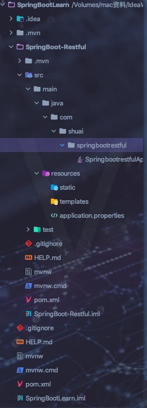

## 该方式创建多模块项目优缺点

* 优点
	
* 在创建项目初期指定SpringBoot版本后，直接勾选需要的模块即可。各个start的版本由SpringBoot管理，不用我们管理。适合有网络的情况。
	
* 缺点

	* 每个子模块并不能形成独立的SpringBoot项目。需要有一个启动模块。其余模块只能提供API接口(如有不对的地方，请大神多多指教！)

		

# 第一种方式：项目创建都使用Maven创建

# 第一步：创建父项目

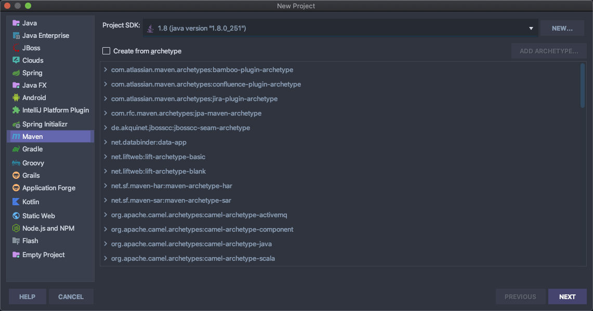

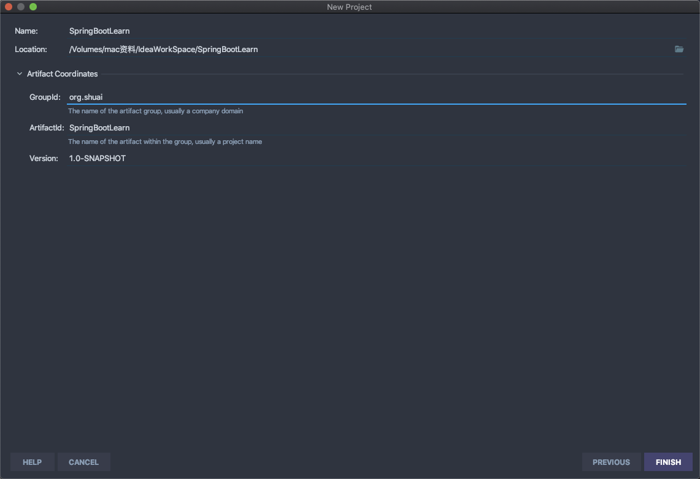

* 删除父项目src目录

* 父项目pom新增packaging标签

	```xml
	<!--打包方式-->
	<packaging>pom</packaging>
	```

* 新增依赖管理

	```xml
	    <properties>
	        <project.build.sourceEncoding>UTF-8</project.build.sourceEncoding>
	        <maven.compiler.source>1.8</maven.compiler.source>
	        <maven.compiler.target>1.8</maven.compiler.target>
	        <junit.version>4.12</junit.version>
	        <lombok.version>1.18.4</lombok.version>
	        <log4j.version>4.12</log4j.version>
	        <logbak.version>1.2.3</logbak.version>
	        <!-- 修改默认版本编译为 1.8 -->
	        <java.version>1.8</java.version>
	        <!-- API 统一使用 1.8 编译 -->
	        <api.jdk.version>1.8</api.jdk.version>
	        <springboot.web.version>2.3.3.RELEASE</springboot.web.version>
	        <springboot.version>2.3.3.RELEASE</springboot.version>
	        <mybatis.boot.start.version>1.3.1</mybatis.boot.start.version>
	        <springboot.jpa.version>2.3.3.RELEASE</springboot.jpa.version>
	        <mysql.version>8.0.21</mysql.version>
	        <spring.web.version>5.1.8.RELEASE</spring.web.version>
	        <hutool.version>5.4.1</hutool.version>
	    </properties>
	
	    <dependencyManagement>
	        <dependencies>
	            <!--SpringBoot 启动器-->
	            <dependency>
	                <groupId>org.mybatis.spring.boot</groupId>
	                <artifactId>mybatis-spring-boot-starter</artifactId>
	                <version>${mybatis.boot.start.version}</version>
	            </dependency>
	            <!--import 这个是maven2.0.9版本后出的属性，import只能在dependencyManagement的中使用，能解决maven单继承问题，import依赖关系实际上并不参与限制依赖关系的传递性。-->
	            <dependency>
	                <groupId>org.springframework.boot</groupId>
	                <artifactId>spring-boot-starter</artifactId>
	                <version>${springboot.version}</version>
	                <!--<scope>import</scope>-->
	            </dependency>
	            <!-- 实现对 Spring MVC 的自动化配置 -->
	            <dependency>
	                <groupId>org.springframework.boot</groupId>
	                <artifactId>spring-boot-starter-web</artifactId>
	                <version>${springboot.web.version}</version>
	                <!--<scope>import</scope>-->
	            </dependency>
	            <dependency>
	                <groupId>org.springframework</groupId>
	                <artifactId>spring-web</artifactId>
	                <version>${spring.web.version}</version>
	            </dependency>
	            <!-- 方便等会写单元测试 -->
	            <dependency>
	                <groupId>org.springframework.boot</groupId>
	                <artifactId>spring-boot-starter-test</artifactId>
	                <version>${springboot.web.version}</version>
	                <scope>test</scope>
	            </dependency>
	
	            <!--工具-->
            <dependency>
	                <groupId>org.projectlombok</groupId>
	                <artifactId>lombok</artifactId>
	                <version>${lombok.version}</version>
	            </dependency>
	            <dependency>
	                <groupId>cn.hutool</groupId>
	                <artifactId>hutool-all</artifactId>
	                <version>${hutool.version}</version>
	            </dependency>
	            <!--数据库相关-->
	            <dependency>
	                <groupId>org.springframework.boot</groupId>
	                <artifactId>spring-boot-starter-data-jpa</artifactId>
	                <version>${springboot.jpa.version}</version>
	            </dependency>
	            <dependency>
	                <groupId>mysql</groupId>
	                <artifactId>mysql-connector-java</artifactId>
	                <version>${mysql.version}</version>
	            </dependency>
	        </dependencies>
	    </dependencyManagement>
	```
	
	

## 第二步：新建子模块==SpringBoot-RestFul==

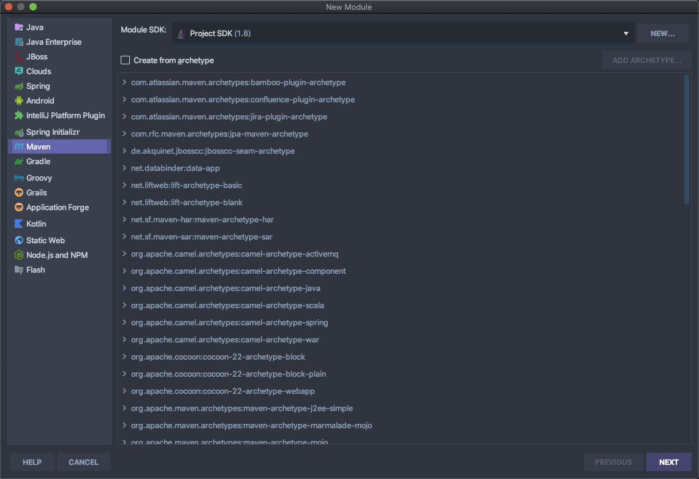

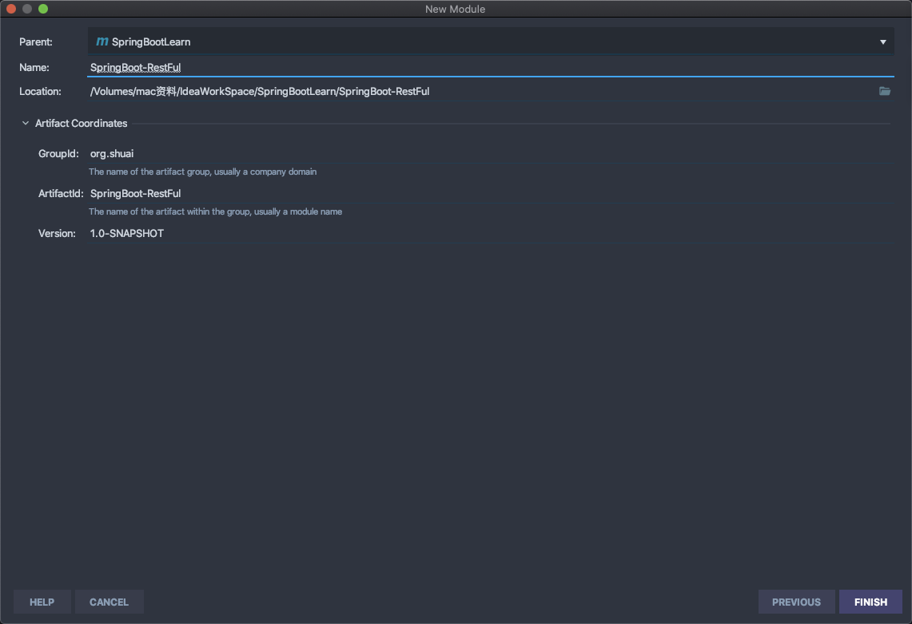

* 继承依赖并添加==Common==模块依赖

  ```xml
  <dependencies>
          <!--common模块-->
          <dependency>
              <artifactId>SpringBoot-Common</artifactId>
              <groupId>org.shuai</groupId>
              <version>1.0-SNAPSHOT</version>
          </dependency>
          <dependency>
              <groupId>org.springframework.boot</groupId>
              <artifactId>spring-boot-starter</artifactId>
          </dependency>
          <!-- 实现对 Spring MVC 的自动化配置 -->
          <dependency>
              <groupId>org.springframework.boot</groupId>
              <artifactId>spring-boot-starter-web</artifactId>
              <scope>compile</scope><!--真是个鬼东西，明明导入了提示用不了，大家遇到这种情况记得查看包的运行环境-->
          </dependency>
          <!-- 方便等会写单元测试 -->
          <dependency>
              <groupId>org.springframework.boot</groupId>
              <artifactId>spring-boot-starter-test</artifactId>
          </dependency>
          <!--数据库相关-->
          <dependency>
              <groupId>org.springframework.boot</groupId>
              <artifactId>spring-boot-starter-data-jpa</artifactId>
          </dependency>
          <dependency>
              <groupId>mysql</groupId>
              <artifactId>mysql-connector-java</artifactId>
          </dependency>
          <!--工具-->
          <dependency>
              <groupId>cn.hutool</groupId>
              <artifactId>hutool-all</artifactId>
          </dependency>
      </dependencies>
  ```

  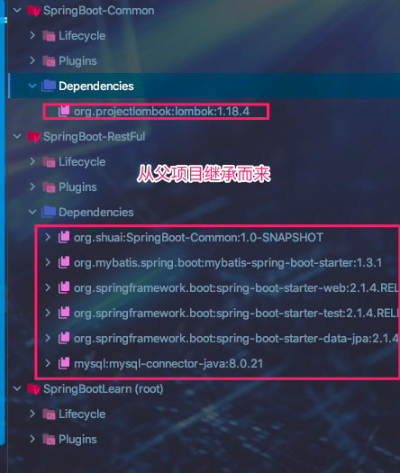

* 添加配置类

	```yml
	spring:
	  datasource:
	    jdbc-url: jdbc:mysql://127.0.0.1:3306/springcloud?useUnicode=true&characterEncoding=UTF-8&useSSL=false&autoReconnect=true&failOverReadOnly=false&serverTimezone=GMT%2B8
	    username: root
	    password: root
	    driver-class-name: com.mysql.cj.jdbc.Driver
	    #type: com.zaxxer.hikari.HikariDataSource
	    initialization-mode: always
	    continue-on-error: true
	    schema:
	      - "classpath:db/schema.sql"
	    data:
	      - "classpath:db/data.sql"
	    hikari:
	      minimum-idle: 5
	      connection-test-query: SELECT 1 FROM DUAL
	      maximum-pool-size: 20
	      auto-commit: true
	      idle-timeout: 30000
	      pool-name: SpringBootDemoHikariCP
	      max-lifetime: 60000
	      connection-timeout: 30000
	  jpa:
	    show-sql: true
	    hibernate:
	      ddl-auto: validate
	    properties:
	      hibernate:
	        dialect: org.hibernate.dialect.MySQL57InnoDBDialect
	    open-in-view: true
	logging:
	  level:
	    com.xkcoding: debug
	    org.hibernate.SQL: debug
	    org.hibernate.type: trace
	```

* 新增jpa配置类

  ```java
  package com.shuai.restful.jpa.config;
  
  import org.springframework.boot.context.properties.ConfigurationProperties;
  import org.springframework.boot.jdbc.DataSourceBuilder;
  import org.springframework.context.annotation.Bean;
  import org.springframework.context.annotation.Configuration;
  import org.springframework.data.jpa.repository.config.EnableJpaAuditing;
  import org.springframework.data.jpa.repository.config.EnableJpaRepositories;
  import org.springframework.orm.jpa.JpaTransactionManager;
  import org.springframework.orm.jpa.LocalContainerEntityManagerFactoryBean;
  import org.springframework.orm.jpa.vendor.HibernateJpaVendorAdapter;
  import org.springframework.transaction.PlatformTransactionManager;
  import org.springframework.transaction.annotation.EnableTransactionManagement;
  
  import javax.persistence.EntityManagerFactory;
  import javax.sql.DataSource;
  @Configuration
  @EnableTransactionManagement
  @EnableJpaAuditing
  @EnableJpaRepositories(basePackages = "com.shuai.restful.jpa.repository", transactionManagerRef = "jpaTransactionManager")
  public class JpaConfig {
      @Bean
      @ConfigurationProperties(prefix = "spring.datasource")
      public DataSource dataSource() {
          return DataSourceBuilder.create().build();
      }
  
      @Bean
      public LocalContainerEntityManagerFactoryBean entityManagerFactory() {
          HibernateJpaVendorAdapter japVendor = new HibernateJpaVendorAdapter();
          japVendor.setGenerateDdl(false);
          LocalContainerEntityManagerFactoryBean entityManagerFactory = new LocalContainerEntityManagerFactoryBean();
          entityManagerFactory.setDataSource(dataSource());
          entityManagerFactory.setJpaVendorAdapter(japVendor);
          entityManagerFactory.setPackagesToScan("com.shuai.common.entity");
          return entityManagerFactory;
      }
  
      @Bean
      public PlatformTransactionManager jpaTransactionManager(EntityManagerFactory entityManagerFactory) {
          JpaTransactionManager transactionManager = new JpaTransactionManager();
          transactionManager.setEntityManagerFactory(entityManagerFactory);
          return transactionManager;
      }
  }
  ```

* 新增Dao接口

	```java
	package com.shuai.restful.jpa.repository;
	
	import com.shuai.common.entity.Dept;
	import org.springframework.data.jpa.repository.JpaRepository;
	import org.springframework.stereotype.Repository;
	
	
	@Repository
	public interface DeptDao extends JpaRepository<Dept, Long> {
	
	}
	```

* 新建启动器类

	```java
	package com.shuai.restful;
	import org.springframework.boot.SpringApplication;
	import org.springframework.boot.autoconfigure.SpringBootApplication;
	/**
	 * TODO:<p>  <p/>
	 *
	 * @package: com.shuai.restful
	 * @Author mac
	 * @Date 2020/9/7 10:09 下午
	 * @Version V1.0
	 **/
	@SpringBootApplication
	public class SpringBoot_RestFul {
	    public static void main(String[] args) {
	        SpringApplication.run(SpringBoot_RestFul.class,args);
	    }
	}
	```

* 新增Controller

	```java
	package com.shuai.restful.controller;
	
	import cn.hutool.json.JSONUtil;
	import com.shuai.common.entity.Dept;
	import com.shuai.restful.jpa.repository.DeptDao;
	import org.springframework.beans.factory.annotation.Autowired;
	import org.springframework.web.bind.annotation.*;
	
	import java.util.List;
	
	/**
	 * TODO:<p>  <p/>
	 *
	 * @package: com.shuai.restful.controller
	 * @Author mac
	 * @Date 2020/9/7 10:21 下午
	 * @Version V1.0
	 **/
	@RestController//提供restful风格服务
	public class DeptController {
	
	    @Autowired
	    private DeptDao deptDao;
	
	    @GetMapping("/dept/list")
	    public String queryAll() {
	        return JSONUtil.toJsonStr(deptDao.findAll());
	    }
	
	
	}
	```

## 第三步：新建==SpringBoot-Common==模块

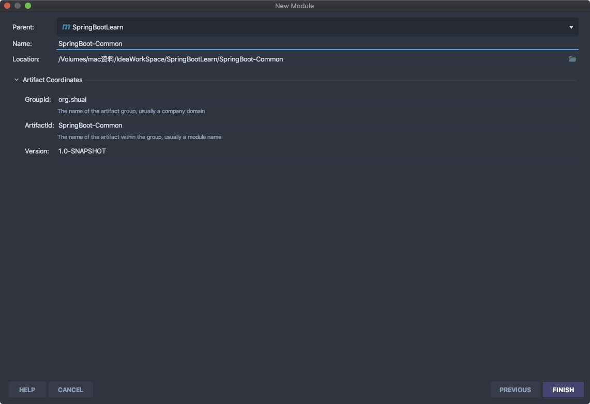

* 继承依赖

	```xml
	<dependencies>
	    <!--工具-->
	    <dependency>
	        <groupId>org.projectlombok</groupId>
	        <artifactId>lombok</artifactId>
	    </dependency>
	</dependencies>
	```

* 新增实体类

	```java
	package com.shuai.common.entity;
	import lombok.Data;
	import lombok.NoArgsConstructor;
	import lombok.experimental.Accessors;
	
	import java.io.Serializable;
	/**
	 * TODO:<p>  <p/>
	 *
	 * @package: com.shuai.common.entity
	 * @Author mac
	 * @Date 2020/9/7 10:05 下午
	 * @Version V1.0
	 **/
	@Data//get set toString hashCode equals
	@NoArgsConstructor//无参
	@Accessors(chain = true)//链式写法
	public class Dept implements Serializable {
	    private Long deptno;
	    private String dname;
	    //微服务 一个服务对应一个数据库，同一个信息可能存在不同的数据库，该字段用以区分数据库
	    private String db_source;
	
	    public Dept(String dname) {
	        this.dname = dname;
	    }
	
	    public Dept(Long deptno, String dname, String db_source) {
	        this.deptno = deptno;
	        this.dname = dname;
	        this.db_source = db_source;
	    }
	}
	```

	

## 该方式创建多模块项目优缺点

> 与第一种方式创建的优缺点刚好相反。建议使用这种。多个模块独立启动相互不干扰


## 注意

> <font color=ff00aa>pom文件中有<scope>import</scope>求求你们不要用了，先🤮为敬 好吧！</font>


# 第三种：项目创建都使用Spring Initializr alibaba创建

## 第一步：创建父项目

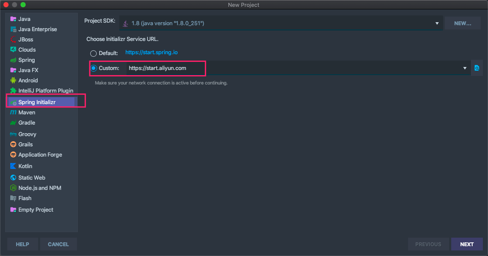

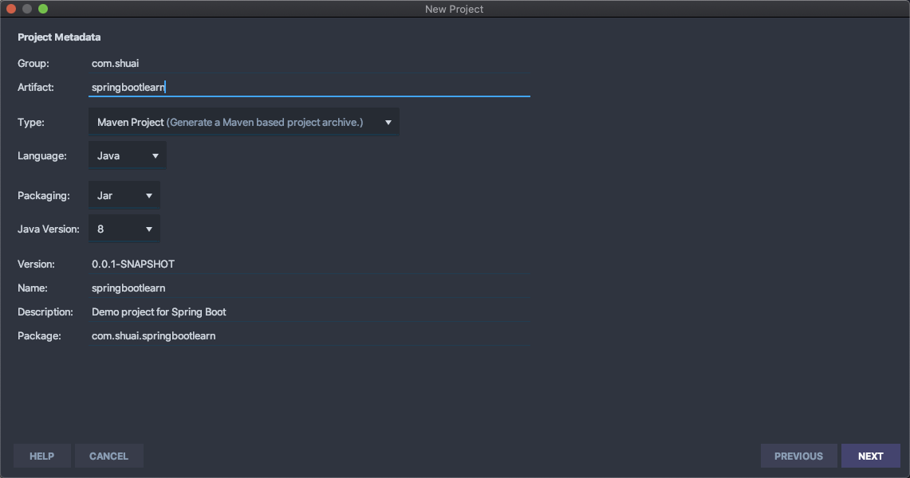

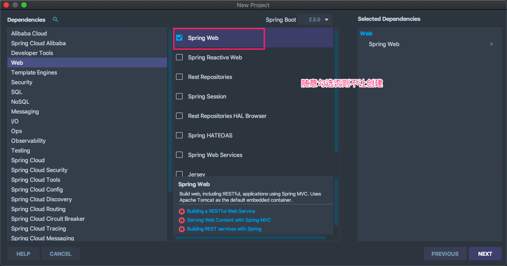

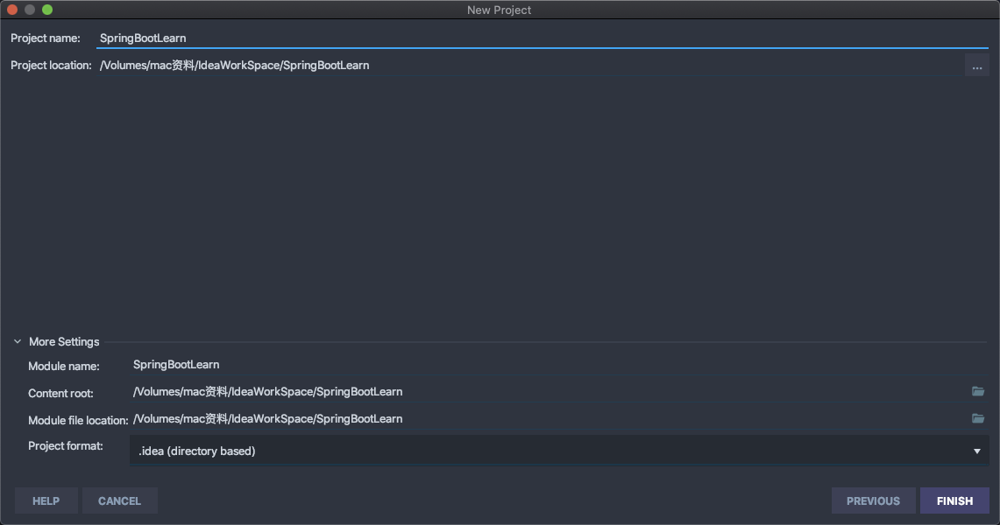

* pom新增打包方式

	```xml
	<packaging>pom</packaging>
	```

* pom新增MySQL和HuTool工具依赖以及子模块管理

	* `dependencyManagement:`父项目包管理标签，被包裹的包可由子模块选择继承
	* `dependencies:`包管理标签，被包裹的包子类全部无条件继承。冗余
	* `modules:`子模块管理标签，被包裹的模块作为子模块。

* 最终结果如下：

	```xml
	<?xml version="1.0" encoding="UTF-8"?>
	<project xmlns="http://maven.apache.org/POM/4.0.0" xmlns:xsi="http://www.w3.org/2001/XMLSchema-instance"
	    xsi:schemaLocation="http://maven.apache.org/POM/4.0.0 https://maven.apache.org/xsd/maven-4.0.0.xsd">
	    <modelVersion>4.0.0</modelVersion>
	    <groupId>com.company</groupId>
	    <artifactId>spring-boot-learn</artifactId>
	    <version>0.0.1-SNAPSHOT</version>
	
	    <packaging>pom</packaging>
	
	    <name>spring-boot-learn</name>
	    <description>Demo project for Spring Boot</description>
	
	    <!--子模块管理-->
	    <modules>
	        <module>SpringBoot-Common</module>
	        <module>SpringBoot-Mvc-RestFul</module>
	    </modules>
	    <!--版本控制-->
	    <properties>
	        <java.version>1.8</java.version>
	        <project.build.sourceEncoding>UTF-8</project.build.sourceEncoding>
	        <project.reporting.outputEncoding>UTF-8</project.reporting.outputEncoding>
	        <spring-boot.version>2.3.0.RELEASE</spring-boot.version>
	        <lombok.version>1.18.12</lombok.version>
	        <mysql.version>8.0.21</mysql.version>
	        <hutool.version>5.4.1</hutool.version>
	    </properties>
	
	
	    <dependencyManagement>
	        <dependencies>
	          <!--精髓-->
	            <dependency>
	                <groupId>org.springframework.boot</groupId>
	                <artifactId>spring-boot-dependencies</artifactId>
	                <version>${spring-boot.version}</version>
	                <type>pom</type>
	                <scope>import</scope>
	            </dependency>
	            <dependency>
	                <groupId>mysql</groupId>
	                <artifactId>mysql-connector-java</artifactId>
	                <version>${mysql.version}</version>
	            </dependency>
	            <!-- hutool工具类 -->
	            <dependency>
	                <groupId>cn.hutool</groupId>
	                <artifactId>hutool-all</artifactId>
	                <version>${hutool.version}</version>
	            </dependency>
	          <dependency>
	                <groupId>org.projectlombok</groupId>
	                <artifactId>lombok</artifactId>
	                <version>${lombok.version}</version>
	            </dependency>
	        </dependencies>
	    </dependencyManagement>
	
	    <build>
	        <plugins>
	            <plugin>
	                <groupId>org.apache.maven.plugins</groupId>
	                <artifactId>maven-compiler-plugin</artifactId>
	                <version>3.8.1</version>
	                <configuration>
	                    <source>1.8</source>
	                    <target>1.8</target>
	                    <encoding>UTF-8</encoding>
	                </configuration>
	            </plugin>
	            <plugin>
	                <groupId>org.springframework.boot</groupId>
	                <artifactId>spring-boot-maven-plugin</artifactId>
	                <version>2.3.0.RELEASE</version>
	                <configuration>
	                    <mainClass>com.company.springbootlearn.SpringBootLearnApplication</mainClass>
	                </configuration>
	                <executions>
	                    <execution>
	                        <id>repackage</id>
	                        <goals>
	                            <goal>repackage</goal>
	                        </goals>
	                    </execution>
	                </executions>
	            </plugin>
	        </plugins>
	    </build>
	
	</project>
	```

	


## 第二步 创建子模块==SpringBoot-Common==

* 父项目鼠标右键 New -> Module  其余和新建父项目步骤一样。

	> 不需要作为父项目管理依赖因此pom删除dependencyManagement标签和build

* 新增parent标签与父项目关联，最终效果如下

	```xml
	<?xml version="1.0" encoding="UTF-8"?>
	<project xmlns="http://maven.apache.org/POM/4.0.0" xmlns:xsi="http://www.w3.org/2001/XMLSchema-instance"
	         xsi:schemaLocation="http://maven.apache.org/POM/4.0.0 https://maven.apache.org/xsd/maven-4.0.0.xsd">
	    <modelVersion>4.0.0</modelVersion>
	    <groupId>com.shuai</groupId>
	    <artifactId>springboot-common</artifactId>
	    <version>0.0.1-SNAPSHOT</version>
	    <name>springboot-common</name>
	    <description>Demo project for Spring Boot</description>
	
	    <!--父项目配置-->
	    <parent>
	        <groupId>com.company</groupId>
	        <artifactId>spring-boot-learn</artifactId>
	        <version>0.0.1-SNAPSHOT</version>
	    </parent>
	
	    <properties>
	        <java.version>1.8</java.version>
	        <project.build.sourceEncoding>UTF-8</project.build.sourceEncoding>
	        <project.reporting.outputEncoding>UTF-8</project.reporting.outputEncoding>
	        <spring-boot.version>2.3.0.RELEASE</spring-boot.version>
	    </properties>
	
	    <dependencies>
	        <dependency>
	            <groupId>org.projectlombok</groupId>
	            <artifactId>lombok</artifactId>
	        </dependency>
	      <dependency>
	            <groupId>org.springframework.boot</groupId>
	            <artifactId>spring-boot-starter-data-jpa</artifactId>
	        </dependency>
	    </dependencies>
	
	
	</project>
	```

	


## 第三步 创建子模块==SpringBoot-Mvc-RestFul==

* 父项目鼠标右键 New -> Module  其余和新建父项目步骤一样。

* 需要用到MVC和jpa 导入即可

	```xml
	<?xml version="1.0" encoding="UTF-8"?>
	<project xmlns="http://maven.apache.org/POM/4.0.0" xmlns:xsi="http://www.w3.org/2001/XMLSchema-instance"
	    xsi:schemaLocation="http://maven.apache.org/POM/4.0.0 https://maven.apache.org/xsd/maven-4.0.0.xsd">
	    <modelVersion>4.0.0</modelVersion>
	    <groupId>com.shuai</groupId>
	    <artifactId>springboot-mvc-restful</artifactId>
	    <version>0.0.1-SNAPSHOT</version>
	    <name>springboot-mvc-restful</name>
	    <description>Demo project for Spring Boot</description>
	
	    <parent>
	        <groupId>com.company</groupId>
	        <artifactId>spring-boot-learn</artifactId>
	        <version>0.0.1-SNAPSHOT</version>
	    </parent>
	
	    <properties>
	        <java.version>1.8</java.version>
	        <project.build.sourceEncoding>UTF-8</project.build.sourceEncoding>
	        <project.reporting.outputEncoding>UTF-8</project.reporting.outputEncoding>
	        <spring-boot.version>2.3.0.RELEASE</spring-boot.version>
	    </properties>
	
	    <dependencies>
	     <!--公共模块-->
	        <dependency>
	            <groupId>com.shuai</groupId>
	            <artifactId>springboot-common</artifactId>
	            <version>0.0.1-SNAPSHOT</version>
	        </dependency>
	        <dependency>
	            <groupId>org.springframework.boot</groupId>
	            <artifactId>spring-boot-starter</artifactId>
	        </dependency>
	        <dependency>
	            <groupId>mysql</groupId>
	            <artifactId>mysql-connector-java</artifactId>
	        </dependency>
	
	        <dependency>
	            <groupId>cn.hutool</groupId>
	            <artifactId>hutool-all</artifactId>
	        </dependency>
	
	
	        <dependency>
	            <groupId>org.springframework.boot</groupId>
	            <artifactId>spring-boot-starter-web</artifactId>
	        </dependency>
	
	        <dependency>
	            <groupId>org.springframework.boot</groupId>
	            <artifactId>spring-boot-starter-test</artifactId>
	            <scope>test</scope>
	            <exclusions>
	                <exclusion>
	                    <groupId>org.junit.vintage</groupId>
	                    <artifactId>junit-vintage-engine</artifactId>
	                </exclusion>
	            </exclusions>
	        </dependency>
	        <dependency>
	            <groupId>org.springframework.boot</groupId>
	            <artifactId>spring-boot-starter-data-jpa</artifactId>
	        </dependency>
	    </dependencies>
	
	</project>
	```

* 添加配置类

	```yml
	spring:
	  datasource:
	    jdbc-url: jdbc:mysql://127.0.0.1:3306/springcloud?useUnicode=true&characterEncoding=UTF-8&useSSL=false&autoReconnect=true&failOverReadOnly=false&serverTimezone=GMT%2B8
	    username: root
	    password: root
	    driver-class-name: com.mysql.cj.jdbc.Driver
	    #type: com.zaxxer.hikari.HikariDataSource
	    initialization-mode: always
	    continue-on-error: true
	    schema:
	      - "classpath:db/schema.sql"
	    data:
	      - "classpath:db/data.sql"
	    hikari:
	      minimum-idle: 5
	      connection-test-query: SELECT 1 FROM DUAL
	      maximum-pool-size: 20
	      auto-commit: true
	      idle-timeout: 30000
	      pool-name: SpringBootDemoHikariCP
	      max-lifetime: 60000
	      connection-timeout: 30000
	  jpa:
	    show-sql: true
	    hibernate:
	      ddl-auto: validate
	    properties:
	      hibernate:
	        dialect: org.hibernate.dialect.MySQL57InnoDBDialect
	    open-in-view: true
	logging:
	  level:
	    com.xkcoding: debug
	    org.hibernate.SQL: debug
	    org.hibernate.type: trace
	```

* 新增jpa配置类

	```java
	package com.shuai.restful.jpa.config;
	
	import org.springframework.boot.context.properties.ConfigurationProperties;
	import org.springframework.boot.jdbc.DataSourceBuilder;
	import org.springframework.context.annotation.Bean;
	import org.springframework.context.annotation.Configuration;
	import org.springframework.data.jpa.repository.config.EnableJpaAuditing;
	import org.springframework.data.jpa.repository.config.EnableJpaRepositories;
	import org.springframework.orm.jpa.JpaTransactionManager;
	import org.springframework.orm.jpa.LocalContainerEntityManagerFactoryBean;
	import org.springframework.orm.jpa.vendor.HibernateJpaVendorAdapter;
	import org.springframework.transaction.PlatformTransactionManager;
	import org.springframework.transaction.annotation.EnableTransactionManagement;
	
	import javax.persistence.EntityManagerFactory;
	import javax.sql.DataSource;
	@Configuration
	@EnableTransactionManagement
	@EnableJpaAuditing
	@EnableJpaRepositories(basePackages = "com.shuai.restful.jpa.repository", transactionManagerRef = "jpaTransactionManager")
	public class JpaConfig {
	    @Bean
	    @ConfigurationProperties(prefix = "spring.datasource")
	    public DataSource dataSource() {
	        return DataSourceBuilder.create().build();
	    }
	
	    @Bean
	    public LocalContainerEntityManagerFactoryBean entityManagerFactory() {
	        HibernateJpaVendorAdapter japVendor = new HibernateJpaVendorAdapter();
	        japVendor.setGenerateDdl(false);
	        LocalContainerEntityManagerFactoryBean entityManagerFactory = new LocalContainerEntityManagerFactoryBean();
	        entityManagerFactory.setDataSource(dataSource());
	        entityManagerFactory.setJpaVendorAdapter(japVendor);
	        entityManagerFactory.setPackagesToScan("com.shuai.common.entity");
	        return entityManagerFactory;
	    }
	
	    @Bean
	    public PlatformTransactionManager jpaTransactionManager(EntityManagerFactory entityManagerFactory) {
	        JpaTransactionManager transactionManager = new JpaTransactionManager();
	        transactionManager.setEntityManagerFactory(entityManagerFactory);
	        return transactionManager;
	    }
	}
	```

* 新增Dao接口

	```java
	package com.shuai.restful.jpa.repository;
	
	import com.shuai.common.entity.Dept;
	import org.springframework.data.jpa.repository.JpaRepository;
	import org.springframework.stereotype.Repository;
	
	
	@Repository
	public interface DeptDao extends JpaRepository<Dept, Long> {
	
	}
	```

* 新建启动器类

	```java
	package com.shuai.restful;
	import org.springframework.boot.SpringApplication;
	import org.springframework.boot.autoconfigure.SpringBootApplication;
	/**
	 * TODO:<p>  <p/>
	 *
	 * @package: com.shuai.restful
	 * @Author mac
	 * @Date 2020/9/7 10:09 下午
	 * @Version V1.0
	 **/
	@SpringBootApplication
	public class SpringBoot_RestFul {
	    public static void main(String[] args) {
	        SpringApplication.run(SpringBoot_RestFul.class,args);
	    }
	}
	```

* 新增Controller

	```java
	package com.shuai.restful.controller;
	
	import cn.hutool.json.JSONUtil;
	import com.shuai.common.entity.Dept;
	import com.shuai.restful.jpa.repository.DeptDao;
	import org.springframework.beans.factory.annotation.Autowired;
	import org.springframework.web.bind.annotation.*;
	
	import java.util.List;
	
	/**
	 * TODO:<p>  <p/>
	 *
	 * @package: com.shuai.restful.controller
	 * @Author mac
	 * @Date 2020/9/7 10:21 下午
	 * @Version V1.0
	 **/
	@RestController//提供restful风格服务
	public class DeptController {
	
	    @Autowired
	    private DeptDao deptDao;
	
	    @GetMapping("/dept/list")
	    public String queryAll() {
	        return JSONUtil.toJsonStr(deptDao.findAll());
	    }
	
	
	}
	```

## 

