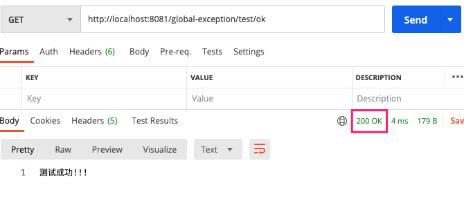
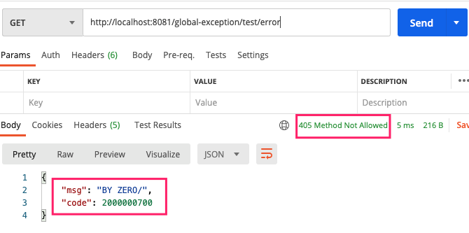
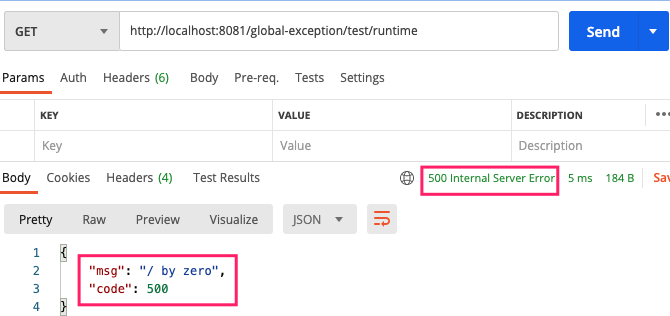

## 引言

* 之前都是全局异常都是rest风格，需要前台从json中获取code来判断请求是否成功。如下：

	```json
	{
	    "timestamp": 1497850427325,
	    "status": 500,
	    "error": "Internal Server Error",
	    "message": "server error",
	    "path": "/user"
	}
	```

* 现在有更好的方式，即将json中code放到请求状态码中


## 原来的方式-REST

1. 状态码枚举类

	```java
	public enum BizCodeEnume {
	    /*参数校验异常*/
	    VAILD_EXCEPTION(2000000900,"参数校验异常"),
	    /*未知异常*/
	    ENKNOW_EXCEPTION(2000000800,"位置异常");
	
	    private Integer code;
	    private String msg;
	    BizCodeEnume(Integer code,String msg){
	        this.code = code;
	        this.msg = msg;
	    }
	
	    public Integer getCode() {
	        return code;
	    }
	
	    public String getMsg() {
	        return msg;
	    }
	}
	```

2. 全局异常拦截处理类

	```java
	@Slf4j
	//@ResponseBody
	//@ControllerAdvice(basePackages = "com.shuai.gulimall.product.controller")
	@RestControllerAdvice(basePackages = "com.shuai.gulimall.product.controller")
	public class GulimallExceptionControllerAdvice {
	
	    /* 异常处理 - 数据校验错误 */
	    @ExceptionHandler(value = MethodArgumentNotValidException.class)
	    public R handleVaildException(MethodArgumentNotValidException e){
	        log.error("数据校验错误 {} , 异常类型为 {} ", e.getMessage(),e.getClass());
	
	        //错误信息
	        Map<String,String> map = new HashMap<>();
	        BindingResult bindingResult = e.getBindingResult();
	
	        //2. 获取校验错误提示
	        bindingResult.getFieldErrors().forEach((item) ->{
	            //错误提示信息
	            String mess = item.getDefaultMessage();
	            //获取错误的属性名称
	            String field = item.getField();
	            map.put(field,mess);
	        });
	        return R.error(BizCodeEnume.VAILD_EXCEPTION.getCode(),BizCodeEnume.VAILD_EXCEPTION.getMsg()).put("data",map);
	    }
	        /* 公共异常处理 ： 针对具体异常没有匹配到则走这个异常 */
	    @ExceptionHandler(Throwable.class)
	    public R handleException(Throwable e){
	        log.error("未知错误 {}", e.getMessage());
	        return R.error(BizCodeEnume.ENKNOW_EXCEPTION.getCode(),BizCodeEnume.ENKNOW_EXCEPTION.getMsg());
	    }
	
	}
	```

3. 状态码设定

	```java
	/**
	 * 服务异常
	 *
	 * 参考 https://www.kancloud.cn/onebase/ob/484204 文章
	 *
	 * 一共 10 位，分成四段
	 *
	 * 第一段，1 位，类型
	 *      1 - 业务级别异常
	 *      2 - 系统级别异常
	 * 第二段，3 位，系统类型
	 *      001 - 用户系统
	 *      002 - 商品系统
	 *      003 - 订单系统
	 *      004 - 支付系统
	 *      005 - 优惠劵系统
	 *      ... - ...
	 * 第三段，3 位，模块
	 *      不限制规则。
	 *      一般建议，每个系统里面，可能有多个模块，可以再去做分段。以用户系统为例子：
	 *          001 - OAuth2 模块
	 *          002 - User 模块
	 *          003 - MobileCode 模块
	 * 第四段，3 位，错误码
	 *       不限制规则。
	 *       一般建议，每个模块自增。
	 */
	```

4. 全局统一返回对象

	```java
	public class R extends HashMap<String, Object> {
		private static final long serialVersionUID = 1L;
		
		public R() {
			put("code", 0);
			put("msg", "success");
		}
		
		public static R error() {
			return error(HttpStatus.SC_INTERNAL_SERVER_ERROR, "未知异常，请联系管理员");
		}
		
		public static R error(String msg) {
			return error(HttpStatus.SC_INTERNAL_SERVER_ERROR, msg);
		}
		
		public static R error(int code, String msg) {
			R r = new R();
			r.put("code", code);
			r.put("msg", msg);
			return r;
		}
	
		public static R ok(String msg) {
			R r = new R();
			r.put("msg", msg);
			return r;
		}
		
		public static R ok(Map<String, Object> map) {
			R r = new R();
			r.putAll(map);
			return r;
		}
		
		public static R ok() {
			return new R();
		}
	
		public R put(String key, Object value) {
			super.put(key, value);
			return this;
		}
	}
	```

	

## 新方式 -- URL状态码

> 使用 SpringBoot 自带的 **ResponseEntity**

1. 定义错误信息枚举

	```java
	/**
	 * TODO:<p> 用以给GlobelException类中补充项目具体报错信息 <p/>
	 *
	 * @package: com.shuai.globalexception.utils
	 * @Author mac
	 * @Date 2021/9/4 4:08 下午
	 * @Version V1.0
	 **/
	@SuppressWarnings(value = "all")
	@AllArgsConstructor
	@NoArgsConstructor
	public enum BizCodeEnume {
	    /*参数校验异常*/
	    VAILD_EXCEPTION(2000000900,"参数校验异常"),
	    /*by zero异常*/
	    BY_ZERO_EXCEPTION(2000000700,"BY ZERO/"),
	    /*未知异常*/
	    ENKNOW_EXCEPTION(2000000800,"未知异常");
	
	    //todo ... 项目其他异常
	
	    /*项目内部错误码，用以定位问题所在*/
	    private Integer projectCode;
	    /*错误信息*/
	    private String msg;
	
	    public Integer getProjectCode() {
	        return projectCode;
	    }
	
	    public String getMsg() {
	        return msg;
	    }
	}

2. 自定义全局异常类

	```java
	/**
	 * TODO:<p> 所有的自定义异常都继承这个，并提供HttpStatus和BizCodeEnume用以全局异常信息统一返回 <p/>
	 *
	 * @package: com.shuai.globalexception.exception
	 * @Author mac
	 * @Date 2021/9/4 3:51 下午
	 * @Version V1.0
	 **/
	@Data
	@SuppressWarnings(value = "all")
	public class GlobelException extends RuntimeException {
	
	    private HttpStatus httpStatus;
	    private BizCodeEnume bizCodeEnume;
	
	    @Deprecated
	    public GlobelException(HttpStatus httpStatus) {
	        this.httpStatus = httpStatus;
	    }
	    //最好走全局HttpStatus 状态码和全局BizCodeEnume自定义项目异常信息
	    public GlobelException(HttpStatus httpStatus, BizCodeEnume bizCodeEnume) {
	        this.bizCodeEnume = bizCodeEnume;
	        this.httpStatus = httpStatus;
	    }
	    @Deprecated
	    public GlobelException(HttpStatus httpStatus, String msg) {
	        super(msg);
	        this.httpStatus = httpStatus;
	    }
	
	}
	```

3. 全局异常处理类

	```java
	/**
	 * TODO:<p>  <p/>
	 *
	 * @package: com.shuai.globalexception.handle
	 * @Author mac
	 * @Date 2021/9/4 3:52 下午
	 * @Version V1.0
	 **/
	@SuppressWarnings(value = "all")
	@ControllerAdvice
	@Slf4j
	public class GlobalExceptionHandler extends ResponseEntityExceptionHandler {
	
	    @Override
	    protected ResponseEntity<Object> handleExceptionInternal(Exception ex, Object body, HttpHeaders headers, HttpStatus status, WebRequest request) {
	        HttpServletRequest httpServletRequest = ((ServletWebRequest) request).getRequest();
	        String requestUrl = httpServletRequest.getRequestURI();
	        if (ex instanceof NoHandlerFoundException && requestUrl.equals("/")) {
	            //过滤心跳检测
	        } else {
	            String ip = IpUtil.getIpAddr(httpServletRequest);
	            logger.error(String.format("请求来源:%s,请求地址:%s", ip, httpServletRequest.getRequestURI()), ex);
	        }
	
	        return ResponseEntity.status(HttpStatus.ALREADY_REPORTED).body(R.error().put("data", body));
	    }
	
	    /*
	     * TODO <p> 全局可以使用这个自定义异常，然后到这里处理，如果没有为其他异常例如空指针，则由下面最终异常捕获</p>
	     * @author mac
	     * @date 2021/9/4 4:17 下午
	     * @param request e
	     * @return org.springframework.http.ResponseEntity<java.lang.Object>
	     */
	    @ExceptionHandler(value = GlobelException.class)
	    public ResponseEntity<Object> handleMyException(HttpServletRequest request, GlobelException e) throws Exception {
	        String ip = IpUtil.getIpAddr(request);
	        logger.error(String.format("请求来源:%s,请求地址:%s", ip, request.getRequestURI()), e);
	
	        return ResponseEntity.status(e.getHttpStatus().value()).body(R.error().put("msg", e.getBizCodeEnume().getMsg()).put("code", e.getBizCodeEnume().getProjectCode()));
	    }
	
	    @ExceptionHandler(value = Exception.class)
	    public ResponseEntity<Object> handleException(HttpServletRequest request, Exception e){
	        String ip = IpUtil.getIpAddr(request);
	        logger.error(String.format("请求来源:%s,请求地址:%s", ip, request.getRequestURI()), e);
	
	        return ResponseEntity.status(HttpStatus.INTERNAL_SERVER_ERROR).body(R.error().put("msg", e.getMessage()));
	    }
	}
	```

4. 信息包装类

	```java
	/**
	 * TODO:<p> ResponseEntity中body <p/>
	 *
	 * @package: com.shuai.globalexception.utils
	 * @Author mac
	 * @Date 2021/9/4 3:54 下午
	 * @Version V1.0
	 **/
	public class R extends HashMap<String, Object> {
	    private static final long serialVersionUID = 1L;
	
	    public R() {
	        put("code", 0);
	        put("msg", "success");
	    }
	
	    public static R error() {
	        return error(HttpStatus.INTERNAL_SERVER_ERROR.value(), "未知异常，请联系管理员");
	    }
	
	    public static R error(String msg) {
	        return error(HttpStatus.INTERNAL_SERVER_ERROR.value(), msg);
	    }
	
	    public static R error(int code, String msg) {
	        R r = new R();
	        r.put("code", code);
	        r.put("msg", msg);
	        return r;
	    }
	
	    public static R ok(String msg) {
	        R r = new R();
	        r.put("msg", msg);
	        return r;
	    }
	
	    public static R ok(Map<String, Object> map) {
	        R r = new R();
	        r.putAll(map);
	        return r;
	    }
	
	    public static R ok() {
	        return new R();
	    }
	
	    @Override
	    public R put(String key, Object value) {
	        super.put(key, value);
	        return this;
	    }
	}
	```

5. ip工具类

	```java
	/**
	 * TODO:<p>  <p/>
	 *
	 * @package: com.shuai.globalexception.utils
	 * @Author mac
	 * @Date 2021/9/4 3:53 下午
	 * @Version V1.0
	 **/
	
	public class IpUtil {
	    public static String getIpAddr(HttpServletRequest request) {
	        String ip = request.getHeader("x-forwarded-for");
	        System.out.println("x-forwarded-for ip: " + ip);
	        if (ip != null && ip.length() != 0 && !"unknown".equalsIgnoreCase(ip)) {
	            // 多次反向代理后会有多个ip值，第一个ip才是真实ip
	            if (ip.indexOf(",") != -1) {
	                ip = ip.split(",")[0];
	            }
	        }
	        if (ip == null || ip.length() == 0 || "unknown".equalsIgnoreCase(ip)) {
	            ip = request.getHeader("Proxy-Client-IP");
	            System.out.println("Proxy-Client-IP ip: " + ip);
	        }
	        if (ip == null || ip.length() == 0 || "unknown".equalsIgnoreCase(ip)) {
	            ip = request.getHeader("WL-Proxy-Client-IP");
	            System.out.println("WL-Proxy-Client-IP ip: " + ip);
	        }
	        if (ip == null || ip.length() == 0 || "unknown".equalsIgnoreCase(ip)) {
	            ip = request.getHeader("HTTP_CLIENT_IP");
	            System.out.println("HTTP_CLIENT_IP ip: " + ip);
	        }
	        if (ip == null || ip.length() == 0 || "unknown".equalsIgnoreCase(ip)) {
	            ip = request.getHeader("HTTP_X_FORWARDED_FOR");
	            System.out.println("HTTP_X_FORWARDED_FOR ip: " + ip);
	        }
	        if (ip == null || ip.length() == 0 || "unknown".equalsIgnoreCase(ip)) {
	            ip = request.getHeader("X-Real-IP");
	            System.out.println("X-Real-IP ip: " + ip);
	        }
	        if (ip == null || ip.length() == 0 || "unknown".equalsIgnoreCase(ip)) {
	            ip = request.getRemoteAddr();
	            System.out.println("getRemoteAddr ip: " + ip);
	        }
	        System.out.println("获取客户端ip: " + ip);
	        return ip;
	    }
	}
	```

6. 用法类

	```java
	/**
	 * TODO:<p> 使用-用法 <p/>
	 *
	 * @package: com.shuai.globalexception.controller
	 * @Author mac
	 * @Date 2021/9/4 4:22 下午
	 * @Version V1.0
	 **/
	@SuppressWarnings(value = "all")
	@RestController
	@RequestMapping("/test")
	public class TestController {
	
	    /*
	     * TODO <p> 正常使用 返回ResponseEntity即可，不要返回R。可以在ResponseEntity中使用R </p>
	     * @author mac
	     * @date 2021/9/4 4:38 下午
	     * @return com.shuai.globalexception.utils.R
	     */
	    @GetMapping("/ok")
	    public ResponseEntity ok(){
	        System.out.println("=========");
	        return ResponseEntity.ok("测试成功!!!");
	    }
	
	    /*
	     * TODO <p> 异常捕获时，直接抛出异常即可，不需要使用ResponseEntity.status()进行抛出 </p>
	     * @author mac
	     * @date 
	        System.out.println("=======");
	        System.out.println(8/0);
	        return ResponseEntity.ok("测试成功!!!");
	    }
	}
	```

	

7.  测试

	

	

	

	