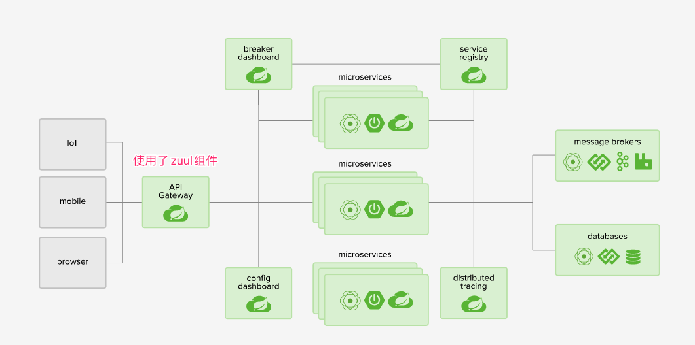
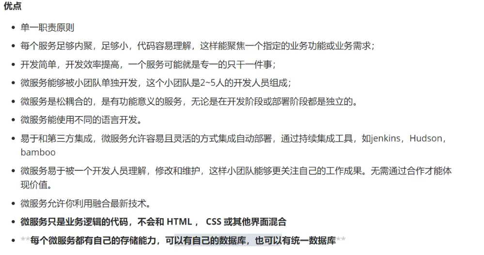
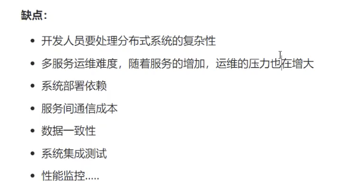
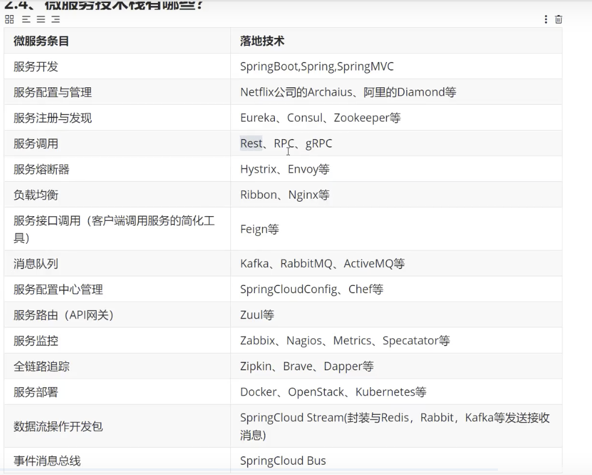
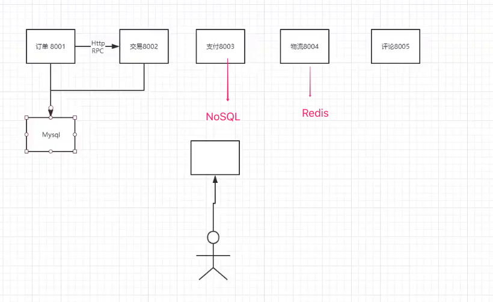
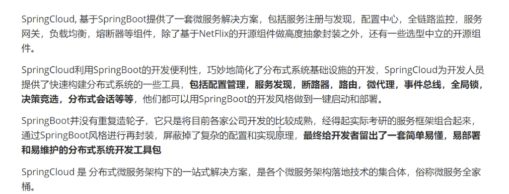
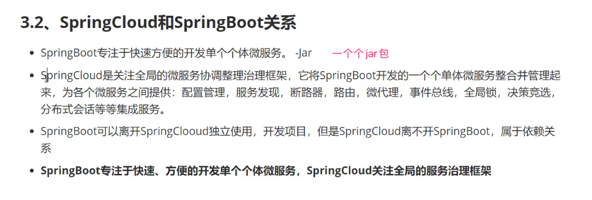
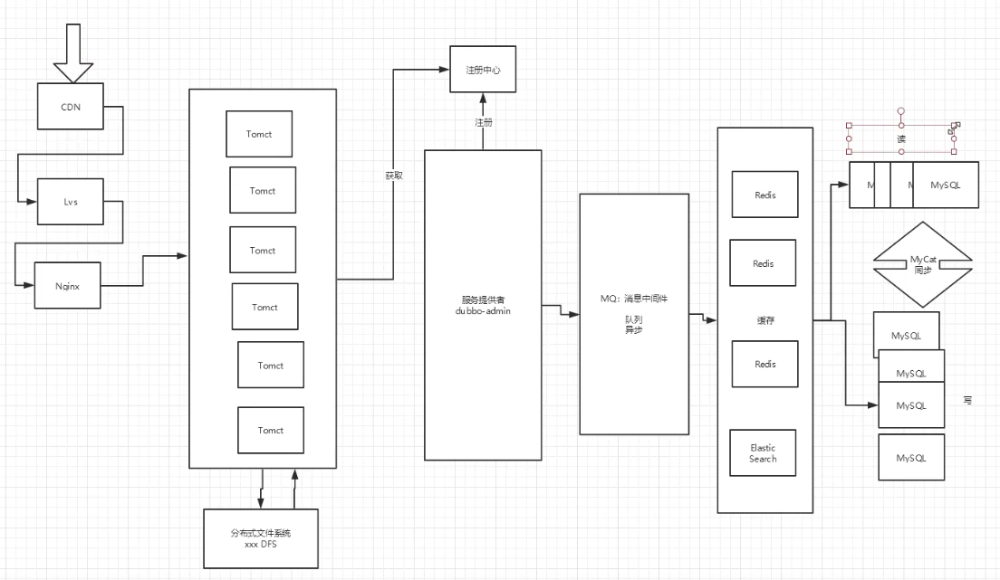
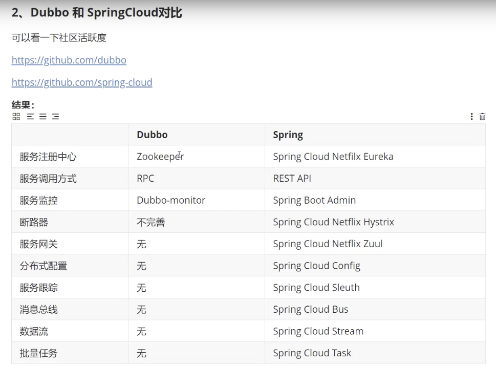
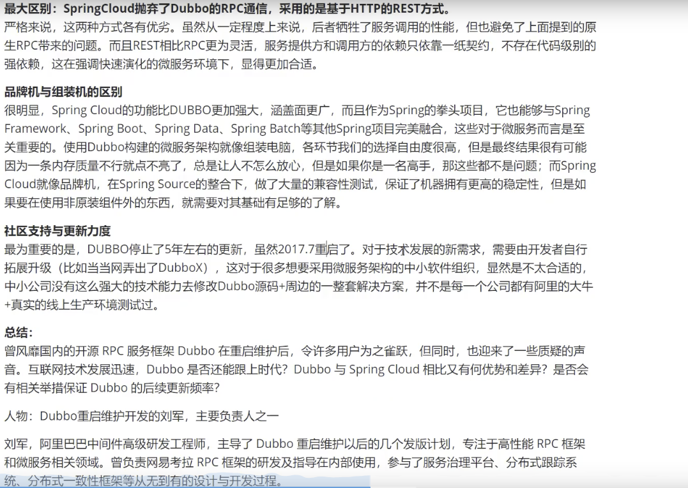

### 回顾之前的内容

* javase

* 数据库

* 前端

* servlet

* http

* mybatis

* spring

* springmvc

* springboot

* dubbo、zookeeper、分布式基础

* Maven、Git

* ajax、json

  

### 串一下自己需要会的

* mybatis
* spring
* springmvc
* springboot
* dubbo、zookeeper、分布式基础
* Maven、Git
* ajax、json

### 这个阶段如何学

#### 架构演化

* 三层架构 + MVC
* 框架：	
  * spring IOC aop  解决企业化简化开发
  * springboot 重构之前的spring项目。简化之前的spring项目。新一代Java ee开发标准  自动装配
    		
  * 微服务：负载均衡已没有用、模块化开发(人越来越多，横向扩展服务器已经解决不了了[通过将不同量级的服务模块拆分放置在不同的服务器上，例如：支付业务比重大，放置更多的服务器处理支付业务。]) 则all in one   模块化分布式开发，代码并没有变化

微服务架构四个核心问题？
	1、这么多服务、客户端怎么访问？
	2、这么多服务、服务之间怎么通信？
		HTTP、RPC
   3、这么多服务、如何治理？
  	注册中心
   4、服务器挂了怎么办？
  	冗灾

#### 解决方案：spring cloud  是一个生态用于解决上面的四个问题。并不是一门技术。

* spring cloud netFlix
  		一站式解决方案。上面的4个问题一一解决
  			1、api网关：使用了zuul组件进行通信
  			2、feign--httpclient----http通信方式。同步阻塞
  			3、服务注册发现：Eureka
  			4、熔断机制：hystrix
  			

* apache Dubbo Zookeeper
  	半自动，需要整合别人的才能解决上面四个问题

  ​	1、api网关：没有，找第三方组件，或者自己实现

  ​	2、dubbo：rpc通信框架

  ​	3、zookeeper

  ​	4、没有熔断机制，找别人的

  * 并不完善 但是RPC牛逼。。

* spring cloud alibaba
  	netflix停更，新出的一站式解决方案 和netFlix近似。但是更加简化

   

#### 新概念

服务网络  server mesh  

​	istio

### 怎么学

万变不离其宗，就上面那四个问题

1. api
2. HTTP 、RPC
3. 注册发现
4. 熔断机制

### 产生上面四个问题的原因

网络不可靠导致！

### 什么是spring cloud

### 传统很全面的网站架构

大版本对应：

| Spring Boot   | Spring Cloud             |
| :------------ | :----------------------- |
| 1.2.x         | Angel版本                |
| 1.3.x         | Brixton版本              |
| 1.4.x stripes | Camden版本               |
| 1.5.x         | Dalston版本、Edgware版本 |
| 2.0.x         | Finchley版本             |
| 2.1.x         | Greenwich.SR2            |

在实际开发过程中，我们需要更**详细的版本对应 (\**https://start.spring.io/actuator/info\**)**：

 

| spring-boot-starter-parent                              | spring-cloud-dependencies |        |                          |              |        |
| :------------------------------------------------------ | :------------------------ | :----- | :----------------------- | :----------- | :----- |
| 版本号                                                  | 发布日期                  |        | 版本号                   | 发布日期     |        |
| 1.5.2.RELEASE                                           | 2017年3月                 | 稳定版 | Dalston.RC1              | 2017年未知月 |        |
| 1.5.9.RELEASE                                           | 2017年11月                | 稳定版 | Edgware.RELEASE          | 2017年11月   | 稳定版 |
| 1.5.16.RELEASE                                          |                           |        | Edgware.SR5              |              |        |
| 1.5.20.RELEASE                                          |                           |        | Edgware.SR5              |              |        |
| Spring Boot >=2.0.0.M3 and <2.0.0.M5                    |                           |        | Finchley.M2              |              |        |
| Spring Boot >=2.0.0.M5 and <=2.0.0.M5                   |                           |        | Finchley.M3              |              |        |
| Spring Boot >=2.0.0.M6 and <=2.0.0.M6                   |                           |        | Finchley.M4              |              |        |
| Spring Boot >=2.0.0.M7 and <=2.0.0.M7                   |                           |        | Finchley.M5              |              |        |
| Spring Boot >=2.0.0.RC1 and <=2.0.0.RC1                 |                           |        | Finchley.M6              |              |        |
| Spring Boot >=2.0.0.RC2 and <=2.0.0.RC2                 |                           |        | Finchley.M7              |              |        |
| Spring Boot >=2.0.0.RELEASE and <=2.0.0.RELEASE         |                           |        | Finchley.M9              |              |        |
| Spring Boot >=2.0.1.RELEASE and <2.0.2.RELEASE          |                           |        | Finchley.RC1             |              |        |
| Spring Boot >=2.0.2.RELEASE and <2.0.3.RELEASE          |                           |        | Finchley.RC2             |              |        |
| Spring Boot >=2.0.3.RELEASE and <2.0.999.BUILD-SNAPSHOT |                           |        | Finchley.SR4             |              |        |
| Spring Boot >=2.0.999.BUILD-SNAPSHOT and <2.1.0.M3      |                           |        | Finchley.BUILD-SNAPSHOT  |              |        |
| Spring Boot >=2.1.0.M3 and <2.1.0.RELEASE               |                           |        | Greenwich.M1             |              |        |
| Spring Boot >=2.1.0.RELEASE and <2.1.9.BUILD-SNAPSHOT   |                           |        | Greenwich.SR2            |              |        |
| Spring Boot >=2.1.9.BUILD-SNAPSHOT and <2.2.0.M4        |                           |        | Greenwich.BUILD-SNAPSHOT |              |        |
| Spring Boot >=2.2.0.M4 and <=2.2.0.M5                   |                           |        | Hoxton.M2                |              |        |
| Spring Boot >=2.2.0.BUILD-SNAPSHOT                      |                           |        | Hoxton.BUILD-SNAPSHOT    |              |        |
| 待更新...                                               |                           |        |                          |              |        |