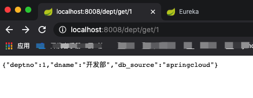

## Hystrix-Dashboard

1. 新建模块SpringCloud-Hystrix-Dashboard-8001

2. 导入依赖

   ```xml
   <!--依赖-->
   <dependencies>
       <dependency>
           <groupId>com.shuai</groupId>
           <artifactId>SpringCloud-API</artifactId>
           <version>1.0-SNAPSHOT</version>
           <scope>compile</scope>
       </dependency>
       <!--热部署-->
       <dependency>
           <groupId>org.springframework.boot</groupId>
           <artifactId>spring-boot-devtools</artifactId>
           <version>2.1.6.RELEASE</version>
       </dependency>
       <!--web依赖-->
       <dependency>
           <groupId>org.springframework.boot</groupId>
           <artifactId>spring-boot-starter-web</artifactId>
           <version>2.1.4.RELEASE</version>
       </dependency>
       <!--Ribbon依赖-->
       <!--        <dependency>-->
       <!--            <groupId>org.springframework.cloud</groupId>-->
       <!--            <artifactId>spring-cloud-starter-netflix-ribbon</artifactId>-->
       <!--            <version>1.4.6.RELEASE</version>-->
       <!--        </dependency>-->
       <!--Ribbon依赖于eureka客户端-->
       <dependency>
           <groupId>org.springframework.cloud</groupId>
           <artifactId>spring-cloud-starter-eureka</artifactId>
           <version>1.4.6.RELEASE</version>
       </dependency>
       <dependency>
           <groupId>com.google.code.gson</groupId>
           <artifactId>gson</artifactId>
           <version>2.8.5</version>
       </dependency>
       <!--feign依赖-->
       <dependency>
           <groupId>org.springframework.cloud</groupId>
           <artifactId>spring-cloud-starter-feign</artifactId>
           <version>1.4.6.RELEASE</version>
       </dependency>
       <!--hystrix-->
       <dependency>
           <groupId>org.springframework.cloud</groupId>
           <artifactId>spring-cloud-starter-hystrix</artifactId>
           <version>1.4.6.RELEASE</version>
       </dependency>
       <dependency>
           <groupId>org.springframework.cloud</groupId>
           <artifactId>spring-cloud-starter-hystrix-dashboard</artifactId>
           <version>1.4.6.RELEASE</version>
       </dependency>
   </dependencies>
   ```

3. 添加配置

   ```yaml
   server:
     port: 9001
   ```

4. 开启功能

   ```java
   @SpringBootApplication
   @EnableHystrixDashboard//开启监控
   public class DeptConsumerDashboard_9001 {
       public static void main(String[] args) {
           SpringApplication.run(DeptConsumerDashboard_9001.class, args);
       }
   }
   ```

> 由于Hystrix是配置在服务端(<font color=ff00aa>服务消费方</font>)中，因此开启监控信息必须要在<font color=ff00aa>服务提供方中的actuator</font>做支持。

5. 测试

   * 单独启动9001端口对应的Dashboard服务模块。
   * 不去管报错信息，直接访问 http://localhost:9001/hystrix

   

   > 其中url为监控的URL地址，然后下面紧接着是监控轮训时间以及监控名称。

6. 为==服务提供方==添加Servlet

   * 因为要在服务提供方模块中使用Hytstrix，因此需要在三个==服务提供方==模块中添加Hystrix依赖

     ```xml
     <!--hystrix-->
     <dependency>
         <groupId>org.springframework.cloud</groupId>
         <artifactId>spring-cloud-starter-hystrix</artifactId>
         <version>1.4.6.RELEASE</version>
     </dependency>
     ```

   * 在启动类中添加(目前有三个服务提供方)

     在需要被监控的服务提供方中添加servlet==这里应该是HystrxDeptProvider_8008==而不是上面说到的三个SpringCloud-Provider-800*模块。
     
     ```java
     //增加servlet
         @Bean
         public ServletRegistrationBean HystrixMetricsStreamServlet(){
             ServletRegistrationBean registrationBean =new ServletRegistrationBean(new HystrixMetricsStreamServlet());
             //此URL为http://localhost:9001/hystrix首页提供的URL
             registrationBean.addUrlMappings("/actuator/hystrix.stream");
             return registrationBean;
       }
     ```
     
     

7. 测试
   * 启动一个Eureka注册中心
   * 启动==Hystrix-Dashboard==模块
   * 启动==HystrxDeptProvider_8008==模块(必须是此模块，否则只有ping)

> <font color=ff00aa>问题：</font> 此时如果单独启动一个Eureka注册中心，再启动三个服务提供模块时就会报错：com.sun.jersey.api.client.ClientHandlerException: java.net.ConnectException: Connection refused: connect

> <font color=ff00aa>解决：</font> 启动三个Eureka集群(暂时先这样)

   *    访问==Hystrix 服务提供模块== ：http://localhost:8008/dept/get/1

	

* 继续访问==Hystrix 服务提供模块== 获取发送的心跳包数据 http://localhost:8008/actuator/hystrix.stream

	

* 将==Hystrix 服务提供模块==发送的心跳包数据交由Hystrix-Dashboard分析监控

	* 访问==Hystrix-Dashboard服务==

		

		

		