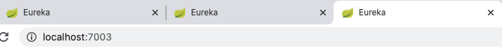

## 为什么需要Eureka

​			没有服务注册发现时，服务与服务A、B、C、D之间都是通过http或者rpc进行远程调用，这样就势必会需要远程IP地址，而如果有很多个服务相互调用，并且当服务IP地址改变后，代码中IP地址就需要手动进行维护，很是麻烦。

Eureka是这样解决上面所说的情况的：

​		 	创建一个E服务，将A、B、C、D四个服务的信息都注册到E服务上，E服务维护这些已经注册进来的信息 A、B、C、D四个服务都可以拿到Eureka（服务E）那份注册清单。A、B、C、D四个服务互相调用不再通过具体的IP地址，而是通过服务名来调用！

## Eureka基本原理


* 三大角色
  * Eureka Server ：提供服务的注册和发现。
  * Service Consumer ：服务消费者从Eureka获取服务注册清单从而找到消费服务。
  * Service Provider ：服务提供者将服务注册到Eureka中，方便消费方获取。

* 两大组件

  * Eureka包含两个组件 `Eureka Server`，`Eurea Client`

  * Eureka Server提供服务注册服务，各个服务启动后，例如第二章中`服务提供方`模块启动后，会在EurekaServer中进行注册，这样Eureka Server中的服务注册列表中就会存储所有的可用服务信息。并且这些注册服务都可以在界面中直观展现。
  * Eureka Client是一个Java客户端，提供和EurekaServer交互的各种接口，同时也内置了一个轮循负载算法的均衡器，当服务启动后，会向EurekaServer发送心跳(默认周期30s)，如果EurekaServer在多个心跳周期内没哟接收到某个服务的心跳，则EurekaServer会把这个服务从注册列表中删除(默认90s)。

## Spring Cloud整合Eureka

1. 创建`Eureka Server组件`模块

   

2. 模块添加依赖

   ```xml
   <!--导入依赖-->
       <dependencies>
           <dependency>
               <groupId>org.springframework.cloud</groupId>
               <artifactId>spring-cloud-starter-eureka-server</artifactId>
               <version>1.4.6.RELEASE</version>
           </dependency>
   
       </dependencies>
   ```

3. 编写配置

   ```yaml
   server:
     port: 7001
   
   # Eureka配置
   eureka:
     instance:
       hostname: localhost  #Eureka服务端的实例名称
     client:
       register-with-eureka: false # 表示是否向eureka注册中心注册自己
       fetch-registry: false # 如果为false 则表示自己为注册中心
       service-url: # 监控页面
         defaultZone: http://${eureka.instance.hostname}:${server.port}/eureka # 覆盖默认提供的url
   ```

4. 开启功能

   ```java
   @SpringBootApplication
   @EnableEurekaServer // 服务端启动类，可以接受别人注册进来
   public class EurekaServer_7001 {
       public static void main(String[] args) {
           SpringApplication.run(EurekaServer_7001.class,args);
       }
   }
   ```

   

5. 启动测试

   * 启动报错 

     > The following method did not exist: com.google.gson.GsonBuilder.setLenient()Lcom/google/gson/GsonBuilder;

   * 加入gson依赖

     ```xml
     <dependency>
         <groupId>com.google.code.gson</groupId>
         <artifactId>gson</artifactId>
         <version>2.8.5</version>
     </dependency>
     ```

     

6. 将`服务提供`模块服务加入到Eureka Server

   > 经过上面的1~5步骤，Eureka Server组件已就绪，提可供其他服务进行注册至服务注册列表。下面将之前的模块SpringCloud-Provider-8001服务加入到Eureka Server

   * 在`服务提供`模块中加入依赖

     ```xml
     <!--Eureka服务依赖-->
             <dependency>
                 <groupId>org.springframework.cloud</groupId>
                 <artifactId>spring-cloud-starter-eureka</artifactId>
                 <version>1.4.6.RELEASE</version>
             </dependency>
     ```

   * 在`服务提供`模块中加入配置Eureka服务

     ```xml
     #Eureka配置。服务注册到哪里
     eureka:
       client:
         service-url:
           defaultZone: http://localhost:7001/eureka
     ```

     

   * 在`服务提供`模块启动类中开启Eureka Client功能

     ```java
     @SpringBootApplication
     @EnableEurekaClient//自动将此服务加入到Eureka Server中
     public class DeptProvider_8001 {
         public static void main(String[] args) {
             SpringApplication.run(DeptProvider_8001.class, args);
         }
     }
     ```


7. 测试服务是否注册到Eureka Server

   * 先启动`Eureka Server`模块服务 【SpringCloud-Eureka-7001】

   * 再启动`服务提供`模块 【SpringCloud-Provider-8001】

     > <font color=ff00aa>提示：</font> 在该模块开启Eureka Client注解功能后，启动报错 如第5步：加入加入gson依赖

   * 进入Eurek 服务首页可以看到`服务提供`模块 服务已经注册到Eureka Server服务列表内

     

   

8. 在Eureka中加入对服务的监控信息

   * 在`服务提供`模块中加入依赖

     ```xml
     <!--actuator完善监控信息-->
             <dependency>
                 <groupId>org.springframework.boot</groupId>
                 <artifactId>spring-boot-starter-actuator</artifactId>
                 <version>2.2.0.RELEASE</version>
             </dependency>
             <dependency>
                 <groupId>org.springframework.boot</groupId>
                 <artifactId>spring-boot-actuator-autoconfigure</artifactId>
                 <version>2.1.6.RELEASE</version>
             </dependency>
     ```

     

   * 加入INFO配置`服务提供`模块【描述该服务信息】

     ```yaml
     #info配置
     info:
       app.name: shuai-SpringCloud
       company.name: blog.shuai.com
     ```

     

9. 测试监控信息

   * 先启动`Eureka Server`模块服务 【SpringCloud-Eureka-7001】

   * 再启动`服务提供`模块 【SpringCloud-Provider-8001】

   

   中添加方法

    ```java
    @Autowired
        private DiscoveryClient client;
        //获取注册进来的微服务信息
        @GetMapping("/dept/discovery")
        public Object discovery(){
            List<String> services = client.getServices();
            System.out.println("discovery=>services:"+services);
            services.forEach(x -> System.out.println(x.toString()));
            return this.client;
        }
    ```

    * 在微服务(上产服务模块)启动类中添加注解

      ```java
      @EnableDiscoveryClient//服务发现
      ```

      

    

11. 创建Eureka集群

    > 防止一个Eureka Server崩掉后全盘崩

    拷贝上面`Eureka Server`组件模块修改端口号和启动类名称即可

    

    

    

    > 三个Eureka Server微服务全部启动。并且此时三个微服务并没有关联，即其中一个崩掉后其余两个并没有及时的进行替补。下面来做这个事。

    

12. Eureka Server集群关联

    * 修改hosts文件，添加三个服务名称映射。

      
    
    * 修改`SpringCloud-Erueka-7001`模块yml
    
  ```yaml
      server:
    port: 7001
      
      # Eureka配置
      eureka:
        instance:
      hostname: eureka01  #Eureka服务端的实例名称 -> 修改为hosts映射名称不能使用hostname
        client:
      register-with-eureka: false # 表示是否向eureka注册中心注册自己
          fetch-registry: false # 如果为false 则表示自己为注册中心
          service-url: # 监控页面
            defaultZone: http://eureka02:7002/eureka/,http://eureka03:7003/eureka/ # 集群 覆盖默认提供的url
      #      defaultZone: http://${eureka.instance.hostname}:${server.port}/eureka # 单机 覆盖默认提供的url
  
      spring:
    application:
          name: Eureka-Server
  ```

    * 修改`SpringCloud-Erueka-7002`模块yml
    
      ```yaml
      server:
        port: 7002
      
      # Eureka配置
      eureka:
        instance:
          hostname: eureka02  #Eureka服务端的实例名称
    client:
          register-with-eureka: false # 表示是否向eureka注册中心注册自己
      fetch-registry: false # 如果为false 则表示自己为注册中心
          service-url: # 监控页面
        defaultZone: http://eureka01:7001/eureka/,http://eureka03:7003/eureka/ # 集群 覆盖默认提供的url
      #      defaultZone: http://${eureka.instance.hostname}:${server.port}/eureka # 单机 覆盖默认提供的url
      
      spring:
        application:
          name: Eureka-Server
      ```
    
    * 修改`SpringCloud-Erueka-7003`模块yml
    
      ```yaml
      server:
        port: 7003
      
      # Eureka配置
      eureka:
        instance:
          hostname: eureka03  #Eureka服务端的实例名称
        client:
          register-with-eureka: false # 表示是否向eureka注册中心注册自己
          fetch-registry: false # 如果为false 则表示自己为注册中心
          service-url: # 监控页面
            defaultZone: http://eureka01:7001/eureka/,http://eureka02:7002/eureka/ # 集群 覆盖默认提供的url
      #      defaultZone: http://${eureka.instance.hostname}:${server.port}/eureka # 单机 覆盖默认提供的url
      
      spring:
        application:
          name: Eureka-Server
      ```
    
    * 修改`服务提供`模块注册地址
    
      > 之前服务提供模块注册地址 为单机Eureka Server 现在改为集群地址即可
    
      ```yaml
      #Eureka配置。服务注册到哪里
      eureka:
        client:
          service-url:
      #      defaultZone: http://localhost:7001/eureka # 单机
            defaultZone: http://eureka01:7001/eureka,http://eureka02:7002/eureka,http://eureka03:7003/eureka # 集群
        instance:
          instance-id: SpringCloud-Provider-8001 #修改Eureka上服务描述信息
      
      ```
    
      > <font color=ff00aa>注意：</font> eureka.client.serviceUrl.defaultZone配置项的地址，不能使用localhost，要使用域名
    
    * 测试
    
      Eureka Server集群启动以及服务提供模块启动。
    
      

## Eureka自我保护机制

默认情况下，**如果Eureka Server在一定时间内（默认90秒）没有接收到某个微服务实例的心跳，Eureka Server将会移除该实例**。但是当某一个分区网络发生故障时。会出现 微服务本身是健康的，只是微服务和EurekaServer之间无法正常通信。按照默认情况就会在服务注册列表中删除该服务节点。但是我们并不希望由于网络的问题而删除该服务节点，因此引出了自我保护机制。


自我保护机制的工作机制是：**如果在15分钟内超过85%的客户端节点都没有正常的心跳，那么Eureka就认为客户端与注册中心出现了网络故障，Eureka Server自动进入自我保护机制**


> 在SpringCloud中，可以使用`eureka.server.enable-self-preservation=false`禁用自我保护模式，并不推荐。

## Eureka和Zookeeper区别

* 回顾CAP原则
	* RDBMS (Mysql、Oracle、sqlserver)   ===> ACID原则
	* NoSQL(Redis、MongoDB)  ===> CAP原则
* ACID 是什么
	* A ： Atomicity   原子性
	* C ：Consistency  一致性
	* I ：Isolation 隔离性
	* D ：Durability 持久性

* CAP是什么

	* C ：Consistency  强一致性 

		> 减少服务节点。就会导致可用性降低。

	* A ：Availability  可用性   

		> 增加服务节点副本来达到高可用,即冗余。但是当节点过多就会导致数据一致性问题。

	* P ：Partition tolerance 分区容错性

		> 在服务实例发生异常时，分布式系统任然能够满足一致性和可用性

	> CAP 的三进二：CP、AP、CP

* CAP 核心理论

	* 一个分布式系统不可能同时很好的满足一致性、可用性、分区容错性这三个需求

	* 根据CAP原理、将NOSQL数据库分成了满足CA原则、满足CP原则和满足AP原则三大类

		* CA ：单点集群(服务只有一个节点)、满足一致性、可用性的系统。 通常可扩展性较差。

		* CP ：满足一致性。分区容错性、通常性能不是特特别高。例如ZooKeeper

		* AP ：满足可用性、分区容错性的系统，通常可能对一致性要求低一些。例如Eureka集群

* ZooKeeper保证CP

	当向注册中心查询服务列表时，我们可以容忍注册中心返回的是几分钟以前的注册信息，但不能接受服务直接down掉不可用。也就是说，服务注册功能对可用性的要求要高于一致性。但是zk会出现这样一种情况，当master节点因为网络故障与其他节点失去联系时，剩余节点会重新进行leader选举。问题在于，选举leader的时间太长，30 ~ 120s, 且选举期间整个zk集群都是不可用的，这就导致在选举期间注册服务瘫痪。在云部署的环境下，因网络问题使得zk集群失去master节点是较大概率会发生的事，虽然服务能够最终恢复，但是漫长的选举时间导致的注册长期不可用是不能容忍的。

* Eureka保证AP

	Eureka看明白了这一点，因此在设计时就优先保证可用性。Eureka各个节点都是平等的，几个节点挂掉不会影响正常节点的工作，剩余的节点依然可以提供注册和查询服务。而Eureka的客户端在向某个Eureka注册或时如果发现连接失败，则会自动切换至其它节点，只要有一台Eureka还在，就能保证注册服务可用(保证可用性)，只不过查到的信息可能不是最新的(不保证强一致性)。除此之外，Eureka还有一种自我保护机制，如果在15分钟内超过85%的节点都没有正常的心跳，那么Eureka就认为客户端与注册中心出现了网络故障，此时会出现以下几种情况：

	1. Eureka不再从注册列表中移除因为长时间没收到心跳而应该过期的服务
	2. Eureka仍然能够接受新服务的注册和查询请求，但是不会被同步到其它节点上(即保证当前节点依然可用)
	3. 当网络稳定时，当前实例新的注册信息会被同步到其它节点中

	> 因此， Eureka可以很好的应对因网络故障导致部分节点失去联系的情况，而不会像zookeeper那样使整个注册服务瘫痪。