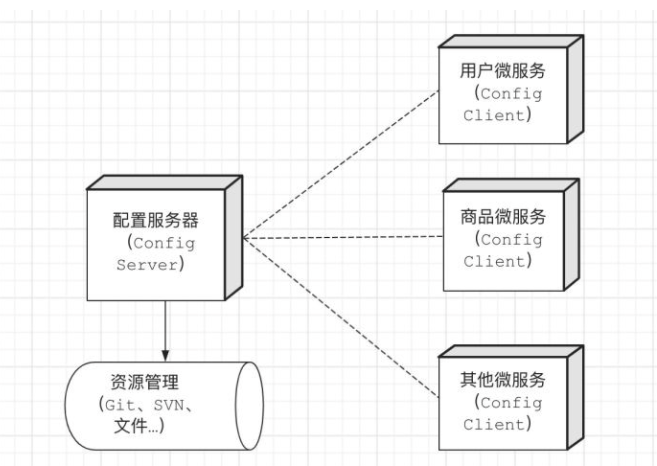
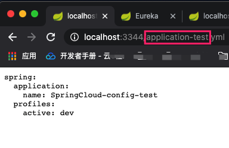
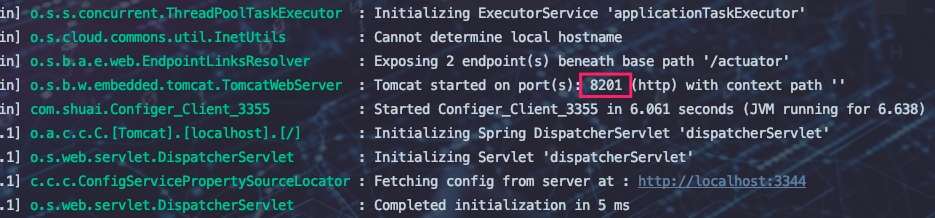
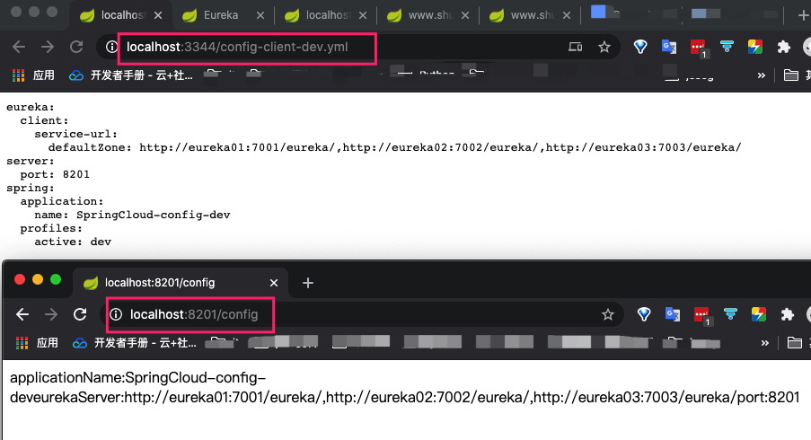
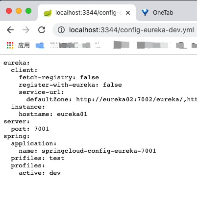
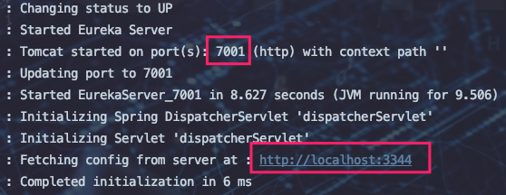
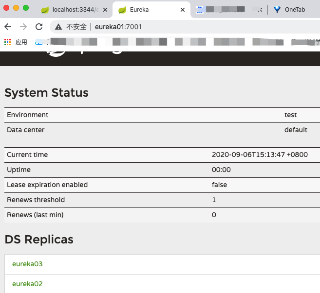

## 是什么

在普通单体应用，我们常使用配置文件(application(*).properties(yml))管理应用的所有配置。这些配置文件在单体应用中非常胜任其角色，并没有让我们感觉到有头疼的地方。但随着微服务框架的引入，微服务数量就会在我们产品中不断增加，之前我们重点考虑的是系统的可伸缩、可扩展性好，但随之就是配置管理的问题就会一一暴露出来。起初微服务器各自管各自的配置，在开发阶段并没什么问题，但到了生产环境管理就会很头疼，如果要大规模更新某项配置，困难就可想而知。

为此，在分布式系统中，Spring Cloud提供一个Config子项目，该项目核心就是配置中心，通过一个服务端和多个客户端实现配置服务。我们可使用配置服务器集中的管理所有服务的各种环境配置文件。配置服务中心默认采用Git的方式进行存储，因此我们很容易部署修改，并可以对环境配置进行版本管理



## 两个角色

Spring Cloud Config有两个角色`Server`和`Client`。

`Server`作为配置中心的服务端作用：

1. 当配置客户端获取配置时，服务端及时从Git仓库中获取配置副本，从而保证配置数据为最新。
2. 支持从yml、json、properties等文件加载配置
3. 配置Eureka可实现服务发现，配置Cloud Bus可实现配置推送更新
4. 默认配置存储基于Git，从而支持配置的版本管理。

`Client`只需要在引导配置文件中声明所使用的配置服务器地址即可。

## 分布式配置中心和Github整合

1. 新建模块==SpringCloud-confitg-server-3344==

2. 导入依赖

	```xml
	<dependencies>
	    <!--Config-->
	    <!-- https://mvnrepository.com/artifact/org.springframework.cloud/spring-cloud-config-server -->
	    <dependency>
	        <groupId>org.springframework.cloud</groupId>
	        <artifactId>spring-cloud-config-server</artifactId>
	        <version>2.1.1.RELEASE</version>
	    </dependency>
	
	    <!--web依赖-->
	    <dependency>
	        <groupId>org.springframework.boot</groupId>
	        <artifactId>spring-boot-starter-web</artifactId>
	    </dependency>
	  <!--actuator完善监控信息-->
	        <dependency>
	            <groupId>org.springframework.boot</groupId>
	            <artifactId>spring-boot-starter-actuator</artifactId>
	            <version>2.1.1.RELEASE</version>
	        </dependency>
	</dependencies>
	```

	

3. 新增配置文件

	```yml
	server:
	  port: 3344
	
	spring:
	  application:
	    name: SpringCloud-Config-Server
	
	#连接远程仓库  获取配置文件
	  cloud:
	    config:
	      server:
	        git:
	          uri: https://gitee.com/gadeGG/spring-cloud-config.git   # https 不是git
	```

4. 开启功能

	```java
	@SpringBootApplication
	@EnableConfigServer  //开启服务
	public class Config_Server_3344 {
	    public static void main(String[] args) {
	        SpringApplication.run(Config_Server_3344.class,args);
	    }
	}
	```

	

5. 新建GitHub仓库==spring-cloud-config== 并新增application.yml

	```yml
	spring:
	
	  profiles:
	
	    active: dev
	
	---
	
	spring:
	
	  profiles: dev
	
	  application:
	
	    name: SpringCloud-config-dev
	
	---
	
	spring:
	
	  profiles: test
	
	  application:
	
	    name: SpringCloud-config-test
	```

6. 测试

	

7. 新建模块==SpringCloud-confitg-client-3355==

8. 导入依赖

	```xml
	<dependencies>
	    <!--Config-->
	    <dependency>
	        <groupId>org.springframework.cloud</groupId>
	        <artifactId>spring-cloud-starter-config</artifactId>
	        <version>2.1.1.RELEASE</version>
	    </dependency>
	
	    <!--web依赖-->
	    <dependency>
	        <groupId>org.springframework.boot</groupId>
	        <artifactId>spring-boot-starter-web</artifactId>
	    </dependency>
	    <!--actuator完善监控信息-->
	    <dependency>
	        <groupId>org.springframework.boot</groupId>
	        <artifactId>spring-boot-starter-actuator</artifactId>
	        <version>2.1.1.RELEASE</version>
	    </dependency>
	</dependencies>
	```

9. 新增application.yml

	```yml
	# 用户级别
	spring:
	  application:
	    name: SpringCloud-Config-client-3355
	```

10. 新增bootstrap.yml

	```yaml
	# bootstrap 为系统级别配置
	# application 为用户级别配置
	spring:
	  cloud:
	    config:
	      uri: http://localhost:3344  #连接Config-Server 中转站然后获取config文件
	      name: config-client  #需要从git上读取的资源名称，不需要后缀
	      profile: dev # 在哪个生产环境生效
	      label: master # 从哪个分支上获取
	```

11. 新增启动类

	```java
	@SpringBootApplication
	public class Configer_Client_3355 {
	    public static void main(String[] args) {
	        SpringApplication.run(Configer_Client_3355.class,args);
	    }
	}
	```

12. 新增控制类

	```java
	@RestController
	public class ConfigClientController {
	    @Value("${spring.application.name}")
	    private String applicationName;
	    @Value("${eureka.client.service-url.defaultZone}")
	    private String eurekaServer;
	    @Value("${server.port}")
	    private String port;
	
	
	    @RequestMapping("/config")
	    public String getConfig(){
	        return "applicationName:"+applicationName+"eurekaServer:"+eurekaServer+"port:"+port;
	    }
	}
	```

13. 仓库==spring-cloud-config== 并新增config-client.yml

	```yml
	spring:
	  profiles:
	    active: dev
	
	---
	server:
	  port: 8201
	spring:
	  profiles: dev
	  application:
	    name: SpringCloud-config-dev
	
	#Eureka配置
	#Eureka配置。服务注册到哪里
	eureka:
	  client:
	    service-url:
	      defaultZone: http://eureka01:7001/eureka/,http://eureka02:7002/eureka/,http://eureka03:7003/eureka/ # 集群
	
	---
	server:
	  port: 8202
	spring:
	  profiles: test
	  application:
	    name: SpringCloud-config-test
	
	#Eureka配置
	#Eureka配置。服务注册到哪里
	eureka:
	  client:
	    service-url:
	      defaultZone: http://eureka01:7001/eureka/,http://eureka02:7002/eureka/,http://eureka03:7003/eureka/ # 集群
	```

14. 测试

	> ==SpringCloud-confitg-client-3355==连接Config-Server 中转站然后获取config文件并配置生效

	* 上面我们并没有给==SpringCloud-confitg-client-3355==添加端口号

	* 启动==SpringCloud-confitg-server-3344==
	* 启动==SpringCloud-confitg-client-3355==

	* 发现；3355能够启动并且读取到了config-client文件中的dev端口号

	

	

15. 将之前的Eureka-7001和Provider-8001配置文件修改为从Git读取

	* 远程仓库新增两个服务的配置文件

		```yaml
		# config-eureka.yml
		spring:
		  profiles:
		    active: dev
		
		---
		server:
		  port: 7001
		
		# Eureka配置
		eureka:
		  instance:
		    hostname: eureka01  #Eureka服务端的实例名称 -> 修改为hosts映射名称不能使用hostname
		  client:
		    register-with-eureka: false # 表示是否向eureka注册中心注册自己
		    fetch-registry: false # 如果为false 则表示自己为注册中心
		    service-url: # 监控页面
		      defaultZone: http://eureka02:7002/eureka/,http://eureka03:7003/eureka/ # 集群 覆盖默认提供的url
		#      defaultZone: http://${eureka.instance.hostname}:${server.port}/eureka # 单机 覆盖默认提供的url
		
		spring:
		  profiles: dev
		  application:
		    name: springcloud-config-eureka-7001
		
		
		---
		server:
		  port: 7001
		
		# Eureka配置
		eureka:
		  instance:
		    hostname: eureka01  #Eureka服务端的实例名称 -> 修改为hosts映射名称不能使用hostname
		  client:
		    register-with-eureka: false # 表示是否向eureka注册中心注册自己
		    fetch-registry: false # 如果为false 则表示自己为注册中心
		    service-url: # 监控页面
		      defaultZone: http://eureka02:7002/eureka/,http://eureka03:7003/eureka/ # 集群 覆盖默认提供的url
		#      defaultZone: http://${eureka.instance.hostname}:${server.port}/eureka # 单机 覆盖默认提供的url
		
		spring:
		  prifiles: test
		  application:
		    name: springcloud-config-eureka-7001
		```

		```yaml
		#config-provider.yml
		spring:
		  profiles:
		    active: dev
		
		---
		server:
		  port: 8001
		# mybatis 配置
		mybatis:
		  type-aliases-package: com.shuai.api.pojo
		  config-location: classpath:mybatis/mybatis-config.xml
		  mapper-locations: classpath:mybatis/mapper/*.xml
		# spring 配置
		spring:
		  profiles: dev
		  application:
		    name: springcloud-config-provider-8001
		  datasource:
		    type: com.alibaba.druid.pool.DruidDataSource
		    driver-class-name: org.gjt.mm.mysql.Driver
		    url: jdbc:mysql://localhost:3306/springcloud?useUnicode=true&characterEncoding=utf-8
		    username: root
		    password: gao1314..
		#Eureka配置。服务注册到哪里
		eureka:
		  client:
		    service-url:
		      defaultZone: http://eureka01:7001/eureka/,http://eureka02:7002/eureka/,http://eureka03:7003/eureka/ # 集群
		  #      defaultZone: http://localhost:7001/eureka # 单机
		  instance:
		    instance-id: SpringCloud-Provider-8001 #修改Eureka上服务描述信息
		    prefer-ip-address: true #默认显示localhost 修改后显示服务IP地址
		
		#info配置
		info:
		  app.name: shuai-SpringCloud
		  company.name: blog.shuai.com
		
		---
		server:
		  port: 8001
		# mybatis 配置
		mybatis:
		  type-aliases-package: com.shuai.api.pojo
		  config-location: classpath:mybatis/mybatis-config.xml
		  mapper-locations: classpath:mybatis/mapper/*.xml
		# spring 配置
		spring:
		  profiles: test
		  application:
		    name: springcloud-config-provider-8001
		  datasource:
		    type: com.alibaba.druid.pool.DruidDataSource
		    driver-class-name: org.gjt.mm.mysql.Driver
		    url: jdbc:mysql://localhost:3306/springcloud02?useUnicode=true&characterEncoding=utf-8
		    username: root
		    password: gao1314..
		#Eureka配置。服务注册到哪里
		eureka:
		  client:
		    service-url:
		      defaultZone: http://eureka01:7001/eureka/,http://eureka02:7002/eureka/,http://eureka03:7003/eureka/ # 集群
		  #      defaultZone: http://localhost:7001/eureka # 单机
		  instance:
		    instance-id: SpringCloud-Provider-8001 #修改Eureka上服务描述信息
		    prefer-ip-address: true #默认显示localhost 修改后显示服务IP地址
		
		#info配置
		info:
		  app.name: shuai-SpringCloud
		  company.name: blog.shuai.com
		```

	* 新建==SpirngCloud-Config-Eureka-7001==模块，拷贝==SpringCloud-Eureka-7001==的src文件和yml文件

	* 清空==SpirngCloud-Config-Eureka-7001==模块中配置文件，改为从Git读取

	* ==SpirngCloud-Config-Eureka-7001==模块新增config包

		```xml
		<!--Config-->
		<dependency>
		    <groupId>org.springframework.cloud</groupId>
		    <artifactId>spring-cloud-starter-config</artifactId>
		    <version>2.1.1.RELEASE</version>
		</dependency>
		```

	* 新增bootstrap.yml文件，配置Git连接信息：参考==SpringCloud-Config-Client-3355==

		```yaml
		# application.yml
		# 用户级别
		spring:
		  application:
		    name: SpringCloud-Config-Eureka-7001
		```

		```yaml
		# bootstrap.yml
		# bootstrap 为系统级别配置
		# application 为用户级别配置
		spring:
		  cloud:
		    config:
		      uri: http://localhost:3344  #连接Config-Server 中转站然后获取config文件
		      name: config-eureka  #需要从git上读取的资源名称，不需要后缀
		      profile: dev # 在哪个生产环境生效
		      label: master # 从哪个分支上获取
		```

	

16. 测试

	* 启动==SpringCloud-Config-Server-3344==服务

		

	* 启动==SpringCloud-Config-Eureka-7001==服务

		

		

	* ==SpringCloud-Config-Provider-8001==就不多做赘述了。和==SpringCloud-Config-Eureka-7001==配置一样。。