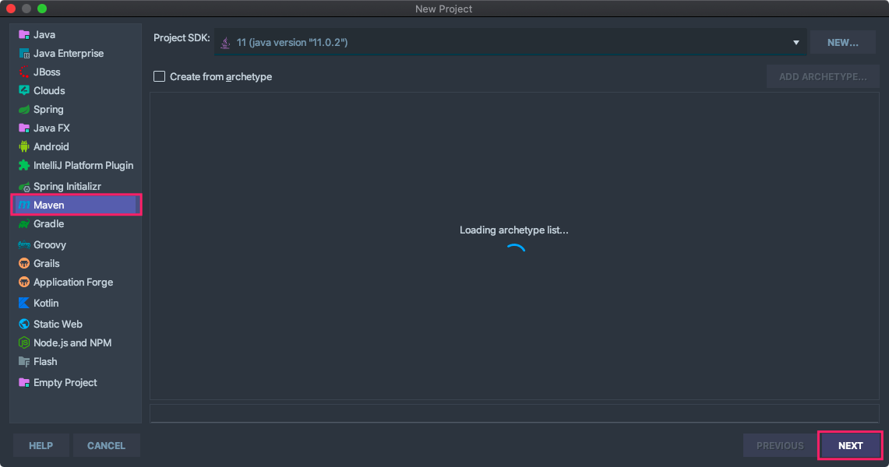
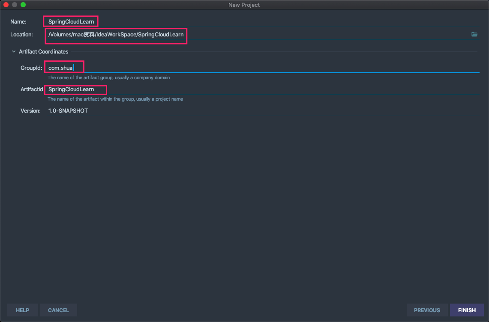
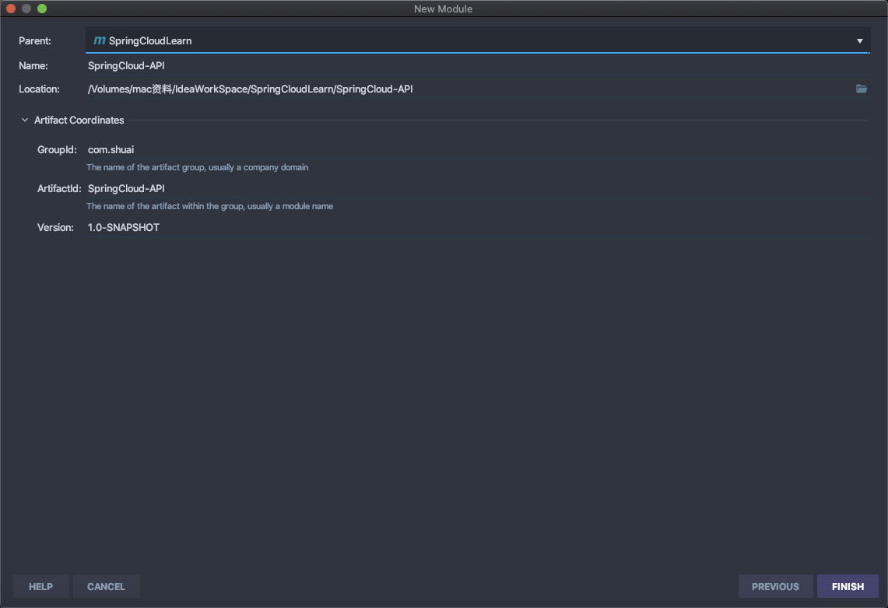
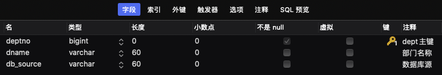
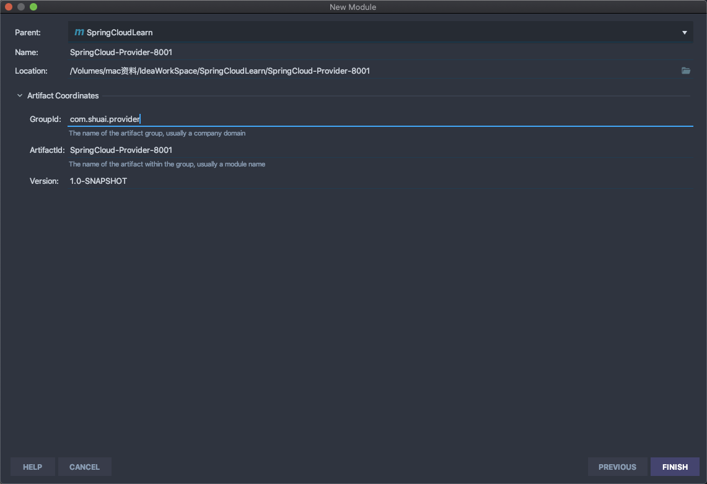
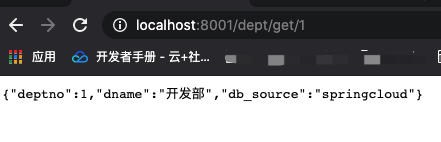
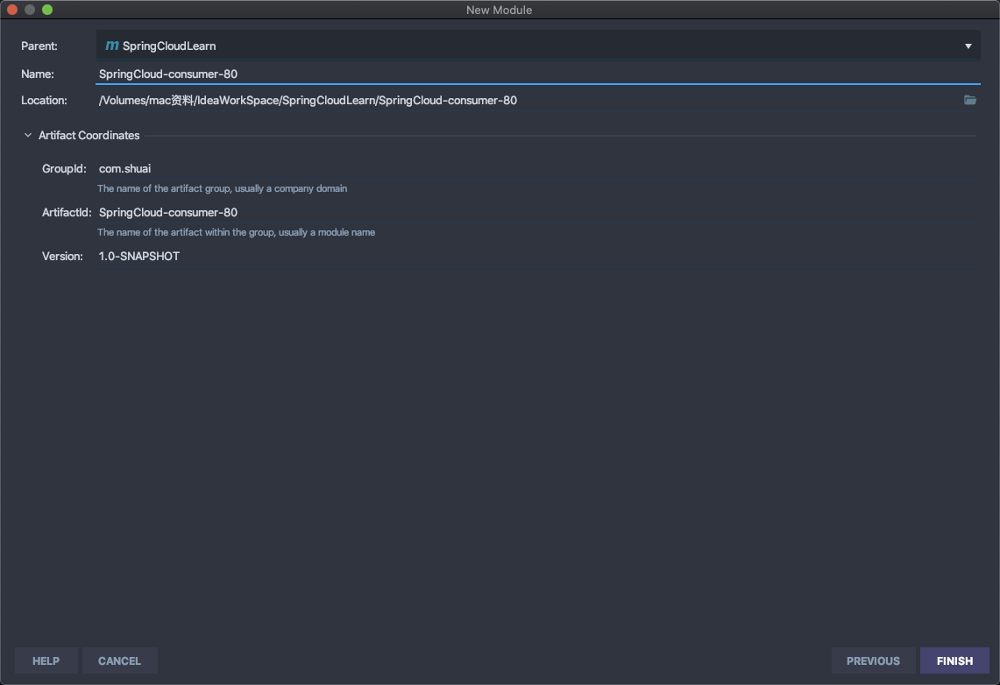
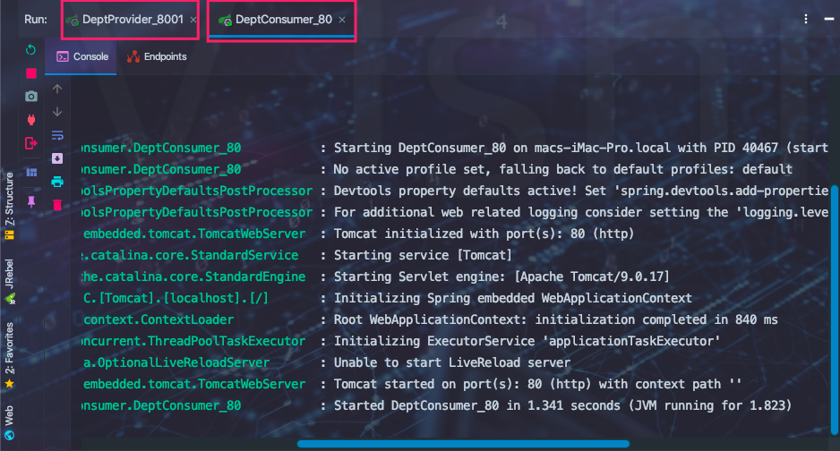
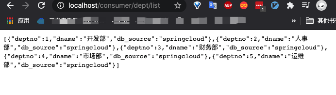

## 第一步：新建Maven工程





### 上面的Maven工程修改为父项目

1. 删除src目录

2. 修改pom.xml

   * 修改打包方式

     ```properties
     <packaging>pom</packaging>
     ```

   * 添加包管理

     ```properties
     <properties>
             <project.build.sourceEncoding>UTF-8</project.build.sourceEncoding>
             <maven.compiler.source>1.11</maven.compiler.source>
             <maven.compiler.target>1.11</maven.compiler.target>
             <junit.version>4.12</junit.version>
             <lombok.version>1.16.10</lombok.version>
             <log4j.version>4.12</log4j.version>
             <logbak.version>1.2.3</logbak.version>
     </properties>
     <!--maven多模块依赖管理-->
     <dependencyManagement>
             <dependencies>
                 <!--spring cloud-->
                 <dependency>
                     <groupId>org.springframework.cloud</groupId>
                     <artifactId>spring-cloud-dependencies</artifactId>
                     <version>Greenwich.SR1</version>
                     <type>pom</type>
                     <scope>import</scope>
                 </dependency>
                 <!--spring boot依赖-->
                 <!--import 这个是maven2.0.9版本后出的属性，import只能在dependencyManagement的中使用，能解决maven单继承问题，import依赖关系实际上并不参与限制依赖关系的传递性。-->
                 <dependency>
                     <groupId>org.springframework.boot</groupId>
                     <artifactId>spring-boot-starter</artifactId>
                     <version>2.1.4.RELEASE</version>
                     <scope>import</scope>
                 </dependency>
                 <!--数据库-->
                 <dependency>
                     <groupId>mysql</groupId>
                     <artifactId>mysql-connector-java</artifactId>
                     <version>5.1.47</version>
                 </dependency>
                 <!--数据源-->
                 <dependency>
                     <groupId>com.alibaba</groupId>
                     <artifactId>druid</artifactId>
                     <version>1.1.10</version>
                 </dependency>
                 <!--SpringBoot 启动器-->
                 <dependency>
                     <groupId>org.mybatis.spring.boot</groupId>
                     <artifactId>mybatis-spring-boot</artifactId>
                     <version>1.3.1</version>
                 </dependency>
                 <!--测试-->
                 <dependency>
                     <groupId>junit</groupId>
                     <artifactId>junit</artifactId>
                     <version>${junit.version}</version>
                 </dependency>
                 <!--工具-->
                 <dependency>
                     <groupId>org.projectlombok</groupId>
                     <artifactId>lombok</artifactId>
                     <version>${lombok.version}</version>
                 </dependency>
                 <!--日志门面-->
                 <dependency>
                     <groupId>ch.qos.logback</groupId>
                     <artifactId>logback-core</artifactId>
                     <version>${logbak.version}</version>
                 </dependency>
                 <!--日志-->
                 <dependency>
                     <groupId>log4j</groupId>
                     <artifactId>log4j</artifactId>
                     <version>${log4j.version}</version>
                 </dependency>
             </dependencies>
      </dependencyManagement>
     ```

     

3. 添加子模块==SpringCloud-API== 

   

4. 新建数据库-数据表dept

   

   ```mysql
   INSERT INTO dept (dname,db_source) VALUES ('开发部',DATABASE ()); 
   INSERT INTO dept (dname,db_source) VALUES ('人事部',DATABASE ()); 
   INSERT INTO dept (dname,db_source) VALUES ('财务部',DATABASE ()); 
   INSERT INTO dept (dname,db_source) VALUES ('市场部',DATABASE ()); 
   INSERT INTO dept (dname,db_source) VALUES ('运维部',DATABASE ());
   ```

5. 新建实体类Dept

   ```java
   /**
    * TODO:<p>  <p/>
    *
    * @package: com.shuai.api.pojo
    * @Author mac
    * @Date 2020/8/18 10:36 下午
    * @Version V1.0
    **/
   @Data//get set toString hashCode equals
   @NoArgsConstructor//无参
   @Accessors(chain = true)//链式写法
   public class Dept implements Serializable {
       private Long deptno;
       private String dname;
       //微服务 一个服务对应一个数据库，同一个信息可能存在不同的数据库，该字段用以区分数据库
       private String db_source;
   
       public Dept(String dname) {
           this.dname = dname;
       }
   }
   ```

6. 删除`api`模块的test目录

   > 该模块只存在一个实体类，不需要单元测试

7. 添加`服务提供`模块==SpringCloud-Provider-800*==

   

8. `服务提供`模块添加依赖

   ```properties
   <dependencies>
           <!--我们需要拿到实体类。因此需要api模块依赖-->
           <dependency>
               <artifactId>SpringCloud-API</artifactId>
               <groupId>com.shuai</groupId>
               <version>1.0-SNAPSHOT</version>
           </dependency>
           <!--测试-->
           <dependency>
               <groupId>junit</groupId>
               <artifactId>junit</artifactId>
           </dependency>
           <dependency>
               <groupId>mysql</groupId>
               <artifactId>mysql-connector-java</artifactId>
           </dependency>
           <!--数据源-->
           <dependency>
               <groupId>com.alibaba</groupId>
               <artifactId>druid</artifactId>
           </dependency>
           <!--工具-->
           <dependency>
               <groupId>org.projectlombok</groupId>
               <artifactId>lombok</artifactId>
           </dependency>
           <!--日志门面-->
           <dependency>
               <groupId>ch.qos.logback</groupId>
               <artifactId>logback-core</artifactId>
           </dependency>
           <!--SpringBoot 启动器-->
           <dependency>
               <groupId>org.mybatis.spring.boot</groupId>
               <artifactId>mybatis-spring-boot-starter</artifactId>
           </dependency>
           <!--模块特有依赖-->
           <dependency>
               <groupId>org.springframework.boot</groupId>
               <artifactId>spring-boot-starter-test</artifactId>
               <version>2.1.4.RELEASE</version>
               <scope>test</scope>
           </dependency>
           <dependency>
               <groupId>org.springframework.boot</groupId>
               <artifactId>spring-boot-starter-web</artifactId>
               <version>2.1.4.RELEASE</version>
           </dependency>
           <!--jetty-->
           <dependency>
               <groupId>org.springframework.boot</groupId>
               <artifactId>spring-boot-starter-jetty</artifactId>
               <version>2.1.6.RELEASE</version>
           </dependency>
   
           <!--热部署-->
           <dependency>
               <groupId>org.springframework.boot</groupId>
               <artifactId>spring-boot-devtools</artifactId>
               <version>2.1.6.RELEASE</version>
           </dependency>
   
       </dependencies>
   ```

   > 这里需要说明的是 ：子模块如果要添加特有依赖则必须标明版本号。

9. `服务提供`模块新增数据操作代码

   * 新增dao接口

     ```java
     @Mapper
     @Repository
     public interface DeptDao {
         public boolean addDept(Dept dept);
     
         public Dept queryById(long id);
     
         public List<Dept> queryAll();
     }
     ```

   * 该模块resources目录下新增application.yml

     ```yaml
     server:
       port: 8001
     # mybatis 配置
     mybatis:
       type-aliases-package: com.shuai.api.pojo
       config-location: classpath:mybatis/mybatis-config.xml
       mapper-locations: classpath:mybatis/mapper/*.xml
     # spring 配置 
     spring:
       application:
         name: springcloud-provider-8001
       datasource:
         type: com.alibaba.druid.pool.DruidDataSource
         driver-class-name: org.gjt.mm.mysql.Driver
         url: jdbc:mysql://locahost:3306/springcloud?useUnicode=true&characterEncoding=utf-8
         username: root
         password: gao1314..
     ```

   * 该模块resources目录下新增mybatis.mapper目录、mybatis下新增mybatis-config.xml

     ```xml
     <?xml version="1.0" encoding="UTF-8" ?>
     <!DOCTYPE configuration PUBLIC "-//mybatis.org//DTD Config 3.0//EN" "http://mybatis.org/dtd/mybatis-3-config.dtd">
     <configuration>
         <settings>
             <!-- 打印查询语句 -->
             <setting name="logImpl" value="STDOUT_LOGGING" />
             <!-- 控制全局缓存（二级缓存）-->
             <setting name="cacheEnabled" value="true"/>
         </settings>
     
     </configuration>
     ```

   * 该模块resources目录下mybatis.mapper目录新增DeptMapper.xml

     ```xml
     <?xml version="1.0" encoding="UTF-8" ?>
     <!DOCTYPE mapper   PUBLIC "-//mybatis.org//DTD Config 3.0//EN" "http://mybatis.org/dtd/mybatis-3-mapper.dtd">
     <mapper namespace="shuai.dao.DeptDao">
         <insert id="addDept" parameterType="Dept">
             insert into dept (dname,db_source)
             values (#{dname},DATABASE())
         </insert>
         <select id="queryById" resultType="Dept" parameterType="Long">
             select * from dept where deptno=#{deptno};
         </select>
         <select id="queryAll" resultType="Dept">
             select * from dept;
         </select>
     </mapper>
     ```

     

   * 该模块下新增dao、service、controller以及启动类

     ```java
     @Mapper
     @Repository
     public interface DeptDao {
         public boolean addDept(Dept dept);
     
         public Dept queryById(long id);
     
         public List<Dept> queryAll();
     }
     ```

     ```java
     @Service
     public class DeptService implements DeptDao {
         @Autowired
         private DeptDao deptDao;
         @Override
         public boolean addDept(Dept dept) {
             return deptDao.addDept(dept);
         }
     
         @Override
         public Dept queryById(long id) {
             return deptDao.queryById(id);
         }
     
         @Override
         public List<Dept> queryAll() {
             return deptDao.queryAll();
         }
     }
     ```

     ```java
     @RestController//提供restful风格服务
     public class DeptController {
         @Autowired
         private DeptService deptService;
     
         @PostMapping("/dept/add ")
         public boolean addDept(@RequestBody Dept dept){
             return deptService.addDept(dept);
         }
         @GetMapping("/dept/get/{id}")
         public Dept queryById(@PathVariable("id") long id) {
             return deptService.queryById(id);
         }
         @PostMapping("/dept/list ")
         public List<Dept> queryAll() {
             return deptService.queryAll();
         }
     
     }
     ```

     ```java
     @SpringBootApplication
     public class DeptProvider_8001 {
         public static void main(String[] args) {
             SpringApplication.run(DeptProvider_8001.class, args);
         }
     }
     ```

     > 启动器类放在该模块根包下。即和contorller同级目录。

10. 启动报错：

    > Error:java: java.lang.ExceptionInInitializerError  com.sun.tools.javac.code.TypeTags

    因为本人使用jdk11因此会包lombok版本太低。修改即可：

    > <lombok.version>1.18.4</lombok.version>

11. 结果验证

    

12. 添加`服务消费`模块==SpringCloud-Consumer-80==

    

13. 为`服务消费`模块添加依赖以及配置

    * 添加依赖

      ```xml
      <!--依赖-->
      <dependencies>
        <dependency>
          <groupId>com.shuai</groupId>
          <artifactId>SpringCloud-API</artifactId>
          <version>1.0-SNAPSHOT</version>
          <scope>compile</scope>
        </dependency>
        <!--热部署-->
        <dependency>
          <groupId>org.springframework.boot</groupId>
          <artifactId>spring-boot-devtools</artifactId>
          <version>2.1.6.RELEASE</version>
        </dependency>
        <!--web依赖-->
        <dependency>
          <groupId>org.springframework.boot</groupId>
          <artifactId>spring-boot-starter-web</artifactId>
          <version>2.1.4.RELEASE</version>
        </dependency>
      </dependencies>
      ```

    * resources目录下新增application.yml

      ```yaml
      server:
        port: 80
      ```

    > <font color=ff00aa>注意：</font> Spring cloud支持feign和resttemplate来实现对微服务的调用 。都基于http请求方式调用，而不是rpc远程调用方式。具体可参考：https://www.cnblogs.com/lushichao/p/12796408.html

    > <font color=ff00aa>注意：</font> 我们在Java项目中调用接口有四种方式，分别是：Httpclient、Okhttp、Httpurlconnection、    			   RestTemplate

14. 使用`RestTemplate`调用`服务提供`模块提供的服务

    * Spring Cloud项目集成`RestTemplate` > 注入Bean

      ```java
      package shuai.consumer.config;
      
      import org.springframework.context.annotation.Bean;
      import org.springframework.context.annotation.Configuration;
      import org.springframework.web.client.RestTemplate;
      
      /**
       * TODO:<p>  <p/>
       *
       * @package: shuai.consumer.config
       * @Author mac
       * @Date 2020/8/19 9:54 下午
       * @Version V1.0
       **/
      @Configuration//指示一个类声明一个或多个@Bean方法，并且可以由Spring容器处理，以便在运行时为这些bean生成BeanDefinition和服务请求
      public class ConfigBean {//以前是在applicationContext.xml
          @Bean
          public RestTemplate getRestTemplate(){
              return new RestTemplate();
          }
      }
      ```

    * 使用`RestTemplate`调用服务

      ```java
      @RestController
      public class DeptConsumerController {
          // todo 怎么调用生产者提供的服务  并且消费者 不应该有service层~~~
          // 使用RestTemplate  注册到spring即可使用
          @Autowired
          private RestTemplate restTemplate;
      
          private static final String REST_URL_PREFIX="http://localhost:8001";//服务提供方固定请求
      
          @RequestMapping("/consumer/dept/get/{id}")
          public Dept get(@PathVariable("id") Long id){
              return restTemplate.getForObject(REST_URL_PREFIX+"/dept/get/"+id, Dept.class);
          }
      
          @RequestMapping("/consumer/dept/add")
          public boolean add(Dept dept){
              return restTemplate.postForObject(REST_URL_PREFIX+"/dept/add", dept,Boolean.class);
          }
      
          @RequestMapping("/consumer/dept/list")
          public List<Dept> list(){
              return restTemplate.getForObject(REST_URL_PREFIX+"/dept/list", List.class);
          }
      }
      
      ```

    * 该模块包目录下新建启动类

      ```java
      @SpringBootApplication
      public class DeptConsumer_80 {
          public static void main(String[] args) {
              SpringApplication.run(DeptConsumer_80.class,args);
          }
      }
      ```

      

15. 结果验证

    * 启动8001 `服务提供`模块，本地访问👌

    * 启动80 `服务消费`模块，本地访问👌

      

      

      

      > <font color=ff00aa>提示：</font> 这个时候可以将两个服务模块分别打包，进行远程调用，前提得修改IP地址。

      