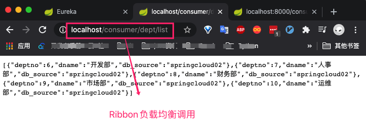
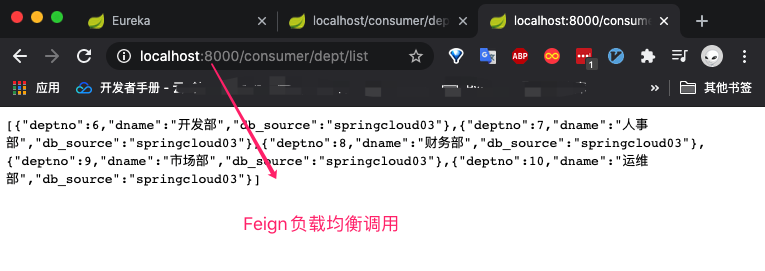

## 是什么


## 作用


## SpringCloud集成Feign

1. 新建`SpringCloud-Consumer-Feign-8000`模块

2. 修改yml中端口为8000、以及启动类。其余与`SpringCloud-Consumer-80`模块保持一致。

3. `SpringCloud-Consumer-Feign-8000`模块导入Feign依赖

   ```xml
   <!--feign依赖-->
   <dependency>
     <groupId>org.springframework.cloud</groupId>
     <artifactId>spring-cloud-starter-feign</artifactId>
     <version>1.4.6.RELEASE</version>
   </dependency>
   ```

   

4. `SpringCloud-api`导入依赖

   ```xml
   <!--feign依赖-->
   <dependency>
     <groupId>org.springframework.cloud</groupId>
     <artifactId>spring-cloud-starter-feign</artifactId>
     <version>1.4.6.RELEASE</version>
   </dependency>
   ```

5. `SpringCloud-api`模块新建service.DeptClientService接口

   ```java
   @FeignClient(value = "SPRINGCLOUD-PROVIDER") //服务名称 与Ribbon中REST_URL_PREFIX一致。通过服务名称获取服务
   @Component
   public interface DeptClientService {
       @GetMapping("/dept/get/{id}")//调用服务提供方接口
       public Dept queryById();
       @GetMapping("/dept/list")
       public List<Dept> queryAll();
       @GetMapping("/dept/add")
       public Boolean addDept(Dept dept);
   }
   ```

   

6. 修改`SprinCloud-Consumer-Feign-8000`中DeptConsumerController类

   ```java
   @RestController
   public class DeptConsumerController {
   
       @Autowired
       private DeptClientService service;
   
   
   
       @RequestMapping("/consumer/dept/get/{id}")
       public Dept get(@PathVariable("id") Long id){
           return service.queryById();
       }
   
       @RequestMapping("/consumer/dept/add")
       public boolean add(Dept dept){
           return service.addDept(dept);
       }
   
       @RequestMapping("/consumer/dept/list")
       public List<Dept> list(){
           return service.queryAll();
       }
   }
   ```

   > 相较于Ribbon使用RestTemplate的方式访问 `HTTP请求`【微服务名称+请求地址】执行操作。Feign通过接口调用方式【上面的DeptClientService类】来执行操作，虽然底层仍然使用的是Ribbon方式。

7. 启动类添加注解

   ```java
   @EnableFeignClients(basePackages = "com.shuai")
   @ComponentScan("com.shuai") //为API模块的包名 扫描接口类
   ```

   

8. 测试

   启动三个Eureka Server 服务集群、三个`服务提供`微服务、一个Feign消费服务、以及Ribbon对应的消费服务。

   

   

> <font color=ff00aa>注意：</font> 如果新建项目大家向我一样是从之前建好的项目直接拷贝过来的，有可能出现访问404的局面。大概率是因为多个项目中存在相同的controller并且包名一致的情况。建议每个微服务使用不一样的包名并且拷贝过程中尽量修改controller类名。