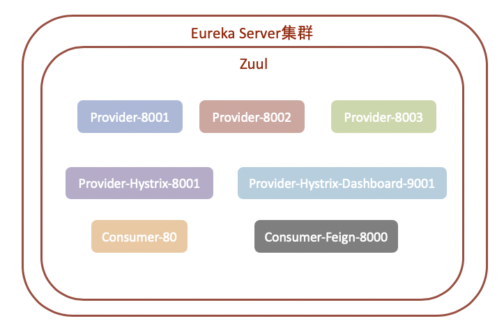
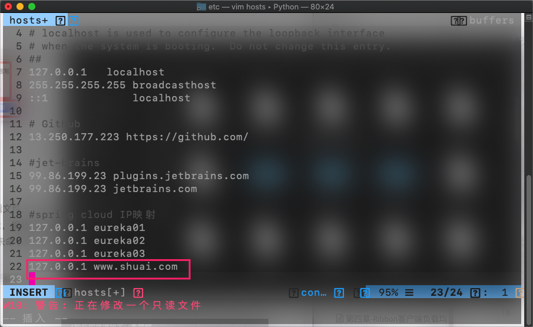
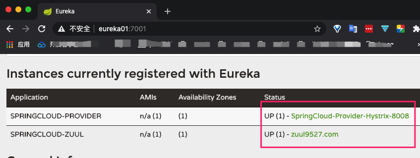
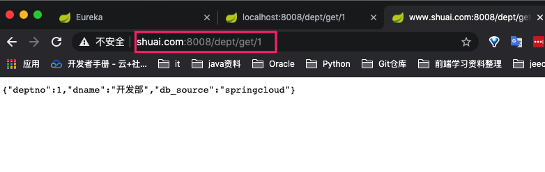
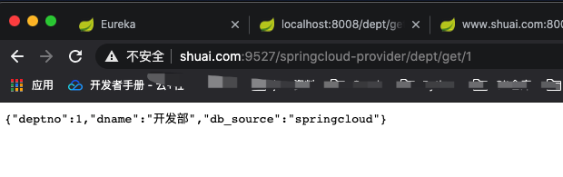
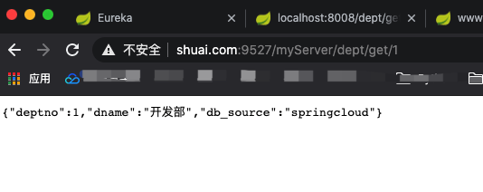

## 是什么

> 统一微服务项目访问API

Zuul包含了对请求的==路由==和==过滤==两个主要的功能

* 路由

	将外部请求转发到具体的微服务实例上，是实现外部访问统一入口的基础

* 过滤

	负责对请求的处理过程进行干预，实现请求校验，服务聚合等功能的基础。

Zuul和Eureka关系？

Zuul相较于Eureka也是一个微服务，需要注册进Eureka Server注册列表内，被Eureka管理同时从Eureka中获取其他微服务的消息，可就是下面访问微服务都是通过Zuul跳转后获得。并对外提供访问API。



## 现在项目遇到的问题

1. 现微服务访问都是localhost：端口号 方式进行访问。对外发布或者对前端项目提供访问接口应使用统一访问API。例如www.baidu.com

2. 存在多个微服务。外部访问需要对每个微服务进行访问，需使用路由进行映射访问。
3. 如果外部使用localhost或者根据微服务名称端口号方式进行访问则应拦截。

## 作用

1. Zuul代理
2. Zuul路由
3. Zuul过滤

## SpringCloud集成Zuul

1. 新建 <font color=ff00aa>SpringCloud-zuul-9527</font>模块

2. 导入依赖

	```xml
	<!--依赖-->
	<dependencies>
	    <dependency>
	        <groupId>com.shuai</groupId>
	        <artifactId>SpringCloud-API</artifactId>
	        <version>1.0-SNAPSHOT</version>
	        <scope>compile</scope>
	    </dependency>
	    <!--热部署-->
	    <dependency>
	        <groupId>org.springframework.boot</groupId>
	        <artifactId>spring-boot-devtools</artifactId>
	        <version>2.1.6.RELEASE</version>
	    </dependency>
	    <!--web依赖-->
	    <dependency>
	        <groupId>org.springframework.boot</groupId>
	        <artifactId>spring-boot-starter-web</artifactId>
	        <version>2.1.4.RELEASE</version>
	    </dependency>
	    <!--Ribbon依赖-->
	    <!--        <dependency>-->
	    <!--            <groupId>org.springframework.cloud</groupId>-->
	    <!--            <artifactId>spring-cloud-starter-netflix-ribbon</artifactId>-->
	    <!--            <version>1.4.6.RELEASE</version>-->
	    <!--        </dependency>-->
	    <!--Ribbon依赖于eureka客户端-->
	    <dependency>
	        <groupId>org.springframework.cloud</groupId>
	        <artifactId>spring-cloud-starter-eureka</artifactId>
	        <version>1.4.6.RELEASE</version>
	    </dependency>
	    <dependency>
	        <groupId>com.google.code.gson</groupId>
	        <artifactId>gson</artifactId>
	        <version>2.8.5</version>
	    </dependency>
	    <!--feign依赖-->
	    <dependency>
	        <groupId>org.springframework.cloud</groupId>
	        <artifactId>spring-cloud-starter-feign</artifactId>
	        <version>1.4.6.RELEASE</version>
	    </dependency>
	    <!--hystrix-->
	    <dependency>
	        <groupId>org.springframework.cloud</groupId>
	        <artifactId>spring-cloud-starter-hystrix</artifactId>
	        <version>1.4.6.RELEASE</version>
	    </dependency>
	    <dependency>
	        <groupId>org.springframework.cloud</groupId>
	        <artifactId>spring-cloud-starter-hystrix-dashboard</artifactId>
	        <version>1.4.6.RELEASE</version>
	    </dependency>
	    <!--zuul-->
	    <dependency>
	        <groupId>org.springframework.cloud</groupId>
	        <artifactId>spring-cloud-starter-zuul</artifactId>
	        <version>1.4.6.RELEASE</version>
	    </dependency>
	</dependencies>
	```

	

3. 增加配置文件

	```yaml
	server:
	  port: 9527
	
	spring:
	  application:
	    name: springcloud-zuul
	
	eureka:
	  client:
	    service-url:
	      defaultZone: http://eureka01:7001/eureka/,http://eureka02:7002/eureka/,http://eureka03:7003/eureka/ # 将该服务注册进去
	  instance:
	    instance-id: zuul9527.com
	    prefer-ip-address: true
	  instance:
	    instance-id: zuul9527.com
	    prefer-ip-address: true
	
	
	info:
	  app.name: SpringCloud-zuul
	  company.name: 北京高科技公司.
	```

	

4. 在hosts中增加Zuul映射URL

	

5. 启动类中开启功能

	```java
	@SpringBootApplication
	@EnableZuulProxy //
	public class ZuulApplication_9527 {
	    public static void main(String[] args) {
	        SpringApplication.run(ZuulApplication_9527.class,args);
	    }
	}
	```

	

6. 测试

	* 启动Eureka Server集群

	* 带熔断的服务8008注册进入Eureka Server

	* Zuul服务9527注册进入Eureka Server

		

	* 使用默认localhost:8008访问URL

		

	* 使用Zuul API直接访问服务端口号下URL

		

	* 使用Zuul API 提供的对外URL(9527端口)访问其他微服务的URL

		

		> <font color=ff00aa>注意:</font> 图中URL为Zuul提供的统一对外URL 并且使用的是==小写==服务名来进行服务访问。

7. 隐藏Zuul 网关URL中的服务名称

	* 在配置文件application.yml中新增

		```yml
		zuul:
		  routes:
		    myserver.serviceId: springcloud-provider #微服务名称 小写
		    myserver.path: /myServer/**
		```

		

8. 忽略使用服务名称访问URL

	```yml
	zuul:
	  routes:
	    myserver.serviceId: springcloud-provider #微服务名称 小写
	    myserver.path: /myServer/**
	  ignored-services: springcloud-provider # 不能再使用服务名称URL方式进行访问  -- set
	```

	> ```xml
	> # ignored-services: "*" # 隐藏所有URL访问，只保留ZUUL API
	> # prefix: /shuai  #设置访问前缀
	> ```

