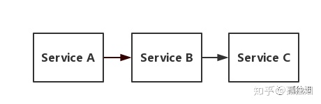
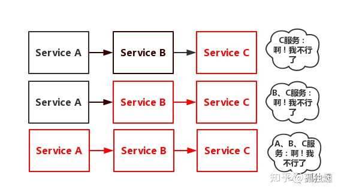
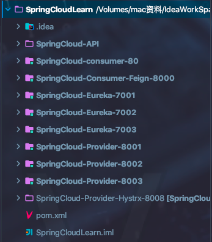
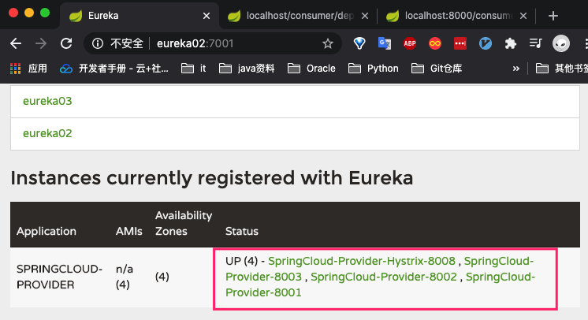
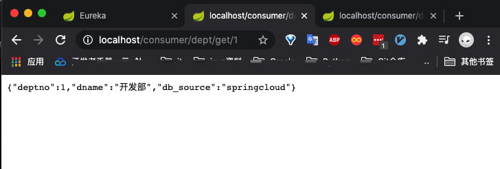
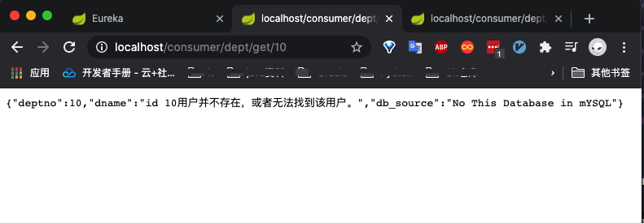
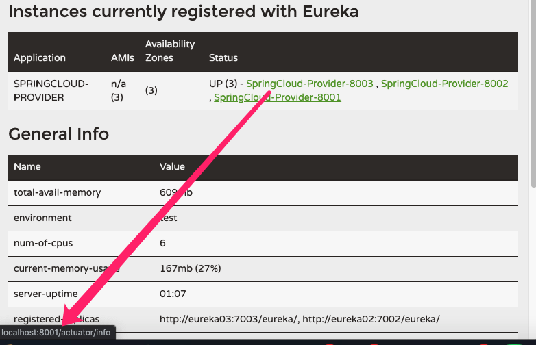
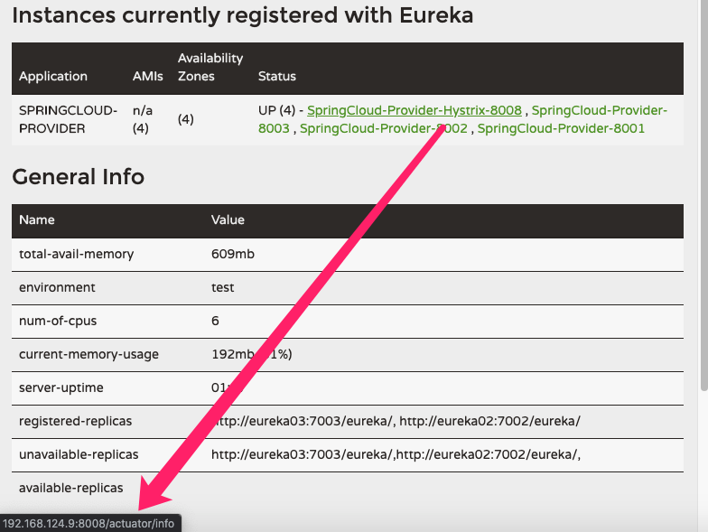

## 服务雪崩

OK，我们从服务雪崩开始讲起！假设存在如下调用链




而此时，`Service A`的流量波动很大，流量经常会突然性增加！那么在这种情况下，就算`Service A`能扛得住请求，`Service B`和`Service C`未必能扛得住这突发的请求。 此时，如果`Service C`因为抗不住请求，变得不可用。那么`Service B`的请求也会阻塞，慢慢耗尽`Service B`的线程资源，`Service B`就会变得不可用。紧接着，`Service A`也会不可用，这一过程如下图所示



如上图所示，一个服务失败，导致整条链路的服务都失败的情形，我们称之为服务雪崩。

那么，服务熔断和服务降级就可以视为解决服务雪崩的手段之一。

## 什么是Hystrix

上面讲到熔断和降级和解决服务雪崩的手段之一，可是什么时候该启用熔断，什么时候去探测服务是否可用，当依赖异常恢复时，什么时候上层恢复依赖等这些技术细节都是我们要去考虑的。而Hystrix就是为了解决这些问题而诞生的。

在分布式环境下hystrix通过添加延迟容错和失败容差逻辑来帮助我们处理服务之间的交互。它会隔绝各服务间的调用，防止出现雪崩现象并提供fallback失败备用方案，以此提高我们服务集群的弹性。

## Hystrix主要解决那些问题

* 对外依赖包括第三方类库的依赖提供延迟和失败保护
*  阻断传递失败，防止雪崩
*  快速失败并即时恢复
*  合理的fallback和优雅降级
*  提供近实时的监控、告警和操作控制

## SpringCloud集成Hystrix

### 服务熔断(服务器端)

​	熔断机制是对应雪崩效应的一种微服务链路保护机制。当微服务调用链中某个微服务不可用或者响应时间太长时，会进行服务的降级，==不再继续调用目标服务，快速返回错误的响应信息==。当检测到该节点为服务调用响应正常后恢复调用链路。

1. 新建Hystrix项目模块 `SpringCloud-Provider-Hystrx-8008`

   > <font color=ff00aa>说明：</font> 该模块主要是用来和之前的三个`服务提供`模块作对比。之前的服务模块并没有提供服务熔断机制，当掉就是真的当掉了，一定会会造成服务雪崩的场景。

2. 导入依赖

   ```xml
   <!--hystrix-->
   <dependency>
     <groupId>org.springframework.cloud</groupId>
     <artifactId>spring-cloud-starter-hystrix</artifactId>
     <version>1.4.6.RELEASE</version>
   </dependency>
   ```

   

3. 修改yml配置
   
* 修改server.port、instance.instance-id、info.app.name
  
4. 修改DeptController类

   ```java
   @RestController//提供restful风格服务
   public class DeptController {
       @Autowired
       private DeptService deptService;
   
       @GetMapping("/dept/get/{id}")
       @HystrixCommand(fallbackMethod = "hystrixGet")//只要该方法获取失败则调用hystrixGet方法
       public Dept queryById(@PathVariable("id") long id) {
           Dept dept = deptService.queryById(id);
           // todo 模拟服务中断或者超时情况  然后使用Hystrix提供的服务备选功能代替死掉的服务
           if (null==dept){
               throw new RuntimeException("id "+id+"用户并不存在，或者无法找到该用户。");
           }
           return dept;
       }
       //服务备选方法
       public Dept hystrixGet(@PathVariable("id") long id){
           return new Dept(id,"id "+id+"用户并不存在，或者无法找到该用户。","No This Database in mYSQL");
       }
   
       @PostMapping("/dept/add ")
       public boolean addDept(@RequestBody Dept dept){
           return deptService.addDept(dept);
       }
       @GetMapping("/dept/list")
       public List<Dept> queryAll() {
           return deptService.queryAll();
       }
   
       @Autowired
       private DiscoveryClient client;
       //获取注册进来的微服务信息
       @GetMapping("/dept/discovery")
       public Object discovery(){
           List<String> services = client.getServices();
           System.out.println("discovery=>services:"+services);
           services.forEach(x -> System.out.println(x.toString()));
           return this.client;
       }
   
   }
   ```

   

5. 修改启动类添加熔断支持注解

   ```java
   @SpringBootApplication
   @EnableEurekaClient//自动将此服务加入到Eureka Server中
   @EnableDiscoveryClient//服务发现
   @EnableCircuitBreaker//添加熔断支持
   public class HystrxDeptProvider_8008 {
       public static void main(String[] args) {
           SpringApplication.run(HystrxDeptProvider_8001.class, args);
       }
   }
   ```

   

6. 测试

   启动三个Eureka Server服务集群、四个`服务提供`微服务【其中一个提供熔断机制】、一个Feign-8000微服务、一个Ribbon-80微服务。

   

   

   访问ID为1的用户正常访问

   

   访问ID不存在的用户则走我们定义好的@HystrixCommand(fallbackMethod = "hystrixGet")方法

   

7. 修改显示名称

   > 在Eureka Server 服务页面中我们点击服务，浏览器左下角显示服务地址为Localhost，修改显示为IP地址

   

   在四个`服务提供`微服务的yml中添加

   ```
   eureka..instance.prefer-ip-address: true #默认显示localhost 修改后显示服务IP地址
   ```

   

### 服务降级(客户端)

当下游的服务因为某种原因响应过慢，下游服务主动停掉一些不太重要的业务或者调用上游本地的一些降级逻辑，从而释放出其占用的其他服务资源(例如数据库访问等等)，增加响应速度。

例如双十一淘宝众某些模块服务不可用。

* SpringCloud-API模块新增类

  ```java
  //降级代码
  @Component
  public class DeptClientServiceFallbackFactory implements FallbackFactory {
      @Override
      public Object create(Throwable throwable) {
          return new DeptClientService() {
              @Override
              public Dept queryById(Long id) {
                  return new Dept(id,"id "+id+"用户并不存在，或者无法找到该用户。","No This Database in mYSQL");
              }
  
              @Override
              public List<Dept> queryAll() {
                  return null;
              }
  
              @Override
              public Boolean addDept(Dept dept) {
                  return null;
              }
          };
      }
  }
  ```

* DeptClientService接口新增参数调用

  ```java
  @FeignClient(value = "SPRINGCLOUD-PROVIDER",fallbackFactory = DeptClientServiceFallbackFactory.class) //服务名称 与Ribbon中REST_URL_PREFIX一致。通过服务名称获取服务
  @Component
  public interface DeptClientService {
      @GetMapping("/dept/get/{id}")
      public Dept queryById(Long id);
      @GetMapping("/dept/list")
      public List<Dept> queryAll();
      @GetMapping("/dept/add")
      public Boolean addDept(Dept dept);
  }
  ```


* 客户端模块新增配置

  ```yaml
  #开启Feign.hystrix
  feign:
    hystrix:
      enabled: true
  ```

* 启动客户端(消费模块)提示找不到DeptClientServiceFallbackFactory

  > 在客户端启动类添加扫描组件@ComponentScan("com.shuai") //扫描API模块

