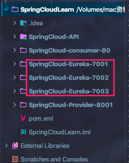
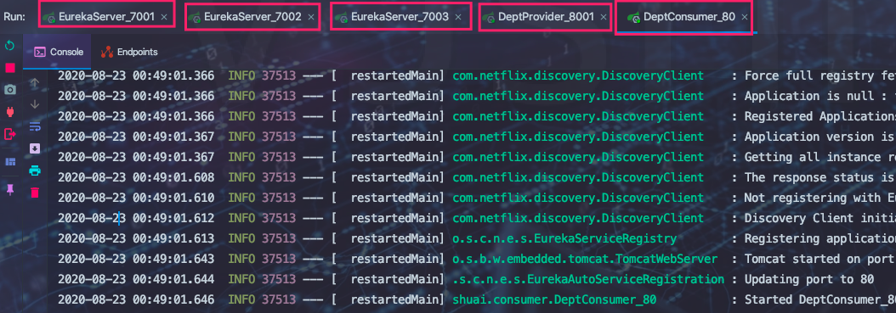
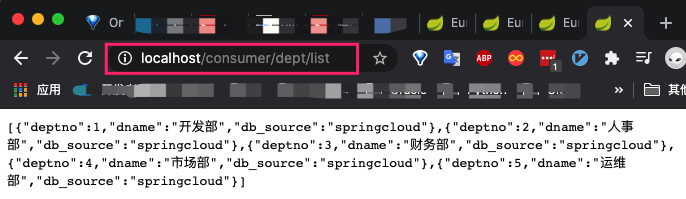
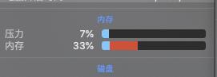

## Ribbon是什么


## Ribbon作用


## Spring Cloud集成Ribbon

进过前几章的项目搭建，现项目情况如下：



> 7001、7002、7003端口对应的微服务为Eureka Server 提供服务注册和发现功能

> 8001端口对应的微服务为服务提供功能，即需要在Eureka Server集群中注册的微服务

> Ribbon主要做客户端的负载均衡，先项目中只有一个客户端即80端口对应的微服务，<font color=ffaa00>因此Ribbon的配置以及开发主要集中于80端口对应的微服务，以下操作若无特殊说明则默认是在80端口对应的微服务中进行操作。</font>

1. 导入依赖

   ```yaml
    <!--Ribbon依赖-->
   <!--        <dependency>-->
   <!--            <groupId>org.springframework.cloud</groupId>-->
   <!--            <artifactId>spring-cloud-starter-netflix-ribbon</artifactId>-->
   <!--            <version>1.4.6.RELEASE</version>-->
   <!--        </dependency>-->
    <!--Ribbon依赖于eureka客户端-->
    <dependency>
      <groupId>org.springframework.cloud</groupId>
      <artifactId>spring-cloud-starter-eureka</artifactId>
      <version>1.4.6.RELEASE</version>
    </dependency>
    <dependency>
      <groupId>com.google.code.gson</groupId>
      <artifactId>gson</artifactId>
      <version>2.8.5</version>
    </dependency>
   ```

   

2. 编写配置

   ```yaml
   server:
     port: 80
   #Eureka配置
   eureka:
     client:
       register-with-eureka: false # 消费者不需要向Eureka Server中注册自己
       service-url:
         defaultZone: http://eureka01:7001/eureka/,http://eureka02:7002/eureka/,http://eureka03:7003/eureka/ # 集群中进行随机访问
         
   ```

   

3. 开启功能添加注解

   * 启动类中添加

     ```java
     @EnableEurekaClient
     ```

     

   * 在RestTemplate的ConfigBean类中添加Ribbon配置

     > 由于客户端的所有请求都来自于该类的getRestTemplate方法，因此只需要在该方法上进行配置即可。

     * 添加注解

     ```java
     @Configuration//指示一个类声明一个或多个@Bean方法，并且可以由Spring容器处理，以便在运行时为这些bean生成BeanDefinition和服务请求
     public class ConfigBean {//以前是在applicationContext.xml
         @Bean
         @LoadBalanced //Ribbon
         public RestTemplate getRestTemplate(){
             return new RestTemplate();
         }
     }
     ```

     

   * 修改客户端访问地址

     > 之前没有集成Eureka时，客户端是直接通过`服务提供`模块的URL来进行服务访问。而在继承Eureka时，我们讲到，Eureka的作用就是`解决手动维护URL的困境`。因此Eureka相当于一个中间件：服务需要被访问则在Eureka Server中进行注册，客户端需要访问则直接从Eureka中获取即可，`获取的并不是Eureka的URL，而是客户端需要访问的服务的服务ID(服务端配置的eureka.instance)。`

     > 通过服务ID进行访问，由于该服务存在于Eureka集群中，则势必会有一种负载均衡算法(随机、轮训)进行服务`负载均衡调度`

     * 修改 DeptConsumerController 类中REST_URL_PREFIX

       ```java
       //    private static final String REST_URL_PREFIX="http://localhost:8001";//服务提供方固定请求
           private static final String REST_URL_PREFIX="http://SpringCloud-Provider-8001";//和Eureka结合，需使用 eureka.instance
       ```

       

4. 测试

   启动三个Eureka集群、一个服务提供方微服务、一个客户端微服务

   启动客户端报错 

   ```java
   Caused by: java.lang.ClassNotFoundException: org.apache.http.client.HttpClient
   ```

   发现 已包含spring-cloud-starter-netflix-ribbon 2.1.1高版本并且上面引入依赖中重复引入低版本，因此注释掉1.4.6版本的ribbon

   

   

   内存表示我还可以使劲造 ~ ~

   

   当我们挂掉一个