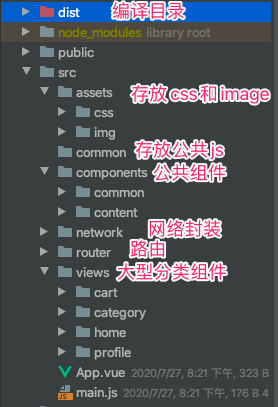
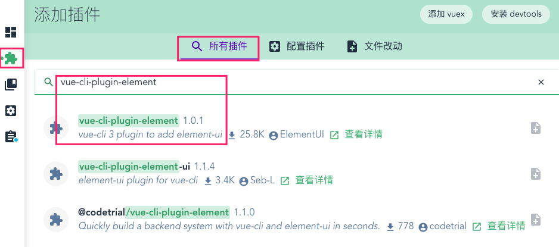
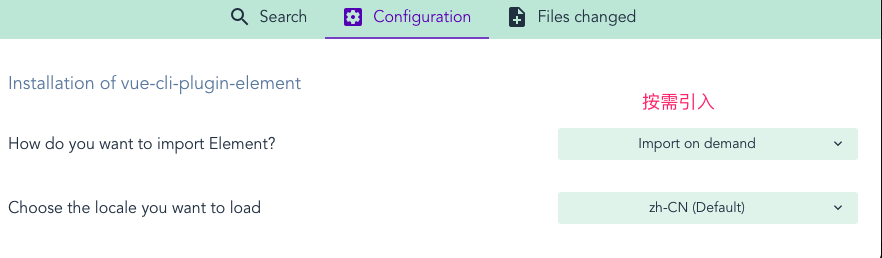
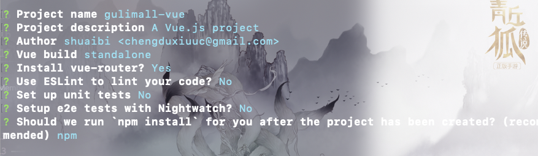
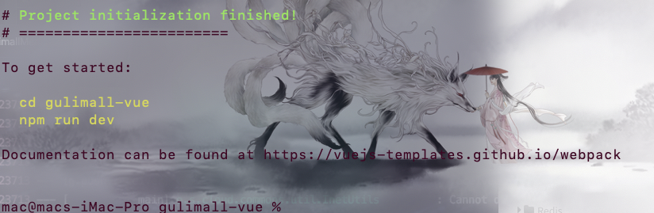
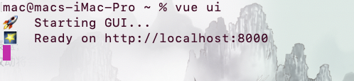
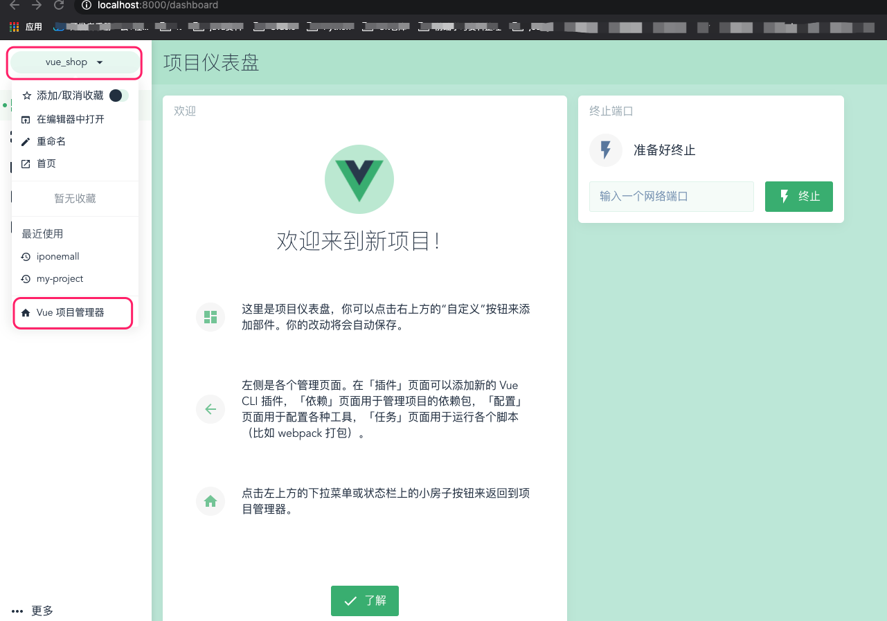
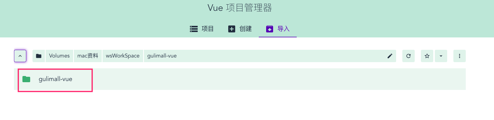
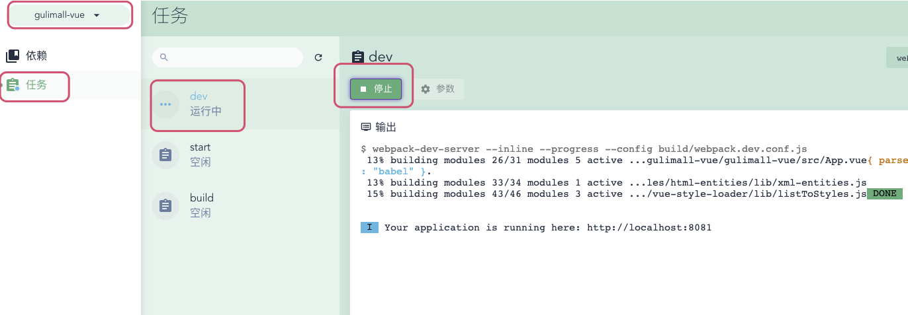

## 方式一

1. 创建项目 vue-cli4

	```bash
	vue create 项目名称   
	```

	按需引入插件:例如vuex 、router等等

	

2. 引入element-ui插件

	* 

	* 

	* 

		* 

	 *  

		

3. 关联远程Github

	```bash
	Git init  
		git remote add gitee git@gitee.com:gadeGG/vue-shop.git
		git add | git commit | git push
	```

4. 如若报错 参考 ：https://www.liaoxuefeng.com/wiki/896043488029600/1163625339727712

5. 或者是先新建GitHub仓库然后pull 然后再新建vue项目


## 方式二

### 全局安装cli-init

`Vue脚手架 快速搭建Vue项目 `

```bash
npm install -g @vue/cli-init
```


### 初始化Vue项目

1. 新建项目文件 ==gulimall-vue==

2. 进入项目文件 

	```bash
	vue init webpack gulimall-vue
	```

	

	

3. 进入项目 

	```bash
	npm run dev
	```

	或者使用vue 提供的可视化界面管理项目

	```bash
	vue ui
	```

	* 打开可视化界面

		

	* 首页，添加新项目

		

	* 找到新建项目

		

	* 启动项目

		

### 整合 Element-ui

* 当前项目安装 Element-ui 

	```bash
	npm install element-ui
	```

* 引用以及使用

	```vue
	# main.js
	import 'element-ui/lib/theme-chalk/index.css'
	import ElementUI from 'element-ui'
	
	Vue.use(ElementUI)
	```

	