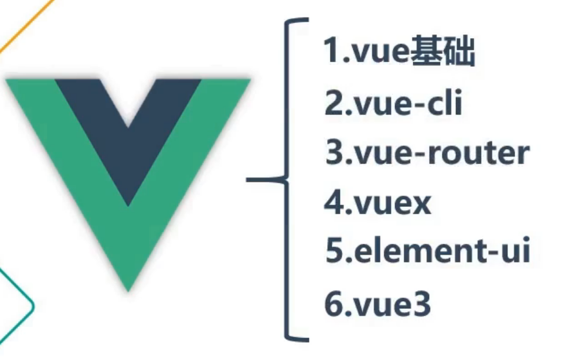
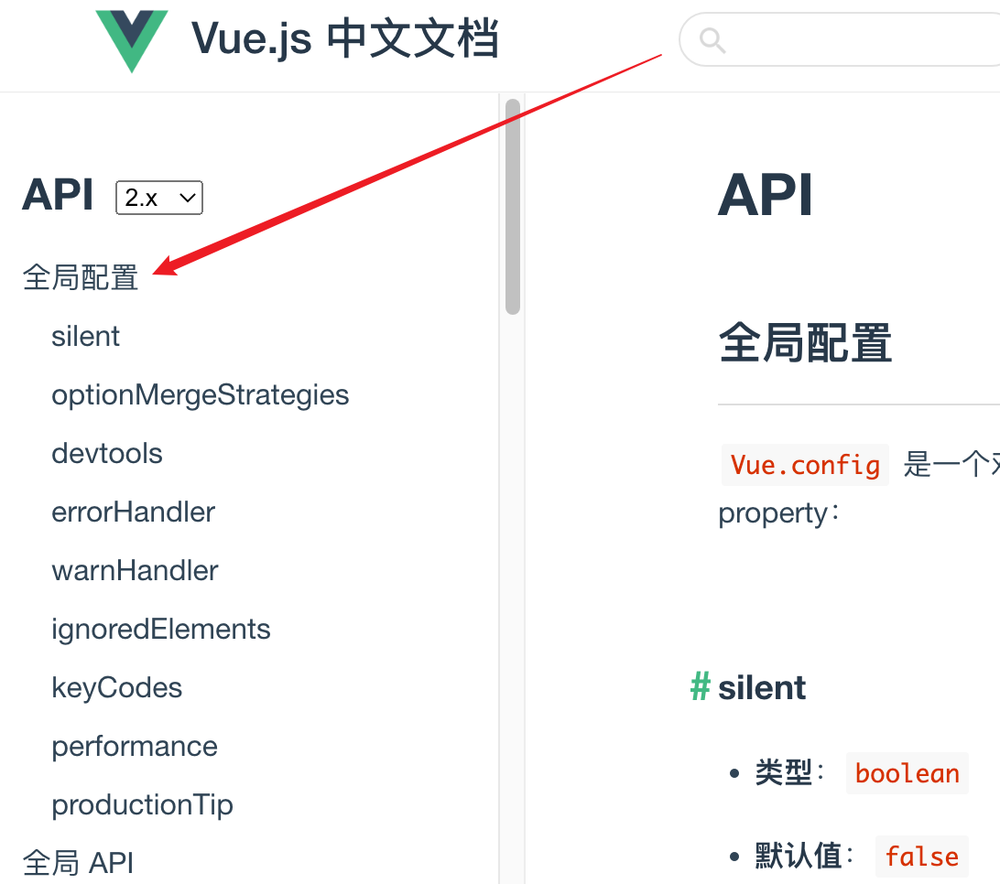
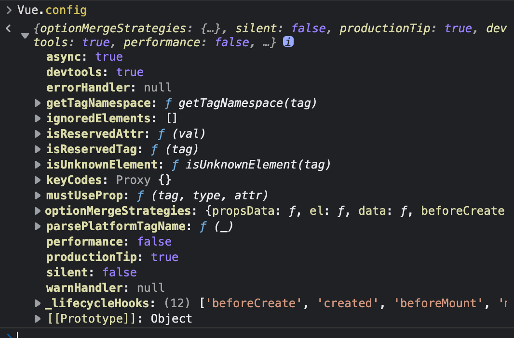
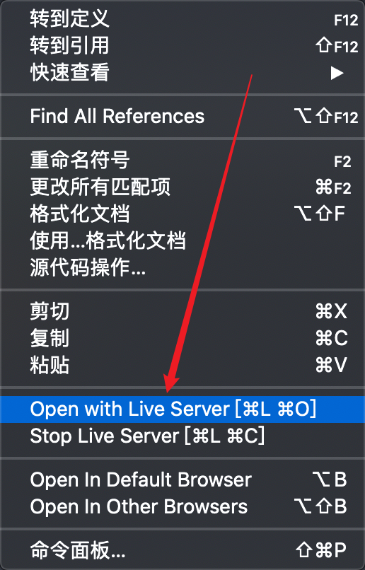
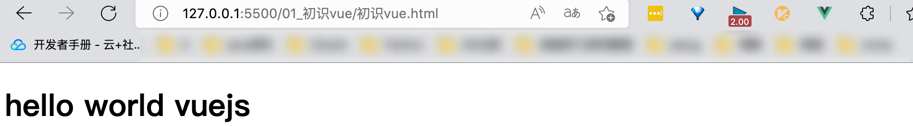

# 脉络大纲




# 初识Vue


## 引入

```vue
<!DOCTYPE html>
<html lang="en">
<head>
    <meta charset="UTF-8">
    <meta http-equiv="X-UA-Compatible" content="IE=edge">
    <meta name="viewport" content="width=device-width, initial-scale=1.0">
    <script src="../js/vue.js" type="text/javascript"></script>
    <title>Document</title>
</head>
<body>
</body>
</html>
```


## vue全局配置





> 需要改配置，可如下操作：

```vue
<body>
    <script type="text/javascript">
        Vue.config.productionTip = true
    </script>
</body>
```


## 一小步

```vue
<!DOCTYPE html>
<html lang="en">

<head>
    <meta charset="UTF-8">
    <meta http-equiv="X-UA-Compatible" content="IE=edge">
    <meta name="viewport" content="width=device-width, initial-scale=1.0">
    <script src="../js/vue.js" type="text/javascript"></script>
    <title>Document</title>
</head>

<body>
    <!-- 1. 准备一个根容器，用来存放vue内容 -->
    <div id="root">
        <!-- 3. 插值语法，用于获取vue中存储数据的对象中获取 -->
        <h1>{{name}}</h1>
    </div>

    <script type="text/javascript">
        Vue.config.productionTip = true

        // 2. 创建一个vue实例
        new Vue({
            el: '#root', //el 用于指定当前vue实例为哪个容器服务，值通常css样式选择器
            data: { //data用于存储数据，供el指定的容器去渲染
                name: 'hello world vuejs'
            },
            cofig:({
              productionTip: true,
              devtooltip: true
            })
        })
    </script>
</body>

</html>
```


## 调试 - Vue Devtools

如果要在浏览器中使用此扩展，需要开启服务，只是一个单纯html是无法激活此插件，vscode中下载如下插件即可。



